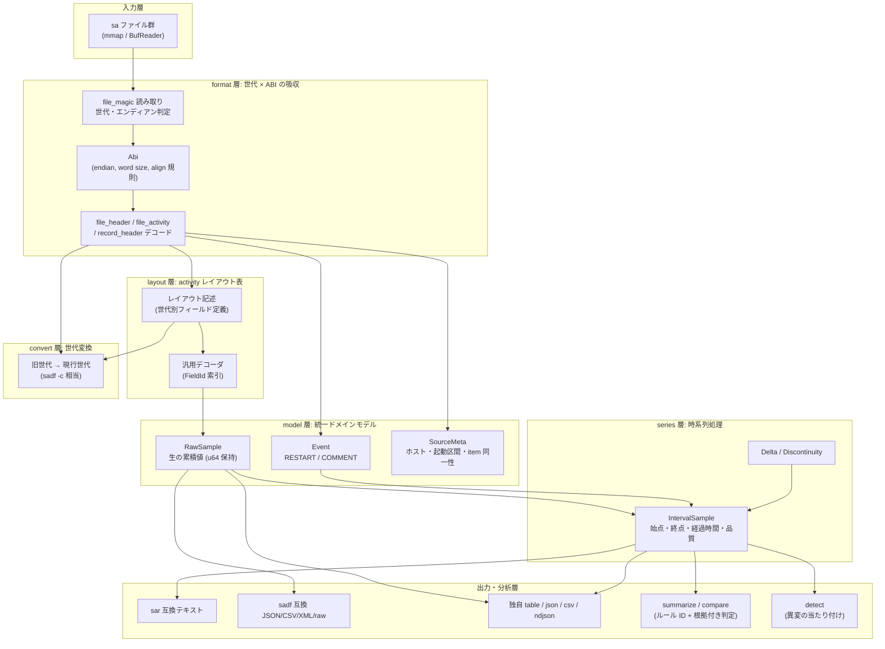
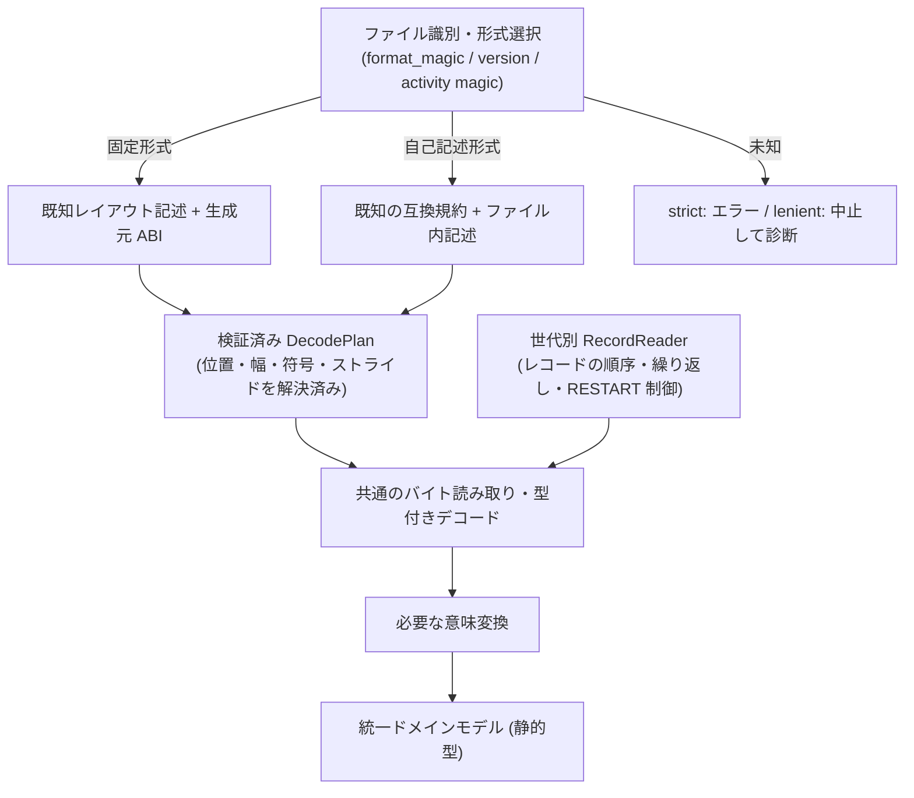
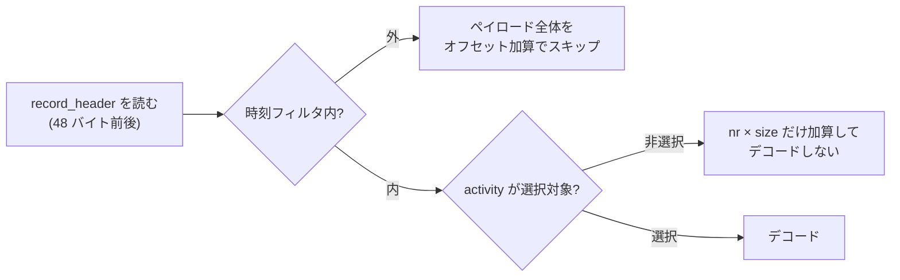

# reSARch 設計文書

`resarch` は、Linux の `sysstat` が生成するバイナリログ (`sa` ファイル) を、`sar` / `sadf` や
C ライブラリに一切依存せず単体で解析する Rust 製 CLI である。解析対象は sysstat v9 系から
v12 系までの全フォーマット世代、43 種の activity、little/big endian、32bit/64bit 生成ファイル。

この文書は実装の基準となる設計を定める。バイナリフォーマットそのものの仕様は
[`docs/format/`](format/) に分離してある。

- [`format/01-file-format.md`](format/01-file-format.md) — ファイル構造・世代判定・ABI 差
- [`format/02-activities.md`](format/02-activities.md) — 43 activity と統計構造体のレイアウト
- [`format/03-output-format.md`](format/03-output-format.md) — `sar` / `sadf` の出力書式と計算式
- [`format/04-test-data.md`](format/04-test-data.md) — 検証データとゴールデンテスト計画

---

## 1. 設計の前提となった事実

`sa` ファイルは「C 構造体をそのままディスクへ書いた」形式であり、次の 3 つが同時に変動する。

1. **フォーマット世代** — `format_magic` で識別される。世代ごとに `file_header` /
   `file_activity` / `record_header` のフィールド構成が異なる。
2. **生成ホストの ABI** — `sizeof(long)` が 4 か 8 か、エンディアンが LE か BE か。
   `__attribute__((aligned(8)))` / `aligned(16)` / `packed` が混在するため、
   同じ世代でも ABI が違えばフィールドのバイトオフセットが変わる。
3. **activity ごとの統計構造体** — sysstat のバージョン更新でフィールドが追加される。
   v12 系以降は「構造体の実サイズ」と「型別フィールド数」をファイル自身が記録する
   自己記述形式になり、未知バージョンでも読み替えが可能になった。

したがって「1 つの構造体定義でデコードする」ことは原理的に不可能であり、
**世代 × ABI × activity の 3 軸を明示的に扱う**設計が要求される。

### 1.1 実測による裏付け

sysstat 10.1.5 (`format_magic` = `0x2171`) で採取された実ファイルを、本設計の想定レイアウト
(`file_magic` 8 バイト固定、`file_header` 280 バイト、`record_header` 48 バイト、
`file_activity` 20 バイト) でデコードしたところ、**ファイル末尾までバイト単位で一致**し、
残余バイトは 0 だった。`aligned(16)` 由来のパディングを含めたオフセット計算が正しいことの確認である。

---

## 2. 層構造



`convert` 層だけが**書き手**である。他の層はすべて読み取り専用で、
`convert` も「読んだものを別世代の配置で書き直す」だけで値を変えない。
`upgrade_stats_*` に相当する activity ごとの変換関数は持たず、
**旧 revision の解決済みレイアウトから同名フィールドを引いて現行 revision の位置へ書く**
1 本の経路に畳んでいる (§3.1 の「軸の分離」がそのまま効く)。
意味が変わるものだけを明示的に扱う (`A_IRQ` の次元入れ替えと `irq_name` 生成、
`A_SERIAL` の `line` の基点、`A_MEMORY` の `availablekb` 代用)。

層の責務境界は次のとおり。

| 層 | 責務 | 責務でないもの |
|---|---|---|
| `format` | 世代判定、ABI 決定、固定ヘッダのデコード、レコード境界の確定 | 統計値の意味付け |
| `layout` | activity ごとのフィールド定義と汎用デコード | 差分計算、単位変換 |
| `model` | 生の累積値とイベントの保持、item 同一性の管理 | レート計算 |
| `series` | 差分・レート・不連続の判定 | 書式化 |
| `output` | 書式化のみ | 値の再計算 |
| `analyze` | 集計と説明可能な判定 | 書式化 (writer に委譲) |
| `detect` | 異変の当たり付け (観測の提示) | 断定、確率の提示、書式化 |
| `convert` | 別世代の配置で書き直す | 値の変更、単位換算 |

**出力層で値を計算しない**のが要点である。同じ指標を sar 互換テキストと JSON で出したとき、
形式ごとに計算がずれる事故を構造的に防ぐ。

---

## 3. 世代 × ABI の吸収

### 3.0 採る構成

**レイアウト記述を中核に据え、計画を作る経路だけを「固定形式」と「自己記述形式」の 2 つに分ける。**
世代ごとに独立したパーサを並べる方式は、レコードの順序制御と意味変換に限定して用いる。



**旧世代を「現行 sysstat のバイナリ配置」へ変換する経路は作らない。**
中間バッファへのコピーが増えるうえ、旧形式に存在しないフィールドをゼロ埋めすると
正常なゼロとの区別を失う。両経路から共通の読み取り計画を作り、
静的型のドメインモデルへ直接デコードする。

| 案 | 採る部分 | 全面採用しない理由 |
|---|---|---|
| 正規化変換 (本家方式) | 固定形式と自己記述形式で入口を分ける | 現行配置への変換は余分なコピーと現行配置への依存を生む |
| 世代別パーサ | 世代固有のレコード制御・意味変換 | 世代別に全 activity の読み取りを複製すると修正が分散する |
| レイアウト記述駆動 | フィールド配置・幅・互換な追加削除 | レコード制御や複雑な意味変換まで宣言化すると DSL が肥大化する |

### 3.1 組み合わせ爆発は軸の分離で抑える

「リリース × 4 ABI × 43 activity」を手書きで並べる必要はない。次の 4 軸に分ける。

| 軸 | 選ぶもの |
|---|---|
| 形式ファミリー | ヘッダ・レコードの構成 |
| activity の wire revision | フィールド列と値の解釈 |
| Layout ABI | 生成元の整数幅・アラインメント規則 |
| Endian | 整数読み出し時のパラメータ |

**エンディアンはオフセット表を増やさない。** 同一配置に対して
`from_le_bytes` / `from_be_bytes` を切り替えるだけで済む。

一方で **`sizeof(long)` とエンディアンだけで全ての C ABI 配置が一意に決まるとは扱わない**。
32bit ABI 間でも自然アラインメントが異なり得る。差が消えることを検証できた場合にのみ
同一配置へまとめる。

```rust
pub struct SourceEncoding {
    pub endian: Endian,
    pub layout_abi: LayoutAbiId,
}

pub struct LayoutAbi {
    pub long_bytes: u8,
    pub long_align: u8,
    pub u64_align: u8,
}
```

この ABI は**ファイルを生成したホスト**のものである。
実行中の Rust の `usize` / `size_of` / `c_ulong` から決めてはいけない。

レイアウトの共有は activity 単位で行う。変更のない activity は前の wire revision を参照し、
変更されたものだけ新しく定義する。差分継承を積み重ねるのではなく、
共通フィールドブロックを再利用して**最終配置を一覧で確認できる形**にする。

### 3.2 DecodePlan — 事前解決済みの読み取り計画

`DecodePlan` は、各フィールドの読み取り位置・整数幅・符号・構造体ストライドを解決済みにした表。
ファイルまたは activity の記述を読んだ段階で 1 度だけ構築し、同一配置の全サンプルで再利用する。
これは正確性のためだけでなく、**ホットパスからレイアウト解釈を追い出す性能上の要**でもある。

### 3.3 形式判定はレジストリで行う

分岐を `major >= 12` のようなバージョン比較に固定しない。
`format_magic`、必要な版情報、activity magic、記述されたサイズに基づく**形式レジストリ**で選ぶ。
世代区分は説明には使えるが、厳密な互換性判定とは別物である。

`sa_sizeof_long` を読むために ABI が必要になる形式では、形式ごとの bootstrap 手順を持つ。
候補 ABI を試す場合、**複数候補が成立したら曖昧として扱う**。都合のよい候補を選ばない。

自己記述情報は、フィールド名や単位まで記した完全なスキーマではない。
型群ごとの個数と実サイズ、activity ID、互換性を表す magic があるだけである。
したがって「個数とサイズが読めるから未知の意味も読める」とは判断しない。
自己記述側の計画生成器は、既知の型群の並び方と追加規約に従って**既知フィールドを配置する**。
型の値幅とファイル内の占有幅は別概念として扱い、`個数 × sizeof(long)` のような
一般式だけで配置を決めない。

### 3.4 将来形式への耐性は範囲を限定する

| 将来の変更 | 対応方針 |
|---|---|
| 既知の互換規約内でフィールド数が増える | 既知フィールドを継続して読む (コード変更なし) |
| 既知の意味のまま配置だけ変わる | レイアウト宣言の追加と再ビルド |
| 新 activity・新しい意味のフィールド | 型とメタデータの定義追加 |
| レコード構成・圧縮方式・値の意味が変わる | Rust の処理追加 |

**外部データを差し替えるだけで任意の将来形式を読む機構は過剰設計**として採らない。
静的型に未知の名前付きフィールドを足すことと両立しないためである。
未知領域のスキップも、その長さを信頼できる場合に限る。

### 3.5 アラインメントは規則から計算し、独立した期待値で固定する

```text
field_offset = align_up(previous_end, effective_field_alignment)
field_end    = field_offset + field_storage_size
struct_size  = align_up(last_field_end, effective_struct_alignment)
```

`effective_field_alignment` は、生成元 ABI・フィールドの `aligned` 指定・
構造体/フィールドの `packed` 指定から決める。
`packed` を見て一律に 1 とする扱いはしない。組み合わせ規則を明示する。

実測した v10.1.5 の `record_header` はこの規則で表現できる。

| フィールド | オフセット | 読むバイト数 |
|---|---:|---:|
| `uptime` | 0 | 8 |
| `uptime0` | 16 | 8 |
| `ust_time` | 32 | 4 または 8 |
| `record_type` | 40 | 1 |
| `hour` / `minute` / `second` | 41 / 42 / 43 | 各 1 |
| 構造体サイズ | — | 48 |

32bit では `ust_time` の後 (36〜39) が穴になる。
**64bit と同じオフセットでも読む幅が違う**ことを表現できている必要がある。
padding の内容は、形式が要求しない限りゼロと仮定しない。

人手による明示オフセットは、通常の定義には使わず次の 2 用途に限定する。

1. 規則で表せない、根拠のある歴史的例外。
2. 規則の計算結果を検査するための独立した期待値。

全フィールドについて範囲・重複・整列・構造体サイズを検証し、
件数との乗算を含むサイズ計算は checked 演算にする。
`repr(C)` / `repr(packed)` 構造体へファイルのバイト列を直接キャストする必要はない。

### 3.6 単一定義から生成する

数百〜千規模のフィールド定義を「構造体定義」と「レイアウト表」で二重管理すると必ず食い違う。
**Rust の宣言的マクロを正本**とし、そこから次を生成する。

| 生成物 | 内容 |
|---|---|
| 名前付き構造体 | 型付きのドメインフィールド |
| `FieldId` | 列選択・前回値保持の索引 |
| 列メタデータ | 公開名・単位・`Counter`/`Gauge`・集計方法 |
| wire layout の `const` 記述 | revision ごとのフィールド列と整列指定 |
| デコード関数 | 検証済み `DecodePlan` を使って構造体を作る |

wire 側の記述はドメインフィールド名を参照するだけで、
Rust 型・公開名・単位を再定義しない。
各 revision について、**すべてのドメインフィールドが「読み取り」「未提供」「変換」の
いずれかに一度だけ割り当てられること**をマクロ展開時に検証する。

宣言の概念例 (実在の activity 配置ではない):

```rust
activity_schema! {
    pub struct ExampleCounters {
        requests: Availability<u64> {
            column: { public_name: "requests", unit: Count, kind: Counter, aggregation: Sum },
        },
        errors: Availability<u64> {
            column: { public_name: "errors", unit: Count, kind: Counter, aggregation: Sum },
        },
    }

    wire Legacy {
        struct_align: 8;
        fields: [ requests: CUnsignedLong => at_least(8) ];
        absent: [errors];
    }

    wire Current {
        struct_align: 8;
        fields: [ requests: U64 => at_least(8), errors: U64 => at_least(8) ];
    }
}
```

生成されるデコード関数はおおむね次の形になる。

```rust
impl ExampleCounters {
    fn decode(bytes: &[u8], plan: &ExamplePlan) -> Result<Self, DecodeError> {
        Ok(Self {
            requests: plan.requests.read_u64(bytes)?,
            errors: plan.errors.read_u64(bytes)?,
        })
    }
}
```

`read_u64` は wire 上の幅からゼロ拡張し、存在しない項目には `UnsupportedBySource` を返す。
必要なバイトが足りなければ切断エラー。**カウンタの元のビット幅はメタデータとして残し**、
後段の差分計算 (ラップ判定) へ渡す。

意味変換が必要なフィールドだけ、名前付き Rust 関数を宣言から参照させる。
計算式や条件分岐をマクロ言語へ取り込まない。

### 3.7 実測で確定した世代の系譜

実装と検証を通じて確定した対応表。本家由来の世代は本家のテストデータおよび
実ファイルのバイト列で裏取りしてある。ベンダー派生 (`0x1170`) だけは本家に
テストデータが存在しないので、裏取りの根拠が違う (下記)。

| `format_magic` | 導入バージョン | file_magic | file_header | file_activity | record_header | RESTART ペイロード |
|---|---|---:|---:|---:|---:|---|
| `0x2170` | 〜9.1.5 | 8 | 280 | 12 | 48 | なし |
| `0x1170` | 9.0.4 (RHEL/CentOS 6.5 以降) | 8 | 280 | 12 | 48 | なし |
| `0x2171` | 9.1.6〜10.2 | 8 | 280 | 20 | 48 | なし |
| `0x2173` | 10.3〜11.6 | 76 | 288 | 20 | 48 | volatile activity リスト |
| `0x2175` | 11.7〜12.8 | 76 | 328 / 336 | 36 | 24 | CPU 数 (4 バイト) |

`0x215c` / `0x2172` / `0x2174` は欠番で、どのリリースでも使われていない。

**`0x1170` は本家のどのリリースにも存在しないベンダー派生である。**
Red Hat が自社パッチ (`sysstat-9.0.4-sa-bump.patch`) で振り直した magic で、
ヘッダ 4 構造体は `0x2170` と完全に同一、差は `A_IO` (`stats_io`) が
20 バイトではなく 80 バイトである点だけ。経緯と実測の根拠は
[`format/01-file-format.md`](format/01-file-format.md) §2.7 にある。

裏取りは本家データではなく、(1) 配布元 SRPM の 43 パッチを適用した実ソースから
全統計構造体の `sizeof` を実測し、(2) 実ファイルの `file_activity.size` 全件と
突き合わせ、(3) 全レコードを走査して `exact=true` (残余 0 バイト) を確認する、
という 3 段で行う。実ファイルとその出力はリポジトリに持ち込まないので、
回帰テストは自作 fixture で行う (§8.1)。

**`0x2175` の中にさらに 3 変種がある。**

| sysstat | `header_size` | `hdr_types_nr` | `rec_types_nr` | 差 |
|---|---:|---|---|---|
| 11.7.1〜12.1.6 | 328 | (1, 1, 11) | (2, 0, 0) | `extra_next` なし |
| 12.1.7 | 328 | (1, 1, 12) | (2, 0, 1) | `extra_next` 追加 |
| 12.2.0〜12.8 | 336 | (1, 1, 12) | (2, 0, 1) | `sa_tzname` 追加 |

11.7.1〜12.1.6 と 12.1.7 は **`header_size` が同じ 328 でありながら中身が違う**。
`record_header` も同様に両方 24 バイトである。
したがって申告サイズだけでレイアウトを判別してはならず、型別個数の参照が不可欠。

### 3.8 実装中に判明した仕様の要点

いずれも当初の想定と食い違い、実データで訂正したもの。

| 項目 | 誤りやすい理解 | 実際 |
|---|---|---|
| `unsigned long` の幅 | 32bit では 4 バイト占有 | **常に 8 バイトのスロット**を占め、有効値は先頭 4 バイトだけ。これにより構造体サイズが 32/64bit で一致する |
| `extra_desc` チェーンの位置 | `file_activity[]` の前 | **後** |
| 1 item のストライド | 構造体定義から計算 | **常に `file_activity.size` の申告値**。旧版の `A_HUGE` は別構造体のサイズが書かれている |
| `MAP_SIZE` の判定 | 申告サイズと一致 | **`MAP_SIZE <= 申告サイズ`**。末尾の文字列やパディングは数えないので等号にならない |
| `0x2173` の RESTART | ペイロードなし | `sa_vol_act_nr` 個の activity リストが続き、**各エントリの `nr` で以降の item 数が変わる** |
| 拡張レコード種別 (5〜15) | 未知種別として統計扱い | `0x2175` では統計を伴わない拡張レコード。16 以上は無効。旧世代には存在しないので統計扱いで正しい |
| item 数の上限 | 汎用上限で十分 | activity 別の `nr_max` が必要 (汎用上限だけでは細工ファイルが通る) |
| activity revision の選択 | activity magic で決まる | **magic だけでは決まらない。** 同じ magic のまま構造体サイズが変わった版がある (`A_CPU` の magic `0x8a` には 144 バイト版と 160 バイト版)。型別個数 → magic + 申告サイズ → 申告サイズ → magic の順に絞る |
| 申告サイズを超えるフィールド | 起こらない | 起こる。選んだ revision が申告サイズより大きい場合、超える位置は読まず `UnsupportedBySource` にする (読むと隣の item やファイル末尾を踏む) |
| `file_activity.nr` | 実際の item 数 | **採取時に確保した枠数**。レコードごとの item 数を持たない世代では空き枠が残り、素直に回すと「名前の無いデバイス」「`dev0-0`」が行になる |
| CPU 数の在処 | `file_header` にある | `sa_cpu_nr` / `sa_last_cpu_nr` が入ったのは `0x2173` 以降。それより前は**`A_CPU` の `file_activity.nr`** が唯一の手掛かり |
| ファイル日付の在処 | `sa_day` / `sa_month` / `sa_year` | 表示に使うのは **`sa_ust_time`** を現地時刻に直したもの。ヘッダの日付フィールドを使うのは `-t` のときだけで、本家のテストデータは**両者を意図的に食い違わせている** |
| activity magic の不一致 | 読めないので拒否 | 拒否はしない。**既知 ID かつ magic 不一致**のものに「形式不明」の印が付き、`sar` はそのブロックを出さない。未知 ID にはこの印が付かない (両者を混ぜると診断が読めなくなる) |

§3.8 の最後の 4 行は **本家の期待出力との全文比較で初めて判明したもの**である
(静的な仕様照合では出てこなかった)。経緯は Issue #4 に残してある。

#### 未使用スロットの番兵

本家は item 数を数え直すのではなく、各 `print_*_stats()` の先頭で activity 固有の番兵を見て
その行を飛ばす。`series::compute::is_unused_item()` がその表である。

同じ番兵は `sadf -c` の件数決定 (`count_stats_*`) にも現れる。
[`format/01-file-format.md` §5.9](format/01-file-format.md) がそちらの表で、
**変換時に数え直す 6 個**と、**表示時にオフライン CPU を飛ばす 2 個** (`A_PWR_CPU` / `A_NET_SOFT`)
を合わせたものが下表になる。

| activity | 未使用の条件 |
|---|---|
| `A_DISK` | `major + minor == 0` |
| `A_FS` | `f_blocks == 0` |
| `A_NET_DEV` / `A_NET_EDEV` | インターフェース名が空 |
| `A_NET_FC` | `fchost_name` が空 |
| `A_SERIAL` | 旧世代は `line == 0` (1 始まり)、11.7.1 以降の未変換ファイルは `line == UINT_MAX` (0 始まり)。upgraded マーカーを持つ変換済みファイルは旧基点を保つ |
| `A_PWR_USB` | `bus_nr == 0` |
| `A_PWR_CPU` | `cpufreq == 0` (オフライン) |
| `A_NET_SOFT` | CPU ごとの全 6 フィールド (backlog を含む) が 0。前値 0 の新規 CPU は次の区間まで表示しない |

**この表を使うのは `sar` / `sadf` 互換出力だけ**である。独自出力は空き枠も観測結果として出す。
「本家が表示を省く規則」を独自形式に持ち込むと、値が消えた理由を説明できなくなる。

---

## 4. 値の表現 — 欠落とゼロを混同しない

```rust
pub enum Availability<T> {
    Present(T),
    UnsupportedBySource,   // その世代のファイルには存在しないフィールド
    MissingInSample,       // 存在するが当該レコードで取得できていない
}

pub struct Counter {
    pub value: u64,        // 累積値は u64 のまま保持する
    pub bits: CounterBits, // B32 | B64 (ラップ判定に使う)
}
```

未提供フィールドを 0 として扱うと、平均・p95・ボトルネック判定が静かに誤る。
「正常な 0」「その世代では未提供」「当該レコードで欠落」を型で区別する。

累積値を早期に `f64` へ落とさない。大きなカウンタで差分精度が失われる。

---

## 5. 差分・レート — series 層に集約

```rust
pub enum Delta {
    Valid(u64),
    Wrapped(u64),
    Unavailable(Discontinuity),
}

pub enum Discontinuity {
    FirstSample,          // 基準となる前サンプルが無い
    Restart,              // RESTART レコードを挟んだ
    ItemReplaced,         // デバイス名の再利用や CPU のオンライン変化
    NonPositiveElapsed,   // 経過時間が 0 以下
    AmbiguousDecrease,    // 減少したがラップとは断定できない
}
```

カウンタの減少を一律にラップと解釈してはいけない。32bit カウンタの一周として解釈するのは、
起動区間と item の連続性が確認できる場合に限る。長い観測間隔で複数回ラップした可能性は
2 点だけからは復元できないため、`AmbiguousDecrease` として報告する。

`IntervalSample` は終点時刻だけでなく **始点・終点・経過時間・品質情報**を持つ。
時刻フィルタ (`-s` / `-e`) では、開始時刻の直前のサンプルを基準値として保持する。
これを先に捨てると最初の表示区間が計算できなくなる。

計算規則はフィールド種別ごとに異なる。

| 種別 | 計算 |
|---|---|
| 一般カウンタ | 差分 ÷ 経過時間 |
| CPU 割合 | 対応する CPU 時間カウンタの差分比 (オフライン CPU の扱いを含む) |
| ゲージ (メモリ量など) | 差分化しない |
| 派生指標 | 複数カウンタからの専用計算 |

---

## 6. 性能方針

解析速度は要件である。次を設計段階から組み込む。

### 6.1 読まないものは読まない



- 時刻フィルタの範囲外レコードは `record_header` だけ読んで本体をスキップする。
- 選択されていない activity は `nr × size` を加算するだけでデコードしない。
  1 レコードに 15〜43 activity が並ぶため、`-u` だけを見る場合の削減効果が大きい。
- レコード境界はヘッダ情報から決定的に計算できるので、走査のための探索は不要。

### 6.2 メモリとコピー

- 入力の読み方は**ファイルサイズで選ぶ** (既定 `MmapPolicy::Auto`、閾値 8 MB)。
  実測では 979 KB のファイルで `read` が 66 µs、`mmap` が 179 µs と
  **`read` が 2.7 倍速い**。小さいファイルでは `mmap` のセットアップ
  (システムコール + ページフォルト) が 1 回の `read` より高くつく。
  十分大きいファイルではバッファへのコピーが無い `mmap` が有利になる。
  `--no-mmap` で `read` を強制できる (採取進行中のファイル向け)。
- 文字列フィールド (デバイス名・インターフェース名) は `&[u8]` のまま扱い、
  出力直前まで `String` を作らない。
- item ごとの前回値保持は `FieldId` 索引の固定長配列。`HashMap<String, f64>` をホットパスに置かない。
- **スナップショットの `Vec` はレコード間で使い回す。** 毎レコードで確保し直すと、
  144 レコード × 15 activity × item 数 の確保が発生する。
  値は item のバッファへ直接デコードし、中間バッファからのコピーも省く
  (この 2 点で全 activity デコードが 449 µs → 238 µs になった)。

### 6.3 並列化

1. 各ファイルのヘッダだけを先に読み、ホスト・時間範囲・世代を把握する。
2. **ファイル単位**で rayon 並列デコードする (activity 単位では並列化しない)。
3. 同一ホストのレコードを決定的順序でマージする。
4. 差分計算はホスト・起動区間ごとの処理器が担当する。
   **差分をファイル単位で完結させない** — 日境界で連続性が確認できる場合、
   前ファイルの最終値を次ファイルへ引き継ぐ。
5. writer は 1 つに集約し、出力を直列化する。

全結果を `collect` せず、同時処理ファイル数とキュー容量に上限を設ける。

### 6.4 出力

- `stdout` は `BufWriter` で包み、ロックは 1 回だけ取得する。
- 行単位のストリーミング出力。全レコードを溜めてから出力しない
  (サマリのように全走査が必要な場合を除く)。

### 6.5 計測

`benches/decode.rs` (criterion) で次を継続的に計測する。

| ベンチ | 測るもの |
|---|---|
| ヘッダのみ | ファイルあたりの固定コスト |
| 全 activity デコード | スループット (MB/s) |
| 単一 activity 選択 | スキップ最適化の効果 |
| 時刻フィルタ適用 | レコードスキップの効果 |
| 複数ファイル横断 | 並列化の効果 |

「速くなったつもり」を排除するため、最適化は必ずベンチ差分を添えて入れる。

#### 実測値 (979 KB / 144 レコード / 15 activity、macOS + Apple Silicon)

| ベンチ | 時間 | スループット |
|---|---:|---:|
| ヘッダ解析のみ (`Auto` = read) | 65.4 µs | 13.9 GiB/s |
| ヘッダ解析のみ (`mmap` 強制) | 177.5 µs | 5.1 GiB/s |
| レコード境界の走査のみ | 9.15 µs | 99.7 GiB/s |
| 全 activity デコード | 269.9 µs | 3.4 GiB/s |
| CPU のみデコード | 96.9 µs | 9.4 GiB/s |
| 全 activity デコード (後半のレコードだけ) | 145.2 µs | — |

読み取り方の選択で **-62%**、スナップショットのバッファ再利用で **-47%**。
activity 選択による読み飛ばしは全件デコードに対して **2.8 倍**速い。
走査範囲を後半に限ると **53.8%** の時間になる (レコード数にほぼ比例 =
範囲外を本当にデコードしていない)。

> **この表は 979 KB の実データに対するもの**で、`make fixtures` の既定対象
> (`data-11.6.5`、38 KB) とは別の系列である。ベンチ名に対象ファイル名とバイト数を
> 入れてあるので、対象が変われば criterion のベースラインも別系列になる
> (以前は fixture を 1 本足して `bench_target()` の選択が変わり、
> 38 KB と 979 KB の測定が同じ名前で比較されて「-80% 改善」という
> 無意味な数字が出ていた)。

#### 正確性の修正が性能に与えた影響

外部レビューで指摘された「別 item のバイトを統計値として読み得る」問題を直すため、
読み取りを item 単位に切り出した `ItemView` 越しに限定した。
この安全性と引き換えに、全 activity デコードは 238 µs → 316 µs (+33%) に落ちた。

そこで「読むのか / 文字列なのか / このファイルには無いのか」の判定を
**計画の段階で 1 度だけ**行い、デコード結果の初期値テンプレートと
実際に読む位置の表へ畳んだ (`fold_field_plans`)。
ホットループからフィールドごとの分岐が消え、316 µs → 270 µs (-12.7%)、
CPU のみでは -28.3% まで戻っている。

差し引き 32 µs (13%) が「item 境界を構造的に越えられなくした」ことのコストで、
これは正確性のために受け入れる。レコード境界の走査が 7.4 µs → 9.3 µs になっているのも、
レコード内で更新される item 数を activity 別上限で検証するようにしたためである。

#### 区間 × activity の走査回数

`sar` 互換出力は本家と同じく「区間 (`LINUX RESTART` 区切り) を外側、activity を内側」に
入れ子で回す (§8.2 / `03-output-format.md` §2.1 の 2″)。素朴に実装すると走査回数が
**区間数 × activity 数**になり、RESTART が多いファイルで無駄が線形に増える。

本家は各 activity で区間の先頭 (`fpos`) へ**シークし直す**ので、1 回の走査が読むのは
その区間のレコードだけである。同じ状態を作るために `walk_items_in` に走査範囲
([`RecordRange`](../src/series/snapshot.rs)) を渡せるようにし、**範囲外のレコードは
デコードもしない**ようにした。総デコード量は区間数に依存せず
「activity 数 × 全レコード」に収まる。

範囲の添字は「通知されるレコードの通し番号」で、拡張レコードは番号を消費しない。
走査ごとに番号が揺れると区間の切り方が壊れるので、そこは
`record_range_limits_what_is_visited` で固定している。

番号の管理自体にもコストがある。レコードごとの加算と 2 回の比較で
全 activity デコードが 269.9 → 286.5 µs (+6.2%) に落ちたため、
**範囲が全件なら番号を数えない**ようにして戻した (既定経路の `walk_items` は
比較相手を持たないので数える必要がない)。1 件あたりでは些細な処理でも、
「区間 × activity × レコード」で効いてくる。

---

## 7. 壊れたファイルへの態度

既定は **strict**。解析結果を運用判断や AI が使うため、疑わしい値を黙って出さない。
ただし **未知の機能と破損は別**であり、境界が確実な未知 activity のスキップは
「回復処理」ではなく正常な前方互換として扱う。

| 状況 | 既定 (strict) | `--lenient` |
|---|---|---|
| 最終レコード途中で EOF | エラー | 完全なレコードまで返し、不完全と報告 |
| 未知の `format_magic` | エラー | 当該ファイルの解析を中止 |
| 既知 activity と矛盾するサイズ | エラー | 境界が確実な場合だけ対象をスキップ |
| item 数・総バイト数が上限超過 | エラー | 上限は緩めない。安全にスキップ不能なら中止 |
| レコード境界を失う破損 | エラー | 当該ファイルの解析を中止 |
| スキップ可能な未知 activity | 診断付き継続 | 同じ |

- データは `stdout`、診断は `stderr`。
- 部分結果になった場合は `--lenient` でも非ゼロ終了する。
- 互換出力 (sar / sadf) に独自の警告フィールドを混ぜない。
- バイト列からヘッダらしきパターンを探して再同期する方式は採らない。
  誤検出した値が正常な統計に見えてしまう。
- `size × count` は checked 演算で計算し、確保前に残バイト数と照合する。
  上限は item 数だけでなく activity 数・レコードサイズ・ファイル処理量にも設ける。

ストリーミング出力では strict でもエラー検出前の出力が残る。
「strict = stdout が全件原子的」ではないことを仕様として明記する。

---

## 8. テスト戦略

4 系統に分ける。

| 検証 | 目的 | 配置 |
|---|---|---|
| 独自最小 fixture | ABI 幅・エンディアン・境界条件を狙い撃つ | リポジトリに同梱 (自作なので MIT) |
| 本家実データ + 参照出力 | 実レイアウトと表示意味の検証 | CI 実行時に取得 (GPL のため非同梱) |
| 破損・fuzz | パニック・過大確保・無限ループの防止 | リポジトリに同梱 |
| メタモルフィック | 入力変換に対する結果の関係を検証 | リポジトリに同梱 |

**fixture 生成器を本体と同じレイアウト記述から作ると、同じ誤りが往復して通る。**
単一定義から作った fixture が有効なのは、デコード経路の網羅とランダム値の往復検査まで。
配置そのものの正しさは検証できない。

そこで **独立させるのは「期待値の出所」** とする。

| 検証対象 | 独立した証拠 |
|---|---|
| オフセット・サイズ | 対象タグの本家 C ヘッダから、対象 ABI で得た `offsetof` / `sizeof` |
| バイト順・値幅・padding | 本家 C 構造体へ識別しやすい値を入れて出力したバイト列 |
| ファイル全体の構成 | 対象版の `sadc` が生成した実ファイル |
| 値と意味 | 対応版 `sadf` の出力と、独立した算術検査 |

C のレイアウト検査はホスト環境だけでは不足する。対象 ABI へのクロスコンパイル結果や
エミュレータ上での出力を証拠とし、**本家ヘッダのタグ/コミット・対象 triple・
コンパイラ・生成手順を fixture と一緒に記録**する。

実測で得た「file_magic 8 バイト / file_header 280 バイト / record_header 48 バイト」も
独立した期待値として固定する。ただし総サイズだけでは内部の穴の誤りを見逃すため、
主要フィールドのオフセットと既知値も併せて検査する。

有用な性質検証:

- 同一の値を LE / BE で表現しても正規化結果が一致する。
- カウンタ両端に同じ定数を足しても、オーバーフローが無ければレートが変わらない。
- 連続した系列を 2 ファイルに分割しても、連結後の結果が一致する。
- 切り詰め入力から、完全な元レコードと異なる「正常に見える値」を生成しない。

本家との比較は 2 段階で行う。

- **意味比較** — JSON / XML を解析して値・単位・item 対応を比較。
- **表記比較** — ロケール・タイムゾーン・端末条件を固定して、列順・丸め・空白まで比較。

CI では取得対象のタグとチェックサムを固定し、`ubuntu-latest` の更新で基準が動かないようにする。

### 8.2 全文比較 — 何をマスクしてよいか

表記比較は `tests/conformance.rs` の `golden_outputs_match_upstream` が担う。
本家の期待出力と reSARch の出力を 1 行ずつ突き合わせ、
**全文一致 / N 行マスクして一致 / 不一致 / 比較不能** をケースごとに集計する。

対象は本家テストが**静的に持っている**期待出力すべて (21 件)。
`sadc` が生成する `data.tmp` に依存するケースは入力を再現できないので対象外である。

| 系統 | 件数 | 何を見るか |
|---|---:|---|
| `sar` テキスト | 11 | 4 世代 × BE/32bit × 未知 id/magic。列順・丸め・空白・イベント行の位置 |
| `sadf -H` | 4 | ヘッダ解析と activity 一覧 (`[Unknown format]` の付け方) |
| `sadf -d` / `-p` / `-r` / `-j` / `-x` | 5 | 同じ入力・同じ activity 選択で**形式だけ**を変えた 5 本。単位換算やゼロ補完の不統一はこの横並びで初めて見える |
| `sadf -g` (SVG) | 1 | 独自描画のため全文比較対象外 (毎回集計に出す)。値・選択・欠測と再起動の線切断は `tests/svg.rs` で別に検証 |

プロセスは起動しない。`sar` の引数列を CLI 層の解釈器に通してから出力層を直接呼ぶ。
理由は 2 つある。

- 差分が出たとき、CLI 層の引数解釈と出力層の書式のどちらが原因かを切り分けずに済む
- `TZ` / `LC_ALL` に頼らずに時刻基準を指定できる (本家テストの `TZ=GMT` は `TimeStyle::Utc`)

本家の期待出力には、**ファイルの中身だけでは原理的に再現できない値**が混じる。
こうした箇所は行ごと捨てるのではなく、**その語 (または固定幅の 1 列) だけを置換**して
残りを全文比較する。置換した箇所は理由つきで記録し、報告に必ず出す。

| マスク | なぜ再現できないか |
|---|---|
| `A_DISK` のデバイス名列 | `major:minor` を**実行ホストの `/dev` / `/sys`** で解決した結果。`sa` ファイルには major/minor しか入っていない。他ホストのファイルに誤名を出さないよう、reSARch はあえて `dev<major>-<minor>` のまま出す |
| `sadf -H` の `Host:` 行の日付 | `localtime(sa_ust_time)` 由来で読み手の TZ に依存する |

**「実装が面倒」「値が合わない」はマスクの理由にならない。**
マスクは不一致だった行にだけ試すので、一致している行の検証が薄まることはない。
出力形式そのものが無いケース (`sadf -g` の SVG) だけは「比較不能」として集計し、
失敗にはしないが毎回目に見える形で残す。

### 8.1 実データの取り扱い

運用中のホストから採取した `sa` ファイルは `nodename` などにホスト名が埋め込まれている。
**実データおよびその出力例をリポジトリ・コミットメッセージ・ドキュメントへ持ち込まない。**
ローカル検証専用とし、公開物に載せる出力例は自作 fixture から生成する。

---

## 9. CLI 構成

独自機能はサブコマンド、互換動作は明示的な入口として分離する。

```sh
# 独自形式での閲覧
resarch show sa01 sa02 --activity cpu,disk --format table

# AI エージェント向け (生値と派生値を別名前空間で出す)
resarch show sa01 --format ndjson --values both

# 期間集計・ボトルネック判定
resarch summarize sa01 sa02 --format json

# 異変の当たり付け (いつ・何に異変があったか)
resarch detect sa01

# ホスト比較
resarch compare --host app1=app1/sa01 --host app2=app2/sa01

# 対話的に閲覧する (TUI)
resarch tui sa01

# どの世代・どのバージョンが書いたファイルか (読めない世代でも答える)
resarch identify sa01 sa02

# ヘッダのみ
resarch info sa01

# sar 互換入口
resarch sar -u -P ALL -s 09:00:00 -e 18:00:00 -f sa01

# sadf 互換入口
resarch sadf -j sa01

# 旧世代 → 現行世代の変換 (バイナリは stdout、進捗は stderr)
resarch sadf -c sa01 > sa01-current
```

### sa バイナリから sar テキストへの書き出し

`resarch sa2sar <FILE> [-o <OUTPUT>] [--utc] [--no-mmap]` は
`sar -A -C -t` の選択・描画を再利用し、全項目・平均・RESTART・COMMENT を出す。
既定の時刻基準は採取元の記録時刻、`--utc` は実行環境に依存しない UTC。
これは CLI から output への書き出しであり、バイナリ世代を変える convert 層は通らない。

`-o` 省略または `-` は標準出力。ファイル保存は出力先と同じディレクトリの
一時ファイルへストリーミングし、全件成功と flush の後に上書きなしで公開する。
入力破損・出力失敗では非ゼロ終了し、不完全な保存先ファイルを残さない。
CI は自作 fixture による時刻・内容・保存失敗の検証に加え、CLI が生成したファイルを
5 本の本家 golden (旧世代 3 本・現行・big-endian) と比較する。未取得は失敗とし、
ディスク名以外の差は許容しない。本家データ・期待出力は target 以下にのみ取得する。

### 9.0 `--from` / `--to` はサブコマンドで意味が違う

同じ名前のオプションだが、**何を絞るか**が違う。`--help` に書き分ける。

| サブコマンド | 絞るもの |
|---|---|
| `show` | 表示する行 |
| `summarize` / `compare` | **集計期間そのもの**。範囲外は平均・p95・差分合計に入らず、期間の端点も縮む |
| `detect` | **報告範囲だけ**。比較基準の材料は絞らない (`--baseline-scope` が別に決める) |

`detect` だけ違うのは、狭い調査範囲の外から比較材料を取る必要があるためである
(「9 時から 10 時に何かあった」を調べるとき、比較相手は前日の同時刻や
当日の他の時間帯にある)。§11.2 の規律 3 と対になっている。

独自コマンドの `hh:mm[:ss]` は **`--timezone` の基準 (既定は実行環境のローカル) の
毎日の時刻**として比較する。日跨ぎの判定も同じ基準へ揃え、採取ホストのローカル時刻の
巻き戻りを使わない。
範囲に最初に合致したサンプルは差分の基準として消費し、表示しない。
1 ファイルが日付を跨ぐことがあるので、初日の絶対時刻へ解いてはいけない
(解くと初日の `--to` で走査が止まり、以降の全日が落ちる)。

`sar` / `sadf` の文法は独自サブコマンドと別のパーサとして実装する。
clap の derive 一つに全互換文法を押し込まない。

### 9.0.1 時刻の基準は 1 箇所で決める

独自サブコマンド (`show` / `summarize` / `detect` / `compare` / `tui`) は
`--timezone <TZ>` (`local` 既定 / `utc` / IANA 名) を持ち、`--utc` はその別名とする
(同時指定はエラー)。`info` / `identify` には持たせない。ファイルヘッダに書かれた値を
そのまま出すコマンドであり、読み手のタイムゾーンで開き直す対象がないためである。

**表示・`--from` / `--to` の比較・`detect` の報告範囲の日内境界を、同じ基準から導く。**
片方だけ動かすと、画面に出ている 09:00 と `--from 09:00` が別の時刻を指す。
基準を `model::timezone` の 1 型に集め、各出力がそれぞれ独自に解釈しない構造で防ぐ。

タイムゾーン名は **IANA 名 (`Asia/Tokyo`)**、特定できない環境では**数値オフセット
(`+09:00`)** を出す。略称 (`JST` / `CST`) は使わない。重複する略称があるうえ、
夏時間の切り替え日に同じ壁時計が 2 度現れたときに区別できないためである。
なお epoch → 現地時刻の変換は常に一意で、「存在しない時刻」「2 回ある時刻」は
*現地時刻 → epoch* の向きでしか起きない。`hh:mm[:ss]` を絶対時刻へ解かず毎日の
壁時計として比べる方式は、この問題自体を避けている。

**機械可読形式 (json / ndjson / csv) の `start_epoch` / `end_epoch` は epoch 秒のまま
変えない。** 下流が既に持っている解釈を、表示の都合で壊さないためである。ただし
`detect --format json` / `--format ndjson` には `report_timezone` を足す。
`--from` / `--to` をどの壁時計として読んだかは、報告範囲を再現するために必要な
メタ情報であり、epoch では表せない。

**互換出力 (`sar` / `sadf` / `sa2sar`) はこの基準を使わない。** 本家 sysstat の規則
(`sar` の既定は読み手のローカル、`sadf` の既定は UTC、`-t` は記録時刻) は
`output::sar_text::TimeStyle` と `output::sadf::TimeBase` が持つ。§9.1 の
「計算・出力互換」は本家との全文一致で測る約束なので、独自側の都合で動かせない。

### 9.1 「sar 互換」を 3 つに分けて宣言する

| 互換の種類 | 意味 |
|---|---|
| 入力互換 | どの世代の `sa` ファイルを読めるか |
| 計算・出力互換 | どのバージョンの `sar` / `sadf` と表示が一致するか |
| CLI 互換 | どのオプションと呼び出し方を受け付けるか |

reSARch は**採取しない**。リアルタイム採取 (`sadc` 相当) は対象外。
書き出すのは「読んだファイルを別世代の配置で書き直したもの」(`convert` 層) だけで、
値は変えない。この区別を README で明示する。

**入力ファイルの世代と、再現する出力仕様の世代は別の設定**として管理する。
v10 のファイルを v12 の `sar` 書式で出すことも、その逆も指定できる形にする。

---

## 10. 対応状況の管理

「対応した/していない」を単一の真偽値にしない。activity ごとに 4 軸で管理する。

| 軸 | 意味 |
|---|---|
| デコード可能 | バイト列を正しく読める |
| 意味モデル対応 | 単位・種別 (counter/gauge) を含めてモデル化済み |
| 派生指標対応 | レート・割合の計算規則を実装済み |
| 表示検証済み | `sar` / `sadf` の出力と突合済み |

README はこの 4 軸の現在の範囲と検証の限界を掲載する。revision ごとの対応は
`format/02-activities.md` とレイアウト定義、表示検証は conformance / 回帰テストを根拠にする。
レイアウトの登録だけでは本家出力との一致を保証できないため、表示検証済みの判定を
レイアウトから自動生成しない。

### 10.1 世代の対応も単一の真偽値にしない

activity と同じく、世代の「対応」にも段階がある。**「識別できる」と「読める」は別物**である。

| 段階 | 意味 | 現在の範囲 |
|---|---|---|
| 識別 | どの世代のファイルか判定でき、診断に出せる | `0x115a` 〜 `0x2175` (登録済みの全世代) |
| ヘッダ解釈 | 採取日時・ホスト・記録されている統計の一覧を読める | `0x1170` / `0x2170` 以降 |
| レコード走査 | レコード境界を確定でき、末尾まで余りなく読める | 同上 |
| 統計デコード | 各 activity の値を取り出せる | 同上 |
| 世代変換 (`sadf -c`) | 現行世代へ書き直せる | `0x2171` / `0x2173` のみ |

この区別を崩すと、旧世代のファイルに対して「sysstat のファイルではない」という
**誤った診断**を返すことになる (実際にそうなっていた)。
`Error::UnreadableGeneration` を `NotSysstatFile` / `UnsupportedFormat` と
独立した種別にしてあるのは、この 3 つを混同させないためである。

読めることの根拠も段階で違う。本家がテストデータを持つ世代は本家出力との突合で
裏が取れるが、**本家に存在しない世代 (`0x1170` のベンダー派生、`0x2170` 以前) は
自作 fixture と `exact=true` 走査しか根拠がない**。
しかも `exact=true` は必要条件であって十分条件ではない — 同じ長さのフィールドを
取り違えても、ブロック長が相殺されても、末尾には一致する。
fixture の期待境界・件数・値は本体の `layouts` / `plan` を参照せず、
仕様書から独立に書き起こすこと (§8.1)。

---

## 11. AI エージェント向け出力の契約

独自 NDJSON は長期利用される前提で契約を固定する。

- `schema_version` を必ず含める。
- ホスト、起動区間、時刻、activity、item、単位、品質 (`Availability` / `Discontinuity`)、出典を持つ。
- `u64` の生値は JavaScript 系での精度欠落を避けるため**十進文字列**で出す。
  (sadf 互換形式では互換仕様に従うため、この規約は適用しない)
- サマリの判定は断定ではなく、**観測根拠とルール ID** を添える。
  閾値・継続時間・必要指標・欠損時の扱い・ルール版を出力に保存する。

### 11.1 行列型 activity をどう出すか

`A_IRQ` / `A_PWR_FREQ` は `nr` 行 × `nr2` 列の行列である。
独自出力の公開スキーマは **1 item = 1 行、1 列 = 1 値**なので、そのままでは載らない。

既定では割り込みごとに CPU `all` の代表値を出す。`show --irq-cpus` を指定すると
`item` = 割り込み名、`cpu` = `all` または 0 始まりの CPU 番号として行を展開する。
JSON / NDJSON / CSV は CPU 次元を明示し、table は item ラベルに CPU を併記する。
旧一次元形式には CPU 別内訳が存在しないため `all` だけを出し、ゼロの内訳を作らない。
`summarize` は割り込み名ごとの CPU `all` を集計する。

独自出力は未リリースの仕様として整備しており、過去の形への互換処理は持たない。

### 11.2 異変検出 — 観測と解釈を分ける

`resarch detect` は「`sa` ファイルを 1 本渡されただけで、いつ・何に異変があったか
当たりを付ける」機能である。`analyze::rules` が「あらかじめ決めた症状が観測されたか」を
判定するのに対し、こちらは**症状の一覧を持たずに**入力の中で目立つ点を拾う。

この層で最も難しいのは検出そのものではなく、**わかっていないことを
わかっていないと出す**ことである。守る規律を 7 つに固定した。
実装上の詳細は `src/detect/mod.rs` の doc にある。

| # | 規律 | 破ったときに何が起きるか |
|---|---|---|
| 1 | **確率・確信度を出さない** | 単一ホストの短い時系列 (1 日 144 点) から較正された確率は作れない。数字を出すと読み手はそれを信じる。代わりに調査優先度 (順序尺度) と根拠の充足度を**別のフィールド**として持つ |
| 2 | **3 経路を併用し、互いを実行条件にしない** | 固定条件を満たさないと逸脱検出が走らない作りにすると、閾値の外側にある異変を取りこぼす |
| 2′ | **3 経路を「独立な裏付け」と数えない** | `%idle` が下がれば 3 経路が同時に鳴る。相関しているものを票数にすると確信が水増しされる。出力では「観点」として並べるだけにする |
| 3 | **入力から作る基準を「正常値」と呼ばない** | 異常が入力の大半を占めれば基準もそちらへ寄る。`normal` と名付けると読み手が外部基準と誤解する。**比較基準**と呼び、出所を型に持たせる。基準そのものが固定条件を満たしていたら、その系列の逸脱検出は当てにならないと明記する |
| 4 | **`MAD = 0` を ε で割らない** | 値がほぼ一定の系列で逸脱スコアが天文学的になり、無害な 1 ビットの揺れが最重大の検出になる。「散らばりが測れない」という別の状態として扱う |
| 5 | **採取間隔を偽らない** | Gauge が 3 回高かったことは「20 分間高止まり」ではなく「**20 分にわたる 3 回の採取で高値**」である。採取と採取の間に何が起きていたかは観測されていない |
| 6 | **Counter と Gauge を混ぜない** | 差分を取る系列と時点の量は検出の意味が違う。不連続 (RESTART / item 入れ替え / 非正の経過時間) を挟んだ区間は基準にも検出にも使わない |
| 7 | **欠落で評価できなかったものを「検出なし」にしない** | 「異変が無かった」と「見ていない」は違う。評価の網羅度 (`EvaluationCoverage`) を報告に必ず出す |

`--baseline-scope` の既定は `input` (入力全体) で、**`--from` / `--to` は報告範囲だけを絞る**。
狭い調査範囲の外から比較材料を取れるようにするためである
(「9 時から 10 時に何かあった」を調べるとき、比較相手は前日の同時刻や当日の他の時間帯にある)。

#### 検知箇所の SVG

検知箇所のグラフは `detect --svg-dir DIR [--svg-context 30m]` で追加保存する。
既定は検知範囲の前後各1800秒。`s/m/h` 単位の非負整数 (または `0`) を受け付ける。
出力層は評価済み `Assessment` と保持済み時系列を使い、レートや検知を再計算しない。
ホスト・起動区間・activity・item・column ごとに表示範囲を作り、同系列の重複窓だけを
まとめる。期間端では切り詰め、欠測・不連続・非隣接の採取を線でつながない。
背景の所見は別図に分け、背景の広い範囲で局所検知の窓を吸収しない。
水準変化は比較窓の分割として表示する。
瞬時値の点を連続的な高止まりと断定せず、優先度と根拠の充足度を別に表示する。

`--from` / `--to` と優先度で報告対象となった検知を描く。前後の表示には入力全体の
時系列を使えるが、別の起動区間へは延長しない。全グラフの時刻軸は `--timezone` の基準
(§9.0.1、既定は実行環境のローカル) で、`index.json` の `timezone` に実際に使った基準名を出す。
新規保存先にSVG・ファイル対応表 `index.json`・評価不能理由を含む `report.json` を保存し、
通常の標準出力は維持する。既存出力を上書きせず、生成失敗時は一時成果物を片付ける。
検知なしでも空一覧と評価レポートを保存し、部分入力は一覧のstatusをpartialとして非ゼロ終了する。
独立した自作sa fixtureで、検知からファイル保存、窓の抽出、選択、部分結果まで検証する。
CIではさらにXMLパーサで生成SVGの妥当性を確認する。

#### 外部レビューで追加した規律

規律 1〜7 を守っていても抜ける穴があり、外部レビュー (Issue #5、22 件) で判明した。
**規律 1 / 2 / 4 は実装でも守れていると追認された**うえで、残りに以下を足している。

| # | 規律 | 破ったときに何が起きるか |
|---|---|---|
| 8 | **指せるのは「分割時刻」であって「変化した時刻」ではない** | 連続的な立ち上がりからも前後窓の差は出る。傾向の除去は一次の傾きしか説明しないので、段差の存在自体は確定していない。「この時刻に変わった」と書くと観測していないことを主張する |
| 9 | **窓内の傾きで説明できる差は段差と呼ばない** | 毎回 1 ずつ増えるだけの系列が「特定時刻の段差」として報告される。自己相関のある負荷増加や定時バッチで必ず起きる |
| 10 | **傾向は合格候補を増やさない側にしか使わない** | 粗い推定で段差を大きくできる作りにすると、推定誤差が新しい検出を生む |
| 11 | **`MAD = 0` には別の受け皿を用意する** | 規律 4 (ε で割らない) を守るだけでは、普段ほぼ一定の整数 Gauge で大きな偽陰性になる (141/144 点が 0、3 点だけ 100 で検出 0 件)。「散らばりは測れないが**絶対差が大きい**」を別状態として報告する |
| 12 | **欠測を挟んだ前後窓は比べない** | 低値 5 点 → 数時間の欠測 → 高値 5 点から水準変化が成立する。境目を指す材料ではない |
| 13 | **要求した窓幅と実際の窓幅を書き分ける** | 点数の下限で底を打つと実際の窓は要求より長くなる (600 秒採取で要求 1800 秒 → 実効 3000 秒)。「窓 1800 秒で判定した」は嘘になる |
| 14 | **構造的に見ていない範囲を「検出なし」に含めない** | 前後窓を要するので連続区間の先頭と末尾は分割候補になれない。黙っていると「ファイル端で起きた変化が無かった」と読ませる (規律 7 の具体形) |
| 15 | **優先度は検出単位で出す** | エピソード内の別の検出の持続性を借りて昇格すると、単発の所見が「持続した」ように見える |
| 16 | **第 2 経路のヒットで昇格しない** | 3 経路は相関するので、ヒット数は独立な裏付けではない (規律 2′ の具体形)。根拠として並べるだけにする |
| 17 | **経路が使わない根拠で降格しない** | 固定条件は比較基準を判定に使っていないのに、基準の標本不足で降格していた。根拠の乏しさを優先度へ移し替えると、別フィールドに分けた意味が消える |
| 18 | **充足度は検出・系列・経路ごとに持つ** | エピソード内の最大値を採ると、2 点しかない系列が別系列の 144 点で「十分」になる |
| 19 | **恒常的な状態と局所的な異変を分ける** | 入力の時間範囲の 90% 以上を占める検出は「いつ」の手がかりを持たない。それを軸にエピソードを作ると、無関係な所見が 1 件へ融合して時刻が埋もれる |
| 20 | **不連続には及ぶ範囲がある** | 再起動は全系列に効くが、item の入れ替えはその系列だけ。区別しないと、あるデバイスの着脱が無関係な所見まで細切れにする |
| 21 | **固定条件は「意味が確立している」ものに限る** | `%idle <= 5` を CPU 飽和と呼ぶのは誤り (`%iowait=99` も満たす。どちらも CPU は idle)。`%util >= 95` を飽和と断定するのも誤り (並列デバイスでは成立しない) |
| 22 | **閾値の普遍性と観測の明確さを混同しない** | スワップが使われている事実は明確だが、「1% 超なら調査対象」は普遍的でない。運用上の設定値として扱う |
| 23 | **比較演算子と説明文の境界を一致させる** | `> 1` を「1% でも」と書くと、人と AI が条件を再判定したときに結果が食い違う |

規律 15 の持続昇格は水準変化に適用しない。水準変化の比較窓は検出の構造であり、
持続の追加根拠ではない。欠測割合はすべての経路で系列全体の観測数と欠測数を分母にし、
検出を裏付ける材料数の充足とは分けて評価する。検出があっても未評価の端の点数を保持する。

規律 21 / 22 は「観測と解釈を分ける」の具体形である。
`%util >= 95` は観測、「デバイスが飽和している」は解釈で、断定できない解釈は
`interpretations` に並べ、確かめられないことは `not_established` に書く。

#### 指標の意味で訂正したもの

実装が誤解していた点を一次情報で訂正した。**`sar` の man とカーネル文書が
食い違う箇所があり、そこではカーネル側を採っている。**

| 指標 | 誤解 | 一次情報 |
|---|---|---|
| `%idle` / `%iowait` | `%idle` が低い = CPU 能力不足 | `sar(1)`: `%idle` は "idle and the system did **not** have an outstanding disk I/O request"、`%iowait` は "idle **during which** the system had an outstanding disk I/O request"。**どちらも CPU は idle** |
| `%util` | デバイスの性能上限 | `sar(1)`: "Percentage of elapsed time during which I/O requests were issued to the device"。man 自身が RAID / SSD では性能上限を反映しないと注記 |
| `await` | キュー滞留の指標 | `sar(1)`: "includes the time spent by the requests in queue and the time spent servicing them"。切り分けられない |
| `rxdrop/s` | 受信キューの溢れ | kernel `networking/statistics.rst`: "received but not processed, e.g. due to lack of resources or **unsupported protocol**... may include packets discarded due to **L2 address filtering**"。`rx_missed_errors` も procfs の drop 列に合算される。**`sar(1)` の "lack of space in linux buffers" はカーネルの定義と食い違うので採らない** |
| `%memused` | ページキャッシュを含むので高くても問題ない | この実装の計算は `100 × (total − kbavail) / total` で、kernel `filesystems/proc.rst` の `MemAvailable` は**回収可能ページキャッシュを既に除く** |
| swapping | メモリ不足の証拠 | kernel `vm.rst` の `swappiness` (既定 60) は「swap とファイルページングの相対 I/O コスト」の設定。不足が無くても退避される |
| PSI full | 全タスクが待った時間 | kernel `accounting/psi.rst`: "all **non-idle** tasks are stalled on a given resource simultaneously" |

---

## 12. 実装フェーズ

| フェーズ | 内容 | 完了条件 |
|---|---|---|
| 1 | `format` 層 + `info` サブコマンド | 全世代のヘッダを読み、世代・ABI・activity 一覧を表示できる |
| 2 | `layout` 層 + CPU / メモリ / ディスクのデコード | 実データのレコードを末尾まで走査し、値が `sar` と一致する |
| 3 | `series` 層 + sar 互換テキスト出力 | 本家 `sar` の出力と表記一致 |
| 4 | 43 activity への拡張 | 対応表の「デコード可能」が全件 |
| 5 | `sadf` 互換 (JSON/CSV/XML/raw) + 独自出力 | 本家 `sadf` と意味比較一致 |
| 6 | `summarize` / `compare` / NDJSON | ルール ID 付き判定と複数ファイル横断 |
| 7 | 性能最適化 | ベンチ差分を添えた改善 |

縦断的な検証を先に通す。CPU・メモリ・ディスク・可変 item・32bit カウンタ・旧固定形式・
自己記述形式・big-endian を含む経路を早期に通し、共通層の設計を検証してから
43 activity を同じスキーマで埋める。
