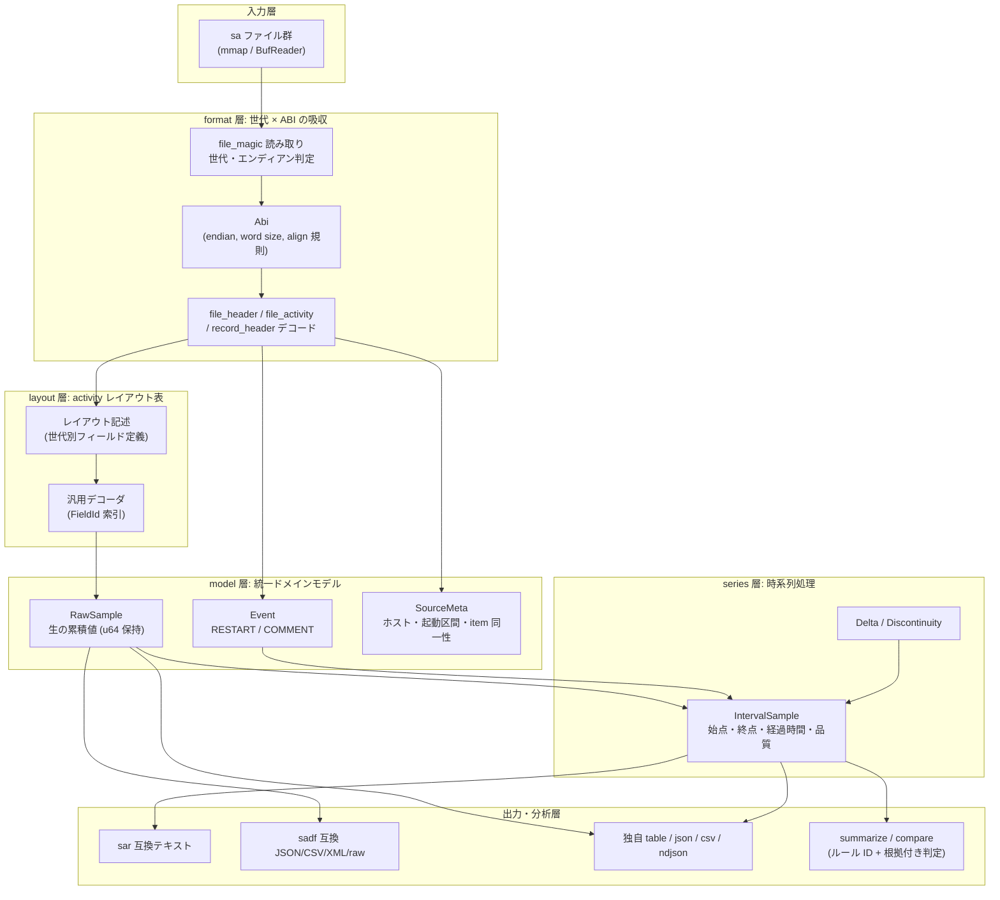
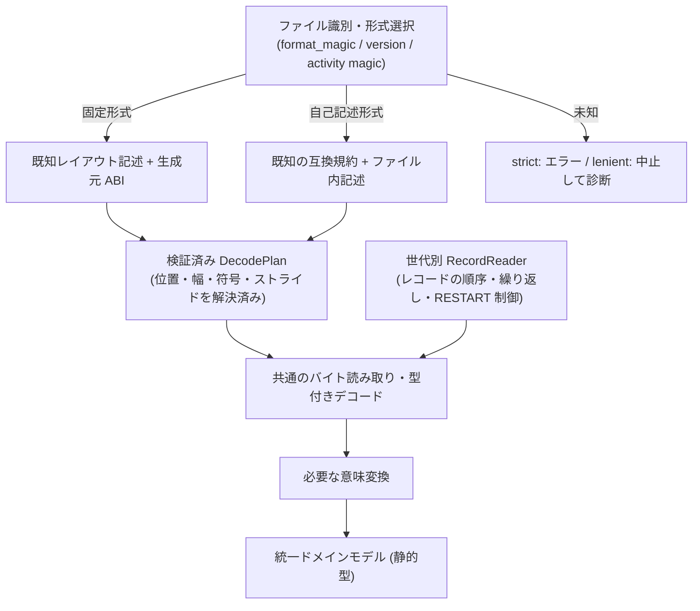
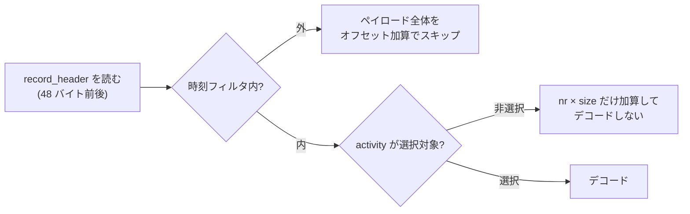

# reSARch 設計文書

`resarch` は、Linux の `sysstat` が生成するバイナリログ (`sa` ファイル) を、`sar` / `sadf` や
C ライブラリに一切依存せず単体で解析する Rust 製 CLI である。解析対象は sysstat v9 系から
v12 系までの全フォーマット世代、43 種の activity、little/big endian、32bit/64bit 生成ファイル。

この文書は実装の基準となる設計を定める。バイナリフォーマットそのものの仕様は
[`docs/format/`](format/) に分離してある。

- [`format/01-file-format.md`](format/01-file-format.md) — ファイル構造・世代判定・ABI 差
- [`format/02-activities.md`](format/02-activities.md) — 43 activity と統計構造体のレイアウト
- [`format/03-output-format.md`](format/03-output-format.md) — `sar` / `sadf` の出力書式と計算式
- [`format/04-test-data.md`](format/04-test-data.md) — 検証データとゴールデンテスト計画

---

## 1. 設計の前提となった事実

`sa` ファイルは「C 構造体をそのままディスクへ書いた」形式であり、次の 3 つが同時に変動する。

1. **フォーマット世代** — `format_magic` で識別される。世代ごとに `file_header` /
   `file_activity` / `record_header` のフィールド構成が異なる。
2. **生成ホストの ABI** — `sizeof(long)` が 4 か 8 か、エンディアンが LE か BE か。
   `__attribute__((aligned(8)))` / `aligned(16)` / `packed` が混在するため、
   同じ世代でも ABI が違えばフィールドのバイトオフセットが変わる。
3. **activity ごとの統計構造体** — sysstat のバージョン更新でフィールドが追加される。
   v12 系以降は「構造体の実サイズ」と「型別フィールド数」をファイル自身が記録する
   自己記述形式になり、未知バージョンでも読み替えが可能になった。

したがって「1 つの構造体定義でデコードする」ことは原理的に不可能であり、
**世代 × ABI × activity の 3 軸を明示的に扱う**設計が要求される。

### 1.1 実測による裏付け

sysstat 10.1.5 (`format_magic` = `0x2171`) で採取された実ファイルを、本設計の想定レイアウト
(`file_magic` 8 バイト固定、`file_header` 280 バイト、`record_header` 48 バイト、
`file_activity` 20 バイト) でデコードしたところ、**ファイル末尾までバイト単位で一致**し、
残余バイトは 0 だった。`aligned(16)` 由来のパディングを含めたオフセット計算が正しいことの確認である。

---

## 2. 層構造



層の責務境界は次のとおり。

| 層 | 責務 | 責務でないもの |
|---|---|---|
| `format` | 世代判定、ABI 決定、固定ヘッダのデコード、レコード境界の確定 | 統計値の意味付け |
| `layout` | activity ごとのフィールド定義と汎用デコード | 差分計算、単位変換 |
| `model` | 生の累積値とイベントの保持、item 同一性の管理 | レート計算 |
| `series` | 差分・レート・不連続の判定 | 書式化 |
| `output` | 書式化のみ | 値の再計算 |
| `analyze` | 集計と説明可能な判定 | 書式化 (writer に委譲) |

**出力層で値を計算しない**のが要点である。同じ指標を sar 互換テキストと JSON で出したとき、
形式ごとに計算がずれる事故を構造的に防ぐ。

---

## 3. 世代 × ABI の吸収

### 3.0 採る構成

**レイアウト記述を中核に据え、計画を作る経路だけを「固定形式」と「自己記述形式」の 2 つに分ける。**
世代ごとに独立したパーサを並べる方式は、レコードの順序制御と意味変換に限定して用いる。



**旧世代を「現行 sysstat のバイナリ配置」へ変換する経路は作らない。**
中間バッファへのコピーが増えるうえ、旧形式に存在しないフィールドをゼロ埋めすると
正常なゼロとの区別を失う。両経路から共通の読み取り計画を作り、
静的型のドメインモデルへ直接デコードする。

| 案 | 採る部分 | 全面採用しない理由 |
|---|---|---|
| 正規化変換 (本家方式) | 固定形式と自己記述形式で入口を分ける | 現行配置への変換は余分なコピーと現行配置への依存を生む |
| 世代別パーサ | 世代固有のレコード制御・意味変換 | 世代別に全 activity の読み取りを複製すると修正が分散する |
| レイアウト記述駆動 | フィールド配置・幅・互換な追加削除 | レコード制御や複雑な意味変換まで宣言化すると DSL が肥大化する |

### 3.1 組み合わせ爆発は軸の分離で抑える

「リリース × 4 ABI × 43 activity」を手書きで並べる必要はない。次の 4 軸に分ける。

| 軸 | 選ぶもの |
|---|---|
| 形式ファミリー | ヘッダ・レコードの構成 |
| activity の wire revision | フィールド列と値の解釈 |
| Layout ABI | 生成元の整数幅・アラインメント規則 |
| Endian | 整数読み出し時のパラメータ |

**エンディアンはオフセット表を増やさない。** 同一配置に対して
`from_le_bytes` / `from_be_bytes` を切り替えるだけで済む。

一方で **`sizeof(long)` とエンディアンだけで全ての C ABI 配置が一意に決まるとは扱わない**。
32bit ABI 間でも自然アラインメントが異なり得る。差が消えることを検証できた場合にのみ
同一配置へまとめる。

```rust
pub struct SourceEncoding {
    pub endian: Endian,
    pub layout_abi: LayoutAbiId,
}

pub struct LayoutAbi {
    pub long_bytes: u8,
    pub long_align: u8,
    pub u64_align: u8,
}
```

この ABI は**ファイルを生成したホスト**のものである。
実行中の Rust の `usize` / `size_of` / `c_ulong` から決めてはいけない。

レイアウトの共有は activity 単位で行う。変更のない activity は前の wire revision を参照し、
変更されたものだけ新しく定義する。差分継承を積み重ねるのではなく、
共通フィールドブロックを再利用して**最終配置を一覧で確認できる形**にする。

### 3.2 DecodePlan — 事前解決済みの読み取り計画

`DecodePlan` は、各フィールドの読み取り位置・整数幅・符号・構造体ストライドを解決済みにした表。
ファイルまたは activity の記述を読んだ段階で 1 度だけ構築し、同一配置の全サンプルで再利用する。
これは正確性のためだけでなく、**ホットパスからレイアウト解釈を追い出す性能上の要**でもある。

### 3.3 形式判定はレジストリで行う

分岐を `major >= 12` のようなバージョン比較に固定しない。
`format_magic`、必要な版情報、activity magic、記述されたサイズに基づく**形式レジストリ**で選ぶ。
世代区分は説明には使えるが、厳密な互換性判定とは別物である。

`sa_sizeof_long` を読むために ABI が必要になる形式では、形式ごとの bootstrap 手順を持つ。
候補 ABI を試す場合、**複数候補が成立したら曖昧として扱う**。都合のよい候補を選ばない。

自己記述情報は、フィールド名や単位まで記した完全なスキーマではない。
型群ごとの個数と実サイズ、activity ID、互換性を表す magic があるだけである。
したがって「個数とサイズが読めるから未知の意味も読める」とは判断しない。
自己記述側の計画生成器は、既知の型群の並び方と追加規約に従って**既知フィールドを配置する**。
型の値幅とファイル内の占有幅は別概念として扱い、`個数 × sizeof(long)` のような
一般式だけで配置を決めない。

### 3.4 将来形式への耐性は範囲を限定する

| 将来の変更 | 対応方針 |
|---|---|
| 既知の互換規約内でフィールド数が増える | 既知フィールドを継続して読む (コード変更なし) |
| 既知の意味のまま配置だけ変わる | レイアウト宣言の追加と再ビルド |
| 新 activity・新しい意味のフィールド | 型とメタデータの定義追加 |
| レコード構成・圧縮方式・値の意味が変わる | Rust の処理追加 |

**外部データを差し替えるだけで任意の将来形式を読む機構は過剰設計**として採らない。
静的型に未知の名前付きフィールドを足すことと両立しないためである。
未知領域のスキップも、その長さを信頼できる場合に限る。

### 3.5 アラインメントは規則から計算し、独立した期待値で固定する

```text
field_offset = align_up(previous_end, effective_field_alignment)
field_end    = field_offset + field_storage_size
struct_size  = align_up(last_field_end, effective_struct_alignment)
```

`effective_field_alignment` は、生成元 ABI・フィールドの `aligned` 指定・
構造体/フィールドの `packed` 指定から決める。
`packed` を見て一律に 1 とする扱いはしない。組み合わせ規則を明示する。

実測した v10.1.5 の `record_header` はこの規則で表現できる。

| フィールド | オフセット | 読むバイト数 |
|---|---:|---:|
| `uptime` | 0 | 8 |
| `uptime0` | 16 | 8 |
| `ust_time` | 32 | 4 または 8 |
| `record_type` | 40 | 1 |
| `hour` / `minute` / `second` | 41 / 42 / 43 | 各 1 |
| 構造体サイズ | — | 48 |

32bit では `ust_time` の後 (36〜39) が穴になる。
**64bit と同じオフセットでも読む幅が違う**ことを表現できている必要がある。
padding の内容は、形式が要求しない限りゼロと仮定しない。

人手による明示オフセットは、通常の定義には使わず次の 2 用途に限定する。

1. 規則で表せない、根拠のある歴史的例外。
2. 規則の計算結果を検査するための独立した期待値。

全フィールドについて範囲・重複・整列・構造体サイズを検証し、
件数との乗算を含むサイズ計算は checked 演算にする。
`repr(C)` / `repr(packed)` 構造体へファイルのバイト列を直接キャストする必要はない。

### 3.6 単一定義から生成する

数百〜千規模のフィールド定義を「構造体定義」と「レイアウト表」で二重管理すると必ず食い違う。
**Rust の宣言的マクロを正本**とし、そこから次を生成する。

| 生成物 | 内容 |
|---|---|
| 名前付き構造体 | 型付きのドメインフィールド |
| `FieldId` | 列選択・前回値保持の索引 |
| 列メタデータ | 公開名・単位・`Counter`/`Gauge`・集計方法 |
| wire layout の `const` 記述 | revision ごとのフィールド列と整列指定 |
| デコード関数 | 検証済み `DecodePlan` を使って構造体を作る |

wire 側の記述はドメインフィールド名を参照するだけで、
Rust 型・公開名・単位を再定義しない。
各 revision について、**すべてのドメインフィールドが「読み取り」「未提供」「変換」の
いずれかに一度だけ割り当てられること**をマクロ展開時に検証する。

宣言の概念例 (実在の activity 配置ではない):

```rust
activity_schema! {
    pub struct ExampleCounters {
        requests: Availability<u64> {
            column: { public_name: "requests", unit: Count, kind: Counter, aggregation: Sum },
        },
        errors: Availability<u64> {
            column: { public_name: "errors", unit: Count, kind: Counter, aggregation: Sum },
        },
    }

    wire Legacy {
        struct_align: 8;
        fields: [ requests: CUnsignedLong => at_least(8) ];
        absent: [errors];
    }

    wire Current {
        struct_align: 8;
        fields: [ requests: U64 => at_least(8), errors: U64 => at_least(8) ];
    }
}
```

生成されるデコード関数はおおむね次の形になる。

```rust
impl ExampleCounters {
    fn decode(bytes: &[u8], plan: &ExamplePlan) -> Result<Self, DecodeError> {
        Ok(Self {
            requests: plan.requests.read_u64(bytes)?,
            errors: plan.errors.read_u64(bytes)?,
        })
    }
}
```

`read_u64` は wire 上の幅からゼロ拡張し、存在しない項目には `UnsupportedBySource` を返す。
必要なバイトが足りなければ切断エラー。**カウンタの元のビット幅はメタデータとして残し**、
後段の差分計算 (ラップ判定) へ渡す。

意味変換が必要なフィールドだけ、名前付き Rust 関数を宣言から参照させる。
計算式や条件分岐をマクロ言語へ取り込まない。

---

## 4. 値の表現 — 欠落とゼロを混同しない

```rust
pub enum Availability<T> {
    Present(T),
    UnsupportedBySource,   // その世代のファイルには存在しないフィールド
    MissingInSample,       // 存在するが当該レコードで取得できていない
}

pub struct Counter {
    pub value: u64,        // 累積値は u64 のまま保持する
    pub bits: CounterBits, // B32 | B64 (ラップ判定に使う)
}
```

未提供フィールドを 0 として扱うと、平均・p95・ボトルネック判定が静かに誤る。
「正常な 0」「その世代では未提供」「当該レコードで欠落」を型で区別する。

累積値を早期に `f64` へ落とさない。大きなカウンタで差分精度が失われる。

---

## 5. 差分・レート — series 層に集約

```rust
pub enum Delta {
    Valid(u64),
    Wrapped(u64),
    Unavailable(Discontinuity),
}

pub enum Discontinuity {
    FirstSample,          // 基準となる前サンプルが無い
    Restart,              // RESTART レコードを挟んだ
    ItemReplaced,         // デバイス名の再利用や CPU のオンライン変化
    NonPositiveElapsed,   // 経過時間が 0 以下
    AmbiguousDecrease,    // 減少したがラップとは断定できない
}
```

カウンタの減少を一律にラップと解釈してはいけない。32bit カウンタの一周として解釈するのは、
起動区間と item の連続性が確認できる場合に限る。長い観測間隔で複数回ラップした可能性は
2 点だけからは復元できないため、`AmbiguousDecrease` として報告する。

`IntervalSample` は終点時刻だけでなく **始点・終点・経過時間・品質情報**を持つ。
時刻フィルタ (`-s` / `-e`) では、開始時刻の直前のサンプルを基準値として保持する。
これを先に捨てると最初の表示区間が計算できなくなる。

計算規則はフィールド種別ごとに異なる。

| 種別 | 計算 |
|---|---|
| 一般カウンタ | 差分 ÷ 経過時間 |
| CPU 割合 | 対応する CPU 時間カウンタの差分比 (オフライン CPU の扱いを含む) |
| ゲージ (メモリ量など) | 差分化しない |
| 派生指標 | 複数カウンタからの専用計算 |

---

## 6. 性能方針

解析速度は要件である。次を設計段階から組み込む。

### 6.1 読まないものは読まない



- 時刻フィルタの範囲外レコードは `record_header` だけ読んで本体をスキップする。
- 選択されていない activity は `nr × size` を加算するだけでデコードしない。
  1 レコードに 15〜43 activity が並ぶため、`-u` だけを見る場合の削減効果が大きい。
- レコード境界はヘッダ情報から決定的に計算できるので、走査のための探索は不要。

### 6.2 メモリとコピー

- 入力は既定で `mmap` (memmap2)。ページフォルト経由で読み、`read` の往復とバッファコピーを避ける。
  採取進行中のファイルや切り詰めの懸念がある場合に備え `--no-mmap` で `BufReader` に切り替える。
- 文字列フィールド (デバイス名・インターフェース名) は `&[u8]` のまま扱い、
  出力直前まで `String` を作らない。
- item ごとの前回値保持は `FieldId` 索引の固定長配列。`HashMap<String, f64>` をホットパスに置かない。
- `Vec` は `nr` が既知なので `with_capacity` で確保する。

### 6.3 並列化

1. 各ファイルのヘッダだけを先に読み、ホスト・時間範囲・世代を把握する。
2. **ファイル単位**で rayon 並列デコードする (activity 単位では並列化しない)。
3. 同一ホストのレコードを決定的順序でマージする。
4. 差分計算はホスト・起動区間ごとの処理器が担当する。
   **差分をファイル単位で完結させない** — 日境界で連続性が確認できる場合、
   前ファイルの最終値を次ファイルへ引き継ぐ。
5. writer は 1 つに集約し、出力を直列化する。

全結果を `collect` せず、同時処理ファイル数とキュー容量に上限を設ける。

### 6.4 出力

- `stdout` は `BufWriter` で包み、ロックは 1 回だけ取得する。
- 行単位のストリーミング出力。全レコードを溜めてから出力しない
  (サマリのように全走査が必要な場合を除く)。

### 6.5 計測

`benches/decode.rs` (criterion) で次を継続的に計測する。

| ベンチ | 測るもの |
|---|---|
| ヘッダのみ | ファイルあたりの固定コスト |
| 全 activity デコード | スループット (MB/s) |
| 単一 activity 選択 | スキップ最適化の効果 |
| 時刻フィルタ適用 | レコードスキップの効果 |
| 複数ファイル横断 | 並列化の効果 |

「速くなったつもり」を排除するため、最適化は必ずベンチ差分を添えて入れる。

---

## 7. 壊れたファイルへの態度

既定は **strict**。解析結果を運用判断や AI が使うため、疑わしい値を黙って出さない。
ただし **未知の機能と破損は別**であり、境界が確実な未知 activity のスキップは
「回復処理」ではなく正常な前方互換として扱う。

| 状況 | 既定 (strict) | `--lenient` |
|---|---|---|
| 最終レコード途中で EOF | エラー | 完全なレコードまで返し、不完全と報告 |
| 未知の `format_magic` | エラー | 当該ファイルの解析を中止 |
| 既知 activity と矛盾するサイズ | エラー | 境界が確実な場合だけ対象をスキップ |
| item 数・総バイト数が上限超過 | エラー | 上限は緩めない。安全にスキップ不能なら中止 |
| レコード境界を失う破損 | エラー | 当該ファイルの解析を中止 |
| スキップ可能な未知 activity | 診断付き継続 | 同じ |

- データは `stdout`、診断は `stderr`。
- 部分結果になった場合は `--lenient` でも非ゼロ終了する。
- 互換出力 (sar / sadf) に独自の警告フィールドを混ぜない。
- バイト列からヘッダらしきパターンを探して再同期する方式は採らない。
  誤検出した値が正常な統計に見えてしまう。
- `size × count` は checked 演算で計算し、確保前に残バイト数と照合する。
  上限は item 数だけでなく activity 数・レコードサイズ・ファイル処理量にも設ける。

ストリーミング出力では strict でもエラー検出前の出力が残る。
「strict = stdout が全件原子的」ではないことを仕様として明記する。

---

## 8. テスト戦略

4 系統に分ける。

| 検証 | 目的 | 配置 |
|---|---|---|
| 独自最小 fixture | ABI 幅・エンディアン・境界条件を狙い撃つ | リポジトリに同梱 (自作なので MIT) |
| 本家実データ + 参照出力 | 実レイアウトと表示意味の検証 | CI 実行時に取得 (GPL のため非同梱) |
| 破損・fuzz | パニック・過大確保・無限ループの防止 | リポジトリに同梱 |
| メタモルフィック | 入力変換に対する結果の関係を検証 | リポジトリに同梱 |

**fixture 生成器を本体と同じレイアウト記述から作ると、同じ誤りが往復して通る。**
単一定義から作った fixture が有効なのは、デコード経路の網羅とランダム値の往復検査まで。
配置そのものの正しさは検証できない。

そこで **独立させるのは「期待値の出所」** とする。

| 検証対象 | 独立した証拠 |
|---|---|
| オフセット・サイズ | 対象タグの本家 C ヘッダから、対象 ABI で得た `offsetof` / `sizeof` |
| バイト順・値幅・padding | 本家 C 構造体へ識別しやすい値を入れて出力したバイト列 |
| ファイル全体の構成 | 対象版の `sadc` が生成した実ファイル |
| 値と意味 | 対応版 `sadf` の出力と、独立した算術検査 |

C のレイアウト検査はホスト環境だけでは不足する。対象 ABI へのクロスコンパイル結果や
エミュレータ上での出力を証拠とし、**本家ヘッダのタグ/コミット・対象 triple・
コンパイラ・生成手順を fixture と一緒に記録**する。

実測で得た「file_magic 8 バイト / file_header 280 バイト / record_header 48 バイト」も
独立した期待値として固定する。ただし総サイズだけでは内部の穴の誤りを見逃すため、
主要フィールドのオフセットと既知値も併せて検査する。

有用な性質検証:

- 同一の値を LE / BE で表現しても正規化結果が一致する。
- カウンタ両端に同じ定数を足しても、オーバーフローが無ければレートが変わらない。
- 連続した系列を 2 ファイルに分割しても、連結後の結果が一致する。
- 切り詰め入力から、完全な元レコードと異なる「正常に見える値」を生成しない。

本家との比較は 2 段階で行う。

- **意味比較** — JSON / XML を解析して値・単位・item 対応を比較。
- **表記比較** — ロケール・タイムゾーン・端末条件を固定して、列順・丸め・空白まで比較。

CI では取得対象のタグとチェックサムを固定し、`ubuntu-latest` の更新で基準が動かないようにする。

### 8.1 実データの取り扱い

運用中のホストから採取した `sa` ファイルは `nodename` などにホスト名が埋め込まれている。
**実データおよびその出力例をリポジトリ・コミットメッセージ・ドキュメントへ持ち込まない。**
ローカル検証専用とし、公開物に載せる出力例は自作 fixture から生成する。

---

## 9. CLI 構成

独自機能はサブコマンド、互換動作は明示的な入口として分離する。

```sh
# 独自形式での閲覧
resarch show sa01 sa02 --activity cpu,disk --format table

# AI エージェント向け (生値と派生値を別名前空間で出す)
resarch show sa01 --format ndjson --values both

# 期間集計・ボトルネック判定
resarch summarize sa01 sa02 --format json

# ホスト比較
resarch compare --host app1=app1/sa01 --host app2=app2/sa01

# ヘッダのみ
resarch info sa01

# sar 互換入口
resarch sar -u -P ALL -s 09:00:00 -e 18:00:00 -f sa01

# sadf 互換入口
resarch sadf -j sa01
```

`sar` / `sadf` の文法は独自サブコマンドと別のパーサとして実装する。
clap の derive 一つに全互換文法を押し込まない。

### 9.1 「sar 互換」を 3 つに分けて宣言する

| 互換の種類 | 意味 |
|---|---|
| 入力互換 | どの世代の `sa` ファイルを読めるか |
| 計算・出力互換 | どのバージョンの `sar` / `sadf` と表示が一致するか |
| CLI 互換 | どのオプションと呼び出し方を受け付けるか |

reSARch は**ファイル解析専用**であり、リアルタイム採取 (`sadc` 相当) は対象外。
この区別を README で明示する。

**入力ファイルの世代と、再現する出力仕様の世代は別の設定**として管理する。
v10 のファイルを v12 の `sar` 書式で出すことも、その逆も指定できる形にする。

---

## 10. 対応状況の管理

「対応した/していない」を単一の真偽値にしない。activity ごとに 4 軸で管理する。

| 軸 | 意味 |
|---|---|
| デコード可能 | バイト列を正しく読める |
| 意味モデル対応 | 単位・種別 (counter/gauge) を含めてモデル化済み |
| 派生指標対応 | レート・割合の計算規則を実装済み |
| 表示検証済み | `sar` / `sadf` の出力と突合済み |

この対応表はレイアウト記述から生成し、README に掲載する。未実装の検出漏れを防ぐ。

---

## 11. AI エージェント向け出力の契約

独自 NDJSON は長期利用される前提で契約を固定する。

- `schema_version` を必ず含める。
- ホスト、起動区間、時刻、activity、item、単位、品質 (`Availability` / `Discontinuity`)、出典を持つ。
- `u64` の生値は JavaScript 系での精度欠落を避けるため**十進文字列**で出す。
  (sadf 互換形式では互換仕様に従うため、この規約は適用しない)
- サマリの判定は断定ではなく、**観測根拠とルール ID** を添える。
  閾値・継続時間・必要指標・欠損時の扱い・ルール版を出力に保存する。

---

## 12. 実装フェーズ

| フェーズ | 内容 | 完了条件 |
|---|---|---|
| 1 | `format` 層 + `info` サブコマンド | 全世代のヘッダを読み、世代・ABI・activity 一覧を表示できる |
| 2 | `layout` 層 + CPU / メモリ / ディスクのデコード | 実データのレコードを末尾まで走査し、値が `sar` と一致する |
| 3 | `series` 層 + sar 互換テキスト出力 | 本家 `sar` の出力と表記一致 |
| 4 | 43 activity への拡張 | 対応表の「デコード可能」が全件 |
| 5 | `sadf` 互換 (JSON/CSV/XML/raw) + 独自出力 | 本家 `sadf` と意味比較一致 |
| 6 | `summarize` / `compare` / NDJSON | ルール ID 付き判定と複数ファイル横断 |
| 7 | 性能最適化 | ベンチ差分を添えた改善 |

縦断的な検証を先に通す。CPU・メモリ・ディスク・可変 item・32bit カウンタ・旧固定形式・
自己記述形式・big-endian を含む経路を早期に通し、共通層の設計を検証してから
43 activity を同じスキーマで埋める。
