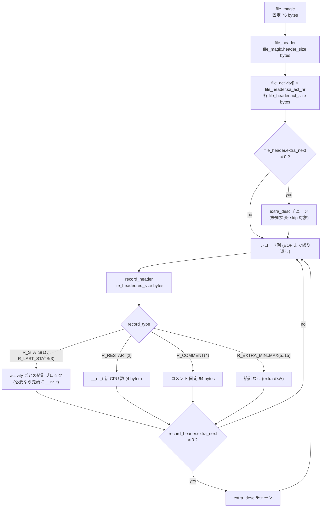
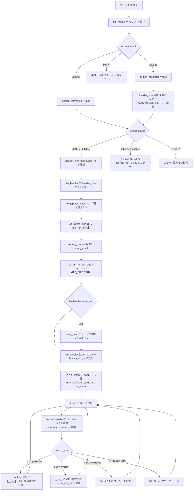
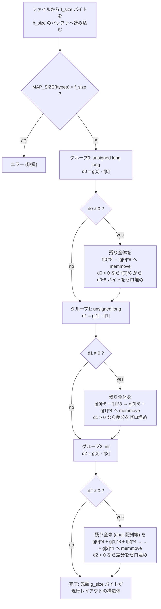
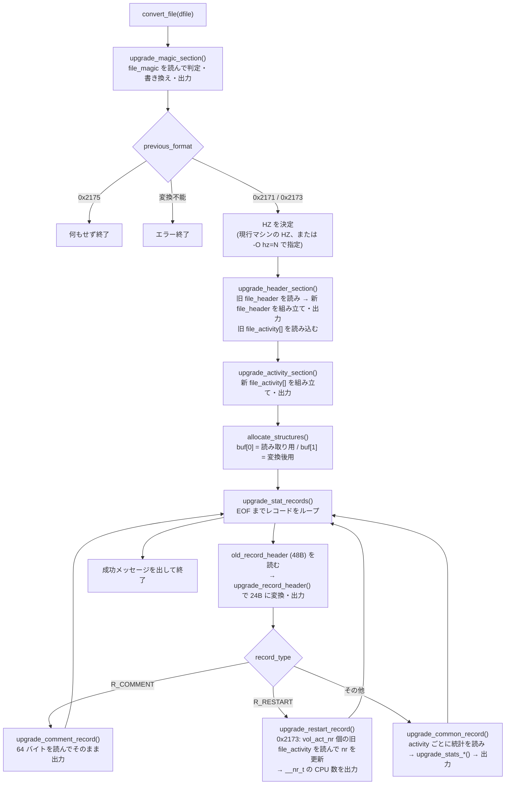
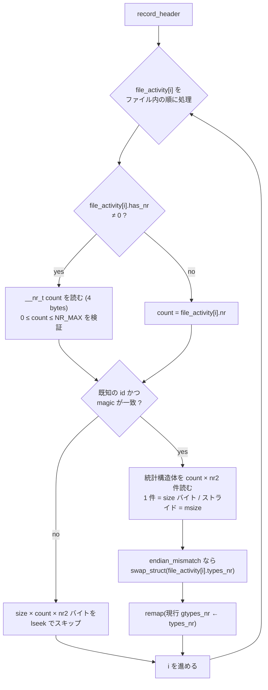
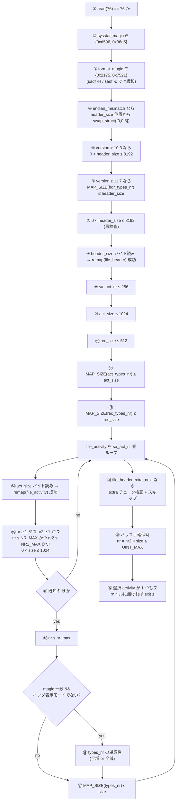

# reSARch — sysstat sa バイナリフォーマット仕様 (バイナリ層)

本書は sysstat (sar / sadc / sadf) が生成する **システムアクティビティデータファイル (sa ファイル)** の
バイナリフォーマットを、Rust で独自パーサ (reSARch) を実装できる粒度で規定する。

- 情報源: sysstat 本家ソース (`sa.h` / `sa_common.c` / `sa_conv.c` / `sa_conv.h` / `sadc.c` / `sadf.c` / `sadf_misc.c` / `sar.c` / `rd_stats.h` / `activity.c` / `CHANGES`)、および `tests/` 配下の実データ
- 基準バージョン: **v12.8.0 (master)**。過去世代は v9.1.5 まで遡って記載
- 構造体レイアウトは本書独自の表として記述しており、本家ソースの逐語引用は含まない
- 実バイトオフセットは、本家の型定義と `__attribute__ ((aligned (n)))` を再現した検証プログラムを
  x86-64 / 32bit エミュレーション (sizeof(long)=4) の両方でコンパイルして実測した値である
- 不確実な項目には **[要検証]** を付す

## 目次

| # | 章 | 内容 |
|---|---|---|
| 1 | [ファイル全体構造](#1-ファイル全体構造) | 要素の並びとサイズ決定規則 |
| 2 | [FORMAT_MAGIC の完全な履歴](#2-format_magic-の完全な履歴) | magic 値 ↔ sysstat バージョン対応 |
| 3 | [世代別の構造体レイアウト](#3-世代別の構造体レイアウト) | 実バイトオフセット表 (64bit / 32bit) |
| 4 | [types_nr による自己記述メカニズム](#4-types_nr-による自己記述メカニズム) | `remap_struct()` のアルゴリズム |
| 5 | [旧フォーマット変換 (sa_conv)](#5-旧フォーマット変換-sa_conv) | `sadf -c` の全容 |
| 6 | [レコード層](#6-レコード層) | `record_header` / R_* / ペイロード / item 数 |
| 7 | [エンディアン処理](#7-エンディアン処理) | swap 判定と `swap_struct()` |
| 8 | [32bit / 64bit 差異](#8-32bit--64bit-差異) | `sa_sizeof_long` の役割 |
| 9 | [タイムスタンプ](#9-タイムスタンプ) | `sa_ust_time` / `ust_time` / TZ |
| 10 | [サニティチェック一覧](#10-サニティチェック一覧) | 検証項目とテストデータ |
| 11 | [Rust 実装への落とし穴まとめ](#11-rust-実装への落とし穴まとめ) | — |

---

## 1. ファイル全体構造

### 1.1 要素の並び (現行フォーマット = FORMAT_MAGIC 0x2175)

> **`extra_desc` チェーンの位置 (実測で訂正)**
>
> ファイルヘッダに付随する `extra_desc` チェーンは **`file_activity[]` の後**に置かれる。
> 根拠は 2 つ:
>
> 1. 本家のテストデータ生成ソースの書き込み順が
>    `file_magic` → `file_header` → `file_activity[]` → `extra_desc` チェーン である。
> 2. `extra_next = 1` が立っている実データで、`file_header` の直後に現れるのは
>    `extra_desc` ではなく `file_activity` (id=1, magic=0x8b, nr=3, size=80) である。
>
> チェーンは「`extra_desc` (24 バイト固定) + `extra_nr × extra_size` の本体」を 1 段とし、
> `extra_next` が 0 の段まで続く。終端の段は `extra_nr = 0` で本体を持たない。




> 重要: `record_header.extra_next` が立っている場合の `extra_desc` チェーンの読み位置は
> レコード種別で異なる。
> - `R_STATS` / `R_EXTRA*` → **record_header の直後** (統計構造体より前)
> - `R_RESTART` → **CPU 数 (__nr_t) の後**
> - `R_COMMENT` → **コメント 64 bytes の後**
>
> 本家 `read_record_hdr()` は R_COMMENT / R_RESTART 以外については record_header 読み取り直後に
> `skip_extra_struct()` を呼び、R_COMMENT / R_RESTART については各ペイロードを読んだ後で呼ぶ。

### 1.2 各要素のサイズ決定規則

| 要素 | ファイル上のサイズ | 決定元 |
|---|---|---|
| `file_magic` | **常に 76 bytes (0x4C)** を読む | 現行 sysstat の `sizeof(struct file_magic)` 固定。「新しい版のファイルか古い版のファイルかは事前に判別できない」という理由で、常に現行版のサイズだけ読む設計 |
| `file_header` | `file_magic.header_size` bytes | ファイル自身が申告。現行 = 336、v11.7.1〜v12.1.x = 328 |
| `extra_desc` | **常に 24 bytes** | 「この構造体の構成は将来も変えない」と規定されている |
| 未知 extra 構造体 | `extra_desc.extra_size` × `extra_desc.extra_nr` bytes | `lseek` でスキップするのみ |
| `file_activity` | `file_header.act_size` bytes × `file_header.sa_act_nr` 個 | ファイル自身が申告。現行 = 36 |
| `record_header` | `file_header.rec_size` bytes | ファイル自身が申告。現行 = 24 |
| activity 統計 1 件 | `file_activity.size` bytes | ファイル自身が申告 |
| activity 統計の件数 | `has_nr` が真なら統計の直前に置かれた `__nr_t` 値、偽なら `file_activity.nr` | — |
| activity 統計ブロック全体 | `size × count × nr2` bytes | `nr2` は `file_activity.nr2` (行列型 activity 用のサブアイテム数) |
| R_RESTART ペイロード | 4 bytes (`__nr_t` = `int`) | 固定 |
| R_COMMENT ペイロード | **固定 64 bytes** (`MAX_COMMENT_LEN`) | 全世代で 64 固定。NUL 終端は保証されないので読み側で最終バイトを 0 にする |

### 1.3 「strict writing, read any」ルール

本家の設計思想:

- **書き込み (sadc による追記)** = 厳格。`format_magic` が一致するだけでは不十分で、
  `act_size` / `rec_size` / `act_types_nr[]` / `rec_types_nr[]` / 各 activity の
  `size` / `magic` / `types_nr[]` / `has_nr` が現行版と完全一致しなければ追記を拒否する。
- **読み込み (sar / sadf)** = 寛容。`format_magic` が一致すれば、フィールド数が増減していても
  `types_nr` を使って読み替える (§4)。

reSARch は読み取り専用であれば「read any」側だけを実装すればよい。

### 1.4 読み込み処理の全体フロー



---

## 2. FORMAT_MAGIC の完全な履歴

### 2.1 SYSSTAT_MAGIC

| 定数 | 値 | 備考 |
|---|---|---|
| `SYSSTAT_MAGIC` | `0xd596` (54678) | **全バージョンで不変**。sysstat が作ったファイルであることの識別子 |
| `SYSSTAT_MAGIC_SWAPPED` | `0x96d5` (38613) | 上記のバイトスワップ値。エンディアン不一致の検出に使う (§7) |

`sysstat_magic` が `0xd596` でも `0x96d5` でもない場合は sa ファイルではない。
`SYSSTAT_MAGIC_SWAPPED` 定数自体は v11.7.1 で導入されたが、値としては全世代で有効な判定に使える。

### 2.2 FORMAT_MAGIC (git 時代 = v9.1.5 以降、リポジトリで実測)

| 値 (16進 / 10進) | 導入コミット | コミット日 | 最初のタグ | 最後のタグ | 主な変更点 |
|---|---|---|---|---|---|
| `0x2170` / 8560 | (git root に既在。実導入は pre-git の 8.1.3) | 2008-05-25 (8.1.3) | **v9.1.5** | **v9.1.5** | sar/sadc/sadf を汎用アクティビティ設計に全面書き換え。activity の増減でフォーマット互換を壊さない構造に |
| `0x2171` / 8561 | `ff52fe60` | 2010-09-30 | **v9.1.6** | **v10.2.1** | activity matrix (nr2) 対応。併せて `892b1cd2` (2010-10-10) で **activity 単位の magic** (`ACTIVITY_MAGIC_BASE = 0x8a`) を導入し、フォーマット変更の影響を 1 activity に限定可能にした |
| `0x2172` / 8562 | `8a2b5588` | 2014-01-26 | **(未リリース)** | — | CPU 数可変対応の途中段階。どのタグにも含まれない → **実装不要** |
| `0x2173` / 8563 | `cd625e9c` | 2014-03-14 | **v10.3.1** | **v11.6.6** | ファイル内での CPU 数変更に対応。RESTART レコードに CPU 数を保持 |
| `0x2174` | — | — | **(存在しない)** | — | 履歴上一度も定義されていない欠番 → **実装不要** |
| `0x2175` / 8565 | `df0c8a07` | 2017-09-06 | **v11.7.1** | **v12.8.0 (現行)** | 新フォーマット: 自己記述 (`types_nr`) 化、ディスク使用量削減、**big/little endian 両対応** (`f647f38b`, 2017-09-17)、時刻の 64bit 化、patchlevel/sublevel の 8bit 化、HZ をヘッダに保存、CPU 統計が常に存在する前提の撤廃 |

補足:
- `v11.6.6` のリリース日 (2018-10-13) は `v11.7.1` (2018-01-12) より後。11.6.x 保守系と 11.7.x 開発系が
  並行していたため、`0x2173` の最終リリースはバージョン順・日付順ともに `v11.6.6` になる。
- **v12 系は v12.0.0 から v12.8.0 まですべて `0x2175`** である。v12 系内部のフォーマット差異は
  `header_size` / `hdr_types_nr` / `act_types_nr` / `rec_types_nr` の変化で表現され、magic は変わらない (§4)。

### 2.3 FORMAT_MAGIC (pre-git 時代)

3.3.6 以降は CHANGES に `WARNING: Daily data files format has changed ... [0xNNNN]` と
magic が明記されている。**3.3.5 以前は CHANGES に magic の表記が無い**ので、
配布アーカイブ (Red Hat / Mandrake の旧 SRPM) から実ソースを入手して
`sa.h` の `SA_MAGIC` を実測した。

なお pre-git 時代の定数名は `SA_MAGIC` であり、`FORMAT_MAGIC` へ改称されるのは
8.1.1 (`0x216f`) からである。`struct file_magic` が導入されるのも同じ 8.1.1 で、
それ以前は magic が `file_hdr` の中にある (§2.8)。

| 値 (16進 / 10進) | 導入バージョン | リリース日 | 根拠 |
|---|---|---|---|
| `0x015d` / 349 | 2.2 で確認 | — | 選択列を詰めた形式。[実測仕様](08-packed-legacy.md)。他版への外挿はしない |
| `0x115a` / 4442 | 3.2.4 で確認 | 2000-08-06 | 3.2.4 の `sa.h` を実測。未入手の以前の版を同値とは推定しない |
| `0x215a` / 8538 | 3.3.2 | 2000-11-19 | 実測。`sa_ust_time` 追加 |
| `0x215b` / 8539 | 3.3.3 | 2000-12-31 | 実測。3.3.5 も同値 |
| `0x215c` / 8540 | — | — | **欠番**。3.3.5 = `0x215b` / 3.3.6 = `0x215d` の間に使ったリリースが無い |
| `0x215d` / 8541 | 3.3.6 | 2001-03-04 | 4.0.0〜4.0.7 まで同値 |
| `0x215e` / 8542 | 4.1.1 | 2003-01-02 |
| `0x215f` / 8543 | 4.1.2 | 2003-01-24 |
| `0x2160` / 8544 | 4.1.4 | 2003-07-01 |
| `0x2161` / 8545 | 4.1.5 | 2003-07-21 |
| `0x2162` / 8546 | 4.1.6 | 2003-08-20 |
| `0x2163` / 8547 | 4.1.7 | 2003-09-28 |
| `0x2164` / 8548 | 5.1.1 | 2004-10-09 |
| `0x2165` / 8549 | 5.1.3 | 2004-11-22 |
| `0x2166` / 8550 | 5.1.4 | 2005-01-02 |
| `0x2167` / 8551 | 6.0.0 | 2005-05-14 |
| `0x2168` / 8552 | 6.1.1 | 2006-02-22 |
| `0x2169` / 8553 | 6.1.3 | 2006-05-24 |
| `0x216a` / 8554 | 7.1.2 | 2007-03-04 |
| `0x216b` / 8555 | 7.1.3 | 2007-03-27 |
| `0x216c` / 8556 | 7.1.5 | 2007-06-07 |
| `0x216d` / 8557 | 7.1.6 | 2007-07-08 |
| `0x216e` / 8558 | 8.0.0 | 2007-09-02 |
| `0x216f` / 8559 | 8.1.1 | 2008-02-10 |
| `0x2170` / 8560 | 8.1.3 | 2008-05-25 |

> 注: 調査依頼にあった「0x2169 が v9.x」は誤り。**`0x2169` は sysstat 6.1.3 (2006)** の magic であり、
> v9 系は `0x2170` (v9.1.5) と `0x2171` (v9.1.6 / v9.1.7) にまたがる。
> `0x2169` 以前のフォーマットは本家の `sadf -c` でも変換できない (§5)。

### 2.4 magic 値 → 全タグ対応 (実測)

全 134 タグを総なめした結果。`SYSSTAT_MAGIC` は 134 タグすべてで `0xd596`。

| magic | タグ数 | タグ一覧 |
|---|---|---|
| `0x2170` | 1 | v9.1.5 |
| `0x2171` | 17 | v9.1.6, v9.1.7, v10.0.0〜v10.0.5, v10.1.1〜v10.1.7, v10.2.0, v10.2.1 |
| `0x2173` | 66 | v10.3.1, v11.0.0〜v11.0.8, v11.1.1〜v11.1.8 (+ 重複タグ `11.1.5`), v11.2.0〜v11.2.14 (v11.2.1.1 含む), v11.3.1〜v11.3.5, v11.4.0〜v11.4.11, v11.5.1〜v11.5.7, v11.6.0〜v11.6.6 |
| `0x2175` | 50 | v11.7.1〜v11.7.4, v12.0.0〜v12.0.6, v12.1.1〜v12.1.7, v12.2.0〜v12.2.3, v12.3.1〜v12.3.3, v12.4.0〜v12.4.5, v12.5.1〜v12.5.6, v12.6.0〜v12.6.2, v12.7.1〜v12.7.9, v12.8.0 |

検算: 1 + 17 + 66 + 50 = 134 (= タグ総数)。`0x2172` / `0x2174` を持つタグは 0 本。

### 2.5 reSARch が判別すべき magic

実装上は **5 値**:

| magic | reSARch での扱い |
|---|---|
| `0x2175` / `0x7521` | 現行フォーマットとしてネイティブに読む |
| `0x2173` / `0x7321` | 旧フォーマット。変換ロジック (§5) を経由して読む |
| `0x2171` / `0x7121` | 旧フォーマット。変換ロジック (§5) を経由して読む |
| `0x2170` / `0x7021` | 直接読む。本家 `sadf -c` は非対応なので本家との変換後比較はできない |
| `0x1170` / `0x7011` | **ベンダー派生** (RHEL/CentOS 6.5 以降)。`0x2170` と同じ構造で直接読む (§2.7) |

G0 は `magic` / `has_nr` / `nr2` を持たない。item 数は固定、`nr2 = 1` とし、
revision は申告サイズに一致する最古の定義で選ぶ。magic を比較できないため
既知 ID の `format_compat` は `Current` となり、独立 fixture と `exact=true` で検証する。

> **実装上の落とし穴 (実際に踏んだ)**: 「この世代は activity magic を持つか」を
> `format_magic` の値比較で書いてはいけない。`0x1170` を足したとき
> `format_magic != 0x2170` という判定が残っていたため、**全 activity が
> 「未知 magic」として無言で読み飛ばされた**。`SaFile::open` は成功し、
> ヘッダ表示も activity 一覧も正常で、終了コードも 0 のまま、
> 統計が 1 行も出ないことにしか現れない。判定は
> `FormatSpec::has_activity_magic()` のようにレイアウト記述から導くこと。

### 2.7 ベンダー派生: `0x1170` (RHEL / CentOS 6.5 以降)

**本家はどのリリースでもこの値を使っていない**ため、本家のソースをいくら追っても
出てこない。**Red Hat が自社パッチで振り直した magic** である
(本家の採番は `0x115a` → `0x215a`〜`0x2175` と連番で進む。§2.3)。

| 項目 | 内容 |
|---|---|
| 使用元 | RHEL / CentOS 6.5 以降の `sysstat-9.0.4-22` 以降 (6.10 時点で `9.0.4-33`) |
| 由来 | SRPM 内の `sysstat-9.0.4-sa-bump.patch` が `#define FORMAT_MAGIC 0x2170` を `0x1170` へ変更 |
| 経緯 | RHEL 6.3 (`9.0.4-20`) で `/proc/diskstats` の読み方を直した際に `stats_io` のフィールド型を変えたが `format_magic` を据え置いたため、新しい `sar` が旧形式を黙って読んで値を誤表示した (RHBZ #967386、非公開)。その修正として RHEL 6.5 で magic だけを振り直し、旧ファイルの読み込みを拒否するようにした (読みたい場合は本家 `sar --legacy`) |
| 構造の差 | `file_magic` / `file_header` / `file_activity` / `record_header` は `0x2170` と**完全に同一**。差は `A_IO` (`stats_io`) のレイアウトのみ |

`stats_io` の差 (LP64):

| | upstream 9.0.4 | RHEL 6.5 以降 |
|---|---|---|
| フィールド型 | `unsigned int` × 5 (`packed`) | `unsigned long long` × 5 (`aligned(16)`) |
| 構造体サイズ | **20** | **80** |

各フィールドは 16 バイトスロットの先頭 8 バイトが値で、残り 8 バイトはパディング。
upstream にサイズ 80 の `stats_io` は存在しないので、`0x2170` 系に activity magic が
無くても**申告サイズだけで一意に判別できる**。

検証は SRPM (`vault.centos.org`) の 43 パッチを適用した実ソースから全構造体の
`sizeof` を実測し、実ファイルの `file_activity.size` 15 件すべてと突き合わせて行った。
差が出たのは `stats_io` だけである。

### 2.6 file_magic に記録される sysstat バージョンと `upgraded`

| フィールド | 意味 |
|---|---|
| `sysstat_version` / `sysstat_patchlevel` / `sysstat_sublevel` / `sysstat_extraversion` | ファイルを作った sysstat のバージョン。`extraversion` が 0 なら表示は `X.Y.Z`、非 0 なら `X.Y.Z.E` |
| `upgraded` | 0 = 生の sa ファイル。非 0 = `sadf -c` で変換されたファイル。値は **変換に使った sysstat の `patchlevel * 256 + sublevel + 1`**。メジャー版は `format_magic` から判定する |

実測例 (`tests/data-ppc-11.7.2`, big-endian):
`sysstat_version=11, patchlevel=5, sublevel=5` (元ファイルは 11.5.5 製)、`upgraded = 0x703 = 1795`。
`1795 = 7*256 + 2 + 1` → **sysstat 11.7.2 で変換された**ことを示す。

`sadf -H` は `upgraded` が 0 のとき `Genuine sa datafile: yes`、非 0 のとき `no` と表示する。

---

### 2.8 旧モノリシック世代 (`0x216f` 以前) — magic はファイル先頭に無い

**「先頭 2 バイトが `0xd596`、次の 2 バイトが `format_magic`」は全世代の規則ではない。**
`struct file_magic` が導入されたのは 8.1.1 (`0x216f`) であり、それ以前は
magic が `file_hdr` 構造体の内側にあって、**その位置が世代で 3 回動く**。

全22形式 (`0x115a`、`0x215a`〜`0x216f`、欠番 `0x215c` を除く) のヘッダ・固定部・配列を実測し、読み取りに対応している。
世代別のサイズと根拠は [旧形式一覧](09-legacy-generations.md)、全フィールドの位置は
[実測 TSV](legacy-layouts.tsv) を参照。従来未入手だった `0x215e` / `0x215f` / `0x2161` / `0x2162` / `0x2164` も、原典を入手して追加した。

`0x216f` は先頭に 8 バイトの `file_magic` を持つ中間世代。本体はモノリシック形式のままで、
`file_activity[]` への転換は `0x2170` から。sysstat 2.2 の `0x015d` はさらに異なる
[選択列形式](08-packed-legacy.md) であり、この節の構造体規則は適用しない。

#### 旧世代が現行世代と違う点

| 項目 | 現行 (`0x2170` 以降) | 旧 (`0x216f` 以前) |
|---|---|---|
| 記録されている統計の表明 | `file_activity[]` の配列 (id / nr / size) | `file_hdr.sa_actflag` の 32bit ビットマスク |
| item 数 | `file_activity[].nr` | `sa_proc` / `sa_serial` / `sa_iface` / `sa_irqcpu` / `sa_nr_disk` に散在 |
| レコードの先頭 | `record_header` (48 バイト) | 固定長 `file_stats` (サイズは `sa_st_size` の申告値) |
| `record_type` の位置 | `record_header` 内 | `file_stats` 内。**位置が世代で動く** |
| 統計の並び | activity 配列と同じ順序 | 固定順序の可変長ブロック群 |

`sa_actflag` のビット割り当ては **magic ごとに 1 種類で一貫している**ことを
全入手版の `sa.h` で実測確認済み (同一 magic 内で割れている版は無い)。
ただし割り当て自体は 5 回入れ替わっており、世代別のビット表が必須になる。

#### 世代の同定方法

magic の位置が動くため、**「オフセット 4 → 36 → 32 の順に試して最初に当たったものを採る」
という実装にしてはいけない**。判定の順序を入れ替えただけで結果が変わり、
どの順序が正しいかを裏付ける根拠が仕様のどこにも無い。

`format::registry::probe()` は全候補を列挙し、**成立したものがちょうど 1 つのときだけ確定する**。
複数が同時に成立したら `Error::AmbiguousFormat` として読み取りを拒否する。
これは §3.3 の「複数候補が成立したら曖昧として扱う。都合のよい候補を選ばない」を
ABI 判定だけでなく形式判定にも適用したものである。

#### 現状の対応範囲

全22形式について、原典による構造体実測・独立 fixture・24 リリースの実採取ファイルによる走査を行った。
`exact=true` は走査がファイル末尾に一致することを示す。フィールドの意味・単位や歴史的な表示との一致は別に検証する。
制限は [旧形式の仕様と検証](09-legacy-generations.md) に明記する。

---

## 3. 世代別の構造体レイアウト

### 3.0 前提: 型とアライメント

| 事項 | 値 |
|---|---|
| `__nr_t` | `int` = **符号付き 32bit**。負値が入ったファイルは破損として弾く必要がある |
| `UTSNAME_LEN` | 65 (全世代で不変) |
| `TZNAME_LEN` | 8 (v12.2.0 で導入) |
| `MAX_COMMENT_LEN` | 64 (全世代で不変) |
| `FILE_MAGIC_PADDING` | v11.5.1〜v11.6.x: 63 / v11.7.1〜現行: 48 |
| `ULL_ALIGNMENT_WIDTH` | 8 (`unsigned long long` のスロット幅) |
| `UL_ALIGNMENT_WIDTH` | **8 (固定)**。32bit で作られたファイルでも `unsigned long` は 8 バイトのスロットを占める |
| `U_ALIGNMENT_WIDTH` | 4 (`[unsigned] int` のスロット幅) |

`__attribute__ ((aligned (8)))` が随所に付いているのは
「32bit と 64bit で `sizeof(構造体)` が同じ値になるようにする」ためである。
**結果として、本書に載るすべての構造体は 32bit / 64bit でサイズとオフセットが完全に一致する。**
差が出るのは `unsigned long` フィールドの**有効バイト数のみ** (8 バイトのスロットのうち、
32bit では先頭 4 バイトだけが値、残り 4 バイトはパディング) — §8 参照。

以下のオフセット表はすべて実測値 (x86-64 と 32bit エミュレーションの両方でコンパイルして確認)。

---

### 3.1 世代の一覧

| 世代 | FORMAT_MAGIC | sysstat バージョン | file_magic | file_header | file_activity | record_header |
|---|---|---|---|---|---|---|
| **G0** | `0x2170` | 8.1.3 〜 9.1.5 | 8 | 280 | 12 | 48 |
| **G0-RH** | `0x1170` | 9.0.4 (RHEL/CentOS 6.5+) | 8 | 280 | 12 | 48 |
| **G1** | `0x2171` | 9.1.6 〜 10.2.1 | 8 | 280 | 20 | 48 |
| **G2a** | `0x2173` | 10.3.1 〜 11.4.11 | 76 (`pad[64]`) | 288 | 20 | 48 |
| **G2b** | `0x2173` | 11.5.1 〜 11.6.6 | 76 (`upgraded` u8 + `pad[63]`) | 288 | 20 | 48 |
| **G3** | `0x2175` | 11.7.1 〜 12.1.6 | 76 (現行) | 328 / `{1,1,11}` | 36 | 24 / `{2,0,0}` |
| **G4** | `0x2175` | 12.1.7 | 76 (現行) | 328 / `{1,1,12}` | 36 | 24 / `{2,0,1}` |
| **G5** | `0x2175` | 12.2.0 〜 12.8.0 | 76 (現行) | 336 / `{1,1,12}` | 36 | 24 / `{2,0,1}` |

> **最重要の落とし穴**: **G3 と G4 は `header_size` が同じ 328 なのにレイアウトが違う。**
> G4 では `extra_next` がオフセット 60 に挿入され、以降のフィールドが 4 バイト後退している。
> 判別できるのは `file_magic.hdr_types_nr` (`{1,1,11}` vs `{1,1,12}`) のみ。
> 同様に record_header も G3/G4 でサイズは 24 のまま `rec_types_nr` だけが `{2,0,0}` → `{2,0,1}` に変わる。
> **サイズではなく必ず `types_nr` でレイアウトを決めること。**

---

### 3.2 file_magic

#### 3.2.1 G0 / G1 (`0x2170` / `0x2171`) — 8 bytes

| # | フィールド | C 型 | 長さ | オフセット (64/32 共通) | 意味 |
|---|---|---|---|---|---|
| 1 | `sysstat_magic` | `unsigned short` | 2 | 0x00 / 0 | `0xd596` |
| 2 | `format_magic` | `unsigned short` | 2 | 0x02 / 2 | `0x2170` or `0x2171` |
| 3 | `sysstat_version` | `unsigned char` | 1 | 0x04 / 4 | 例 9 |
| 4 | `sysstat_patchlevel` | `unsigned char` | 1 | 0x05 / 5 | 例 1 |
| 5 | `sysstat_sublevel` | `unsigned char` | 1 | 0x06 / 6 | 例 6 |
| 6 | `sysstat_extraversion` | `unsigned char` | 1 | 0x07 / 7 | 0 なら表記省略 |

`sizeof = 0x08 (8)`, `_Alignof = 2`。
`header_size` を持たないため、`file_header` のサイズは **magic 値から決め打ち**するしかない。

#### 3.2.2 G2a (`0x2173`, sysstat 10.3.1 〜 11.4.11) — 76 bytes

| # | フィールド | C 型 | 長さ | オフセット | 意味 |
|---|---|---|---|---|---|
| 1 | `sysstat_magic` | `unsigned short` | 2 | 0x00 / 0 | `0xd596` |
| 2 | `format_magic` | `unsigned short` | 2 | 0x02 / 2 | `0x2173` |
| 3 | `sysstat_version` | `unsigned char` | 1 | 0x04 / 4 | |
| 4 | `sysstat_patchlevel` | `unsigned char` | 1 | 0x05 / 5 | |
| 5 | `sysstat_sublevel` | `unsigned char` | 1 | 0x06 / 6 | |
| 6 | `sysstat_extraversion` | `unsigned char` | 1 | 0x07 / 7 | |
| 7 | `header_size` | `unsigned int` | 4 | 0x08 / 8 | `file_header` のサイズ = 288 |
| 8 | `pad` | `unsigned char[64]` | 64 | 0x0C / 12 | 予約 (全 0) |

`sizeof = 0x4C (76)`, `_Alignof = 4`。

#### 3.2.3 G2b (`0x2173`, sysstat 11.5.1 〜 11.6.6) — 76 bytes

G2a との違いは `pad` の先頭 1 バイトが `upgraded` に切り出された点のみ。

| # | フィールド | C 型 | 長さ | オフセット | 意味 |
|---|---|---|---|---|---|
| 1〜6 | (G2a と同一) | | 8 | 0x00〜0x07 | |
| 7 | `header_size` | `unsigned int` | 4 | 0x08 / 8 | 288 |
| 8 | `upgraded` | **`unsigned char`** | 1 | 0x0C / 12 | 0 = 生、非 0 = `sadf -c` 変換済み。値は `patchlevel * 16 + sublevel + 1` (**この世代は `<< 4`**) |
| 9 | `pad` | `unsigned char[63]` | 63 | 0x0D / 13 | 予約 (全 0) |

`sizeof = 0x4C (76)`, `_Alignof = 4`。

> リトルエンディアンかつ `pad` が 0 埋めされている限り、現行コードが
> オフセット 12 を `u32` として読んでも G2b の 1 バイト値と一致する
> (値が 255 以下に収まるため)。ビッグエンディアンのファイルでは **一致しない** ので注意。**[要検証]**

#### 3.2.4 G3 / G4 / G5 (`0x2175`, sysstat 11.7.1 〜 12.8.0) — 76 bytes

| # | フィールド | C 型 | 長さ | オフセット (64/32 共通) | 意味 |
|---|---|---|---|---|---|
| 1 | `sysstat_magic` | `unsigned short` | 2 | 0x00 / 0 | `0xd596` (swap 時は `0x96d5`) |
| 2 | `format_magic` | `unsigned short` | 2 | 0x02 / 2 | `0x2175` (swap 時は `0x7521`) |
| 3 | `sysstat_version` | `unsigned char` | 1 | 0x04 / 4 | 例 12 |
| 4 | `sysstat_patchlevel` | `unsigned char` | 1 | 0x05 / 5 | 例 8 |
| 5 | `sysstat_sublevel` | `unsigned char` | 1 | 0x06 / 6 | 例 0 |
| 6 | `sysstat_extraversion` | `unsigned char` | 1 | 0x07 / 7 | 例 0 |
| 7 | `header_size` | `unsigned int` | 4 | 0x08 / 8 | `file_header` のサイズ (328 or 336) |
| 8 | `upgraded` | `unsigned int` | 4 | 0x0C / 12 | 0 = 生、非 0 = 変換済み。値は `patchlevel * 256 + sublevel + 1` (**v11.7.2 以降は `<< 8`**、v11.7.1 のみ `<< 4`) |
| 9 | `hdr_types_nr[0]` | `unsigned int` | 4 | 0x10 / 16 | `file_header` 中の `unsigned long long` の個数 (= 1) |
| 10 | `hdr_types_nr[1]` | `unsigned int` | 4 | 0x14 / 20 | `file_header` 中の `unsigned long` の個数 (= 1) |
| 11 | `hdr_types_nr[2]` | `unsigned int` | 4 | 0x18 / 24 | `file_header` 中の `[unsigned] int` の個数 (11 or 12) |
| 12 | `pad` | `unsigned char[48]` | 48 | 0x1C / 28 | 予約 (全 0) |

`sizeof = 0x4C (76)`, `_Alignof = 4`。
`FILE_MAGIC_ULL_NR = 0`, `FILE_MAGIC_UL_NR = 0`, `FILE_MAGIC_U_NR = 5`
(= `header_size` + `upgraded` + `hdr_types_nr[3]` の 5 個。§7 のバイトスワップ対象範囲を表す)。

**読み方の注意**: `file_magic` は世代に関わらず**常に現行版のサイズ 76 バイトを読み込もうと試みる**。
G0/G1 のファイルは実際には 8 バイトしかないので、76 バイト読むと `file_header` の先頭 68 バイトを
巻き込んで読んでしまう。本家 `sa_conv.c` はこれを `lseek(fd, -68, SEEK_CUR)` 相当で巻き戻して辻褄を合わせる。
reSARch では「magic を見て必要サイズだけ読む」実装にしたほうが素直。

実測 (`tests/` の先頭 16 バイト):

| ファイル | 先頭 8 バイト (hex) | 解釈 |
|---|---|---|
| `data-9.1.5` | `96 d5 70 21 09 01 05 00` | LE, magic `0x2170`, 9.1.5 |
| `data-9.1.6` | `96 d5 71 21 09 01 06 00` | LE, magic `0x2171`, 9.1.6 |
| `data-10.3.1` | `96 d5 73 21 0a 03 01 00` + `20 01 00 00` | LE, magic `0x2173`, 10.3.1, `header_size = 0x120 = 288` |
| `data-11.6.5` | `96 d5 73 21 0b 06 05 00` + `20 01 00 00` | LE, magic `0x2173`, 11.6.5, `header_size = 288` |
| `data-12.0.0` | `96 d5 75 21 0c 00 00 00` + `48 01 00 00` | LE, magic `0x2175`, 12.0.0, `header_size = 0x148 = 328`, `hdr_types_nr = {1,1,11}` |
| `data-ppc-11.7.2` | `d5 96 21 75 0b 05 05 00` + `00 00 01 48` | **BE**, magic `0x2175`, 元 11.5.5 製, `header_size = 328`, `upgraded = 0x703` (11.7.2 で変換) |

---

### 3.3 file_header

#### 3.3.1 G0 / G1 (`0x2170` / `0x2171`) — 280 bytes

`sa_conv.h` での名称は `struct file_header_2171`。`types_nr` 相当は `{ULL=0, UL=1, U=1}`。

| # | フィールド | C 型 | 長さ (64bit) | 長さ (32bit) | オフセット (共通) | 意味 |
|---|---|---|---|---|---|---|
| 1 | `sa_ust_time` | `unsigned long` aligned(8) | 8 | **4** (+4 パディング) | 0x00 / 0 | ファイル作成時刻 (epoch 秒) |
| 2 | `sa_nr_act` | `unsigned int` aligned(8) | 4 | 4 | 0x08 / 8 | ファイル内の activity 数 |
| 3 | `sa_day` | `unsigned char` | 1 | 1 | 0x0C / 12 | 日 (1〜31, `tm_mday`) |
| 4 | `sa_month` | `unsigned char` | 1 | 1 | 0x0D / 13 | 月 (**0〜11**, `tm_mon`) |
| 5 | `sa_year` | **`unsigned char`** | 1 | 1 | 0x0E / 14 | 年 (`tm_year` = 西暦 − 1900) |
| 6 | `sa_sizeof_long` | `char` | 1 | 1 | 0x0F / 15 | 作成マシンの `sizeof(long)` = 4 or 8 |
| 7 | `sa_sysname` | `char[65]` | 65 | 65 | 0x10 / 16 | OS 名 (`uname -s`) |
| 8 | `sa_nodename` | `char[65]` | 65 | 65 | 0x51 / 81 | ホスト名 |
| 9 | `sa_release` | `char[65]` | 65 | 65 | 0x92 / 146 | カーネルリリース |
| 10 | `sa_machine` | `char[65]` | 65 | 65 | 0xD3 / 211 | アーキテクチャ |
| — | (末尾パディング) | | 4 | 4 | 0x114 / 276 | 8 バイト境界揃え |

`sizeof = 0x118 (280)`, `_Alignof = 8`。
**`sa_hz` がない** → 旧レコードの `uptime` (jiffies) を cs に変換するときの HZ が不明 (§5 の落とし穴)。

#### 3.3.2 G2a / G2b (`0x2173`) — 288 bytes

`sa_conv.h` での名称は `struct file_header_2173`。`types_nr` 相当は `{ULL=0, UL=1, U=3}`。

| # | フィールド | C 型 | 長さ (64bit) | 長さ (32bit) | オフセット (共通) | 意味 |
|---|---|---|---|---|---|---|
| 1 | `sa_ust_time` | `unsigned long` aligned(8) | 8 | **4** (+4 パディング) | 0x00 / 0 | ファイル作成時刻 (epoch 秒) |
| 2 | `sa_last_cpu_nr` | `unsigned int` aligned(8) | 4 | 4 | 0x08 / 8 | ファイル内で最後に見た CPU 数 (1 .. CPU_NR+1) |
| 3 | `sa_act_nr` | `unsigned int` | 4 | 4 | 0x0C / 12 | activity 数 |
| 4 | `sa_vol_act_nr` | `unsigned int` | 4 | 4 | 0x10 / 16 | **volatile activity 数**。RESTART レコードの後にこの個数の `file_activity` (20 バイト) が並ぶ |
| 5 | `sa_day` | `unsigned char` | 1 | 1 | 0x14 / 20 | 日 |
| 6 | `sa_month` | `unsigned char` | 1 | 1 | 0x15 / 21 | 月 (0〜11) |
| 7 | `sa_year` | **`unsigned char`** | 1 | 1 | 0x16 / 22 | 年 (西暦 − 1900) |
| 8 | `sa_sizeof_long` | `char` | 1 | 1 | 0x17 / 23 | 4 or 8 |
| 9 | `sa_sysname` | `char[65]` | 65 | 65 | 0x18 / 24 | OS 名 |
| 10 | `sa_nodename` | `char[65]` | 65 | 65 | 0x59 / 89 | ホスト名 |
| 11 | `sa_release` | `char[65]` | 65 | 65 | 0x9A / 154 | カーネルリリース |
| 12 | `sa_machine` | `char[65]` | 65 | 65 | 0xDB / 219 | アーキテクチャ |
| — | (末尾パディング) | | 4 | 4 | 0x11C / 284 | |

`sizeof = 0x120 (288)`, `_Alignof = 8`。

#### 3.3.3 G3 (`0x2175`, sysstat 11.7.1 〜 12.1.6) — 328 bytes / `hdr_types_nr = {1,1,11}`

| # | フィールド | C 型 | 長さ (64bit) | 長さ (32bit) | オフセット (共通) | 意味 |
|---|---|---|---|---|---|---|
| 1 | `sa_ust_time` | `unsigned long long` | 8 | 8 | 0x00 / 0 | ファイル作成時刻 (epoch 秒) |
| 2 | `sa_hz` | `unsigned long` aligned(8) | 8 | **4** (+4 パディング) | 0x08 / 8 | 作成マシンの HZ (jiffies/秒) |
| 3 | `sa_cpu_nr` | `unsigned int` aligned(8) | 4 | 4 | 0x10 / 16 | CPU 数 (1 .. CPU_NR+1) |
| 4 | `sa_act_nr` | `unsigned int` | 4 | 4 | 0x14 / 20 | activity 数 |
| 5 | `sa_year` | **`int`** | 4 | 4 | 0x18 / 24 | 年 (`tm_year` = 西暦 − 1900) |
| 6 | `act_types_nr[0]` | `unsigned int` | 4 | 4 | 0x1C / 28 | `file_activity` 中の ULL 個数 (= 0) |
| 7 | `act_types_nr[1]` | `unsigned int` | 4 | 4 | 0x20 / 32 | 同 UL 個数 (= 0) |
| 8 | `act_types_nr[2]` | `unsigned int` | 4 | 4 | 0x24 / 36 | 同 int 個数 (= 9) |
| 9 | `rec_types_nr[0]` | `unsigned int` | 4 | 4 | 0x28 / 40 | `record_header` 中の ULL 個数 (= 2) |
| 10 | `rec_types_nr[1]` | `unsigned int` | 4 | 4 | 0x2C / 44 | 同 UL 個数 (= 0) |
| 11 | `rec_types_nr[2]` | `unsigned int` | 4 | 4 | 0x30 / 48 | 同 int 個数 (**G3 は 0**) |
| 12 | `act_size` | `unsigned int` | 4 | 4 | 0x34 / 52 | `file_activity` のサイズ (= 36) |
| 13 | `rec_size` | `unsigned int` | 4 | 4 | 0x38 / 56 | `record_header` のサイズ (= 24) |
| 14 | `sa_day` | `unsigned char` | 1 | 1 | 0x3C / 60 | 日 |
| 15 | `sa_month` | `unsigned char` | 1 | 1 | 0x3D / 61 | 月 (0〜11) |
| 16 | `sa_sizeof_long` | `char` | 1 | 1 | 0x3E / 62 | 4 or 8 |
| 17 | `sa_sysname` | `char[65]` | 65 | 65 | 0x3F / 63 | OS 名 |
| 18 | `sa_nodename` | `char[65]` | 65 | 65 | 0x80 / 128 | ホスト名 |
| 19 | `sa_release` | `char[65]` | 65 | 65 | 0xC1 / 193 | カーネルリリース |
| 20 | `sa_machine` | `char[65]` | 65 | 65 | 0x102 / 258 | アーキテクチャ |
| — | (末尾パディング) | | 5 | 5 | 0x143 / 323 | |

`sizeof = 0x148 (328)`, `_Alignof = 8`。

#### 3.3.4 G4 (`0x2175`, sysstat 12.1.7) — 328 bytes / `hdr_types_nr = {1,1,12}`

G3 に対して **オフセット 60 に `extra_next` (`unsigned int`, 4 バイト) が挿入**され、
以降のフィールドが 4 バイト後退する。末尾パディングが 5 → 1 バイトになり、全体サイズは 328 のまま。

| # | フィールド | オフセット (共通) | 備考 |
|---|---|---|---|
| 1〜13 | (G3 と同一) | 0x00〜0x38 / 0〜56 | ただし `rec_types_nr[2]` は **1** |
| 14 | `extra_next` (`unsigned int`) | **0x3C / 60** | 非 0 なら `file_activity[]` の**後**に `extra_desc` チェーンが挟まる (実測で確認。§1.1 の図を参照) |
| 15 | `sa_day` (`unsigned char`) | 0x40 / 64 | |
| 16 | `sa_month` (`unsigned char`) | 0x41 / 65 | |
| 17 | `sa_sizeof_long` (`char`) | 0x42 / 66 | |
| 18 | `sa_sysname` (`char[65]`) | 0x43 / 67 | |
| 19 | `sa_nodename` (`char[65]`) | 0x84 / 132 | |
| 20 | `sa_release` (`char[65]`) | 0xC5 / 197 | |
| 21 | `sa_machine` (`char[65]`) | 0x106 / 262 | |
| — | (末尾パディング 1 バイト) | 0x147 / 327 | |

`sizeof = 0x148 (328)`, `_Alignof = 8`。

#### 3.3.5 G5 (`0x2175`, sysstat 12.2.0 〜 12.8.0 / 現行) — 336 bytes / `hdr_types_nr = {1,1,12}`

G4 に対して **末尾に `sa_tzname[8]` が追加**されただけ。

| # | フィールド | C 型 | 長さ (64bit) | 長さ (32bit) | オフセット (共通) | 意味 |
|---|---|---|---|---|---|---|
| 1 | `sa_ust_time` | `unsigned long long` | 8 | 8 | 0x00 / 0 | ファイル作成時刻 (epoch 秒, UTC 基準) |
| 2 | `sa_hz` | `unsigned long` aligned(8) | 8 | **4** (+4 パディング) | 0x08 / 8 | HZ |
| 3 | `sa_cpu_nr` | `unsigned int` aligned(8) | 4 | 4 | 0x10 / 16 | CPU 数 (1 .. CPU_NR+1)。RESTART を読むたびにメモリ上で更新される |
| 4 | `sa_act_nr` | `unsigned int` | 4 | 4 | 0x14 / 20 | activity 数 |
| 5 | `sa_year` | `int` | 4 | 4 | 0x18 / 24 | `tm_year` (西暦 − 1900) |
| 6 | `act_types_nr[0]` | `unsigned int` | 4 | 4 | 0x1C / 28 | 0 |
| 7 | `act_types_nr[1]` | `unsigned int` | 4 | 4 | 0x20 / 32 | 0 |
| 8 | `act_types_nr[2]` | `unsigned int` | 4 | 4 | 0x24 / 36 | 9 |
| 9 | `rec_types_nr[0]` | `unsigned int` | 4 | 4 | 0x28 / 40 | 2 |
| 10 | `rec_types_nr[1]` | `unsigned int` | 4 | 4 | 0x2C / 44 | 0 |
| 11 | `rec_types_nr[2]` | `unsigned int` | 4 | 4 | 0x30 / 48 | 1 |
| 12 | `act_size` | `unsigned int` | 4 | 4 | 0x34 / 52 | 36 |
| 13 | `rec_size` | `unsigned int` | 4 | 4 | 0x38 / 56 | 24 |
| 14 | `extra_next` | `unsigned int` | 4 | 4 | 0x3C / 60 | 非 0 なら `extra_desc` チェーンあり |
| 15 | `sa_day` | `unsigned char` | 1 | 1 | 0x40 / 64 | 日 (1〜31) |
| 16 | `sa_month` | `unsigned char` | 1 | 1 | 0x41 / 65 | 月 (0〜11) |
| 17 | `sa_sizeof_long` | `char` | 1 | 1 | 0x42 / 66 | 4 or 8 |
| 18 | `sa_sysname` | `char[65]` | 65 | 65 | 0x43 / 67 | OS 名 |
| 19 | `sa_nodename` | `char[65]` | 65 | 65 | 0x84 / 132 | ホスト名 |
| 20 | `sa_release` | `char[65]` | 65 | 65 | 0xC5 / 197 | カーネルリリース |
| 21 | `sa_machine` | `char[65]` | 65 | 65 | 0x106 / 262 | アーキテクチャ |
| 22 | `sa_tzname` | `char[8]` | 8 | 8 | 0x147 / 327 | タイムゾーン略称 (`tzname[0]`、例 `JST`) |
| — | (末尾パディング) | | 1 | 1 | 0x14F / 335 | |

`sizeof = 0x150 (336)`, `_Alignof = 8`。
`FILE_HEADER_ULL_NR = 1`, `FILE_HEADER_UL_NR = 1`, `FILE_HEADER_U_NR = 12`。
`MIN_FILE_HEADER_SIZE = 0` / `MAX_FILE_HEADER_SIZE = 8192` (サニティチェック用)。

---

### 3.4 file_activity

#### 3.4.1 G0 (`0x2170`) — 12 bytes

| # | フィールド | C 型 | 長さ | オフセット | 意味 |
|---|---|---|---|---|---|
| 1 | `id` | `unsigned int` aligned(4) | 4 | 0x00 / 0 | activity ID (`A_*`) |
| 2 | `nr` | `__nr_t` (`int`) packed | 4 | 0x04 / 4 | アイテム数 |
| 3 | `size` | `int` packed | 4 | 0x08 / 8 | 1 アイテムのバイト数 |

`sizeof = 0x0C (12)`。**`magic` も `nr2` も存在しない** → activity 単位のフォーマット判別ができない。
この世代が変換不能な主要理由。

#### 3.4.2 G1 / G2a / G2b (`0x2171` / `0x2173`) — 20 bytes

`sa_conv.h` での名称は `struct old_file_activity`。`types_nr` 相当は `{0, 0, 5}`。

| # | フィールド | C 型 | 長さ | オフセット | 意味 |
|---|---|---|---|---|---|
| 1 | `id` | `unsigned int` aligned(4) | 4 | 0x00 / 0 | activity ID |
| 2 | `magic` | `unsigned int` packed | 4 | 0x04 / 4 | activity magic (`0x8a` + n) |
| 3 | `nr` | `__nr_t` (`int`) packed | 4 | 0x08 / 8 | アイテム数 |
| 4 | `nr2` | `__nr_t` (`int`) packed | 4 | 0x0C / 12 | サブアイテム数 (行列型 activity 用) |
| 5 | `size` | `int` packed | 4 | 0x10 / 16 | 1 アイテムのバイト数 |

`sizeof = 0x14 (20)`。`has_nr` も `types_nr` も存在しない。

#### 3.4.3 G3 / G4 / G5 (`0x2175`) — 36 bytes / `act_types_nr = {0,0,9}`

| # | フィールド | C 型 | 長さ | オフセット (64/32 共通) | 意味 |
|---|---|---|---|---|---|
| 1 | `id` | `unsigned int` | 4 | 0x00 / 0 | activity ID (`A_CPU`=1 … `A_PWR_BAT`=43) |
| 2 | `magic` | `unsigned int` | 4 | 0x04 / 4 | activity magic。`ACTIVITY_MAGIC_BASE = 0x8a` を基準に +0/+1/+2/+3 |
| 3 | `nr` | `__nr_t` (`int`) | 4 | 0x08 / 8 | ファイル作成時のアイテム数。`has_nr = 0` の activity ではこれが全レコードで有効な件数 |
| 4 | `nr2` | `__nr_t` (`int`) | 4 | 0x0C / 12 | サブアイテム数。1 が普通。A_IRQ / A_PWR_FREQ のような行列型で > 1 |
| 5 | `has_nr` | `int` | 4 | 0x10 / 16 | 真: 統計の直前に `__nr_t` の件数が置かれる。偽: 置かれない |
| 6 | `size` | `int` | 4 | 0x14 / 20 | 1 アイテム構造体のバイト数 |
| 7 | `types_nr[0]` | `unsigned int` | 4 | 0x18 / 24 | 統計構造体中の `unsigned long long` 個数 |
| 8 | `types_nr[1]` | `unsigned int` | 4 | 0x1C / 28 | 同 `unsigned long` 個数 |
| 9 | `types_nr[2]` | `unsigned int` | 4 | 0x20 / 32 | 同 `[unsigned] int` 個数 |

`sizeof = 0x24 (36)`, `_Alignof = 4`。
`FILE_ACTIVITY_ULL_NR = 0`, `FILE_ACTIVITY_UL_NR = 0`, `FILE_ACTIVITY_U_NR = 9`。
`MAX_FILE_ACTIVITY_SIZE = 1024` (サニティチェック用)。

`file_activity[]` はファイル内の並び順 (= 書き込み時の `id_seq` 順) がそのまま
各レコード内の統計ブロックの並び順になる。**ID 昇順とは限らない**ので、配列の順序を保持すること。

---

> **ABI でサイズが変わる唯一の構造体 (実測で判明)**
>
> 「統計構造体のサイズは 32bit / 64bit で一致する」という原則には例外が 1 つある。
> `0x2175` 世代で `rec_types_nr = (2, 0, 0)` (v12.0.x) の `record_header` は
> アラインメント属性を持たないため、i386 System V では **20 バイト**になる
> (LP64 / ARM32 / PPC32 では 24 バイト)。
> `rec_types_nr = (2, 0, 1)` (v12.1 以降) では `extra_next` が入って
> どの ABI でも 24 バイトになるため、この差は v12.0.x の 32bit ファイルだけに現れる。
> reSARch の配置解決エンジンは i386 で 20 を返し、回帰テストで固定してある。

### 3.5 extra_desc (v12.1.7 以降。全世代でレイアウト不変と規定)

| # | フィールド | C 型 | 長さ | オフセット (64/32 共通) | 意味 |
|---|---|---|---|---|---|
| 1 | `extra_nr` | `unsigned int` | 4 | 0x00 / 0 | 続く extra 構造体の個数 (上限 `MAX_EXTRA_NR = 8192`) |
| 2 | `extra_size` | `unsigned int` | 4 | 0x04 / 4 | extra 構造体 1 個のサイズ (上限 `MAX_EXTRA_SIZE = 1024`) |
| 3 | `extra_next` | `unsigned int` | 4 | 0x08 / 8 | 非 0 なら extra 群の後にさらに `extra_desc` が続く |
| 4 | `extra_types_nr[0]` | `unsigned int` | 4 | 0x0C / 12 | extra 構造体中の ULL 個数 |
| 5 | `extra_types_nr[1]` | `unsigned int` | 4 | 0x10 / 16 | 同 UL 個数 |
| 6 | `extra_types_nr[2]` | `unsigned int` | 4 | 0x14 / 20 | 同 int 個数 |

`sizeof = 0x18 (24)`, `_Alignof = 4`。
`EXTRA_DESC_ULL_NR = 0`, `EXTRA_DESC_UL_NR = 0`, `EXTRA_DESC_U_NR = 6`。

現時点では「未知の拡張領域」であり、sysstat 12.8.0 自身も書き出していない (常に `extra_next = 0`)。
読み側は `extra_desc` を読み、検証してから `extra_size × extra_nr` バイトをスキップし、
`extra_next` が 0 になるまで繰り返すだけでよい。

---

### 3.6 record_header

#### 3.6.1 G0 / G1 / G2a / G2b (`0x2170` 〜 `0x2173`) — 48 bytes

`sa_conv.h` での名称は `struct old_record_header`。`types_nr` 相当は `{ULL=2, UL=1, U=0}`。
`aligned(16)` が付いているため、8 バイトの穴が 2 箇所あく。

| # | フィールド | C 型 | 長さ (64bit) | 長さ (32bit) | オフセット (共通) | 意味 |
|---|---|---|---|---|---|---|
| 1 | `uptime` | `unsigned long long` aligned(16) | 8 | 8 | 0x00 / 0 | 全 CPU 合計の uptime (**jiffies**) |
| — | (穴) | | 8 | 8 | 0x08 / 8 | |
| 2 | `uptime0` | `unsigned long long` aligned(16) | 8 | 8 | 0x10 / 16 | CPU0 基準の uptime (**jiffies**) |
| — | (穴) | | 8 | 8 | 0x18 / 24 | |
| 3 | `ust_time` | `unsigned long` aligned(16) | 8 | **4** (+4 パディング) | 0x20 / 32 | レコード時刻 (epoch 秒) |
| 4 | `record_type` | `unsigned char` aligned(8) | 1 | 1 | 0x28 / 40 | `R_*` |
| 5 | `hour` | `unsigned char` | 1 | 1 | 0x29 / 41 | 時 (0〜23、作成者ローカル) |
| 6 | `minute` | `unsigned char` | 1 | 1 | 0x2A / 42 | 分 (0〜59) |
| 7 | `second` | `unsigned char` | 1 | 1 | 0x2B / 43 | 秒 (0〜60) |
| — | (末尾パディング) | | 4 | 4 | 0x2C / 44 | 16 バイト境界揃えではなく 8 バイト揃えの残り |

`sizeof = 0x30 (48)`, `_Alignof = 16`。

#### 3.6.2 G3 (`0x2175`, sysstat 11.7.1 〜 12.1.6) — 24 bytes / `rec_types_nr = {2,0,0}`

| # | フィールド | C 型 | 長さ | オフセット (共通) | 意味 |
|---|---|---|---|---|---|
| 1 | `uptime_cs` | `unsigned long long` | 8 | 0x00 / 0 | マシン uptime (**1/100 秒 = センチ秒**) |
| 2 | `ust_time` | `unsigned long long` | 8 | 0x08 / 8 | レコード時刻 (epoch 秒) |
| 3 | `record_type` | `unsigned char` | 1 | 0x10 / 16 | `R_*` |
| 4 | `hour` | `unsigned char` | 1 | 0x11 / 17 | 時 |
| 5 | `minute` | `unsigned char` | 1 | 0x12 / 18 | 分 |
| 6 | `second` | `unsigned char` | 1 | 0x13 / 19 | 秒 |
| — | (末尾パディング) | | 4 | 0x14 / 20 | |

`sizeof = 0x18 (24)`, `_Alignof = 8`。

#### 3.6.3 G4 / G5 (`0x2175`, sysstat 12.1.7 〜 12.8.0 / 現行) — 24 bytes / `rec_types_nr = {2,0,1}`

| # | フィールド | C 型 | 長さ | オフセット (64/32 共通) | 意味 |
|---|---|---|---|---|---|
| 1 | `uptime_cs` | `unsigned long long` | 8 | 0x00 / 0 | マシン uptime (センチ秒)。`/proc/uptime` の `秒 * 100 + センチ秒` |
| 2 | `ust_time` | `unsigned long long` | 8 | 0x08 / 8 | レコード時刻 (epoch 秒) |
| 3 | `extra_next` | `unsigned int` | 4 | 0x10 / 16 | 非 0 なら `extra_desc` チェーンあり |
| 4 | `record_type` | `unsigned char` | 1 | 0x14 / 20 | `R_*` (1〜15) |
| 5 | `hour` | `unsigned char` | 1 | 0x15 / 21 | 時 (0〜23) |
| 6 | `minute` | `unsigned char` | 1 | 0x16 / 22 | 分 (0〜59) |
| 7 | `second` | `unsigned char` | 1 | 0x17 / 23 | 秒 (0〜60。閏秒があるため 60 も許容) |

`sizeof = 0x18 (24)`, `_Alignof = 8`。パディングなし。
`RECORD_HEADER_ULL_NR = 2`, `RECORD_HEADER_UL_NR = 0`, `RECORD_HEADER_U_NR = 1`。
`MAX_RECORD_HEADER_SIZE = 512` (サニティチェック用)。

---

## 4. types_nr による自己記述メカニズム

### 4.1 設計思想

`0x2175` 世代 (v11.7.1 以降) の最大の特徴は、**構造体の「中身」をファイル自身が記述する**点である。
これによって `FORMAT_MAGIC` を変えずにフィールドを追加できる。

sysstat のすべての「ファイルに書かれる構造体」は、次の**物理的な並び順**を守るという不変条件を持つ:

```text
[ unsigned long long が n0 個 ]  各 8 バイト
[ unsigned long      が n1 個 ]  各 8 バイトのスロット (32bit では先頭 4 バイトのみ有効)
[ [unsigned] int     が n2 個 ]  各 4 バイト
[ その他 (char 配列など、個数に数えない末尾領域) ]
[ 末尾パディング ]
```

この `(n0, n1, n2)` の 3 つ組が **`types_nr`** である。
ファイル側が申告する値を `ftypes_nr`、読み側 (現行 sysstat) が持つ値を `gtypes_nr` と呼ぶ。

| 記述対象 | 申告する場所 | 対応するサイズフィールド | 現行値 |
|---|---|---|---|
| `file_header` | `file_magic.hdr_types_nr[3]` | `file_magic.header_size` | `{1, 1, 12}` / 336 |
| `file_activity` | `file_header.act_types_nr[3]` | `file_header.act_size` | `{0, 0, 9}` / 36 |
| `record_header` | `file_header.rec_types_nr[3]` | `file_header.rec_size` | `{2, 0, 1}` / 24 |
| 各 activity の統計構造体 | `file_activity.types_nr[3]` | `file_activity.size` | activity ごと (§4.6) |
| 未知 extra 構造体 | `extra_desc.extra_types_nr[3]` | `extra_desc.extra_size` | — (読み飛ばすのみ) |
| `file_magic` 自身 | **申告されない** | 常に 76 固定 | `{0, 0, 5}` (バイトスワップ用の定数のみ) |

### 4.2 MAP_SIZE

```text
ULL_W = 8    // unsigned long long のスロット幅
UL_W  = 8    // unsigned long のスロット幅 (32bit ファイルでも 8)
U_W   = 4    // int のスロット幅

MAP_SIZE(t) = t[0] * 8 + t[1] * 8 + t[2] * 4
```

`MAP_SIZE` は「数えられているフィールドが占める先頭部分のバイト数」である。
末尾の char 配列やパディングは含まれないため、**常に `MAP_SIZE(types_nr) <= 申告サイズ`** が成り立たなければならない。
これが成り立たないファイルは破損として弾く (§10)。

現行値での検算:

| 対象 | MAP_SIZE | 申告サイズ | 判定 |
|---|---|---|---|
| `file_header` | 1×8 + 1×8 + 12×4 = **64** | 336 | OK (残り 272 バイトが char 配列 + パディング) |
| `file_activity` | 0 + 0 + 9×4 = **36** | 36 | OK (ぴったり) |
| `record_header` | 2×8 + 0 + 1×4 = **20** | 24 | OK (残り 4 バイトが 4 つの `unsigned char`) |

### 4.3 remap_struct() のアルゴリズム

役割: **ファイルから読んだバイト列 (レイアウト = `ftypes_nr` / サイズ = `f_size`) を、
現行版のレイアウト (`gtypes_nr` / `g_size`) に in-place で並べ替える。**



#### 擬似コード (Rust 実装向け)

```text
fn remap(buf: &mut [u8],           // 長さ b_size
         g: [u32; 3], f: [u32; 3], // gtypes_nr / ftypes_nr
         f_size: u32, g_size: u32) -> Result<()>
{
    // 前提チェック
    if map_size(f) > f_size { return Err(Corrupt) }

    // ---- グループ 0: unsigned long long (幅 8) ----
    let d = g[0] as i64 - f[0] as i64;
    if d != 0 {
        let src = f[0] * 8;
        let dst = g[0] * 8;
        // 移動するバイト数 = 「ファイル側の残り」と「現行側の残り」の小さい方
        let n = min(f_size - f[0]*8, g_size - g[0]*8);
        // 境界チェック (すべて checked 演算で行う)
        if src >= b_size || dst + n > b_size || src + n > b_size { return Err(Corrupt) }
        buf.copy_within(src .. src+n, dst);           // memmove 相当 (領域重複可)
        if d > 0 { buf[src .. src + d*8].fill(0) }    // 新設フィールドを 0 で埋める
    }

    // ---- グループ 1: unsigned long (幅 8) ----
    let d = g[1] as i64 - f[1] as i64;
    if d != 0 {
        let base = g[0] * 8;                          // グループ0 は既に移動済み
        let src = base + f[1] * 8;
        let dst = base + g[1] * 8;
        let n = min(f_size - f[0]*8 - f[1]*8,
                    g_size - g[0]*8 - g[1]*8);
        if src >= b_size || dst + n > b_size || src + n > b_size { return Err(Corrupt) }
        buf.copy_within(src .. src+n, dst);
        if d > 0 { buf[src .. src + d*8].fill(0) }
    }

    // ---- グループ 2: int (幅 4) ----
    let d = g[2] as i64 - f[2] as i64;
    if d != 0 {
        let base = g[0] * 8 + g[1] * 8;
        let src = base + f[2] * 4;
        let dst = base + g[2] * 4;
        let n = min(f_size - f[0]*8 - f[1]*8 - f[2]*4,
                    g_size - g[0]*8 - g[1]*8 - g[2]*4);
        if src >= b_size || dst + n > b_size || src + n > b_size { return Err(Corrupt) }
        buf.copy_within(src .. src+n, dst);
        if d > 0 { buf[src .. src + d*4].fill(0) }
    }
    Ok(())
}
```

#### 規則のまとめ

| 状況 | 意味 | 動作 |
|---|---|---|
| `d > 0` (`g > f`) | **古いファイルを新しい実装で読む**。フィールドが増えた | 既存フィールドを後ろへずらし、増えた分を**ゼロ埋め**。つまり **欠損フィールドの値は 0 になる** |
| `d < 0` (`g < f`) | **新しいファイルを古い実装で読む**。フィールドが減った (= 実装が知らないフィールドがある) | 既存フィールドを前へ詰め、**余分なフィールドは切り捨て**。`memmove` の重複領域を上書きするだけ |
| `d == 0` | 一致 | 何もしない |
| `MAP_SIZE(f) > f_size` | 申告矛盾 | エラー |

#### 重要な注意点

1. **`b_size` は `max(f_size, g_size)` 以上を確保する。** 本家は `file_header` で
   `bh_size = max(header_size, FILE_HEADER_SIZE)`、`file_activity` で
   `ba_size = max(act_size, FILE_ACTIVITY_SIZE)`、`record_header` で
   `MAX_RECORD_HEADER_SIZE` (512) のスタック配列を使う。
2. **バッファの末尾はゼロ初期化しておくこと。**
   本家は `realloc` でバッファを取るためゼロ初期化されておらず、
   `g_size > f_size` の場合 (例: G3 の 328 バイトを G5 の 336 バイト構造体として読む場合)、
   `remap` が触らない末尾領域 (`sa_tzname` の一部など) に未初期化バイトが残る。
   実害が出ないのは「文字列の先頭バイトが 0 になる」ためだが、
   **Rust 実装ではバッファを 0 で初期化して再現性を確保すべき**。
3. **`n` の計算は飽和/検査付き減算で行う。** `f_size - f[0]*8` などは
   理屈上は初期チェックで非負が保証されるが、破損ファイルでは `usize` の
   ラップアラウンドを起こしうる。
4. **char 配列は「数えない末尾領域」として `d2 != 0` のときに丸ごと移動される。**
   つまり `int` が 1 個増えると、その後の `sa_sysname` 以降がすべて 4 バイト後ろへ動く。

### 4.4 実例: G3 → G5 の変換

#### record_header (`rec_types_nr {2,0,0}` → `{2,0,1}`、サイズはどちらも 24)

`f = {2,0,0}`, `g = {2,0,1}`, `f_size = 24`, `g_size = 24`。

| グループ | d | 動作 |
|---|---|---|
| 0 (ULL) | 2 − 2 = 0 | 何もしない |
| 1 (UL) | 0 − 0 = 0 | 何もしない |
| 2 (int) | 1 − 0 = **+1** | `base = 2*8 + 0*8 = 16`。`src = 16 + 0 = 16`, `dst = 16 + 4 = 20`。`n = min(24−16−0, 24−16−4) = min(8, 4) = 4`。→ オフセット 16〜19 の 4 バイト (`record_type`/`hour`/`minute`/`second`) を 20〜23 へ移動し、16〜19 をゼロ埋め (`extra_next = 0`) |

結果として、`extra_next` を持たない旧レコードは `extra_next = 0` の新レコードとして解釈される。

#### file_header (`hdr_types_nr {1,1,11}` / 328 → `{1,1,12}` / 336)

| グループ | d | 動作 |
|---|---|---|
| 0 (ULL) | 1 − 1 = 0 | 何もしない |
| 1 (UL) | 1 − 1 = 0 | 何もしない |
| 2 (int) | 12 − 11 = **+1** | `base = 1*8 + 1*8 = 16`。`src = 16 + 11*4 = 60`, `dst = 16 + 12*4 = 64`。`n = min(328−16−44, 336−16−48) = min(268, 272) = 268`。→ オフセット 60〜327 (`sa_day` 〜 `sa_machine` 末尾 + 旧パディング) を 64〜331 へ移動し、60〜63 をゼロ埋め (`extra_next = 0`)。`sa_tzname` (327〜334) には旧構造体の末尾パディング (0) が来るため空文字列になる |

### 4.5 check_file_actlst が要求する単調性

統計構造体の `types_nr` について、本家は次を要求する:

> 「各型の個数は、新しい sysstat バージョンでは**減らない**。減らす必要が生じたら
>  activity の magic 値を変える」

実際の検査は**全要素が増加方向 または 全要素が減少方向**であることの確認である
(= 「ULL は増えたが int は減った」のような混在を禁止):

```text
ok = (f[0] >= g[0] && f[1] >= g[1] && f[2] >= g[2])
  || (f[0] <= g[0] && f[1] <= g[1] && f[2] <= g[2])
```

この検査は次の 2 条件がそろったときにのみ行われる:
- `file_activity.magic == 現行 activity の magic` (magic が違うなら activity ごと読まないので検査不要)
- **ヘッダ表示モード (`sadf -H`) ではない**

`tests/data-12.6.0-file_act-types_nr-SARerr` がこの検査だけを突くテストで、
`sadf -H` は成功し `sar -f` だけがエラーになる。

### 4.6 現行 (v12.8.0) の activity 一覧と自己記述値

`file_activity` の `magic` / `nr` / `nr2` / `has_nr` / `types_nr` はファイル側の申告値を使うが、
サニティチェック (`nr <= nr_max`)、および magic 一致判定のために読み側も表を持つ必要がある。

`ACTIVITY_MAGIC_BASE = 0x8a` (138)。

| id | 名称 | magic | `nr_max` | 既定 `nr2` | `has_nr` | 現行 `gtypes_nr` |
|---|---|---|---|---|---|---|
| 1 | `A_CPU` | `0x8b` | `NR_CPUS + 1` = 8193 | 1 | Y | {10, 0, 0} |
| 2 | `A_PCSW` | `0x8b` | 1 | 1 | N | {1, 1, 0} |
| 3 | `A_IRQ` | `0x8c` | 8193 | 可変 (行列) | Y | {0, 0, 1} |
| 4 | `A_SWAP` | `0x8a` | 1 | 1 | N | {0, 2, 0} |
| 5 | `A_PAGE` | `0x8a` | 1 | 1 | N | {0, 10, 0} |
| 6 | `A_IO` | `0x8b` | 1 | 1 | N | {7, 0, 0} |
| 7 | `A_MEMORY` | `0x8b` | 1 | 1 | N | {18, 0, 0} |
| 8 | `A_KTABLES` | `0x8b` | 1 | 1 | N | {4, 0, 0} |
| 9 | `A_QUEUE` | `0x8c` | 1 | 1 | N | {3, 0, 3} |
| 10 | `A_SERIAL` | `0x8b` | `MAX_NR_SERIAL_LINES` = 65536 | 1 | Y | {0, 0, 7} |
| 11 | `A_DISK` | `0x8c` | `MAX_NR_DISKS` = 268435456 | 1 | Y | {3, 3, 8} |
| 12 | `A_NET_DEV` | `0x8d` | `MAX_NR_IFACES` = 65536 | 1 | Y | {7, 0, 1} |
| 13 | `A_NET_EDEV` | `0x8c` | 65536 | 1 | Y | {9, 0, 0} |
| 14 | `A_NET_NFS` | `0x8a` | 1 | 1 | N | {0, 0, 6} |
| 15 | `A_NET_NFSD` | `0x8a` | 1 | 1 | N | {0, 0, 11} |
| 16 | `A_NET_SOCK` | `0x8a` | 1 | 1 | N | {0, 0, 6} |
| 17 | `A_NET_IP` | `0x8c` | 1 | 1 | N | {8, 0, 0} |
| 18 | `A_NET_EIP` | `0x8c` | 1 | 1 | N | {8, 0, 0} |
| 19 | `A_NET_ICMP` | `0x8a` | 1 | 1 | N | {0, 14, 0} |
| 20 | `A_NET_EICMP` | `0x8a` | 1 | 1 | N | {0, 12, 0} |
| 21 | `A_NET_TCP` | `0x8a` | 1 | 1 | N | {0, 4, 0} |
| 22 | `A_NET_ETCP` | `0x8a` | 1 | 1 | N | {0, 5, 0} |
| 23 | `A_NET_UDP` | `0x8a` | 1 | 1 | N | {0, 4, 0} |
| 24 | `A_NET_SOCK6` | `0x8a` | 1 | 1 | N | {0, 0, 4} |
| 25 | `A_NET_IP6` | `0x8c` | 1 | 1 | N | {10, 0, 0} |
| 26 | `A_NET_EIP6` | `0x8c` | 1 | 1 | N | {11, 0, 0} |
| 27 | `A_NET_ICMP6` | `0x8a` | 1 | 1 | N | {0, 17, 0} |
| 28 | `A_NET_EICMP6` | `0x8a` | 1 | 1 | N | {0, 11, 0} |
| 29 | `A_NET_UDP6` | `0x8a` | 1 | 1 | N | {0, 4, 0} |
| 30 | `A_PWR_CPU` | `0x8a` | 8193 | 1 | Y | {0, 1, 0} |
| 31 | `A_PWR_FAN` | `0x8a` | `MAX_NR_FANS` = 4096 | 1 | Y | {2, 0, 0} |
| 32 | `A_PWR_TEMP` | `0x8a` | `MAX_NR_TEMP_SENSORS` = 4096 | 1 | Y | {3, 0, 0} |
| 33 | `A_PWR_IN` | `0x8a` | `MAX_NR_IN_SENSORS` = 4096 | 1 | Y | {3, 0, 0} |
| 34 | `A_HUGE` | `0x8b` | 1 | 1 | N | {4, 0, 0} |
| 35 | `A_PWR_FREQ` | `0x8b` | 8193 | 可変 (行列) | Y | {1, 1, 0} |
| 36 | `A_PWR_USB` | `0x8a` | `MAX_NR_USB` = 65536 | 1 | Y | {0, 0, 4} |
| 37 | `A_FS` | `0x8b` | `MAX_NR_FS` = 268435456 | 1 | Y | {5, 0, 0} |
| 38 | `A_NET_FC` | `0x8a` | `MAX_NR_FCHOSTS` = 65536 | 1 | Y | {0, 4, 0} |
| 39 | `A_NET_SOFT` | `0x8a` | 8193 | 1 | Y | {0, 0, 6} |
| 40 | `A_PSI_CPU` | `0x8a` | 1 | 1 | N (`AO_DETECTED`) | {1, 3, 0} |
| 41 | `A_PSI_IO` | `0x8a` | 1 | 1 | N (`AO_DETECTED`) | {2, 6, 0} |
| 42 | `A_PSI_MEM` | `0x8a` | 1 | 1 | N (`AO_DETECTED`) | {2, 6, 0} |
| 43 | `A_PWR_BAT` | `0x8a` | `MAX_NR_BATS` = 4096 | 1 | Y | {0, 0, 0} (全 `char`) |

補足:
- `NR_ACT = 43`、サニティチェック用の上限は **`MAX_NR_ACT = 256`** (未来のバージョンで activity が増えても読めるように、`NR_ACT` ではなく `MAX_NR_ACT` と比較する)。
- `NR_CPUS` の定義は「`__CPU_SETSIZE` が 8192 より大きければ `__CPU_SETSIZE`、それ以外は 8192」。
  glibc の `__CPU_SETSIZE` は通常 1024 なので、**実質的に `NR_CPUS = 8192` / `nr_max = 8193` で固定**とみなしてよい。
- `has_nr` 列は **書き込み時に sadc が設定する値** (= `AO_COUNTED` フラグの有無)。読み側はファイルの申告値に従う。
- `AO_DETECTED` の activity (`A_PSI_*`) は「収集できるかを事前検査するだけ」で、`has_nr` は付かない。
- 未知の `id` (現行実装が知らない値) は**エラーにせず読み飛ばす**。
  読み飛ばしサイズは `file_activity.size × 件数 × nr2`。

---

## 5. 旧フォーマット変換 (sa_conv)

`sadf -c <旧ファイル> > <新ファイル>` が行う変換の仕様。本家の実装は `sa_conv.c` / `sa_conv.h`。

**重要な前提**: `sar` / `sadf` は旧フォーマットを**直接読むことはできない**。
`format_magic` が現行と一致しなければ即エラーで、唯一の道が `sadf -c` による**別ファイルへの変換**である。
reSARch が旧ファイルを扱うなら、この変換ロジックを内部パイプラインとして実装するか、
変換を明示的な別コマンドとして提供することになる。

### 5.1 対応範囲

| 入力 magic | 対応 | 備考 |
|---|---|---|
| `0x2175` / `0x7521` | 変換不要 | `File format already up-to-date` を stderr に出して正常終了。**stdout には 1 バイトも書かない** (出力ファイルが空になる) |
| `0x2173` / `0x7321` | **変換可能** | sysstat 10.3.1 〜 11.6.6 |
| `0x2171` / `0x7121` | **変換可能** | sysstat 9.1.6 〜 10.2.1 |
| 上記以外 (`0x2170` 以下) | **不可** | `Cannot convert the format of this file` |

本家の man / CHANGES の表記は「**9.1.6 以降のファイルだけ変換可能**」で一貫している。
`0x2169` 以前用の変換構造体は sysstat の歴史上一度も実装されたことがない (削除ではなく最初から未実装)。

進捗は **すべて stderr**、変換後のバイナリは **stdout のみ**に出る。

変換機能の履歴:

| できごと | コミット | 初出バージョン |
|---|---|---|
| `sa_conv.c` / `sa_conv.h` 新規追加 + `sadf -c` | `3e5cb4c9` | **v11.1.1** (2014-08-30) |
| エンディアン跨ぎ変換対応 (`*_SWAPPED` 定数) | `f647f38b` | **v11.7.1** |
| 2 世代 (0x2171 + 0x2173) 同時対応に書き換え (`PREVIOUS_FORMAT_MAGIC` → `FORMAT_MAGIC_2171` / `FORMAT_MAGIC_2173`)、`upgraded` の計算式を `<<4` → `<<8` に変更 | `aa01283d` | **v11.7.2** (2018-02-12) |
| `sar` が旧ファイルに対して「変換しろ」と案内するようになった | `350d8fc8` | **v12.5.5** |

> v11.7.1 は CHANGES で「変換機能を一時的に無効化した (次版 11.7.2 で復活)」と明記されている。

### 5.2 全体フロー



### 5.3 file_magic の変換

| 新フィールド | 設定値 |
|---|---|
| `sysstat_magic` | 入力のまま |
| `format_magic` | **`0x2175`** (エンディアン不一致なら `0x7521`) |
| `sysstat_version` / `patchlevel` / `sublevel` / `extraversion` | **入力のまま** (元ファイルを作った版が保持される) |
| `header_size` | `336` (現行 `FILE_HEADER_SIZE`) |
| `upgraded` | `変換に使った sysstat の patchlevel * 256 + sublevel + 1` |
| `hdr_types_nr[3]` | `{1, 1, 12}` (現行値) |
| `pad[48]` | 全 0 |

`0x2171` 世代のファイルでは `file_magic` が 8 バイトしかないため、
「76 バイト読んでしまった」分を **`lseek(fd, -68, SEEK_CUR)`** で巻き戻してから
`file_header` の読み取りを始める (68 = 4 (`header_size`) + 64 (`pad[64]`))。

`0x2173` 世代では `file_magic` が既に 76 バイトあるので巻き戻しは不要。

書き出す直前に、エンディアン不一致なら `header_size` の位置から `swap_struct({0,0,5}, ..., 0)` で
**元のエンディアンに戻して**書く。**変換後ファイルは元ファイルのエンディアンを保つ。**

### 5.4 file_header の変換

読み取りサイズ:

| 入力 magic | 読むバイト数 |
|---|---|
| `0x2171` | `sizeof(struct file_header_2171)` = **280** (固定。ファイルの申告値は存在しない) |
| `0x2173` | `file_magic.header_size` (= 288) |

旧 → 新のフィールド対応:

| 新 `file_header` | `0x2171` からの値 | `0x2173` からの値 |
|---|---|---|
| `sa_ust_time` (u64) | `sa_ust_time` (unsigned long) をゼロ拡張 | 同左 |
| `sa_hz` | **変換マシンの HZ** (または `sadf -c -O hz=<値>` の指定値) | 同左 |
| `sa_cpu_nr` | **旧 activity リストの `A_CPU` エントリの `nr`** | 同左 |
| `sa_act_nr` | `sa_act_nr` | `sa_act_nr` |
| `sa_year` (int) | `sa_year` (unsigned char) を int に拡張 | 同左 |
| `act_types_nr[3]` | `{0, 0, 9}` (現行値) | 同左 |
| `rec_types_nr[3]` | `{2, 0, 1}` (現行値) | 同左 |
| `act_size` | `36` (現行値) | 同左 |
| `rec_size` | `24` (現行値) | 同左 |
| `extra_next` | **0** (memset による) | 同左 |
| `sa_day` / `sa_month` | そのままコピー | 同左 |
| `sa_sizeof_long` | そのままコピー | 同左 |
| `sa_sysname` / `sa_nodename` / `sa_release` / `sa_machine` | `snprintf` でコピー (65 バイト → 65 バイト) | 同左 |
| `sa_tzname` | **空文字列** (memset による。元ファイルに情報がない) | 同左 |
| (消える) `sa_last_cpu_nr` | — | `sa_cpu_nr` には使われず、`A_CPU` の `nr` が優先される |
| (消える) `sa_vol_act_nr` | — | RESTART レコードの読み取り時に使うために保持される |

`arch_64` は旧ヘッダの `sa_sizeof_long` から決め、**エンディアン正規化 (`swap_struct`) の前**に読む。
`0x2171` は `{ULL=0, UL=1, U=1}`、`0x2173` は `{ULL=0, UL=1, U=3}` で `swap_struct` する。

> **落とし穴 (HZ)**: 旧ヘッダには HZ が保存されていない。
> `/proc/stat` の tick 単位は **USER_HZ** で、カーネルの割り込み頻度 `CONFIG_HZ` とは異なる。
> 本家は `sysconf(_SC_CLK_TCK)` を使う。主要な Linux ABI では 100 であるため、
> reSARch の直読・変換とも既定を 100 とする。alpha の 1024 のような例外は
> `sadf -c -O hz=<値>` で指定する (本家では sysstat 12.3.3 で追加)。
> 指定値は `sa_hz` と `uptime_cs` の両方に効く。
> CPU0 の tick と壁時計の比率は suspend、CPU0 のオフライン、NTP の時刻ステップ、
> 秒精度の丸めで変わるため、**この比率から HZ を推定してファイルを書き換えない**。
> 根拠: [sysstat v12.8.0 sa_conv.c](https://github.com/sysstat/sysstat/blob/v12.8.0/sa_conv.c) の `upgrade_record_header()`。

### 5.5 file_activity の変換

旧 `old_file_activity` (20 バイト / `{0,0,5}`) を読み、新 `file_activity` (36 バイト) を組み立てる。

| 新フィールド | 設定値 |
|---|---|
| `id` | 旧 `id` をそのまま |
| `magic` | **現行実装の activity magic** (旧 magic ではない) |
| `nr` | 旧 `nr`。ただし **`A_IRQ` かつ旧 magic < `0x8c` のときは 1** (CPU "all" のみ) |
| `nr2` | 旧 `nr2`。ただし **`A_IRQ` かつ旧 magic < `0x8c` のときは旧 `nr`** (割り込み数を第 2 次元へ移す) |
| `has_nr` | **現行実装の `AO_COUNTED` フラグ** (旧ファイルには存在しない概念。変換後ファイルはレコードごとに `__nr_t` を持つようになる) |
| `size` | **現行実装の構造体サイズ** (`act[p]->fsize`) |
| `types_nr[3]` | **現行実装の `gtypes_nr`** |

つまり **変換後ファイルの activity リストは「現行バージョンが書いたもの」と区別がつかない**
(`file_magic.upgraded` が非 0 である点を除く)。

**リストの並び替えは行われない。** 旧リストの順序のまま 1:1 で出力する。

制約:
- **旧ファイル内に現行実装が知らない activity id があると `sadf -c` は異常終了する**。
  ヘッダ解析 (`upgrade_header_section`) は `RESUME_IF_NOT_FOUND` で未知 id を黙って無視するのに、
  直後の `upgrade_activity_section` が `EXIT_IF_NOT_FOUND` を使うため、**未知 id が 1 つでもあると
  `get_activity_position[<id>]: Internal error` で `exit(1)`** になる。
  ソース中のコメント「未知 activity も書き出さなければならない」は現状の実装と噛み合っていない。
  読み込み時 (`sar`/`sadf`) は未知 id を読み飛ばすのに対し、変換時だけは厳格。
- `A_CPU` が旧ファイルに存在しない (または未知 activity 扱いになる) と
  `CPU activity not found in file. Aborting...` で終了。
  (11.7.1 より前は A_CPU が必ず収集される前提だったため)
- サニティチェック: `nr >= 1 && nr2 >= 1 && nr <= NR_MAX && nr2 <= NR2_MAX`、
  既知 activity なら `0 < size <= MAX_ITEM_STRUCT_SIZE`。違反時は
  `upgrade_header_section: Invalid data found. Aborting...`。
- `sa_act_nr > MAX_NR_ACT (256)` も同メッセージで拒否。

`msize` の扱い (Rust 実装でも同じ 3 値を区別する必要がある):

| 変数 | 意味 |
|---|---|
| `ofal->size` | **ファイルから読む** 1 アイテムのサイズ (旧フォーマット。**ファイルの申告値が正**) |
| `act[p]->fsize` | **書き出す** 1 アイテムのサイズ (現行フォーマット) |
| `act[p]->msize` | 作業バッファのストライド = `max(ofal->size, act[p]->fsize)` |

作業バッファ `buf[0]` (読み取り用) / `buf[1]` (変換後用) は `msize × nr_ini × nr2` バイトで確保され、
**確保時に 0 クリアされる**。これが「旧構造体に存在しないフィールドは 0 になる」唯一の根拠であり、
Rust 実装でも必ずゼロ初期化すること。

> **[重要] 旧アイテムサイズは構造体定義から推測してはいけない。**
> 典型例が `A_HUGE`: 旧 sysstat では `STATS_HUGE_SIZE` が
> `sizeof(struct stats_memory)` として定義されていたため、**ファイル上の 1 アイテムは 16 バイトではなく
> 64 (9.1.6) / 88 (10.3.1) / 136 (11.6.5) バイト**である (先頭 16 バイトだけが意味を持つ)。
> `A_CPU` (144 / 160)、`A_MEMORY` (64 / 88 / 136)、`A_FS` (160 / 336) も版によって変わる。
> **必ず `file_activity.size` をストライドとして使う。**

### 5.6 record_header の変換

旧 `old_record_header` (48 バイト / `{ULL=2, UL=1, U=0}`) → 新 `record_header` (24 バイト)。

| 新フィールド | 変換式 |
|---|---|
| `uptime_cs` | **`uptime0 * 100 / HZ`** (旧 `uptime0` は jiffies)。`uptime` (全 CPU 合計) は**破棄される** |
| `ust_time` | 旧 `ust_time` (unsigned long) をゼロ拡張 |
| `extra_next` | **0** |
| `record_type` | そのまま |
| `hour` / `minute` / `second` | そのまま |

> 旧フォーマットには `uptime` (マシン uptime × CPU 数 の jiffies) と
> `uptime0` (1 CPU 換算。UP 機でも必ずセットされる) の 2 つがあり、
> 新フォーマットは `uptime0` 相当のみを残した。
> RESTART / COMMENT レコードでは `uptime0 = 0` なので `uptime_cs = 0` になる (実ファイルで確認済み)。

### 5.7 レコードの変換

#### R_COMMENT

64 バイト読んで、末尾を NUL にしてから **そのまま 64 バイト書き出す**。変換なし。

#### R_RESTART

| 入力 magic | 処理 |
|---|---|
| `0x2171` | ペイロードなし。`file_header.sa_cpu_nr` (= A_CPU の `nr`) を `__nr_t` として書き出す |
| `0x2173` | RESTART の直後に **`sa_vol_act_nr` 個の `old_file_activity` (各 20 バイト)** が並ぶ。これを全部読み、各 activity の `nr` を更新する。`A_CPU` のエントリが見つかればその `nr` を CPU 数として採用し、`__nr_t` として書き出す |

`0x2173` の volatile activity 1 エントリの処理:

1. 20 バイト読み、エンディアン不一致なら `swap_struct({0,0,5}, ...)`
2. `id == 0` または `nr <= 0` のエントリは**無視** (空スロット)
3. 未知 id は `exit(1)` (`get_activity_position(..., EXIT_IF_NOT_FOUND)`)
4. `nr > act[p]->nr_max` なら `upgrade_restart_record: Invalid data found. Aborting...`
5. `act[p]->nr_ini = nr` に更新 → **これ以降のレコードの読み書き件数がここで変わる**
6. `nr_ini > nr_allocated` ならバッファ再確保 (増分は 0 クリア)
7. `id == A_CPU` ならその `nr` を CPU 数として採用

補足:
- 11.6.x で volatile 扱いだったのは `A_CPU` / `A_PWR_CPU` / `A_PWR_FREQ` の 3 つ。
  実データ (`tests/data-10.3.1` / `data-11.6.5`) では `sa_vol_act_nr = 2`。
- **volatile activity リスト自体は新形式には書かれない** (新形式は CPU 数 4 バイトのみ)。
- `nr_ini` が変わってもファイル先頭に既に書いた `file_activity.nr` は更新されない。
  新形式では `has_nr` 付き activity がレコードごとに件数を持つため整合する。

> これが `0x2173` 世代の重要な構造上の違い: **RESTART レコードの後ろに可変長の
> activity リストが付く**。reSARch が `0x2173` を直読する実装にする場合、ここを忘れると
> 以降のレコード位置が全部ずれる。

#### R_STATS (通常レコード)

activity ごとに:

1. 旧サイズ `ofal->size` × `nr_ini` × `nr2` バイトを `buf[0]` に読む
   (ストライドは `msize`。`nr_ini > 1 || nr2 > 1` かつ `msize > ofal->size` のときは 1 件ずつ読む)。
   **この時点では元のエンディアンのまま。**
2. `ofal->magic < 現行 magic` なら `upgrade_stats_<activity>()` を呼んで
   `buf[0]` → `buf[1]` へ**フィールド単位で**変換 (§5.8)。
   このとき必要に応じて `moveto_long_long()` でエンディアンを考慮した型拡張を行う。
3. `ofal->magic >= 現行 magic` なら `buf[0]` → `buf[1]` へ `fal->size` バイトを**単純コピー**。
4. `has_nr` が真なら、書き出す件数 `nr_struct` を決めて `__nr_t` として出力する。
   既定は `act[p]->nr_ini` だが、activity 別に「末尾の空エントリを切り捨てる」計数を行う (§5.9)。
5. `buf[1]` から `nr_struct × nr2` 件 × `fsize` バイトを出力する。

### 5.8 upgrade_stats_* 関数の一覧

`upgrade_stats_*` は「旧 activity magic の構造体 → 現行構造体」の**フィールド単位コピー**を行う。
呼ばれるのは `ファイルの activity magic < 現行 activity magic` のときだけ。

| activity | 関数 | 旧構造体 | 変換内容 |
|---|---|---|---|
| `A_CPU` | `upgrade_stats_cpu()` | `stats_cpu_8a` (全フィールド `aligned(16)` → 1 フィールド 16 バイト、計 160) | 10 個の `u64` をそのままコピー。`cpu_guest_nice` は **`旧サイズ >= 160` のときだけ**コピー (magic を変えずに追加されたフィールドのため)。詰め方が `aligned(16)` → 隙間なしに変わる |
| `A_PCSW` | `upgrade_stats_pcsw()` | `stats_pcsw_8a` (`aligned(16)` × 2) | `context_switch` (u64) をコピー。`processes` (unsigned long) は **8 バイトの `memcpy`** でスロットごとコピー (32/64bit 差を吸収) |
| `A_IRQ` | `upgrade_stats_irq()` | `stats_irq_8a` (magic `0x8a`、`aligned(16)`) / `stats_irq_8b` (magic `0x8b`、パディングなし) | `irq_nr` (u64 → u32) に縮小。**`irq_name` を生成する**: index 0 は `"sum"`、それ以外は `"<index-1>"` の 10 進文字列。旧形式は「割り込み番号 = 配列 index」だったため名前がなかった |
| `A_IO` | `upgrade_stats_io()` | `stats_io_8a` (`unsigned int` × 5、packed) | 5 フィールドを `moveto_long_long(..., arch_64 = FALSE)` で u32 → u64 拡張。新設の `dk_drive_dio` / `dk_drive_dblk` は 0 |
| `A_MEMORY` | `upgrade_stats_memory()` | `stats_memory_8a` (`unsigned long` × 17、各 `aligned(8)` → 136 バイト) | `moveto_long_long()` で ul → u64 拡張。旧サイズによる段階的な存在判定: `>= 80` で `dirtykb`、`>= 88` で `anonpgkb`/`slabkb`/`kstackkb`/`pgtblkb`/`vmusedkb`、`>= 136` で `availablekb`。**`availablekb` がなければ `frmkb` (空きメモリ) で代用** (`%memused` が 100% になるのを避けるため) |
| `A_KTABLES` | `upgrade_stats_ktables()` | `stats_ktables_8a` (`unsigned int` × 4、packed) | 4 フィールドを u32 → u64 拡張 (`arch_64 = FALSE` 固定) |
| `A_QUEUE` | `upgrade_stats_queue()` | `stats_queue_8a` (magic `0x8a`) / `stats_queue_8b` (magic `0x8b`) | `nr_running` / `nr_threads` を u64 拡張、`load_avg_1/5/15` をコピー。**`0x8a` では `procs_blocked` が存在しないため 0 を入れる** |
| `A_SERIAL` | `upgrade_stats_serial()` | `stats_serial_8a` | 構造体をまるごと `memcpy` した後、**`line` フィールドを 1 起点 → 0 起点に変換** (`line--`)。`line == 0` のエントリで打ち切り、そこまでの件数を戻り値にする (= `nr_struct`) |
| `A_DISK` | `upgrade_stats_disk()` | `stats_disk_8a` (magic `0x8a`) / `stats_disk_8b` (magic `0x8b`) | `0x8a`: `nr_ios` を u64 拡張、`rd_sect`/`wr_sect` を `unsigned long` へ、`rd_ticks`/`wr_ticks`/`tot_ticks`/`rq_ticks` を `unsigned int` へ。`0x8b`: `rd_sect`/`wr_sect` は 8 バイト `memcpy`。`major`/`minor` はそのまま |
| `A_NET_DEV` | `upgrade_stats_net_dev()` | `stats_net_dev_8a` / `_8b` / `_8c` (magic `0x8a`/`0x8b`/`0x8c` → 現行 `0x8d`) | 7 個のカウンタをコピー (`8a` のみ u64 拡張が必要)。`interface` 名は `snprintf` でコピー。**新設フィールドは `speed = 0` / `duplex = '\0'`** (`8c` にはこの 2 つが既に存在するのでコピーする) |
| `A_NET_EDEV` | `upgrade_stats_net_edev()` | `stats_net_edev_8a` / `_8b` | 9 個のエラーカウンタと `interface` 名をコピー。`8a` のみ u64 拡張 |
| `A_NET_IP` | `upgrade_stats_net_ip()` | `stats_net_ip_8a` / `_8b` | 8 フィールドをコピー (`8a` は u64 拡張) |
| `A_NET_EIP` | `upgrade_stats_net_eip()` | `stats_net_eip_8a` / `_8b` | 8 フィールドをコピー (同上) |
| `A_NET_IP6` | `upgrade_stats_net_ip6()` | `stats_net_ip6_8a` / `_8b` | 10 フィールドをコピー (同上) |
| `A_NET_EIP6` | `upgrade_stats_net_eip6()` | `stats_net_eip6_8a` / `_8b` | 11 フィールドをコピー (同上) |
| `A_HUGE` | `upgrade_stats_huge()` | `stats_huge_8a` | `frhkb` / `tlhkb` を u64 拡張。新設の `rsvdhkb` / `surphkb` は 0 |
| `A_PWR_FREQ` | `upgrade_stats_pwr_wghfreq()` | `stats_pwr_wghfreq_8a` | 行列型 (CPU × 周波数)。`time_in_state` をコピー、`freq` は 8 バイト `memcpy`。**`freq == 0` のエントリで内側ループを打ち切る** |
| `A_FS` | `upgrade_stats_filesystem()` | `stats_filesystem_8a` | 5 個の u64 と `fs_name` をコピー。**旧サイズが 160 以下なら `mountp` は存在しないので空文字列**にする |

`upgrade_stats_*` が**存在しない** activity (= 現行まで magic が変わっていない activity):
`A_SWAP` / `A_PAGE` / `A_NET_NFS` / `A_NET_NFSD` / `A_NET_SOCK` / `A_NET_ICMP` / `A_NET_EICMP` /
`A_NET_TCP` / `A_NET_ETCP` / `A_NET_UDP` / `A_NET_SOCK6` / `A_NET_ICMP6` / `A_NET_EICMP6` /
`A_NET_UDP6` / `A_PWR_CPU` / `A_PWR_FAN` / `A_PWR_TEMP` / `A_PWR_IN` / `A_PWR_USB` / `A_NET_FC` /
`A_NET_SOFT` / `A_PSI_*` / `A_PWR_BAT`。
これらは `buf[0]` → `buf[1]` の単純コピー経路 (§5.7 の手順 3) を通る。

> **[要検証] 本家実装の粗い箇所** (ビット単位で再現するなら踏襲、正しさを取るなら直すべき箇所):
> 1. `upgrade_stats_memory()` の存在判定が `>=` になっており、
>    旧サイズがちょうど 80 のときファイルに存在しない `dirtykb` を読む形になる。
>    ただし作業バッファは 0 クリア済みなので **読み取れる値は 0** で実害はない。
>    (同様に 88 / 136 の境界も 1 段ずれているが同じ理由で無害)
> 2. 手順 3 の単純コピーは新構造体サイズ (`fal->size`) 分をコピーするが、
>    バッファが 0 クリア済みのため末尾は 0 になる。
>    ただし **dst のストライドに `msize` を使いながら書き出しは `fsize` ストライド**という
>    不整合がある。`msize > fsize` になる activity は実在ファイルには存在しないため現状は無害。
> 3. `upgrade_stats_irq()` は `irq_nr` の u64 → u32 縮小を**ホストの値として**行うため、
>    エンディアン不一致のファイルでは値が壊れる (ソース中のコメントも自認している)。
> 4. `upgrade_stats_disk()` の BASE 経路も `rd_ticks` / `wr_ticks` / `tot_ticks` / `rq_ticks` の
>    `unsigned long` → `unsigned int` 縮小に同じ問題を持つ (BE 32bit 由来では 0 になりうる)。
> 5. `STATS_MEMORY_8A_3_SIZE` (= 128) は定義されているが**どこからも使われていない**死んだ定数。
>    実際の最終段の判定は `>= 136` (`STATS_MEMORY_8A_SIZE`)。
> 6. **旧フォーマットかつビッグエンディアンのテストデータが本家に存在しない**
>    (`data-ppc-11.7.2` は既に `0x2175`)。つまり「旧形式 × エンディアン不一致」の変換経路は
>    事実上未検証である。

### 5.9 has_nr が真な activity の件数の決め方 (count_stats_*)

変換後ファイルは `has_nr` を導入するため、レコードごとに「実際に書く件数」を決める必要がある。
旧ファイルは固定件数 (`nr`) で書かれており、末尾に空エントリが並んでいるため切り詰める。

| activity | 件数の決め方 |
|---|---|
| `A_CPU` | `nr_ini` をそのまま |
| `A_IRQ` | **常に 1** (CPU "all" のみ。割り込み数は `nr2` へ移動している) |
| `A_SERIAL` | `upgrade_stats_serial()` の戻り値 (`line == 0` までの件数) |
| `A_DISK` | `count_stats_disk()`: `major + minor == 0` の手前まで |
| `A_NET_DEV` | `count_stats_net_dev()`: `interface[0] == '\0'` の手前まで |
| `A_NET_EDEV` | `count_stats_net_edev()`: 同様 |
| `A_PWR_USB` | `count_stats_pwr_usb()`: `bus_nr == 0` の手前まで |
| `A_FS` | `count_stats_filesystem()`: **`f_blocks == 0`** の手前まで |
| `A_NET_FC` | `count_stats_fchost()`: `fchost_name[0] == '\0'` の手前まで |
| その他 (`A_PWR_CPU` / `A_PWR_FAN` / `A_PWR_TEMP` / `A_PWR_IN` / `A_PWR_FREQ` / `A_NET_SOFT` / `A_PWR_BAT`) | `nr_ini` をそのまま |

現行版で `has_nr` が真な activity は 16 個 (`A_CPU` / `A_IRQ` / `A_SERIAL` / `A_DISK` / `A_NET_DEV` /
`A_NET_EDEV` / `A_PWR_CPU` / `A_PWR_FAN` / `A_PWR_TEMP` / `A_PWR_IN` / `A_PWR_FREQ` / `A_PWR_USB` /
`A_FS` / `A_NET_FC` / `A_NET_SOFT` / `A_PWR_BAT`) だが、
**件数を数え直すのはそのうち 6 個** (`A_DISK` / `A_NET_DEV` / `A_NET_EDEV` / `A_PWR_USB` / `A_FS` / `A_NET_FC`) のみ。

### 5.10 activity 別の旧 → 新 対応表 (実測値つき)

「旧サイズ実測」は `tests/data-9.1.6` (0x2171) / `data-10.3.1` / `data-11.6.5` (0x2173) から
読み取った実際の `file_activity.size`。`—` はそのファイルに当該 activity が含まれていないことを示す。
`BASE` = `ACTIVITY_MAGIC_BASE` = `0x8a`。

| id | activity | 現行 magic | 現行 size | `has_nr` | 旧 magic → 旧構造体 (サイズ) | 旧 size 実測 (9.1.6 / 10.3.1 / 11.6.5) | レイアウト変化の要点 |
|---|---|---|---|---|---|---|---|
| 1 | `A_CPU` | BASE+1 | 80 | Y | BASE → `stats_cpu_8a` (160) | 144 / 160 / 160 | `aligned(16)` 除去で 160 → 80。`cpu_guest_nice` は 10.1.2 以降のみ (magic 変更なしで追加) |
| 2 | `A_PCSW` | BASE+1 | 16 | N | BASE → `stats_pcsw_8a` (32) | 32 / 32 / 32 | `aligned(16)` → `(8)` で 32 → 16。型は不変 (ULL + UL) |
| 3 | `A_IRQ` | BASE+2 | 12 | Y | BASE → `stats_irq_8a` (16) / BASE+1 → `stats_irq_8b` (8) | 16 / 16 / 16 | ULL 1 本 → `unsigned int` + `char irq_name[8]`。**1 次元 (割り込み数) → 2 次元行列 (CPU × 割り込み)** |
| 4 | `A_SWAP` | BASE | 16 | N | BASE (同一) | 16 / 16 / 16 | 変化なし |
| 5 | `A_PAGE` | BASE | 80 | N | BASE (同一) | 64 / 64 / 64 | magic 据え置きでフィールド追加 (`pgpromote` / `pgdemote`)。追加分は 0 |
| 6 | `A_IO` | BASE+1 | 56 | N | BASE → `stats_io_8a` (20) | 20 / 48 / 48 | 10.1.1 で `unsigned int` → ULL 化。`dk_drive_dio` / `dk_drive_dblk` は 0 |
| 7 | `A_MEMORY` | BASE+1 | 144 | N | BASE → `stats_memory_8a` (136) | 64 / 88 / 136 | UL → ULL 化 + フィールド漸増。サイズ閾値 80 / 88 / 136 で存在判定。`shmemkb` は 0 |
| 8 | `A_KTABLES` | BASE+1 | 32 | N | BASE → `stats_ktables_8a` (16) | 16 / 16 / 16 | `unsigned int` → ULL 化 |
| 9 | `A_QUEUE` | BASE+2 | 40 | N | BASE → `stats_queue_8a` (24) / BASE+1 → `_8b` (32) | 24 / 32 / 32 | `procs_blocked` 追加 (9.1.7)、UL/U → ULL 化 + **`nr_threads` が `load_avg_*` の前へ移動** |
| 10 | `A_SERIAL` | BASE+1 | 28 | Y | BASE (サイズ同一 28) | — | 構造体は不変。**`line` の基点が 1 → 0 に変わる**のが唯一の差 |
| 11 | `A_DISK` | BASE+2 | 80 | Y | BASE → `stats_disk_8a` (80) / BASE+1 → `_8b` (64) | 80 / 64 / 64 | 10.1.1 で `nr_ios` が末尾 → 先頭へ移動 + ULL 化、`rd_sect`/`wr_sect` は ULL → UL、tick 群は UL → U。`dc_sect`/`dc_ticks` (12.1.2)、`wwn[2]`/`part_nr` (12.1.7) は 0 |
| 12 | `A_NET_DEV` | BASE+3 | 80 | Y | BASE → `_8a` (72) / BASE+1 → `_8b` (128) / BASE+2 → `_8c` (144) | 72 / 144 / 144 | 10.1.3 で UL → ULL、10.1.7 で **`speed` + `duplex` 追加**、11.7.x で alignment 除去 |
| 13 | `A_NET_EDEV` | BASE+2 | 88 | Y | BASE → `_8a` (88) / BASE+1 → `_8b` (160) | 88 / 160 / 160 | UL → ULL 化のみ |
| 14 | `A_NET_NFS` | BASE | 24 | N | BASE (同一) | 24 / 24 / 24 | 変化なし |
| 15 | `A_NET_NFSD` | BASE | 44 | N | BASE (同一) | 44 / 44 / 44 | 変化なし |
| 16 | `A_NET_SOCK` | BASE | 24 | N | BASE (同一) | 24 / 24 / 24 | 変化なし |
| 17 | `A_NET_IP` | BASE+2 | 64 | N | BASE → `_8a` (64) / BASE+1 → `_8b` (128) | 64 / 128 / 128 | UL → ULL 化 + alignment 除去 |
| 18 | `A_NET_EIP` | BASE+2 | 64 | N | BASE → `_8a` (64) / BASE+1 → `_8b` (128) | 64 / 128 / 128 | 同上 |
| 19 | `A_NET_ICMP` | BASE | 112 | N | BASE (同一) | 112 / 112 / 112 | 変化なし (UL × 14 のまま) |
| 20 | `A_NET_EICMP` | BASE | 96 | N | BASE (同一) | 96 / 96 / 96 | 変化なし |
| 21 | `A_NET_TCP` | BASE | 32 | N | BASE (同一) | 32 / 32 / 32 | 変化なし |
| 22 | `A_NET_ETCP` | BASE | 40 | N | BASE (同一) | 40 / 40 / 40 | 変化なし |
| 23 | `A_NET_UDP` | BASE | 32 | N | BASE (同一) | 32 / 32 / 32 | 変化なし |
| 24 | `A_NET_SOCK6` | BASE | 16 | N | BASE (同一) | 16 / 16 / 16 | 変化なし |
| 25 | `A_NET_IP6` | BASE+2 | 80 | N | BASE → `_8a` (80) / BASE+1 → `_8b` (160) | 80 / 160 / 160 | UL → ULL 化 |
| 26 | `A_NET_EIP6` | BASE+2 | 88 | N | BASE → `_8a` (88) / BASE+1 → `_8b` (176) | 88 / 176 / 176 | UL → ULL 化 |
| 27 | `A_NET_ICMP6` | BASE | 136 | N | BASE (同一) | 136 / 136 / 136 | 変化なし |
| 28 | `A_NET_EICMP6` | BASE | 88 | N | BASE (同一) | 88 / 88 / 88 | 変化なし |
| 29 | `A_NET_UDP6` | BASE | 32 | N | BASE (同一) | 32 / 32 / 32 | 変化なし |
| 30 | `A_PWR_CPU` | BASE | 8 | Y | BASE (同一) | 8 / 8 / 8 | 変化なし。件数は `nr_ini` のまま |
| 31 | `A_PWR_FAN` | BASE | 40 | Y | BASE (同一) | 40 / 40 / 40 | 変化なし。件数は `nr_ini` |
| 32 | `A_PWR_TEMP` | BASE | 48 | Y | BASE (同一) | 48 / 48 / 48 | 変化なし。件数は `nr_ini` |
| 33 | `A_PWR_IN` | BASE | 48 | Y | BASE (同一) | — / — / 48 | 変化なし。件数は `nr_ini` |
| 34 | `A_HUGE` | BASE+1 | 32 | N | BASE → `stats_huge_8a` (有効 16 バイト) | **64 / 88 / 136** | UL → ULL 化 + `rsvdhkb` / `surphkb` 追加 (0)。⚠ 旧アイテムサイズは `sizeof(stats_memory)` |
| 35 | `A_PWR_FREQ` | BASE+1 | 16 | Y | BASE → `stats_pwr_wghfreq_8a` (32) | — | `aligned(16)` → `(8)` で 32 → 16。行列型 (`nr_ini` × `nr2`)。件数は `nr_ini` |
| 36 | `A_PWR_USB` | BASE | 88 | Y | BASE (同一) | — / 88 / 88 | 変化なし。`bus_nr == 0` で件数を切り詰める |
| 37 | `A_FS` | BASE+1 | 296 | Y | BASE → `stats_filesystem_8a` (336) | — / **160** / **336** | alignment 除去で 336 → 296。160 = `mountp` なし (`MAX_FS_LEN` = 72 時代)、336 = `mountp` あり (128) |
| 38 | `A_NET_FC` | BASE | 48 | Y | BASE (同一) | — | 変化なし。`fchost_name[0] == 0` で切り詰める |
| 39 | `A_NET_SOFT` | BASE | 24 | Y | BASE (同一) | — / — / **20** | magic 据え置きで `backlog_len` 追加 → 0。件数は `nr_ini` |
| 40〜42 | `A_PSI_CPU` / `A_PSI_IO` / `A_PSI_MEM` | BASE | 32 / 64 / 64 | N | (旧ファイルに存在しない) | — | 12.3.3 で新規追加 |
| 43 | `A_PWR_BAT` | BASE | 3 | Y | (旧ファイルに存在しない) | — | 12.7.2 で新規追加 |

### 5.11 フィールドの追加・削除・移動の履歴

| 構造体 | 変更 | 導入バージョン |
|---|---|---|
| `file_header` | `sa_last_cpu_nr` / `sa_vol_act_nr` 追加 | 10.3.1 |
| `file_header` | 上記 2 つを削除し `sa_cpu_nr` / `sa_hz` / `act_types_nr[3]` / `rec_types_nr[3]` / `act_size` / `rec_size` を追加。`sa_ust_time` を ULL 化、`sa_year` を int 化 | 11.7.1 |
| `file_header` | `extra_next` 追加 (`record_header` にも同時に追加) | 12.1.7 |
| `file_header` | `sa_tzname[8]` 追加 | 12.2.0 |
| `file_activity` | `magic` / `nr2` 追加 | 9.1.6 |
| `file_activity` | `has_nr` / `types_nr[3]` 追加 | 11.7.1 |
| `record_header` | `uptime` / `uptime0` (jiffies) → `uptime_cs` (センチ秒) 1 本化、`ust_time` を ULL 化、`aligned(16)` 除去 (48 → 24 バイト) | 11.7.1 |
| `record_header` | `extra_next` 追加 | 12.1.7 |
| 件数機構 | `has_nr` + レコードごとの `__nr_t` を導入し、volatile activity 機構を廃止 | 11.7.1 |
| `stats_cpu` | `cpu_guest_nice` 追加 (magic 変更なし) | 10.1.2 |
| `stats_cpu` | alignment 除去 (160 → 80) | 11.7.1 (magic は 11.7.2 で BASE+1 へ) |
| `stats_memory` | `dirtykb` 追加 | 10.1.2 |
| `stats_memory` | `anonpgkb` / `slabkb` / `kstackkb` / `pgtblkb` / `vmusedkb` 追加 | 11.1.3 |
| `stats_memory` | `availablekb` 追加 | 11.5.3 |
| `stats_memory` | 全フィールド UL → ULL | 11.7.1 |
| `stats_memory` | `shmemkb` 追加 | 12.7.8 |
| `stats_queue` | `procs_blocked` 追加 (BASE → BASE+1) | 9.1.7 |
| `stats_queue` | ULL 化 + `nr_threads` を `load_avg_*` の前へ移動 | 11.7.1 |
| `stats_irq` | ULL 1 本 → `unsigned int` + `irq_name[8]`。位置指定から名前指定へ (BASE+2) | 12.5.6 |
| `stats_net_dev` | UL → ULL (BASE+1) | 10.1.3 |
| `stats_net_dev` | `speed` + `duplex` 追加 (BASE+2) | 10.1.7 |
| `stats_net_dev` | alignment 除去 (BASE+3) | 11.7.1 / 11.7.2 |
| `stats_disk` | `nr_ios` を末尾 → 先頭へ移動 + ULL 化、`rd_sect`/`wr_sect` を ULL → UL、tick 群を UL → U (BASE+1) | 10.1.1 |
| `stats_disk` | `dc_sect` / `dc_ticks` 追加 | 12.1.2 |
| `stats_disk` | `wwn[2]` / `part_nr` 追加 | 12.1.7 |
| `stats_serial` | `line` の基点が 1 → 0 (サイズ不変) | 11.7.1 |
| `stats_filesystem` | A_FS 新設 (`MAX_FS_LEN` = 72) | 10.1.6 |
| `stats_filesystem` | `mountp` 追加 + `MAX_FS_LEN` 72 → 128 (同一リリース) | 11.1.4 |
| `stats_huge` | UL → ULL | 11.7.1 |
| `stats_huge` | `rsvdhkb` / `surphkb` 追加 | 12.1.1 |
| `stats_io` | `unsigned int` → ULL (BASE+1) | 10.1.1 |
| `stats_io` | `dk_drive_dio` / `dk_drive_dblk` 追加 | 12.1.2 |
| `stats_ktables` | `unsigned int` → ULL | 11.7.1 |
| `stats_pcsw` | 型不変、alignment のみ (16 → 8) | 11.7.1 |
| `stats_pwr_wghfreq` | 型不変、alignment のみ | 11.7.1 |
| `stats_pwr_usb` | 新設 | 10.0.1 |
| `stats_fchost` | 新設 | 11.1.5 |
| `stats_softnet` | `backlog_len` 追加 (magic 変更なし。20 → 24 バイト) | 12.6.0 |
| `stats_psi_*` | 新設 | 12.3.3 |
| `stats_pwr_bat` | 新設 | 12.7.2 |

### 5.12 旧構造体のサイズ一覧 (sa_conv.h、32bit / 64bit 共通)

`__attribute__ ((aligned (n)))` により、旧構造体も **32bit / 64bit でオフセットとサイズが完全一致**する。
差は `unsigned long` フィールドの「8 バイト枠のうち有効なのが 4 か 8 バイトか」だけ。

| 構造体 | sizeof | align | `unsigned long` フィールド数 |
|---|---|---|---|
| `file_header_2171` | 280 | 8 | 1 |
| `file_header_2173` | 288 | 8 | 1 |
| `old_file_activity` | 20 | 4 | 0 |
| `old_record_header` | 48 | 16 | 1 |
| `stats_cpu_8a` | 160 | 16 | 0 |
| `stats_pcsw_8a` | 32 | 16 | 1 |
| `stats_irq_8a` | 16 | 16 | 0 |
| `stats_irq_8b` | 8 | 8 | 0 |
| `stats_io_8a` | 20 | 4 | 0 |
| `stats_memory_8a` | 136 | 8 | 17 |
| `stats_ktables_8a` | 16 | 4 | 0 |
| `stats_queue_8a` | 24 | 8 | 1 |
| `stats_queue_8b` | 32 | 8 | 2 |
| `stats_disk_8a` | 80 | 16 | 5 |
| `stats_disk_8b` | 64 | 16 | 2 |
| `stats_net_dev_8a` | 72 | 8 | 7 |
| `stats_net_dev_8b` | 128 | 16 | 0 |
| `stats_net_dev_8c` | 144 | 16 | 0 |
| `stats_net_edev_8a` | 88 | 8 | 9 |
| `stats_net_edev_8b` | 160 | 16 | 0 |
| `stats_net_ip_8a` | 64 | 8 | 8 |
| `stats_net_ip_8b` | 128 | 16 | 0 |
| `stats_net_eip_8a` | 64 | 8 | 8 |
| `stats_net_eip_8b` | 128 | 16 | 0 |
| `stats_net_ip6_8a` | 80 | 8 | 10 |
| `stats_net_ip6_8b` | 160 | 16 | 0 |
| `stats_net_eip6_8a` | 88 | 8 | 11 |
| `stats_net_eip6_8b` | 176 | 16 | 0 |
| `stats_huge_8a` | 16 | 8 | 2 |
| `stats_pwr_wghfreq_8a` | 32 | 16 | 1 |
| `stats_filesystem_8a` | 336 | 16 | 0 |

**この表は「構造体定義のサイズ」であり、ファイル上のアイテムサイズとは別物**である
(§5.5 の A_HUGE の例)。読み取りストライドには必ず `file_activity.size` を使う。
各フィールドのオフセットは統計層ドキュメント (02) を参照。

### 5.13 moveto_long_long(): unsigned long → unsigned long long の拡張

旧フォーマットの `unsigned long` フィールドを新フォーマットの `unsigned long long` に
昇格させる際、**元ファイルのエンディアンを維持したまま**書き出す必要があるため、
特殊な処理が入る。

| `arch_64` | `endian_mismatch` | 動作 |
|---|---|---|
| 真 | — | 8 バイトをそのまま `u64` として読む |
| 偽 | 偽 | 先頭 4 バイトを `u32` として読み、`u64` にゼロ拡張 |
| 偽 | 真 | 先頭 4 バイトを `u32` として読み、`u64` に拡張した後 **32 ビット回転** (`(v >> 32) \| (v << 32)`)。こうしておくと、最後に構造体全体を書き出す時点で値が「元のエンディアンでの上位/下位」に正しく収まる |

reSARch が「読み取り専用 + 内部表現は常にネイティブ」で実装するなら、この回転は不要で、
単に「ファイルのエンディアンで u32 を読んで u64 にする」だけでよい。

### 5.14 旧フォーマットのレコード走査アルゴリズム

`0x2171` / `0x2173` を**変換せず直接読む**実装をする場合の走査手順。
`tests/data-9.1.6` / `data-10.3.1` / `data-11.6.5` に対してこの手順でバイト境界を追うと
EOF がぴったり一致することを確認済み。

```text
offset  = (magic == 0x2171 ? 8 : 76)                       // file_magic
        + (magic == 0x2171 ? 280 : file_magic.header_size)  // file_header (0x2173 は 288)
        + 20 * sa_act_nr                                    // old_file_activity[]

loop {
    old_record_header を 48 バイト読む            // 0 バイトなら EOF
    match record_type {
        4 (R_COMMENT) => 64 バイトスキップ
        2 (R_RESTART) => (magic == 0x2171 ? 0 : 20 * sa_vol_act_nr) バイトスキップ
                         // 0x2173 では各エントリの nr で以降の件数が変わるので
                         // スキップではなく読んで反映する必要がある
        _             => activity リスト順に size * nr * nr2 バイトずつスキップ
                         // 旧形式に has_nr / レコード内件数は存在しない
    }
}
```

重要:
- **旧形式には `has_nr` もレコードごとの `__nr_t` 件数も存在しない。**
  件数は常に `file_activity.nr` (+ RESTART で更新された値)。
- **旧形式に `extra_desc` / `R_EXTRA*` は存在しない。**
  `R_COMMENT` / `R_RESTART` 以外はすべて統計レコードとして扱う
  (`R_STATS = 1` / `R_LAST_STATS = 3` / 未知値も含む)。
- 旧形式の統計構造体の中身は**ファイルのバイト順のまま**扱われる。
  ホスト順に正規化されるのは `file_magic` (`header_size` 以降) / `file_header` /
  `old_file_activity` / `old_record_header` / `__nr_t` だけ。

### 5.15 変換が拒否・中断するケースと終了コード

| 条件 | メッセージ (stderr) | 終了コード |
|---|---|---|
| `dup(STDOUT_FILENO)` 失敗 | `dup: ...` | 2 |
| 入力を open できない | `Cannot open <file>: ...` | 2 |
| 先頭 76 バイトが読めない / `sysstat_magic` が `0xd596` `0x96d5` のいずれでもない | `Invalid system activity file: <file>` (+ 版数表示 + `Current sysstat version cannot read the format of this file (0x....)`、`format_magic >= 0x2171` なら `sadf -c` の案内) | **3** |
| ファイル版 10.3 以上で `header_size` が 0 以下 or 8192 超 | 同上 | 3 |
| ファイル版 11.7 以上で `MAP_SIZE(hdr_types_nr) > header_size` | 同上 | 3 |
| `format_magic` が `0x2175` / `0x2173` / `0x2171` (+swapped) のいずれでもない | **`Cannot convert the format of this file`** | 2 |
| `0x2171` で `lseek(-68)` 失敗 | `lseek: ...` | 2 |
| read エラー | `Error while reading system activity file: ...` | 2 |
| ヘッダ / activity リスト / 統計が途中で尽きた | `End of system activity file unexpected` | 2 |
| `sa_act_nr > 256` | `upgrade_header_section: Invalid data found. Aborting...` | 2 |
| `nr < 1` / `nr2 < 1` / `nr > 268435456` / `nr2 > 4096` | 同上 | 2 |
| 既知 activity で `size == 0` or `size > 1024` | 同上 | 2 |
| **activity リストに `A_CPU` が無い** | **`CPU activity not found in file. Aborting...`** | 2 |
| **未知の activity id** (activity リスト変換 / 統計レコード / RESTART の volatile リスト) | `get_activity_position[<id>]: Internal error...` | **1** |
| RESTART (`0x2173`) の volatile エントリで `nr > nr_max` | `upgrade_restart_record: Invalid data found. Aborting...` | 2 |
| write 失敗 | `write: ...` | 2 |
| メモリ確保失敗 | `realloc: ...` | **4** |
| `sysconf(_SC_CLK_TCK)` 失敗 | `sysconf: ...` | 2 |

### 5.16 変換の検証に使えるフィクスチャ

| ファイル | 形式 | 版 | `sa_act_nr` | `sa_vol_act_nr` | レコード内訳 | サイズ |
|---|---|---|---|---|---|---|
| `tests/data-9.1.5` | `0x2170` | 9.1.5 | — | — | — | 6,028 (変換不可の確認用) |
| `tests/data-9.1.6` | `0x2171` | 9.1.6 | 32 | — | RESTART 1 / COMMENT 1 / STATS 2 | 20,784 |
| `tests/data-10.3.1` | `0x2173` | 10.3.1 | 34 | 2 | RESTART 1 / COMMENT 1 / STATS 2 | 35,108 |
| `tests/data-11.6.5` | `0x2173` | 11.6.5 | 36 | 2 | RESTART 1 / STATS 2 / COMMENT 1 | 38,884 |
| `tests/data-ppc-11.7.2` | `0x2175` (BE) | 元 11.5.5 / 11.7.2 で変換済 | — | — | — | 8,888 (変換対象外) |

期待値: `tests/expected.data-9.1.6` / `expected.data-9.1.6-hz` / `expected.data-10.3.1` /
`expected.data-11.6.5` ほか。
テスト定義: `tests/00600` (`sadf -c data-9.1.6`)、`00602` (`-O hz=250`)、
`00610` (10.3.1)、`00620` (11.6.5)、`00605` / `00608` (変換結果を `sar` で読む)、
`01450` / `01452` (変換案内メッセージの有無)。

### 5.17 世代ごとの変更点まとめ

| 世代 | file_magic | file_header | file_activity | record_header | 主な意味的変更 |
|---|---|---|---|---|---|
| `0x2170` (8.1.3〜9.1.5) | 8 バイト | 280 バイト (`sa_nr_act`) | **12 バイト** (`magic` / `nr2` なし) | 48 バイト | 汎用 activity 設計の導入。activity 単位の magic がまだない → **変換不能** |
| `0x2171` (9.1.6〜10.2.1) | 8 バイト | 280 バイト | 20 バイト (`magic` / `nr2` 追加) | 48 バイト | activity 単位 magic (`0x8a` 起点) と行列型 (`nr2`) の導入 |
| `0x2173` (10.3.1〜11.6.6) | **76 バイト** (`header_size` + `pad[64]`、11.5.1 以降は `upgraded` u8 を切り出し) | **288 バイト** (`sa_last_cpu_nr` / `sa_act_nr` / `sa_vol_act_nr`) | 20 バイト | ファイル内での CPU 数変化に対応。**RESTART レコードの後に volatile activity リストが付く** |
| `0x2175` G3 (11.7.1〜12.1.6) | 76 バイト (`upgraded` u32 + `hdr_types_nr[3]` + `pad[48]`) | **328 バイト** / `{1,1,11}` | **36 バイト** (`has_nr` / `types_nr[3]` 追加) | **24 バイト** / `{2,0,0}` (`uptime_cs` = cs 単位、`uptime` 廃止) | **自己記述化** (`types_nr`)、エンディアン両対応、時刻 64bit 化、HZ をヘッダへ、レコードごとの `__nr_t` 件数 (`has_nr`)、CPU 統計必須の撤廃 |
| `0x2175` G4 (12.1.7) | 同上 | 328 バイト / `{1,1,12}` | 36 バイト | 24 バイト / `{2,0,1}` | `extra_next` + `extra_desc` の導入 (magic 変更なし) |
| `0x2175` G5 (12.2.0〜12.8.0) | 同上 | **336 バイト** / `{1,1,12}` | 36 バイト | 24 バイト / `{2,0,1}` | `sa_tzname[8]` の追加 (magic 変更なし) |

---

## 6. レコード層

### 6.1 record_type の全値

| 値 | 名称 | ペイロード | 意味 |
|---|---|---|---|
| 0 | (無効) | — | 0 は不正値としてエラーにする |
| 1 | `R_STATS` | activity ごとの統計ブロック | 通常の統計サンプル |
| 2 | `R_RESTART` | `__nr_t` (4 バイト) = 新しい CPU 数 | `LINUX RESTART` メッセージ。sadc がブート後に `sadc -` で書き込む |
| 3 | `R_LAST_STATS` | (統計ブロック) | **ファイルには現れない。** ファイルローテーション直前の最後のレコードであることを sar に伝えるための内部値で、書き出す際には `R_STATS` にタグ付け替えされる |
| 4 | `R_COMMENT` | `char[64]` 固定 | `sadc -C "..."` で挿入されるコメント |
| 5 〜 15 | `R_EXTRA_MIN` 〜 `R_EXTRA_MAX` | 統計なし。`extra_desc` チェーンのみ | 将来の拡張用。読み側は**このレコードを黙って読み飛ばして次のレコードへ進む** |
| 16 以上 | (無効) | — | `R_EXTRA_MAX` 超はエラー |

読み込みループの擬似コード:

```text
loop {
    read rec_size bytes -> buf            // EOF なら終了
    remap(buf, rec_types_nr(現行), file_hdr.rec_types_nr, rec_size, RECORD_HEADER_SIZE)
    rh = 先頭 RECORD_HEADER_SIZE バイトを record_header として解釈
    if endian_mismatch { swap_struct(rec_types_nr(現行), &rh, arch_64) }

    // サニティチェック
    if rh.record_type == 0 || rh.record_type > 15
       || rh.hour > 23 || rh.minute > 59 || rh.second > 60
       || rh.ust_time < 1_000_000_000 { return Err("Invalid data read") }

    // R_STATS / R_EXTRA* は先に extra をスキップ
    if rh.record_type != R_COMMENT && rh.record_type != R_RESTART && rh.extra_next != 0 {
        skip_extra_chain()?
    }

    if 5 <= rh.record_type && rh.record_type <= 15 {
        continue;   // R_EXTRA*: 統計なし。次のレコードへ
    }
    break;          // R_STATS / R_RESTART / R_COMMENT を呼び出し元へ返す
}
```

> `ust_time < 1_000_000_000` のチェックは 2001-09-09 より前の epoch 秒を弾くもの。
> テスト `01480` (`data-small_ust.tmp`) がこれを突く。

### 6.2 R_STATS レコードのペイロード

`file_activity[]` の**ファイル内の並び順**に、activity ごとのブロックが並ぶ。



1 activity 分の読み取り手順:

```text
for fal in file_activity[] {          // ファイル内の順序どおり
    // (1) 件数の決定
    let count: i32 = if fal.has_nr != 0 {
        let v = read_i32()?;                    // 4 バイト
        if endian_mismatch { v = v.swap_bytes() }
        if v < 0 || v > NR_MAX { return Err(InvalidFile) }   // 0 は許容
        v
    } else {
        fal.nr
    };
    if count > NR_MAX { return Err(InvalidFile) }

    // (2) 既知 activity かどうか
    let known = activity_table.get(fal.id).filter(|a| a.magic == fal.magic);
    if known.is_none() {
        // 未知 id、または既知 id だが magic が違う (= フォーマットが読めない)
        if count != 0 {
            seek_forward(fal.size as i64 * count as i64 * fal.nr2 as i64)?;
        }
        continue;
    }
    let act = known.unwrap();
    if count > act.nr_max { return Err(InvalidFile) }

    // (3) 読み取り
    let total_items = count * fal.nr2;            // 乗算オーバーフロー検査必須
    if count == 0 { continue }                    // 読むものなし
    for j in 0 .. total_items {
        read fal.size bytes into slot j (stride = msize = max(fal.size, 現行 size))
    }

    // (4) エンディアン正規化 → フィールド再マップ
    for j in 0 .. total_items {
        if endian_mismatch { swap_struct(fal.types_nr, slot j, arch_64) }
    }
    for j in 0 .. total_items {
        remap(slot j, act.gtypes_nr, fal.types_nr, fal.size, msize)?;
    }
}
```

重要な点:

| 論点 | 仕様 |
|---|---|
| `has_nr` の意味 | 真なら**そのレコードのそのアクティビティの直前に** `__nr_t` (4 バイト) が入る。ファイル全体で一度ではなく、**全レコード・全該当 activity につき毎回**入る |
| `has_nr` が真な activity を共有するケース | `A_NET_DEV` と `A_NET_EDEV` は同じ計数関数を使うが、**それぞれ独立に `__nr_t` を持つ**。統計はアトミックに取られないためインターフェース数が途中で変わりうる、という理由 |
| `count == 0` | 許容される (`read_nr_value` は `non_zero = FALSE` で呼ばれる)。その activity は「このサンプルではアイテム 0 件」を意味し、何も読まない |
| `count` の上限 | まず共通上限 `NR_MAX = 65536 × 4096 = 268435456` (`0x10000000`)、続いて既知 activity なら `nr_max` |
| `nr2` | `file_activity.nr2` を使う。レコードごとには書かれない (行列型の列数はファイル作成時に固定) |
| 未知フォーマット時のスキップ量 | `fal.size × count × fal.nr2` バイト。`i64`/`off_t` で計算すること |
| 順序 | `file_activity[]` の配列順が統計ブロックの順序。**ID 順ではない** |
| 読み取り単位 | 本家は `msize > fsize` かつ複数アイテムの場合は 1 アイテムずつ `read()` し、それ以外は一括 `read()` する。どちらでも結果は同じ (ストライド `msize`、実データ `fsize`) |

### 6.3 R_RESTART レコード

- ペイロードは `__nr_t` (`int`, 4 バイト) 1 個のみ。
- 値の意味は **「CPU "all" を含む CPU 数」**:
  - `1` = CPU 1 個かつ非 SMP カーネル (CPU "all" のみ)
  - `2` = CPU 1 個かつ SMP カーネル (CPU "all" と CPU 0)
  - `n+1` = CPU n 個
  - 表示時は `sa_cpu_nr > 1 ? sa_cpu_nr - 1 : 1` として実 CPU 数に直す。
- 検証: **0 は不可** (`non_zero = TRUE`)、負値不可、上限 `NR_CPUS + 1 = 8193`。違反時は「Invalid system activity file」。
- 読んだ値は `file_header.sa_cpu_nr` を**メモリ上で上書き**する (ファイルは書き換えない)。
  併せて `AO_PERSISTENT` を持つ activity (`A_CPU` / `A_NET_SOFT`) のアイテム数上限を更新する。
- `record_header.extra_next` が立っている場合、`extra_desc` チェーンは **CPU 数の後**に来る。

### 6.4 R_COMMENT レコード

- ペイロードは **固定 64 バイト** (`MAX_COMMENT_LEN`) の `char` 配列。長さフィールドは持たない。
- NUL 終端は保証されない → 読み側は 64 バイト目 (index 63) を強制的に `\0` にする。
- 印字不能文字 (`isprint()` が偽) は `.` に置換して表示する
  (テスト `00740` / `tests/data-non-printable` がこれを検証)。
- 読み飛ばす場合も `lseek(+64)` が必要。
- `record_header.extra_next` が立っている場合、`extra_desc` チェーンは **コメント 64 バイトの後**に来る。

### 6.5 レコード全体のサイズ計算

ファイル内を順次走査するだけなら明示的なサイズ計算は不要だが、
インデックスを作る/シークする場合は次のとおり:

```text
record_total_size =
      file_header.rec_size                                      // record_header
    + (extra チェーンのサイズ)                                    // extra_next != 0 のとき
    + match record_type {
        R_STATS => Σ over file_activity[] (
              (has_nr ? 4 : 0)
            + size × count × nr2
          ),
        R_RESTART => 4,
        R_COMMENT => 64,
        R_EXTRA*  => 0,
      }
```

`extra` チェーン 1 段のサイズは `24 + extra_size × extra_nr`。`extra_next` が 0 になるまで加算する。

**R_STATS のサイズは `has_nr` を持つ activity があると事前計算できない** (件数がレコード内に埋め込まれている)。
したがってランダムアクセスのためのインデックスは、先頭から一度なめて構築する必要がある。

### 6.6 レコードの時刻順序

- sadc は追記のみを行うので、レコードは基本的に時刻昇順。
- ただし `R_RESTART` を挟んで `uptime_cs` はリセットされる (マシン再起動)。
  sar は RESTART を見たら差分計算をリセットする。
- **同一ファイルが日付をまたぐことはある** (`sa1` の呼び出しタイミング次第)。
  `file_header.sa_day/sa_month/sa_year` はファイル作成日であり、レコードの日付は
  各レコードの `ust_time` から導く。

---

## 7. エンディアン処理

### 7.1 swap 判定

```text
read file_magic の先頭 4 バイト
match u16_native(bytes[0..2]) {
    0xd596 => endian_mismatch = false,   // SYSSTAT_MAGIC
    0x96d5 => endian_mismatch = true,    // SYSSTAT_MAGIC_SWAPPED
    _      => return Err(NotASysstatFile),
}
```

- `endian_mismatch` は「**ファイルのバイト順が読み手のネイティブと違う**」ことを意味する。
  絶対的なビッグ/リトルの区別ではない (リトル環境でビッグのファイルを読む場合も、
  ビッグ環境でリトルのファイルを読む場合も真になる)。
- `format_magic` も同様にスワップ済みとして扱う。判定時は
  `format_magic ∈ {0x2175, 0x7521}` の両方を許す。
  実際の比較のために `format_magic = bswap16(format_magic)` で正規化してよい。
- Rust 実装では「ネイティブ endian で読んで条件付き swap」ではなく
  **「ファイルの endian を確定してから `from_le_bytes` / `from_be_bytes` を選ぶ」**
  実装のほうが素直で安全。本家は前者 (in-place swap) を採る。

実測: `tests/data-ppc-11.7.2` は先頭が `d5 96 21 75` で、リトルエンディアン機で
`u16` として読むと `0x96d5` / `0x7521` になる → `endian_mismatch = true`。

### 7.2 swap_struct() の動作

`swap_struct(types_nr, ptr, is64bit)` は、構造体先頭から `types_nr` の記述に従って
グループごとに幅を変えてバイトスワップする。

| グループ | 個数 | スワップ幅 | 進むバイト数 |
|---|---|---|---|
| 0: `unsigned long long` | `types_nr[0]` | **常に 8 バイト** (`bswap64`) | 8 |
| 1: `unsigned long` | `types_nr[1]` | `is64bit` なら 8 バイト (`bswap64`)、そうでなければ **4 バイト** (`bswap32`) | **常に 8** |
| 2: `[unsigned] int` | `types_nr[2]` | 4 バイト (`bswap32`) | 4 |

擬似コード:

```text
fn swap_struct(t: [u32;3], buf: &mut [u8], is64bit: bool) {
    let mut off = 0usize;
    for _ in 0 .. t[0] {                  // long long
        bswap64_at(buf, off);
        off += 8;
    }
    for _ in 0 .. t[1] {                  // long
        if is64bit { bswap64_at(buf, off); }
        else       { bswap32_at(buf, off); }   // ★ 先頭 4 バイトのみ
        off += 8;                              // ★ 進むのは常に 8
    }
    for _ in 0 .. t[2] {                  // int
        bswap32_at(buf, off);
        off += 4;
    }
    // これ以降 (char 配列・パディング) は触らない
}
```

### 7.3 スワップする / しないフィールド

| 対象 | swap する? | 備考 |
|---|---|---|
| `sysstat_magic` | (判定に使うだけ) | 本家は一致させるために `SYSSTAT_MAGIC` を代入する |
| `format_magic` | **する** (16bit) | `bswap16` |
| `sysstat_version` / `patchlevel` / `sublevel` / `extraversion` | **しない** | 1 バイト |
| `file_magic.header_size` / `upgraded` / `hdr_types_nr[3]` | **する** (32bit × 5) | `FILE_MAGIC_U_NR = 5`。**`header_size` の位置から** `swap_struct({0,0,5}, ..., is64bit=0)` を適用。`is64bit` に 0 を渡すのは UL グループが 0 個なので影響なし |
| `file_magic.pad[48]` | **しない** | |
| `file_header` の数値フィールド | **する** | `swap_struct(hdr_types_nr(現行), ...)` を **remap 後に** 適用 |
| `file_header.sa_day` / `sa_month` / `sa_sizeof_long` | **しない** | 1 バイト |
| `file_header.sa_sysname` / `sa_nodename` / `sa_release` / `sa_machine` / `sa_tzname` | **しない** | 文字列 |
| `file_activity` の 9 個の int | **する** | `swap_struct(act_types_nr(現行), ...)` |
| `record_header.uptime_cs` / `ust_time` / `extra_next` | **する** | |
| `record_header.record_type` / `hour` / `minute` / `second` | **しない** | 1 バイト |
| `extra_desc` の 6 個の int | **する** | `swap_struct({0,0,6}, ...)` |
| R_RESTART の CPU 数 (`__nr_t`) | **する** (32bit) | `swap_struct({0,0,1}, ...)` |
| R_COMMENT のコメント 64 バイト | **しない** | 文字列 |
| activity 統計構造体 | **する** | `swap_struct(file_activity.types_nr, ...)`。**ファイル側の `types_nr` を使う** (現行版のものではない) |
| 統計構造体内の文字列フィールド (デバイス名など) | **しない** | `types_nr` に数えられていないので自動的に対象外 |

### 7.4 適用順序 (これを間違えると壊れる)

**構造体ごとに順序が違う。**

| 対象 | 順序 |
|---|---|
| `file_header` | ① `header_size` バイト読む → ② **`remap`** → ③ `arch_64` を `sa_sizeof_long` から決定 → ④ **`swap_struct`** |
| `file_activity` | ① `act_size` バイト読む → ② **`remap`** → ③ **`swap_struct`** |
| `record_header` | ① `rec_size` バイト読む → ② **`remap`** → ③ **`swap_struct`** |
| activity 統計 | ① `fsize` バイト × 件数読む → ② **`swap_struct`** → ③ **`remap`** ← **順序が逆!** |
| `extra_desc` | ① 24 バイト読む → ② `remap` 不要 (レイアウト不変) → ③ `swap_struct` |
| R_RESTART の CPU 数 | ① 4 バイト読む → ② `swap_struct` |

> **落とし穴**: ヘッダ系 3 つは「remap → swap」だが、統計構造体だけは「swap → remap」。
> 統計側は `ftypes_nr` (ファイル側の記述) で swap する必要があり、
> remap 後だと並びが `gtypes_nr` になってしまうため。
> ヘッダ系は swap に**現行版の** `types_nr` を使うので remap 後でよい。

`file_header` の `arch_64` 決定タイミングも重要: `sa_sizeof_long` は 1 バイトなので
swap の影響を受けず、remap 後 / swap 前に読める。

---

## 8. 32bit / 64bit 差異

### 8.1 sa_sizeof_long の役割

`file_header.sa_sizeof_long` (`char`, 1 バイト) はファイルを作ったマシンの `sizeof(long)` = **4 または 8**。

```text
arch_64 = (file_header.sa_sizeof_long == 8)
```

この値の唯一の用途は **`swap_struct()` の `is64bit` 引数** である。
すなわち、**エンディアンが一致しているファイルでは `sa_sizeof_long` は一切使われない。**

### 8.2 なぜ補正が (ほぼ) 不要なのか

`unsigned long` フィールドには `__attribute__ ((aligned (8)))` が付けられており、
32bit マシンでも**必ず 8 バイトのスロット**を占める (後半 4 バイトはパディング)。

| 環境 | `unsigned long` の格納 |
|---|---|
| 64bit LE | オフセット +0 から 8 バイトに値 (リトルエンディアン) |
| 32bit LE | オフセット +0 から **4 バイトに値**、+4 から 4 バイトはパディング (0) |
| 64bit BE | オフセット +0 から 8 バイトに値 (ビッグエンディアン) |
| 32bit BE | オフセット +0 から **4 バイトに値**、+4 から 4 バイトはパディング (0) |

したがって:

- **リトルエンディアン同士**なら、32bit で書いた 4 バイト値を 64bit で 8 バイト `u64` として
  そのまま読んでも正しい値になる (上位 4 バイトが 0 のため)。逆方向も、値が 32bit に収まる限り正しい。
  **補正コードは不要。**
- **ビッグエンディアン同士**なら、32bit で書いた値は先頭 4 バイトにある。
  64bit で 8 バイト `u64` として読むと **値が 2^32 倍される** → 誤り。
  ただし本家は「エンディアン一致なら何もしない」ので、
  **BE 32bit のファイルを BE 64bit で読むと `unsigned long` フィールドが壊れる。[要検証]**
  (テストデータが存在しないため未確認。現実には BE 32bit 環境自体が希少)
- **エンディアンが異なる**場合は `swap_struct()` が `is64bit` を見て 4/8 バイトを選び、
  スワップ後に「値が先頭 4 バイト・上位 4 バイトが 0」のリトルエンディアン形になるため、
  そのまま `u64` として読める。

### 8.3 reSARch での推奨実装

`unsigned long` フィールドは次のように読むのが最も安全:

```text
fn read_sa_ulong(slot: &[u8; 8], file_endian: Endian, arch_64: bool) -> u64 {
    match (file_endian, arch_64) {
        (LE, true)  => u64::from_le_bytes(*slot),
        (LE, false) => u32::from_le_bytes(slot[0..4]) as u64,
        (BE, true)  => u64::from_be_bytes(*slot),
        (BE, false) => u32::from_be_bytes(slot[0..4]) as u64,   // ← 本家より正しい
    }
}
```

この形にすれば §8.2 の BE 32bit 問題も自動的に回避できる。

### 8.4 構造体サイズは 32/64bit で同一

実測により確認済み (§3)。

| 構造体 | 世代 | 32bit | 64bit |
|---|---|---|---|
| `file_magic` | G0/G1 | 8 | 8 |
| `file_magic` | G2 以降 | 76 | 76 |
| `file_header` | G0/G1 | 280 | 280 |
| `file_header` | G2 | 288 | 288 |
| `file_header` | G3/G4 | 328 | 328 |
| `file_header` | G5 | 336 | 336 |
| `file_activity` | G0 | 12 | 12 |
| `file_activity` | G1/G2 | 20 | 20 |
| `file_activity` | G3 以降 | 36 | 36 |
| `extra_desc` | G4 以降 | 24 | 24 |
| `record_header` | G0〜G2 | 48 | 48 |
| `record_header` | G3 以降 | 24 | 24 |

**したがって、32bit で作られたファイルと 64bit で作られたファイルのサイズ・オフセットは完全に同一。**
違いは `unsigned long` スロットの有効バイト数だけ。

sysstat 自身も `tests/00710` / `00715` で 32bit ビルド (`sa32bit`) と 64bit ビルドの相互読みを検証している。

---

## 9. タイムスタンプ

### 9.1 フィールド一覧

| フィールド | 型 | 意味 |
|---|---|---|
| `file_header.sa_ust_time` | `u64` (G3 以降) / `unsigned long` (G0〜G2) | **ファイル作成時刻**。UTC 基準の epoch 秒 (`time()` の値) |
| `file_header.sa_day` | `u8` | ファイル作成日の `tm_mday` (1〜31) |
| `file_header.sa_month` | `u8` | ファイル作成日の **`tm_mon` (0〜11)**。1〜12 ではない |
| `file_header.sa_year` | `i32` (G3 以降) / `u8` (G0〜G2) | ファイル作成年の **`tm_year` (西暦 − 1900)**。2022 年なら 122 |
| `file_header.sa_tzname` | `char[8]` | 作成マシンの `tzname[0]` (例 `JST`, `CET`)。G5 (v12.2.0) 以降のみ |
| `file_header.sa_hz` | `unsigned long` | 作成マシンの `HZ`。G3 以降のみ |
| `record_header.ust_time` | `u64` (G3 以降) / `unsigned long` (G0〜G2) | **レコード時刻**。UTC 基準の epoch 秒 |
| `record_header.hour` / `minute` / `second` | `u8` × 3 | レコード時刻を**作成者のローカルタイムゾーンで**分解したもの。0〜23 / 0〜59 / 0〜60 |
| `record_header.uptime_cs` | `u64` | マシン uptime (センチ秒 = 1/100 秒)。`/proc/uptime` の `秒 × 100 + センチ秒` |

`sa_day` / `sa_month` / `sa_year` と `hour` / `minute` / `second` は
**epoch 秒から導ける情報の重複**だが、「ファイル作成者のローカル時刻で表示する」(`sar -t`) ために
別途保存されている。

### 9.2 3 つの時刻表示モード

同じ `ust_time` を 3 通りに解釈する。フラグは `sadf` のオプションで切り替える
(`sar` は初期値として `S_F_LOCAL_TIME` を立てるため、既定でローカル時刻表示になる)。

| モード | `sadf` オプション | 使う値 | 挙動 |
|---|---|---|---|
| **UTC** (`sadf` の既定) | なし | `ust_time` | `gmtime_r(ust_time)` で分解。`record_header.hour/minute/second` は使わない |
| **ローカル時刻** (`sar` の既定) | `-T` (`S_F_LOCAL_TIME`) | `ust_time` | `localtime_r(ust_time)` で分解。**読み手のマシンの TZ** を使う |
| **作成者の時刻 (TRUE time)** | `-t` (`S_F_TRUE_TIME`) | `hour` / `minute` / `second` | まず `localtime_r(ust_time)` で日付等の既定値を埋め、**時・分・秒だけを `record_header` の値で上書き**する。表示するタイムゾーン名は `file_header.sa_tzname` |
| **epoch 秒** | `-U` (`S_F_SEC_EPOCH`) | `ust_time` | `ust_time` を 10 進数で出す (日付文字列は空) |

ファイルヘッダ側も同様:

| モード | `file_header` の解釈 |
|---|---|
| 既定 / `-T` | `localtime_r(sa_ust_time)` で日付を得る |
| `-t` | `sa_day` / `sa_month` / `sa_year` を `struct tm` に詰め、時分秒を 0 にして `mktime()` で DST フラグを埋める |

### 9.3 実装上の注意

1. **`ust_time` は常に UTC の epoch 秒**。タイムゾーン情報は一切含まれない。
2. **`sa_month` は 0 起点**。`sa_year` は 1900 起点。ここを間違えると 1 か月/1900 年ずれる。
3. **`hour` / `minute` / `second` は作成者のローカル時刻**であり、`ust_time` を読み手の TZ で
   分解した結果とは一致しない。TRUE time モードでのみ使う。
4. `second` は **60 まで許容** (閏秒)。61 以上はエラー。
5. `sa_tzname` は G5 (v12.2.0) 以降にしか存在しない。それ以前のファイルでは空文字列になる
   (§4.3 の注意 2 のとおり remap でゼロ埋め領域になる)。
6. DST (夏時間) フラグはファイルに保存されない。`strftime()` が使わないため、という理由。
7. `record_header.uptime_cs` はタイムスタンプではなく**区間計算用**。
   隣接レコードの差分が「サンプル間隔 × 100」になる。RESTART をまたぐとリセットされる。
   G0〜G2 世代は `uptime` / `uptime0` (**jiffies 単位**) だったので、
   センチ秒への変換に HZ が必要だった (§5)。

---

## 10. サニティチェック一覧

### 10.1 定数 (上限値) の一覧

| 定数 | 値 (10進) | 値 (16進) | 用途 |
|---|---|---|---|
| `MIN_FILE_HEADER_SIZE` | 0 | 0x0 | `header_size` は **これより大きい** こと (`> 0`) |
| `MAX_FILE_HEADER_SIZE` | 8192 | 0x2000 | `header_size <= 8192` |
| `MAX_FILE_ACTIVITY_SIZE` | 1024 | 0x400 | `act_size <= 1024` |
| `MAX_RECORD_HEADER_SIZE` | 512 | 0x200 | `rec_size <= 512` |
| `MAX_ITEM_STRUCT_SIZE` | 1024 | 0x400 | `file_activity.size <= 1024` |
| `MAX_NR_ACT` | 256 | 0x100 | `sa_act_nr <= 256` (`NR_ACT = 43` ではなく **256** と比較する) |
| `NR_ACT` | 43 | 0x2B | 現行版が知る activity 数。**読み込みの上限判定には使わない** |
| `NR_MAX` | 268435456 | 0x1000_0000 | 未知 activity のアイテム数上限 (= 65536 × 4096) |
| `NR2_MAX` | 4096 | 0x1000 | サブアイテム数の上限 |
| `NR_CPUS` | 8192 | 0x2000 | `nr_max = NR_CPUS + 1 = 8193 (0x2001)` |
| `MAX_NR_SERIAL_LINES` | 65536 | 0x10000 | `A_SERIAL` の `nr_max` |
| `MAX_NR_DISKS` | 268435456 | 0x1000_0000 | `A_DISK` の `nr_max` |
| `MAX_NR_IFACES` | 65536 | 0x10000 | `A_NET_DEV` / `A_NET_EDEV` の `nr_max` |
| `MAX_NR_FANS` | 4096 | 0x1000 | `A_PWR_FAN` |
| `MAX_NR_TEMP_SENSORS` | 4096 | 0x1000 | `A_PWR_TEMP` |
| `MAX_NR_IN_SENSORS` | 4096 | 0x1000 | `A_PWR_IN` |
| `MAX_NR_USB` | 65536 | 0x10000 | `A_PWR_USB` |
| `MAX_NR_FS` | 268435456 | 0x1000_0000 | `A_FS` |
| `MAX_NR_FCHOSTS` | 65536 | 0x10000 | `A_NET_FC` |
| `MAX_NR_BATS` | 4096 | 0x1000 | `A_PWR_BAT` |
| `MAX_EXTRA_NR` | 8192 | 0x2000 | `extra_desc.extra_nr <= 8192` |
| `MAX_EXTRA_SIZE` | 1024 | 0x400 | `extra_desc.extra_size <= 1024` |
| `MAX_COMMENT_LEN` | 64 | 0x40 | コメント長 (固定) |
| `R_EXTRA_MAX` | 15 | 0xF | `record_type <= 15` |
| `UINT_MAX` | 4294967295 | 0xFFFF_FFFF | `nr × nr2 × size` の乗算オーバーフロー上限 |

reSARch は資源保護のため、走査時に activity ブロックの長さを **64 MiB** 以下に制限する。
これは計画構築時の `UINT_MAX` による算術オーバーフロー検査とは別の上限である。
また `sa_sizeof_long` は 4 または 8 に限定し、未定義の ABI を推測して読まない。
`sa_machine` が 64bit カーネル名でも `sa_sizeof_long = 4` の 32bit ユーザランドは対応する。
作成時刻 `file_header.sa_ust_time` にはレコード時刻の下限を適用しない。

### 10.2 検査の発火順序 (これをそのまま実装すればよい)



### 10.3 チェック項目と対応するエラー

| # | 検査 | 違反時のメッセージ | exit |
|---|---|---|---|
| ① | `file_magic` を 76 バイト読めたか | `Invalid system activity file: <path>` | 3 |
| ② | `sysstat_magic` が `0xd596` / `0x96d5` | 同上 | 3 |
| ③ | `format_magic` が `0x2175` / `0x7521` | 同上 + `File created by sar/sadc from sysstat version X.Y.Z` + `Current sysstat version cannot read the format of this file (0x....)`。さらに `format_magic >= 0x2171` のときのみ `Try to convert it to current format. Enter: sadf -c ...` | 3 |
| ⑤ | `0 < header_size <= 8192` (バージョン 10.3 以降のファイルのみ検査) | `Invalid system activity file` | 3 |
| ⑥ | `MAP_SIZE(hdr_types_nr) <= header_size` (バージョン 11.7 以降のファイルのみ検査) | 同上 | 3 |
| ⑦ | ⑤ の再検査 | 同上 | 3 |
| ⑧ | `remap(file_header)` 成功 | 同上 | 3 |
| ⑨ | `sa_act_nr <= MAX_NR_ACT (256)` | 同上 | 3 |
| ⑩ | `act_size <= 1024` | 同上 | 3 |
| ⑪ | `rec_size <= 512` | 同上 | 3 |
| ⑫ | `MAP_SIZE(act_types_nr) <= act_size` | 同上 | 3 |
| ⑬ | `MAP_SIZE(rec_types_nr) <= rec_size` | 同上 | 3 |
| ⑭ | `remap(file_activity)` 成功 | 同上 | 3 |
| ⑮ | `nr >= 1 && nr2 >= 1 && nr <= 268435456 && nr2 <= 4096 && size > 0 && size <= 1024` | 同上 | 3 |
| ⑰ | `nr <= act.nr_max` (既知 id のみ) | 同上 | 3 |
| ⑱ | `types_nr` の単調性 (既知 id・magic 一致・`sadf -H` でない場合のみ) | 同上 | 3 |
| ⑲ | `MAP_SIZE(types_nr) <= size` (既知 id のみ) | 同上 | 3 |
| ⑳ | `MAP_SIZE(extra_types_nr) <= extra_size` かつ `extra_nr <= 8192` かつ `extra_size <= 1024` | 同上 | 3 |
| ㉑ | `nr × nr2 × size <= UINT_MAX` | `mul_check_overflow3: Overflow detected (a,b,c). Aborting...` (**DEBUG ビルドのみメッセージが出る**) | 4 |
| ㉒ | 選択された activity のうち 1 つでもファイルに存在するか (`sadf -H` では免除) | `Requested activities not available in file <path>` | 1 |
| — | レコードヘッダ: `record_type != 0 && record_type <= 15 && hour <= 23 && minute <= 59 && second <= 60 && ust_time >= 1000000000`、および `remap` / extra スキップの成功 | `Invalid data read` | 2 |
| — | R_RESTART の CPU 数: `1 <= v <= 8193` | `Invalid system activity file` | 3 |
| — | 統計ブロック前の `__nr_t`: `0 <= v <= NR_MAX`、既知 activity なら `v <= nr_max` | 同上 | 3 |
| — | 途中で EOF | `End of system activity file unexpected` | 2 |
| — | `read()` が失敗 | `Error while reading system activity file: <errno>` | 2 |
| — | `sadf -c` で変換不能な magic | `Cannot convert the format of this file` | — |
| — | `sadf -c` で `A_CPU` が見つからない | `CPU activity not found in file. Aborting...` | — |

> 補足: `Inconsistent input data` / `End of data collecting unexpected` は
> **sar がリアルタイムで sadc の出力をパイプで受けているときのメッセージ**であり、
> sa ファイルの読み込みでは出ない (reSARch には不要)。

### 10.4 ゆるく扱う (エラーにしない) ケース

| ケース | 挙動 |
|---|---|
| **未知の activity id** | エラーにしない。⑮ を通ったら `size × count × nr2` バイトをスキップして次へ。⑰⑱⑲ は適用しない |
| **既知 id だが `magic` が一致しない** | エラーにしない。その activity は「未知フォーマット」として統計をスキップ。`sadf -H` では `[Unknown format]` と表示する |
| **`count == 0`** | 正常。そのサンプルではアイテム 0 件 |
| **`R_EXTRA*` レコード** | 黙って読み飛ばして次のレコードへ |
| **`extra_desc` チェーン** | 内容を理解せずサイズ分だけ `lseek` でスキップ |
| **`header_size` / `act_size` / `rec_size` が現行と違う** | `remap` で吸収 |
| **`file_activity` にある activity が現行より多い/少ない** | 問題なし |

### 10.5 tests/ のテストデータと突いている検査

#### 正常系

| ファイル | サイズ | magic | 版 | header_size | hdr_types_nr | 検証内容 |
|---|---|---|---|---|---|---|
| `data-9.1.5` | 6,028 | `0x2170` | 9.1.5 | (なし) | (なし) | 変換不能な最古世代。`sar -f` で「変換しろ」案内が出ない (テスト `01452`) |
| `data-9.1.6` | 20,784 | `0x2171` | 9.1.6 | (なし) | (なし) | `sadf -c` で変換できる最古世代 (テスト `00600`/`00605`/`01450`) |
| `data-10.3.1` | 35,108 | `0x2173` | 10.3.1 | 288 (`0x120`) | (0,0,0)※ | `header_size` を持つ最古世代 (テスト `00610`/`00615`) |
| `data-11.6.5` | 38,884 | `0x2173` | 11.6.5 | 288 | (0,0,0)※ | センサー統計込みの変換 (テスト `00620`/`00625`/`00670`) |
| `data-ppc-11.7.2` | 8,888 | `0x2175` (**BE**) | 元 11.5.5 | 328 | (1,1,11) | ビッグエンディアン読み込み (テスト `00700`)。`upgraded = 0x703` = 11.7.2 で変換済み |
| `data-12.0.0` | 22,376 | `0x2175` | 12.0.0 | 328 (`0x148`) | (1,1,11) | G3 (extra_next なし) の直読 (テスト `00650`/`00655`) |
| `data-extra-12.1.7` | 1,448 | `0x2175` | 12.1.7 | 328 | (1,1,**12**) | `extra_next = 1` + `extra_desc` のスキップ (テスト `00770`)。生成元は `tests/create_data-extra.c` |
| `data-non-printable` | 536 | `0x2175` | 12.2.0 | 336 (`0x150`) | (1,1,12) | コメント中の印字不能文字が `.` に置換されるか (テスト `00740`) |

※ `0x2173` 世代の `file_magic` はオフセット 12 以降が `pad` なので、
現行コードが `upgraded` / `hdr_types_nr` として読む領域はすべて 0 になる。

#### 異常系 / 特殊系

| ファイル | サイズ | 版 | 突いている検査 |
|---|---|---|---|
| `data-trunc` | 1,000 | 12.1.5 | レコード途中で EOF → `End of system activity file unexpected` (テスト `01400`)。`sadf -g` では `UEOF_CONT` で継続して SVG を出す (テスト `01405`) |
| `data-ukwn` | 1,136 | 12.1.7 | 未知 id (255) + 既知 id だが未知 magic (`A_PCSW` の magic を `0xff` に) + `A_CPU` (テスト `00780`〜) |
| `data-ukwn0` | 612 | 12.1.7 | 同上だが **`A_CPU` を含まない** |
| `data-ukwn1` | 2,872 | 12.5.6 | `A_QUEUE` の magic を `0x8d` に改変 (未知フォーマット扱い) |
| `data-12.5.6-A_QUEUE_modified` | 1,472 | 12.5.6 | `A_QUEUE` の magic `0x8c`→`0x9e`、`types_nr` (3,0,3)→(2,0,4)、`size` 40→32。当該 activity のみスキップされ他は読める (テスト `00760`) |
| `data-12.7.1-A_IRQ_overflow` | 448 | 12.7.1 | **全サニティチェックを上限ぴったりで通過**させ、`nr × nr2 × size` の乗算オーバーフローのみを突く (テスト `00734`) |

#### `data-12.6.0-*-err` (13 ファイル、各 448 バイト)

448 バイトの内訳: `file_magic` 76 (0x000〜0x04B) + `file_header` 336 (0x04C〜0x19B)
+ `file_activity` 36 × 1 (0x19C〜0x1BF)。レコードは 0 件。
ベースラインの `file_activity[0]` は `A_PCSW` (`id=2`, `magic=0x8b`, `nr=1`, `nr2=1`, `has_nr=0`, `size=16`, `types_nr={1,1,0}`)。

| ファイル | 改変オフセット (16進 / 10進) | 元の値 | 改変後 | 対応フィールド | 突いている検査 |
|---|---|---|---|---|---|
| `file_hdr-sa_act_nr-err` | 0x061 / 97 | `0x00` | `0x01` | `sa_act_nr` (0x060) 1 → **257** | ⑨ `sa_act_nr > 256` |
| `file_hdr-MAP_SIZE_act_types_nr-err` | 0x068 / 104, 0x06C / 108, 0x070 / 112 | 0,0,9 | 1,1,10 | `act_types_nr` → **{1,1,10}** (MAP_SIZE = 56) | ⑫ `MAP_SIZE > act_size (36)` |
| `file_hdr-MAP_SIZE_rec_types_nr-err` | 0x074 / 116, 0x078 / 120, 0x07C / 124 | 2,0,1 | 3,1,2 | `rec_types_nr` → **{3,1,2}** (MAP_SIZE = 40) | ⑬ `MAP_SIZE > rec_size (24)` |
| `file_hdr-act_size-err` | 0x080〜0x081 / 128〜129 | `24 00` | `01 04` | `act_size` 36 → **1025** | ⑩ `act_size > 1024` |
| `file_hdr-rec_size-err` | 0x084〜0x085 / 132〜133 | `18 00` | `01 02` | `rec_size` 24 → **513** | ⑪ `rec_size > 512` |
| `file_act-nr-0-err` | 0x1A4 / 420 | `01` | `00` | `nr` 1 → **0** | ⑮ `nr < 1` |
| `file_act-nr-err` | 0x1A7 / 423 | `00` | `10` | `nr` 1 → **268435457** (`0x10000001`) | ⑮ `nr > NR_MAX` |
| `file_act-nr-nr_max-err` | 0x1A4 / 420 | `01` | `02` | `nr` 1 → **2** | ⑰ `nr > nr_max` (`A_PCSW` の `nr_max = 1`) |
| `file_act-nr2-0-err` | 0x1A8 / 424 | `01` | `00` | `nr2` 1 → **0** | ⑮ `nr2 < 1` |
| `file_act-nr2-err` | 0x1A9 / 425 | `00` | `10` | `nr2` 1 → **4097** (`0x1001`) | ⑮ `nr2 > NR2_MAX` |
| `file_act-size-0-err` | 0x1B0 / 432 | `10` | `00` | `size` 16 → **0** | ⑮ `size <= 0` |
| `file_act-size-err` | 0x1B0〜0x1B1 / 432〜433 | `10 00` | `01 04` | `size` 16 → **1025** | ⑮ `size > 1024` |
| `file_act-MAP_SIZE_types_nr-err` | 0x1B4 / 436, 0x1B8 / 440 | 1, 1 | 2, 2 | `types_nr` → **{2,2,0}** (MAP_SIZE = 32) | ⑲ `MAP_SIZE > size (16)` |
| `file_act-types_nr-**SARerr**` | 0x1B4 / 436, 0x1B8 / 440 | 1, 1 | 0, 2 | `types_nr` → **{0,2,0}** | ⑱ 単調性違反 (ULL は減り UL は増える)。`MAP_SIZE = 16 == size` なので ⑲ は通る |

いずれも「境界値 + 1」または 0 で作られている。
**境界値そのもの (256 / 1024 / 512 / 4096 / 268435456 / 8193) は通過させなければならない。**

`-err` (13 個) は `sadf -H` でも `sar -f` でもエラーになるが、
`-SARerr` (1 個) は **`sadf -H` では成功し `sar -f` だけがエラー**になる
(⑱ の単調性検査にヘッダ表示モードの免除が付いているため)。
テストは `tests/00730` が `data-*-err` のグロブで 13 個をまとめて回し、
`tests/00732` が `-SARerr` を個別に扱う。

`cmp -l` で `-err` 系を比較すると必ずオフセット 77・78 (10進) の差分が出るが、
これは各ファイルを別々に `sadc` で生成したことによる `sa_ust_time` 下位バイトの偶発差分であり、
意図的な改変ではない。

#### tests/12.0.1/ (= tests/ini への symlink)

sysstat **12.0.1 相当の `sar` (inisar)** を丸ごと同時ビルドし、
「最新の `sadc` が書いたファイルを古い `sar` が読めるか」= **前方互換性**を検証する
(テスト `00750`)。逆方向 (古いファイルを新 `sar` が読む) は `data-9.1.6` などが担当。

`tests/12.0.1/sa.h` と現行 `sa.h` のフォーマット関連差分:

| 項目 | 12.0.1 | 現行 (12.8.0) |
|---|---|---|
| `file_magic` | 76 バイト | **同一** |
| `file_header` | 328 バイト / `hdr_types_nr[2] = 11` | **336 バイト / 12** (`extra_next` と `sa_tzname[8]` 追加) |
| `file_activity` | 36 バイト | **同一** |
| `record_header` | 24 バイト / `rec_types_nr = {2,0,0}` | **24 バイト / `{2,0,1}`** (`extra_next` 追加、サイズはパディングで吸収) |
| `extra_desc` | 存在しない | 24 バイト |
| `NR_ACT` | 39 | 43 |
| activity 定義 | `#define` | `enum` (`A_PSI_*` / `A_PWR_BAT` 追加) |

---

## 11. Rust 実装への落とし穴まとめ

| # | 落とし穴 | 対策 |
|---|---|---|
| 1 | `header_size` だけでレイアウトを判定すると G3 (328/`{1,1,11}`) と G4 (328/`{1,1,12}`) を区別できない | **必ず `hdr_types_nr` / `act_types_nr` / `rec_types_nr` でレイアウトを決める** |
| 2 | `record_header` は G3 も G4 も 24 バイト。`rec_size` では区別できない | 同上 (`rec_types_nr`) |
| 3 | `unsigned long` は 32bit ファイルでも 8 バイトのスロットを占める | スロット幅は常に 8。有効バイト数だけが `sa_sizeof_long` で変わる |
| 4 | ヘッダ系は「remap → swap」だが統計構造体だけ「swap → remap」 | §7.4 の表どおりに実装する |
| 5 | 統計構造体の swap には**ファイル側の `types_nr`** を使う | ヘッダ系は現行版の `types_nr` を使うので混同しない |
| 6 | `sa_month` は 0 起点、`sa_year` は 1900 起点 | `chrono` に渡す前に `+1` / `+1900` |
| 7 | `record_header.hour/minute/second` は**作成者ローカル時刻** | `ust_time` を読み手 TZ で分解した結果と一致しない。TRUE time モード専用 |
| 8 | `has_nr` が真な activity の `__nr_t` は**毎レコード毎 activity** に入る | ファイル先頭に 1 回だけではない |
| 9 | `R_COMMENT` は長さフィールドなしの**固定 64 バイト**で NUL 終端も保証されない | index 63 を強制 `\0`、印字不能文字は `.` に置換 |
| 10 | `R_EXTRA*` (5〜15) は統計を持たない | 黙って次のレコードへ進む (ループ継続) |
| 11 | `extra_desc` チェーンの位置がレコード種別で異なる | R_STATS/R_EXTRA* はヘッダ直後、R_RESTART は CPU 数の後、R_COMMENT はコメントの後 |
| 12 | `nr × nr2 × size` が `u32` を溢れる悪意あるファイルがある (`data-12.7.1-A_IRQ_overflow`) | `checked_mul` で `u32::MAX` 超を弾く。全サニティチェックを通過する点に注意 |
| 13 | `remap` の `n` 計算で `usize` のラップアラウンドが起きうる | `checked_sub` / `saturating_sub` を使う |
| 14 | `remap` で触らない末尾領域が未初期化になる (本家は realloc) | バッファを 0 で初期化する |
| 15 | 未知 id / magic 不一致を**エラーにしてはいけない** | スキップして継続 (`data-ukwn*`) |
| 16 | `sa_act_nr` の上限は `NR_ACT (43)` ではなく `MAX_NR_ACT (256)` | 未来のバージョンのファイルも読めるように |
| 17 | `__nr_t` は**符号付き** `i32` | 負値チェックが必要 (`nr < 1` は `nr == 0` だけでない) |
| 18 | `file_activity[]` の順序が統計ブロックの順序であり ID 順ではない | 配列順を保持する |
| 19 | G0 (`0x2170`) は本家が読めない | reSARch は直読し、自作 fixture と走査境界で検証する。`0x2169` 以前は拒否する |
| 20 | `0x2172` / `0x2174` は実在しない | 実装不要 |
| 21 | `file_magic` は常に 76 バイト読もうとするのが本家仕様だが、G0/G1 は 8 バイトしかない | reSARch では magic を見てから必要サイズだけ読む設計が安全 |
| 22 | `second` は 60 まで許容 (閏秒) | 59 で弾くと誤検出 |
| 23 | `ust_time < 1_000_000_000` を弾く検査がある | 2001-09-09 以前のタイムスタンプは破損扱い |
| 24 | `count == 0` は正常 | 「アイテム 0 件のサンプル」として扱う |
| 25 | `sa_hz` は G3 (v11.7.1) 以降にしか存在しない | 旧世代の `uptime` (jiffies) を cs に直すときの HZ が不明 (§5 の落とし穴) |
| 26 | `sa_tzname` は G5 (v12.2.0) 以降のみ | それ以前は空文字列になる |
| 27 | ビッグエンディアン 32bit のファイルは本家の `unsigned long` 読みが壊れる **[要検証]** | §8.3 の実装なら回避できる |
