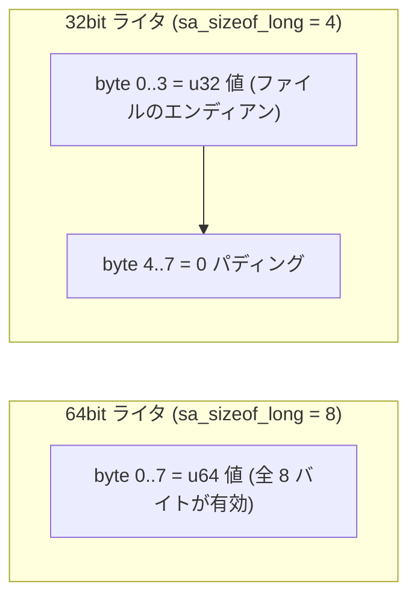
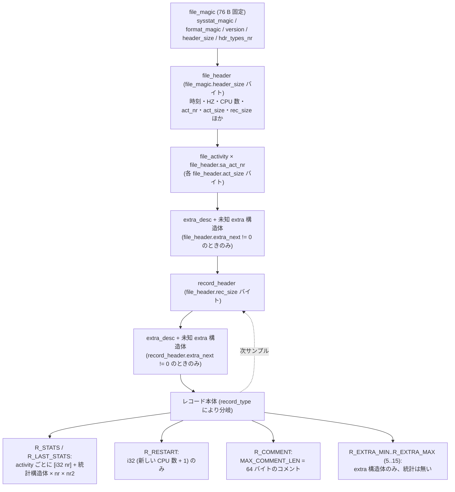
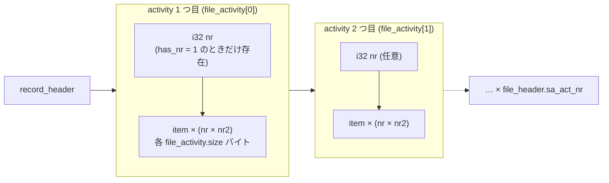
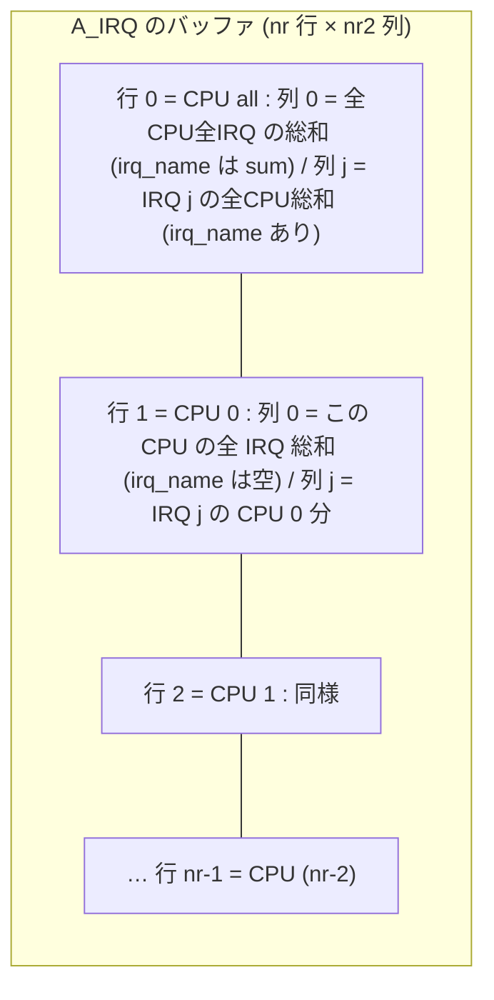
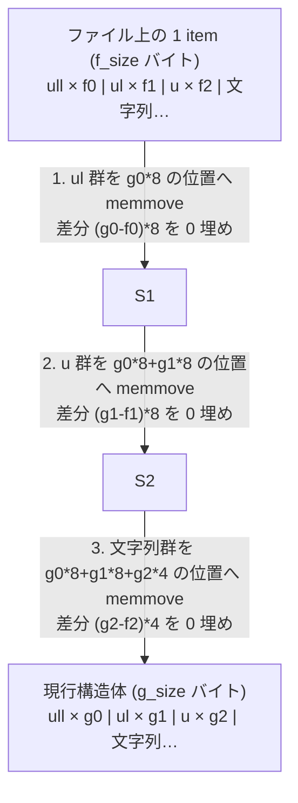

# sysstat `sa` バイナリ — 全 activity と統計構造体レイアウト仕様

reSARch (Rust 製 sysstat `sa` ファイルパーサ) 実装のための、activity 定義と統計構造体の
完全レイアウト仕様書。本家 sysstat のソース (`activity.c` / `sa.h` / `rd_stats.h` /
`rd_sensors.h` / `sa_common.c` / `sa_conv.c`) を読んで再構成したもの。

- 基準バージョン: **sysstat 12.8.0** (= 本書執筆時の master。`v12.8.0..HEAD` の差分に
  `rd_stats.h` / `rd_sensors.h` / `sa.h` / `activity.c` の変更は無い)
- 対象フォーマット: `FORMAT_MAGIC` = `0x2175` (sysstat 11.7.1 以降)
- GPL ソースの逐語転記は行わない。レイアウトは実測 (clang の AST record layout ダンプを
  `x86_64-linux-gnu` / `aarch64-linux-gnu` / `i686-linux-gnu` / `armv7-linux-gnueabihf`
  の 4 ABI で取得) に基づく自作の表で記述している。

---

## 1. 最重要の前提 — 「8 / 8 / 4 スロットモデル」

sysstat の統計構造体はすべて次の順序で並ぶという厳格な規約を持つ。

1. `unsigned long long` (および `double`) のフィールド群 — **0 個以上**
2. `unsigned long` のフィールド群 (各々 `__attribute__ ((aligned (8)))` 付き) — **0 個以上**
3. `unsigned int` / `int` のフィールド群 — **0 個以上**
4. それ以外 (`char` 配列などの文字列フィールド) — **0 個以上**

この 3 グループの個数が `file_activity.types_nr[3]` = `(ull, ul, u)` としてファイルに
書かれる。ファイル上の占有幅は `rd_stats.h` の定義どおり **常に固定**である。

| グループ | ファイル上の 1 フィールドの占有幅 | 定数 |
|---|---|---|
| `unsigned long long` / `double` | **8 バイト** | `ULL_ALIGNMENT_WIDTH` = 8 |
| `unsigned long` | **8 バイトのスロット** | `UL_ALIGNMENT_WIDTH` = `SIZEOF_LONG_64BIT` = 8 |
| `unsigned int` / `int` | **4 バイト** | `U_ALIGNMENT_WIDTH` = 4 |

`MAP_SIZE(types_nr)` = `ull*8 + ul*8 + u*4` が「数値フィールド部の最小バイト数」であり、
sysstat は `MAP_SIZE(types_nr) > size` なら破損ファイルと判定する。

### 1.1 32bit ライタが書いた `unsigned long` の読み方 (最重要の落とし穴)

`unsigned long` は **`aligned(8)` によりスロット幅が常に 8 バイト**に固定されている
(だから `sizeof(struct stats_*)` が 32bit と 64bit で一致する) が、
32bit マシン (`sizeof(long) == 4`) が書いた場合、意味のある値はスロットの
**先頭 4 バイトだけ**で、残り 4 バイトは構造体パディングである。
`sadc` は書き込みバッファを毎回 `memset` してから埋めるため、**ディスク上のパディングは
ゼロ**になっている。



- 判定は `file_header.sa_sizeof_long` (4 か 8) で行う。
- **意味のある 4 バイトはスロットの先頭側**にある (フィールドがスロット先頭に配置され、
  その後にパディングが置かれるため)。本家の `tests/data-ppc-11.7.2` は
  `sa_sizeof_long = 4` のビッグエンディアン PowerPC が書いたファイルで、
  実際に `sa_hz` (= `unsigned long`) の値 100 がスロットの先頭 4 バイトに
  BE u32 (`00 00 00 64`) として入り、後続 4 バイトがゼロになっている。
- **reSARch で採るべき普遍的な規則**:
  `sa_sizeof_long == 4` なら**スロットの先頭 4 バイトだけをファイルのエンディアンで読んで
  ゼロ拡張**する。`== 8` なら 8 バイトをファイルのエンディアンで読む。
  これで LE/BE × 32/64bit の 4 通りすべてで正しくなる。
- 本家 `swap_struct()` は「`is64bit` なら 64bit スワップ、さもなくばスロット先頭 4 バイト
  だけを 32bit スワップし、ポインタは常に 8 進める」という動作。
  **リトルエンディアン環境ではスワップ後に 8 バイトを u64 として読んでも正しい値になる**
  (パディングがゼロで、値が下位側にあるため)。
- **本家に残っている潜在的な穴 (要検証)**: 「ビッグエンディアン 32bit が書いたファイルを
  ビッグエンディアン 64bit で読む」ケースでは `endian_mismatch = false` なのでスワップが
  走らず、`*(unsigned long *)` が 8 バイトを BE u64 として読むため値が 2^32 倍になる。
  上記の「先頭 4 バイトだけ読む」実装なら発生しない。

### 1.2 `double` は `types_nr[0]` に数えられる

`stats_pwr_fan` / `stats_pwr_temp` / `stats_pwr_in` の値は IEEE-754 の `double` だが、
`STATS_PWR_*_ULL` に計上され、エンディアン変換も 64bit 整数として行われる。
Rust では `f64::from_bits(u64::from_le_bytes(..))` 相当で読む。

### 1.3 構造体サイズが ABI で変わる唯一の例外: `stats_queue`

4 ABI で実測した結果、**`stats_queue` だけ i386 (ILP32, System V) でサイズが変わる**。

| 構造体 | x86_64 | aarch64 | i686 | armv7 |
|---|---:|---:|---:|---:|
| `stats_queue` | 40 | 40 | **36** | 40 |
| 上記以外の全 43 構造体 | (同一) | (同一) | (同一) | (同一) |

理由: `stats_queue` は先頭 3 個の `unsigned long long` に `aligned(8)` が付いていないため、
i386 の psABI (long long のアライメントは 4) では構造体アライメントが 4 になり、
末尾の 4 バイトパディングが付かない。ARM32 (AAPCS) は long long のアライメントが 8 なので
40 になる。

→ **実装上の結論: 1 item のサイズは必ず `file_activity.size` を信じ、`sizeof` 相当の
定数をハードコードしてはならない。** 「32bit だから小さい」でもない (arch 依存)。

---

## 2. ファイル全体の構造



### 2.1 レコード種別 (`record_header.record_type`)

| 値 | シンボル | 本体 |
|---:|---|---|
| 1 | `R_STATS` | 統計データ |
| 2 | `R_RESTART` | `__nr_t` (i32) = 新しい CPU 数 + 1。`file_header.sa_cpu_nr` を更新する |
| 3 | `R_LAST_STATS` | ローテーション前の最終統計。**ファイル上は `R_STATS` (1) として書かれる**ので読み手が見ることはない |
| 4 | `R_COMMENT` | 64 バイト固定長のコメント文字列 (`sadc -C`) |
| 5..15 | `R_EXTRA_MIN`..`R_EXTRA_MAX` | extra 構造体のみ。読み手は読み飛ばして次の `record_header` へ進む |

サニティチェック (本家 `read_record_hdr()` と同等のものを実装すべき):
`record_type != 0` かつ `<= 15`、`hour <= 23`、`minute <= 59`、`second <= 60`、
`ust_time >= 1000000000`。

### 2.2 エンディアンと 32/64bit の判定

| 判定 | 方法 |
|---|---|
| sysstat ファイルか | `file_magic.sysstat_magic` == `0xd596` (ネイティブ) または `0x96d5` (要バイトスワップ) |
| フォーマット互換か | `file_magic.format_magic` == `0x2175` (スワップ時は `0x7521`) |
| ライタの word size | `file_header.sa_sizeof_long` == 8 → 64bit、== 4 → 32bit |

`sysstat_magic` / `format_magic` は `unsigned short` なので、スワップ判定は
この 2 フィールドだけで完結する。以降のフィールドは「(ull, ul, u) グループ単位で
バイトスワップ」するのが本家の `swap_struct()` の動作である
(`char` 配列やパディングはスワップしない)。

### 2.3 `FORMAT_MAGIC` = `0x2175` の中にある 3 つのヘッダ変種 (見落としやすい)

`FORMAT_MAGIC` は v11.7.1 から変わっていないが、**`file_header` と `record_header` は
その後 2 回拡張されている**。しかも `record_header` はサイズが変わらず、
`file_header` は 2 つの変種が同じ 328 バイトなので、**サイズだけでは判別できない**。

| 変種 | 対象バージョン | `file_header` | `hdr_types_nr` | `record_header` | `rec_types_nr` |
|---|---|---:|---|---:|---|
| **A** | `v11.7.1` 〜 `v12.1.6` | 328 B | `(1,1,11)` | 24 B | `(2,0,0)` |
| **B** | `v12.1.7` | 328 B | `(1,1,12)` | 24 B | `(2,0,1)` |
| **C** | `v12.2.0` 〜 `v12.8.0` | **336 B** | `(1,1,12)` | 24 B | `(2,0,1)` |

- A → B: `file_header.extra_next` (u32) と `record_header.extra_next` (u32) が追加
  (`extra_desc` / `R_EXTRA_*` レコードの導入)。どちらも末尾パディングを流用したので
  サイズが変わらない。
- B → C: `file_header.sa_tzname[TZNAME_LEN=8]` が追加され 328 → 336 バイト。

**判別方法**: `file_header` は `file_magic.hdr_types_nr[2]` (11 か 12) と
`file_magic.header_size` (328 か 336) の組み合わせ、`record_header` は
`file_header.rec_types_nr[2]` (0 か 1) を見る。
`remap_struct()` 相当の処理 (§8.2) を実装していれば自動的に吸収されるが、
固定オフセットで決め打ちすると変種 A のファイルで `extra_next` に
`sa_day`/`sa_month` のバイトを読んでしまう。

本家テストデータで実機確認できる例:

| ファイル | バージョン | 変種 | 特徴 |
|---|---|---|---|
| `tests/data-12.0.0` | 12.0.0 | A | `header_size` = 328、`hdr_types_nr` = (1,1,11)、`rec_types_nr` = (2,0,0) |
| `tests/data-extra-12.1.7` | 12.1.7 | B | `header_size` = 328、`hdr_types_nr` = (1,1,12)、`rec_types_nr` = (2,0,1) |
| `tests/data-12.5.6-A_QUEUE_modified` | 12.5.6 | C | `header_size` = 336 |
| `tests/data-ppc-11.7.2` | 11.5.5 (PowerPC) を 11.7.2 の `sadf -c` で変換 | A | **ビッグエンディアン + `sa_sizeof_long` = 4**。`file_magic.upgraded` = `0x703` (= 7×256 + 2 + 1) で「11.7.2 が変換した」ことが分かる。`sysstat_version` 等は元ファイルの 11.5.5 のまま |

---

## 3. activity 一覧 (A_CPU=1 〜 A_PWR_BAT=43)

`ACTIVITY_MAGIC_BASE` = `0x8a` (= 138)。`magic` 列はその実値。
`size (64b)` / `size (32b)` は LP64 / i386 ILP32 での 1 item のバイト数。

| ID | シンボル | sar オプション | 名称 | magic | 構造体 | size (64b) | size (32b) | `types_nr` (ull,ul,u) |
|---:|---|---|---|---|---|---:|---:|---|
| 1 | `A_CPU` | `-u [ALL]` (+ `-P`) | CPU 利用率 | `0x8b` (139) | `stats_cpu` | 80 | 80 | (10,0,0) |
| 2 | `A_PCSW` | `-w` | タスク生成とコンテキストスイッチ | `0x8b` (139) | `stats_pcsw` | 16 | 16 | (1,1,0) |
| 3 | `A_IRQ` | `-I` (`SUM` / `ALL`) | 割り込み統計 | `0x8c` (140) | `stats_irq` | 12 | 12 | (0,0,1) |
| 4 | `A_SWAP` | `-W` | スワップ活動 | `0x8a` (138) | `stats_swap` | 16 | 16 | (0,2,0) |
| 5 | `A_PAGE` | `-B` | ページング活動 | `0x8a` (138) | `stats_paging` | 80 | 80 | (0,10,0) |
| 6 | `A_IO` | `-b` | I/O と転送レート | `0x8b` (139) | `stats_io` | 56 | 56 | (7,0,0) |
| 7 | `A_MEMORY` | `-r [ALL]` / `-S` | メモリ / スワップ利用率 | `0x8b` (139) | `stats_memory` | 144 | 144 | (18,0,0) |
| 8 | `A_KTABLES` | `-v` | カーネルテーブル統計 | `0x8b` (139) | `stats_ktables` | 32 | 32 | (4,0,0) |
| 9 | `A_QUEUE` | `-q [LOAD]` | キュー長とロードアベレージ | `0x8c` (140) | `stats_queue` | 40 | 36 | (3,0,3) |
| 10 | `A_SERIAL` | `-y` | TTY (シリアル) デバイス統計 | `0x8b` (139) | `stats_serial` | 28 | 28 | (0,0,7) |
| 11 | `A_DISK` | `-d` | ブロックデバイス統計 | `0x8c` (140) | `stats_disk` | 80 | 80 | (3,3,8) |
| 12 | `A_NET_DEV` | `-n DEV` | ネットワークインターフェース統計 | `0x8d` (141) | `stats_net_dev` | 80 | 80 | (7,0,1) |
| 13 | `A_NET_EDEV` | `-n EDEV` | ネットワークインターフェースエラー統計 | `0x8c` (140) | `stats_net_edev` | 88 | 88 | (9,0,0) |
| 14 | `A_NET_NFS` | `-n NFS` | NFS クライアント統計 | `0x8a` (138) | `stats_net_nfs` | 24 | 24 | (0,0,6) |
| 15 | `A_NET_NFSD` | `-n NFSD` | NFS サーバ統計 | `0x8a` (138) | `stats_net_nfsd` | 44 | 44 | (0,0,11) |
| 16 | `A_NET_SOCK` | `-n SOCK` | IPv4 ソケット統計 | `0x8a` (138) | `stats_net_sock` | 24 | 24 | (0,0,6) |
| 17 | `A_NET_IP` | `-n IP` | IPv4 トラフィック統計 | `0x8c` (140) | `stats_net_ip` | 64 | 64 | (8,0,0) |
| 18 | `A_NET_EIP` | `-n EIP` | IPv4 トラフィックエラー統計 | `0x8c` (140) | `stats_net_eip` | 64 | 64 | (8,0,0) |
| 19 | `A_NET_ICMP` | `-n ICMP` | ICMPv4 トラフィック統計 | `0x8a` (138) | `stats_net_icmp` | 112 | 112 | (0,14,0) |
| 20 | `A_NET_EICMP` | `-n EICMP` | ICMPv4 トラフィックエラー統計 | `0x8a` (138) | `stats_net_eicmp` | 96 | 96 | (0,12,0) |
| 21 | `A_NET_TCP` | `-n TCP` | TCPv4 トラフィック統計 | `0x8a` (138) | `stats_net_tcp` | 32 | 32 | (0,4,0) |
| 22 | `A_NET_ETCP` | `-n ETCP` | TCPv4 トラフィックエラー統計 | `0x8a` (138) | `stats_net_etcp` | 40 | 40 | (0,5,0) |
| 23 | `A_NET_UDP` | `-n UDP` | UDPv4 トラフィック統計 | `0x8a` (138) | `stats_net_udp` | 32 | 32 | (0,4,0) |
| 24 | `A_NET_SOCK6` | `-n SOCK6` | IPv6 ソケット統計 | `0x8a` (138) | `stats_net_sock6` | 16 | 16 | (0,0,4) |
| 25 | `A_NET_IP6` | `-n IP6` | IPv6 トラフィック統計 | `0x8c` (140) | `stats_net_ip6` | 80 | 80 | (10,0,0) |
| 26 | `A_NET_EIP6` | `-n EIP6` | IPv6 トラフィックエラー統計 | `0x8c` (140) | `stats_net_eip6` | 88 | 88 | (11,0,0) |
| 27 | `A_NET_ICMP6` | `-n ICMP6` | ICMPv6 トラフィック統計 | `0x8a` (138) | `stats_net_icmp6` | 136 | 136 | (0,17,0) |
| 28 | `A_NET_EICMP6` | `-n EICMP6` | ICMPv6 トラフィックエラー統計 | `0x8a` (138) | `stats_net_eicmp6` | 88 | 88 | (0,11,0) |
| 29 | `A_NET_UDP6` | `-n UDP6` | UDPv6 トラフィック統計 | `0x8a` (138) | `stats_net_udp6` | 32 | 32 | (0,4,0) |
| 30 | `A_PWR_CPU` | `-m CPU` | CPU クロック周波数 | `0x8a` (138) | `stats_pwr_cpufreq` | 8 | 8 | (0,1,0) |
| 31 | `A_PWR_FAN` | `-m FAN` | ファン回転数 | `0x8a` (138) | `stats_pwr_fan` | 40 | 40 | (2,0,0) |
| 32 | `A_PWR_TEMP` | `-m TEMP` | デバイス温度 | `0x8a` (138) | `stats_pwr_temp` | 48 | 48 | (3,0,0) |
| 33 | `A_PWR_IN` | `-m IN` | 電圧入力 | `0x8a` (138) | `stats_pwr_in` | 48 | 48 | (3,0,0) |
| 34 | `A_HUGE` | `-H` | Huge page 利用率 | `0x8b` (139) | `stats_huge` | 32 | 32 | (4,0,0) |
| 35 | `A_PWR_FREQ` | `-m FREQ` | CPU 重み付き周波数 (time-in-state) | `0x8b` (139) | `stats_pwr_wghfreq` | 16 | 16 | (1,1,0) |
| 36 | `A_PWR_USB` | `-m USB` | USB デバイス | `0x8a` (138) | `stats_pwr_usb` | 88 | 88 | (0,0,4) |
| 37 | `A_FS` | `-F [MOUNT]` | ファイルシステム統計 | `0x8b` (139) | `stats_filesystem` | 296 | 296 | (5,0,0) |
| 38 | `A_NET_FC` | `-n FC` | Fibre Channel HBA 統計 | `0x8a` (138) | `stats_fchost` | 48 | 48 | (0,4,0) |
| 39 | `A_NET_SOFT` | `-n SOFT` | ソフトウェア割り込み (softnet) 統計 | `0x8a` (138) | `stats_softnet` | 24 | 24 | (0,0,6) |
| 40 | `A_PSI_CPU` | `-q CPU` | PSI — CPU 圧力 | `0x8a` (138) | `stats_psi_cpu` | 32 | 32 | (1,3,0) |
| 41 | `A_PSI_IO` | `-q IO` | PSI — I/O 圧力 | `0x8a` (138) | `stats_psi_io` | 64 | 64 | (2,6,0) |
| 42 | `A_PSI_MEM` | `-q MEM` | PSI — メモリ圧力 | `0x8a` (138) | `stats_psi_mem` | 64 | 64 | (2,6,0) |
| 43 | `A_PWR_BAT` | `-m BAT` | バッテリ容量 | `0x8a` (138) | `stats_pwr_bat` | 3 | 3 | (0,0,0) |


| ID | シンボル | `-S` グループ | `nr` の意味 | `nr2` | `has_nr` | `nr_max` | count 関数 | `AO_*` フラグ |
|---:|---|---|---|---|:-:|---|---|---|
| 1 | `A_CPU` | 既定 | CPU 数 + 1 (index 0 = "all") | 1 | Y | `NR_CPUS + 1` | `get_cpu_nr()` — /proc/stat の `cpuN` 行を数える | `AO_COLLECTED` + `AO_COUNTED` + `AO_PERSISTENT` + `AO_MULTIPLE_OUTPUTS` + `AO_GRAPH_PER_ITEM` + `AO_ALWAYS_COUNTED` |
| 2 | `A_PCSW` | 既定 | 1 (固定) | 1 | N | `1` | — (定数) | `AO_COLLECTED` |
| 3 | `A_IRQ` | INT | CPU 数 + 1 (index 0 = "all") | 可変 (sub-item 数) | Y | `NR_CPUS + 1` | `get_cpu_nr()` — /proc/stat の `cpuN` 行を数える<br>nr2: `get_irqcpu_nr()` — /proc/interrupts の行数 | `AO_COUNTED` + `AO_MATRIX` + `AO_PERSISTENT` |
| 4 | `A_SWAP` | 既定 | 1 | 1 | N | `1` | — (定数) | `AO_COLLECTED` |
| 5 | `A_PAGE` | 既定 | 1 | 1 | N | `1` | — (定数) | `AO_COLLECTED` |
| 6 | `A_IO` | 既定 | 1 | 1 | N | `1` | — (定数) | `AO_COLLECTED` |
| 7 | `A_MEMORY` | 既定 | 1 | 1 | N | `1` | — (定数) | `AO_COLLECTED` + `AO_MULTIPLE_OUTPUTS` |
| 8 | `A_KTABLES` | 既定 | 1 | 1 | N | `1` | — (定数) | `AO_COLLECTED` |
| 9 | `A_QUEUE` | 既定 | 1 | 1 | N | `1` | — (定数) | `AO_COLLECTED` |
| 10 | `A_SERIAL` | 既定 | TTY 回線数 | 1 | Y | `MAX_NR_SERIAL_LINES` | `get_serial_nr()` — /proc/tty/driver/serial | `AO_COLLECTED` + `AO_COUNTED` |
| 11 | `A_DISK` | DISK | ブロックデバイス数 | 1 | Y | `MAX_NR_DISKS` | `get_diskstats_dev_nr()` — /proc/diskstats | `AO_COUNTED` + `AO_GRAPH_PER_ITEM` |
| 12 | `A_NET_DEV` | 既定 | NIC 数 | 1 | Y | `MAX_NR_IFACES` | `get_iface_nr()` — /proc/net/dev | `AO_COLLECTED` + `AO_COUNTED` + `AO_GRAPH_PER_ITEM` |
| 13 | `A_NET_EDEV` | 既定 | NIC 数 | 1 | Y | `MAX_NR_IFACES` | `get_iface_nr()` — /proc/net/dev | `AO_COLLECTED` + `AO_COUNTED` + `AO_GRAPH_PER_ITEM` |
| 14 | `A_NET_NFS` | 既定 | 1 | 1 | N | `1` | — (定数) | `AO_COLLECTED` |
| 15 | `A_NET_NFSD` | 既定 | 1 | 1 | N | `1` | — (定数) | `AO_COLLECTED` |
| 16 | `A_NET_SOCK` | 既定 | 1 | 1 | N | `1` | — (定数) | `AO_COLLECTED` |
| 17 | `A_NET_IP` | SNMP | 1 | 1 | N | `1` | — (定数) | `AO_NULL` |
| 18 | `A_NET_EIP` | SNMP | 1 | 1 | N | `1` | — (定数) | `AO_NULL` |
| 19 | `A_NET_ICMP` | SNMP | 1 | 1 | N | `1` | — (定数) | `AO_NULL` |
| 20 | `A_NET_EICMP` | SNMP | 1 | 1 | N | `1` | — (定数) | `AO_NULL` |
| 21 | `A_NET_TCP` | SNMP | 1 | 1 | N | `1` | — (定数) | `AO_NULL` |
| 22 | `A_NET_ETCP` | SNMP | 1 | 1 | N | `1` | — (定数) | `AO_NULL` |
| 23 | `A_NET_UDP` | SNMP | 1 | 1 | N | `1` | — (定数) | `AO_NULL` |
| 24 | `A_NET_SOCK6` | IPV6 | 1 | 1 | N | `1` | — (定数) | `AO_NULL` |
| 25 | `A_NET_IP6` | IPV6 | 1 | 1 | N | `1` | — (定数) | `AO_NULL` |
| 26 | `A_NET_EIP6` | IPV6 | 1 | 1 | N | `1` | — (定数) | `AO_NULL` |
| 27 | `A_NET_ICMP6` | IPV6 | 1 | 1 | N | `1` | — (定数) | `AO_NULL` |
| 28 | `A_NET_EICMP6` | IPV6 | 1 | 1 | N | `1` | — (定数) | `AO_NULL` |
| 29 | `A_NET_UDP6` | IPV6 | 1 | 1 | N | `1` | — (定数) | `AO_NULL` |
| 30 | `A_PWR_CPU` | POWER | CPU 数 + 1 (index 0 = 平均) | 1 | Y | `NR_CPUS + 1` | `get_cpu_nr()` — /proc/stat の `cpuN` 行を数える | `AO_COUNTED` + `AO_GRAPH_PER_ITEM` |
| 31 | `A_PWR_FAN` | POWER | ファン数 | 1 | Y | `MAX_NR_FANS` | `get_fan_nr()` — libsensors | `AO_COUNTED` + `AO_GRAPH_PER_ITEM` |
| 32 | `A_PWR_TEMP` | POWER | 温度センサ数 | 1 | Y | `MAX_NR_TEMP_SENSORS` | `get_temp_nr()` — libsensors | `AO_COUNTED` + `AO_GRAPH_PER_ITEM` |
| 33 | `A_PWR_IN` | POWER | 電圧センサ数 | 1 | Y | `MAX_NR_IN_SENSORS` | `get_in_nr()` — libsensors | `AO_COUNTED` + `AO_GRAPH_PER_ITEM` |
| 34 | `A_HUGE` | 既定 | 1 | 1 | N | `1` | — (定数) | `AO_COLLECTED` |
| 35 | `A_PWR_FREQ` | POWER | CPU 数 + 1 (行 0 = "all") | 可変 (sub-item 数) | Y | `NR_CPUS + 1` | `get_cpu_nr()` — /proc/stat の `cpuN` 行を数える<br>nr2: `get_freq_nr()` — cpufreq/stats/time_in_state の行数 | `AO_COUNTED` + `AO_MATRIX` |
| 36 | `A_PWR_USB` | POWER | USB デバイス数 | 1 | Y | `MAX_NR_USB` | `get_usb_nr()` — /sys/bus/usb/devices | `AO_COUNTED` + `AO_CLOSE_MARKUP` |
| 37 | `A_FS` | XDISK | マウント済みファイルシステム数 | 1 | Y | `MAX_NR_FS` | `get_filesystem_nr()` — /etc/mtab | `AO_COUNTED` + `AO_GRAPH_PER_ITEM` + `AO_MULTIPLE_OUTPUTS` |
| 38 | `A_NET_FC` | DISK | FC ホスト数 | 1 | Y | `MAX_NR_FCHOSTS` | `get_fchost_nr()` — /sys/class/fc_host | `AO_COUNTED` + `AO_GRAPH_PER_ITEM` |
| 39 | `A_NET_SOFT` | 既定 | CPU 数 + 1 (index 0 = "all") | 1 | Y | `NR_CPUS + 1` | `get_cpu_nr()` — /proc/stat の `cpuN` 行を数える | `AO_COLLECTED` + `AO_COUNTED` + `AO_CLOSE_MARKUP` + `AO_GRAPH_PER_ITEM` + `AO_PERSISTENT` |
| 40 | `A_PSI_CPU` | 既定 | 1 | 1 | N | `1` | `detect_psi()` — /proc/pressure の存在確認のみ | `AO_COLLECTED` + `AO_DETECTED` |
| 41 | `A_PSI_IO` | 既定 | 1 | 1 | N | `1` | `detect_psi()` — /proc/pressure の存在確認のみ | `AO_COLLECTED` + `AO_DETECTED` |
| 42 | `A_PSI_MEM` | 既定 | 1 | 1 | N | `1` | `detect_psi()` — /proc/pressure の存在確認のみ | `AO_COLLECTED` + `AO_DETECTED` + `AO_CLOSE_MARKUP` |
| 43 | `A_PWR_BAT` | POWER | バッテリ数 | 1 | Y | `MAX_NR_BATS` | `get_bat_nr()` — /sys/class/power_supply/BATn | `AO_COUNTED` + `AO_GRAPH_PER_ITEM` |

### 3.1 `AO_*` オプションフラグの意味と付与先

`struct activity.options` のビットフラグ。**パーサにとって決定的に重要なのは
`AO_COUNTED` (= `has_nr` が立つ) と `AO_MATRIX` (= `nr2 > 1`)** の 2 つだけで、
残りは収集/表示側の挙動を決めるもの。

| フラグ | 値 | 意味 | 付与される activity (12.8.0) |
|---|---|---|---|
| `AO_NULL` | `0x000` | フラグ無し (既定では収集されない) | 13 件: `A_NET_IP` `A_NET_EIP` `A_NET_ICMP` `A_NET_EICMP` `A_NET_TCP` `A_NET_ETCP` `A_NET_UDP` `A_NET_SOCK6` `A_NET_IP6` `A_NET_EIP6` `A_NET_ICMP6` `A_NET_EICMP6` `A_NET_UDP6` |
| `AO_COLLECTED` | `0x001` | sadc が既定で収集する (実行時に `-S` で増減) | 19 件: `A_CPU` `A_PCSW` `A_SWAP` `A_PAGE` `A_IO` `A_MEMORY` `A_KTABLES` `A_QUEUE` `A_SERIAL` `A_NET_DEV` `A_NET_EDEV` `A_NET_NFS` `A_NET_NFSD` `A_NET_SOCK` `A_HUGE` `A_NET_SOFT` `A_PSI_CPU` `A_PSI_IO` `A_PSI_MEM` |
| `AO_SELECTED` | `0x002` | sar が表示対象に選んだ (実行時のみ。ファイルには出ない) | — |
| `AO_COUNTED` | `0x004` | item 数を数える count 関数を持つ → **`file_activity.has_nr = 1` になり、各サンプルで統計の前に `i32` の item 数が入る** | 16 件: `A_CPU` `A_IRQ` `A_SERIAL` `A_DISK` `A_NET_DEV` `A_NET_EDEV` `A_PWR_CPU` `A_PWR_FAN` `A_PWR_TEMP` `A_PWR_IN` `A_PWR_FREQ` `A_PWR_USB` `A_FS` `A_NET_FC` `A_NET_SOFT` `A_PWR_BAT` |
| `AO_PERSISTENT` | `0x008` | デバイスが再登録されたとき値が復帰する (CPU 系)。読み側では「サンプルの item 数が `nr_ini` より少ない場合、残りのバッファを 0 クリアする」処理が必要 | 3 件: `A_CPU` `A_IRQ` `A_NET_SOFT` |
| `AO_CLOSE_MARKUP` | `0x010` | XML/JSON 出力でグループの閉じタグを出す担当 | 3 件: `A_PWR_USB` `A_NET_SOFT` `A_PSI_MEM` |
| `AO_MULTIPLE_OUTPUTS` | `0x020` | 1 つの activity が複数の出力形式を持つ (`-r`/`-S`、`-u`/`-u ALL`、`-F`/`-F MOUNT`)。`hdr_line` が `\|` で区切られる | 3 件: `A_CPU` `A_MEMORY` `A_FS` |
| `AO_GRAPH_PER_ITEM` | `0x040` | SVG 出力で item ごとにグラフを作る | 12 件: `A_CPU` `A_DISK` `A_NET_DEV` `A_NET_EDEV` `A_PWR_CPU` `A_PWR_FAN` `A_PWR_TEMP` `A_PWR_IN` `A_FS` `A_NET_FC` `A_NET_SOFT` `A_PWR_BAT` |
| `AO_MATRIX` | `0x080` | sub-item を持つ = **`nr2` が可変で、item が `nr × nr2` 個並ぶ** | 2 件: `A_IRQ` `A_PWR_FREQ` |
| `AO_LIST_ON_CMDLINE` | `0x100` | コマンドラインで item 名リストが指定された (実行時のみ) | — |
| `AO_ALWAYS_COUNTED` | `0x200` | 収集対象でなくても item 数を必ず数える (CPU 数は他 activity が参照するため) | 1 件: `A_CPU` |
| `AO_DETECTED` | `0x400` | count 関数は「`/proc`・`/sys` のファイルが存在するかの検査」にのみ使う。**item 数は固定 1 なので `has_nr` は立たない** | 3 件: `A_PSI_CPU` `A_PSI_IO` `A_PSI_MEM` |

`AO_DETECTED` と `AO_COUNTED` の違いは `has_nr` に直結するため、実装で最も混乱しやすい点。
PSI の 3 つは `f_count_index >= 0` だが `AO_COUNTED` を持たないので、**統計の前に item 数は
入らない**。

### 3.2 `-S` グループ (sadc の収集グループ)

| キーワード | 定数 | 値 | 対象 activity |
|---|---|---:|---|
| (既定) | `G_DEFAULT` | `0x00` | 上記 `AO_COLLECTED` の 19 件が属する既定グループ |
| `INT` | `G_INT` | `0x01` | `A_IRQ` |
| `DISK` | `G_DISK` | `0x02` | `A_DISK`, `A_NET_FC` |
| `SNMP` | `G_SNMP` | `0x04` | `A_NET_IP` 〜 `A_NET_UDP` (IPv4 SNMP 系 7 件) |
| `IPV6` | `G_IPV6` | `0x08` | `A_NET_SOCK6` 〜 `A_NET_UDP6` (IPv6 系 6 件) |
| `POWER` | `G_POWER` | `0x10` | `A_PWR_CPU` `A_PWR_FAN` `A_PWR_TEMP` `A_PWR_IN` `A_PWR_FREQ` `A_PWR_USB` `A_PWR_BAT` |
| `XDISK` | `G_XDISK` | `0x20` | `A_FS` (+ `G_DISK` も併せて選択され、パーティション統計が有効化される) |

`-S ALL` は `G_XDISK` を除く全 activity、`-S XALL` は `G_XDISK` も含めた全 activity。
`-S A_XXX` で activity 名を直接指定することもできる (`activity.name` 文字列と照合)。

### 3.3 `ACTIVITY_MAGIC` の履歴

`ACTIVITY_MAGIC_BASE` = `0x8a` (138) は **v9.1.6 で導入され以降不変**。
v9.1.5 以前の `file_activity` には `magic` フィールドそのものが無い。
同時に `ACTIVITY_MAGIC_UNKNOWN` = `0x89` が定義されているが、**ファイルに書かれることは
ない** (メモリ上の未知マーカー)。

**ディスク上に現れる magic は `0x8a` / `0x8b` / `0x8c` / `0x8d` の 4 値だけ**である。

| ID | activity | 現行 magic | 昇格の履歴 (それが入った最初のタグ) |
|---:|---|---|---|
| 1 | `A_CPU` | `0x8b` (`BASE+1`) | +0 @ v9.1.6 → **+1 @ v11.7.2** |
| 2 | `A_PCSW` | `0x8b` | +0 @ v9.1.6 → **+1 @ v11.7.2** |
| 3 | `A_IRQ` | `0x8c` (`BASE+2`) | +0 @ v9.1.6 → +1 @ v11.7.2 → **+2 @ v12.5.6** |
| 4 | `A_SWAP` | `0x8a` | 昇格なし |
| 5 | `A_PAGE` | `0x8a` | 昇格なし |
| 6 | `A_IO` | `0x8b` | +0 @ v9.1.6 → **+1 @ v10.1.1** |
| 7 | `A_MEMORY` | `0x8b` | +0 @ v9.1.6 → **+1 @ v11.7.2** |
| 8 | `A_KTABLES` | `0x8b` | +0 @ v9.1.6 → **+1 @ v11.7.2** |
| 9 | `A_QUEUE` | `0x8c` | +0 @ v9.1.6 → **+1 @ v9.1.7** → **+2 @ v11.7.2** |
| 10 | `A_SERIAL` | `0x8b` | +0 @ v9.1.6 → **+1 @ v11.7.2** |
| 11 | `A_DISK` | `0x8c` | +0 @ v9.1.6 → **+1 @ v10.1.1** → **+2 @ v11.7.2** |
| 12 | `A_NET_DEV` | **`0x8d` (`BASE+3`)** | +0 @ v9.1.6 → **+1 @ v10.1.3** → **+2 @ v10.1.7** → **+3 @ v11.7.2** |
| 13 | `A_NET_EDEV` | `0x8c` | +0 @ v9.1.6 → **+1 @ v10.1.3** → **+2 @ v11.7.2** |
| 14 | `A_NET_NFS` | `0x8a` | 昇格なし |
| 15 | `A_NET_NFSD` | `0x8a` | 昇格なし |
| 16 | `A_NET_SOCK` | `0x8a` | 昇格なし |
| 17 | `A_NET_IP` | `0x8c` | +1 @ v10.1.3 → +2 @ v11.7.2 |
| 18 | `A_NET_EIP` | `0x8c` | +1 @ v10.1.3 → +2 @ v11.7.2 |
| 19 | `A_NET_ICMP` | `0x8a` | 昇格なし |
| 20 | `A_NET_EICMP` | `0x8a` | 昇格なし |
| 21 | `A_NET_TCP` | `0x8a` | 昇格なし |
| 22 | `A_NET_ETCP` | `0x8a` | 昇格なし |
| 23 | `A_NET_UDP` | `0x8a` | 昇格なし |
| 24 | `A_NET_SOCK6` | `0x8a` | 昇格なし |
| 25 | `A_NET_IP6` | `0x8c` | +1 @ v10.1.3 → +2 @ v11.7.2 |
| 26 | `A_NET_EIP6` | `0x8c` | +1 @ v10.1.3 → +2 @ v11.7.2 |
| 27 | `A_NET_ICMP6` | `0x8a` | 昇格なし |
| 28 | `A_NET_EICMP6` | `0x8a` | 昇格なし |
| 29 | `A_NET_UDP6` | `0x8a` | 昇格なし |
| 30 | `A_PWR_CPU` | `0x8a` | 昇格なし (シンボル名のみ v11.7.2 で `A_PWR_CPUFREQ` → `A_PWR_CPU`) |
| 31 | `A_PWR_FAN` | `0x8a` | 昇格なし |
| 32 | `A_PWR_TEMP` | `0x8a` | 昇格なし |
| 33 | `A_PWR_IN` | `0x8a` | 昇格なし |
| 34 | `A_HUGE` | `0x8b` | v9.1.6 新設 (+0) → **+1 @ v11.7.2** |
| 35 | `A_PWR_FREQ` | `0x8b` | v9.1.6 新設 (+0) → **+1 @ v11.7.2** (同時に `A_PWR_WGHFREQ` → `A_PWR_FREQ`) |
| 36 | `A_PWR_USB` | `0x8a` | **v10.0.1** 新設、昇格なし |
| 37 | `A_FS` | `0x8b` | **v10.1.6** 新設 (+0) → **+1 @ v11.7.2** (同時に `A_FILESYSTEM` → `A_FS`) |
| 38 | `A_NET_FC` | `0x8a` | **v11.1.5** 新設、昇格なし |
| 39 | `A_NET_SOFT` | `0x8a` | **v11.5.2** 新設、昇格なし |
| 40 | `A_PSI_CPU` | `0x8a` | **v12.3.3** 新設、昇格なし |
| 41 | `A_PSI_IO` | `0x8a` | **v12.3.3** 新設、昇格なし |
| 42 | `A_PSI_MEM` | `0x8a` | **v12.3.3** 新設、昇格なし |
| 43 | `A_PWR_BAT` | `0x8a` | **v12.7.2** 新設、昇格なし |

### 3.4 v11.7.1 が書いたファイルという罠

**v11.7.1 は `FORMAT_MAGIC` を `0x2175` にし、構造体も新レイアウトにしたが、
per-activity の `magic` を上げ忘れた。** 一括昇格は v11.7.2 で行われた
(CHANGES の記述: "sar: Update magic number for certain activities structures
(should have been done in 11.7.1)")。

結果として **v11.7.1 が書いたデータファイルは「新レイアウトなのに旧 magic」**という
矛盾した状態になり、

- v11.7.2 以降の sar / sadf は magic 不一致としてその 17 activity を読み飛ばす。
- `sadf -c` も「`format_magic` は既に現行」なので `File format already up-to-date` と
  言って何もしない。

reSARch は `format_magic=0x2175`、生成版 `11.7.1.0`、下表の旧magicが一致するときだけ、
デコード計画の選択に翌版のmagicを使う。元のヘッダは書き換えず、現行sar互換出力の
表示判定も元のmagicを使うため、互換出力では本家と同じスキップを保つ。
独自出力・集計では復元した統計を利用できる。未知magicや他の版には適用しない。

[11.7.1](https://github.com/sysstat/sysstat/blob/v11.7.1/rd_stats.h) と
[11.7.2](https://github.com/sysstat/sysstat/blob/v11.7.2/rd_stats.h) の構造体定義は同一で、
差分はコメントのみ。`activity.c` の対応する17箇所でmagicだけが更新されている。
原典CをLinux x86_64/i386 ABIで測定した保存サイズと型数は次のとおり。

| ID | activity | 旧→翌版magic | types_nr | LP64 / ILP32保存サイズ |
|---:|---|---|---|---:|
| 1 | CPU | 8a→8b | (10,0,0) | 80 / 80 |
| 2 | PCSW | 8a→8b | (1,1,0) | 16 / 16 |
| 3 | IRQ | 8a→8b | (1,0,0) | 8 / 8 |
| 7 | MEMORY | 8a→8b | (17,0,0) | 136 / 136 |
| 8 | KTABLES | 8a→8b | (4,0,0) | 32 / 32 |
| 9 | QUEUE | 8b→8c | (3,0,3) | 40 / 36 |
| 10 | SERIAL | 8a→8b | (0,0,7) | 28 / 28 |
| 11 | DISK | 8b→8c | (1,2,6) | 48 / 48 |
| 12 | NET_DEV | 8c→8d | (7,0,1) | 80 / 80 |
| 13 | NET_EDEV | 8b→8c | (9,0,0) | 88 / 88 |
| 17 | NET_IP | 8b→8c | (8,0,0) | 64 / 64 |
| 18 | NET_EIP | 8b→8c | (8,0,0) | 64 / 64 |
| 25 | NET_IP6 | 8b→8c | (10,0,0) | 80 / 80 |
| 26 | NET_EIP6 | 8b→8c | (11,0,0) | 88 / 88 |
| 34 | HUGE | 8a→8b | (2,0,0) | 136 / 136 |
| 35 | PWR_FREQ | 8a→8b | (1,1,0) | 16 / 16 |
| 37 | FS | 8a→8b | (5,0,0) | 296 / 296 |

HUGEは実構造体が16バイトだが、本家が保存サイズをMEMORYの136バイトに取り違えたもの。
全17組×両ABI×両endianの独立fixtureで値位置と境界を検証し、11.7.1の実採取でも
宣言された全activityのデコードを確認する。

同じ理由で **`A_IRQ` は v11.7.2 〜 v12.5.5 (および v12.4.x) が書いたものが
v12.5.6 以降で読めない** (magic `0x8b` → `0x8c`)。これも `sadf -c` の対象外。

---

## 4. 可変長 activity のレコード内配置

### 4.1 1 サンプル (R_STATS レコード) のバイト列

`record_header` の直後、**ファイルの `file_activity[]` に現れた順**に activity が並ぶ。



規則:

1. `file_activity.has_nr != 0` の activity は、**毎サンプル**統計データの直前に
   `__nr_t` (= `int`、**4 バイト、リトル/ビッグは他フィールドと同じ**) の item 数が入る。
   これがそのサンプルの実 item 数 `nr` になる。
2. `has_nr == 0` の activity は `file_activity.nr` (ファイルヘッダ側の値) をそのまま使う。
3. item は**連続配置**され、1 item のバイト数は `file_activity.size`。
   総バイト数は `size × nr × nr2`。
4. `nr2` は毎サンプル記録されない。**`file_activity.nr2` の値をファイル全体で固定して使う**
   (本家 `rd_stats.c` のコメント: 「sub-item 数はファイルに保存されず、定数として扱われる」)。
5. item 数が 0 のサンプルもあり得る (`nr == 0` → データ 0 バイト)。
6. activity の `magic` が自分の知る値と違う、または ID が未知の場合は
   **`size × nr × nr2` バイトを seek でスキップ**する (読み飛ばせるので、未知 activity が
   あってもファイル全体は読める)。

### 4.2 item のインデックス ↔ 意味の対応

| activity | index 0 | index 1..n |
|---|---|---|
| `A_CPU` (1) | CPU "all" (全 CPU の合計 tick) | CPU #0, #1, … (`index - 1` が CPU 番号) |
| `A_IRQ` (3) | 行 0 = CPU "all" | 行 `c` = CPU #`c-1` (§6 参照) |
| `A_PWR_CPU` (30) | 全 CPU の**平均**周波数 | CPU #0, #1, … |
| `A_PWR_FREQ` (35) | 行 0 = 全 CPU の平均 time-in-state | 行 `c` = CPU #`c-1` |
| `A_NET_SOFT` (39) | CPU "all" (個別 CPU の総和として sar 側が計算) | CPU #0, #1, … |
| `A_SERIAL` (10) | 先頭の TTY 回線 (`line` フィールドが識別子) | 以降の回線 |
| `A_DISK` / `A_NET_DEV` / `A_NET_EDEV` / `A_FS` / `A_NET_FC` / `A_PWR_USB` / `A_PWR_FAN` / `A_PWR_TEMP` / `A_PWR_IN` / `A_PWR_BAT` | 0 番目のデバイス | **サンプルごとに順序も個数も変わりうる**。構造体内の名前フィールド (`interface` / `fs_name` / `fchost_name` / `device` / `major`+`minor`+`wwn` / `bat_id`) で同定すること |

CPU 番号インデックスの activity (`A_CPU` `A_IRQ` `A_PWR_CPU` `A_PWR_FREQ` `A_NET_SOFT`。
本家では同一の `cpu_bitmap` を共有する 5 件) では、**オフライン CPU のスロットは
全ゼロで埋められる**。sar は「全フィールドが 0 の CPU スロット = オフライン」と判定して
表示から除外する。

### 4.3 デバイス名を持たない可変長 activity の注意

`A_SERIAL` は回線番号 `line`、`A_PWR_BAT` は `bat_id`、`A_DISK` は `major`/`minor`
(および `wwn`) が同定キーであり、**配列添字は同定キーにならない**。
`A_PWR_FAN` / `A_PWR_TEMP` / `A_PWR_IN` は `device[20]` 文字列が同定キーだが、
libsensors が返す順序に依存するため安定とは限らない (要検証: センサ順序の安定性は
カーネル/libsensors のバージョンに依存)。

---

## 5. 各統計構造体の完全レイアウト

- 「off (64bit)」は LP64 (x86_64 / aarch64)、「off (32bit)」は i386 ILP32 でのバイトオフセット。
  ARM32 (armv7 EABI) は `stats_queue` を除きすべて LP64 と同一。
- `unsigned long` の「バイト長」欄の `8 / 4` は「ファイル上のスロット幅 8 / 32bit ライタでの
  有効バイト数 4」の意 (§1.1)。
- 末尾パディングは表には現れないが、「サイズ」行の値が**実サイズ**であり、
  `item_size = サイズ` として seek/スライスすること。
- `types_nr` 行の `MAP_SIZE` が数値フィールド部の合計。それを超える分が文字列フィールドと
  末尾パディングである。

#### `stats_cpu` — A_CPU (1)

- サイズ: **80 B (LP64)** / **80 B (i386 ILP32)** / 80 B (ARM32) — アライメント 8 / 4
- `types_nr` = (ull, ul, u) = **(10, 0, 0)** → `MAP_SIZE` = 80 B、`XNR` = 10

| フィールド | C 型 | バイト長 | off (64bit) | off (32bit) | 意味 / 単位 |
|---|---|---|---|---|---|
| `cpu_user` | `unsigned long long` | 8 | 0 | 0 | ユーザモードで消費した時間 (tick = 1/`sa_hz` 秒)。guest 時間を含む |
| `cpu_nice` | `unsigned long long` | 8 | 8 | 8 | nice 値付きユーザモードの時間 (tick)。guest_nice を含む |
| `cpu_sys` | `unsigned long long` | 8 | 16 | 16 | システム (カーネル) モードの時間 (tick)。hardirq/softirq は含まない |
| `cpu_idle` | `unsigned long long` | 8 | 24 | 24 | アイドル時間 (tick) |
| `cpu_iowait` | `unsigned long long` | 8 | 32 | 32 | I/O 待ちアイドル時間 (tick) |
| `cpu_steal` | `unsigned long long` | 8 | 40 | 40 | 仮想化環境で他ドメインに奪われた時間 (tick)。**/proc/stat の 8 番目** |
| `cpu_hardirq` | `unsigned long long` | 8 | 48 | 48 | ハード割り込み処理時間 (tick)。**/proc/stat の 6 番目** |
| `cpu_softirq` | `unsigned long long` | 8 | 56 | 56 | ソフト割り込み処理時間 (tick)。**/proc/stat の 7 番目** |
| `cpu_guest` | `unsigned long long` | 8 | 64 | 64 | ゲスト VCPU 実行時間 (tick) |
| `cpu_guest_nice` | `unsigned long long` | 8 | 72 | 72 | nice 値付きゲスト VCPU 実行時間 (tick) |

#### `stats_pcsw` — A_PCSW (2)

- サイズ: **16 B (LP64)** / **16 B (i386 ILP32)** / 16 B (ARM32) — アライメント 8 / 8
- `types_nr` = (ull, ul, u) = **(1, 1, 0)** → `MAP_SIZE` = 16 B、`XNR` = 2

| フィールド | C 型 | バイト長 | off (64bit) | off (32bit) | 意味 / 単位 |
|---|---|---|---|---|---|
| `context_switch` | `unsigned long long` | 8 | 0 | 0 | コンテキストスイッチ累積回数 (/proc/stat `ctxt`) |
| `processes` | `unsigned long` | 8 / 4 | 8 | 8 | 生成されたタスク累積数 (/proc/stat `processes`) |

#### `stats_irq` — A_IRQ (3)

- サイズ: **12 B (LP64)** / **12 B (i386 ILP32)** / 12 B (ARM32) — アライメント 4 / 4
- `types_nr` = (ull, ul, u) = **(0, 0, 1)** → `MAP_SIZE` = 4 B、`XNR` = 1

| フィールド | C 型 | バイト長 | off (64bit) | off (32bit) | 意味 / 単位 |
|---|---|---|---|---|---|
| `irq_nr` | `unsigned int` | 4 | 0 | 0 | 割り込み回数 (累積)。行 = CPU、列 = 割り込みの行列要素 |
| `irq_name` | `char[8]` | 8 | 4 | 4 | 割り込み名 (NUL 終端。CPU "all" 行のみ設定、他行は空)。`sum` は総和スロット |

#### `stats_swap` — A_SWAP (4)

- サイズ: **16 B (LP64)** / **16 B (i386 ILP32)** / 16 B (ARM32) — アライメント 8 / 8
- `types_nr` = (ull, ul, u) = **(0, 2, 0)** → `MAP_SIZE` = 16 B、`XNR` = 2

| フィールド | C 型 | バイト長 | off (64bit) | off (32bit) | 意味 / 単位 |
|---|---|---|---|---|---|
| `pswpin` | `unsigned long` | 8 / 4 | 0 | 0 | スワップイン ページ数 (/proc/vmstat `pswpin`、累積) |
| `pswpout` | `unsigned long` | 8 / 4 | 8 | 8 | スワップアウト ページ数 (/proc/vmstat `pswpout`、累積) |

#### `stats_paging` — A_PAGE (5)

- サイズ: **80 B (LP64)** / **80 B (i386 ILP32)** / 80 B (ARM32) — アライメント 8 / 8
- `types_nr` = (ull, ul, u) = **(0, 10, 0)** → `MAP_SIZE` = 80 B、`XNR` = 10

| フィールド | C 型 | バイト長 | off (64bit) | off (32bit) | 意味 / 単位 |
|---|---|---|---|---|---|
| `pgpgin` | `unsigned long` | 8 / 4 | 0 | 0 | ディスクから読み込んだ KB 数 (/proc/vmstat `pgpgin`、累積) |
| `pgpgout` | `unsigned long` | 8 / 4 | 8 | 8 | ディスクへ書き出した KB 数 (/proc/vmstat `pgpgout`、累積) |
| `pgfault` | `unsigned long` | 8 / 4 | 16 | 16 | ページフォルト累積数 (minor + major) |
| `pgmajfault` | `unsigned long` | 8 / 4 | 24 | 24 | メジャーページフォルト累積数 |
| `pgfree` | `unsigned long` | 8 / 4 | 32 | 32 | 解放されたページ累積数 (`pgfree`) |
| `pgscan_kswapd` | `unsigned long` | 8 / 4 | 40 | 40 | kswapd がスキャンしたページ累積数 (`pgscan_kswapd`) |
| `pgscan_direct` | `unsigned long` | 8 / 4 | 48 | 48 | 直接回収でスキャンしたページ累積数 (`pgscan_direct`) |
| `pgsteal` | `unsigned long` | 8 / 4 | 56 | 56 | 回収されたページ累積数 (`pgsteal_anon` + `pgsteal_file` の合計) |
| `pgpromote` | `unsigned long` | 8 / 4 | 64 | 64 | 昇格 (promote) 成功ページ累積数 (`pgpromote_success`) |
| `pgdemote` | `unsigned long` | 8 / 4 | 72 | 72 | 降格 (demote) ページ累積数 (`pgdemote_*` の合計) |

#### `stats_io` — A_IO (6)

- サイズ: **56 B (LP64)** / **56 B (i386 ILP32)** / 56 B (ARM32) — アライメント 8 / 4
- `types_nr` = (ull, ul, u) = **(7, 0, 0)** → `MAP_SIZE` = 56 B、`XNR` = 7

| フィールド | C 型 | バイト長 | off (64bit) | off (32bit) | 意味 / 単位 |
|---|---|---|---|---|---|
| `dk_drive` | `unsigned long long` | 8 | 0 | 0 | 全デバイスの I/O 総数 (read + write + discard、累積) |
| `dk_drive_rio` | `unsigned long long` | 8 | 8 | 8 | 読み込み I/O 累積数 |
| `dk_drive_wio` | `unsigned long long` | 8 | 16 | 16 | 書き込み I/O 累積数 |
| `dk_drive_rblk` | `unsigned long long` | 8 | 24 | 24 | 読み込みブロック (512B セクタ) 累積数 |
| `dk_drive_wblk` | `unsigned long long` | 8 | 32 | 32 | 書き込みブロック (512B セクタ) 累積数 |
| `dk_drive_dio` | `unsigned long long` | 8 | 40 | 40 | discard I/O 累積数 |
| `dk_drive_dblk` | `unsigned long long` | 8 | 48 | 48 | discard ブロック (512B セクタ) 累積数 |

#### `stats_memory` — A_MEMORY (7)

- サイズ: **144 B (LP64)** / **144 B (i386 ILP32)** / 144 B (ARM32) — アライメント 8 / 4
- `types_nr` = (ull, ul, u) = **(18, 0, 0)** → `MAP_SIZE` = 144 B、`XNR` = 22

| フィールド | C 型 | バイト長 | off (64bit) | off (32bit) | 意味 / 単位 |
|---|---|---|---|---|---|
| `frmkb` | `unsigned long long` | 8 | 0 | 0 | 空きメモリ (kB、`MemFree`) |
| `bufkb` | `unsigned long long` | 8 | 8 | 8 | バッファ (kB、`Buffers`) |
| `camkb` | `unsigned long long` | 8 | 16 | 16 | ページキャッシュ (kB、`Cached`) |
| `tlmkb` | `unsigned long long` | 8 | 24 | 24 | 総メモリ (kB、`MemTotal`) |
| `frskb` | `unsigned long long` | 8 | 32 | 32 | 空きスワップ (kB、`SwapFree`) |
| `tlskb` | `unsigned long long` | 8 | 40 | 40 | 総スワップ (kB、`SwapTotal`) |
| `caskb` | `unsigned long long` | 8 | 48 | 48 | キャッシュされたスワップ (kB、`SwapCached`) |
| `comkb` | `unsigned long long` | 8 | 56 | 56 | コミット済みメモリ (kB、`Committed_AS`) |
| `activekb` | `unsigned long long` | 8 | 64 | 64 | アクティブ (kB、`Active`) |
| `inactkb` | `unsigned long long` | 8 | 72 | 72 | 非アクティブ (kB、`Inactive`) |
| `dirtykb` | `unsigned long long` | 8 | 80 | 80 | ダーティ (kB、`Dirty`) |
| `anonpgkb` | `unsigned long long` | 8 | 88 | 88 | 匿名ページ (kB、`AnonPages`) |
| `slabkb` | `unsigned long long` | 8 | 96 | 96 | slab (kB、`Slab`) |
| `kstackkb` | `unsigned long long` | 8 | 104 | 104 | カーネルスタック (kB、`KernelStack`) |
| `pgtblkb` | `unsigned long long` | 8 | 112 | 112 | ページテーブル (kB、`PageTables`) |
| `vmusedkb` | `unsigned long long` | 8 | 120 | 120 | vmalloc 使用量 (kB、`VmallocUsed`) |
| `availablekb` | `unsigned long long` | 8 | 128 | 128 | 利用可能メモリ (kB、`MemAvailable`。無ければ `MemFree` で代替) |
| `shmemkb` | `unsigned long long` | 8 | 136 | 136 | 共有メモリ (kB、`Shmem`) |

#### `stats_ktables` — A_KTABLES (8)

- サイズ: **32 B (LP64)** / **32 B (i386 ILP32)** / 32 B (ARM32) — アライメント 8 / 4
- `types_nr` = (ull, ul, u) = **(4, 0, 0)** → `MAP_SIZE` = 32 B、`XNR` = 4

| フィールド | C 型 | バイト長 | off (64bit) | off (32bit) | 意味 / 単位 |
|---|---|---|---|---|---|
| `file_used` | `unsigned long long` | 8 | 0 | 0 | 使用中ファイルハンドル数 (`fs/file-nr` の 1 列目 − 2 列目) |
| `inode_used` | `unsigned long long` | 8 | 8 | 8 | 使用中 inode 数 (`fs/inode-state` の 1 列目 − 2 列目) |
| `dentry_stat` | `unsigned long long` | 8 | 16 | 16 | 未使用 dentry 数 (`fs/dentry-state` の 2 列目) |
| `pty_nr` | `unsigned long long` | 8 | 24 | 24 | 使用中 pty 数 (`kernel/pty/nr`) |

#### `stats_queue` — A_QUEUE (9)

- サイズ: **40 B (LP64)** / **36 B (i386 ILP32)** / 40 B (ARM32) — アライメント 8 / 4
- `types_nr` = (ull, ul, u) = **(3, 0, 3)** → `MAP_SIZE` = 36 B、`XNR` = 6

| フィールド | C 型 | バイト長 | off (64bit) | off (32bit) | 意味 / 単位 |
|---|---|---|---|---|---|
| `nr_running` | `unsigned long long` | 8 | 0 | 0 | 実行可能タスク数 (/proc/loadavg の分子 − 1) |
| `procs_blocked` | `unsigned long long` | 8 | 8 | 8 | ブロック中タスク数 (/proc/stat `procs_blocked`) |
| `nr_threads` | `unsigned long long` | 8 | 16 | 16 | システム上の総タスク数 (/proc/loadavg の分母) |
| `load_avg_1` | `unsigned int` | 4 | 24 | 24 | 1 分平均ロード **×100** の整数値 |
| `load_avg_5` | `unsigned int` | 4 | 28 | 28 | 5 分平均ロード **×100** の整数値 |
| `load_avg_15` | `unsigned int` | 4 | 32 | 32 | 15 分平均ロード **×100** の整数値 |

#### `stats_serial` — A_SERIAL (10)

- サイズ: **28 B (LP64)** / **28 B (i386 ILP32)** / 28 B (ARM32) — アライメント 4 / 4
- `types_nr` = (ull, ul, u) = **(0, 0, 7)** → `MAP_SIZE` = 28 B、`XNR` = 6

| フィールド | C 型 | バイト長 | off (64bit) | off (32bit) | 意味 / 単位 |
|---|---|---|---|---|---|
| `rx` | `unsigned int` | 4 | 0 | 0 | 受信割り込み累積数 |
| `tx` | `unsigned int` | 4 | 4 | 4 | 送信割り込み累積数 |
| `frame` | `unsigned int` | 4 | 8 | 8 | フレーミングエラー累積数 |
| `parity` | `unsigned int` | 4 | 12 | 12 | パリティエラー累積数 |
| `brk` | `unsigned int` | 4 | 16 | 16 | ブレーク状態累積数 |
| `overrun` | `unsigned int` | 4 | 20 | 20 | オーバーラン累積数 |
| `line` | `unsigned int` | 4 | 24 | 24 | TTY 回線番号 (`/proc/tty/driver/serial` の行番号。**識別子であって counter ではない**) |

#### `stats_disk` — A_DISK (11)

- サイズ: **80 B (LP64)** / **80 B (i386 ILP32)** / 80 B (ARM32) — アライメント 8 / 8
- `types_nr` = (ull, ul, u) = **(3, 3, 8)** → `MAP_SIZE` = 80 B、`XNR` = 8

| フィールド | C 型 | バイト長 | off (64bit) | off (32bit) | 意味 / 単位 |
|---|---|---|---|---|---|
| `nr_ios` | `unsigned long long` | 8 | 0 | 0 | 完了 I/O 総数 (read + write + discard、累積) |
| `wwn` | `unsigned long long[2]` | 16 | 8 | 8 | デバイスの永続 ID (WWN/UUID) 上位・下位 64bit。取得できない場合 `wwn[0] == 0` |
| `rd_sect` | `unsigned long` | 8 / 4 | 24 | 24 | 読み込みセクタ数 (512B、累積) |
| `wr_sect` | `unsigned long` | 8 / 4 | 32 | 32 | 書き込みセクタ数 (512B、累積) |
| `dc_sect` | `unsigned long` | 8 / 4 | 40 | 40 | discard セクタ数 (512B、累積) |
| `rd_ticks` | `unsigned int` | 4 | 48 | 48 | 読み込みに費やしたミリ秒 (累積) |
| `wr_ticks` | `unsigned int` | 4 | 52 | 52 | 書き込みに費やしたミリ秒 (累積) |
| `tot_ticks` | `unsigned int` | 4 | 56 | 56 | I/O 実行中だったミリ秒 (累積、`io_ticks`) |
| `rq_ticks` | `unsigned int` | 4 | 60 | 60 | I/O 待ちの重み付きミリ秒 (累積、`time_in_queue`) |
| `major` | `unsigned int` | 4 | 64 | 64 | メジャー番号 |
| `minor` | `unsigned int` | 4 | 68 | 68 | マイナー番号 |
| `dc_ticks` | `unsigned int` | 4 | 72 | 72 | discard に費やしたミリ秒 (累積) |
| `part_nr` | `unsigned int` | 4 | 76 | 76 | `wwn` に対応するパーティション番号 (デバイス全体なら 0) |

#### `stats_net_dev` — A_NET_DEV (12)

- サイズ: **80 B (LP64)** / **80 B (i386 ILP32)** / 80 B (ARM32) — アライメント 8 / 4
- `types_nr` = (ull, ul, u) = **(7, 0, 1)** → `MAP_SIZE` = 60 B、`XNR` = 8

| フィールド | C 型 | バイト長 | off (64bit) | off (32bit) | 意味 / 単位 |
|---|---|---|---|---|---|
| `rx_packets` | `unsigned long long` | 8 | 0 | 0 | 受信パケット累積数 |
| `tx_packets` | `unsigned long long` | 8 | 8 | 8 | 送信パケット累積数 |
| `rx_bytes` | `unsigned long long` | 8 | 16 | 16 | 受信バイト累積数 |
| `tx_bytes` | `unsigned long long` | 8 | 24 | 24 | 送信バイト累積数 |
| `rx_compressed` | `unsigned long long` | 8 | 32 | 32 | 受信圧縮パケット累積数 |
| `tx_compressed` | `unsigned long long` | 8 | 40 | 40 | 送信圧縮パケット累積数 |
| `multicast` | `unsigned long long` | 8 | 48 | 48 | 受信マルチキャストパケット累積数 |
| `speed` | `unsigned int` | 4 | 56 | 56 | リンク速度 (Mbit/s、`/sys/class/net/*/speed`。不明なら 0) |
| `interface` | `char[16]` | 16 | 60 | 60 | インターフェース名 (NUL 終端) |
| `duplex` | `char` | 1 | 76 | 76 | 0 = 不明 / 1 = half (`C_DUPLEX_HALF`) / 2 = full (`C_DUPLEX_FULL`) |

#### `stats_net_edev` — A_NET_EDEV (13)

- サイズ: **88 B (LP64)** / **88 B (i386 ILP32)** / 88 B (ARM32) — アライメント 8 / 4
- `types_nr` = (ull, ul, u) = **(9, 0, 0)** → `MAP_SIZE` = 72 B、`XNR` = 9

| フィールド | C 型 | バイト長 | off (64bit) | off (32bit) | 意味 / 単位 |
|---|---|---|---|---|---|
| `collisions` | `unsigned long long` | 8 | 0 | 0 | 衝突累積数 |
| `rx_errors` | `unsigned long long` | 8 | 8 | 8 | 受信エラー累積数 |
| `tx_errors` | `unsigned long long` | 8 | 16 | 16 | 送信エラー累積数 |
| `rx_dropped` | `unsigned long long` | 8 | 24 | 24 | 受信ドロップ累積数 |
| `tx_dropped` | `unsigned long long` | 8 | 32 | 32 | 送信ドロップ累積数 |
| `rx_fifo_errors` | `unsigned long long` | 8 | 40 | 40 | 受信 FIFO オーバーラン累積数 |
| `tx_fifo_errors` | `unsigned long long` | 8 | 48 | 48 | 送信 FIFO オーバーラン累積数 |
| `rx_frame_errors` | `unsigned long long` | 8 | 56 | 56 | 受信フレームアライメントエラー累積数 |
| `tx_carrier_errors` | `unsigned long long` | 8 | 64 | 64 | 送信キャリアエラー累積数 |
| `interface` | `char[16]` | 16 | 72 | 72 | インターフェース名 (NUL 終端) |

#### `stats_net_nfs` — A_NET_NFS (14)

- サイズ: **24 B (LP64)** / **24 B (i386 ILP32)** / 24 B (ARM32) — アライメント 4 / 4
- `types_nr` = (ull, ul, u) = **(0, 0, 6)** → `MAP_SIZE` = 24 B、`XNR` = 6

| フィールド | C 型 | バイト長 | off (64bit) | off (32bit) | 意味 / 単位 |
|---|---|---|---|---|---|
| `nfs_rpccnt` | `unsigned int` | 4 | 0 | 0 | RPC 呼び出し累積数 |
| `nfs_rpcretrans` | `unsigned int` | 4 | 4 | 4 | RPC 再送累積数 |
| `nfs_readcnt` | `unsigned int` | 4 | 8 | 8 | read 要求累積数 |
| `nfs_writecnt` | `unsigned int` | 4 | 12 | 12 | write 要求累積数 |
| `nfs_accesscnt` | `unsigned int` | 4 | 16 | 16 | access 要求累積数 |
| `nfs_getattcnt` | `unsigned int` | 4 | 20 | 20 | getattr 要求累積数 |

#### `stats_net_nfsd` — A_NET_NFSD (15)

- サイズ: **44 B (LP64)** / **44 B (i386 ILP32)** / 44 B (ARM32) — アライメント 4 / 4
- `types_nr` = (ull, ul, u) = **(0, 0, 11)** → `MAP_SIZE` = 44 B、`XNR` = 11

| フィールド | C 型 | バイト長 | off (64bit) | off (32bit) | 意味 / 単位 |
|---|---|---|---|---|---|
| `nfsd_rpccnt` | `unsigned int` | 4 | 0 | 0 | 受信 RPC 累積数 |
| `nfsd_rpcbad` | `unsigned int` | 4 | 4 | 4 | 不正 RPC 累積数 |
| `nfsd_netcnt` | `unsigned int` | 4 | 8 | 8 | 受信ネットワークパケット累積数 |
| `nfsd_netudpcnt` | `unsigned int` | 4 | 12 | 12 | UDP パケット累積数 |
| `nfsd_nettcpcnt` | `unsigned int` | 4 | 16 | 16 | TCP パケット累積数 |
| `nfsd_rchits` | `unsigned int` | 4 | 20 | 20 | 応答キャッシュヒット累積数 |
| `nfsd_rcmisses` | `unsigned int` | 4 | 24 | 24 | 応答キャッシュミス累積数 |
| `nfsd_readcnt` | `unsigned int` | 4 | 28 | 28 | read 要求累積数 |
| `nfsd_writecnt` | `unsigned int` | 4 | 32 | 32 | write 要求累積数 |
| `nfsd_accesscnt` | `unsigned int` | 4 | 36 | 36 | access 要求累積数 |
| `nfsd_getattcnt` | `unsigned int` | 4 | 40 | 40 | getattr 要求累積数 |

#### `stats_net_sock` — A_NET_SOCK (16)

- サイズ: **24 B (LP64)** / **24 B (i386 ILP32)** / 24 B (ARM32) — アライメント 4 / 4
- `types_nr` = (ull, ul, u) = **(0, 0, 6)** → `MAP_SIZE` = 24 B、`XNR` = 6

| フィールド | C 型 | バイト長 | off (64bit) | off (32bit) | 意味 / 単位 |
|---|---|---|---|---|---|
| `sock_inuse` | `unsigned int` | 4 | 0 | 0 | 使用中ソケット総数 (瞬時値) |
| `tcp_inuse` | `unsigned int` | 4 | 4 | 4 | 使用中 TCP ソケット数 (瞬時値) |
| `tcp_tw` | `unsigned int` | 4 | 8 | 8 | TIME_WAIT 状態の TCP ソケット数 (瞬時値) |
| `udp_inuse` | `unsigned int` | 4 | 12 | 12 | 使用中 UDP ソケット数 (瞬時値) |
| `raw_inuse` | `unsigned int` | 4 | 16 | 16 | 使用中 RAW ソケット数 (瞬時値) |
| `frag_inuse` | `unsigned int` | 4 | 20 | 20 | IP フラグメント使用数 (瞬時値) |

#### `stats_net_ip` — A_NET_IP (17)

- サイズ: **64 B (LP64)** / **64 B (i386 ILP32)** / 64 B (ARM32) — アライメント 8 / 4
- `types_nr` = (ull, ul, u) = **(8, 0, 0)** → `MAP_SIZE` = 64 B、`XNR` = 8

| フィールド | C 型 | バイト長 | off (64bit) | off (32bit) | 意味 / 単位 |
|---|---|---|---|---|---|
| `InReceives` | `unsigned long long` | 8 | 0 | 0 | 受信データグラム累積数 |
| `ForwDatagrams` | `unsigned long long` | 8 | 8 | 8 | 転送データグラム累積数 |
| `InDelivers` | `unsigned long long` | 8 | 16 | 16 | 上位層へ渡したデータグラム累積数 |
| `OutRequests` | `unsigned long long` | 8 | 24 | 24 | 上位層からの送信要求累積数 |
| `ReasmReqds` | `unsigned long long` | 8 | 32 | 32 | 再構成が必要なフラグメント累積数 |
| `ReasmOKs` | `unsigned long long` | 8 | 40 | 40 | 再構成成功累積数 |
| `FragOKs` | `unsigned long long` | 8 | 48 | 48 | フラグメント化成功データグラム累積数 |
| `FragCreates` | `unsigned long long` | 8 | 56 | 56 | 生成フラグメント累積数 |

#### `stats_net_eip` — A_NET_EIP (18)

- サイズ: **64 B (LP64)** / **64 B (i386 ILP32)** / 64 B (ARM32) — アライメント 8 / 4
- `types_nr` = (ull, ul, u) = **(8, 0, 0)** → `MAP_SIZE` = 64 B、`XNR` = 8

| フィールド | C 型 | バイト長 | off (64bit) | off (32bit) | 意味 / 単位 |
|---|---|---|---|---|---|
| `InHdrErrors` | `unsigned long long` | 8 | 0 | 0 | ヘッダエラーで破棄した受信数 |
| `InAddrErrors` | `unsigned long long` | 8 | 8 | 8 | アドレスエラーで破棄した受信数 |
| `InUnknownProtos` | `unsigned long long` | 8 | 16 | 16 | 未知プロトコルで破棄した受信数 |
| `InDiscards` | `unsigned long long` | 8 | 24 | 24 | 受信破棄数 (エラー以外) |
| `OutDiscards` | `unsigned long long` | 8 | 32 | 32 | 送信破棄数 (エラー以外) |
| `OutNoRoutes` | `unsigned long long` | 8 | 40 | 40 | 経路なしで破棄した送信数 |
| `ReasmFails` | `unsigned long long` | 8 | 48 | 48 | 再構成失敗数 |
| `FragFails` | `unsigned long long` | 8 | 56 | 56 | フラグメント化失敗数 |

#### `stats_net_icmp` — A_NET_ICMP (19)

- サイズ: **112 B (LP64)** / **112 B (i386 ILP32)** / 112 B (ARM32) — アライメント 8 / 8
- `types_nr` = (ull, ul, u) = **(0, 14, 0)** → `MAP_SIZE` = 112 B、`XNR` = 14

| フィールド | C 型 | バイト長 | off (64bit) | off (32bit) | 意味 / 単位 |
|---|---|---|---|---|---|
| `InMsgs` | `unsigned long` | 8 / 4 | 0 | 0 | 受信 ICMP メッセージ累積数 |
| `OutMsgs` | `unsigned long` | 8 / 4 | 8 | 8 | 送信 ICMP メッセージ累積数 |
| `InEchos` | `unsigned long` | 8 / 4 | 16 | 16 | 受信 Echo Request 数 |
| `InEchoReps` | `unsigned long` | 8 / 4 | 24 | 24 | 受信 Echo Reply 数 |
| `OutEchos` | `unsigned long` | 8 / 4 | 32 | 32 | 送信 Echo Request 数 |
| `OutEchoReps` | `unsigned long` | 8 / 4 | 40 | 40 | 送信 Echo Reply 数 |
| `InTimestamps` | `unsigned long` | 8 / 4 | 48 | 48 | 受信 Timestamp Request 数 |
| `InTimestampReps` | `unsigned long` | 8 / 4 | 56 | 56 | 受信 Timestamp Reply 数 |
| `OutTimestamps` | `unsigned long` | 8 / 4 | 64 | 64 | 送信 Timestamp Request 数 |
| `OutTimestampReps` | `unsigned long` | 8 / 4 | 72 | 72 | 送信 Timestamp Reply 数 |
| `InAddrMasks` | `unsigned long` | 8 / 4 | 80 | 80 | 受信 Address Mask Request 数 |
| `InAddrMaskReps` | `unsigned long` | 8 / 4 | 88 | 88 | 受信 Address Mask Reply 数 |
| `OutAddrMasks` | `unsigned long` | 8 / 4 | 96 | 96 | 送信 Address Mask Request 数 |
| `OutAddrMaskReps` | `unsigned long` | 8 / 4 | 104 | 104 | 送信 Address Mask Reply 数 |

#### `stats_net_eicmp` — A_NET_EICMP (20)

- サイズ: **96 B (LP64)** / **96 B (i386 ILP32)** / 96 B (ARM32) — アライメント 8 / 8
- `types_nr` = (ull, ul, u) = **(0, 12, 0)** → `MAP_SIZE` = 96 B、`XNR` = 12

| フィールド | C 型 | バイト長 | off (64bit) | off (32bit) | 意味 / 単位 |
|---|---|---|---|---|---|
| `InErrors` | `unsigned long` | 8 / 4 | 0 | 0 | 受信 ICMP エラー数 |
| `OutErrors` | `unsigned long` | 8 / 4 | 8 | 8 | 送信 ICMP エラー数 |
| `InDestUnreachs` | `unsigned long` | 8 / 4 | 16 | 16 | 受信 Destination Unreachable 数 |
| `OutDestUnreachs` | `unsigned long` | 8 / 4 | 24 | 24 | 送信 Destination Unreachable 数 |
| `InTimeExcds` | `unsigned long` | 8 / 4 | 32 | 32 | 受信 Time Exceeded 数 |
| `OutTimeExcds` | `unsigned long` | 8 / 4 | 40 | 40 | 送信 Time Exceeded 数 |
| `InParmProbs` | `unsigned long` | 8 / 4 | 48 | 48 | 受信 Parameter Problem 数 |
| `OutParmProbs` | `unsigned long` | 8 / 4 | 56 | 56 | 送信 Parameter Problem 数 |
| `InSrcQuenchs` | `unsigned long` | 8 / 4 | 64 | 64 | 受信 Source Quench 数 |
| `OutSrcQuenchs` | `unsigned long` | 8 / 4 | 72 | 72 | 送信 Source Quench 数 |
| `InRedirects` | `unsigned long` | 8 / 4 | 80 | 80 | 受信 Redirect 数 |
| `OutRedirects` | `unsigned long` | 8 / 4 | 88 | 88 | 送信 Redirect 数 |

#### `stats_net_tcp` — A_NET_TCP (21)

- サイズ: **32 B (LP64)** / **32 B (i386 ILP32)** / 32 B (ARM32) — アライメント 8 / 8
- `types_nr` = (ull, ul, u) = **(0, 4, 0)** → `MAP_SIZE` = 32 B、`XNR` = 4

| フィールド | C 型 | バイト長 | off (64bit) | off (32bit) | 意味 / 単位 |
|---|---|---|---|---|---|
| `ActiveOpens` | `unsigned long` | 8 / 4 | 0 | 0 | 能動オープン累積数 |
| `PassiveOpens` | `unsigned long` | 8 / 4 | 8 | 8 | 受動オープン累積数 |
| `InSegs` | `unsigned long` | 8 / 4 | 16 | 16 | 受信セグメント累積数 |
| `OutSegs` | `unsigned long` | 8 / 4 | 24 | 24 | 送信セグメント累積数 |

#### `stats_net_etcp` — A_NET_ETCP (22)

- サイズ: **40 B (LP64)** / **40 B (i386 ILP32)** / 40 B (ARM32) — アライメント 8 / 8
- `types_nr` = (ull, ul, u) = **(0, 5, 0)** → `MAP_SIZE` = 40 B、`XNR` = 5

| フィールド | C 型 | バイト長 | off (64bit) | off (32bit) | 意味 / 単位 |
|---|---|---|---|---|---|
| `AttemptFails` | `unsigned long` | 8 / 4 | 0 | 0 | 接続試行失敗累積数 |
| `EstabResets` | `unsigned long` | 8 / 4 | 8 | 8 | 確立済み接続のリセット累積数 |
| `RetransSegs` | `unsigned long` | 8 / 4 | 16 | 16 | 再送セグメント累積数 |
| `InErrs` | `unsigned long` | 8 / 4 | 24 | 24 | 受信エラーセグメント累積数 |
| `OutRsts` | `unsigned long` | 8 / 4 | 32 | 32 | 送信 RST セグメント累積数 |

#### `stats_net_udp` — A_NET_UDP (23)

- サイズ: **32 B (LP64)** / **32 B (i386 ILP32)** / 32 B (ARM32) — アライメント 8 / 8
- `types_nr` = (ull, ul, u) = **(0, 4, 0)** → `MAP_SIZE` = 32 B、`XNR` = 4

| フィールド | C 型 | バイト長 | off (64bit) | off (32bit) | 意味 / 単位 |
|---|---|---|---|---|---|
| `InDatagrams` | `unsigned long` | 8 / 4 | 0 | 0 | 受信データグラム累積数 |
| `OutDatagrams` | `unsigned long` | 8 / 4 | 8 | 8 | 送信データグラム累積数 |
| `NoPorts` | `unsigned long` | 8 / 4 | 16 | 16 | 宛先ポート不在の受信累積数 |
| `InErrors` | `unsigned long` | 8 / 4 | 24 | 24 | 受信エラー累積数 |

#### `stats_net_sock6` — A_NET_SOCK6 (24)

- サイズ: **16 B (LP64)** / **16 B (i386 ILP32)** / 16 B (ARM32) — アライメント 4 / 4
- `types_nr` = (ull, ul, u) = **(0, 0, 4)** → `MAP_SIZE` = 16 B、`XNR` = 4

| フィールド | C 型 | バイト長 | off (64bit) | off (32bit) | 意味 / 単位 |
|---|---|---|---|---|---|
| `tcp6_inuse` | `unsigned int` | 4 | 0 | 0 | 使用中 TCPv6 ソケット数 (瞬時値) |
| `udp6_inuse` | `unsigned int` | 4 | 4 | 4 | 使用中 UDPv6 ソケット数 (瞬時値) |
| `raw6_inuse` | `unsigned int` | 4 | 8 | 8 | 使用中 RAWv6 ソケット数 (瞬時値) |
| `frag6_inuse` | `unsigned int` | 4 | 12 | 12 | IPv6 フラグメント使用数 (瞬時値) |

#### `stats_net_ip6` — A_NET_IP6 (25)

- サイズ: **80 B (LP64)** / **80 B (i386 ILP32)** / 80 B (ARM32) — アライメント 8 / 4
- `types_nr` = (ull, ul, u) = **(10, 0, 0)** → `MAP_SIZE` = 80 B、`XNR` = 10

| フィールド | C 型 | バイト長 | off (64bit) | off (32bit) | 意味 / 単位 |
|---|---|---|---|---|---|
| `InReceives6` | `unsigned long long` | 8 | 0 | 0 | 受信データグラム累積数 |
| `OutForwDatagrams6` | `unsigned long long` | 8 | 8 | 8 | 転送データグラム累積数 |
| `InDelivers6` | `unsigned long long` | 8 | 16 | 16 | 上位層へ渡したデータグラム累積数 |
| `OutRequests6` | `unsigned long long` | 8 | 24 | 24 | 上位層からの送信要求累積数 |
| `ReasmReqds6` | `unsigned long long` | 8 | 32 | 32 | 再構成が必要なフラグメント累積数 |
| `ReasmOKs6` | `unsigned long long` | 8 | 40 | 40 | 再構成成功累積数 |
| `InMcastPkts6` | `unsigned long long` | 8 | 48 | 48 | 受信マルチキャストパケット累積数 |
| `OutMcastPkts6` | `unsigned long long` | 8 | 56 | 56 | 送信マルチキャストパケット累積数 |
| `FragOKs6` | `unsigned long long` | 8 | 64 | 64 | フラグメント化成功データグラム累積数 |
| `FragCreates6` | `unsigned long long` | 8 | 72 | 72 | 生成フラグメント累積数 |

#### `stats_net_eip6` — A_NET_EIP6 (26)

- サイズ: **88 B (LP64)** / **88 B (i386 ILP32)** / 88 B (ARM32) — アライメント 8 / 4
- `types_nr` = (ull, ul, u) = **(11, 0, 0)** → `MAP_SIZE` = 88 B、`XNR` = 11

| フィールド | C 型 | バイト長 | off (64bit) | off (32bit) | 意味 / 単位 |
|---|---|---|---|---|---|
| `InHdrErrors6` | `unsigned long long` | 8 | 0 | 0 | ヘッダエラー破棄数 |
| `InAddrErrors6` | `unsigned long long` | 8 | 8 | 8 | アドレスエラー破棄数 |
| `InUnknownProtos6` | `unsigned long long` | 8 | 16 | 16 | 未知プロトコル破棄数 |
| `InTooBigErrors6` | `unsigned long long` | 8 | 24 | 24 | MTU 超過破棄数 |
| `InDiscards6` | `unsigned long long` | 8 | 32 | 32 | 受信破棄数 (エラー以外) |
| `OutDiscards6` | `unsigned long long` | 8 | 40 | 40 | 送信破棄数 (エラー以外) |
| `InNoRoutes6` | `unsigned long long` | 8 | 48 | 48 | 経路なし受信破棄数 |
| `OutNoRoutes6` | `unsigned long long` | 8 | 56 | 56 | 経路なし送信破棄数 |
| `ReasmFails6` | `unsigned long long` | 8 | 64 | 64 | 再構成失敗数 |
| `FragFails6` | `unsigned long long` | 8 | 72 | 72 | フラグメント化失敗数 |
| `InTruncatedPkts6` | `unsigned long long` | 8 | 80 | 80 | 切り詰められた受信パケット数 |

#### `stats_net_icmp6` — A_NET_ICMP6 (27)

- サイズ: **136 B (LP64)** / **136 B (i386 ILP32)** / 136 B (ARM32) — アライメント 8 / 8
- `types_nr` = (ull, ul, u) = **(0, 17, 0)** → `MAP_SIZE` = 136 B、`XNR` = 17

| フィールド | C 型 | バイト長 | off (64bit) | off (32bit) | 意味 / 単位 |
|---|---|---|---|---|---|
| `InMsgs6` | `unsigned long` | 8 / 4 | 0 | 0 | 受信 ICMPv6 メッセージ数 |
| `OutMsgs6` | `unsigned long` | 8 / 4 | 8 | 8 | 送信 ICMPv6 メッセージ数 |
| `InEchos6` | `unsigned long` | 8 / 4 | 16 | 16 | 受信 Echo Request 数 |
| `InEchoReplies6` | `unsigned long` | 8 / 4 | 24 | 24 | 受信 Echo Reply 数 |
| `OutEchoReplies6` | `unsigned long` | 8 / 4 | 32 | 32 | 送信 Echo Reply 数 |
| `InGroupMembQueries6` | `unsigned long` | 8 / 4 | 40 | 40 | 受信 Group Membership Query 数 |
| `InGroupMembResponses6` | `unsigned long` | 8 / 4 | 48 | 48 | 受信 Group Membership Response 数 |
| `OutGroupMembResponses6` | `unsigned long` | 8 / 4 | 56 | 56 | 送信 Group Membership Response 数 |
| `InGroupMembReductions6` | `unsigned long` | 8 / 4 | 64 | 64 | 受信 Group Membership Reduction 数 |
| `OutGroupMembReductions6` | `unsigned long` | 8 / 4 | 72 | 72 | 送信 Group Membership Reduction 数 |
| `InRouterSolicits6` | `unsigned long` | 8 / 4 | 80 | 80 | 受信 Router Solicitation 数 |
| `OutRouterSolicits6` | `unsigned long` | 8 / 4 | 88 | 88 | 送信 Router Solicitation 数 |
| `InRouterAdvertisements6` | `unsigned long` | 8 / 4 | 96 | 96 | 受信 Router Advertisement 数 |
| `InNeighborSolicits6` | `unsigned long` | 8 / 4 | 104 | 104 | 受信 Neighbor Solicitation 数 |
| `OutNeighborSolicits6` | `unsigned long` | 8 / 4 | 112 | 112 | 送信 Neighbor Solicitation 数 |
| `InNeighborAdvertisements6` | `unsigned long` | 8 / 4 | 120 | 120 | 受信 Neighbor Advertisement 数 |
| `OutNeighborAdvertisements6` | `unsigned long` | 8 / 4 | 128 | 128 | 送信 Neighbor Advertisement 数 |

#### `stats_net_eicmp6` — A_NET_EICMP6 (28)

- サイズ: **88 B (LP64)** / **88 B (i386 ILP32)** / 88 B (ARM32) — アライメント 8 / 8
- `types_nr` = (ull, ul, u) = **(0, 11, 0)** → `MAP_SIZE` = 88 B、`XNR` = 11

| フィールド | C 型 | バイト長 | off (64bit) | off (32bit) | 意味 / 単位 |
|---|---|---|---|---|---|
| `InErrors6` | `unsigned long` | 8 / 4 | 0 | 0 | 受信 ICMPv6 エラー数 |
| `InDestUnreachs6` | `unsigned long` | 8 / 4 | 8 | 8 | 受信 Destination Unreachable 数 |
| `OutDestUnreachs6` | `unsigned long` | 8 / 4 | 16 | 16 | 送信 Destination Unreachable 数 |
| `InTimeExcds6` | `unsigned long` | 8 / 4 | 24 | 24 | 受信 Time Exceeded 数 |
| `OutTimeExcds6` | `unsigned long` | 8 / 4 | 32 | 32 | 送信 Time Exceeded 数 |
| `InParmProblems6` | `unsigned long` | 8 / 4 | 40 | 40 | 受信 Parameter Problem 数 |
| `OutParmProblems6` | `unsigned long` | 8 / 4 | 48 | 48 | 送信 Parameter Problem 数 |
| `InRedirects6` | `unsigned long` | 8 / 4 | 56 | 56 | 受信 Redirect 数 |
| `OutRedirects6` | `unsigned long` | 8 / 4 | 64 | 64 | 送信 Redirect 数 |
| `InPktTooBigs6` | `unsigned long` | 8 / 4 | 72 | 72 | 受信 Packet Too Big 数 |
| `OutPktTooBigs6` | `unsigned long` | 8 / 4 | 80 | 80 | 送信 Packet Too Big 数 |

#### `stats_net_udp6` — A_NET_UDP6 (29)

- サイズ: **32 B (LP64)** / **32 B (i386 ILP32)** / 32 B (ARM32) — アライメント 8 / 8
- `types_nr` = (ull, ul, u) = **(0, 4, 0)** → `MAP_SIZE` = 32 B、`XNR` = 4

| フィールド | C 型 | バイト長 | off (64bit) | off (32bit) | 意味 / 単位 |
|---|---|---|---|---|---|
| `InDatagrams6` | `unsigned long` | 8 / 4 | 0 | 0 | 受信データグラム累積数 |
| `OutDatagrams6` | `unsigned long` | 8 / 4 | 8 | 8 | 送信データグラム累積数 |
| `NoPorts6` | `unsigned long` | 8 / 4 | 16 | 16 | 宛先ポート不在の受信累積数 |
| `InErrors6` | `unsigned long` | 8 / 4 | 24 | 24 | 受信エラー累積数 |

#### `stats_pwr_cpufreq` — A_PWR_CPU (30)

- サイズ: **8 B (LP64)** / **8 B (i386 ILP32)** / 8 B (ARM32) — アライメント 8 / 8
- `types_nr` = (ull, ul, u) = **(0, 1, 0)** → `MAP_SIZE` = 8 B、`XNR` = 1

| フィールド | C 型 | バイト長 | off (64bit) | off (32bit) | 意味 / 単位 |
|---|---|---|---|---|---|
| `cpufreq` | `unsigned long` | 8 / 4 | 0 | 0 | CPU クロック周波数 **MHz ×100** (例 2.5 GHz → 250000)。index 0 は全 CPU の平均 |

#### `stats_pwr_fan` — A_PWR_FAN (31)

- サイズ: **40 B (LP64)** / **40 B (i386 ILP32)** / 40 B (ARM32) — アライメント 8 / 8
- `types_nr` = (ull, ul, u) = **(2, 0, 0)** → `MAP_SIZE` = 16 B、`XNR` = 2

| フィールド | C 型 | バイト長 | off (64bit) | off (32bit) | 意味 / 単位 |
|---|---|---|---|---|---|
| `rpm` | `double` | 8 | 0 | 0 | ファン回転数 (IEEE-754 double、rpm) |
| `rpm_min` | `double` | 8 | 8 | 8 | 最小回転数 (double、rpm) |
| `device` | `char[20]` | 20 | 16 | 16 | センサデバイス名 (NUL 終端) |

#### `stats_pwr_temp` — A_PWR_TEMP (32)

- サイズ: **48 B (LP64)** / **48 B (i386 ILP32)** / 48 B (ARM32) — アライメント 8 / 8
- `types_nr` = (ull, ul, u) = **(3, 0, 0)** → `MAP_SIZE` = 24 B、`XNR` = 2

| フィールド | C 型 | バイト長 | off (64bit) | off (32bit) | 意味 / 単位 |
|---|---|---|---|---|---|
| `temp` | `double` | 8 | 0 | 0 | 温度 (double、℃) |
| `temp_min` | `double` | 8 | 8 | 8 | 下限温度 (double、℃) |
| `temp_max` | `double` | 8 | 16 | 16 | 上限温度 (double、℃) |
| `device` | `char[20]` | 20 | 24 | 24 | センサデバイス名 (NUL 終端) |

#### `stats_pwr_in` — A_PWR_IN (33)

- サイズ: **48 B (LP64)** / **48 B (i386 ILP32)** / 48 B (ARM32) — アライメント 8 / 8
- `types_nr` = (ull, ul, u) = **(3, 0, 0)** → `MAP_SIZE` = 24 B、`XNR` = 2

| フィールド | C 型 | バイト長 | off (64bit) | off (32bit) | 意味 / 単位 |
|---|---|---|---|---|---|
| `in` | `double` | 8 | 0 | 0 | 電圧 (double、V) |
| `in_min` | `double` | 8 | 8 | 8 | 下限電圧 (double、V) |
| `in_max` | `double` | 8 | 16 | 16 | 上限電圧 (double、V) |
| `device` | `char[20]` | 20 | 24 | 24 | センサデバイス名 (NUL 終端) |

#### `stats_huge` — A_HUGE (34)

- サイズ: **32 B (LP64)** / **32 B (i386 ILP32)** / 32 B (ARM32) — アライメント 8 / 4
- `types_nr` = (ull, ul, u) = **(4, 0, 0)** → `MAP_SIZE` = 32 B、`XNR` = 5

| フィールド | C 型 | バイト長 | off (64bit) | off (32bit) | 意味 / 単位 |
|---|---|---|---|---|---|
| `frhkb` | `unsigned long long` | 8 | 0 | 0 | 空き huge page 量 (kB = `HugePages_Free` × `Hugepagesize`) |
| `tlhkb` | `unsigned long long` | 8 | 8 | 8 | 総 huge page 量 (kB = `HugePages_Total` × `Hugepagesize`) |
| `rsvdhkb` | `unsigned long long` | 8 | 16 | 16 | 予約 huge page 量 (kB = `HugePages_Rsvd` × `Hugepagesize`) |
| `surphkb` | `unsigned long long` | 8 | 24 | 24 | 余剰 huge page 量 (kB = `HugePages_Surp` × `Hugepagesize`) |

#### `stats_pwr_wghfreq` — A_PWR_FREQ (35)

- サイズ: **16 B (LP64)** / **16 B (i386 ILP32)** / 16 B (ARM32) — アライメント 8 / 8
- `types_nr` = (ull, ul, u) = **(1, 1, 0)** → `MAP_SIZE` = 16 B、`XNR` = 1

| フィールド | C 型 | バイト長 | off (64bit) | off (32bit) | 意味 / 単位 |
|---|---|---|---|---|---|
| `time_in_state` | `unsigned long long` | 8 | 0 | 0 | 当該周波数での滞留時間 (1/100 秒単位、累積)。行 0 は全 CPU の平均 |
| `freq` | `unsigned long` | 8 / 4 | 8 | 8 | 周波数 (kHz、`cpufreq/stats/time_in_state` の 1 列目) |

#### `stats_pwr_usb` — A_PWR_USB (36)

- サイズ: **88 B (LP64)** / **88 B (i386 ILP32)** / 88 B (ARM32) — アライメント 4 / 4
- `types_nr` = (ull, ul, u) = **(0, 0, 4)** → `MAP_SIZE` = 16 B、`XNR` = 0

| フィールド | C 型 | バイト長 | off (64bit) | off (32bit) | 意味 / 単位 |
|---|---|---|---|---|---|
| `bus_nr` | `unsigned int` | 4 | 0 | 0 | USB バス番号 |
| `vendor_id` | `unsigned int` | 4 | 4 | 4 | `idVendor` (16 進値を数値化) |
| `product_id` | `unsigned int` | 4 | 8 | 8 | `idProduct` (16 進値を数値化) |
| `bmaxpower` | `unsigned int` | 4 | 12 | 12 | 最大消費電力 (2 mA 単位、`bMaxPower`) |
| `manufacturer` | `char[24]` | 24 | 16 | 16 | メーカ文字列 (NUL 終端、切り詰めあり) |
| `product` | `char[48]` | 48 | 40 | 40 | 製品名文字列 (NUL 終端、切り詰めあり) |

#### `stats_filesystem` — A_FS (37)

- サイズ: **296 B (LP64)** / **296 B (i386 ILP32)** / 296 B (ARM32) — アライメント 8 / 4
- `types_nr` = (ull, ul, u) = **(5, 0, 0)** → `MAP_SIZE` = 40 B、`XNR` = 7

| フィールド | C 型 | バイト長 | off (64bit) | off (32bit) | 意味 / 単位 |
|---|---|---|---|---|---|
| `f_blocks` | `unsigned long long` | 8 | 0 | 0 | 総容量 (バイト = `statvfs.f_blocks` × `f_frsize`) |
| `f_bfree` | `unsigned long long` | 8 | 8 | 8 | 空き容量 (バイト = `f_bfree` × `f_frsize`) |
| `f_bavail` | `unsigned long long` | 8 | 16 | 16 | 非特権ユーザが使える空き容量 (バイト = `f_bavail` × `f_frsize`) |
| `f_files` | `unsigned long long` | 8 | 24 | 24 | 総 inode 数 |
| `f_ffree` | `unsigned long long` | 8 | 32 | 32 | 空き inode 数 |
| `fs_name` | `char[128]` | 128 | 40 | 40 | デバイス名 (NUL 終端) |
| `mountp` | `char[128]` | 128 | 168 | 168 | マウントポイント (NUL 終端) |

#### `stats_fchost` — A_NET_FC (38)

- サイズ: **48 B (LP64)** / **48 B (i386 ILP32)** / 48 B (ARM32) — アライメント 8 / 8
- `types_nr` = (ull, ul, u) = **(0, 4, 0)** → `MAP_SIZE` = 32 B、`XNR` = 4

| フィールド | C 型 | バイト長 | off (64bit) | off (32bit) | 意味 / 単位 |
|---|---|---|---|---|---|
| `f_rxframes` | `unsigned long` | 8 / 4 | 0 | 0 | 受信フレーム累積数 |
| `f_txframes` | `unsigned long` | 8 / 4 | 8 | 8 | 送信フレーム累積数 |
| `f_rxwords` | `unsigned long` | 8 / 4 | 16 | 16 | 受信ワード累積数 |
| `f_txwords` | `unsigned long` | 8 / 4 | 24 | 24 | 送信ワード累積数 |
| `fchost_name` | `char[16]` | 16 | 32 | 32 | FC ホスト名 (NUL 終端) |

#### `stats_softnet` — A_NET_SOFT (39)

- サイズ: **24 B (LP64)** / **24 B (i386 ILP32)** / 24 B (ARM32) — アライメント 4 / 4
- `types_nr` = (ull, ul, u) = **(0, 0, 6)** → `MAP_SIZE` = 24 B、`XNR` = 6

| フィールド | C 型 | バイト長 | off (64bit) | off (32bit) | 意味 / 単位 |
|---|---|---|---|---|---|
| `processed` | `unsigned int` | 4 | 0 | 0 | 処理パケット累積数 (`softnet_stat` 1 列目、**16 進表記**) |
| `dropped` | `unsigned int` | 4 | 4 | 4 | ドロップパケット累積数 (2 列目) |
| `time_squeeze` | `unsigned int` | 4 | 8 | 8 | net_rx_action の budget/時間切れ累積数 (3 列目) |
| `received_rps` | `unsigned int` | 4 | 12 | 12 | RPS で受信した CPU 間 IPI 累積数 (10 列目) |
| `flow_limit` | `unsigned int` | 4 | 16 | 16 | flow limit に達した累積数 (11 列目) |
| `backlog_len` | `unsigned int` | 4 | 20 | 20 | バックログキュー長 (12 列目、瞬時値。無ければ 0) |

#### `stats_psi_cpu` — A_PSI_CPU (40)

- サイズ: **32 B (LP64)** / **32 B (i386 ILP32)** / 32 B (ARM32) — アライメント 8 / 8
- `types_nr` = (ull, ul, u) = **(1, 3, 0)** → `MAP_SIZE` = 32 B、`XNR` = 4

| フィールド | C 型 | バイト長 | off (64bit) | off (32bit) | 意味 / 単位 |
|---|---|---|---|---|---|
| `some_cpu_total` | `unsigned long long` | 8 | 0 | 0 | some 状態の累積停滞時間 (マイクロ秒) |
| `some_acpu_10` | `unsigned long` | 8 / 4 | 8 | 8 | 直近 10 秒の some 圧力 **% ×100** |
| `some_acpu_60` | `unsigned long` | 8 / 4 | 16 | 16 | 直近 60 秒の some 圧力 **% ×100** |
| `some_acpu_300` | `unsigned long` | 8 / 4 | 24 | 24 | 直近 300 秒の some 圧力 **% ×100** |

#### `stats_psi_io` — A_PSI_IO (41)

- サイズ: **64 B (LP64)** / **64 B (i386 ILP32)** / 64 B (ARM32) — アライメント 8 / 8
- `types_nr` = (ull, ul, u) = **(2, 6, 0)** → `MAP_SIZE` = 64 B、`XNR` = 8

| フィールド | C 型 | バイト長 | off (64bit) | off (32bit) | 意味 / 単位 |
|---|---|---|---|---|---|
| `some_io_total` | `unsigned long long` | 8 | 0 | 0 | some 状態の累積停滞時間 (マイクロ秒) |
| `full_io_total` | `unsigned long long` | 8 | 8 | 8 | full 状態の累積停滞時間 (マイクロ秒) |
| `some_aio_10` | `unsigned long` | 8 / 4 | 16 | 16 | 直近 10 秒の some 圧力 % ×100 |
| `some_aio_60` | `unsigned long` | 8 / 4 | 24 | 24 | 直近 60 秒の some 圧力 % ×100 |
| `some_aio_300` | `unsigned long` | 8 / 4 | 32 | 32 | 直近 300 秒の some 圧力 % ×100 |
| `full_aio_10` | `unsigned long` | 8 / 4 | 40 | 40 | 直近 10 秒の full 圧力 % ×100 |
| `full_aio_60` | `unsigned long` | 8 / 4 | 48 | 48 | 直近 60 秒の full 圧力 % ×100 |
| `full_aio_300` | `unsigned long` | 8 / 4 | 56 | 56 | 直近 300 秒の full 圧力 % ×100 |

#### `stats_psi_mem` — A_PSI_MEM (42)

- サイズ: **64 B (LP64)** / **64 B (i386 ILP32)** / 64 B (ARM32) — アライメント 8 / 8
- `types_nr` = (ull, ul, u) = **(2, 6, 0)** → `MAP_SIZE` = 64 B、`XNR` = 8

| フィールド | C 型 | バイト長 | off (64bit) | off (32bit) | 意味 / 単位 |
|---|---|---|---|---|---|
| `some_mem_total` | `unsigned long long` | 8 | 0 | 0 | some 状態の累積停滞時間 (マイクロ秒) |
| `full_mem_total` | `unsigned long long` | 8 | 8 | 8 | full 状態の累積停滞時間 (マイクロ秒) |
| `some_amem_10` | `unsigned long` | 8 / 4 | 16 | 16 | 直近 10 秒の some 圧力 % ×100 |
| `some_amem_60` | `unsigned long` | 8 / 4 | 24 | 24 | 直近 60 秒の some 圧力 % ×100 |
| `some_amem_300` | `unsigned long` | 8 / 4 | 32 | 32 | 直近 300 秒の some 圧力 % ×100 |
| `full_amem_10` | `unsigned long` | 8 / 4 | 40 | 40 | 直近 10 秒の full 圧力 % ×100 |
| `full_amem_60` | `unsigned long` | 8 / 4 | 48 | 48 | 直近 60 秒の full 圧力 % ×100 |
| `full_amem_300` | `unsigned long` | 8 / 4 | 56 | 56 | 直近 300 秒の full 圧力 % ×100 |

#### `stats_pwr_bat` — A_PWR_BAT (43)

- サイズ: **3 B (LP64)** / **3 B (i386 ILP32)** / 3 B (ARM32) — アライメント 1 / 1
- `types_nr` = (ull, ul, u) = **(0, 0, 0)** → `MAP_SIZE` = 0 B、`XNR` = 2

| フィールド | C 型 | バイト長 | off (64bit) | off (32bit) | 意味 / 単位 |
|---|---|---|---|---|---|
| `bat_id` | `char` | 1 | 0 | 0 | バッテリ番号 (`/sys/class/power_supply/BATn` の n を char にキャスト) |
| `capacity` | `char` | 1 | 1 | 1 | 残容量 % (0..100 を char にキャスト) |
| `status` | `char` | 1 | 2 | 2 | 0 = Unknown / 1 = Charging / 2 = Discharging / 3 = Not charging / 4 = Full |

#### `file_magic`

- サイズ: **76 B (LP64)** / **76 B (i386 ILP32)** — アライメント 4 / 4

| フィールド | C 型 | バイト長 | off (64bit) | off (32bit) | 意味 / 単位 |
|---|---|---|---|---|---|
| `sysstat_magic` | `unsigned short` | 2 | 0 | 0 | `0xd596` 固定 (逆順なら別エンディアン) |
| `format_magic` | `unsigned short` | 2 | 2 | 2 | フォーマット版 (現行 `0x2175`) |
| `sysstat_version` | `unsigned char` | 1 | 4 | 4 | 作成した sysstat のメジャー版 |
| `sysstat_patchlevel` | `unsigned char` | 1 | 5 | 5 | パッチレベル |
| `sysstat_sublevel` | `unsigned char` | 1 | 6 | 6 | サブレベル |
| `sysstat_extraversion` | `unsigned char` | 1 | 7 | 7 | エクストラ版 |
| `header_size` | `unsigned int` | 4 | 8 | 8 | ファイル中の `file_header` のバイト数 |
| `upgraded` | `unsigned int` | 4 | 12 | 12 | `sadf -c` で変換された場合 `Y*256 + Z + 1`、未変換なら 0 |
| `hdr_types_nr` | `unsigned int[3]` | 12 | 16 | 16 | `file_header` の (ull, ul, u) フィールド数 |
| `pad` | `unsigned char[48]` | 48 | 28 | 28 | 予備領域 (`FILE_MAGIC_PADDING` = 48) |

#### `file_header`

- サイズ: **336 B (LP64)** / **336 B (i386 ILP32)** — アライメント 8 / 8

| フィールド | C 型 | バイト長 | off (64bit) | off (32bit) | 意味 / 単位 |
|---|---|---|---|---|---|
| `sa_ust_time` | `unsigned long long` | 8 | 0 | 0 | 作成時刻 (epoch 秒) |
| `sa_hz` | `unsigned long` | 8 / 4 | 8 | 8 | `HZ` (1 秒あたりの tick 数) |
| `sa_cpu_nr` | `unsigned int` | 4 | 16 | 16 | CPU 数 + 1 (CPU "all" を含む)。RESTART レコードで更新される |
| `sa_act_nr` | `unsigned int` | 4 | 20 | 20 | このファイルに含まれる activity 数 |
| `sa_year` | `int` | 4 | 24 | 24 | 年 (`struct tm.tm_year` = 西暦 − 1900) |
| `act_types_nr` | `unsigned int[3]` | 12 | 28 | 28 | `file_activity` の (ull, ul, u) フィールド数 |
| `rec_types_nr` | `unsigned int[3]` | 12 | 40 | 40 | `record_header` の (ull, ul, u) フィールド数 |
| `act_size` | `unsigned int` | 4 | 52 | 52 | ファイル中の `file_activity` のバイト数 |
| `rec_size` | `unsigned int` | 4 | 56 | 56 | ファイル中の `record_header` のバイト数 |
| `extra_next` | `unsigned int` | 4 | 60 | 60 | 非 0 なら直後に `extra_desc` が続く |
| `sa_day` | `unsigned char` | 1 | 64 | 64 | 日 (1-31) |
| `sa_month` | `unsigned char` | 1 | 65 | 65 | 月 (`tm_mon`、**0 起点**) |
| `sa_sizeof_long` | `char` | 1 | 66 | 66 | 書き込み側の `sizeof(long)` (4 or 8)。**`unsigned long` 読み取りの分岐に使う** |
| `sa_sysname` | `char[65]` | 65 | 67 | 67 | `uname.sysname` |
| `sa_nodename` | `char[65]` | 65 | 132 | 132 | `uname.nodename` |
| `sa_release` | `char[65]` | 65 | 197 | 197 | `uname.release` |
| `sa_machine` | `char[65]` | 65 | 262 | 262 | `uname.machine` |
| `sa_tzname` | `char[8]` | 8 | 327 | 327 | タイムゾーン名 (`tzname[0]`、8 バイト) |

#### `file_activity`

- サイズ: **36 B (LP64)** / **36 B (i386 ILP32)** — アライメント 4 / 4

| フィールド | C 型 | バイト長 | off (64bit) | off (32bit) | 意味 / 単位 |
|---|---|---|---|---|---|
| `id` | `unsigned int` | 4 | 0 | 0 | activity ID (A_CPU=1 …) |
| `magic` | `unsigned int` | 4 | 4 | 4 | activity magic (不一致なら読み飛ばす) |
| `nr` | `int` | 4 | 8 | 8 | 作成時の item 数 (`has_nr` = 0 のときはこの値をそのまま使う) |
| `nr2` | `int` | 4 | 12 | 12 | sub-item 数 (行列の列数。通常 1) |
| `has_nr` | `int` | 4 | 16 | 16 | 非 0 なら各サンプルで統計の前に `__nr_t` (i32) の item 数が入る |
| `size` | `int` | 4 | 20 | 20 | **1 item のバイト数** (= ファイル中の構造体サイズ) |
| `types_nr` | `unsigned int[3]` | 12 | 24 | 24 | 統計構造体の (ull, ul, u) フィールド数 |

#### `extra_desc`

- サイズ: **24 B (LP64)** / **24 B (i386 ILP32)** — アライメント 4 / 4

| フィールド | C 型 | バイト長 | off (64bit) | off (32bit) | 意味 / 単位 |
|---|---|---|---|---|---|
| `extra_nr` | `unsigned int` | 4 | 0 | 0 | 続く extra 構造体の個数 |
| `extra_size` | `unsigned int` | 4 | 4 | 4 | extra 構造体 1 個のバイト数 |
| `extra_next` | `unsigned int` | 4 | 8 | 8 | 非 0 ならさらに `extra_desc` が続く |
| `extra_types_nr` | `unsigned int[3]` | 12 | 12 | 12 | extra 構造体の (ull, ul, u) フィールド数 |

#### `record_header`

- サイズ: **24 B (LP64)** / **24 B (i386 ILP32)** — アライメント 8 / 4

| フィールド | C 型 | バイト長 | off (64bit) | off (32bit) | 意味 / 単位 |
|---|---|---|---|---|---|
| `uptime_cs` | `unsigned long long` | 8 | 0 | 0 | マシン稼働時間 (1/100 秒) |
| `ust_time` | `unsigned long long` | 8 | 8 | 8 | レコード時刻 (epoch 秒) |
| `extra_next` | `unsigned int` | 4 | 16 | 16 | 非 0 なら extra 構造体が続く |
| `record_type` | `unsigned char` | 1 | 20 | 20 | 1=R_STATS / 2=R_RESTART / 3=R_LAST_STATS / 4=R_COMMENT / 5..15=R_EXTRA* |
| `hour` | `unsigned char` | 1 | 21 | 21 | 時 (0-23、作成側 TZ) |
| `minute` | `unsigned char` | 1 | 22 | 22 | 分 (0-59) |
| `second` | `unsigned char` | 1 | 23 | 23 | 秒 (0-60) |
---

## 6. `A_IRQ` (割り込み統計) の特殊性

### 6.1 現行 (12.5.6 以降) の 2 次元レイアウト

`A_IRQ` は `AO_MATRIX` を持つ 2 つの activity のうちの一方で、item が
**`nr` 行 × `nr2` 列の行列**として連続配置される。

- `nr` (= 毎サンプル先頭の `i32`) = **CPU 数 + 1**。行 0 が CPU "all"、行 `c` が CPU #`c-1`。
- `nr2` (= `file_activity.nr2`、ファイル全体で固定) = **割り込み種類数 + 1**。
  列 0 が総和スロット、列 `1..nr2-1` が個々の割り込み。
- 要素のバイトオフセット = `(cpu_row * nr2 + irq_col) * item_size`
  (`item_size` = `file_activity.size`、現行 12 バイト)。



### 6.2 割り込み名の格納規則 (最大の罠)

`irq_name[MAX_SA_IRQ_LEN]` (= 8 バイト、NUL 終端) は **行 0 (CPU "all") にしか
書かれない**。行 1 以降の `irq_name` は全て空文字列である。

- 列 0 (`[0][0]`) の名前は文字列 `"sum"` (`K_LOWERSUM`)。
- 列 `j` (`j >= 1`) の名前は `/proc/interrupts` の行頭のラベル (`0`, `1`, `NMI`, `LOC`,
  `TLB` など) を先頭 7 文字に切り詰めたもの。**`/proc/interrupts` のラベルは 8 文字を
  超えるものがある (例: `PCI-MSI`, `IR-PCI-MSI` など) ため、切り詰めによる名前衝突が
  起こりうる**。
- 従って「割り込み名リスト」は行 0 を `j = 0..nr2-1` で走査して作る
  (本家 `count_new_int()` と同じ)。バッファ上のオフセットは `j * item_size`。

### 6.3 オフラインCPU / 再オンライン化の扱い

`A_IRQ` は `AO_PERSISTENT` を持つ。本家 `get_global_int_statistics()` の判定:

- 当該 CPU 行の**列 0 の `irq_nr` が 0** → その CPU はオフラインと見なす
  (直前サンプルの行をコピーして表示から除外)。
- 直前サンプルの列 0 が 0 で当該サンプルが非 0 → 「オンラインに復帰したが前サンプルが無い」
  ので差分計算をスキップ。
- さらに `read_file_stat_bunch()` は `AO_PERSISTENT` 活動について、統計読み込み前に
  `msize × nr_ini × nr2` バイトを 0 クリアしてから読む
  (サンプル間で item 数が減ったときに古い値が残らないようにするため)。

### 6.4 12.5.6 での再設計 (旧フォーマットとの非互換)

| 項目 | 〜v12.5.5 | v12.5.6 〜 |
|---|---|---|
| `stats_irq` | `unsigned long long irq_nr` の 1 フィールドのみ | `unsigned int irq_nr` + `char irq_name[8]` |
| 構造体サイズ | **8 バイト** (v11.7.1〜)。v9.1.5〜v11.6.6 は `aligned(16)` 付きで **16 バイト** | **12 バイト** |
| `types_nr` | `(1, 0, 0)` | `(0, 0, 1)` |
| `.magic` | `0x8b` (`BASE + 1`) | **`0x8c` (`BASE + 2`)** |
| `.options` | `AO_COUNTED` のみ | `AO_COUNTED + AO_MATRIX + AO_PERSISTENT` |
| `.nr_ini` / `.nr2` | 割り込み数 / 1 (1 次元) | CPU 数 / 割り込み数 (2 次元) |
| `f_count_index` | 1 (`get_irqcpu_nr()`) | 0 (`get_cpu_nr()`)、`f_count2_index` = 1 |
| `.nr_max` | `NR_IRQS + 1` | `NR_IRQS + 1` (v12.5.6 のみ) → **`NR_CPUS + 1` (v12.6.0 以降)** |
| `hdr_line` | `INTR;intr/s` | `INTR;CPU*` |
| 名前の保存 | **無し** (割り込み番号は配列添字のみ) | `irq_name` に保存 |

該当コミット: `A_IRQ: Move to new structure` (2022-01-23)。magic が変わっているため、
**旧フォーマットの `A_IRQ` は現行 sar では単に読み飛ばされる** (`sadf -c` の変換対象)。

v12.5.6 の `nr_max = NR_IRQS + 1` (= 4097) は設計ミスで、`nr` が CPU 数になったのに
上限が割り込み数上限のままだった。CPU が 4096 個を超えるマシンでは
`check_file_actlst()` の `fal->nr > act[p]->nr_max` チェックに引っかかって
「Invalid system activity file」になる。v12.6.0 で `NR_CPUS + 1` (= 8193) に修正。

### 6.5 `tests/data-12.7.1-A_IRQ_overflow` が示す問題 (GHSL-2022-074)

テストスイートの 448 バイトの細工済みファイル。中身を解析すると:

| 位置 | フィールド | 値 |
|---|---|---|
| file_magic | version / patchlevel / sublevel | 12 / 7 / 1 |
| file_header | `sa_act_nr` | 1 |
| file_activity | `id` | 3 (`A_IRQ`) |
| file_activity | `magic` | `0x8c` (= 現行の正しい値なので magic チェックを通過する) |
| file_activity | `nr` | **8193** (= `NR_CPUS + 1`、`nr_max` ちょうど) |
| file_activity | `nr2` | **4096** (= `NR2_MAX` ちょうど) |
| file_activity | `size` | **1024** (= `MAX_ITEM_STRUCT_SIZE` ちょうど) |
| file_activity | `types_nr` | `(0, 0, 1)` (= 現行と一致) |

個々の値はすべて上限以内なので、`check_file_actlst()` の単項チェックは**全部通る**。
しかし `allocate_structures()` での確保サイズは

```text
msize × nr_ini × nr2 = 1024 × 8193 × 4096 = 34,363,932,672 バイト (≈ 32 GiB)
```

となり、`UINT_MAX` (4,294,967,295) を 8 倍も超える。32bit の `size_t` では乗算が
オーバーフローして極端に小さいバッファが確保され、その後の読み込みでヒープを破壊できた。

- 対策コミット: `Fix size_t overflow in sa_common.c (GHSL-2022-074)` (2022-10-15、**v12.7.1** で出荷)。
  `check_overflow(val1, val2, val3)` を追加し、**乗算後の値**が `UINT_MAX` を超えたら `exit(4)`。
- その後 `Rework overflow check function (#403)` (2025-01-18) で
  `mul_check_overflow3()` / `mul_check_overflow4()` に置き換え、
  「先に除算で判定してから掛ける」形に変更 (`val2 > UINT_MAX / val1` 等)。
- テスト `tests/00734` は `sadf -H` が成功し、かつ `sar -f <file> -A` が
  `Aborting` を含むメッセージを出すことを確認している。

**Rust 実装で必須の検証** (これを怠ると 32 GiB の `Vec` 確保や整数オーバーフローになる):

1. `file_activity` 単項チェック: `nr >= 1`、`nr2 >= 1`、`nr <= NR_MAX` (268,435,456)、
   `nr2 <= NR2_MAX` (4096)、`size >= 1`、`size <= MAX_ITEM_STRUCT_SIZE` (1024)。
2. 既知 activity なら `nr <= activity ごとの nr_max` も検査。
3. `MAP_SIZE(types_nr) <= size` を検査。
4. **`size × nr × nr2` を checked_mul で計算**し、`UINT_MAX` (= 4,294,967,295) を超えたら拒否。
   `usize` が 64bit でも同じ上限を課す (本家と同じ挙動にする / DoS 防止)。
5. 毎サンプルの `i32 nr` も `0 <= nr <= NR_MAX` かつ `nr <= nr_max` を再検査
   (ヘッダの `nr` とサンプルの `nr` は別物で、後者は毎回変わる)。
6. `file_header`: `sa_act_nr <= MAX_NR_ACT` (256)、`act_size <= 1024`、`rec_size <= 512`、
   `0 < header_size <= 8192`。
7. `extra_desc`: `extra_nr <= MAX_EXTRA_NR` (8192)、`extra_size <= MAX_EXTRA_SIZE` (1024)。
8. lseek でのスキップ量も同様に checked 演算で求める (本家は `off_t` にキャストしている)。

---

## 7. activity シンボルの名称変遷と ID 互換性

**activity ID が別の意味に再利用されたことは一度もない。**
v11.7.2 で 3 つのシンボルが改名されたが、**変わったのは C のシンボル名と
`activity.name` 文字列だけ**で、ID・`struct stats_*` 名・ファイル上の意味は不変。
パーサは ID と magic で判断すればよい。

| activity ID | 旧シンボル | 現シンボル | 改名タグ | 構造体名 | sar オプション |
|---:|---|---|---|---|---|
| 30 | `A_PWR_CPUFREQ` | `A_PWR_CPU` | v11.7.2 | `stats_pwr_cpufreq` (**改名されていない**) | `-m CPU` |
| 35 | `A_PWR_WGHFREQ` | `A_PWR_FREQ` | v11.7.2 | `stats_pwr_wghfreq` (**改名されていない**) | `-m FREQ` |
| 37 | `A_FILESYSTEM` | `A_FS` | v11.7.2 | `stats_filesystem` (**改名されていない**) | `-F [MOUNT]` |

`activity.c` の変数名も `pwr_cpufreq_act` / `pwr_wghfreq_act` / `filesystem_act` のままで、
`STATS_PWR_CPUFREQ_*` / `STATS_PWR_WGHFREQ_*` / `STATS_FILESYSTEM_*` マクロ名も変わって
いない。Rust 側の型名は `StatsPwrCpufreq` / `StatsPwrWghfreq` / `StatsFilesystem` に
しておくと本家と対応が取りやすい。

もう 1 件、リリース前に消えた改名がある: `struct stats_fc` (フィールド `hba_name[16]`) が
v11.1.4 と v11.1.5 の間に `struct stats_fchost` (`fchost_name[MAX_FCH_LEN]`) へ改名された。
**`struct stats_fc` はどのリリースにも含まれない**ので実装上は無視できる。

注意点:

- `activity.name` (`"A_PWR_CPU"` / `"A_PWR_FREQ"` / `"A_FS"`) は `sadc -S A_XXX` の
  キーとして使われる**ユーザ可視の文字列**であり、ここが変わると `sadc` の起動オプションが
  変わる。ただしデータファイルには一切現れない。
- `A_PWR_FREQ` (35) は `A_IRQ` と並ぶ `AO_MATRIX` activity で、
  `nr` = CPU 数 + 1、`nr2` = 周波数状態数。要素オフセットは
  `(cpu_row * nr2 + state) * item_size`。行 0 は全 CPU の `time_in_state` 平均値で、
  `freq` は CPU #0 の値をコピーしたもの (全 CPU で同じ周波数テーブルを仮定している)。

---

## 8. 異バージョン間の互換読み取りアルゴリズム

sysstat のルールは「書き込みは厳格、読み込みは寛容」(`sa.h` のコメント: strict writing,
read any)。異バージョンのファイルを読むための機構は 3 段ある。

### 8.1 `magic` による可否判定

`file_activity.magic != activity の magic` なら、その activity は**読み飛ばす**
(`size × nr × nr2` バイトを seek)。エラーにはしない。
`sadf -H` (ヘッダ表示のみ) の場合は magic 不一致でも一覧には出す。

### 8.2 `types_nr` によるフィールド数の増減吸収 (`remap_struct()`)

同じ magic のまま**フィールドが増える**のは許されており、その場合は
`file_activity.types_nr` (ファイル側) と現行の `gtypes_nr` を突き合わせて
グループごとに `memmove` で位置合わせする。



正確な手順 (本家 `remap_struct()` と等価):

1. 前提チェック: `MAP_SIZE(ftypes_nr) > f_size` なら破損。
2. `d = g0 - f0` が 0 でなければ、移動量
   `n = min(f_size - f0*8, g_size - g0*8)` バイトを
   `ps + f0*8` から `ps + g0*8` へ `memmove`。`d > 0` (現行の方が ull が多い) なら
   `ps + f0*8` から `d*8` バイトを 0 埋め。
3. `d = g1 - f1` について、`n = min(f_size - f0*8 - f1*8, g_size - g0*8 - g1*8)` を
   `ps + g0*8 + f1*8` → `ps + g0*8 + g1*8` へ `memmove`、必要なら `d*8` バイト 0 埋め。
4. `d = g2 - f2` について、`n = min(f_size - f0*8 - f1*8 - f2*4,
   g_size - g0*8 - g1*8 - g2*4)` を
   `ps + g0*8 + g1*8 + f2*4` → `ps + g0*8 + g1*8 + g2*4` へ `memmove`、必要なら
   `d*4` バイト 0 埋め。

重要な帰結:

- **新しいフィールドは必ずグループの末尾に追加される**。だから「ファイルの ull 数が
  現行より少なければ、足りない分は末尾が 0」として読めばよい。
- 逆に**ファイル側が多い** (新しい sysstat が書いたファイルを古いパーサで読む) 場合は
  余分な末尾フィールドを捨てる。
- `check_file_actlst()` は「3 つの `types_nr` が全て `>=` または全て `<=`」でなければ
  破損扱いにする (一部だけ増えて一部だけ減る組み合わせは magic を変えるべき、という規約)。
- `file_header` / `file_activity` / `record_header` / `extra_desc` 自身も同じ
  `remap_struct()` で処理される (`hdr_types_nr` / `act_types_nr` / `rec_types_nr` /
  `extra_desc_types_nr` を使う)。だから `header_size` / `act_size` / `rec_size` が
  現行と違っても読める。

Rust 実装では `memmove` を真似る必要はなく、**「ファイル側の `types_nr` から各フィールドの
バイトオフセットを計算して直接読む」**方が安全かつ簡単:

```text
ull フィールド i の offset = i * 8                        (i < f0)
ul  フィールド i の offset = f0*8 + i*8                   (i < f1)
u   フィールド i の offset = f0*8 + f1*8 + i*4            (i < f2)
文字列フィールドの開始     = f0*8 + f1*8 + f2*4
```

現行より少ないフィールドは 0 (または `None`) として扱う。

### 8.3 統計読み込みの正確な手順 (`read_file_stat_bunch()` 相当)

`msize` / `fsize` の区別が要点。

| 変数 | 意味 |
|---|---|
| `fsize` | **ファイル上の 1 item のバイト数** = `file_activity.size` |
| `msize` | メモリ上の 1 item のバイト数 = **`max(現行構造体のサイズ, fsize)`** |

`msize > fsize` のとき (= 古いファイルを新しいパーサで読むとき) は
**item ごとに `fsize` バイトずつ読んで `msize` ストライドのスロットに配置**する。
`msize == fsize` なら `fsize * nr * nr2` バイトを一括で読んでよい。
その後 item ごとに (1) エンディアン正規化 (`ftypes_nr` を使う)、
(2) フィールド再マップ (`gtypes_nr` ← `ftypes_nr`) を行う。

`AO_PERSISTENT` の activity は読み込み前に `msize * nr_ini * nr2` バイトをゼロクリアする
(サンプル間で item 数が減ったとき古い値が残らないように)。

未知 ID / magic 不一致の activity をスキップする際は、**ファイル側の値**
`file_activity.size * nr_value * file_activity.nr2` バイトを seek する
(自分の知る `nr2` ではなく、ファイルの `nr2` を使う)。

### 8.4 `sadf -c` による旧フォーマットからの変換 (`sa_conv.c`)

`FORMAT_MAGIC` が変わるとファイルは読めなくなる。`sadf -c old.sa > new.sa` は
`FORMAT_MAGIC_2171` (0x2171) / `FORMAT_MAGIC_2173` (0x2173) のファイルを
現行 `0x2175` に変換する。

| `FORMAT_MAGIC` | 使用した sysstat | 現行での扱い |
|---|---|---|
| `0x2170` 以前 | 〜v9.1.5 (8.1.3 が `0x2170`) | **変換不可**。「Current sysstat version cannot read the format of this file」で拒否され、変換の案内も出ない |
| `0x2171` | v9.1.6 〜 v10.2.1 | `sadf -c` で変換可能 |
| `0x2173` | v10.3.1 〜 v11.6.6 | `sadf -c` で変換可能 |
| `0x2175` | **v11.7.1 〜 v12.8.0 (現行)** | そのまま読める。**入力が `0x2175` だと `File format already up-to-date` と言って何も出力しない** |

(`0x2172` は開発中のみ存在し未リリース。`0x2174` は存在しない。)

変換時の重要な挙動:

- **`file_magic.upgraded` に `patchlevel * 256 + sublevel + 1`** (変換を実行した
  sysstat のバージョン) が入る。`+1` があるので「0 でない = `sadc` ではなく `sadf -c` が
  作ったファイル」の判定に使える。`sysstat_version` / `patchlevel` / `sublevel` は
  **元ファイルの値がそのまま残る**ので、両者を混同しないこと。
  メジャー版は `format_magic` から推測する。
- **出力は入力と同じエンディアンで書かれる。** BE のファイルを LE マシンで変換しても
  BE のまま出力される。
- 各 `file_activity` の `magic` / `size` / `types_nr` は **変換を実行した sysstat の
  現行値**に書き換えられる。追加された新フィールドは 0 で埋まる。
- `-O hz=<n>` で `HZ` を指定できる。旧フォーマットの `uptime0` は jiffies だったため、
  `uptime_cs = uptime0 * 100 / HZ` の換算に**ファイル作成マシンの HZ** が必要だが、
  旧フォーマットには記録されていない。指定しないと変換マシンの HZ が使われ
  `HZ: Using current value: %lu` が出る。
- 旧フォーマットに存在しなかったフィールドは「元ファイルの `size` を見て存在判定」する。
  例: `A_CPU` の `cpu_guest_nice` は `size >= 160` のときだけ、
  `A_MEMORY` の `dirtykb` は `size >= 80`、`anonpgkb` 以下 5 本は `size >= 88`、
  `availablekb` は `size >= 136` のときだけコピーされる。
  **`availablekb` が無い場合は `frmkb` の値が代入される** (`%memused` が 100% に
  ならないようにするため)。
- `A_IRQ` は旧形式が「割り込みの 1 次元配列」だったので、
  `nr = 1` (CPU "all" のみ) × `nr2 = 旧 nr` の行列に変換される。
  `irq_name` は**合成**され、index 0 が `"sum"`、index `i` は `i-1` の 10 進文字列になる。
- `A_SERIAL` は `line` フィールドの基点が 1 → 0 に変わったため、変換時に全 item の
  `line` を 1 減らし、`line == 0` に達したところで打ち切ってそれを item 数とする。
- 旧フォーマットの `R_RESTART` レコードには「volatile activity」の旧 `file_activity`
  構造体 (20 バイト × `sa_vol_act_nr`) が続いていた。この仕組みは v11.7.1 で廃止され、
  現在は `__nr_t` の CPU 数 1 個だけになっている。
- 旧ファイルに未知の activity ID があると `sadf -c` は**中断する**。

reSARch としては **`0x2175` のみをネイティブに読み、`0x2171`/`0x2173` は
「`sadf -c` で変換してください」と案内する**のが現実的な線引きになる
(本家も変換専用コードを `sa_conv.c` に隔離しており、旧構造体の定義は `sa_conv.h` に
`stats_*_8a` / `_8b` / `_8c` として別途保持されている)。

---

## 9. バージョン間差分

### 9.1 3 つのレイアウト時代 (epoch)

構造体レイアウトの変化はほぼ全構造体で同じ 2 つの境界に集中している。

| 時代 | 対象タグ | 特徴 |
|---|---|---|
| **A** | `v9.1.5` 〜 `v11.6.6` | 全フィールドに `aligned(16)` / `aligned(8)` / `aligned(4)` / `packed` を手で付け、32bit と 64bit で `sizeof` が一致するようにしていた。`STATS_*_ULL/_UL/_U` は**存在しない** (= `types_nr` が無く、旧フォーマット) |
| **B** | `v11.7.1` 〜 `v12.7.2` | 「新しいバイナリデータファイル形式」(2017-09-06) と「統計構造体の更新」(2018-01-01) の 2 コミットで**ほぼ全てのアライメント属性を撤去**し (`unsigned long` の `aligned(8)` のみ残す)、`STATS_*_ULL/_UL/_U` を導入。多くのフィールドが `unsigned long long` に拡幅。`FORMAT_MAGIC` も `0x2175` に変わる |
| **C** | `v12.7.3` 〜 `v12.8.0` (現行) | 「拡張レポート (sar -x)」対応で全 43 構造体に `STATS_*_XNR` を追加。**`XNR` は min/max スロット数でありフィールド数ではない** (例: `STATS_SERIAL_U = 7` だが `XNR = 6`、`STATS_PWR_USB_XNR = 0`)。ファイルフォーマットには影響しない |

時代 A のファイルは `FORMAT_MAGIC` が `0x2171` / `0x2173` であり、現行フォーマット
(`0x2175`) と異なるヘッダ・レコード配置を持つ。reSARch は世代ごとの読み取り経路と
activity revisionを使って時代 A / B / C を直接読む。さらに古い形式は
[旧モノリシック形式](09-legacy-generations.md) と [2.2の列選択形式](08-packed-legacy.md) を参照。

`STATS_NET_DEV_SIZE2CMP` / `STATS_NET_EDEV_SIZE2CMP` / `STATS_FILESYSTEM_SIZE2CMP`
(名前フィールドを除いた比較用サイズ。`sar -z` 用) は v11.7.3 で追加。この 3 構造体のみ。

### 9.2 `FORMAT_MAGIC` / `NR_ACT` の境界

| `FORMAT_MAGIC` | 使用バージョン | `NR_ACT` の推移 |
|---|---|---|
| `0x2162` 〜 `0x216f` | 4.1.6 〜 8.1.2 (git 以前) | — |
| `0x2170` | 8.1.3 〜 `v9.1.5` | — |
| `0x2171` | `v9.1.6` 〜 `v10.2.1` | 35 (`v9.1.7`/`v10.0.0`) → 36 (`v10.0.5`) → 37 (`v10.1.7`) |
| `0x2173` | `v10.3.1` 〜 `v11.6.6` | 37 → 38 (`v11.2.0`) → 39 (`v11.6.0`) |
| **`0x2175`** | **`v11.7.1` 〜 `v12.8.0` (現行)** | 39 → **42 (`v12.4.0`)** → **43 (`v12.8.0`)** |

`0x2172` は開発中のみ存在し (2014-01 〜 2014-03)、リリースされていない。
`0x2174` はどのコミットにも存在しない。`SYSSTAT_MAGIC` = `0xd596` は歴史上不変。

`NR_ACT` は「そのバージョンが知っている activity 数」なので、
**`v12.4.0` で 3 件 (= `A_PSI_CPU` 40 / `A_PSI_IO` 41 / `A_PSI_MEM` 42)、
`v12.8.0` で 1 件 (= `A_PWR_BAT` 43) が加わった**ことを意味する
(開発版では `A_PSI_*` が `v12.3.3`、`A_PWR_BAT` が `v12.7.2` で追加)。

### 9.2.1 `0x2175` 内でのメタデータ構造体の変更

| 構造体 | `v11.7.1` | `v12.1.7` | `v12.2.0` 〜 現行 |
|---|---|---|---|
| `file_magic` | 76 B、`(0,0,5)` | 同 | 同 |
| `file_header` | 328 B、`(1,1,11)` | **328 B、`(1,1,12)`** (`extra_next` 追加) | **336 B、`(1,1,12)`** (`sa_tzname[8]` 追加) |
| `file_activity` | 36 B、`(0,0,9)` | 同 | 同 |
| `record_header` | 24 B、`(2,0,0)` | **24 B、`(2,0,1)`** (`extra_next` 追加) | 同 |
| `extra_desc` | (無し) | **24 B、`(0,0,6)`** で新設 | 同 |

`v11.7.1` での旧フォーマットからの変更点で大きいもの:

- `file_header`: `sa_ust_time` が `unsigned long` → `u64`、`sa_hz` を新設、
  `sa_last_cpu_nr` → `sa_cpu_nr` に改名、**`sa_vol_act_nr` を削除**
  (「volatile activity」機構の廃止)、`sa_year` が `u8` → `int`、
  `act_types_nr` / `rec_types_nr` / `act_size` / `rec_size` を新設。
- `file_activity`: `has_nr` と `types_nr[3]` を新設 (20 B → 36 B)。
- `record_header`: 旧 `uptime` (全 CPU 合計 jiffies) を**削除**し、
  `uptime0` (CPU "all" の jiffies) を **`uptime_cs` (1/100 秒)** に置換。
  `ust_time` が `unsigned long` → `u64`。48 B → 24 B。
- `file_magic`: `upgraded` が `u8` → `u32`、`hdr_types_nr[3]` を新設、
  `FILE_MAGIC_PADDING` が 63 → 48 (サイズは 76 B のまま)。

### 9.3 activity 別 差分表 (現行フォーマット `0x2175` = v11.7.1 以降を中心に)

「初出」= その構造体が最初に含まれたリリースタグ。サイズは LP64 の `sizeof`。

| ID | activity | 構造体 初出 | v11.7.1 (時代 B 開始) 時点 | 以降の変更 (タグ境界) | 現行サイズ |
|---:|---|---|---|---|---|
| 1 | `A_CPU` | `v9.1.5` (160 B) | **80 B**、全 `aligned(16)` 撤去、`(10,0,0)` | 変更なし | 80 |
| 2 | `A_PCSW` | `v9.1.5` (32 B) | **16 B**、`processes` が `aligned(16)`→`aligned(8)`、`(1,1,0)` | 変更なし | 16 |
| 3 | `A_IRQ` | `v9.1.5` (16 B) | **8 B** (`unsigned long long irq_nr` 1 本)、`(1,0,0)` | **`v12.5.6`: 12 B**。`irq_nr` が `unsigned int` に、`char irq_name[8]` 追加、`(0,0,1)`、magic `0x8b`→`0x8c` | 12 |
| 4 | `A_SWAP` | `v9.1.5` (16 B) | 16 B、`aligned(8)` 維持、`(0,2,0)` | 変更なし | 16 |
| 5 | `A_PAGE` | `v9.1.5` (64 B) | 64 B、8 フィールド、`(0,8,0)` | **`v12.7.5`: 80 B**。`pgpromote` / `pgdemote` 追加、`(0,10,0)` | 80 |
| 6 | `A_IO` | `v9.1.5` (20 B) | **40 B** (5 フィールド)、`(5,0,0)` | **`v12.1.2`: 56 B**。`dk_drive_dio` / `dk_drive_dblk` (discard I/O) 追加、`(7,0,0)` | 56 |
| 7 | `A_MEMORY` | `v9.1.5` (64 B) | **136 B** (17 フィールド)。**全フィールドが `unsigned long` → `unsigned long long` に拡幅**、`(17,0,0)` | **`v12.7.8`: 144 B**。`shmemkb` 追加、`(18,0,0)` | 144 |
| 8 | `A_KTABLES` | `v9.1.5` (16 B) | **32 B**。全 4 フィールドが `unsigned int` → `unsigned long long`、`(4,0,0)` | 変更なし | 32 |
| 9 | `A_QUEUE` | `v9.1.5` (24 B) | **40 B (64bit) / 36 B (i386)**。`nr_running`/`procs_blocked`/`nr_threads` が ULL 化し、**フィールド順も変更** (`nr_threads` が `load_avg_*` の前へ移動)、`(3,0,3)` | 変更なし | 40 / 36 |
| 10 | `A_SERIAL` | `v9.1.5` (28 B) | 28 B、`(0,0,7)` | 変更なし | 28 |
| 11 | `A_DISK` | `v9.1.5` (80 B) | **48 B** (9 フィールド)、`(1,2,6)` | **`v12.1.2`: 64 B** (`dc_sect` idx 3、`dc_ticks` 末尾を追加、`(1,3,7)`)<br>**`v12.1.7`: 80 B** (`wwn[2]` を idx 1 に、`part_nr` を末尾に追加、`(3,3,8)`) | 80 |
| 12 | `A_NET_DEV` | `v9.1.5` (72 B) | **80 B**、`(7,0,1)` | `v12.5.3` (stable は `v12.4.3`): `MAX_IFACE_LEN` が `IFNAMSIZ` から**リテラル 16** に (Linux では値は同じ) | 80 |
| 13 | `A_NET_EDEV` | `v9.1.5` (88 B) | **88 B**、`(9,0,0)` | 同上 (`MAX_IFACE_LEN` の定義方法のみ) | 88 |
| 14 | `A_NET_NFS` | `v9.1.5` (24 B) | 24 B、`(0,0,6)` | 変更なし | 24 |
| 15 | `A_NET_NFSD` | `v9.1.5` (44 B) | 44 B、`(0,0,11)` | 変更なし | 44 |
| 16 | `A_NET_SOCK` | `v9.1.5` (24 B) | 24 B、`(0,0,6)` | 変更なし | 24 |
| 17 | `A_NET_IP` | `v9.1.5` (64 B) | **64 B** (v10.1.3 で一度 128 B になり、ここで戻る)、`(8,0,0)` | 変更なし | 64 |
| 18 | `A_NET_EIP` | `v9.1.5` (64 B) | 同上 **64 B**、`(8,0,0)` | 変更なし | 64 |
| 19 | `A_NET_ICMP` | `v9.1.5` (112 B) | 112 B。**歴史上一度も変わっていない** (`unsigned long` + `aligned(8)` のまま)、`(0,14,0)` | 変更なし | 112 |
| 20 | `A_NET_EICMP` | `v9.1.5` (96 B) | 96 B、変更なし、`(0,12,0)` | 変更なし | 96 |
| 21 | `A_NET_TCP` | `v9.1.5` (32 B) | 32 B、変更なし、`(0,4,0)` | 変更なし | 32 |
| 22 | `A_NET_ETCP` | `v9.1.5` (40 B) | 40 B、変更なし、`(0,5,0)` | 変更なし | 40 |
| 23 | `A_NET_UDP` | `v9.1.5` (32 B) | 32 B、変更なし、`(0,4,0)` | 変更なし | 32 |
| 24 | `A_NET_SOCK6` | `v9.1.5` (16 B) | 16 B、`(0,0,4)` | 変更なし | 16 |
| 25 | `A_NET_IP6` | `v9.1.5` (80 B) | **80 B** (v10.1.3 で 160 B、ここで戻る)、`(10,0,0)` | 変更なし | 80 |
| 26 | `A_NET_EIP6` | `v9.1.5` (88 B) | **88 B** (v10.1.3 で 176 B、ここで戻る)、`(11,0,0)` | 変更なし | 88 |
| 27 | `A_NET_ICMP6` | `v9.1.5` (136 B) | 136 B、変更なし、`(0,17,0)` | 変更なし | 136 |
| 28 | `A_NET_EICMP6` | `v9.1.5` (88 B) | 88 B、変更なし、`(0,11,0)` | 変更なし | 88 |
| 29 | `A_NET_UDP6` | `v9.1.5` (32 B) | 32 B、変更なし、`(0,4,0)` | 変更なし | 32 |
| 30 | `A_PWR_CPU` | `v9.1.5` (8 B) | 8 B。`cpufreq` は終始 `unsigned long aligned(8)`、`(0,1,0)` | 変更なし | 8 |
| 31 | `A_PWR_FAN` | `v9.1.5` (40 B) | 40 B、`(2,0,0)` (`double` は ULL 計上) | 変更なし | 40 |
| 32 | `A_PWR_TEMP` | `v9.1.5` (48 B) | 48 B、`(3,0,0)` | 変更なし | 48 |
| 33 | `A_PWR_IN` | `v9.1.5` (48 B) | 48 B、`(3,0,0)` | 変更なし | 48 |
| 34 | `A_HUGE` | `v9.1.6` (16 B) | 16 B (`frhkb`/`tlhkb` のみ)、`(2,0,0)`。**ただしファイル上のサイズは 136 B** (§9.5) | **`v12.1.1`: 32 B**。`rsvdhkb` / `surphkb` 追加、`(4,0,0)`。同時に `STATS_HUGE_SIZE` のバグ修正 | 32 |
| 35 | `A_PWR_FREQ` | `v9.1.6` (32 B) | **16 B**。`freq` が `aligned(16)`→`aligned(8)`、`(1,1,0)` | 変更なし | 16 |
| 36 | `A_PWR_USB` | `v10.0.1` (88 B) | 88 B (属性撤去のみでサイズ不変)、`(0,0,4)` | 変更なし | 88 |
| 37 | `A_FS` | `v10.1.6` (160 B) | **296 B**。`aligned(16)` 撤去、`(5,0,0)`。`mountp[128]` は `v11.1.4` で追加され、同時に `MAX_FS_LEN` が 72 → 128 | 変更なし | 296 |
| 38 | `A_NET_FC` | `v11.1.5` (48 B) | 48 B。**5 フィールド全ての `aligned(8)` が時代 B を生き残った唯一の構造体**、`(0,4,0)` | 変更なし | 48 |
| 39 | `A_NET_SOFT` | `v11.5.2` (20 B) | 20 B (5 フィールド)、`(0,0,5)` | **`v12.6.0` (dev では `v12.7.1`): 24 B**。`backlog_len` 追加、`(0,0,6)` | 24 |
| 40 | `A_PSI_CPU` | `v12.3.3` (**64bit 32 B / 32bit 20 B**) | — (時代 B の途中で新設) | **`v12.5.2` (stable backport は `v12.4.2`)**: `unsigned long` 3 本に `aligned(8)` を追加し 32bit でも 32 B に統一 | 32 |
| 41 | `A_PSI_IO` | `v12.3.3` (**64bit 64 B / 32bit 40 B**) | — | 同上 (`v12.5.2` / `v12.4.2`) で 32bit も 64 B に | 64 |
| 42 | `A_PSI_MEM` | `v12.3.3` (**64bit 64 B / 32bit 40 B**) | — | 同上 (`v12.5.2` / `v12.4.2`) で 32bit も 64 B に | 64 |
| 43 | `A_PWR_BAT` | `v12.7.2` (3 B) | — | 変更なし。**`types_nr = (0,0,0)` で出荷された唯一の構造体** (3 フィールドすべて `char`) | 3 |

### 9.4 v9 → v10 → v11 → v12 の主要な型変更 (時代 A 内。旧フォーマット変換時のみ関係)

| バージョン境界 | 内容 |
|---|---|
| `v10.0.5` → `v10.1.1` | `stats_io` の 5 フィールドが `unsigned int` → `unsigned long long` (20 B → 48 B)。`stats_disk` の大改造 (フィールド順入れ替え、`nr_ios` を ULL に、`rd_sect`/`wr_sect` を UL に縮小、`*_ticks` を `unsigned int` に縮小。80 B → 64 B) |
| `v10.1.1` → `v10.1.2` | `stats_cpu` に `cpu_guest_nice` 追加 (144 B → 160 B)。`stats_memory` に `dirtykb` 追加 |
| `v10.1.2` → `v10.1.3` | ネットワーク系の大幅拡幅: `stats_net_dev` / `stats_net_edev` / `stats_net_ip` / `stats_net_eip` / `stats_net_ip6` / `stats_net_eip6` の全カウンタが `unsigned long` → `unsigned long long` かつ `aligned(16)` に |
| `v10.1.6` → `v10.1.7` | `stats_net_dev` に `speed` (idx 7) と `duplex` (末尾) を追加 |
| `v11.1.2` → `v11.1.3` | `stats_memory` に `anonpgkb` / `slabkb` / `kstackkb` / `pgtblkb` / `vmusedkb` の 5 本追加 |
| `v11.1.3` → `v11.1.4` | `stats_filesystem` に `mountp[128]` 追加、`MAX_FS_LEN` 72 → 128 |
| `v11.5.2` → `v11.5.3` | `stats_memory` に `availablekb` 追加 |
| `v11.6.0` → `v11.7.1` | **時代 B への移行 = `FORMAT_MAGIC` `0x2173` → `0x2175`**。アライメント属性の大量撤去、`types_nr` 導入、`stats_memory` / `stats_ktables` / `stats_queue` の ULL 拡幅、`file_magic` / `file_header` / `file_activity` / `record_header` の再設計 |

### 9.5 `STATS_HUGE_SIZE` バグ — v12.0.0 以前のファイルを読む際の必須知識

`A_HUGE` (34) が作られた `v9.1.6` から **`v12.0.0` まで**、`STATS_HUGE_SIZE` は
`sizeof(struct stats_huge)` ではなく **`sizeof(struct stats_memory)`** と定義されていた。
`activity.c` は `.fsize = .msize = STATS_HUGE_SIZE` を設定し、`sadc` は
`file_activity.size = fsize` をそのまま書くため、**ファイル上の `A_HUGE` の 1 item サイズが
`stats_memory` のサイズになる**。意味のあるのは先頭 16 バイト (`frhkb` / `tlhkb`) のみで、
残りはゴミ (実際にはゼロ埋め) である。

| 書き込み側バージョン | ファイル上の `A_HUGE` の `size` |
|---|---:|
| `v9.1.6` | 64 |
| `v9.1.7` 〜 `v10.1.1` | 80 |
| `v10.1.2` 〜 `v11.1.2` | 88 |
| `v11.1.3` 〜 `v11.5.2` | 128 |
| `v11.5.3` 〜 `v11.6.6`、および **`v11.7.1` 〜 `v12.0.0`** | **136** |
| `v12.0.1` 〜 `v12.0.6` (stable へバックポート) | 16 |
| `v12.1.1` 〜 現行 | **32** |

修正コミットは 2018-08-06 の「sar: Fix wrong size for huge pages statistics structure」。
**sysstat の全歴史でこの 1 件だけが `STATS_*_SIZE` マクロの取り違えである**。

→ 実装上の含意: `A_HUGE` の magic は `0x8b` のままなので、v11.7.1〜v12.0.0 が書いた
ファイルは現行 magic と一致して**読める**。このとき `file_activity.size` は 136、
`types_nr` は `(2,0,0)` で、現行の `gtypes_nr` は `(4,0,0)`。`remap_struct()` 相当の
処理により先頭 2 フィールドを読み、`rsvdhkb` / `surphkb` は 0 として扱うのが正しい。
**`size` を無視して 32 バイト固定で読むと 104 バイトずれて全崩壊する**。

### 9.6 `stats_psi_*` の 32bit サイズ問題 (v12.3.3 〜 v12.5.1 / v12.4.1)

PSI の 3 構造体は新設時 (`v12.3.3`) に `unsigned long` フィールドへ `aligned(8)` を
付け忘れていた。このため 32bit マシンで `sizeof` が小さくなる。

| 構造体 | v12.3.3〜v12.5.1 (64bit) | 同 (32bit) | v12.5.2 / v12.4.2 以降 (両方) |
|---|---:|---:|---:|
| `stats_psi_cpu` | 32 | **20** | 32 |
| `stats_psi_io` | 64 | **40** | 64 |
| `stats_psi_mem` | 64 | **40** | 64 |

修正コミットは 2020-12-10 の「Fix alignment and structure size for 32-bit systems」。
magic は変わっていない (`0x8a`) ので、**32bit の v12.3.3〜v12.4.1 が書いたファイルは
`size` が 20 / 40 のまま現行パーサに渡ってくる**。この場合 `unsigned long` フィールドの
スロット幅が 8 ではなく 4 になっており、`MAP_SIZE(types_nr)` = `1*8 + 3*8` = 32 >
`size` = 20 となるため、**本家の `check_file_actlst()` でも破損扱い (format_error) になる**。
つまり「壊れたファイルとして拒否する」のが本家互換の挙動であり、reSARch も同じにすべき
(要検証: この組み合わせの実ファイルは入手できていないため、実機検証が望ましい)。

### 9.7 リリースには含まれなかった中間状態 (タグ間 diff だけを見ると誤解する箇所)

タグ単位の差分だけを追うと存在しないように見える / 見えてしまうもの。パーサ実装では
無視して良いが、履歴調査の際に混乱するので記録しておく。

| 構造体 | 中間状態 | 期間 |
|---|---|---|
| `stats_memory` | `frhkb` / `tlhkb` が一時的に含まれていた (後に `stats_huge` へ移動) | `v9.1.5`〜`v9.1.6` の間 |
| `stats_cpu` | `char online` → `char present` を追加して削除 | `v10.1.7`〜`v10.2.0` の間 |
| `stats_filesystem` | `mountp` を追加 → 削除 → 再追加 | `v11.1.3`〜`v11.1.4` の間 |
| `stats_fc` → `stats_fchost` | 構造体名と `hba_name` → `fchost_name` の改名。**`struct stats_fc` はどのリリースにも含まれない** | `v11.1.4`〜`v11.1.5` の間 |
| `stats_softnet` | 5 フィールドが一時 `unsigned long long aligned(16)` | `v11.5.1`〜`v11.5.2` の間 |
| `stats_disk` | `dc_ticks` の位置が idx 6 → 末尾へ移動 | `v12.1.1`〜`v12.1.2` の間 |
| `stats_paging` | `STATS_PAGING_XNR` が一時 8 (%vmeff 削除) | `v12.7.4`〜`v12.7.5` の間 |

### 9.8 安定版 / 開発版のブランチ構造

sysstat は「奇数マイナー = 開発版 (master)」「偶数マイナー = 安定版 (メンテブランチ)」を
交互に出す。`v11.0.x` / `v11.2.x` / `v11.4.x` / `v11.6.x` / `v12.0.1〜6` / `v12.2.x` /
`v12.4.x` / `v12.6.x` は master 外のメンテタグで、構造体は分岐点と同一。
**例外はバックポートされた 3 件のみ**:

| 安定版タグ | バックポートされた変更 | 開発版での相当 |
|---|---|---|
| `v12.0.1` (以降 `.2`〜`.6`) | `STATS_HUGE_SIZE` の修正 | `v12.1.1` |
| `v12.4.2` (以降 `.3`〜`.5`) | PSI の `unsigned long` に `aligned(8)` 追加 | `v12.5.2` |
| `v12.4.3` (以降 `.4`,`.5`) | `MAX_IFACE_LEN` を `IFNAMSIZ` からリテラル 16 へ | `v12.5.3` |

---

## 10. 定数一覧 (レイアウトとサニティチェックに影響するもの)

### 10.1 文字列フィールド長 / 構造体レイアウトに直接効く定数

| 定数 | 現行値 (12.8.0) | 定義場所 | 履歴 |
|---|---:|---|---|
| `MAX_DEV_LEN` | 128 | `rd_stats.h` | `v12.0.0` で新設 (ブロックデバイス名の上限。構造体には入らず `sar` 内部の一時バッファ用) |
| `MAX_IFACE_LEN` | **16** | `rd_stats.h` | `v9.1.5`〜`v12.5.2` は `IFNAMSIZ` (`<net/if.h>`。Linux では 16)。`v12.5.3` (stable は `v12.4.3`) からリテラル `16` |
| `MAX_MANUF_LEN` | 24 | `rd_stats.h` | `v10.0.1` で新設。以降不変 |
| `MAX_PROD_LEN` | 48 | `rd_stats.h` | `v10.0.1` で新設。以降不変 |
| `MAX_FS_LEN` | **128** | `rd_stats.h` | `v10.1.6` で **72** として新設 → **`v11.1.4` で 128** |
| `MAX_FCH_LEN` | 16 | `rd_stats.h` | `v11.1.5` で新設。以降不変 |
| `MAX_SA_IRQ_LEN` | 8 | `rd_stats.h` | **`v12.5.6` で新設** (`stats_irq.irq_name` の長さ) |
| `MAX_SENSORS_DEV_LEN` | 20 | `common.h` | `v9.1.5` から不変 (`stats_pwr_fan/temp/in.device`) |
| `UTSNAME_LEN` | 65 | `sa.h` | 不変 (`file_header` の 4 つの `uname` 文字列) |
| `TZNAME_LEN` | 8 | `sa.h` | **`v12.2.0` で新設** (`v12.1.7` には無いことを確認済み。`file_header.sa_tzname` の追加とセットで `file_header` が 328 → 336 バイトに) |
| `MAX_COMMENT_LEN` | 64 | `sa.h` | `v9.1.5` から不変 (`R_COMMENT` レコード本体の長さ) |
| `HEADER_LINE_LEN` | 512 | `sa.h` | 不変 (`hdr_line` 用の表示バッファ。ファイルには無関係) |

### 10.2 サニティチェック用の上限値

| 定数 | 現行値 | 実数値 | 履歴 |
|---|---|---:|---|
| `NR_CPUS` | `__CPU_SETSIZE > 8192` なら `__CPU_SETSIZE`、さもなくば `8192` | **8192** (glibc の `__CPU_SETSIZE` = 1024 なので else 側) | `v10.0.0`: `__CPU_SETSIZE` or `1024` → `v11.0.0`: `>2048` or `2048` → **`v11.6.x` 以降: `>8192` or `8192`** |
| `NR_IRQS` | 4096 | 4096 | `v10.0.0`: **256** → `v10.2.0`: **1024** → **`v12.0.0`: 4096** |
| `MAX_NR_SERIAL_LINES` | 65536 | 65536 | `v11.6.x`: **512** → `v11.7.1`: 65536 |
| `MAX_NR_DISKS` | `65536 * 4096` | 268,435,456 | `v11.6.x`: **8192** → `v11.7.1`: 268435456 |
| `MAX_NR_IFACES` | 65536 | 65536 | `v11.6.x`: **512** → `v11.7.1`: 65536 |
| `MAX_NR_FANS` | 4096 | 4096 | `v11.6.x`: **128** → `v11.7.1`: 4096 |
| `MAX_NR_TEMP_SENSORS` | 4096 | 4096 | `v11.6.x`: **128** → `v11.7.1`: 4096 |
| `MAX_NR_IN_SENSORS` | 4096 | 4096 | `v11.6.x`: **128** → `v11.7.1`: 4096 |
| `MAX_NR_USB` | 65536 | 65536 | `v11.6.x`: **1024** → `v11.7.1`: 65536 |
| `MAX_NR_FS` | `65536 * 4096` | 268,435,456 | `v11.6.x`: **8192** → `v11.7.1`: 268435456 |
| `MAX_NR_FCHOSTS` | 65536 | 65536 | `v11.6.x`: **8192** → `v11.7.1`: 65536 |
| `MAX_NR_BATS` | 4096 | 4096 | **`v12.8.0` で新設** (`A_PWR_BAT` とセット) |
| `NR_MAX` | `65536 * 4096` | 268,435,456 | `v11.6.x`: **65536** → `v11.7.1`: 268435456。未知 activity の `nr` 上限 |
| `NR2_MAX` | 4096 | 4096 | `v11.6.x`: **128** → `v11.7.1`: **1024** → **`v12.6.0`: 4096**。`nr2` の上限 |
| `MAX_ITEM_STRUCT_SIZE` | 1024 | 1024 | **`v12.4.3` (stable) / `v12.5.3` (dev) で新設** (`v12.4.2` / `v12.5.2` には無い)。`file_activity.size` の上限 |
| `MAX_FILE_ACTIVITY_SIZE` | 1024 | 1024 | `v11.7.1` で新設。`file_header.act_size` の上限 |
| `MAX_RECORD_HEADER_SIZE` | 512 | 512 | `v11.7.1` で新設。`file_header.rec_size` の上限 |
| `MAX_FILE_HEADER_SIZE` | 8192 | 8192 | `v11.1.5` で新設、以降不変。`file_magic.header_size` の上限 |
| `MIN_FILE_HEADER_SIZE` | 0 | 0 | `header_size` は「> 0」でなければならない |
| `FILE_MAGIC_PADDING` | 48 | 48 | `v11.1.3` で **63** として新設 → `v11.7.1`: 48 |
| `MAX_EXTRA_NR` | 8192 | 8192 | **`v12.1.7` で新設** (`extra_desc` の導入とセット) |
| `MAX_EXTRA_SIZE` | 1024 | 1024 | 同上 |
| `MAX_NR_ACT` | 256 | 256 | `v11.1.5` で新設、以降不変。`file_header.sa_act_nr` の上限 (`NR_ACT` ではなく `MAX_NR_ACT` と比較するのは、未来のバージョンのファイルを読めるようにするため) |
| `NR_F_COUNT` | 14 | 14 | `v11.6.x`〜`v12.3.x`: 11 → `v12.4.0`: 12 → `v12.5.6`: 13 → **`v12.8.0`: 14**。count 関数テーブルの要素数 (ファイルには無関係) |
| `NR_ACT` | 43 | 43 | §9.2 参照 |

### 10.3 マジックナンバー

| 定数 | 値 | 備考 |
|---|---|---|
| `SYSSTAT_MAGIC` | `0xd596` | **歴史上一度も変わっていない** |
| `SYSSTAT_MAGIC_SWAPPED` | `0x96d5` | 逆エンディアン検出用 |
| `FORMAT_MAGIC` | `0x2175` | 現行 (v11.7.1 以降) |
| `FORMAT_MAGIC_2173` | `0x2173` | v10.3.1 〜 v11.6.6 |
| `FORMAT_MAGIC_2171` | `0x2171` | v9.1.5 〜 v10.2.1 |
| `ACTIVITY_MAGIC_BASE` | `0x8a` (138) | **不変**。各 activity の magic はこれに 0〜3 を加えた値 |
| `R_STATS` / `R_RESTART` / `R_LAST_STATS` / `R_COMMENT` | 1 / 2 / 3 / 4 | |
| `R_EXTRA_MIN` / `R_EXTRA_MAX` | 5 / 15 | |
| `BAT_STS_UNKNOWN`..`BAT_STS_FULL` | 0..4 | `stats_pwr_bat.status` の値域 (`BAT_STS_NR` = 5) |
| `C_DUPLEX_HALF` / `C_DUPLEX_FULL` | 1 / 2 | `stats_net_dev.duplex` (0 = 不明) |
| `SIZEOF_LONG_64BIT` | 8 | `file_header.sa_sizeof_long` との比較値 |
| `ULL_ALIGNMENT_WIDTH` / `UL_ALIGNMENT_WIDTH` / `U_ALIGNMENT_WIDTH` | 8 / 8 / 4 | §1 のスロット幅 |

---

## 11. Rust 実装チェックリストと落とし穴

### 11.1 パース手順 (擬似コード)

```text
1. file_magic を 76 バイト読む (この構造体のサイズは固定で、pad で将来拡張に備えている)
   - sysstat_magic で sysstat ファイル判定 + エンディアン判定
   - format_magic == 0x2175 を確認 (0x2171 / 0x2173 は sadf -c 案内)
   - header_size を取得 (0 < header_size <= 8192)
2. file_header を header_size バイト読む
   - **ファイル側の** file_magic.hdr_types_nr でフィールド位置を決める
     (現行 = (1,1,12)、変種 A のファイルは (1,1,11))
   - sa_sizeof_long で 32/64bit ライタを判定 → 以降の unsigned long の読み方が決まる
   - エンディアン不一致ならグループ単位でスワップ
   - sa_act_nr <= 256、act_size <= 1024、rec_size <= 512 を検査
   - MAP_SIZE(act_types_nr) <= act_size、MAP_SIZE(rec_types_nr) <= rec_size を検査
3. file_activity を sa_act_nr 個、各 act_size バイト読む
   - **ファイル側の** file_header.act_types_nr でフィールド位置を決める (現行 = (0,0,9))
   - 各エントリのサニティチェック (§6.5)
   - **ファイル内の出現順を保持する。これが以降のレコード内の並び順**
4. file_header.extra_next != 0 なら extra_desc チェーンを読み飛ばす
5. ループ:
   a. record_header を rec_size バイト読む
      (**ファイル側の** file_header.rec_types_nr。現行 = (2,0,1)、変種 A は (2,0,0))
   b. record_type が 5..15 なら extra を読み飛ばして a へ戻る
   c. extra_next != 0 かつ record_type が R_STATS なら extra を読み飛ばす
   d. record_type で分岐
      - R_STATS(1): file_activity の順に、has_nr なら i32 nr を読み、
        size * nr * nr2 バイトを読む (未知 activity / magic 不一致なら seek でスキップ)
      - R_RESTART(2): i32 を読み sa_cpu_nr を更新 → その後 extra をスキップ
      - R_COMMENT(4): 64 バイト読む → その後 extra をスキップ
```

### 11.2 落とし穴 (順序は踏みやすさ順)

1. **`unsigned long` はファイル上 8 バイトのスロットだが、32bit ライタでは先頭 4 バイトのみ
   有効。** `sa_sizeof_long` を見ないと 32bit マシンが書いたファイルで全フィールドが
   おかしくなる。逆に「32bit だから 4 バイトずつ詰まっている」と思ってオフセットを詰めると
   これも壊れる (スロット幅は常に 8)。
2. **1 item のサイズは必ず `file_activity.size` を使う。** `sizeof` 相当の定数は
   (a) バージョン差、(b) `stats_queue` の i386 での 36 バイト、(c) `A_HUGE` の
   `STATS_HUGE_SIZE` バグ (v12.0.0 以前で 136 バイト) の 3 つで必ず食い違う。
3. **`nr2` は毎サンプル記録されない。** `file_activity.nr2` をファイル全体で固定値として
   使う。`A_IRQ` / `A_PWR_FREQ` で `nr2` を毎回読もうとするとズレる。
4. **`has_nr` は `AO_COUNTED` に一致し、`AO_DETECTED` (PSI 3 件) には付かない。**
   「count 関数がある activity には必ず item 数が前置される」と考えると PSI で 4 バイト
   余分に読んでしまう。
5. **`record_type == 3` (`R_LAST_STATS`) はファイル上には現れない** (書く直前に 1 に
   書き換えられる)。読み手側で 3 を特別扱いする必要はないが、来ても壊れないようにする。
6. **`R_EXTRA_*` レコードは統計を持たない**ので、`while` で次の `record_header` まで
   進めるループ構造にする (本家 `read_record_hdr()` は `do {} while` でこれを実現している)。
7. **activity の並び順は ID 順ではない。** `sadc` の既定順は `activity.c` の `act[]` 配列順
   (CPU, PCSW, IRQ, SWAP, PAGE, IO, MEMORY, **HUGE**, KTABLES, QUEUE, SERIAL, DISK,
   ネットワーク群…, 電源群…, FS, PSI 群) であり ID 昇順とは違う。さらに既存ファイルへ追記
   するときはそのファイルの順序が引き継がれる。**必ず `file_activity[]` の出現順に読む。**
8. **`file_header.sa_month` は `struct tm.tm_mon` (0 起点)、`sa_year` は西暦 − 1900。**
   `sa_day` だけ 1 起点。
9. **`record_header.hour/minute/second` は作成側の TZ における時刻**であり、
   `ust_time` (epoch 秒) とは別物。`sa_tzname` / `TZ` の扱いで表示がずれる。
10. **`stats_cpu` のフィールド順は `/proc/stat` の列順と違う。**
    構造体は `... iowait, steal, hardirq, softirq, guest, guest_nice` の順だが
    `/proc/stat` は `... iowait, irq, softirq, steal, guest, guest_nice`。
    `cpu_steal` が 6 番目、`cpu_hardirq` が 7 番目、`cpu_softirq` が 8 番目のフィールドである。
11. **`A_IRQ` の割り込み名は行 0 にしかない** (§6.2)。行 1 以降の `irq_name` を読んで
    「名前が空だからデータが無い」と判断してはいけない。
12. **オフライン CPU のスロットは全ゼロ。** `A_CPU` / `A_IRQ` / `A_NET_SOFT` /
    `A_PWR_CPU` / `A_PWR_FREQ` では「全フィールド 0」= オフラインとして表示から除外するのが
    本家の挙動。
13. **`size * nr * nr2` を必ず checked 演算で計算し、`UINT_MAX` 上限を課す** (§6.5)。
    これが GHSL-2022-074 の再現防止。
14. **`double` は `types_nr[0]` (ULL 群) に数えられる。** センサ 3 種は 8 バイト IEEE-754。
15. **`load_avg_*` と PSI の `avg*` は「値 × 100」の整数、`cpufreq` は「MHz × 100」**。
    そのまま表示すると 100 倍になる。
16. **`stats_pwr_bat` は 3 バイト・アライメント 1** なので item が 3 バイト刻みで並ぶ。
    他の構造体と違い 8 バイト境界に乗らない。
17. **magic 不一致の activity は「エラー」ではなく「スキップ」**。旧バージョンの `A_IRQ`
    (magic `0x8b`) を含むファイルでも、他の activity は正常に読める。
18. **未知の activity ID もスキップできる**ように `size`/`nr`/`nr2` だけで読み飛ばす経路を
    用意しておく (将来の sysstat が書いたファイルを読むため)。
19. **`extra_desc` は入れ子ではなくチェーン** (`extra_next` が次の `extra_desc` の有無)。
    `R_COMMENT` / `R_RESTART` では extra はコメント / CPU 数の**後**に来る。
20. **`file_magic` のサイズは常に 76 バイト固定で読む。** `header_size` は
    `file_header` のサイズであって `file_magic` のサイズではない。
21. **`FORMAT_MAGIC` = `0x2175` の中に 3 つのヘッダ変種がある** (§2.3)。
    `file_header` の 328 B 変種が 2 つ (`hdr_types_nr[2]` = 11 / 12)、
    `record_header` の 24 B 変種が 2 つ (`rec_types_nr[2]` = 0 / 1) あり、
    **サイズだけでは区別できない**。`types_nr` を必ず使う。
22. **v11.7.1 が書いたファイルは新レイアウト + 旧 magic** で、現行の本家は主要 activity を
    表示しない。reSARchの独自出力では既知17組を復元する (§3.4)。`sadf -c` の変換対象ではない。
23. **`upgraded != 0` は「`sadf -c` で変換されたファイル」の印**で、
    `sysstat_version` / `patchlevel` / `sublevel` は**変換元**のバージョンを指している。
    「11.5.5 なのに `format_magic` が `0x2175`」という一見矛盾したファイルが正常に存在する
    (`tests/data-ppc-11.7.2` がまさにそれ)。
24. **`header_size` が現行より小さいとき、バッファの末尾を読んではいけない。**
    本家は `realloc` したバッファをゼロ初期化せずに `header_size` バイトだけ読むため、
    変種 A/B (328 B) のファイルを現行 (336 B) で読むと `sa_tzname` が未初期化ヒープの
    内容になる。Rust 実装ではバッファをゼロ初期化する (本家より良い挙動になる)。
25. **`types_nr` の単調性ルール**: ファイル側の 3 要素が現行の 3 要素に対して
    「全て `>=`」または「全て `<=`」でなければならない。混在 (一部増えて一部減る) は
    破損として拒否するのが本家の挙動。
26. **`remap_struct` はフィールドの「個数」しか見ない。** 同じ magic のままフィールドの
    並び替えや意味の変更が行われた場合は静かに壊れる。だから sysstat は非互換変更のたびに
    `magic` を上げる規約を持っている。
27. **`char` 配列の長さ変更は `types_nr` では吸収できない。**
    `MAX_IFACE_LEN` / `MAX_FS_LEN` / `MAX_SA_IRQ_LEN` が変わる場合は magic 昇格が必要。
    ただし歴史上、`MAX_FS_LEN` の 72 → 128 (v11.1.4、`mountp` 追加と同時) は
    **magic を上げずに行われた** (`A_FS` の昇格は v11.7.2)。旧フォーマット (`0x2173`)
    には `types_nr` が無く `size` しか手がかりが無いため、本家は `sa_conv.c` 側で
    「`size <= 160` なら `mountp` は存在しない」という**サイズによる存在判定**で凌いでいる。
    現行フォーマットのファイルだけを読むなら影響しないが、`sadf -c` 相当を自作する場合は
    この `size` ゲートを再現する必要がある。

### 11.3 テストに使える本家データ

本家 `tests/` ディレクトリには各バージョンが書いた `sa` ファイルが多数含まれており、
`tests/TLIST` に「コマンドライン → 期待出力ファイル」の対応がある。
特に有用なもの:

| ファイル | 用途 |
|---|---|
| `tests/data-12.7.1-A_IRQ_overflow` | §6.5 のオーバーフロー検出テスト (`tests/00734`) |
| `tests/data-*` の各バージョン別サンプル | バージョン間互換読み取りの回帰テスト |
| `tests/TLIST` | sar / sadf のコマンドラインと期待出力の対応表 |

reSARch 側では `sadf -j` (JSON) / `sadf -r` (raw) の出力と自前パーサの結果を
突き合わせるのが最も確実な検証方法になる (`sadf -r --debug` は
`record_header` の生値も表示する)。

### 一次資料による旧配置の追加確認 (Issue #7)

- `A_MEMORY` の 64 B (v9.1.5 / v9.1.6) は `sa_conv.h` の `stats_memory_8a` の先頭 8 本
  (`frmkb`〜`comkb`)。`types_nr=(0,8,0)` として登録し、32bit の UL 幅を保持する。
- 自己記述形式は時代 A 専用 revision を候補から除く。版を特定できない旧magicは
  推測で読み替えない。生成版11.7.1.0の既知17組のみ、§3.4の原典比較に基づいて補正する。
- `A_DISK` の 64 B / `(1,3,7)` の順序は
  [v12.1.2 rd_stats.h](https://github.com/sysstat/sysstat/blob/v12.1.2/rd_stats.h) の
  `stats_disk` と一致する (`dc_sect` は UL 群の 3 本目、`dc_ticks` は末尾)。
- `MAX_FS_LEN = 72` は
  [v10.1.6 rd_stats.h](https://github.com/sysstat/sysstat/blob/v10.1.6/rd_stats.h) の定義で確認した。
