# reSARch 出力フォーマット・統計値計算 完全仕様

本書は sysstat 本家 master ブランチのソースを読み解き、`sar` / `sadf` と
**バイト単位で一致する出力**を Rust で再実装するための仕様書である。

参照したツリーの版:

| 指標 | 値 |
|---|---|
| `git describe --tags` | `v12.8.0-7-g5443f771` |
| `CHANGES` 先頭 | `2026/08/28: Version 12.8.0` |
| `configure.ac` の `AC_INIT` | `12.8.1` (次版に向けて先行更新されている) |
| `sa.h` の `FORMAT_MAGIC` | `0x2175` |

以降「v12.8.0」と書いた場合はこのツリーを指す。

- 対象コマンド: `sar` (テキストレポート)、`sadf` (フォーマット変換)
- 対象ファイル形式: sysstat 12.x の sa ファイル (`FORMAT_MAGIC = 0x2175`)。
  旧形式 (`0x2171` / `0x2173`) は `sadf -c` 相当の変換を通してから読む前提
- 本書内で参照するソースファイル名 (`pr_stats.c` 等) は sysstat 本家リポジトリのルート直下の相対名
- 出力例はすべて本家の `tests/expected.*` からの短い抜粋 (`LC_ALL=C TZ=GMT` 前提)

> **ライセンス上の注意**: 本書は sysstat (GPL) の**仕様**を記述したものであり、
> ソースコードの逐語引用は「出力インタフェース定数」(printf 書式指定子・列見出し文字列・
> JSON キー名・XML 要素名・オプション文字・エラーメッセージ) と、本家 `tests/expected.*` の
> 短い出力抜粋に限定している。実装ロジックは数式および Rust 風擬似コードで表現する。

## 本書の構成

| 部 | 内容 | 主な参照元 |
|---|---|---|
| 第 I 部 | **計算モデル** — itv の算出、値マクロ、ラップアラウンド、CPU 使用率、Average/Min/Max、printf 書式の厳密仕様、単位変換 | `common.h` / `common.c` / `sa_common.c` / `rd_stats.c` / `sa.h` |
| 第 II 部 | **sar テキスト出力の全体構造** — レポートの行順序、ヘッダ再表示、特殊行 (RESTART / COMMENT / Average)、アイテム名の解決 | `sar.c` / `pr_stats.c` / `sa_common.c` |
| 第 III 部 | **sar テキスト出力: activity 別仕様** — 全 43 activity の列名・書式・計算式 | `pr_stats.c` / `activity.c` / `pr_xstats.c` |
| 第 IV 部 | **タイムスタンプ・ヘッダ行・単位・`--pretty`** | `common.c` / `sa_common.c` |
| 第 V 部 | **sadf の各出力形式** — `-d` / `-p` / `-j` / `-x` / `-r` / `-c` / `-H` / `-g` / `-l` | `sadf.c` / `sadf_misc.c` / `rndr_stats.c` / `json_stats.c` / `xml_stats.c` / `raw_stats.c` |
| 第 VI 部 | **CLI オプション体系** — `sar` / `sadf` の全オプション、キーワード値、終了コード | `sar.c` / `sadf.c` / `sa_common.c` / man page |
| 第 VII 部 | **検証方法と誤解の訂正** — 本家テストとの突き合わせ手順 | `tests/` |

各部は元の節番号を保持している (例: 第 I 部の「1.4 CPU 使用率の計算」)。
部をまたぐ参照は「第 III 部 §id=11」のように部名を明示する。

## 読む順序の推奨

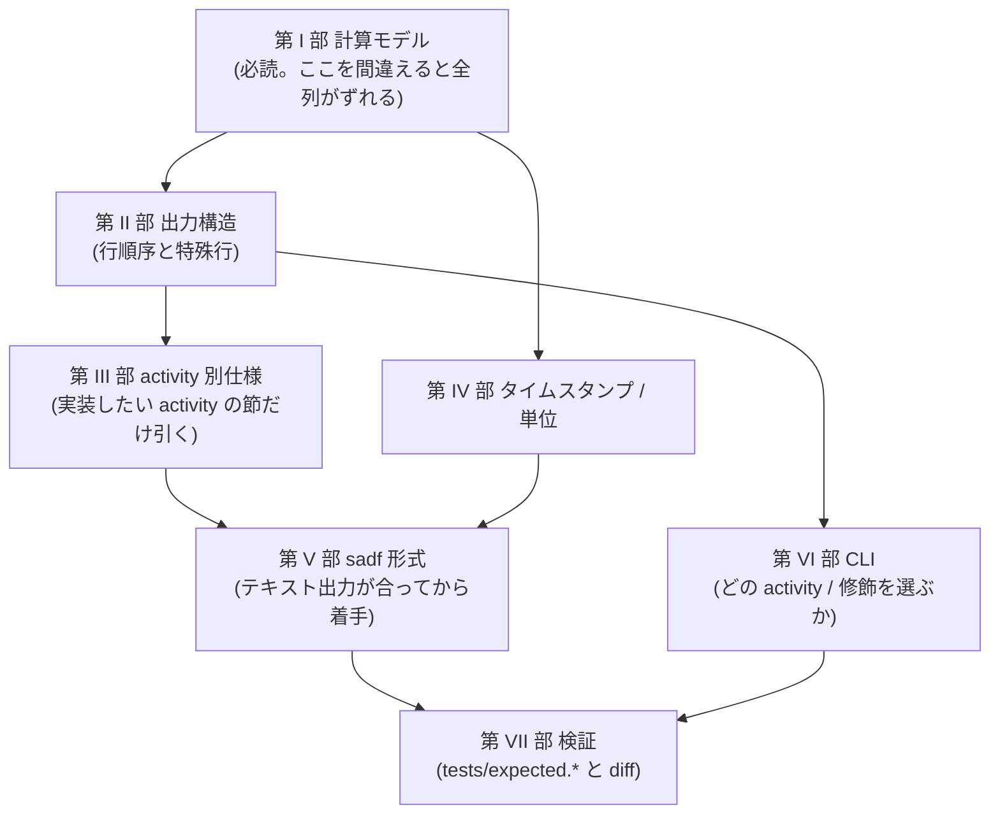

---

## 第 I 部 — 計算モデル

### 0. 全体像

#### 0.1 sa ファイルから表示までのデータフロー

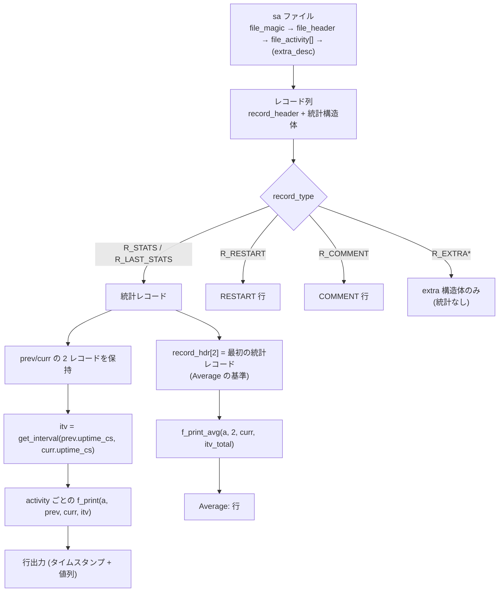

#### 0.2 レコード読み出しの三面バッファ

`sar` / `sadf` は activity ごとに統計バッファを **3 面** 持つ (`a->buf[0]`, `a->buf[1]`, `a->buf[2]`)。
`record_header` も同様に 3 要素配列 (`record_hdr[0..2]`)。

| 添字 | 用途 |
|---|---|
| `curr` (0 または 1) | 今回読んだサンプル |
| `!curr` | 直前のサンプル (差分の分母・タイムスタンプ表示の基準) |
| `2` | **その activity の最初のサンプル**。`Average:` 行の差分基準として固定保持 |

`curr` はサンプルを 1 つ表示するたびに `curr ^= 1` で反転する。**表示がスキップされた
(`-i` によるインターバル選別で落ちた) サンプルでは反転しない**ため、
「表示された直前のサンプル」が常に `!curr` になる。ここを取り違えると `-i` 併用時の値が全部ずれる。

#### 0.3 activity 一覧 (A_* の ID) — 早見表

列名・書式・計算式の詳細は**第 III 部**の該当節 (`### id=N`) を参照。
`AO_*` フラグや `nr` / `nr2` / `xnr` を含む完全な activity テーブルも第 III 部にある。

| ID | 定数 | sar オプション | ID | 定数 | sar オプション |
|---:|---|---|---:|---|---|
| 1 | `A_CPU` | `-u [ALL]`, `-P` | 23 | `A_NET_UDP` | `-n UDP` |
| 2 | `A_PCSW` | `-w` | 24 | `A_NET_SOCK6` | `-n SOCK6` |
| 3 | `A_IRQ` | `-I` | 25 | `A_NET_IP6` | `-n IP6` |
| 4 | `A_SWAP` | `-W` | 26 | `A_NET_EIP6` | `-n EIP6` |
| 5 | `A_PAGE` | `-B` | 27 | `A_NET_ICMP6` | `-n ICMP6` |
| 6 | `A_IO` | `-b` | 28 | `A_NET_EICMP6` | `-n EICMP6` |
| 7 | `A_MEMORY` | `-r [ALL]`, `-R`, `-S` | 29 | `A_NET_UDP6` | `-n UDP6` |
| 8 | `A_KTABLES` | `-v` | 30 | `A_PWR_CPU` | `-m CPU` |
| 9 | `A_QUEUE` | `-q [LOAD]` | 31 | `A_PWR_FAN` | `-m FAN` |
| 10 | `A_SERIAL` | `-y` | 32 | `A_PWR_TEMP` | `-m TEMP` |
| 11 | `A_DISK` | `-d` | 33 | `A_PWR_IN` | `-m IN` |
| 12 | `A_NET_DEV` | `-n DEV` | 34 | `A_HUGE` | `-r ALL` / `-H` 系 |
| 13 | `A_NET_EDEV` | `-n EDEV` | 35 | `A_PWR_FREQ` | `-m FREQ` |
| 14 | `A_NET_NFS` | `-n NFS` | 36 | `A_PWR_USB` | `-m USB` |
| 15 | `A_NET_NFSD` | `-n NFSD` | 37 | `A_FS` | `-F [MOUNT]` |
| 16 | `A_NET_SOCK` | `-n SOCK` | 38 | `A_NET_FC` | `-n FC` |
| 17 | `A_NET_IP` | `-n IP` | 39 | `A_NET_SOFT` | `-n SOFT` |
| 18 | `A_NET_EIP` | `-n EIP` | 40 | `A_PSI_CPU` | `-q CPU` |
| 19 | `A_NET_ICMP` | `-n ICMP` | 41 | `A_PSI_IO` | `-q IO` |
| 20 | `A_NET_EICMP` | `-n EICMP` | 42 | `A_PSI_MEM` | `-q MEM` |
| 21 | `A_NET_TCP` | `-n TCP` | 43 | `A_PWR_BAT` | `-m BAT` |
| 22 | `A_NET_ETCP` | `-n ETCP` | | | |

`NR_ACT = 43`。ID は sa ファイル中の `file_activity.id` と一致する。
実装では ID → activity 定義のテーブルを引く形にする (ID 順ではなく、ファイルに書かれた
`file_activity[]` の順序で統計構造体が並ぶ点に注意 — §1.9)。

---

### 1. 統計値の計算式 (最重要)

#### 1.1 経過時間 itv の算出

##### 1.1.1 12.x 形式では単位は「1/100 秒 (cs)」で固定

`record_header` は以下の構造を持つ (12.x 形式)。

| フィールド | 型 | 意味 |
|---|---|---|
| `uptime_cs` | `u64` | マシンの uptime。**1/100 秒単位 (centiseconds)** |
| `ust_time` | `u64` | epoch 秒 |
| `extra_next` | `u32` | `extra_desc` 構造体が続くか |
| `record_type` | `u8` | `R_STATS`=1 / `R_LAST_STATS`=3 / `R_RESTART`=2 / `R_COMMENT`=4 / `R_EXTRA_MIN..MAX`=5..15 |
| `hour` / `minute` / `second` | `u8` | 記録時の TZ における時刻 (`-t` 用) |

> **重要**: 古い sysstat (11.x 以前) の `record_header` は `uptime`(jiffies, 全 CPU 合計) と
> `uptime0`(jiffies, CPU 0 のみ) の 2 本を持っていた。12.x では **`uptime0` は廃止され、
> `uptime_cs` (cs 単位、CPU 数に依存しない) 1 本のみ**になっている。
> 旧形式の変換時には `uptime_cs = uptime0 * 100 / HZ` という換算が行われる (`sa_conv.c`)。
> つまり **12.x 形式を読む実装では HZ を一切使わない**。`sadf -O hz=N` は旧形式変換時に
> ファイル記録の HZ を上書きするためだけに存在する。

##### 1.1.2 `get_interval()` 相当

```rust
/// prev_uptime, curr_uptime はともに cs 単位。
/// prev_uptime == 0 は「システム起動時からの累計」を意味する (sar -b 等の最初の行)。
fn get_interval(prev_uptime: u64, curr_uptime: u64) -> u64 {
    let itv = curr_uptime.wrapping_sub(prev_uptime);
    if itv == 0 { 1 } else { itv }   // 0 除算回避のパラノイアチェック
}
```

ポイント:

- **減算は必ずラップアラウンドを許す**（C の `unsigned long long` 減算と同じ）。Rust では
  `wrapping_sub` を使う。`checked_sub().unwrap()` にすると逆行時にパニックする。
- 結果が 0 なら 1 に置き換える。**0 のままにしない**（`itv=0` で割ると inf/NaN になる）。
- `get_itv_value()` は単に `get_interval(prev.uptime_cs, curr.uptime_cs)` を呼ぶだけの薄いラッパ。

##### 1.1.3 3 種類の itv を使い分ける

| itv の種類 | 単位 | 算出元 | 使うのは |
|---|---|---|---|
| **グローバル itv** | cs | `get_interval(record_hdr[!curr].uptime_cs, record_hdr[curr].uptime_cs)` | `A_CPU` 以外のほぼ全 activity |
| **Average 用 itv** | cs | `get_interval(record_hdr[2].uptime_cs, record_hdr[curr].uptime_cs)` | `Average:` 行 |
| **`deltot_jiffies`** | jiffies | CPU tick 合計の差分 (§1.4) | `A_CPU` のみ |

`A_CPU` の print 関数には `itv` も渡されるが **使われない**。CPU 使用率は per-CPU の
tick 合計差分で正規化するため、グローバル itv とは独立している。

##### 1.1.4 「起動時からの統計」モード

`sar` に `-o` なしで interval/count を指定した場合や、`sadc` からの最初のサンプルでは
`S_F_SINCE_BOOT` が立ち、`record_hdr[!curr]` と全 activity の `buf[!curr]` が
**ゼロクリア**される (`write_stats_startup()` 相当)。このとき

- `itv = curr.uptime_cs - 0 = curr.uptime_cs` → 起動からの経過時間
- 全カウンタの差分 = 現在値そのもの → 「起動以来の平均レート」が表示される

`record_hdr[!curr]` はゼロクリアされるが、`hour/minute/second/ust_time` は
**`curr` の値がコピーされる** (タイムスタンプ表示が壊れないようにするため)。

#### 1.2 値マクロの定義と意味

##### 1.2.1 `S_VALUE` / `SP_VALUE`

v12.8.0 の `common.h` では両者は**同一定義**である。

```
S_VALUE(m, n, p)  = ((double)(n - m)) / p * 100
SP_VALUE(m, n, p) = ((double)(n - m)) / p * 100
```

- `m` = 前サンプルの値, `n` = 現サンプルの値, `p` = itv
- `p` が cs 単位なので `/p*100` は **「1 秒あたり」への換算**になる
  (`delta / (itv/100) = delta*100/itv`)
- 名前が 2 つある理由は歴史的なもの。`S_VALUE` は「毎秒のレート (`xxx/s`)」、
  `SP_VALUE` は「パーセント (分母が時間量のカウンタ)」という**意図の違い**を表すだけで、
  計算は完全に同じ。Rust 実装では 1 つの関数にまとめて良いが、
  **`SP_VALUE` を使っている箇所で分母が jiffies 合計になっている**ことに注意
  (その場合 `*100` がパーセント化として働く)。

```rust
#[inline]
fn s_value(prev: u64, curr: u64, itv: u64) -> f64 {
    // C の unsigned long long 減算と同じ挙動 (ラップアラウンド許容)
    (curr.wrapping_sub(prev)) as f64 / itv as f64 * 100.0
}
```

> **`(n) - (m)` は u64 の世界で行われ、そのあとに `double` へキャストされる**点が決定的に重要。
> `n < m` のとき結果は巨大な正数 (≈1.8e19) になり、そのまま表示される。
> Rust で `curr as f64 - prev as f64` と書くと負値になり、**本家と異なる出力**になる。

##### 1.2.2 `ll_sp_value()` — 逆行クランプ付き

```rust
/// dyn-tick カーネルで /proc/stat の CPU カウンタが逆行する事象への対処。
fn ll_sp_value(prev: u64, curr: u64, itv: u64) -> f64 {
    if curr < prev { 0.0 } else { s_value(prev, curr, itv) }
}
```

- CPU 系のフィールド (`%user`, `%nice`, `%sys`, `%iowait`, `%steal`, `%irq`,
  `%soft`, `%guest`, `%gnice`) はすべてこれを通す。
- **`ll_s_value()` は v12.8.0 には存在しない**（11.x までは存在した）。
  旧版の資料を参照して実装すると余計な関数を作ってしまうので注意。

##### 1.2.3 `SP_VALUE_100()` は存在しない

`SP_VALUE_100()` は sysstat 11.2.2 で `pidstat` 用に導入されたが、
v12.8.0 の `common.h` には**存在しない** (git 履歴上、`pidstat` のスレッド合計対応で削除)。
`sar` / `sadf` の出力には一切関与しないので実装不要。**要検証**が必要なのは
「100% にクランプする処理はどこにもない」という点だが、`sar` の出力例
(`tests/expected.*`) を見る限り 100 超えのクランプは行われていない。

##### 1.2.4 その他のマクロ

| マクロ | 定義 | 用途 |
|---|---|---|
| `MINIMUM(a,b)` | `a < b ? a : b` | 2 値の小さい方。主に「表示可能アイテム数の上限」計算 |
| `KB_TO_PG(k)` | `k >> kb_shift` | kB → ページ数 |
| `PG_TO_KB(k)` | `k << kb_shift` | ページ数 → kB。`kb_shift` は `log2(pagesize/1024)` |
| `BITMAP_SIZE(m)` | `(((m)+1) >> 3) + 1` | activity ビットマップのバイト数。`+1` はグローバル項目 (CPU "all" / IRQ "sum") 用 |
| `IS_CPU_SELECTED(bm,i)` | `bm[i>>3] & (1 << (i & 7))` | `-P` で選択されたか |
| `IS_CPU_OFFLINE(bm,i)` | 同上 | オフライン CPU の判定 |

`PERCENT` 系は色付け閾値のみ (出力値には影響しない):

| 定数 | 値 |
|---|---|
| `PERCENT_LIMIT_XHIGH` | 90.0 |
| `PERCENT_LIMIT_HIGH` | 75.0 |
| `PERCENT_LIMIT_LOW` | 25.0 |
| `PERCENT_LIMIT_XLOW` | 10.0 |

これらは `S_COLORS` が有効なときの SGR 切り替えにのみ使われる。
色を出さない実装 (パイプ出力相当) では無視して良い。

#### 1.3 カウンタのラップアラウンド / 逆行の扱い

sysstat は **ラップアラウンドを「積極的に補正しない」** 設計である。基本方針:

1. 差分は符号なし整数演算で取る → 32bit カウンタが 1 周した場合、
   64bit 変数に読み込まれていれば差分がそのまま正しく出る (これが本家の狙い)。
2. カーネルが値を「巻き戻した」(デバイス再登録・CPU 再オンライン化) 場合のみ、
   **アイテム単位の同一性判定**で除外する。

##### 1.3.1 ネットワークインタフェース (`A_NET_DEV` / `A_NET_EDEV`)

前サンプル中の同名インタフェースを探し、
`rx_packets` / `tx_packets` / `rx_bytes` / `tx_bytes` /
`rx_compressed` / `tx_compressed` / `multicast` の**いずれかが減っていたら**
「一度 unregister され再 register された」可能性を疑う。ただし次の条件のいずれかを満たす場合は
**単なる 64bit オーバーフローとみなして継続**する:

```
ovfw = (rx_bytes 減 && rx_packets 増 && prev.rx_bytes > u64::MAX/2)
    || (tx_bytes 減 && tx_packets 増 && prev.tx_bytes > u64::MAX/2)
    || (rx_packets 減 && rx_bytes 増 && prev.rx_packets > u64::MAX/2)
    || (tx_packets 減 && tx_bytes 増 && prev.tx_packets > u64::MAX/2)
```

`ovfw == false` なら「再登録された別物」として **参照先なし (= 前値 0 扱い)** にする
(`check_net_dev_reg()` の戻り値 `-2`)。

戻り値の意味:

| 戻り値 | 意味 | 表示 |
|---|---|---|
| `>= 0` | 前サンプルの当該インデックス | 通常の差分計算 |
| `-1` | 新規インタフェース (前サンプルに存在しない) | 前値をゼロ構造体として扱う |
| `-2` | 同名だが再登録された | 前値をゼロ構造体として扱う |

##### 1.3.2 ブロックデバイス (`A_DISK`)

`major`/`minor` が一致するエントリを探す。**すべてのカウンタが減っていたら**再登録、
**1〜2 本だけ減っていたら**単なるラップとみなす。判定式:

```
再登録 = (curr.nr_ios < prev.nr_ios)
      && (prev.rd_sect == 0 || curr.rd_sect < prev.rd_sect)
      && (prev.wr_sect == 0 || curr.wr_sect < prev.wr_sect)
      && (prev.dc_sect == 0 || curr.dc_sect < prev.dc_sect)
```

`prev.*_sect == 0` のカウンタは判定から除外する (read-only デバイスや
discard 統計未対応カーネルを誤判定しないため)。

##### 1.3.3 CPU カウンタ (`A_CPU`)

`get_per_cpu_interval()` 内で以下の補正を行う (§1.4.2)。ここだけは
**`prev` 構造体を書き換える破壊的補正**が入るので、Rust 実装でも
「補正済み prev」を返す設計にする必要がある。

- `curr.cpu_iowait < prev.cpu_iowait` かつ `prev.cpu_iowait < u64::MAX - 0x7ffff` のとき:
  - `curr.cpu_idle > prev.cpu_idle` または `prev.cpu_idle >= u64::MAX - 0x7ffff`
    → iowait のトラッキング誤差とみなし `prev.cpu_iowait = curr.cpu_iowait` (= 差分 0)
  - そうでなければ CPU がオンラインに戻ったとみなし `prev.cpu_iowait = 0`
- `curr.cpu_idle < prev.cpu_idle` かつ `prev.cpu_idle < u64::MAX - 0x7ffff` のとき
  → `prev.cpu_idle = 0`

`u64::MAX - 0x7ffff` という閾値は「前値がほぼ u64 上限ならオーバーフロー由来の逆行であり、
CPU 復帰ではない」という判別のためのヒューリスティックである。

##### 1.3.4 `next_slice()` は 32bit でマスクする

`-i <interval>` によるサンプル選別では、uptime 差分を **`& 0xffffffff`** でマスクしてから
秒に直す。

```rust
fn next_slice(uptime_ref: u64, uptime: u64, reset: bool, interval: i64,
              last_uptime: &mut u64) -> bool {
    if *last_uptime == 0 || reset { *last_uptime = uptime_ref; }

    // 「ファイル中の実インターバル」を秒で四捨五入
    let f = ((uptime.wrapping_sub(*last_uptime)) & 0xffff_ffff) as f64 / 100.0;
    let mut file_interval = f as u64;
    if (f * 10.0) - (file_interval as f64 * 10.0) >= 5.0 { file_interval += 1; }
    *last_uptime = uptime;

    if interval == 1 { return true; }   // 最小インターバルなら常に採用

    // 基準点からの経過秒 (四捨五入)
    let f = ((uptime.wrapping_sub(uptime_ref)) & 0xffff_ffff) as f64 / 100.0;
    let mut entry = f as i64;
    if (f * 10.0) - (entry as f64 * 10.0) >= 5.0 { entry += 1; }

    let min = entry - (file_interval as i64 / 2);
    let max = entry + (file_interval as i64 / 2) + (file_interval as i64 & 1);
    let pt1 = (entry / interval) * interval;
    let pt2 = ((entry / interval) + 1) * interval;
    (pt1 >= min && pt1 < max) || (pt2 >= min && pt2 < max)
}
```

判定の意味: 「ユーザ指定インターバル `Iu` の整数倍 `p*Iu` が
`[En - In/2, En + In/2)` に入るなら、そのサンプル `En` を表示する」
(`In` = ファイル中の実インターバル)。

四捨五入が `(f*10) - (int*10) >= 5` という独特の書き方であること、
`min`/`max` が `int` (32bit) であることをそのまま再現する必要がある。

#### 1.4 CPU 使用率の計算

##### 1.4.1 全体構造

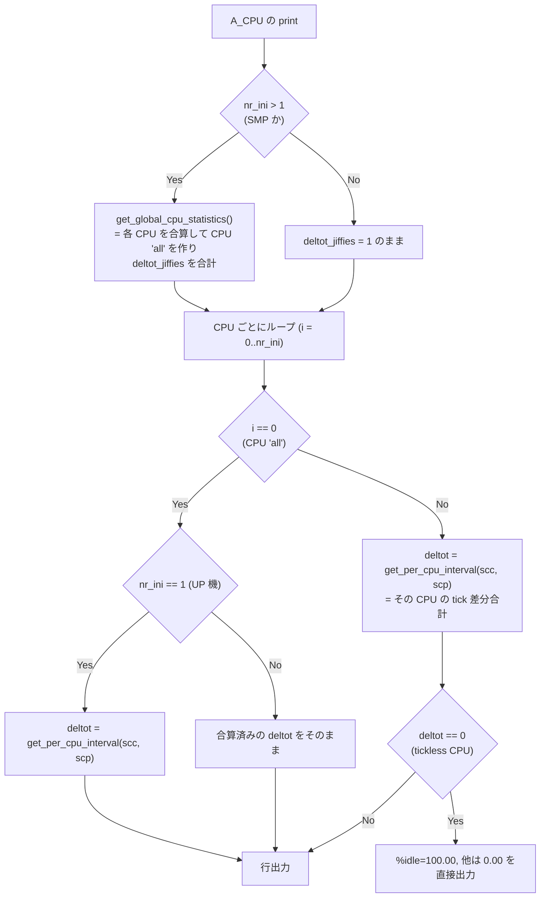

##### 1.4.2 `get_per_cpu_interval()` — tick 合計の求め方

CPU ごとに tick の総量を求めて、それをパーセントの分母にする。
「CPU 線 (`cpu` 行) の値ではなく当該 CPU 自身の tick で正規化する」ことで、
短いインターバルでの歪みを避ける設計である。

```rust
fn cpu_delta(prev: u64, curr: u64) -> u64 {
    if curr > prev { curr - prev } else { 0 }   // アンダーフロー防止
}

/// scp は破壊的に補正される (§1.3.3)。戻り値は jiffies 単位。
fn get_per_cpu_interval(scc: &StatsCpu, scp: &mut StatsCpu) -> u64 {
    let mut ishift: u64 = 0;

    // guest が user に含まれる分の補正
    if scc.cpu_user >= scp.cpu_user
        && (scc.cpu_user - scc.cpu_guest) < (scp.cpu_user - scp.cpu_guest) {
        ishift += (scp.cpu_user - scp.cpu_guest) - (scc.cpu_user - scc.cpu_guest);
    }
    if scc.cpu_nice >= scp.cpu_nice
        && (scc.cpu_nice - scc.cpu_guest_nice) < (scp.cpu_nice - scp.cpu_guest_nice) {
        ishift += (scp.cpu_nice - scp.cpu_guest_nice) - (scc.cpu_nice - scc.cpu_guest_nice);
    }

    // CPU 復帰 / iowait 誤差の補正 (§1.3.3)
    const T: u64 = u64::MAX - 0x7ffff;
    if scc.cpu_iowait < scp.cpu_iowait && scp.cpu_iowait < T {
        scp.cpu_iowait = if scc.cpu_idle > scp.cpu_idle || scp.cpu_idle >= T {
            scc.cpu_iowait
        } else { 0 };
    }
    if scc.cpu_idle < scp.cpu_idle && scp.cpu_idle < T { scp.cpu_idle = 0; }

    // guest / guest_nice は user / nice に含まれるので足さない
    let mut interval = 0u64;
    interval += cpu_delta(scp.cpu_user,    scc.cpu_user);
    interval += cpu_delta(scp.cpu_nice,    scc.cpu_nice);
    interval += cpu_delta(scp.cpu_sys,     scc.cpu_sys);
    interval += cpu_delta(scp.cpu_iowait,  scc.cpu_iowait);
    interval += cpu_delta(scp.cpu_idle,    scc.cpu_idle);
    interval += cpu_delta(scp.cpu_steal,   scc.cpu_steal);
    interval += cpu_delta(scp.cpu_hardirq, scc.cpu_hardirq);
    interval += cpu_delta(scp.cpu_softirq, scc.cpu_softirq);

    interval + ishift
}
```

**tick 合計に含める 8 フィールド**: `user, nice, sys, iowait, idle, steal, hardirq, softirq`。
`guest` / `guest_nice` は `user` / `nice` に内包されているので**加算しない**。

`cpu_delta()` による 0 クランプは 12.8.0 で追加された修正である。これがないと、
1 フィールドだけ逆行したときに巨大な interval になり、**全パーセントが 0.00 に丸められる**。

##### 1.4.3 `get_global_cpu_statistics()` — CPU "all" とオフライン検出

SMP (`nr_ini > 1`) のとき、CPU "all" (添字 0) の統計は
**`/proc/stat` の `cpu` 行ではなく、個別 CPU の合算**で作り直す。

```
擬似コード:
  if nr_ini > 1:
      buf[curr][0] = 0 でクリア   # CPU "all"
      buf[prev][0] = 0 でクリア
  deltot_jiffies = 0
  for i in 1 .. min(nr_ini, bitmap.b_size + 1):
      scc = buf[curr][i]; scp = buf[prev][i]
      tot_c = scc.(user+nice+sys+idle+iowait+hardirq+steal+softirq)
      tot_p = scp.(user+nice+sys+idle+iowait+hardirq+steal+softirq)

      if tot_c == 0:
          # /proc/stat から当該 CPU 行が消えている = 現在オフライン
          *scc = *scp                  # 現在値を前回値で埋める (復帰時の 0 からのジャンプ防止)
          MARK_CPU_OFFLINE(offline_bitmap, i)

      if tot_p == 0 and not WANT_SINCE_BOOT:
          # 直前サンプル時点でもオフライン = 基準値がない
          MARK_CPU_OFFLINE(offline_bitmap, i)
          continue                     # CPU "all" にも加算しない

      deltot_jiffies += get_per_cpu_interval(scc, scp)   # scp が補正されることに注意
      buf[curr][0] += scc の各フィールド
      buf[prev][0] += scp の各フィールド
  return deltot_jiffies
```

重要な帰結:

- **オフライン CPU は行そのものが出力されない**（tickless CPU との区別のため
  専用ビットマップでマークする）。
- CPU "all" の分母は「オンラインだった CPU の tick 合計」なので、
  `%user + ... + %idle` は常に 100% になる。オフライン時間はそもそも分母に入らない。
- `get_per_cpu_interval()` が `scp` を書き換えるため、**CPU "all" の合算値は
  補正後の prev を足し込んだもの**になる。合算を補正前に行うと値がずれる。

##### 1.4.4 表示される各列の式

`sar -u` (既定, `DISPLAY_CPU_DEF`) — 6 列:

| 列 | 式 |
|---|---|
| `%user` | `ll_sp_value(p.user, c.user, deltot)` |
| `%nice` | `ll_sp_value(p.nice, c.nice, deltot)` |
| `%system` | `ll_sp_value(p.sys + p.hardirq + p.softirq, c.sys + c.hardirq + c.softirq, deltot)` |
| `%iowait` | `ll_sp_value(p.iowait, c.iowait, deltot)` |
| `%steal` | `ll_sp_value(p.steal, c.steal, deltot)` |
| `%idle` | `if c.idle < p.idle { 0.0 } else { ll_sp_value(p.idle, c.idle, deltot) }` |

`sar -u ALL` (`DISPLAY_CPU_ALL`) — 10 列:

| 列 | 式 |
|---|---|
| `%usr` | `if (c.user - c.guest) < (p.user - p.guest) { 0.0 } else { ll_sp_value(p.user - p.guest, c.user - c.guest, deltot) }` |
| `%nice` | `if (c.nice - c.guest_nice) < (p.nice - p.guest_nice) { 0.0 } else { ll_sp_value(p.nice - p.guest_nice, c.nice - c.guest_nice, deltot) }` |
| `%sys` | `ll_sp_value(p.sys, c.sys, deltot)` (hardirq/softirq を含めない) |
| `%iowait` | `ll_sp_value(p.iowait, c.iowait, deltot)` |
| `%steal` | `ll_sp_value(p.steal, c.steal, deltot)` |
| `%irq` | `ll_sp_value(p.hardirq, c.hardirq, deltot)` |
| `%soft` | `ll_sp_value(p.softirq, c.softirq, deltot)` |
| `%guest` | `ll_sp_value(p.guest, c.guest, deltot)` |
| `%gnice` | `ll_sp_value(p.guest_nice, c.guest_nice, deltot)` |
| `%idle` | `if c.idle < p.idle { 0.0 } else { ll_sp_value(p.idle, c.idle, deltot) }` |

クランプの所在をまとめると:

- `%idle` は **常に** `curr < prev` で 0.0 にクランプ (`ll_sp_value` の内側判定とは別に、
  外側で明示的にもう一度判定している)
- `%usr` / `%nice` (`-u ALL` 時) は `user - guest` の引き算結果で比較してクランプ
- `%steal` は `ll_sp_value` の一般クランプのみ (専用の追加処理はない)
- それ以外の列も `ll_sp_value` の `curr < prev → 0.0` が効く

##### 1.4.5 tickless CPU

`deltot_jiffies == 0` かつ CPU "all" でない場合、その CPU は完全にアイドルで
tick が発生していない (`CONFIG_NO_HZ_FULL`)。この場合、計算せずに固定値を出す:

- `-u`: `%user..%steal` = `0.00` (5 列), `%idle` = `100.00`
- `-u ALL`: `%usr..%steal` = `0.00` (5 列), `%irq %soft %guest %gnice` = `0.00`, `%idle` = `100.00`
  (実装上は 5 個ずつ 2 回に分けて出力しており、2 回目の最後が `100.00`)

CPU "all" では `deltot_jiffies == 0` になったら **1 に差し替える**
(「CPU all が tickless になることはない」という前提)。

#### 1.5 その他の特殊な計算式

##### 1.5.1 ディスク拡張統計 (`compute_ext_disk_stats()`)

```
util  = if c.tot_ticks < p.tot_ticks { 0.0 }
        else { S_VALUE(p.tot_ticks, c.tot_ticks, itv) }
        # tot_ticks はカーネルがミリ秒で提供。
        # S_VALUE の結果は「1 秒あたりのミリ秒数」であって % ではない。
        # 表示側で /10 してパーセントにする (1000 ms/s = 100%)。

await = if c.nr_ios > p.nr_ios {
            ((c.rd_ticks - p.rd_ticks) + (c.wr_ticks - p.wr_ticks) + (c.dc_ticks - p.dc_ticks))
            / (c.nr_ios - p.nr_ios) as f64
        } else { 0.0 }

areq-sz = if c.nr_ios > p.nr_ios {
            ((c.rd_sect - p.rd_sect) + (c.wr_sect - p.wr_sect) + (c.dc_sect - p.dc_sect))
            / (c.nr_ios - p.nr_ios) as f64
          } else { 0.0 }
```

`nr_ios` は read + write + discard の完了 I/O 数。flush は write に計上される。

`sar -d` の表示列で使う際の追加スケーリング:

| 表示列 | 式 |
|---|---|
| `tps` | `S_VALUE(p.nr_ios, c.nr_ios, itv)` |
| `rkB/s` | `S_VALUE(p.rd_sect, c.rd_sect, itv) / 2` |
| `wkB/s` | `S_VALUE(p.wr_sect, c.wr_sect, itv) / 2` |
| `dkB/s` | `S_VALUE(p.dc_sect, c.dc_sect, itv) / 2` |
| `areq-sz` | `xds.arqsz / 2` (セクタ → kB) |
| `aqu-sz` | `S_VALUE(p.rq_ticks, c.rq_ticks, itv) / 1000.0` |
| `await` | `xds.await` (ミリ秒、追加スケーリングなし) |
| `%util` | `xds.util / 10.0` |

##### 1.5.2 セクタ → kB 換算

1 セクタ = 512 B = 0.5 kB なので **S_VALUE の結果を 2 で割る**。
この `/2` は `--human` の有無に関わらず**常に**行われ (§1.8.1 参照)、
`cprintf_unit()` 側の `unit == 0` 分岐は sar では使われない。

##### 1.5.3 PSI (Pressure Stall Information)

PSI の `total` フィールドはマイクロ秒の累計。itv は cs。

```
%scpu (瞬時値) = (c.some_cpu_total - p.some_cpu_total) as f64 / (100 * itv) as f64
```

導出: `Δµs / (itv/100 秒 × 1e6 µs/秒) × 100 [%] = Δµs / (itv × 100)`。
`S_VALUE` は使わない点に注意。`%sio` / `%fio` / `%smem` / `%fmem` も同形。

`some_acpu_10/60/300` などの移動平均フィールドは **値を 100 で割るだけ**
(カーネルが 100 倍した固定小数で提供している)。差分もインターバル除算も行わない。

##### 1.5.4 ロードアベレージ (`A_QUEUE`)

`load_avg_1/5/15` は 100 倍固定小数。表示は `value / 100.0`。
`runq-sz` / `plist-sz` / `blocked` は瞬時値そのまま。

#### 1.6 `Average:` / `Minimum:` / `Maximum:` 行

##### 1.6.1 2 つの平均方式

sysstat の `Average:` 行には**性質の異なる 2 方式**がある。どちらになるかは activity ごとに固定。

| 方式 | 対象 | 計算 |
|---|---|---|
| **A: 差分方式** | カウンタ型 (CPU, PCSW, PAGE, IO, DISK, NET_*, IRQ, SWAP, SERIAL, SOFT ...) | `f_print_avg(a, prev=2, curr, itv_total)` を呼び、**最初のサンプル (`buf[2]`) と最後のサンプルの差分**を全期間 itv で割る。中間サンプルは一切使わない |
| **B: 累積平均方式** | ゲージ型 (MEMORY, KTABLES, QUEUE, NET_SOCK, NET_SOCK6, PWR_*, HUGE, FS, PSI の移動平均部) | 各サンプル表示時に静的変数へ値を加算し、`Average:` 行で **`合計 / avg_count`** を出力。出力後に累積変数を 0 にリセット |

`itv_total = get_interval(record_hdr[2].uptime_cs, record_hdr[curr].uptime_cs)`

`avg_count` は「実際に表示されたサンプル数」。`write_stats()` が 1 サンプル表示するたびに
+1 され、ファイル読み込み時は `write_stats_avg()` の最後に 0 にリセットされる。
**`-i` でスキップされたサンプルはカウントされない**。

方式 B の実装上の落とし穴:

- 累積変数は **activity ごと・フィールドごとのグローバル状態**。Rust では
  activity の状態構造体に持たせる。
- `A_PSI_*` はハイブリッド: 移動平均 3 列は方式 B、`%scpu` 等の合計由来の 1 列は方式 A
  (`Average:` 行では全期間 itv で計算した値が入る)。
- 整数系フィールドの平均は `cprintf_f(..., wd=0)` で出力される。
  つまり **瞬時値は整数書式・平均値は小数 0 桁の浮動小数書式**になり、
  `--dec=1` / `--dec=2` を付けると**平均行だけ小数が付く**。

##### 1.6.2 ラベルの書式

| 行 | ラベル文字列 | 書式 |
|---|---|---|
| 通常サンプル | タイムスタンプ | `%-11s` |
| 平均 | `Average:` | `%-11s` |
| `-x` 併用時の平均 | `Summary:` | `%-11s` |
| `-x` の最小値 | `Minimum:` | `%-11s` |
| `-x` の最大値 | `Maximum:` | `%-11s` |

すべて **11 桁左詰め**。`Average:` は 8 文字なので右に空白 3 個が付く。
これらは gettext (`_()`) 経由なのでロケール依存だが、
`LC_ALL=C` では上記の英語文字列になる (本家テストも `LC_ALL=C` 前提)。

##### 1.6.3 `-x` (min/max) の値収集

`sar -x` で `S_F_MINMAX` が立つと、各サンプル表示時に min/max を更新し、
`Average:` (= `Summary:`) 行の直前にヘッダ行 + `Minimum:` 行 + `Maximum:` 行を出力する。

- 初期値: min = `f64::MAX`, max = `f64::MIN` (`-DBL_MAX`)
- `LINUX RESTART` レコードで初期化される (= RESTART 区間ごとの min/max)
- `save_extrema()` は構造体を「`u64` × `types_nr[0]` 本 → `u64`(long) × `types_nr[1]` 本 →
  `u32` × `types_nr[2]` 本」というレイアウトとして走査し、
  `g_fields[]` で指定された位置へ書き込む
  (**`g_fields` の順序は表示列順であり構造体フィールド順とは異なる**)
- `ps == NULL` (前サンプル不要 = ゲージ型) のときは値そのまま、
  そうでなければ `if curr < prev { 0.0 } else { S_VALUE(prev, curr, itv) }`
- `g_fields[m] < 0` のフィールドは min/max 収集対象外 (スキップ)
- CPU の min/max は専用関数で、列ごとに固定インデックス
  (`0:%usr 1:%nice 2:%sys 3:%iowait 4:%steal 5:%irq 6:%soft 7:%guest 8:%gnice 9:%idle`)
  に保存する。tickless CPU の場合は `-u` なら先頭 5 個、`-u ALL` なら先頭 9 個を 0.0、
  インデックス 9 (`%idle`) を 100.0 として記録する

#### 1.7 数値の printf 書式 — `cprintf_*` の正確な仕様

`sar` のテキスト出力はすべて `cprintf_*` 系を通る。色制御シーケンスを除けば、
以下の printf 相当に還元できる。**すべて先頭に半角空白 1 個を出力する**点が共通。

##### 1.7.0 色は既定で無効 (バイト一致の前提)

`init_colors()` の判定:

```
if (S_COLORS 未設定 && stdout が TTY でない)
   || S_COLORS == "never"
   || (S_COLORS != "always" && stdout が TTY でない)
{
    すべての色文字列 (sc_*) を "" にして return;   // = 色なし
}
```

したがって **パイプ・リダイレクト出力では ANSI シーケンスは一切出ない**。
本家テストもこの条件下で `expected.*` と比較している。
Rust 実装は「色なし」を既定にすれば十分で、`S_COLORS=always` 対応は任意。

参考: 既定の SGR 文字列 (`S_COLORS_SGR` で上書き可能)

| 変数 | 用途 | 既定 |
|---|---|---|
| `sc_int_stat` | 非ゼロの統計値 | 太字青 `ESC[34;1m` |
| `sc_zero_int_stat` | ゼロ相当の統計値 | 明るい青 `ESC[34;22m` |
| `sc_item_name` | アイテム名 (CPU 番号・デバイス名等) | 明るい緑 `ESC[32;22m` |
| `sc_percent_warn` | 警告域のパーセント | 太字マゼンタ `ESC[35;1m` |
| `sc_percent_xtreme` | 極端域のパーセント | 太字赤 `ESC[31;1m` |
| `sc_sa_restart` | `LINUX RESTART` 行 | 明るい赤 `ESC[31;22m` |
| `sc_sa_comment` | `COM` 行 | 明るい黄 `ESC[33;22m` |
| `sc_trend_pos` / `sc_trend_neg` | 電池の充放電矢印 | 太字緑 / 太字赤 |
| `sc_normal` | リセット | `ESC[0m` |

`S_COLORS_SGR` の書式は `<キー>=<数字と ';' の列>` を `:` 区切りで並べたもの
(キー: `M`/`W` = warn, `X`/`H` = xtreme, `Z` = zero, `N` = int, `I` = item,
`C` = comment, `R` = restart, `+` = trend positive, `-` = trend negative)。
長さが `MIN_SGR_SEQ_LEN(3)` 未満 / `MAX_SGR_SEQ_LEN(18)` 超、2 文字目が `=` でない、
3 文字目以降に数字・`;` 以外が混じる、のいずれかなら**その項目を無視**する。

##### 1.7.1 `cprintf_f(unit, sign, num, wi, wd, ...)` — 浮動小数

```
1. wd > 0 かつ dplaces_nr >= 0 (= --dec 指定あり) なら wd = dplaces_nr
2. unit < 0 (NO_UNIT):
     sign なら  printf(" %+*.*f", wi, wd, val)
     sign なし  printf(" %*.*f",  wi, wd, val)
3. unit >= 0 (--human 用): cprintf_unit(unit, wi, val) (§1.8)
```

- **`wd == 0` のフィールドは `--dec` の影響を受けない** (条件が `wd > 0`)。
  つまり「元から整数表示の列」は `--dec=2` でも整数のまま。
- 幅 `wi` は変わらない → `--dec=0` にすると小数点と小数部が消えた分、
  **左側の空白が増える** (列位置は保たれる)。
- `sign = TRUE` のときは `%+` が付くため、幅 `wi` の中に符号 1 文字が入る。

##### 1.7.2 `cprintf_xpc(human, xtrem, num, wi, wd, ...)` — パーセント

```
1. wd > 0 かつ dplaces_nr >= 0 なら wd = dplaces_nr
2. human > 0 (= DISPLAY_UNIT, --human 指定) なら:
     if wi < 4 { wi = 4 }      // "100%" が入る最小幅
     wi -= 1                   // '%' の 1 桁分を確保
     if wd > 1 { wd -= 1 }     // 小数を 1 桁削る
3. printf(" %*.*f", wi, wd, val)
4. human > 0 なら printf("%%")
```

`--human` とパーセント列の組み合わせで **幅は同じまま小数桁が 1 減り、末尾に `%` が付く**。
既定の `wi=9, wd=2` なら `--human` 時は `wi=8, wd=1` + `%` → 総幅は 9 のまま。

##### 1.7.3 `cprintf_u64(unit, num, wi, ...)` — 符号なし整数

```
unit < 0:  printf(" %*"PRIu64, wi, val)          // %*lu 相当
unit >= 0: cprintf_unit(unit, wi, val as f64)
```

`--dec` の影響を**受けない**。

##### 1.7.4 `cprintf_x(num, wi, ...)` — 16 進

```
printf(" %*x", wi, val)
```

##### 1.7.5 `cprintf_in(type, format, item_string, item_int)` — アイテム名

`type == IS_STR(1)` なら `printf(format, item_string)`、
`type == IS_INT(0)` なら `printf(format, item_int)`。
書式は呼び出し側が与える (例: CPU 番号は `" %7d"`, CPU "all" は `" %s"` + 文字列 `"    all"`)。

##### 1.7.6 `cprintf_s(type, format, string)` / `cprintf_tr(trend, format, tstring)`

色だけが違い、出力は `printf(format, string)`。`type` は
`IS_INT`=0 / `IS_STR`=1 / `IS_RESTART`=2 / `IS_COMMENT`=3 / `IS_ZERO`=4。

##### 1.7.7 文字列列のパディングは「バイト数」で行う (Rust 固有の罠)

C の `printf("%11s", s)` は **バイト数**でパディングする。Rust の
`format!("{:>11}", s)` は **文字数 (char 数)** でパディングするため、
マルチバイト文字を含む列で出力がずれる。

実害が出るのは `A_PWR_BAT` の充放電状態列で、Unicode の矢印 (UTF-8 3 バイト) を
`" %11s"` で出している:

| `status` 値 | 定数 | 表示文字 | 書式 |
|---:|---|---|---|
| 1 | `BAT_STS_CHARGING` | `↗` (U+2197) | `" %11s"` |
| 2 | `BAT_STS_DISCHARGING` | `↘` (U+2198) | `" %11s"` |
| 3 | `BAT_STS_NOTCHARGING` | `→` (U+2192) | `" %11s"` |
| 4 | `BAT_STS_FULL` | `↑` (U+2191) | `" %11s"` |
| 0 / その他 | `BAT_STS_UNKNOWN` | `?` | **`" %9s"`** (幅が違う) |

矢印は 3 バイトなので `%11s` は「空白 8 個 + 矢印」= 11 バイト = 見た目 9 桁。
`?` の `%9s` は「空白 8 個 + `?`」= 見た目 9 桁。**バイト幅で揃えると見た目が一致する**設計。

Rust では次のように「バイト長基準」で自前パディングする必要がある。

```rust
fn pad_left_bytes(s: &str, width: usize) -> String {
    let n = s.len();                       // バイト長
    if n >= width { s.to_string() }
    else { format!("{}{}", " ".repeat(width - n), s) }
}
```

同じ注意は `A_FS` のマウントポイント、`A_PWR_USB` の manufacturer/product、
`A_IRQ` の割り込み名など**すべての `%-*s` / `%*s` 列**に当てはまる
(通常は ASCII なので差は出ないが、非 ASCII が入ると崩れる)。
なお `A_PWR_USB` の manufacturer 列は `snprintf` で
`" %-<MAX_MANUF_LEN-1>s"` という書式を実行時に組み立てている。

##### 1.7.8 ゼロ判定 (色分け用、値には影響しない)

`cprintf_f` / `cprintf_xpc` は「ゼロとみなす閾値」を持つ:

| `wd` | 閾値 `lim` | ゼロ扱いの条件 |
|---:|---|---|
| 0 | — | `-0.5 <= val <= 0.5` |
| 1 | 0.05 | `|val| < 0.05` |
| 2 (既定) | 0.005 | `|val| < 0.005` |

これは色 (`sc_zero_int_stat`) の切り替えだけに使われる。
**丸め自体は printf の `%.*f` に任され、"round half to even" (IEEE754 の最近接偶数) になる**。
Rust の `format!("{:.2}", x)` も同じ丸めなので互換。

#### 1.8 `--human` の単位変換 (`cprintf_unit()`)

```rust
const UNITS: [char; 8] = ['s', 'B', 'k', 'M', 'G', 'T', 'P', '?'];  // NR_UNITS = 8

fn cprintf_unit(mut unit: i32, mut wi: i32, mut dval: f64, dplaces_nr: i32) -> String {
    if wi < 4 { wi = 4; }              // 例: "1.3M" が入る最小幅
    if unit == 0 {                     // UNIT_SECTOR: セクタ数 → kB
        dval /= 2.0;
        unit = 2;                      // UNIT_KILOBYTE
    }
    while dval >= 1024.0 {             // 分母は 1024 (1000 ではない)
        dval /= 1024.0;
        unit += 1;
    }
    // 幅は wi-1 (単位 1 文字分を確保)、小数桁は --dec 指定時 1 桁、無指定なら 0 桁
    let s = format!(" {:>w$.p$}", dval, w = (wi - 1) as usize,
                    p = if dplaces_nr != 0 { 1 } else { 0 });
    let u = UNITS[min(unit, 7) as usize];
    format!("{}{}", s, u)
}
```

要点:

- **分母は 1024**。kB/MB/GB は 2 進接頭辞 (KiB/MiB/GiB) の意味だが表示文字は `k`/`M`/`G`。
- 単位インデックス: `0='s'`(セクタ) / `1='B'` / `2='k'` / `3='M'` / `4='G'` / `5='T'` / `6='P'` / `7='?'`
- `unit == 0` (セクタ) は**必ず kB に読み替えられる** (`/2`, `unit=2`)。
  そのため `units[0] = 's'` が実際に出力されることはない。
- ステップアップ閾値は `>= 1024`。`1023.9` は `k` のまま、`1024.0` で `M` になる。
- 小数桁は `dplaces_nr ? 1 : 0` という判定。つまり
  - `--dec` 未指定 (`dplaces_nr == -1`) → **1 桁** (`-1` は真)
  - `--dec=0` (`dplaces_nr == 0`) → **0 桁**
  - `--dec=1` / `--dec=2` → **1 桁**
  `--dec=2` を指定しても human 表示では 1 桁止まりになる。
- 値の後ろに**単位 1 文字が空白なしで連結**される。数値部の幅は `wi - 1` なので、
  単位を含めた総幅は `wi` (先頭空白を除く)。
- 単位インデックスが `NR_UNITS` 以上になったら `'?'` に丸める。

##### 1.8.1 「非 human 時に自前で割る / human 時は生値を渡す」二重経路

単位付きフィールドは、**`--human` の有無で渡す値そのものが変わる**。
この分岐を再現しないと片方の経路だけ 1024 倍ずれる。

**sar のテキスト出力で単位を持つ activity は次の 5 つだけ** (`unit` 変数を持つのはこの 5 関数のみ)。

| activity | 内部で計算される値 | 非 human (`unit = NO_UNIT = -1`) | `--human` (`unit`) |
|---|---|---|---|
| `A_MEMORY` | kB 単位のフィールドそのまま | `cprintf_u64(-1, …)` = `%9llu` | `unit = UNIT_KILOBYTE(2)` |
| `A_DISK` | `rkB`/`wkB`/`dkB` は **常に `S_VALUE(rd_sect,…) / 2`** で kB/s に換算済み | `%9.2f` (kB/s) | `unit = UNIT_KILOBYTE(2)` |
| `A_NET_DEV` | `rxkb`/`txkb` は **実際にはバイト/秒** (`S_VALUE(rx_bytes,…)`) | `rxkb / 1024` を `%9.2f` で出す (= kB/s) | 生のバイト/秒を `unit = UNIT_BYTE(1)` で渡す |
| `A_HUGE` | kB 単位のフィールドそのまま | `%9llu` | `unit = UNIT_KILOBYTE(2)` |
| `A_FS` | `f_bfree` / `f_blocks` 等はバイト数 | `/1024/1024` して MB | 生のバイト数を `unit = UNIT_BYTE(1)` で渡す |

> **落とし穴 1**: `A_NET_DEV` のローカル変数名は `rxkb` / `txkb` だが中身はバイト/秒である。
> `compute_ifutil()` にもバイト/秒を渡す。名前に釣られて先に 1024 で割ると `%ifutil` が 1024 倍ずれる。
>
> **落とし穴 2**: `UNIT_SECTOR`(0) は **`iostat` 専用**で、`sar` からは一度も渡されない。
> したがって `cprintf_unit()` の `unit == 0` 分岐 (`/2` してから `unit = 2`) は sar 経路では発生しない。
> `A_DISK` はセクタ→kB の `/2` を**表示前に自分で済ませてから** `UNIT_KILOBYTE` を渡す。

##### 1.8.2 `%ifutil` の計算 (`compute_ifutil()`)

`rx`, `tx` はバイト/秒、`speed` は Mbps (`stats_net_dev.speed`)。

```
if speed == 0 { return 0.0 }
bps = speed * 1_000_000
if duplex == C_DUPLEX_FULL {
    max(rx, tx) * 800 / bps
} else {
    (rx + tx) * 800 / bps
}
```

`800` = 8 (バイト→ビット) × 100 (パーセント化)。

#### 1.9 ファイル読み出しに関する計算前提

Rust 実装が計算を正しく行うために必須の前提を列挙する。

1. **アーキテクチャ非依存の型幅**
   `file_header` / `record_header` / 各統計構造体は
   「`unsigned long long` の本数 / `unsigned long` の本数 / `unsigned int` の本数」
   (`hdr_types_nr[3]`, `rec_types_nr[3]`, 各 activity の `types_nr[3]`) を
   ファイル中に持つ。読み出し側は自分の期待する本数と比較し、
   **ファイル側が少なければ足りない分を 0 埋め、多ければ読み飛ばす**。
   `unsigned long` のサイズは `file_header.sa_sizeof_long` で判る (32bit/64bit 判定)。
2. **エンディアン不一致**
   `file_magic.sysstat_magic` の照合でエンディアン不一致を検出したら、
   全整数フィールドをバイトスワップする。
3. **`file_activity[]` の順序**
   統計構造体はファイル先頭の `file_activity[]` に書かれた順で各レコードに並ぶ。
   ID 昇順とは限らない。読み飛ばしには各 activity の `size` (= 1 アイテムのバイト数)
   と `nr` / `nr2` が必要。
4. **`has_nr`**
   `AO_COUNTED` フラグを持つ activity は、統計構造体群の前に
   アイテム数 (`__nr_t`) が書かれている。`AO_DETECTED` の activity には付かない。
5. **`msize` と `size`**
   ファイル中の 1 アイテムサイズ (`size`) と、メモリ上の構造体サイズ (`msize`) は
   一致しない場合がある。差分計算のときは**必ず `msize` 刻みでポインタを進める**
   (本家も `(char*)buf + i * msize` と書いている)。
6. **`nr[curr] > nr_ini` の救済**
   CPU 数が増えて `LINUX RESTART` が挿入されていないファイルでは
   `nr[curr] > nr_ini` になり得る。この場合 `nr_ini = nr[curr]` に更新する。
7. **`sa_cpu_nr`**
   `file_header.sa_cpu_nr` は「オンライン/オフライン込みの CPU 数 + 1」。
   `LINUX RESTART` レコードを読むと**メモリ上の値だけが更新される**。
   表示時は `sa_cpu_nr > 1 ? sa_cpu_nr - 1 : 1` が実 CPU 数。

#### 1.10 計算まわりの落とし穴チェックリスト

| # | 落とし穴 | 正しい扱い |
|---:|---|---|
| 1 | `curr - prev` を f64 で引く | u64 で `wrapping_sub` してから f64 化 |
| 2 | `itv == 0` をそのまま割る | 1 に置換 |
| 3 | CPU に グローバル itv を使う | `deltot_jiffies` (per-CPU tick 合計) を使う |
| 4 | tick 合計に guest を足す | `user`/`nice` に内包済みなので足さない |
| 5 | `%idle` のクランプ忘れ | `curr < prev` で 0.0 |
| 6 | `get_per_cpu_interval` が prev を書き換える点を無視 | 補正後の prev を CPU "all" 合算に使う |
| 7 | オフライン CPU を表示 | 専用ビットマップで除外 (tickless とは別扱い) |
| 8 | `Average:` を全サンプルの算術平均で出す | カウンタ型は「最初と最後の差分 / 全期間」 |
| 9 | `--dec` を整数列にも適用 | `wd > 0` の列のみ |
| 10 | `--human` の分母を 1000 にする | 1024 |
| 11 | `compute_ext_disk_stats().util` をそのまま `%util` として出す | `/10` する (単位は ms/s) |
| 12 | `next_slice` の 32bit マスクを省略 | `& 0xffffffff` を再現 |
| 13 | `-i` でスキップしたサンプルを `avg_count` に数える | 表示されたものだけ数える |
| 14 | PSI に `S_VALUE` を使う | `Δµs / (100 * itv)` |
| 15 | `areq-sz` / `aqu-sz` のスケーリング忘れ | `arqsz / 2` / `S_VALUE(rq_ticks)/1000` |
| 16 | `kbmemused` を `tlmkb - frmkb` で出す | `tlmkb - availablekb` |
| 17 | `--dec` / `--human` を `sadf` にも実装する | **どちらも sar 専用**。`sadf` は `--dec=` を受け付けず、`DISPLAY_UNIT` は `pr_stats.c` / `pr_xstats.c` からのみ参照される (sadf の各レンダラは `--human` を完全に無視する) |
| 18 | ブロックデバイス名をローカル `/sys` から解決する | 他ホストのファイルでは誤名になる。既定は `dev<maj>-<min>` (§2.8.1) |

---

## 第 II 部 — sar テキスト出力の全体構造

### 2. sar テキスト出力の全体構造

activity 別の列定義は**第 III 部**にまとめる。本部は「行がどの順序で、どの区切りで並ぶか」を定義する。

#### 2.1 ファイル読み出し時のレポート構造 (最重要)

`sar -f <file>` では **activity ごとにファイルを読み直す**。
`id_seq[]` (ファイル中に存在し、かつ現バージョンが知っている activity の並び) を外側ループにし、
各 activity について「RESTART 区間の先頭にシークして全サンプルを読む」を繰り返す。

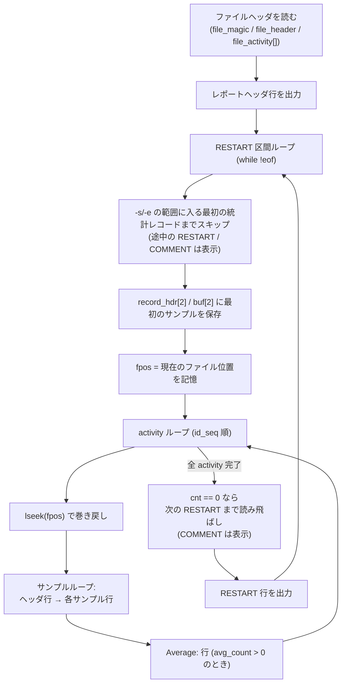

帰結として:

1. **出力は「時刻順」ではなく「activity 順」にグループ化される。**
   `sar -A -f file` は「CPU の全サンプル → CPU の Average → PCSW の全サンプル → …」となる。
2. **COMMENT レコードは activity ごとに再表示される。**
   `sar -C -A -f file` では同じ `COM xxx` 行が activity の数だけ繰り返し現れる。
   本家テスト `tests/expected.data-11.6.5` にそれが見える:

   ```
   Average:          7      0.57      0.00      0.87      0.09      0.00      0.17      0.02      0.00      0.00     98.28
   09:34:30     COM Hello, world!

   09:33:48       proc/s   cswch/s
   ```
3. `AO_MULTIPLE_OUTPUTS` を持つ activity (`A_MEMORY` の `-r`/`-S`、`A_FS` の `-F`/`-F MOUNT` 等) は
   `opt_flags` の下位 8bit を 1 ビットずつ立てて **同じ activity を複数回まわす**。
   したがって `sar -r -S` は「メモリ表 → メモリ Average → スワップ表 → スワップ Average」の順になる。
4. `-s`/`-e` で区間外だったレコードでも、RESTART / COMMENT は表示判定が別
   (`print_special_record()` が `datecmp` で判定し、範囲外なら表示しない)。

#### 2.2 ライブ収集時 (sadc からの読み出し)

`sar <interval> [<count>]` では時刻順に「1 サンプル = 全 activity の 1 ブロック」を出力する。
最後に全 activity の `Average:` をまとめて出す。

#### 2.3 ヘッダ行の再表示ルール

ヘッダ行 (`print_hdr_line()`) の出力は `dish` フラグで制御される。

| モード | `dish` の決まり方 |
|---|---|
| ファイル読み出し | activity ごとのループ内で `lines >= rows \|\| lines == 0` なら `TRUE` (そして `lines = 0`)、それ以外は `FALSE` |
| ライブ収集 (`dis_hdr == TRUE`) | 常に `TRUE` → **サンプルごとにヘッダを出す** |
| ライブ収集 (`dis_hdr == FALSE`) | `dish = lines / rows` (整数除算)。`dish` が真なら `lines %= rows`。その後 `lines++` |

- `dis_hdr = check_line_hdr()`:
  - 選択された「出力数」が 2 以上 → `TRUE`
  - 1 つだけの場合、その activity がビットマップを持つなら「立っているビット数 > 1」で `TRUE`、
    持たないなら `nr_ini > 1` で `TRUE`
  - つまり `sar 1 3` (CPU all のみ) は `FALSE`、`sar -A 1 3` や `sar -P ALL 1 3` は `TRUE`
- `rows = get_win_height()`:
  - `ioctl(TIOCGWINSZ)` が成功し `ws_row > 2` → `rows = ws_row - 2`
  - 失敗 (パイプ/リダイレクト) のとき、環境変数 `S_REPEAT_HEADER` が**数字のみ**なら
    その値 (正の値のみ有効)。未設定なら `DEFAULT_ROWS = 86400` (= `3600*24`)
  - 下限は `MIN_ROWS = 1`
- `lines` の加算量: activity がビットマップを持つなら「立っているビット数」、
  そうでなければ `act[p]->nr[curr]` (アイテム数)
- `Average:` 行の直前で `dish = dis_hdr` に戻される (ライブ収集時)

**パイプ出力時 (テストと同じ条件) では `rows = 86400` なので、実質「activity ブロックごとに 1 回」
ヘッダが出る**。Rust 実装ではまずこの挙動を再現すれば `tests/expected.*` と一致する。

#### 2.4 各行の共通レイアウト

```
<11 桁左詰めラベル><アイテム名 (activity 依存)><値列…>\n
```

| 要素 | 書式 |
|---|---|
| ヘッダ行の先頭 | `"\n%-11s"` — **必ず直前に空行が 1 行入る** (タイムスタンプは「前サンプルの時刻」) |
| データ行の先頭 | `"%-11s"` (タイムスタンプ `HH:MM:SS` は 8 文字 → 空白 3 個が付く) |
| 平均行の先頭 | `"%-11s"` + `Average:` / `Summary:` / `Last:` |
| min/max 行の先頭 | `"%-11s"` + `Minimum:` / `Maximum:` |
| 値 1 個 | `" %*.*f"` 等 — **必ず先頭に半角空白 1 個**が付く (§1.7) |

**幅指定は「最小幅」であって「最大幅」ではない。** C の `printf` は指定幅を超える内容を
切り詰めないため、9 桁を超えるデバイス名が来ると**その行全体が右にずれる**。
`tests/expected.data-12.5.6-A_QUEUE_modified` に実例がある (`virbr0-nic` は 10 文字):

```
07:55:25       wlp2s0      0.00      0.00      0.00      0.00      0.00      0.00      0.00      0.00
07:55:25    virbr0-nic      0.00      0.00      0.00      0.00      0.00      0.00      0.00      0.00
```

Rust では `format!("{:>9}", name)` が同じ挙動 (幅未満なら右詰め、超過ならそのまま) なので
この点は自然に一致するが、「列位置は固定」と仮定したテーブル整形を自作すると崩れる。

ヘッダ行のタイムスタンプが `timestamp[!curr]` (= 1 つ前のサンプルの時刻) である点に注意。
`tests/expected.data-11.6.5` の以下の抜粋では、ヘッダ行が `09:33:48`、データ行が `09:34:34` になっている:

```
09:33:48        CPU      %usr     %nice      %sys   %iowait    %steal      %irq     %soft    %guest    %gnice     %idle
09:34:34        all      0.47      0.00      0.55      0.08      0.00      0.13      0.03      0.00      0.00     98.75
```

#### 2.5 `print_hdr_line()` の詳細仕様

`activity.hdr_line` は 1 本の文字列にすべての列見出しを詰め込んだもので、
以下のメタ文字で構造化されている。

| 区切り | 意味 |
|---|---|
| `\|` (パイプ) | **複数出力 (`AO_MULTIPLE_OUTPUTS`) の切り替え**。`pos` 番目のセグメントを選ぶ |
| `;` (セミコロン) | 列の区切り |
| `&` (アンパサンド) | 「ここから先はオプション列」。`opt_flags` の上位バイト (`0xff00`) の該当ビットが立っていれば `;` に置換して全列表示、そうでなければ `\0` で打ち切り (前半のみ表示) |
| `*` (アスタリスク) | **アイテム展開**。`"foo*bar"` のように書かれ、選択されている全アイテム `j` について `foo<j-1>bar` を出力する。`j == 0` はグローバル項目で `all` (小文字) を出力 |

アルゴリズム (擬似コード):

```
fn print_hdr_line(p_timestamp, a, pos, iwidth, vwidth, offline_bitmap):
    hl = a.hdr_line を '|' で分割した pos 番目のセグメント
    if hl が存在しない: return
    print!("\n{:<11}", p_timestamp)

    if hl に '&' を含む:
        j = '&' の位置
        if (a.opt_flags & 0xff00) の bit(8 + pos) が立っている:
            hl[j] = ';'          # 全列表示
        else:
            hl[j] = '\0'         # 前半のみ

    i = -1
    for tk in hl を ';' で分割:
        if tk に '*' を含む:
            cfld = '*' より前, suffix = '*' より後
            for j in 0 .. min(a.nr_ini, a.bitmap.b_size + 1):
                if !IS_CPU_SELECTED(a.bitmap, j): continue
                if offline_bitmap && IS_CPU_OFFLINE(offline_bitmap, j): continue
                if j == 0: print!(" {:>vwidth$}", "all")
                else:      print!(" {:>vwidth$}", format!("{}{}{}", cfld, j-1, suffix))
            continue
        if iwidth > 0:               # 先頭のアイテム名列 (幅指定あり)
            print!(" {:>iwidth$}", tk); iwidth = 0; continue
        if iwidth < 0 && iwidth == i: # アイテム名列を行末に出す指定
            it = tk; iwidth = 0
        else:
            print!(" {:>vwidth$}", tk)
        i -= 1
    if it: print!(" {}", it)         # 行末にアイテム名 (幅指定なし)
    println!()
```

`iwidth` の符号の意味:

| `iwidth` | 意味 | 例 |
|---|---|---|
| `> 0` | 最初の列 (アイテム名) をこの幅で右詰め | `A_CPU`: `iwidth = 7` → ` CPU` を幅 7 で |
| `0` | アイテム名列なし | `A_PCSW` など |
| `< 0` | **行末**にアイテム名を置く。`-N` は「後ろから N 番目のトークン」 | `A_DISK`: `iwidth = -1` → `DEV` が行末 |

`vwidth` は値列の幅 (ほぼ全 activity で `9`)。

#### 2.6 特殊行

##### 2.6.1 `LINUX RESTART`

```
"\n" + format!("{:<11}", cur_time) + "  LINUX RESTART\t({} CPU)" + "\n"
```

- `cur_time` は `HH:MM:SS` (または `%X` / epoch 秒)
- CPU 数は `file_hdr.sa_cpu_nr > 1 ? sa_cpu_nr - 1 : 1`
- **`LINUX RESTART` と `(N CPU)` の間はタブ 1 個**
- 直前に空行が 1 行入る

実出力 (`tests/expected.data-11.6.5` 冒頭):

```
09:33:38     LINUX RESTART	(8 CPU)
```

(タイムスタンプ 8 桁 + `%-11s` のパディング 3 + `"  "` = 空白 5 個)

##### 2.6.2 COMMENT

```
format!("{:<11}", cur_time) + "  COM " + comment + "\n"
```

- **空行は入らない**
- `comment` は最大 `MAX_COMMENT_LEN = 64` バイト
- 表示は `sar -C` / `sadf` 系のみ (既定の `sar -f` では出ない)

実出力:

```
09:34:30     COM Hello, world!
```

##### 2.6.3 `Average:` / `Summary:` / `Last:` の使い分け

`write_stats_avg()` は 2 つのラベル変数を用意する。

| 変数 | 用途 | `-x` なし | `-x` あり |
|---|---|---|---|
| `timestamp[curr]` | **データ行**の先頭ラベル | `Average:` | `Average:` |
| `timestamp[!curr]` | **ヘッダ行**の先頭ラベル | `Average:` | **`Summary:`** |

その上で activity ごとに次の例外がある。

| activity | 平均データ行のラベル | 平均の意味 |
|---|---|---|
| カウンタ型 (大半) | `Average:` | 最初と最後の差分 / 全期間 (方式 A) |
| ゲージ型 (メモリ/キュー/ソケット/センサ等) | `Average:` | 全サンプルの算術平均 (方式 B) |
| `A_PWR_USB` | **`Summary:`** (ヘッダ行も `Summary:`) | 最後に収集したデバイス一覧をそのまま再掲 (方式 C) |
| `A_FS` | **`Summary:`**、`-x` 併用時のみ **`Last:`** | 最後に収集した値をそのまま再掲 (方式 C) |

`tests/expected.data-11.6.5` の A_FS ブロック (`-x` なし):

```
09:34:34       280398     14766      5.00     10.09  19056385    145663      0.76 /dev/sda7
Summary:        19832      9569     32.55     37.70   1666005    255355     13.29 /dev/sda9
```

##### 2.6.4 `-x` (min/max) 出力の行順

アイテムごとに「ヘッダ行 (`Summary:` ラベル) + `Minimum:` + `Maximum:` + 平均行」の
4 行ブロックが繰り返される。`tests/expected.sar-Ax` の A_FS ブロック:

```
Summary:     MBfsfree  MBfsused   %fsused  %ufsused     Ifree     Iused    %Iused FILESYSTEM
Minimum:          705       127      7.27     18.92   1621550    102818      0.78 /dev/sda7
Maximum:         2496       845     25.29     46.57  19051710    299810     15.60 /dev/sda7
Last:             705       145     17.04     18.92   6008414    102818      1.68 /dev/sda7
```

- ブロックの前には空行が 1 行入る (ヘッダ行の先頭 `\n`)
- min/max は **`LINUX RESTART` をまたぐたびに初期化**される (RESTART 区間ごとの極値)
- min/max が一度も更新されていないアイテム (`spmin == f64::MAX`) はブロックを出さない
  (CPU が 1 サンプルしかオンラインでなかった場合など)

#### 2.7 `-z` (ゼロ行の省略)

`S_F_ZERO_OMIT` が立つと、「前サンプルと現サンプルの統計構造体が**バイト単位で同一**」の
アイテムを出力しない。比較対象は activity ごとに定義された比較サイズ:

| activity | 比較方法 |
|---|---|
| `A_IRQ` | `curr.irq_nr == prev.irq_nr` |
| `A_SERIAL` | `memcmp(prev, curr, STATS_SERIAL_SIZE) == 0` |
| `A_DISK` | `memcmp(prev, curr, STATS_DISK_SIZE) == 0` |
| `A_NET_DEV` | `memcmp(prev, curr, STATS_NET_DEV_SIZE2CMP) == 0`。`SIZE2CMP = SIZE - MAX_IFACE_LEN - 1` で、末尾の `interface[]` と `duplex`(1 バイト) を比較対象外にする |
| `A_NET_EDEV` | `memcmp(prev, curr, STATS_NET_EDEV_SIZE2CMP) == 0`。`SIZE2CMP = SIZE - MAX_IFACE_LEN` |
| `A_FS` | `memcmp(prev, curr, STATS_FILESYSTEM_SIZE2CMP) == 0`。`SIZE2CMP = SIZE - 2 * MAX_FS_LEN` (`fs_name` と `mountp` を除外) |
| `A_NET_SOFT` | `memcmp(prev, curr, STATS_SOFTNET_SIZE) == 0` |

`-z` 指定時は**ヘッダ行の出力条件が `dish || DISPLAY_ZERO_OMIT(flags)` になる**ため、
「サンプルごとにヘッダが出る」挙動に変わる (該当 activity のみ)。
これを再現しないと `-z` 併用時の出力が合わない。

#### 2.8 アイテム名の解決 (`-p` / `-j` / `--dev=` に関わる最重要注意点)

`DISPLAY_PRETTY` (`-p` / `--pretty` / `-h` / `-j <type>`) がテキスト出力のレイアウトを変えるのは
**4 activity のみ**である。

| activity | 非 pretty | pretty (`-p`) |
|---|---|---|
| `A_IRQ` | 行頭に `" %9s"` で割り込み名 | **行末**に `" %s"` (幅指定なし) |
| `A_DISK` | 行頭に `" %9s"` でデバイス名 | 行末に `" %s"`、かつ device-mapper 名の解決が有効化される |
| `A_NET_DEV` | 行頭に `" %9s"` でインタフェース名 | 行末に `" %s"` |
| `A_NET_EDEV` | 同上 | 同上 |

ヘッダ行側も `print_hdr_line(..., iwidth = DISPLAY_PRETTY ? -1 : 0, ...)` で連動する
(`-1` = 「最後のトークンを行末に置く」)。

##### 2.8.1 ブロックデバイス名はファイルに入っていない

`stats_disk` 構造体は `major` / `minor` / `wwn[2]` / `part_nr` しか持たず、
**デバイス名の文字列を含まない**。そのため `sar` は表示時にローカルの
`/sys` や ioconf テーブルを引いて名前を作る:

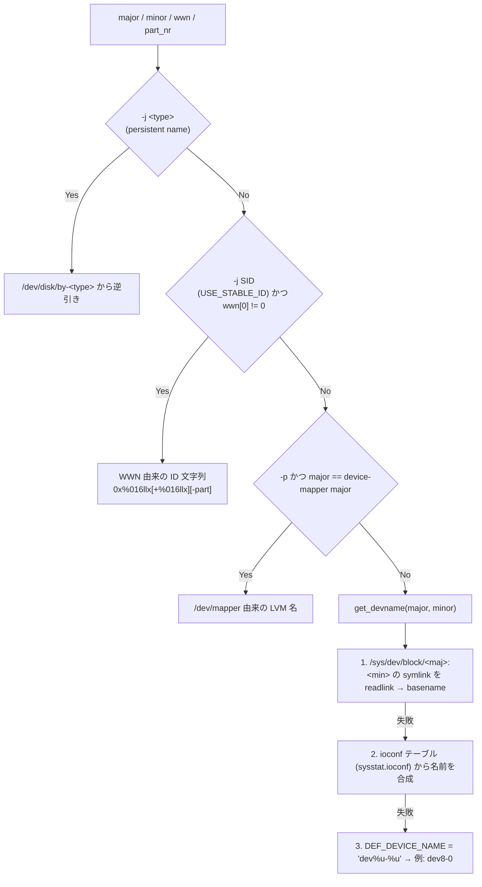

最後に、名前中の `!` は `/` に戻される (`cciss!c0d0` → `cciss/c0d0`)。

> **reSARch への含意**: **他ホストで採取した sa ファイルを読む場合、
> ブロックデバイス名は原理的に復元できない**。ローカルの `/sys` を引くと
> 「別のマシンの major/minor に対応するローカルデバイス名」という誤った名前が出る。
> 既定は `dev<major>-<minor>` 形式にし、`--dev=` のマッチングもその名前に対して行うのが安全。
> `-j SID` 相当 (WWN ベース) はファイル内の情報だけで再現できる唯一の安定名である。

`A_NET_DEV` / `A_NET_EDEV` / `A_FS` / `A_IRQ` は構造体内に名前文字列を持つため、
この問題は起きない (`A_FS` は `fs_name` と `mountp` の両方を持ち、
`-F` は `fs_name`、`-F MOUNT` は `mountp` を表示する)。

##### 2.8.2 WWN 由来の安定 ID (`-j SID`)

```
if wwn[1] != 0 { xsid = format!("{:016x}", wwn[1]) } else { xsid = "" }
if part_nr != 0 { pn = format!("-{}", part_nr) } else { pn = "" }
sid = format!("{:#016x}{}{}", wwn[0], xsid, pn)
```

`{:#016x}` は C の `%#016llx` 相当で、`0x` を含めて全体 16 桁になるようゼロ埋めされる。
`-j SID` は `S_F_DEV_SID + S_F_PRETTY` を立てるので、**同時に pretty レイアウトになる**。

---

## 第 III 部 — sar テキスト出力: activity 別仕様


参照ソース: `activity.c` / `pr_stats.c` / `pr_xstats.c` / `common.c` / `common.h` /
`sa.h` / `sa_common.c` / `sar.c` / `rd_stats.c` / `rd_stats.h` / `sadf_misc.c`。

> **重複についての注記**: 本部は単独で参照できるよう、§0〜§5 に
> バナー行・タイムスタンプ列・`print_hdr_line()`・`cprintf_*`・計算マクロの基本仕様を
> **再掲**している。第 I 部 (計算モデル) および第 IV 部 (タイムスタンプ / 単位) と
> 内容が重なるが、記述は相互に検証済みで矛盾はない。
> 実装時は「基本仕様 = 第 I 部 / 第 IV 部」「activity 別の列と式 = 本部 §6〜§7」
> という役割分担で読むとよい。

---

### 0. 全体構造

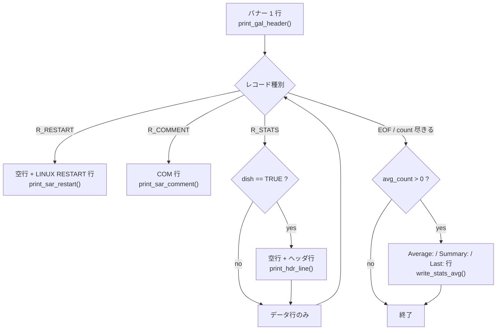

出力の基本単位は **「タイムスタンプ列(11 桁左詰め) + 固定幅フィールド列」** である。
sar のテキスト出力には区切り文字も TSV も存在せず、すべてが `printf` の幅指定で整列する。

#### 0.1 アクティビティブロックの出力順

ファイル読み込みモード (`sar -f file`) では、**1 アクティビティの全レコードを出し切ってから
次のアクティビティへ移る**(`read_stats_from_file()`)。順序は `activity.c` 末尾の
`struct activity *act[NR_ACT]` 配列順で、**activity id の昇順ではない**。

| act[] idx | activity | id | act[] idx | activity | id |
|---|---|---|---|---|---|
| 0 | A_CPU | 1 | 22 | A_NET_ETCP | 22 |
| 1 | A_PCSW | 2 | 23 | A_NET_UDP | 23 |
| 2 | A_IRQ | 3 | 24 | A_NET_SOCK6 | 24 |
| 3 | A_SWAP | 4 | 25 | A_NET_IP6 | 25 |
| 4 | A_PAGE | 5 | 26 | A_NET_EIP6 | 26 |
| 5 | A_IO | 6 | 27 | A_NET_ICMP6 | 27 |
| 6 | A_MEMORY | 7 | 28 | A_NET_EICMP6 | 28 |
| 7 | **A_HUGE** | **34** | 29 | A_NET_UDP6 | 29 |
| 8 | A_KTABLES | 8 | 30 | **A_NET_FC** | **38** |
| 9 | A_QUEUE | 9 | 31 | **A_NET_SOFT** | **39** |
| 10 | A_SERIAL | 10 | 32 | A_PWR_CPU | 30 |
| 11 | A_DISK | 11 | 33 | A_PWR_FAN | 31 |
| 12 | A_NET_DEV | 12 | 34 | A_PWR_TEMP | 32 |
| 13 | A_NET_EDEV | 13 | 35 | A_PWR_IN | 33 |
| 14 | A_NET_NFS | 14 | 36 | **A_PWR_FREQ** | **35** |
| 15 | A_NET_NFSD | 15 | 37 | **A_PWR_BAT** | **43** |
| 16 | A_NET_SOCK | 16 | 38 | A_PWR_USB | 36 |
| 17 | A_NET_IP | 17 | 39 | **A_FS** | **37** |
| 18 | A_NET_EIP | 18 | 40 | A_PSI_CPU | 40 |
| 19 | A_NET_ICMP | 19 | 41 | A_PSI_IO | 41 |
| 20 | A_NET_EICMP | 20 | 42 | A_PSI_MEM | 42 |
| 21 | A_NET_TCP | 21 | | | |

`activity.c` 内のコメントによるマークアップ境界:
`net_dev_act`(idx 12)で `<network>` が始まり `softnet_act`(idx 31、`AO_CLOSE_MARKUP`)で閉じる。
`pwr_cpufreq_act`(idx 32)で `<power-management>` が始まり
`pwr_usb_act`(idx 38、`AO_CLOSE_MARKUP`)で閉じる。
`psi_cpu_act`(idx 40)で `<psi>` が始まり `psi_mem_act`(idx 42、`AO_CLOSE_MARKUP`)で閉じる。
これらは sadf の XML/JSON 出力の入れ子構造のためで、テキスト出力には影響しない。

`AO_MULTIPLE_OUTPUTS` を持つアクティビティ (A_CPU / A_MEMORY / A_FS) は、
`opt_flags & 0xff` の**立っているビットを LSB から 1 ビットずつ**取り出して
`handle_curr_act_stats()` を繰り返し呼ぶ。つまり `-r -S` なら「RAM ブロック全体 → swap
ブロック全体」の 2 ブロックが連続して出る。

リアルタイムモード (`sar 1 3`) では逆に **1 サンプルごとに全アクティビティを出力**する
(`write_stats()` が `act[]` を毎回 1 周する)。

---

### 1. バナー行 (`print_gal_header()` in `common.c`)

```
printf("%s %s (%s) \t%s \t_%s_\t(%d CPU)\n", sysname, release, nodename, cur_date, machine, cpu_nr);
```

- 区切りは**タブ文字 (`\t`)** であり空白ではない。`(nodename)` の後に空白 1 個 + `\t`、
  日付の後に空白 1 個 + `\t`、`_machine_` の後に `\t`。
- `cur_date` は `set_report_date()`:
  - 環境変数 `S_TIME_FORMAT` が `ISO` なら `DATE_FORMAT_ISO` (`%Y-%m-%d`)、
    それ以外なら `DATE_FORMAT_LOCAL` (`%x` = ロケール依存、C ロケールでは `MM/DD/YY`)。
  - `strftime` が 0 を返した場合のみ `DEFAULT_ERROR_DATE` を出力。
- `cpu_nr` = `file_hdr.sa_cpu_nr > 1 ? sa_cpu_nr - 1 : 1`
  (`sa_cpu_nr` は「CPU "all" を含む数」なので 1 を引いて実 CPU 数にする。UP 機では 1)。
- バナー行の直後に空行が入るが、それはバナー自身ではなく**次のヘッダ行が先頭に `\n` を
  出す**ためである (§10)。

---

### 2. タイムスタンプ列

すべてのデータ行・ヘッダ行・特殊行は `printf("%-11s", ts)` で始まる。
**11 桁左詰め。11 桁を超える場合は切り詰められず、そのまま伸びる**(以降の列がずれる)。

`ts` の作り方 (`set_record_timestamp_string()` in `sa_common.c`):

| 条件 | 書式 | 例 | 幅 |
|---|---|---|---|
| `PRINT_SEC_EPOCH` (sadf のみ) かつ `cur_date != NULL` | `%llu` (epoch 秒) | `1757634001` | 10 → 11 桁に右パディング |
| `USE_PREFD_TIME_OUTPUT` (= `S_TIME_FORMAT` が ISO でない) | `strftime "%X"` | `10:00:01 AM` (C ロケール以外では 12 時間制になり得る) | ロケール依存 |
| 上記以外 (ISO) | `strftime "%H:%M:%S"` | `10:00:01` | 8 → `10:00:01   ` |

`sar.c` は `flags = S_F_LOCAL_TIME` で初期化されるため **sar は常にローカル時刻**で表示する。
`-t` (`S_F_TRUE_TIME`) はデータファイル作成時のタイムゾーンを使う。
`sar.c:1595` 付近で `if (!is_iso_time_fmt()) flags |= S_F_PREFD_TIME_OUTPUT;`。

> **要検証**: `%X` は C ロケールでは `HH:MM:SS` (8 桁) だが、`en_US.UTF-8` では
> `10:00:01 AM` (11 桁) になる。11 桁ちょうどなので `%-11s` のパディングが 0 になり、
> 次列との空白が 1 個だけになる。`tests/expected.*` は `LC_ALL=C` 相当で生成されている
> ため 8 桁が前提。Rust 実装では `S_TIME_FORMAT=ISO` 相当 (`%H:%M:%S`) を既定にするのが安全。

**重要な非対称性**: ヘッダ行に載るタイムスタンプは `timestamp[!curr]`(= **1 つ前の**
サンプルの時刻)、データ行に載るのは `timestamp[curr]`(現サンプルの時刻)。
したがって

```
10:00:01        CPU     %user ...      ← ヘッダ = 前サンプル時刻
10:10:01        all      1.00 ...      ← データ = 現サンプル時刻
```

---

### 3. ヘッダ行生成器 `print_hdr_line()` (`pr_stats.c`)

シグネチャ: `print_hdr_line(p_timestamp, a, pos, iwidth, vwidth, offline_bitmap)`

`a->hdr_line` は単一の文字列定数で、以下のメタ文字を持つ。

| 文字 | 意味 |
|---|---|
| `|` | 複数出力の区切り。`pos` 番目 (0 起点) のセクションを選ぶ |
| `;` | 列区切り |
| `&` | 「ここから先は拡張列」。`opt_flags & (1 << (8 + pos))` が立っていれば `;` に置換(=全列表示)、立っていなければ `'\0'` に置換(=ここで打ち切り) |
| `*` | マトリクス展開。`CPU*` → 選択中の各 CPU について `all` / `CPU0` / `CPU1` … を生成 |

アルゴリズム (擬似コード):

```
fn print_hdr_line(p_ts, hdr_line, pos, iwidth, vwidth, offline_bitmap, nr_ini, bitmap, opt_flags):
    hl = hdr_line.split('|')[pos]        // pos が範囲外なら何も出さずに return
    print!("\n{:<11}", p_ts)             // 先頭に必ず改行 = 空行が 1 行入る
    if hl contains '&':
        j = index_of('&')
        if (opt_flags & 0xff00) & (1 << (8 + pos)) != 0 { hl[j] = ';' } else { hl.truncate(j) }
    i = -1                               // トークン位置カウンタ (-1, -2, -3, ...)
    it = None
    for tk in hl.split(';'):
        if tk contains '*':
            (prefix, suffix) = tk.split_at('*')          // 例: "CPU" / ""
            for j in 0 .. min(nr_ini, bitmap.b_size + 1):
                if !IS_CPU_SELECTED(bitmap, j) { continue }
                if offline_bitmap.is_some() && IS_CPU_OFFLINE(offline_bitmap, j) { continue }
                if j == 0 { print!(" {:>vwidth$}", "all") }          // K_LOWERALL
                else      { print!(" {:>vwidth$}", format!("{}{}{}", prefix, j-1, suffix)) }
            i -= 1; continue
        if iwidth > 0:
            print!(" {:>iwidth$}", tk); iwidth = 0; i -= 1; continue
        if iwidth < 0 && iwidth == i:
            it = Some(tk); iwidth = 0                    // この列は行末へ回す
        else:
            print!(" {:>vwidth$}", tk)
        i -= 1
    if let Some(t) = it { print!(" {}", t) }             // 幅指定なし
    print!("\n")
```

要点:

- **各列は「空白 1 個 + 右詰め `vwidth` 桁」= 合計 `vwidth + 1` 桁**。全アクティビティで
  `vwidth = 9` なので **1 列 = 10 桁**が基本。
- `iwidth > 0` → 先頭列(アイテム名列)だけ `iwidth` 桁。A_CPU / A_PWR_CPU / A_PWR_FREQ /
  A_NET_SOFT は `iwidth = 7` → 先頭列は **8 桁**。
- `iwidth == 0` → 先頭列も `vwidth`(=9)扱い → 10 桁。
- `iwidth < 0` → `-iwidth` 番目のトークンを**行末に幅指定なしで**出す。
  `-1` = 第 1 トークン (A_DISK/A_NET_DEV/A_NET_EDEV/A_IRQ の `--pretty` 時、A_FS、A_NET_FC)、
  `-2` = 第 2 トークン (A_PWR_FAN / A_PWR_TEMP / A_PWR_IN の `DEVICE`)。
- `pos` の決まり方:
  - A_CPU: `FIRST + DISPLAY_CPU_ALL(opt_flags)` → `-u` なら 0、`-u ALL` なら 1。
  - A_MEMORY: RAM 出力は `FIRST`(0)、swap 出力は `SECOND`(1)。
  - A_FS: `FIRST + DISPLAY_MOUNT(opt_flags)` → `-F` なら 0、`-F MOUNT` なら 1。
  - それ以外は常に `FIRST`(0)。
- `&` のビット: A_MEMORY の RAM 出力では `pos = 0` → ビット 8 = `0x100` = `AO_F_MEM_ALL`。
  つまり `-r ALL` のときだけ `kbanonpg` 以降が出る。

---

### 4. 数値出力プリミティブ `cprintf_*` (`common.c`) — 厳密仕様

すべての `cprintf_*` は **値ごとに「SGR カラー列 → 空白 1 個 → 値 → SGR リセット」**を出す。
カラー列は tty でなければ空文字列になるので、非 tty 出力では「空白 1 個 + 値」だけが残る。

#### 4.1 カラーの有効化条件 (`init_colors()`)

```
無効化される条件:
  (S_COLORS 未設定 && !isatty(stdout))
  || S_COLORES == "never"
  || (S_COLORS != "always" && !isatty(stdout))
```
無効時は 10 個のカラー文字列すべてが `""` になる。**パイプ/ファイルへのリダイレクトでは
エスケープシーケンスは一切出ない**(= `tests/expected.*` と一致する)。
`S_COLORS_SGR` で `M=`/`H=`/`L=`/`Z=`/`N=`/`I=`/`C=`/`R=`/`+=`/`-=` の SGR を差し替え可。

#### 4.2 `cprintf_f(unit, sign, num, wi, wd, ...)` — double 値

```
1) if wd > 0 && dplaces_nr >= 0 { wd = dplaces_nr }     // --dec= の反映。wd==0 には効かない
2) lim = if wd == 1 { 0.05 } else { 0.005 }
3) 値ごと:
     if unit < 0 (NO_UNIT = -1):
         if sign { printf(" %+*.*f", wi, wd, val) } else { printf(" %*.*f", wi, wd, val) }
     else:
         cprintf_unit(unit, wi, val)
```
- 出力幅 = `1 + wi`(= 10 桁、`wi=9` の場合)。`wd` を変えても**幅は変わらない**。
- `sign = TRUE` は A_PWR_BAT の `cap/min` のみ。符号は `wi` の内側に入る(`    +0.00`)。
- 色分けの閾値 (値には影響しないが tty では見える):
  - ゼロ扱い色 `Z=`: `wd>0 && |val| < lim` または `wd==0 && -0.5 <= val <= 0.5`
  - `sign && val <= -10.0` → `H=`(xtreme)、`sign && val <= -5.0` → `M=`(warn)
  - それ以外 → `I=`

#### 4.3 `cprintf_u64(unit, num, wi, ...)` — 64bit 符号なし整数

```
if unit < 0 { printf(" %*"PRIu64, wi, val) } else { cprintf_unit(unit, wi, (double) val) }
```
幅 = `1 + wi` = 10 桁。`--dec=` は**無関係**(整数出力)。
色は `val == 0` なら `Z=`、それ以外は `I=`。

#### 4.4 `cprintf_x(num, wi, ...)` — 16 進

`printf(" %*x", wi, val)` → 幅 10 桁。A_PWR_USB の `idvendor` / `idprod` のみ。
`0x` プレフィックスは付かず、小文字 16 進。

#### 4.5 `cprintf_xpc(human, xtrem, num, wi, wd, ...)` — パーセント値

```
1) if wd > 0 && dplaces_nr >= 0 { wd = dplaces_nr }
2) if human > 0:                       // human = DISPLAY_UNIT(flags) = --human / -h
       if wi < 4 { wi = 4 }
       wi -= 1                         // '%' 記号 1 桁分を確保
       if wd > 1 { wd -= 1 }
3) lim = if wd == 1 { 0.05 } else { 0.005 }
4) printf(" %*.*f", wi, wd, val);  if human > 0 { printf("%%") }
```
**幅は human の有無で変わらない**: `wi=9, wd=2` →
- 非 human: `" %9.2f"` = 10 桁 (`     0.00`)
- `--human`: `" %8.1f%%"` = 10 桁 (`     0.0%`)

`--dec` と `--human` の合成(`wi=9, wd=2` 起点):

| オプション | 実効書式 | 幅 |
|---|---|---|
| (なし) | `" %9.2f"` | 10 |
| `--dec=0` | `" %9.0f"` | 10 |
| `--dec=1` | `" %9.1f"` | 10 |
| `--dec=2` | `" %9.2f"` | 10 |
| `--human` | `" %8.1f%%"` | 10 |
| `--human --dec=0` | `" %8.0f%%"` | 10 |
| `--human --dec=1` | `" %8.1f%%"` | 10 |
| `--human --dec=2` | `" %8.1f%%"` | 10 |

`xtrem` は色分けのみ。`XHIGH=1` / `XLOW=2` / `XLOW0=3`、閾値は
`PERCENT_LIMIT_XHIGH=90.0` / `HIGH=75.0` / `LOW=25.0` / `XLOW=10.0`。
`XLOW0` は `val >= lim`(ほぼゼロでない)ときだけ色を付ける変種。

#### 4.6 `cprintf_unit(unit, wi, dval)` — `--human` 時の単位付き表示

```
if wi < 4 { wi = 4 }
if unit == 0 (UNIT_SECTOR) { dval /= 2; unit = 2 }      // セクタ → kB
while dval >= 1024 { dval /= 1024; unit += 1 }
printf(" %*.*f", wi - 1, (dplaces_nr != 0) ? 1 : 0, dval)    // 注: dplaces_nr = -1 も「真」
if unit >= NR_UNITS (=8) { unit = 7 }
printf("%c", units[unit])                                    // units = ['s','B','k','M','G','T','P','?']
```
幅 = `1 + (wi-1) + 1` = `wi + 1` = 10 桁。小数点以下は
`dplaces_nr == 0` のときだけ 0 桁、**未指定 (-1) でも 1 桁**になる点に注意。

`unit` 引数の値 (`common.h`): `UNIT_SECTOR=0` / `UNIT_BYTE=1` / `UNIT_KILOBYTE=2`、
`NO_UNIT=-1`。sar 内での割り当て:

| アクティビティ | `--human` 時の `unit` |
|---|---|
| A_MEMORY | `UNIT_KILOBYTE` |
| A_HUGE | `UNIT_KILOBYTE` |
| A_DISK | `UNIT_KILOBYTE` |
| A_NET_DEV | `UNIT_BYTE` |
| A_FS | `UNIT_BYTE` |
| 上記以外の数値列 | `NO_UNIT` (単位なし) |

#### 4.7 `cprintf_in(type, format, item_string, item_int)` — アイテム名列

`type == IS_STR(1)` なら `printf(format, item_string)`、`IS_INT(0)` なら
`printf(format, item_int)`。**format は活動ごとに固定文字列**なので、
そのままの幅になる(§6 の各表参照)。

#### 4.8 `cprintf_s(type, format, string)` / `cprintf_tr(trend, format, tstring)`

`cprintf_s` は色だけを type で切り替えて `printf(format, string)`。
type: `IS_STR=1`(通常)、`IS_ZERO=4`、`IS_RESTART=2`(= `IS_DEBUG`)、`IS_COMMENT=3`。
`cprintf_tr` は正負トレンド色で `printf(format, tstring)`。A_PWR_BAT の矢印のみ。

#### 4.9 `--dec=` の妥当性検査

`sar.c`: `--dec=` は**長さがちょうど 7 文字** (`--dec=` + 1 桁) でなければオプションとして
認識されない。値は `atoi()` で取り、`0..2` 以外なら `usage()` して exit 1。
`dplaces_nr` の初期値は **`-1`**(未指定)。

---

### 5. 計算マクロと interval

`common.h`:

```
S_VALUE(m, n, p)   = ((double)((n) - (m))) / (p) * 100
SP_VALUE(m, n, p)  = ((double)((n) - (m))) / (p) * 100        // 定義は同一、意味論のみ違う
MINIMUM(a, b)      = (a) < (b) ? (a) : (b)
KB_TO_PG(k)        = (k) >> kb_shift
PG_TO_KB(k)        = (k) << kb_shift
```

- `S_VALUE` は「毎秒あたりの増分」。`p` = `itv` は **1/100 秒単位**なので `* 100` で秒に直す。
- `SP_VALUE` は「`n` に対する `n - m` の百分率」。実体は同じ式。
- `ll_sp_value(v1, v2, itv)` (`common.c`): `v2 < v1` なら **0.0**、それ以外は `SP_VALUE(v1, v2, itv)`。
  dyn-tick カーネルで CPU カウンタが逆行する問題への対策。CPU 系のみ使用。
- `get_interval(prev, curr)` (`common.c`): `itv = curr - prev`、**0 なら 1 に補正**
  (ゼロ除算回避)。単位は jiffies (= 1/100 秒)。
- `get_itv_value()` (`sa_common.c`): `itv = get_interval(prev->uptime_cs, curr->uptime_cs)`。
  **uptime_cs はマシン全体の 1/100 秒カウンタで、CPU 数に依存しない**。
- `get_per_cpu_interval(scc, scp)` (`rd_stats.c`): CPU ごとの jiffies 合計差。
  - `guest` が `user` を上回る誤差、`guest_nice` が `nice` を上回る誤差を `ishift` で補正。
  - CPU がオンラインに復帰したケース: `iowait` / `idle` が前値より小さく、かつ前値が
    `ULLONG_MAX - 0x7ffff` 未満なら、前値を 0 とみなす。
  - 返り値 0 は「tickless CPU」を意味し、表示側で特別扱いされる。
- `get_global_cpu_statistics()` (`sa_common.c`): SMP (`nr_ini > 1`) のとき、
  CPU "all" 行を**各 CPU の単純和として再計算**する (`/proc/stat` の `cpu` 行は使わない)。
  - `tot_jiffies_c == 0` → その CPU はオフライン: 現値に前値をコピーし、オフラインビットを立てる。
  - `tot_jiffies_p == 0 && !WANT_SINCE_BOOT` → 復帰直後で基準値なし: オフライン扱いで
    CPU "all" にも加算しない。
  - `deltot_jiffies` = 各 CPU の `get_per_cpu_interval()` の総和。

#### 5.1 ディスク派生量 (`compute_ext_disk_stats()` in `rd_stats.c`)

```
util  = if tot_ticks_c < tot_ticks_p { 0.0 } else { S_VALUE(tot_ticks_p, tot_ticks_c, itv) }
d_ios = nr_ios_c - nr_ios_p
await = if nr_ios_c > nr_ios_p {
            ((rd_ticks_c-rd_ticks_p) + (wr_ticks_c-wr_ticks_p) + (dc_ticks_c-dc_ticks_p)) / d_ios
        } else { 0.0 }
arqsz = if nr_ios_c > nr_ios_p {
            ((rd_sect_c-rd_sect_p) + (wr_sect_c-wr_sect_p) + (dc_sect_c-dc_sect_p)) / d_ios
        } else { 0.0 }
```
`tot_ticks` はカーネルがミリ秒で与えるためスケーリング不要。

#### 5.2 NIC 利用率 (`compute_ifutil()` in `sa_common.c`)

```
if speed == 0 { return 0 }
speed_bps = (u64) speed * 1_000_000
if duplex == C_DUPLEX_FULL { return max(rx, tx) * 800 / speed_bps }
else                       { return (rx + tx) * 800 / speed_bps }
```
`rx` / `tx` は **バイト毎秒**。`* 800` = `* 8 * 100` (bit 化 + 百分率化)。

---

### 6. activity テーブル全 43 件 (`activity.c`)

`sa.h` の定義値: `NR_ACT = 43`、`MAX_NR_ACT = 256`、`NR_F_COUNT = 14`、
`ACTIVITY_MAGIC_BASE = 0x8a`(138)。`ACTIVITY_MAGIC_UNKNOWN` は **12.8.0 には存在しない**
(`tests/12.0.1/` 配下の旧コピーにのみある `0x89`)。

#### 6.1 `AO_*` フラグ (`sa.h`)

| フラグ | 値 | bit | 意味 |
|---|---|---|---|
| `AO_NULL` | 0x000 | — | 無し |
| `AO_COLLECTED` | 0x001 | 0 | sadc が収集すべき |
| `AO_SELECTED` | 0x002 | 1 | sar が表示すべき(オプション解析で立つ) |
| `AO_COUNTED` | 0x004 | 2 | アイテム数を数える必要がある (`f_count_index >= 0`) |
| `AO_PERSISTENT` | 0x008 | 3 | デバイス再登録でも値が持続。CPU 系専用 |
| `AO_CLOSE_MARKUP` | 0x010 | 4 | sadf XML/JSON の共有マークアップを閉じる |
| `AO_MULTIPLE_OUTPUTS` | 0x020 | 5 | 複数の出力形式を持つ |
| `AO_GRAPH_PER_ITEM` | 0x040 | 6 | SVG でアイテムごとに 1 グラフ |
| `AO_MATRIX` | 0x080 | 7 | サブアイテムを持つ (`nr2 > 1`) |
| `AO_LIST_ON_CMDLINE` | 0x100 | 8 | コマンドラインでデバイスリストが与えられた |
| `AO_ALWAYS_COUNTED` | 0x200 | 9 | 収集しなくてもアイテム数は常に数える |
| `AO_DETECTED` | 0x400 | 10 | 検出テストに通ったときだけ収集。`has_nr` フィールドを持たない |

12.8.0 の `AO_*` は上記 11 個 + `AO_NULL` で**すべて**。

#### 6.2 `G_*` グループ (`sa.h`) — sar は参照しない

| define | 値 | 所属アクティビティ |
|---|---|---|
| `G_DEFAULT` | 0x00 | A_CPU, A_PCSW, A_SWAP, A_PAGE, A_IO, A_MEMORY, A_KTABLES, A_QUEUE, A_SERIAL, A_NET_DEV, A_NET_EDEV, A_NET_NFS, A_NET_NFSD, A_NET_SOCK, A_HUGE, A_NET_SOFT, A_PSI_CPU, A_PSI_IO, A_PSI_MEM |
| `G_INT` | 0x01 | A_IRQ |
| `G_DISK` | 0x02 | A_DISK, A_NET_FC |
| `G_SNMP` | 0x04 | A_NET_IP, A_NET_EIP, A_NET_ICMP, A_NET_EICMP, A_NET_TCP, A_NET_ETCP, A_NET_UDP |
| `G_IPV6` | 0x08 | A_NET_SOCK6, A_NET_IP6, A_NET_EIP6, A_NET_ICMP6, A_NET_EICMP6, A_NET_UDP6 |
| `G_POWER` | 0x10 | A_PWR_CPU, A_PWR_FAN, A_PWR_TEMP, A_PWR_IN, A_PWR_FREQ, A_PWR_USB, A_PWR_BAT |
| `G_XDISK` | 0x20 | A_FS |

**`.group` を読むのは `sadc.c` だけ**であり、`sar` のオプションはグループを使わない。
グループ選択は `sadc -S {INT|DISK|XDISK|SNMP|IPV6|POWER|ALL|XALL|A_NULL|A_XXX}` の側の機能。

#### 6.3 `AO_F_*` (`opt_flags`) (`sa.h`)

`opt_flags` のレイアウト: `0x0001-0x0080` = 複数出力の選択、
`0x0100-0x8000` = 対応する出力で `hdr_line` の完全版(`&` 以降)を表示、`0x010000+` = 予備。

| define | 値 | 対象 | テストマクロ |
|---|---|---|---|
| `AO_F_NULL` | 0x0000 | — | — |
| `AO_F_MEMORY` | 0x0001 | A_MEMORY (`-r`) | `DISPLAY_MEMORY()` |
| `AO_F_SWAP` | 0x0002 | A_MEMORY (`-S`) | `DISPLAY_SWAP()` |
| `AO_F_MEM_ALL` | 0x0100 | A_MEMORY (`-r ALL`) | `DISPLAY_MEM_ALL()` |
| `AO_F_CPU_DEF` | 0x0001 | A_CPU (`-u`) | `DISPLAY_CPU_DEF()` |
| `AO_F_CPU_ALL` | 0x0002 | A_CPU (`-u ALL`) | `DISPLAY_CPU_ALL()` |
| `AO_F_DISK_PART` | 0x0001 | A_DISK (sadc の `-S XDISK` のみ) | `COLLECT_PARTITIONS()` |
| `AO_F_FILESYSTEM` | 0x0001 | A_FS (`-F`) | (専用マクロなし) |
| `AO_F_MOUNT` | 0x0002 | A_FS (`-F MOUNT`) | `DISPLAY_MOUNT()` |

**`AO_F_MEM_AMT` / `AO_F_MEM_SWAP` / `AO_F_NO_PART` は 12.8.0 に存在しない。**
`activity.c` の初期値で `opt_flags != 0` なのは **A_CPU (`AO_F_CPU_DEF`) だけ**。

#### 6.4 全 43 アクティビティ一覧

`fci` = `f_count_index`、`fci2` = `f_count2_index`、`il` = `item_list_sz`。
`item_list_sz` は全アクティビティで初期値 **0**(`--dev=` 等で実行時に設定)。

| id | name | options | magic | group | fci / fci2 | il | g_nr | nr_ini | nr2 | nr_max | sar オプション |
|---|---|---|---|---|---|---|---|---|---|---|---|
| 1 | `A_CPU` | COLLECTED+COUNTED+PERSISTENT+MULTIPLE_OUTPUTS+GRAPH_PER_ITEM+ALWAYS_COUNTED (0x26D) | BASE+1 | G_DEFAULT | 0 / -1 | 0 | 1 | -1 | 1 | NR_CPUS+1 | `-u` / `-u ALL` / `-A` / 既定 |
| 2 | `A_PCSW` | COLLECTED (0x001) | BASE+1 | G_DEFAULT | -1 / -1 | 0 | 2 | 1 | 1 | 1 | `-w` |
| 3 | `A_IRQ` | COUNTED+MATRIX+PERSISTENT (0x08C) | BASE+2 | G_INT | 0 / 1 | 0 | 0 | -1 (CPU 数) | -1 (割込数) | NR_CPUS+1 | `-I` / `-I SUM` / `-I ALL` / `--int=` |
| 4 | `A_SWAP` | COLLECTED (0x001) | BASE | G_DEFAULT | -1 / -1 | 0 | 1 | 1 | 1 | 1 | `-W` |
| 5 | `A_PAGE` | COLLECTED (0x001) | BASE | G_DEFAULT | -1 / -1 | 0 | 4 | 1 | 1 | 1 | `-B` |
| 6 | `A_IO` | COLLECTED (0x001) | BASE+1 | G_DEFAULT | -1 / -1 | 0 | 2 | 1 | 1 | 1 | `-b` |
| 7 | `A_MEMORY` | COLLECTED+MULTIPLE_OUTPUTS (0x021) | BASE+1 | G_DEFAULT | -1 / -1 | 0 | 9 | 1 | 1 | 1 | `-r` / `-r ALL` / `-S` |
| 8 | `A_KTABLES` | COLLECTED (0x001) | BASE+1 | G_DEFAULT | -1 / -1 | 0 | 2 | 1 | 1 | 1 | `-v` |
| 9 | `A_QUEUE` | COLLECTED (0x001) | BASE+2 | G_DEFAULT | -1 / -1 | 0 | 3 | 1 | 1 | 1 | `-q` / `-q LOAD` / `-q ALL` |
| 10 | `A_SERIAL` | COLLECTED+COUNTED (0x005) | BASE+1 | G_DEFAULT | 2 / -1 | 0 | 0 | -1 | 1 | MAX_NR_SERIAL_LINES | `-y` |
| 11 | `A_DISK` | COUNTED+GRAPH_PER_ITEM (0x044) | BASE+2 | G_DISK | 3 / -1 | 0 | 5 | -1 | 1 | MAX_NR_DISKS | `-d` (+ `--dev=`) |
| 12 | `A_NET_DEV` | COLLECTED+COUNTED+GRAPH_PER_ITEM (0x045) | BASE+3 | G_DEFAULT | 4 / -1 | 0 | 4 | -1 | 1 | MAX_NR_IFACES | `-n DEV` (+ `--iface=`) |
| 13 | `A_NET_EDEV` | COLLECTED+COUNTED+GRAPH_PER_ITEM (0x045) | BASE+2 | G_DEFAULT | 4 / -1 | 0 | 4 | -1 | 1 | MAX_NR_IFACES | `-n EDEV` (+ `--iface=`) |
| 14 | `A_NET_NFS` | COLLECTED (0x001) | BASE | G_DEFAULT | -1 / -1 | 0 | 3 | 1 | 1 | 1 | `-n NFS` |
| 15 | `A_NET_NFSD` | COLLECTED (0x001) | BASE | G_DEFAULT | -1 / -1 | 0 | 5 | 1 | 1 | 1 | `-n NFSD` |
| 16 | `A_NET_SOCK` | COLLECTED (0x001) | BASE | G_DEFAULT | -1 / -1 | 0 | 2 | 1 | 1 | 1 | `-n SOCK` |
| 17 | `A_NET_IP` | NULL (0x000) | BASE+2 | G_SNMP | -1 / -1 | 0 | 3 | 1 | 1 | 1 | `-n IP` |
| 18 | `A_NET_EIP` | NULL (0x000) | BASE+2 | G_SNMP | -1 / -1 | 0 | 3 | 1 | 1 | 1 | `-n EIP` |
| 19 | `A_NET_ICMP` | NULL (0x000) | BASE | G_SNMP | -1 / -1 | 0 | 4 | 1 | 1 | 1 | `-n ICMP` |
| 20 | `A_NET_EICMP` | NULL (0x000) | BASE | G_SNMP | -1 / -1 | 0 | 6 | 1 | 1 | 1 | `-n EICMP` |
| 21 | `A_NET_TCP` | NULL (0x000) | BASE | G_SNMP | -1 / -1 | 0 | 2 | 1 | 1 | 1 | `-n TCP` |
| 22 | `A_NET_ETCP` | NULL (0x000) | BASE | G_SNMP | -1 / -1 | 0 | 2 | 1 | 1 | 1 | `-n ETCP` |
| 23 | `A_NET_UDP` | NULL (0x000) | BASE | G_SNMP | -1 / -1 | 0 | 2 | 1 | 1 | 1 | `-n UDP` |
| 24 | `A_NET_SOCK6` | NULL (0x000) | BASE | G_IPV6 | -1 / -1 | 0 | 1 | 1 | 1 | 1 | `-n SOCK6` |
| 25 | `A_NET_IP6` | NULL (0x000) | BASE+2 | G_IPV6 | -1 / -1 | 0 | 4 | 1 | 1 | 1 | `-n IP6` |
| 26 | `A_NET_EIP6` | NULL (0x000) | BASE+2 | G_IPV6 | -1 / -1 | 0 | 4 | 1 | 1 | 1 | `-n EIP6` |
| 27 | `A_NET_ICMP6` | NULL (0x000) | BASE | G_IPV6 | -1 / -1 | 0 | 5 | 1 | 1 | 1 | `-n ICMP6` |
| 28 | `A_NET_EICMP6` | NULL (0x000) | BASE | G_IPV6 | -1 / -1 | 0 | 6 | 1 | 1 | 1 | `-n EICMP6` |
| 29 | `A_NET_UDP6` | NULL (0x000) | BASE | G_IPV6 | -1 / -1 | 0 | 2 | 1 | 1 | 1 | `-n UDP6` |
| 30 | `A_PWR_CPU` | COUNTED+GRAPH_PER_ITEM (0x044) | BASE | G_POWER | 0 / -1 | 0 | 1 | -1 | 1 | NR_CPUS+1 | `-m CPU` |
| 31 | `A_PWR_FAN` | COUNTED+GRAPH_PER_ITEM (0x044) | BASE | G_POWER | 5 / -1 | 0 | 1 | -1 | 1 | MAX_NR_FANS | `-m FAN` |
| 32 | `A_PWR_TEMP` | COUNTED+GRAPH_PER_ITEM (0x044) | BASE | G_POWER | 6 / -1 | 0 | 2 | -1 | 1 | MAX_NR_TEMP_SENSORS | `-m TEMP` |
| 33 | `A_PWR_IN` | COUNTED+GRAPH_PER_ITEM (0x044) | BASE | G_POWER | 7 / -1 | 0 | 2 | -1 | 1 | MAX_NR_IN_SENSORS | `-m IN` |
| 34 | `A_HUGE` | COLLECTED (0x001) | BASE+1 | G_DEFAULT | -1 / -1 | 0 | 2 | 1 | 1 | 1 | `-H` |
| 35 | `A_PWR_FREQ` | COUNTED+MATRIX (0x084) | BASE+1 | G_POWER | 0 / 12 | 0 | 0 | -1 (CPU 数) | -1 (周波数数) | NR_CPUS+1 | `-m FREQ` |
| 36 | `A_PWR_USB` | COUNTED+CLOSE_MARKUP (0x014) | BASE | G_POWER | 8 / -1 | 0 | 0 | -1 | 1 | MAX_NR_USB | `-m USB` |
| 37 | `A_FS` | COUNTED+GRAPH_PER_ITEM+MULTIPLE_OUTPUTS (0x064) | BASE+1 | G_XDISK | 9 / -1 | 0 | 4 | -1 | 1 | MAX_NR_FS | `-F` / `-F MOUNT` (+ `--fs=`) |
| 38 | `A_NET_FC` | COUNTED+GRAPH_PER_ITEM (0x044) | BASE | G_DISK | 10 / -1 | 0 | 2 | -1 | 1 | MAX_NR_FCHOSTS | `-n FC` |
| 39 | `A_NET_SOFT` | COLLECTED+COUNTED+CLOSE_MARKUP+GRAPH_PER_ITEM+PERSISTENT (0x05D) | BASE | G_DEFAULT | 0 / -1 | 0 | 3 | -1 | 1 | NR_CPUS+1 | `-n SOFT` |
| 40 | `A_PSI_CPU` | COLLECTED+DETECTED (0x401) | BASE | G_DEFAULT | 11 / -1 | 0 | 2 | 1 | 1 | 1 | `-q CPU` / `-q PSI` / `-q ALL` |
| 41 | `A_PSI_IO` | COLLECTED+DETECTED (0x401) | BASE | G_DEFAULT | 11 / -1 | 0 | 4 | 1 | 1 | 1 | `-q IO` / `-q PSI` / `-q ALL` |
| 42 | `A_PSI_MEM` | COLLECTED+DETECTED+CLOSE_MARKUP (0x411) | BASE | G_DEFAULT | 11 / -1 | 0 | 4 | 1 | 1 | 1 | `-q MEM` / `-q PSI` / `-q ALL` |
| 43 | `A_PWR_BAT` | COUNTED+GRAPH_PER_ITEM (0x044) | BASE | G_POWER | 13 / -1 | 0 | 1 | -1 | 1 | MAX_NR_BATS | `-m BAT` |

`f_count_index` の対応関数 (`activity.c` のコメントより):
`0` = `wrap_get_cpu_nr()`、`1` = `wrap_get_irq_nr()`、`2` = `wrap_get_serial_nr()`、
`3` = `wrap_get_disk_nr()`、`4` = `wrap_get_iface_nr()`、`5` = `wrap_get_fan_nr()`、
`6` = `wrap_get_temp_nr()`、`7` = `wrap_get_in_nr()`、`8` = `wrap_get_usb_nr()`、
`9` = `wrap_get_filesystem_nr()`、`10` = `wrap_get_fchost_nr()`、`11` = `wrap_detect_psi()`、
`12` = `wrap_get_freq_nr()`、`13` = `wrap_get_bat_nr()`。

`g_nr` は **SVG グラフ枚数**であり、テキスト出力には一切影響しない。`g_nr = 0` は
「SVG レンダラを持たない/独自レンダラ」を意味するだけで、テキスト出力は持つ
(A_IRQ / A_SERIAL / A_PWR_FREQ / A_PWR_USB がこれに該当)。

#### 6.5 sar オプション → アクティビティ 完全逆引き

`-A` 以外のオプション文字は `parse_sar_opt()` (`sa_common.c`) が 1 文字ずつ処理するため、
`sar -bBruW` のようにまとめ書きできる。`switch` が受けるのは
`A B b C d F H h I j p q r S t u v w W x y z` のみで、それ以外は `usage()` → exit 1。

**`-R` は 12.8.0 に存在しない**(`case 'R'` がなく `usage()` の synopsis にもない)。

| オプション | 選択されるアクティビティ | 付随効果 |
|---|---|---|
| `-u` | A_CPU | `opt_flags = AO_F_CPU_DEF`(代入) |
| `-u ALL` | A_CPU | `opt_flags = AO_F_CPU_ALL`。`u` が引数末尾文字かつ次 argv が厳密に `ALL` のときだけ成立し、成立すると `return 0`(後続のまとめ書き文字は無視) |
| `-w` | A_PCSW | — |
| `-I` | A_IRQ | `options \|= AO_SELECTED` |
| `-I SUM` | A_IRQ | `item_list` に `"sum"` を追加 (`MAX_SA_IRQ_LEN = 8`)、`AO_LIST_ON_CMDLINE` |
| `-I ALL` | A_IRQ | キーワードは**消費されるが無視**(= 全割込表示) |
| `-W` | A_SWAP | — |
| `-B` | A_PAGE | — |
| `-b` | A_IO | — |
| `-r` | A_MEMORY | `opt_flags \|= AO_F_MEMORY` |
| `-r ALL` | A_MEMORY | `opt_flags \|= AO_F_MEMORY \| AO_F_MEM_ALL` |
| `-S` | A_MEMORY | `opt_flags \|= AO_F_SWAP` |
| `-v` | A_KTABLES | — |
| `-q`(まとめ書き内) | A_QUEUE のみ | PSI は選択されない |
| `-y` | A_SERIAL | — |
| `-d` | A_DISK | sar は `AO_F_DISK_PART` を立てない |
| `-H` | A_HUGE | — |
| `-F` | A_FS | `opt_flags \|= AO_F_FILESYSTEM` |
| `-F MOUNT` | A_FS | `opt_flags \|= AO_F_MOUNT`(`AO_F_FILESYSTEM` は付かない) |
| `-A` | 全 43 | 下記 |

`-n {kw[,...]}` (`parse_sar_n_opt()`): 未知キーワードは `usage()`。

| kw | activity | kw | activity |
|---|---|---|---|
| `DEV` | A_NET_DEV (12) | `SOCK6` | A_NET_SOCK6 (24) |
| `EDEV` | A_NET_EDEV (13) | `IP6` | A_NET_IP6 (25) |
| `NFS` | A_NET_NFS (14) | `EIP6` | A_NET_EIP6 (26) |
| `NFSD` | A_NET_NFSD (15) | `ICMP6` | A_NET_ICMP6 (27) |
| `SOCK` | A_NET_SOCK (16) | `EICMP6` | A_NET_EICMP6 (28) |
| `IP` | A_NET_IP (17) | `UDP6` | A_NET_UDP6 (29) |
| `EIP` | A_NET_EIP (18) | `FC` | A_NET_FC (38) |
| `ICMP` | A_NET_ICMP (19) | `SOFT` | A_NET_SOFT (39) |
| `EICMP` | A_NET_EICMP (20) | `ALL` | 上記 20 個すべて |
| `TCP` | A_NET_TCP (21) | | |
| `ETCP` | A_NET_ETCP (22) | | |
| `UDP` | A_NET_UDP (23) | | |

`-m {kw[,...]}` (`parse_sar_m_opt()`): `CPU`→A_PWR_CPU、`FAN`→A_PWR_FAN、
`IN`→A_PWR_IN、`TEMP`→A_PWR_TEMP、`FREQ`→A_PWR_FREQ、`USB`→A_PWR_USB、
**`BAT`→A_PWR_BAT**、`ALL`→7 個すべて。
(`BAT` は `usage()` の synopsis に載っていないが `display_help()` と parser は対応済み。)

`-q [kw[,...]]` (`parse_sar_q_opt()`): `LOAD`→A_QUEUE、`CPU`→A_PSI_CPU、`IO`→A_PSI_IO、
`MEM`→A_PSI_MEM、`PSI`→A_PSI_CPU+IO+MEM、`ALL`→A_QUEUE+PSI 3 種。
引数なしの `-q`、または引数がキーワード列として解釈できない場合 (`sar -q 2 5` など) は
**A_QUEUE のみ**を選択し、`opt` を進めないのでトークンは interval/count として再解釈される。

`-A` (`select_all_activities()` + `case 'A'`):
1. 全 43 に `AO_SELECTED` を無条件で立てる(アイテムが 0 件のものも含む)。
2. `flags |= S_F_OPTION_A`。
3. A_MEMORY: `opt_flags |= AO_F_MEMORY + AO_F_SWAP + AO_F_MEM_ALL` (= 0x103) → `-r ALL -S` 相当。
4. A_CPU: `opt_flags = AO_F_CPU_ALL`(代入、`AO_F_CPU_DEF` は消える)→ `-u ALL` 相当。
5. A_FS: `opt_flags = AO_F_FILESYSTEM`(代入)→ `-F` 相当 (`MOUNT` ではない)。
6. 後段の `set_bitmaps()` が、`-P` が明示されていなければ CPU ビットマップを全ビット 1 に
   memset → **`-P ALL` 相当**になる。

デバイスリストフィルタ (`parse_sa_devices()`):

| オプション | 対象 | 最大名前長 | 範囲指定 |
|---|---|---|---|
| `--dev=<list>` | A_DISK | `MAX_DEV_LEN` = 128 | 不可 |
| `--fs=<list>` | A_FS | `MAX_FS_LEN` = 128 | 不可 |
| `--iface=<list>` | A_NET_DEV **および** A_NET_EDEV(同じ `item_list` ポインタを共有) | `MAX_IFACE_LEN` = 16 | 不可 |
| `--int=<list>` | A_IRQ | `MAX_SA_IRQ_LEN` = 8 | 可 (`3-5`, `9-`; `max_val = NR_IRQS = 4096`) |

これらは**アイテムを絞るだけでアクティビティを選択しない**。

何も選択されなかった場合 (`select_default_activity()`): A_CPU を選択し、CPU ビットマップが
全ビット 0 なら `b_array[0] |= 0x01` → **CPU "all" のみ**。

#### 6.6 CPU ビットマップ (`-P`)

`cpu_bitmap` (`.b_size = NR_CPUS`、`NR_CPUS` は `__CPU_SETSIZE > 8192` ならその値、
既定 **8192**) は**次の 5 アクティビティで共有**される:
**A_CPU(1) / A_IRQ(3) / A_PWR_CPU(30) / A_PWR_FREQ(35) / A_NET_SOFT(39)**。
残り 38 は `.bitmap = NULL`。よって `-P` は 5 つ同時に効き、アクティビティ別の CPU 選択はできない。

- `BITMAP_SIZE(m) = (((m) + 1) >> 3) + 1` バイト。`+1` は「全体行 (CPU \"all\" / 割込総数)」用の
  追加ビットのため。
- **bit 0 = CPU "all"、bit N+1 = CPU N**。設定は `SET_CPU_BITMAP(bitmap, i + 1)`。
- `-P ALL`(大文字): 引数全体が `"ALL"` に一致 → `memset(bitmap, ~0, BITMAP_SIZE(max_val))`
  → **bit 0 も含めて全部** → "all" 行 + 全 CPU 行。
- `-P all`(小文字): トークン経路で `b_array[0] |= 1` → **"all" 行のみ**。
- `-P 0,1` → bit 1, 2。`-P 2-5` / `-P 3-` は `parse_range_values()`(上限省略時は `max_val - 1`)。
  逆順レンジや空値は `usage()`。
- `-P` に引数なしは `usage()`。`-P` は `sar.c` 側で直接処理されるため**まとめ書き不可**。

`HAS_PERSISTENT_VALUES` なアクティビティ (A_CPU / A_IRQ / A_NET_SOFT) は、
ファイルからの読み込み前に `buf[curr]` を 0 クリアする(前回分の残留を防ぐ)。

#### 6.7 その他のグローバルフラグ (`sa.h` の `S_F_*`)

sar の `flags` 初期値は `S_F_LOCAL_TIME` (0x00004000)。

| オプション | 立つフラグ |
|---|---|
| `--human` | `S_F_UNIT` (0x00100000) → `DISPLAY_UNIT()` |
| `--pretty` | `S_F_PRETTY` (0x00000004) → `DISPLAY_PRETTY()` |
| `-h` | `S_F_PRETTY + S_F_UNIT`(= `--pretty --human`) |
| `-p` | `S_F_PRETTY` |
| `-j SID` | `S_F_DEV_SID + S_F_PRETTY` → `USE_STABLE_ID()` |
| `-j {ID\|LABEL\|PATH\|UUID\|...}` | `S_F_PERSIST_NAME + S_F_PRETTY` → `DISPLAY_PERSIST_NAME_S()`。`-j` は `-p` を含意 |
| `-t` | `S_F_TRUE_TIME` (0x00000020) |
| `-z` | `S_F_ZERO_OMIT` (0x02000000) → `DISPLAY_ZERO_OMIT()` |
| `-x` | `S_F_MINMAX` (0x01000000) → `DISPLAY_MINMAX()`(min/max/`Summary:` 出力) |
| `-C` | `S_F_COMMENT` (0x00001000) |
| `-D` | `S_F_SA_YYYYMMDD` (0x00000400) |
| `-i <n>` | `S_F_INTERVAL_SET` (0x00000010) |
| `-P` | `S_F_OPTION_P` (0x20000000) |
| `-A` | `S_F_OPTION_A` (0x10000000) |
| `--dec=N` | フラグではなく `dplaces_nr = N` |

- `S_F_DEV_SID` (0x00000002) は `S_F_SA_ROTAT` と**同一ビット**(用途で区別)。
- **`S_F_HORIZONTALLY` / `DISPLAY_HORIZONTALLY()` は sar では一度も立たない**(`sadf -H` 専用)。
  sar の `-H` は A_HUGE。
- `S_F_OPTION_I` (0x40000000) は定義だけ残る死んだシンボル。

---

### 7. アクティビティ別 詳細仕様 (全 43 件)

#### 7.0 表記規約

以下の短縮記法を使う。`prev` / `curr` は前サンプル / 現サンプルの構造体、
`itv` は §5 の interval (1/100 秒単位)。

| 記法 | 展開 |
|---|---|
| `S(f)` | `S_VALUE(prev.f, curr.f, itv)` = `(curr.f - prev.f) as f64 / itv * 100.0` |
| `SP(m,n,p)` | `SP_VALUE(m, n, p)` = `(n - m) as f64 / p * 100.0` |
| `LLSP(a,b,d)` | `ll_sp_value(a, b, d)` = `if b < a { 0.0 } else { (b-a) as f64 / d * 100.0 }` |
| `dj` | `deltot_jiffies` — CPU 単位の interval (`get_per_cpu_interval()`) |
| `F(n,w,d)` | `cprintf_f(NO_UNIT, FALSE, n, w, d, ...)` |
| `Fu(n,w,d)` | `cprintf_f(unit, FALSE, n, w, d, ...)` (`--human` 時のみ単位付き) |
| `U(n,w)` | `cprintf_u64(NO_UNIT, n, w, ...)` |
| `Uu(n,w)` | `cprintf_u64(unit, n, w, ...)` |
| `PC(x,n,w,d)` | `cprintf_xpc(DISPLAY_UNIT(flags), x, n, w, d, ...)` |
| `X(n,w)` | `cprintf_x(n, w, ...)` |

`n` は値の個数、`w` = `wi`(既定 9 → 表示幅 `w+1` = 10 桁)、`d` = `wd`(小数桁)。

ヘッダ行の描画結果は `10:00:01` を仮のタイムスタンプとして示す。
`[` `]` は行の両端を示すための囲みで、出力には含まれない。行末に空白は付かない。

#### 7.0.1 テキスト出力を持たないアクティビティは存在しない

**43 アクティビティすべてが `f_print` と `f_print_avg` を持ち、プレーンテキスト出力を持つ。**
「テキスト出力なし」のアクティビティは 1 つも無い。よくある誤解の整理:

- **A_PWR_USB (36)**: テキスト出力を持つ。ただし `print_hdr_line()` を使わない
  唯一のアクティビティで、ヘッダは `pr_stats.c` 内に手書きされている。
  平均行のラベルは `Average:` ではなく `Summary:`。
- **A_SERIAL (10)**: テキスト出力を持つ(`TTY rcvin/s …`)。
- **A_PWR_FREQ (35)** / **A_IRQ (3)**: `g_nr = 0` だがこれは **SVG グラフ枚数が 0**
  という意味でしかなく、テキスト出力は正常に持つ。
  同様に `g_nr = 0` の A_SERIAL / A_PWR_USB もテキスト出力を持つ。
- `options` が `AO_NULL`(= `sadc` が既定では収集しない)な 13 個
  (A_NET_IP〜A_NET_UDP、A_NET_SOCK6〜A_NET_UDP6)も、データファイルに
  記録されていればテキスト出力される。

`tests/expected.*` には 43 アクティビティすべてのプレーンテキスト実例が存在する
(A_PWR_FAN / A_PWR_TEMP / A_PWR_IN は `expected.data-*`(変換フィクスチャ)側のみ)。

---

#### id=1 `A_CPU` — `-u` / `-u ALL` / `-P {cpu|ALL}`

`f_print` = `f_print_avg` = `print_cpu_stats` (**同一関数**。Average 行も同じ計算経路)。
`print_hdr_line(ts_prev, a, FIRST + DISPLAY_CPU_ALL(opt_flags), 7, 9, NULL)`。

`hdr_line` (2 セクション):
```
CPU;%user;%nice;%system;%iowait;%steal;%idle|CPU;%usr;%nice;%sys;%iowait;%steal;%irq;%soft;%guest;%gnice;%idle
```

ヘッダ描画結果:
```
[10:00:01        CPU     %user     %nice   %system   %iowait    %steal     %idle]
[10:00:01        CPU      %usr     %nice      %sys   %iowait    %steal      %irq     %soft    %guest    %gnice     %idle]
```

アイテム列:
- CPU "all": `cprintf_in(IS_STR, " %s", "    all", 0)` → 空白 1 + `    all` = **8 桁**
- 個別 CPU: `cprintf_in(IS_INT, " %7d", "", cpu - 1)` → **8 桁**

**`-u` (既定, `AO_F_CPU_DEF`)** — `PC(XHIGH,5,9,2)` + `PC(XLOW,1,9,2)`:

| # | 列 | 計算 |
|---|---|---|
| 1 | `%user` | `LLSP(prev.cpu_user, curr.cpu_user, dj)` |
| 2 | `%nice` | `LLSP(prev.cpu_nice, curr.cpu_nice, dj)` |
| 3 | `%system` | `LLSP(prev.cpu_sys+prev.cpu_hardirq+prev.cpu_softirq, curr.cpu_sys+curr.cpu_hardirq+curr.cpu_softirq, dj)` |
| 4 | `%iowait` | `LLSP(prev.cpu_iowait, curr.cpu_iowait, dj)` |
| 5 | `%steal` | `LLSP(prev.cpu_steal, curr.cpu_steal, dj)` |
| 6 | `%idle` | `if curr.cpu_idle < prev.cpu_idle { 0.0 } else { LLSP(prev.cpu_idle, curr.cpu_idle, dj) }` |

**`-u ALL` (`AO_F_CPU_ALL`)** — `PC(XHIGH,9,9,2)` + `PC(XLOW,1,9,2)`:

| # | 列 | 計算 |
|---|---|---|
| 1 | `%usr` | `if (curr.user - curr.guest) < (prev.user - prev.guest) { 0.0 } else { LLSP(prev.user - prev.guest, curr.user - curr.guest, dj) }` |
| 2 | `%nice` | `if (curr.nice - curr.guest_nice) < (prev.nice - prev.guest_nice) { 0.0 } else { LLSP(prev.nice - prev.guest_nice, curr.nice - curr.guest_nice, dj) }` |
| 3 | `%sys` | `LLSP(prev.cpu_sys, curr.cpu_sys, dj)` (**hardirq/softirq を含まない**) |
| 4 | `%iowait` | `LLSP(prev.cpu_iowait, curr.cpu_iowait, dj)` |
| 5 | `%steal` | `LLSP(prev.cpu_steal, curr.cpu_steal, dj)` |
| 6 | `%irq` | `LLSP(prev.cpu_hardirq, curr.cpu_hardirq, dj)` |
| 7 | `%soft` | `LLSP(prev.cpu_softirq, curr.cpu_softirq, dj)` |
| 8 | `%guest` | `LLSP(prev.cpu_guest, curr.cpu_guest, dj)` |
| 9 | `%gnice` | `LLSP(prev.cpu_guest_nice, curr.cpu_guest_nice, dj)` |
| 10 | `%idle` | `-u` と同じ |

`dj` の決定:
- `i == 0` (CPU "all") かつ `nr_ini > 1` → `get_global_cpu_statistics()` が返す全 CPU の
  `get_per_cpu_interval()` の総和。
- `i == 0` かつ `nr_ini == 1` (UP 機) → `get_per_cpu_interval(scc, scp)`。
- `i == 0` で `dj == 0` になった場合 → **1 に補正**(CPU "all" は tickless になり得ない)。
- `i > 0` → `get_per_cpu_interval(scc, scp)`。

**tickless CPU の特別扱い** (`i > 0 && dj == 0`): 計算を行わず、
`PC(FALSE,5,9,2, 0,0,0,0,0)` の後に `-u` なら `PC(FALSE,1,9,2, 100.0)`、
`-u ALL` なら `PC(FALSE,5,9,2, 0,0,0,0,100.0)` を出して改行。
つまり `0.00` × 5(または 9) + `%idle = 100.00`。

**オフライン CPU はそもそも行が出ない**(`offline_cpu_bitmap` でスキップ)。
`nr[curr] > nr_ini` の場合は `nr_ini = nr[curr]` に更新する
(LINUX RESTART なしで CPU が増えたケース)。

ループ上限: `i < min(a->nr_ini, a->bitmap->b_size + 1)`。

---

#### id=2 `A_PCSW` — `-w`

`f_print` = `f_print_avg` = `print_pcsw_stats`。`print_hdr_line(ts_prev, a, FIRST, 0, 9, NULL)`。
`hdr_line` = `proc/s;cswch/s`

```
[10:00:01       proc/s   cswch/s]
```

`F(2,9,2)`:

| # | 列 | 計算 |
|---|---|---|
| 1 | `proc/s` | `S(processes)` |
| 2 | `cswch/s` | `S(context_switch)` |

---

#### id=3 `A_IRQ` — `-I` / `-I SUM` / `-I ALL` / `--int=<list>`

`f_print` = `f_print_avg` = `print_irq_stats`。`AO_MATRIX`:
`nr_ini` = CPU 数、`nr2` = 割込エントリ数。行 = 割込、列 = CPU。
`print_hdr_line(ts_prev, a, FIRST, DISPLAY_PRETTY(flags) ? -1 : 0, 9, masked_cpu_bitmap)`。

`hdr_line` = `INTR;CPU*`

```
[10:00:01         INTR       all      CPU0      CPU1]        ← -P ALL で CPU0/1 選択時
[10:00:01          all      CPU0      CPU1 INTR]             ← --pretty (-p) 時
```

- 非 pretty: アイテム列は `cprintf_in(IS_STR, " %9s", irq_name, 0)` → **10 桁**(行頭)
- pretty: 行末に `cprintf_in(IS_STR, " %s", irq_name, 0)`(幅指定なし)

各 CPU 列は `F(1,9,2)` で 1 値ずつ:

```
val = if c == 0 && curr.irq_nr < prev.irq_nr { 0.0 }        // CPU オフラインで総数が減った
      else { S_VALUE(prev.irq_nr, curr.irq_nr, itv) }
```

`c == 0` の列は「全 CPU 合計」列でラベルは `all`。`c > 0` は `CPU(c-1)`。

**ヘッダは毎サンプル必ず再描画される**。条件は `dish` ではなく
`!((prev == 2) && DISPLAY_MINMAX(flags))` のみ。理由: CPU の online/offline で列構成が変わり得る。
→ **`-A` でファイルを読んだときも A_IRQ だけは `Average:` ブロックの前にヘッダ行が出る**。

`masked_cpu_bitmap` は `get_global_int_statistics()` が作る。CPU が masked になる条件:
`!IS_CPU_SELECTED(bitmap, i)` / (前値が 0 かつ `!WANT_SINCE_BOOT`) / 現値が 0 (オフライン推定。
このとき前値を現値へコピーして持続させる = `AO_PERSISTENT`)。

`DISPLAY_ZERO_OMIT` 時: `curr.irq_nr == prev.irq_nr` の割込行をスキップ。
`--int=` のリストがあれば `search_list_item(item_list, irq_name)` で絞る。
CPU 列ループ上限は `c < min(a->nr[curr], a->bitmap->b_size + 1)`。

---

#### id=4 `A_SWAP` — `-W`

`f_print` = `f_print_avg` = `print_swap_stats`。`print_hdr_line(..., FIRST, 0, 9, NULL)`。
`hdr_line` = `pswpin/s;pswpout/s`

```
[10:00:01     pswpin/s pswpout/s]
```

`F(2,9,2)`: `pswpin/s` = `S(pswpin)`、`pswpout/s` = `S(pswpout)`。

---

#### id=5 `A_PAGE` — `-B`

`f_print` = `f_print_avg` = `print_paging_stats`。`print_hdr_line(..., FIRST, 0, 9, NULL)`。
`hdr_line` = `pgpgin/s;pgpgout/s;fault/s;majflt/s;pgfree/s;pgscank/s;pgscand/s;pgsteal/s;pgprom/s;pgdem/s`

```
[10:00:01     pgpgin/s pgpgout/s   fault/s  majflt/s  pgfree/s pgscank/s pgscand/s pgsteal/s  pgprom/s   pgdem/s]
```

`F(10,9,2)`、すべて `S(...)`:

| # | 列 | フィールド |
|---|---|---|
| 1 | `pgpgin/s` | `pgpgin` |
| 2 | `pgpgout/s` | `pgpgout` |
| 3 | `fault/s` | `pgfault` |
| 4 | `majflt/s` | `pgmajfault` |
| 5 | `pgfree/s` | `pgfree` |
| 6 | `pgscank/s` | `pgscan_kswapd` |
| 7 | `pgscand/s` | `pgscan_direct` |
| 8 | `pgsteal/s` | `pgsteal` |
| 9 | `pgprom/s` | `pgpromote` (低速→高速メモリへの昇格) |
| 10 | `pgdem/s` | `pgdemote` |

**負値クランプなし**。カウンタが逆行すると負の値がそのまま出る。

---

#### id=6 `A_IO` — `-b`

`f_print` = `f_print_avg` = `print_io_stats`。`print_hdr_line(..., FIRST, 0, 9, NULL)`。
`hdr_line` = `tps;rtps;wtps;dtps;bread/s;bwrtn/s;bdscd/s`

```
[10:00:01          tps      rtps      wtps      dtps   bread/s   bwrtn/s   bdscd/s]
```

`F(7,9,2)`。**全列に負値クランプがある**(アンマウントで減少し得るため):

| # | 列 | 計算 |
|---|---|---|
| 1 | `tps` | `if curr.dk_drive < prev.dk_drive {0.0} else {S(dk_drive)}` |
| 2 | `rtps` | 同形 / `dk_drive_rio` |
| 3 | `wtps` | 同形 / `dk_drive_wio` |
| 4 | `dtps` | 同形 / `dk_drive_dio` |
| 5 | `bread/s` | 同形 / `dk_drive_rblk` |
| 6 | `bwrtn/s` | 同形 / `dk_drive_wblk` |
| 7 | `bdscd/s` | 同形 / `dk_drive_dblk` |

---

#### id=7 `A_MEMORY` — `-r` / `-r ALL` / `-S`

`f_print` = `print_memory_stats`、`f_print_avg` = `print_avg_memory_stats`。
`AO_MULTIPLE_OUTPUTS` なので `DISPLAY_MEMORY` / `DISPLAY_SWAP` で最大 2 ブロック出る。
`--human` 時 `unit = UNIT_KILOBYTE`。

`hdr_line`:
```
kbmemfree;kbavail;kbmemused;%memused;kbbuffers;kbcached;kbcommit;%commit;kbactive;kbinact;kbdirty;kbshmem&kbanonpg;kbslab;kbkstack;kbpgtbl;kbvmused|kbswpfree;kbswpused;%swpused;kbswpcad;%swpcad
```

##### 7-A RAM ブロック (`-r`) — `print_hdr_line(..., FIRST, 0, 9, NULL)`

```
[10:00:01    kbmemfree   kbavail kbmemused  %memused kbbuffers  kbcached  kbcommit   %commit  kbactive   kbinact   kbdirty   kbshmem]
[10:00:01    kbmemfree   kbavail kbmemused  %memused kbbuffers  kbcached  kbcommit   %commit  kbactive   kbinact   kbdirty   kbshmem  kbanonpg    kbslab  kbkstack   kbpgtbl  kbvmused]
```
(上が `-r`、下が `-r ALL`。`&` の位置が `kbshmem`/`kbanonpg` の境界。)

瞬時値: `Uu(3,9)` → `Uu`+`PC` → `Uu(3,9)` → `PC` → `Uu(4,9)` → (ALL 時) `Uu(5,9)`

| # | 列 | 瞬時値 | 平均値 (`Average:`) |
|---|---|---|---|
| 1 | `kbmemfree` | `frmkb` | `avg_frmkb as f64 / avg_count` (`Fu(3,9,0)`) |
| 2 | `kbavail` | `availablekb` | `avg_availablekb as f64 / avg_count` |
| 3 | `kbmemused` | `tlmkb - availablekb` | `tlmkb as f64 - (avg_availablekb as f64 / avg_count)` ← **最終サンプルの `tlmkb`** |
| 4 | `%memused` | `if tlmkb != 0 { SP(availablekb, tlmkb, tlmkb) } else { 0.0 }` (`PC(XHIGH,1,9,2)`) | `if tlmkb != 0 { SP((avg_availablekb / avg_count) as f64, tlmkb, tlmkb) } else { 0.0 }` ← **整数除算** |
| 5 | `kbbuffers` | `bufkb` | `avg_bufkb as f64 / avg_count` |
| 6 | `kbcached` | `camkb` | `avg_camkb as f64 / avg_count` |
| 7 | `kbcommit` | `comkb` | `avg_comkb as f64 / avg_count` |
| 8 | `%commit` | `if (tlmkb+tlskb) != 0 { SP(0, comkb, tlmkb+tlskb) } else { 0.0 }` | `if (tlmkb+tlskb) != 0 { SP(0.0, (avg_comkb / avg_count) as f64, tlmkb+tlskb) } else { 0.0 }` ← **整数除算** |
| 9 | `kbactive` | `activekb` | `avg_activekb as f64 / avg_count` (`Fu(4,9,0)`) |
| 10 | `kbinact` | `inactkb` | `avg_inactkb as f64 / avg_count` |
| 11 | `kbdirty` | `dirtykb` | `avg_dirtykb as f64 / avg_count` |
| 12 | `kbshmem` | `shmemkb` | `avg_shmemkb as f64 / avg_count` |
| 13 | `kbanonpg` | `anonpgkb` (ALL のみ) | `avg_anonpgkb as f64 / avg_count` (`Fu(5,9,0)`) |
| 14 | `kbslab` | `slabkb` | `avg_slabkb as f64 / avg_count` |
| 15 | `kbkstack` | `kstackkb` | `avg_kstackkb as f64 / avg_count` |
| 16 | `kbpgtbl` | `pgtblkb` | `avg_pgtblkb as f64 / avg_count` |
| 17 | `kbvmused` | `vmusedkb` | `avg_vmusedkb as f64 / avg_count` |

> **落とし穴 (重要)**: `%memused` と `%commit` の **平均**は
> `(double)(avg_xxxkb / avg_count)` と書かれており、`avg_xxxkb` は `unsigned long long`、
> `avg_count` は `unsigned long` なので **整数除算 → 切り捨て → その後 double 化**。
> 一方 `kbavail` / `kbcommit` 列は `(double) avg_xxxkb / avg_count` で**浮動小数除算**。
> 同じ `Average:` 行の中で除算方式が違うため、パーセント列は列 2/7 と厳密に整合しない。
> swap 側 (`%swpused` / `%swpcad`) と A_HUGE (`%hugused`) は浮動小数除算である。

`avg_*` は瞬時値表示のたびに `+=` で累積され、`Average:` 出力後に 0 にリセットされる
(`static` 変数)。累積は `!dispavg` のパスのみで行われるため、
**`Average:` 行が計算に使う `avg_count` は `write_stats()` が数えた表示サンプル数**である。

##### 7-B swap ブロック (`-S`) — `print_hdr_line(..., SECOND, 0, 9, NULL)`

```
[10:00:01    kbswpfree kbswpused  %swpused  kbswpcad   %swpcad]
```

| # | 列 | 瞬時値 | 平均値 |
|---|---|---|---|
| 1 | `kbswpfree` | `frskb` (`Uu(2,9)`) | `avg_frskb as f64 / avg_count` (`Fu(2,9,0)`) |
| 2 | `kbswpused` | `tlskb - frskb` | `(avg_tlskb as f64 / avg_count) - (avg_frskb as f64 / avg_count)` |
| 3 | `%swpused` | `if tlskb != 0 { SP(frskb, tlskb, tlskb) } else { 0.0 }` (`PC(XHIGH,1,9,2)`) | `if avg_tlskb != 0 { SP(avg_frskb as f64/avg_count, avg_tlskb as f64/avg_count, avg_tlskb as f64/avg_count) } else { 0.0 }` |
| 4 | `kbswpcad` | `caskb` (`Uu(1,9)`) | `avg_caskb as f64 / avg_count` (`Fu(1,9,0)`) |
| 5 | `%swpcad` | `if (tlskb - frskb) != 0 { SP(0, caskb, tlskb - frskb) } else { 0.0 }` (`PC(FALSE,1,9,2)` ← **色分けなし**) | `if avg_tlskb != avg_frskb { SP(0.0, avg_caskb as f64/avg_count, (avg_tlskb as f64/avg_count)-(avg_frskb as f64/avg_count)) } else { 0.0 }` |

swap の総量は変動し得る前提で `avg_tlskb` も累積する(RAM 側は `tlmkb` を累積しない)。

---

#### id=8 `A_KTABLES` — `-v`

`f_print` = `print_ktables_stats`、`f_print_avg` = `print_avg_ktables_stats`。
`print_hdr_line(..., FIRST, 0, 9, NULL)`。`hdr_line` = `dentunusd;file-nr;inode-nr;pty-nr`

```
[10:00:01    dentunusd   file-nr  inode-nr    pty-nr]
```

| # | 列 | 瞬時値 `U(4,9)` | 平均値 `F(4,9,0)` |
|---|---|---|---|
| 1 | `dentunusd` | `dentry_stat` | `avg_dentry_stat as f64 / avg_count` |
| 2 | `file-nr` | `file_used` | `avg_file_used as f64 / avg_count` |
| 3 | `inode-nr` | `inode_used` | `avg_inode_used as f64 / avg_count` |
| 4 | `pty-nr` | `pty_nr` | `avg_pty_nr as f64 / avg_count` |

瞬時値は `%9llu`(整数)、平均値は `%9.0f`(小数 0 桁)。**どちらも幅 10 桁**なので
見た目は変わらないが、`--dec=` は `wd == 0` には効かないため平均値も整数表示のまま。

---

#### id=9 `A_QUEUE` — `-q` / `-q LOAD` / `-q ALL`

`f_print` = `print_queue_stats`、`f_print_avg` = `print_avg_queue_stats`。
`print_hdr_line(..., FIRST, 0, 9, NULL)`。
`hdr_line` = `runq-sz;plist-sz;ldavg-1;ldavg-5;ldavg-15;blocked`

```
[10:00:01      runq-sz  plist-sz   ldavg-1   ldavg-5  ldavg-15   blocked]
```

| # | 列 | 瞬時値 | 平均値 |
|---|---|---|---|
| 1 | `runq-sz` | `nr_running` (`U(2,9)`) | `avg_nr_running as f64 / avg_count` (`F(2,9,0)`) |
| 2 | `plist-sz` | `nr_threads` | `avg_nr_threads as f64 / avg_count` |
| 3 | `ldavg-1` | `load_avg_1 as f64 / 100.0` (`F(3,9,2)`) | `avg_load_avg_1 as f64 / (avg_count * 100)` (`F(3,9,2)`) |
| 4 | `ldavg-5` | `load_avg_5 as f64 / 100.0` | `avg_load_avg_5 as f64 / (avg_count * 100)` |
| 5 | `ldavg-15` | `load_avg_15 as f64 / 100.0` | `avg_load_avg_15 as f64 / (avg_count * 100)` |
| 6 | `blocked` | `procs_blocked` (`U(1,9)`) | `avg_procs_blocked as f64 / avg_count` (`F(1,9,0)`) |

`load_avg_*` はカーネルの 1/100 スケール整数。

---

#### id=10 `A_SERIAL` — `-y`

`f_print` = `f_print_avg` = `print_serial_stats`。
ヘッダ条件: `(dish || DISPLAY_ZERO_OMIT(flags)) && !((prev == 2) && DISPLAY_MINMAX(flags))`。
`print_hdr_line(..., FIRST, 0, 9, NULL)`。
`hdr_line` = `TTY;rcvin/s;xmtin/s;framerr/s;prtyerr/s;brk/s;ovrun/s`

```
[10:00:01          TTY   rcvin/s   xmtin/s framerr/s prtyerr/s     brk/s   ovrun/s]
```

アイテム列: `cprintf_in(IS_INT, "       %3d", "", line)` → 空白 7 + 3 桁 = **10 桁**。

`F(6,9,2)`、すべて `S(...)`:
`rcvin/s`=`rx`、`xmtin/s`=`tx`、`framerr/s`=`frame`、`prtyerr/s`=`parity`、
`brk/s`=`brk`、`ovrun/s`=`overrun`。

**前サンプルの探索** (シリアル回線は動的に増減する):
```
if WANT_SINCE_BOOT { ssp = buf[prev][0](全ゼロ構造体); found = true }
else if a.nr[prev] > 0 {
    j = min(i, a.nr[prev]-1); j0 = j;
    loop { if buf[prev][j].line == buf[curr][i].line { found = true; break }
           j = (j+1) % a.nr[prev]; if j == j0 { break } }
}
if !found { continue }      // その回線は行を出さない
```
`DISPLAY_ZERO_OMIT` 時: `memcmp(ssp, ssc, STATS_SERIAL_SIZE) == 0` ならスキップ。

---

#### id=11 `A_DISK` — `-d` (+ `--dev=`, `-p`, `-j`)

`f_print` = `f_print_avg` = `print_disk_stats`。`--human` 時 `unit = UNIT_KILOBYTE`。
ヘッダ条件: `(dish || DISPLAY_ZERO_OMIT) && !((prev == 2) && DISPLAY_MINMAX)`。
`print_hdr_line(..., FIRST, DISPLAY_PRETTY(flags) ? -1 : 0, 9, NULL)`。
`hdr_line` = `DEV;tps;rkB/s;wkB/s;dkB/s;areq-sz;aqu-sz;await;%util`

```
[10:00:01          DEV       tps     rkB/s     wkB/s     dkB/s   areq-sz    aqu-sz     await     %util]
[10:00:01          tps     rkB/s     wkB/s     dkB/s   areq-sz    aqu-sz     await     %util DEV]
```
(下が `--pretty` / `-p` / `-h` / `-j` 時)

アイテム列: 非 pretty は行頭 `cprintf_in(IS_STR, " %9s", dev_name, 0)` (10 桁)、
pretty は行末 `cprintf_in(IS_STR, " %s", dev_name, 0)` (幅指定なし)。

デバイス名は `get_device_name(major, minor, wwn, part_nr, DISPLAY_PRETTY, DISPLAY_PERSIST_NAME_S, USE_STABLE_ID, NULL)`。

| # | 列 | 出力 | 計算 |
|---|---|---|---|
| 1 | `tps` | `F(1,9,2)` | `S(nr_ios)` |
| 2 | `rkB/s` | `Fu(3,9,2)` | `rkB = S(rd_sect) / 2.0` |
| 3 | `wkB/s` | 同 | `wkB = S(wr_sect) / 2.0` |
| 4 | `dkB/s` | 同 | `dkB = S(dc_sect) / 2.0` |
| 5 | `areq-sz` | `Fu(1,9,2)` | `xds.arqsz / 2.0` (§5.1) |
| 6 | `aqu-sz` | `F(2,9,2)` | `S(rq_ticks) / 1000.0` |
| 7 | `await` | 同 | `xds.await` (§5.1) |
| 8 | `%util` | `PC(XHIGH,1,9,2)` | `xds.util / 10.0` |

`/2` はセクタ(512B) → kB 換算。`--human` 時は `unit = UNIT_KILOBYTE` なので
`cprintf_unit` がさらに 1024 で割って `k`/`M`/`G` を付ける
(**セクタ扱いの `/2` は `cprintf_unit` 内ではなく呼び出し側で既に済んでいる**)。

前サンプル探索: `check_disk_reg(a, curr, prev, i)` が返す `j`。
`j < 0`(新規登録デバイス)または `WANT_SINCE_BOOT` なら**全ゼロ構造体**を前値とする。
`DISPLAY_ZERO_OMIT` 時: `memcmp(sdp, sdc, STATS_DISK_SIZE) == 0` でスキップ。
`--dev=` のリストがあれば `search_list_item(item_list, dev_name)` で絞る。

---

#### id=12 `A_NET_DEV` — `-n DEV` (+ `--iface=`, `-p`)

`f_print` = `f_print_avg` = `print_net_dev_stats`。`--human` 時 `unit = UNIT_BYTE`。
`print_hdr_line(..., FIRST, DISPLAY_PRETTY(flags) ? -1 : 0, 9, NULL)`。
`hdr_line` = `IFACE;rxpck/s;txpck/s;rxkB/s;txkB/s;rxcmp/s;txcmp/s;rxmcst/s;%ifutil`

```
[10:00:01        IFACE   rxpck/s   txpck/s    rxkB/s    txkB/s   rxcmp/s   txcmp/s  rxmcst/s   %ifutil]
[10:00:01      rxpck/s   txpck/s    rxkB/s    txkB/s   rxcmp/s   txcmp/s  rxmcst/s   %ifutil IFACE]
```

前処理:
```
rxkb   = S(rx_bytes)          // バイト毎秒
txkb   = S(tx_bytes)
ifutil = compute_ifutil(sndc, rxkb, txkb)     // §5.2
```

| # | 列 | 出力 | 計算 |
|---|---|---|---|
| 1 | `rxpck/s` | `F(2,9,2)` | `S(rx_packets)` |
| 2 | `txpck/s` | 同 | `S(tx_packets)` |
| 3 | `rxkB/s` | `Fu(2,9,2)` | `if unit < 0 { rxkb / 1024.0 } else { rxkb }` |
| 4 | `txkB/s` | 同 | `if unit < 0 { txkb / 1024.0 } else { txkb }` |
| 5 | `rxcmp/s` | `F(3,9,2)` | `S(rx_compressed)` |
| 6 | `txcmp/s` | 同 | `S(tx_compressed)` |
| 7 | `rxmcst/s` | 同 | `S(multicast)` |
| 8 | `%ifutil` | `PC(XHIGH,1,9,2)` | `ifutil` |

> **落とし穴**: `rxkB/s` は `--human` **無し**のときだけ `/1024` される。
> `--human` 時は `unit = UNIT_BYTE` なので生のバイト毎秒を `cprintf_unit` に渡し、
> そちらが 1024 で割って `B`/`k`/`M` を付ける。列名は `rxkB/s` のままなのに
> `--human` では `25.7B` のように**バイト単位**で出る。

前サンプル探索: `check_net_dev_reg()`。`j < 0` または `WANT_SINCE_BOOT` → 全ゼロ構造体。
`DISPLAY_ZERO_OMIT` 時の比較長は **`STATS_NET_DEV_SIZE2CMP` = `STATS_NET_DEV_SIZE - MAX_IFACE_LEN - 1`**
(インタフェース名と `speed`/`duplex` 相当の末尾を除外)。

---

#### id=13 `A_NET_EDEV` — `-n EDEV` (+ `--iface=`, `-p`)

`f_print` = `f_print_avg` = `print_net_edev_stats`。
`print_hdr_line(..., FIRST, DISPLAY_PRETTY(flags) ? -1 : 0, 9, NULL)`。
`hdr_line` = `IFACE;rxerr/s;txerr/s;coll/s;rxdrop/s;txdrop/s;txcarr/s;rxfram/s;rxfifo/s;txfifo/s`

```
[10:00:01        IFACE   rxerr/s   txerr/s    coll/s  rxdrop/s  txdrop/s  txcarr/s  rxfram/s  rxfifo/s  txfifo/s]
[10:00:01      rxerr/s   txerr/s    coll/s  rxdrop/s  txdrop/s  txcarr/s  rxfram/s  rxfifo/s  txfifo/s IFACE]
```

`F(9,9,2)`、すべて `S(...)`:
`rxerr/s`=`rx_errors`、`txerr/s`=`tx_errors`、`coll/s`=`collisions`、
`rxdrop/s`=`rx_dropped`、`txdrop/s`=`tx_dropped`、`txcarr/s`=`tx_carrier_errors`、
`rxfram/s`=`rx_frame_errors`、`rxfifo/s`=`rx_fifo_errors`、`txfifo/s`=`tx_fifo_errors`。

`DISPLAY_ZERO_OMIT` の比較長は `STATS_NET_EDEV_SIZE2CMP` = `STATS_NET_EDEV_SIZE - MAX_IFACE_LEN`。

---

#### id=14 `A_NET_NFS` — `-n NFS`

`f_print` = `f_print_avg` = `print_net_nfs_stats`。`print_hdr_line(..., FIRST, 0, 9, NULL)`。
`hdr_line` = `call/s;retrans/s;read/s;write/s;access/s;getatt/s`

```
[10:00:01       call/s retrans/s    read/s   write/s  access/s  getatt/s]
```

`F(6,9,2)`、すべて `S(...)`: `nfs_rpccnt`, `nfs_rpcretrans`, `nfs_readcnt`,
`nfs_writecnt`, `nfs_accesscnt`, `nfs_getattcnt`。

---

#### id=15 `A_NET_NFSD` — `-n NFSD`

`f_print` = `f_print_avg` = `print_net_nfsd_stats`。`print_hdr_line(..., FIRST, 0, 9, NULL)`。
`hdr_line` = `scall/s;badcall/s;packet/s;udp/s;tcp/s;hit/s;miss/s;sread/s;swrite/s;saccess/s;sgetatt/s`

```
[10:00:01      scall/s badcall/s  packet/s     udp/s     tcp/s     hit/s    miss/s   sread/s  swrite/s saccess/s sgetatt/s]
```

`F(11,9,2)`、すべて `S(...)`: `nfsd_rpccnt`, `nfsd_rpcbad`, `nfsd_netcnt`,
`nfsd_netudpcnt`, `nfsd_nettcpcnt`, `nfsd_rchits`, `nfsd_rcmisses`, `nfsd_readcnt`,
`nfsd_writecnt`, `nfsd_accesscnt`, `nfsd_getattcnt`。

---

#### id=16 `A_NET_SOCK` — `-n SOCK`

`f_print` = `print_net_sock_stats`、`f_print_avg` = `print_avg_net_sock_stats`。
`print_hdr_line(..., FIRST, 0, 9, NULL)`。
`hdr_line` = `totsck;tcpsck;udpsck;rawsck;ip-frag;tcp-tw`

```
[10:00:01       totsck    tcpsck    udpsck    rawsck   ip-frag    tcp-tw]
```

| # | 列 | 瞬時値 `U(6,9)` | 平均値 `F(6,9,0)` |
|---|---|---|---|
| 1 | `totsck` | `sock_inuse` | `avg_sock_inuse as f64 / avg_count` |
| 2 | `tcpsck` | `tcp_inuse` | 同形 |
| 3 | `udpsck` | `udp_inuse` | 同形 |
| 4 | `rawsck` | `raw_inuse` | 同形 |
| 5 | `ip-frag` | `frag_inuse` | 同形 |
| 6 | `tcp-tw` | `tcp_tw` | 同形 |

---

#### id=17 `A_NET_IP` — `-n IP`

`f_print` = `f_print_avg` = `print_net_ip_stats`。`print_hdr_line(..., FIRST, 0, 9, NULL)`。
`hdr_line` = `irec/s;fwddgm/s;idel/s;orq/s;asmrq/s;asmok/s;fragok/s;fragcrt/s`

```
[10:00:01       irec/s  fwddgm/s    idel/s     orq/s   asmrq/s   asmok/s  fragok/s fragcrt/s]
```

`F(8,9,2)`、すべて `S(...)`: `InReceives`, `ForwDatagrams`, `InDelivers`, `OutRequests`,
`ReasmReqds`, `ReasmOKs`, `FragOKs`, `FragCreates`。

---

#### id=18 `A_NET_EIP` — `-n EIP`

`f_print` = `f_print_avg` = `print_net_eip_stats`。`print_hdr_line(..., FIRST, 0, 9, NULL)`。
`hdr_line` = `ihdrerr/s;iadrerr/s;iukwnpr/s;idisc/s;odisc/s;onort/s;asmf/s;fragf/s`

```
[10:00:01    ihdrerr/s iadrerr/s iukwnpr/s   idisc/s   odisc/s   onort/s    asmf/s   fragf/s]
```

`F(8,9,2)`、すべて `S(...)`: `InHdrErrors`, `InAddrErrors`, `InUnknownProtos`,
`InDiscards`, `OutDiscards`, `OutNoRoutes`, `ReasmFails`, `FragFails`。

---

#### id=19 `A_NET_ICMP` — `-n ICMP`

`f_print` = `f_print_avg` = `print_net_icmp_stats`。`print_hdr_line(..., FIRST, 0, 9, NULL)`。
`hdr_line` = `imsg/s;omsg/s;iech/s;iechr/s;oech/s;oechr/s;itm/s;itmr/s;otm/s;otmr/s;iadrmk/s;iadrmkr/s;oadrmk/s;oadrmkr/s`

```
[10:00:01       imsg/s    omsg/s    iech/s   iechr/s    oech/s   oechr/s     itm/s    itmr/s     otm/s    otmr/s  iadrmk/s iadrmkr/s  oadrmk/s oadrmkr/s]
```

`F(14,9,2)`、すべて `S(...)`: `InMsgs`, `OutMsgs`, `InEchos`, `InEchoReps`, `OutEchos`,
`OutEchoReps`, `InTimestamps`, `InTimestampReps`, `OutTimestamps`, `OutTimestampReps`,
`InAddrMasks`, `InAddrMaskReps`, `OutAddrMasks`, `OutAddrMaskReps`。

---

#### id=20 `A_NET_EICMP` — `-n EICMP`

`f_print` = `f_print_avg` = `print_net_eicmp_stats`。`print_hdr_line(..., FIRST, 0, 9, NULL)`。
`hdr_line` = `ierr/s;oerr/s;idstunr/s;odstunr/s;itmex/s;otmex/s;iparmpb/s;oparmpb/s;isrcq/s;osrcq/s;iredir/s;oredir/s`

```
[10:00:01       ierr/s    oerr/s idstunr/s odstunr/s   itmex/s   otmex/s iparmpb/s oparmpb/s   isrcq/s   osrcq/s  iredir/s  oredir/s]
```

`F(12,9,2)`、すべて `S(...)`: `InErrors`, `OutErrors`, `InDestUnreachs`, `OutDestUnreachs`,
`InTimeExcds`, `OutTimeExcds`, `InParmProbs`, `OutParmProbs`, `InSrcQuenchs`,
`OutSrcQuenchs`, `InRedirects`, `OutRedirects`。

---

#### id=21 `A_NET_TCP` — `-n TCP`

`f_print` = `f_print_avg` = `print_net_tcp_stats`。`print_hdr_line(..., FIRST, 0, 9, NULL)`。
`hdr_line` = `active/s;passive/s;iseg/s;oseg/s`

```
[10:00:01     active/s passive/s    iseg/s    oseg/s]
```

`F(4,9,2)`、すべて `S(...)`: `ActiveOpens`, `PassiveOpens`, `InSegs`, `OutSegs`。

---

#### id=22 `A_NET_ETCP` — `-n ETCP`

`f_print` = `f_print_avg` = `print_net_etcp_stats`。`print_hdr_line(..., FIRST, 0, 9, NULL)`。
`hdr_line` = `atmptf/s;estres/s;retrseg/s;isegerr/s;orsts/s`

```
[10:00:01     atmptf/s  estres/s retrseg/s isegerr/s   orsts/s]
```

`F(5,9,2)`、すべて `S(...)`: `AttemptFails`, `EstabResets`, `RetransSegs`, `InErrs`, `OutRsts`。

---

#### id=23 `A_NET_UDP` — `-n UDP`

`f_print` = `f_print_avg` = `print_net_udp_stats`。`print_hdr_line(..., FIRST, 0, 9, NULL)`。
`hdr_line` = `idgm/s;odgm/s;noport/s;idgmerr/s`

```
[10:00:01       idgm/s    odgm/s  noport/s idgmerr/s]
```

`F(4,9,2)`、すべて `S(...)`: `InDatagrams`, `OutDatagrams`, `NoPorts`, `InErrors`。

---

#### id=24 `A_NET_SOCK6` — `-n SOCK6`

`f_print` = `print_net_sock6_stats`、`f_print_avg` = `print_avg_net_sock6_stats`。
`print_hdr_line(..., FIRST, 0, 9, NULL)`。`hdr_line` = `tcp6sck;udp6sck;raw6sck;ip6-frag`

```
[10:00:01      tcp6sck   udp6sck   raw6sck  ip6-frag]
```

| # | 列 | 瞬時値 `U(4,9)` | 平均値 `F(4,9,0)` |
|---|---|---|---|
| 1 | `tcp6sck` | `tcp6_inuse` | `avg_tcp6_inuse as f64 / avg_count` |
| 2 | `udp6sck` | `udp6_inuse` | 同形 |
| 3 | `raw6sck` | `raw6_inuse` | 同形 |
| 4 | `ip6-frag` | `frag6_inuse` | 同形 |

---

#### id=25 `A_NET_IP6` — `-n IP6`

`f_print` = `f_print_avg` = `print_net_ip6_stats`。`print_hdr_line(..., FIRST, 0, 9, NULL)`。
`hdr_line` = `irec6/s;fwddgm6/s;idel6/s;orq6/s;asmrq6/s;asmok6/s;imcpck6/s;omcpck6/s;fragok6/s;fragcr6/s`

```
[10:00:01      irec6/s fwddgm6/s   idel6/s    orq6/s  asmrq6/s  asmok6/s imcpck6/s omcpck6/s fragok6/s fragcr6/s]
```

`F(10,9,2)`、すべて `S(...)`: `InReceives6`, `OutForwDatagrams6`, `InDelivers6`,
`OutRequests6`, `ReasmReqds6`, `ReasmOKs6`, `InMcastPkts6`, `OutMcastPkts6`,
`FragOKs6`, `FragCreates6`。

---

#### id=26 `A_NET_EIP6` — `-n EIP6`

`f_print` = `f_print_avg` = `print_net_eip6_stats`。`print_hdr_line(..., FIRST, 0, 9, NULL)`。
`hdr_line` = `ihdrer6/s;iadrer6/s;iukwnp6/s;i2big6/s;idisc6/s;odisc6/s;inort6/s;onort6/s;asmf6/s;fragf6/s;itrpck6/s`

```
[10:00:01    ihdrer6/s iadrer6/s iukwnp6/s  i2big6/s  idisc6/s  odisc6/s  inort6/s  onort6/s   asmf6/s  fragf6/s itrpck6/s]
```

`F(11,9,2)`、すべて `S(...)`: `InHdrErrors6`, `InAddrErrors6`, `InUnknownProtos6`,
`InTooBigErrors6`, `InDiscards6`, `OutDiscards6`, `InNoRoutes6`, `OutNoRoutes6`,
`ReasmFails6`, `FragFails6`, `InTruncatedPkts6`。

---

#### id=27 `A_NET_ICMP6` — `-n ICMP6`

`f_print` = `f_print_avg` = `print_net_icmp6_stats`。`print_hdr_line(..., FIRST, 0, 9, NULL)`。
`hdr_line` = `imsg6/s;omsg6/s;iech6/s;iechr6/s;oechr6/s;igmbq6/s;igmbr6/s;ogmbr6/s;igmbrd6/s;ogmbrd6/s;irtsol6/s;ortsol6/s;irtad6/s;inbsol6/s;onbsol6/s;inbad6/s;onbad6/s`

```
[10:00:01      imsg6/s   omsg6/s   iech6/s  iechr6/s  oechr6/s  igmbq6/s  igmbr6/s  ogmbr6/s igmbrd6/s ogmbrd6/s irtsol6/s ortsol6/s  irtad6/s inbsol6/s onbsol6/s  inbad6/s  onbad6/s]
```

`F(17,9,2)`、すべて `S(...)`: `InMsgs6`, `OutMsgs6`, `InEchos6`, `InEchoReplies6`,
`OutEchoReplies6`, `InGroupMembQueries6`, `InGroupMembResponses6`,
`OutGroupMembResponses6`, `InGroupMembReductions6`, `OutGroupMembReductions6`,
`InRouterSolicits6`, `OutRouterSolicits6`, `InRouterAdvertisements6`,
`InNeighborSolicits6`, `OutNeighborSolicits6`, `InNeighborAdvertisements6`,
`OutNeighborAdvertisements6`。

> 注: `iech6/s` に対応する送信側 `oech6/s` は**存在しない**(ICMPv6 の Echo Request 送信
> カウンタは `/proc/net/snmp6` に無い)。`oechr6/s` = Echo Reply 送信。

---

#### id=28 `A_NET_EICMP6` — `-n EICMP6`

`f_print` = `f_print_avg` = `print_net_eicmp6_stats`。`print_hdr_line(..., FIRST, 0, 9, NULL)`。
`hdr_line` = `ierr6/s;idtunr6/s;odtunr6/s;itmex6/s;otmex6/s;iprmpb6/s;oprmpb6/s;iredir6/s;oredir6/s;ipck2b6/s;opck2b6/s`

```
[10:00:01      ierr6/s idtunr6/s odtunr6/s  itmex6/s  otmex6/s iprmpb6/s oprmpb6/s iredir6/s oredir6/s ipck2b6/s opck2b6/s]
```

`F(11,9,2)`、すべて `S(...)`: `InErrors6`, `InDestUnreachs6`, `OutDestUnreachs6`,
`InTimeExcds6`, `OutTimeExcds6`, `InParmProblems6`, `OutParmProblems6`,
`InRedirects6`, `OutRedirects6`, `InPktTooBigs6`, `OutPktTooBigs6`。

> 注: IPv4 版と違い `oerr6/s` は**無い**(11 列。IPv4 の EICMP は 12 列)。

---

#### id=29 `A_NET_UDP6` — `-n UDP6`

`f_print` = `f_print_avg` = `print_net_udp6_stats`。`print_hdr_line(..., FIRST, 0, 9, NULL)`。
`hdr_line` = `idgm6/s;odgm6/s;noport6/s;idgmer6/s`

```
[10:00:01      idgm6/s   odgm6/s noport6/s idgmer6/s]
```

`F(4,9,2)`、すべて `S(...)`: `InDatagrams6`, `OutDatagrams6`, `NoPorts6`, `InErrors6`。

---

#### id=30 `A_PWR_CPU` — `-m CPU` (+ `-P`)

`f_print` = `print_pwr_cpufreq_stats`、`f_print_avg` = `print_avg_pwr_cpufreq_stats`
(どちらも `stub_print_pwr_cpufreq_stats(a, curr, dispavg)`)。
ヘッダ条件: `dish && !(dispavg && DISPLAY_MINMAX(flags))`。
`print_hdr_line(..., FIRST, 7, 9, NULL)`。`hdr_line` = `CPU;MHz`

```
[10:00:01        CPU       MHz]
```

アイテム列: `cprintf_in(IS_STR, "%s", name, 0)` ← **format に先頭空白がない**。
`name` は `"     all"`(空白 5 + `all`)または `snprintf("     %3d", i - 1)` で
**どちらも 8 文字**。結果としてヘッダの `iwidth = 7`(空白 1 + 7 桁 = 8)と一致する。

| 列 | 瞬時値 `F(1,9,2)` | 平均値 `F(1,9,2)` |
|---|---|---|
| `MHz` | `cpufreq as f64 / 100.0` | `avg_cpufreq[i] as f64 / (100 * avg_count)` |

- `cpufreq == 0` の CPU は**行を出さない**(オフライン扱い)。
- `!IS_CPU_SELECTED(bitmap, i)` の CPU も出さない。
- ループ上限は `i < min(a->nr[curr], a->bitmap->b_size + 1)`。
- `avg_cpufreq` 配列は `Average:` 出力後に `free()` される。

---

#### id=31 `A_PWR_FAN` — `-m FAN`

`f_print` = `print_pwr_fan_stats`、`f_print_avg` = `print_avg_pwr_fan_stats`。
ヘッダ条件: `dish && !(dispavg && DISPLAY_MINMAX(flags))`。
`print_hdr_line(..., FIRST, -2, 9, NULL)` ← **`-2` なので第 2 トークン `DEVICE` が行末へ**。
`hdr_line` = `FAN;DEVICE;rpm;drpm`

```
[10:00:01          FAN       rpm      drpm DEVICE]
```

アイテム列: `cprintf_in(IS_INT, "     %5d", "", i + 1)` → 空白 5 + 5 桁 = **10 桁**。
**1 起点**(配列添字 + 1)。

| 列 | 瞬時値 `F(2,9,2)` | 平均値 `F(2,9,2)` |
|---|---|---|
| `rpm` | `rpm` | `avg_fan[i] / avg_count` |
| `drpm` | `rpm - rpm_min` | `(avg_fan[i] - avg_fan_min[i]) / avg_count` |

累積: `avg_fan[i] += rpm`、`avg_fan_min[i] += rpm_min`(両方とも `f64` 累積)。
末尾に `cprintf_in(IS_STR, " %s", device, 0)`(幅指定なし)。

---

#### id=32 `A_PWR_TEMP` — `-m TEMP`

`f_print` = `print_pwr_temp_stats`、`f_print_avg` = `print_avg_pwr_temp_stats`。
`print_hdr_line(..., FIRST, -2, 9, NULL)`。`hdr_line` = `TEMP;DEVICE;degC;%temp`

```
[10:00:01         TEMP      degC     %temp DEVICE]
```

アイテム列: `cprintf_in(IS_INT, "     %5d", "", i + 1)` → 10 桁、**1 起点**。

前計算:
```
temppct = if (temp_max - temp_min) != 0.0 { (temp - temp_min) / (temp_max - temp_min) * 100.0 }
          else { 0.0 }
```

| 列 | 瞬時値 | 平均値 |
|---|---|---|
| `degC` | `temp` (`F(1,9,2)`) | `avg_temp[i] / avg_count` (`F(1,9,2)`) |
| `%temp` | `temppct` (`PC(XHIGH,1,9,2)`) | `if (avg_temp_max[i] - avg_temp_min[i]) != 0.0 { ((avg_temp[i] / avg_count) - avg_temp_min[i]) / (avg_temp_max[i] - avg_temp_min[i]) * 100.0 } else { 0.0 }` |

累積: `avg_temp[i] += temp`。**`avg_temp_min[i]` / `avg_temp_max[i]` は累積ではなく
毎回「代入」**(「min/max は変動しない」という前提)→ 最終サンプルの値が使われる。
末尾に `cprintf_in(IS_STR, " %s", device, 0)`。

---

#### id=33 `A_PWR_IN` — `-m IN`

`f_print` = `print_pwr_in_stats`、`f_print_avg` = `print_avg_pwr_in_stats`。
`print_hdr_line(..., FIRST, -2, 9, NULL)`。`hdr_line` = `IN;DEVICE;inV;%in`

```
[10:00:01           IN       inV       %in DEVICE]
```

アイテム列: `cprintf_in(IS_INT, "     %5d", "", i)` → 10 桁、**0 起点**
(FAN / TEMP は `i+1` だが IN は `i`。要注意)。

前計算: `inpct = if (in_max - in_min) != 0.0 { (in - in_min) / (in_max - in_min) * 100.0 } else { 0.0 }`

| 列 | 瞬時値 | 平均値 |
|---|---|---|
| `inV` | `in` (`F(1,9,2)`) | `avg_in[i] / avg_count` (`F(1,9,2)`) |
| `%in` | `inpct` (`PC(XHIGH,1,9,2)`) | `if (avg_in_max[i] - avg_in_min[i]) != 0.0 { ((avg_in[i] / avg_count) - avg_in_min[i]) / (avg_in_max[i] - avg_in_min[i]) * 100.0 } else { 0.0 }` |

末尾に `cprintf_in(IS_STR, " %s", device, 0)`。

---

#### id=34 `A_HUGE` — `-H`

`f_print` = `print_huge_stats`、`f_print_avg` = `print_avg_huge_stats`。
`--human` 時 `unit = UNIT_KILOBYTE`。
ヘッダ条件: `dish || (dispavg && DISPLAY_MINMAX(flags))`。
`print_hdr_line(..., FIRST, 0, 9, NULL)`。
`hdr_line` = `kbhugfree;kbhugused;%hugused;kbhugrsvd;kbhugsurp`

```
[10:00:01    kbhugfree kbhugused  %hugused kbhugrsvd kbhugsurp]
```

| # | 列 | 瞬時値 | 平均値 |
|---|---|---|---|
| 1 | `kbhugfree` | `frhkb` (`Uu(2,9)`) | `avg_frhkb as f64 / avg_count` (`Fu(2,9,0)`) |
| 2 | `kbhugused` | `tlhkb - frhkb` | `(avg_tlhkb as f64 / avg_count) - (avg_frhkb as f64 / avg_count)` |
| 3 | `%hugused` | `if tlhkb != 0 { SP(frhkb, tlhkb, tlhkb) } else { 0.0 }` (`PC(XHIGH,1,9,2)`) | `if avg_tlhkb != 0 { SP(avg_frhkb as f64/avg_count, avg_tlhkb as f64/avg_count, avg_tlhkb as f64/avg_count) } else { 0.0 }` |
| 4 | `kbhugrsvd` | `rsvdhkb` (`Uu(2,9)`) | `avg_rsvdhkb as f64 / avg_count` (`Fu(2,9,0)`) |
| 5 | `kbhugsurp` | `surphkb` | `avg_surphkb as f64 / avg_count` |

---

#### id=35 `A_PWR_FREQ` — `-m FREQ` (+ `-P`)

`f_print` = `f_print_avg` = `print_pwr_wghfreq_stats`。`AO_MATRIX`:
`nr_ini` = CPU 数、`nr2` = 周波数状態数。
ヘッダ条件: `dish && !((prev == 2) && DISPLAY_MINMAX(flags))`。
`print_hdr_line(..., FIRST, 7, 9, NULL)`。`hdr_line` = `CPU;wghMHz`

```
[10:00:01        CPU    wghMHz]
```

アイテム列: CPU "all" は `cprintf_in(IS_STR, "%s", "     all", 0)`(**先頭空白なし**、8 文字)、
個別 CPU は `cprintf_in(IS_INT, "     %3d", "", i - 1)`(空白 5 + 3 桁 = 8 桁)。

計算:
```
tisfreq = 0; tis = 0;
for k in 0 .. nr2 {
    let ck = &buf[curr][i * nr2 + k];
    if ck.freq == 0 { break }                      // 未使用スロットで打ち切り
    let pk = &buf[prev][i * nr2 + k];
    tisfreq += (ck.freq / 1000) * (ck.time_in_state - pk.time_in_state);
    tis     += ck.time_in_state - pk.time_in_state;
}
wghmhz = if tis != 0 { tisfreq as f64 / tis as f64 } else { 0.0 }
```
`ck.freq / 1000` は **整数除算**(kHz → MHz、切り捨て)。
`tisfreq` / `tis` は `unsigned long long`。`F(1,9,2)` で `wghMHz` を出力。

`!IS_CPU_SELECTED(bitmap, i)` の CPU はスキップ。
ループ上限は `i < min(a->nr[curr], a->bitmap->b_size + 1)`。
**`cpufreq == 0` によるオフライン除外は行わない**(A_PWR_CPU との違い)。

---

#### id=36 `A_PWR_USB` — `-m USB`

`f_print` = `print_pwr_usb_stats`、`f_print_avg` = `print_avg_pwr_usb_stats`
(後者は `stub_print_pwr_usb_stats(a, 2, TRUE)`、つまり **`buf[2]` のサマリリスト**を表示)。

**`print_hdr_line()` を使わない唯一のアクティビティ**。ヘッダはハードコード:
```
printf("\n%-11s     BUS  idvendor    idprod  maxpower", dispavg ? "Summary:" : ts_prev);
printf(" %-*s product\n", MAX_MANUF_LEN - 1 /* = 23 */, "manufact");
```
`activity.c` の `hdr_line` (`manufact;product;BUS;idvendor;idprod;maxpower`) は
sadf (XML/JSON/CSV) 専用で、テキスト出力では使われない。

```
[10:00:01        BUS  idvendor    idprod  maxpower manufact                product]
```

| # | 列 | 出力 | 桁 | 値 |
|---|---|---|---|---|
| 1 | `BUS` | `cprintf_in(IS_INT, "  %6d", "", bus_nr)` | 8 | `bus_nr` |
| 2 | `idvendor` | `X(2,9)` の 1 個目 → `" %9x"` | 10 | `vendor_id` (小文字 16 進、`0x` なし) |
| 3 | `idprod` | `X(2,9)` の 2 個目 | 10 | `product_id` |
| 4 | `maxpower` | `U(1,9)` | 10 | `(bmaxpower as u64) << 1` (**bMaxPower は 2 mA 単位なので 2 倍して mA に**) |
| 5 | `manufact` | `cprintf_s(IS_STR, " %-23s", manufacturer)` | 24 (左詰め) | `manufacturer` |
| 6 | `product` | `cprintf_s(IS_STR, " %s", product)` | 可変 | `product` |

- **行ラベルも `dispavg ? "Summary:" : timestamp[curr]`**(`Average:` ではない)。
- `manufact` が左詰め 23 桁なので、`manufacturer` と `product` が両方空文字列の場合
  **行末に 25 個の空白が残る**(sar テキスト出力で末尾空白が出る唯一のケース)。
  `tests/expected.data-11.6.5` の該当行はちょうど 74 バイト。
- `MAX_MANUF_LEN = 24`、`MAX_PROD_LEN = 48` (`rd_stats.h`)。
- `!dispavg` のとき、`buf[2]` のサマリリストに
  `(bus_nr, vendor_id, product_id)` が一致するエントリを探し、無ければ
  `bus_nr == 0` の空きスロットに保存する。満杯なら `reallocate_buffers()`。
  → `Summary:` は**観測されたすべての USB デバイスの和集合**になる。
- ヘッダ条件は `dish` のみ(`dispavg` との AND なし)。

---

#### id=37 `A_FS` — `-F` / `-F MOUNT` (+ `--fs=`, `-j`)

`f_print` = `print_filesystem_stats`(→ `stub_print_filesystem_stats(a, prev, curr, FALSE)`)、
`f_print_avg` = `print_avg_filesystem_stats`(→ `stub_print_filesystem_stats(a, prev, **2**, TRUE)`)。
`--human` 時 `unit = UNIT_BYTE`。

ヘッダ条件: `(dish || DISPLAY_ZERO_OMIT(flags)) && !(dispavg && DISPLAY_MINMAX(flags))`。
`print_hdr_line(dispavg ? "Summary:" : ts_prev, a, FIRST + DISPLAY_MOUNT(opt_flags), -1, 9, NULL)`。
`hdr_line`:
```
FILESYSTEM;MBfsfree;MBfsused;%fsused;%ufsused;Ifree;Iused;%Iused|MOUNTPOINT;MBfsfree;MBfsused;%fsused;%ufsused;Ifree;Iused;%Iused
```

```
[10:00:01     MBfsfree  MBfsused   %fsused  %ufsused     Ifree     Iused    %Iused FILESYSTEM]
[10:00:01     MBfsfree  MBfsused   %fsused  %ufsused     Ifree     Iused    %Iused MOUNTPOINT]
```

前計算 (`f_bfree` / `f_blocks` / `f_bavail` はバイト単位):
```
mbfsfree   = if unit < 0 { f_bfree as f64 / 1024.0 / 1024.0 } else { f_bfree as f64 }
mbfsused   = if unit < 0 { (f_blocks - f_bfree) as f64 / 1024.0 / 1024.0 }
             else { (f_blocks - f_bfree) as f64 }
fsusedpct  = if f_blocks != 0 { SP(f_bfree,  f_blocks, f_blocks) } else { 0.0 }
ufsusedpct = if f_blocks != 0 { SP(f_bavail, f_blocks, f_blocks) } else { 0.0 }
iusedpct   = if f_files  != 0 { SP(f_ffree,  f_files,  f_files)  } else { 0.0 }
```

| # | 列 | 出力 | 値 |
|---|---|---|---|
| 1 | `MBfsfree` | `Fu(2,9,0)` | `mbfsfree` |
| 2 | `MBfsused` | 同 | `mbfsused` |
| 3 | `%fsused` | `PC(XHIGH,2,9,2)` | `fsusedpct` |
| 4 | `%ufsused` | 同 | `ufsusedpct` |
| 5 | `Ifree` | `U(2,9)` | `f_ffree` |
| 6 | `Iused` | 同 | `f_files - f_ffree` |
| 7 | `%Iused` | `PC(XHIGH,1,9,2)` | `iusedpct` |
| 8 | 名前 | `cprintf_in(IS_STR, " %s", dev_name, 0)` | 行末、幅指定なし |

**行ラベル**: `dispavg ? (DISPLAY_MINMAX(flags) ? "Last:" : "Summary:") : timestamp[curr]`
→ 通常は `Summary:`、`-x` 併用時は **`Last:`**。

- A_FS は**平均を取らない**。`Summary:`/`Last:` 行は `buf[2]` のサマリリストに保存された
  「各ファイルシステムの最後に観測された値」をそのまま再表示する。
- `dev_name` = `get_fs_name_to_display(a, flags, sfc)`(`-F` なら `fs_name`、
  `-F MOUNT` なら `mountp`、`-j` 指定時は永続名)。
- フィルタ: `match_sa_filesystem_item(a->item_list, sfc, dev_name)`
  (`--fs=` はデバイス名とマウントポイントの**両方**に対してマッチする)。
- `DISPLAY_ZERO_OMIT` 時: 前サンプルから `fs_name` 一致で探索し、
  `memcmp(sfp, sfc, STATS_FILESYSTEM_SIZE2CMP) == 0`(= `STATS_FILESYSTEM_SIZE - 2*MAX_FS_LEN`、
  名前 2 個を除いた部分)ならスキップ。
- `MAX_FS_LEN = 128`。

---

#### id=38 `A_NET_FC` — `-n FC`

`f_print` = `f_print_avg` = `print_fchost_stats`。
ヘッダ条件: `dish && !((prev == 2) && DISPLAY_MINMAX(flags))`。
`print_hdr_line(..., FIRST, -1, 9, NULL)` ← **`FCHOST` は行末へ**。
`hdr_line` = `FCHOST;fch_rxf/s;fch_txf/s;fch_rxw/s;fch_txw/s`

```
[10:00:01    fch_rxf/s fch_txf/s fch_rxw/s fch_txw/s FCHOST]
```

`F(4,9,2)`、すべて `S(...)`: `f_rxframes`, `f_txframes`, `f_rxwords`, `f_txwords`。
末尾に `cprintf_in(IS_STR, " %s", fchost_name, 0)`。

前サンプル探索: `WANT_SINCE_BOOT` なら `buf[prev][0]`(全ゼロ)。
それ以外は `fchost_name` の文字列一致で `buf[prev]` を巡回探索。
見つからなければ**全ゼロ構造体**を前値とする(新規登録ホスト)。
`MAX_FCH_LEN` を名前長上限として min/max リストに登録する。
**`DISPLAY_ZERO_OMIT` の処理は無い**(`-z` で行が消えることはない)。

---

#### id=39 `A_NET_SOFT` — `-n SOFT` (+ `-P`)

`f_print` = `print_softnet_stats`、`f_print_avg` = `print_avg_softnet_stats`
(どちらも `stub_print_softnet_stats(a, prev, curr, itv, dispavg)`)。
ヘッダ条件: `(dish || DISPLAY_ZERO_OMIT(flags)) && !((prev == 2) && DISPLAY_MINMAX(flags))`。
`print_hdr_line(..., FIRST, 7, 9, NULL)`。
`hdr_line` = `CPU;total/s;dropd/s;squeezd/s;rx_rps/s;flw_lim/s;blg_len`

```
[10:00:01        CPU   total/s   dropd/s squeezd/s  rx_rps/s flw_lim/s   blg_len]
```

アイテム列: CPU "all" は `cprintf_in(IS_STR, " %s", "    all", 0)`(空白 1 + 7 文字 = 8 桁)、
個別 CPU は `cprintf_in(IS_INT, " %7d", "", i - 1)`(8 桁)。

| # | 列 | 出力 | 瞬時値 | 平均値 |
|---|---|---|---|---|
| 1 | `total/s` | `F(5,9,2)` | `S(processed)` | 同(全期間で再計算) |
| 2 | `dropd/s` | 同 | `S(dropped)` | 同 |
| 3 | `squeezd/s` | 同 | `S(time_squeeze)` | 同 |
| 4 | `rx_rps/s` | 同 | `S(received_rps)` | 同 |
| 5 | `flw_lim/s` | 同 | `S(flow_limit)` | 同 |
| 6 | `blg_len` | 瞬時: `U(1,9)` / 平均: `F(1,9,0)` | `backlog_len` | `avg_blg_len[i] as f64 / avg_count` |

`get_global_soft_statistics()` が CPU "all" 行(各 CPU の和)とオフラインビットマップを作る。
`!IS_CPU_SELECTED(bitmap, i) || IS_CPU_OFFLINE(offline_bitmap, i)` の CPU はスキップ。
`nr[curr] > nr_ini` なら `nr_ini = nr[curr]`。ループ上限 `i < min(nr_ini, b_size + 1)`。
`DISPLAY_ZERO_OMIT` 時: `memcmp(ssnp, ssnc, STATS_SOFTNET_SIZE) == 0` でスキップ。
`avg_blg_len` は `Average:` 出力後に `free()`。

---

#### id=40 `A_PSI_CPU` — `-q CPU` / `-q PSI` / `-q ALL`

`f_print` = `print_psicpu_stats`、`f_print_avg` = `print_avg_psicpu_stats`
(どちらも `stub_print_psicpu_stats(a, prev, curr, dispavg, itv)`)。
ヘッダ条件: `dish || ((prev == 2) && DISPLAY_MINMAX(flags))`。
`print_hdr_line(..., FIRST, 0, 9, NULL)`。
`hdr_line` = `%scpu-10;%scpu-60;%scpu-300;%scpu`

```
[10:00:01     %scpu-10  %scpu-60 %scpu-300     %scpu]
```

前計算: `scpupct = (curr.some_cpu_total as f64 - prev.some_cpu_total as f64) / (100.0 * itv as f64)`
(`some_cpu_total` はマイクロ秒累積。`itv` は 1/100 秒 = 10 000 µs なので
`delta_µs / (itv * 10000) * 100 = delta_µs / (itv * 100)`)。

| # | 列 | 出力 | 瞬時値 | 平均値 |
|---|---|---|---|---|
| 1 | `%scpu-10` | `PC(XHIGH,3,9,2)` | `some_acpu_10 as f64 / 100.0` | `s_avg10 as f64 / (avg_count * 100)` |
| 2 | `%scpu-60` | 同 | `some_acpu_60 as f64 / 100.0` | `s_avg60 as f64 / (avg_count * 100)` |
| 3 | `%scpu-300` | 同 | `some_acpu_300 as f64 / 100.0` | `s_avg300 as f64 / (avg_count * 100)` |
| 4 | `%scpu` | `PC(XHIGH,1,9,2)` | `scpupct` | **`scpupct`(平均行でも全期間からの再計算。累積平均ではない)** |

`some_acpu_*` はカーネル報告の 1/100 スケール整数。
累積は `s_avg10 += some_acpu_10` 等(`static unsigned long long`)、`Average:` 後に 0 リセット。

---

#### id=41 `A_PSI_IO` — `-q IO` / `-q PSI` / `-q ALL`

`f_print` = `print_psiio_stats`、`f_print_avg` = `print_avg_psiio_stats`。
ヘッダ条件・`print_hdr_line` 引数は A_PSI_CPU と同じ。
`hdr_line` = `%sio-10;%sio-60;%sio-300;%sio;%fio-10;%fio-60;%fio-300;%fio`

```
[10:00:01      %sio-10   %sio-60  %sio-300      %sio   %fio-10   %fio-60  %fio-300      %fio]
```

前計算:
```
siopct = (curr.some_io_total as f64 - prev.some_io_total as f64) / (100.0 * itv as f64)
fiopct = (curr.full_io_total as f64 - prev.full_io_total as f64) / (100.0 * itv as f64)
```

出力順: `PC(XHIGH,3,9,2)`(some 10/60/300) → `PC(XHIGH,1,9,2)`(`%sio`) →
`PC(XHIGH,3,9,2)`(full 10/60/300) → `PC(XHIGH,1,9,2)`(`%fio`)。

| # | 列 | 瞬時値 | 平均値 |
|---|---|---|---|
| 1-3 | `%sio-10/60/300` | `some_aio_{10,60,300} as f64 / 100.0` | `s_avg{10,60,300} as f64 / (avg_count * 100)` |
| 4 | `%sio` | `siopct` | `siopct`(再計算) |
| 5-7 | `%fio-10/60/300` | `full_aio_{10,60,300} as f64 / 100.0` | `f_avg{10,60,300} as f64 / (avg_count * 100)` |
| 8 | `%fio` | `fiopct` | `fiopct`(再計算) |

---

#### id=42 `A_PSI_MEM` — `-q MEM` / `-q PSI` / `-q ALL`

`f_print` = `print_psimem_stats`、`f_print_avg` = `print_avg_psimem_stats`。
構造は A_PSI_IO と完全に同形。
`hdr_line` = `%smem-10;%smem-60;%smem-300;%smem;%fmem-10;%fmem-60;%fmem-300;%fmem`

```
[10:00:01     %smem-10  %smem-60 %smem-300     %smem  %fmem-10  %fmem-60 %fmem-300     %fmem]
```

```
smempct = (curr.some_mem_total as f64 - prev.some_mem_total as f64) / (100.0 * itv as f64)
fmempct = (curr.full_mem_total as f64 - prev.full_mem_total as f64) / (100.0 * itv as f64)
```
列は `some_amem_{10,60,300}` / `smempct` / `full_amem_{10,60,300}` / `fmempct`。

`A_PSI_MEM` は `AO_CLOSE_MARKUP` を持つ(sadf の `<psi>` を閉じる)。テキスト出力には影響しない。

---

#### id=43 `A_PWR_BAT` — `-m BAT`

`f_print` = `print_pwr_bat_stats`、`f_print_avg` = `print_avg_pwr_bat_stats`
(どちらも `stub_print_pwr_bat_stats(a, prev, curr, dispavg, itv)`)。
ヘッダ条件: `dish && !((prev == 2) && DISPLAY_MINMAX(flags))`。
`print_hdr_line(..., FIRST, 0, 9, NULL)`。`hdr_line` = `BAT;%cap;cap/min;status`

```
[10:00:01          BAT      %cap   cap/min    status]
```

アイテム列: `cprintf_in(IS_INT, "     %5d", "", bat_id as i32)` → 10 桁。

`struct stats_pwr_bat` は **`char bat_id; char capacity; char status;`**。
`capacity` は `char`(x86_64 Linux では符号付き)なので減算は符号付き整数演算になる。
移植時は **`i8`** として扱うこと(`char` が符号なしの ABI では sysstat 自身の挙動が変わる)。

前計算: `capmin = (curr.capacity as i32 - prev.capacity as i32) as f64 * 6000.0 / itv as f64`
(`itv` は 1/100 秒。`delta / (itv/100) * 60 = delta * 6000 / itv` → %/分)

| # | 列 | 瞬時値 | 平均値 |
|---|---|---|---|
| 1 | `%cap` | `PC(XLOW, 1, 9, **0**)` → `" %9.0f"` = `100` | `PC(XLOW, 1, 9, **2**)` → `" %9.2f"` = `80.50` |
| 2 | `cap/min` | `cprintf_f(NO_UNIT, **TRUE**, 1, 9, 2, capmin)` → `" %+9.2f"` = `    +0.00` | 同(全期間から再計算) |
| 3 | `status` | 下記 | **平均行では出力されない** |

> **落とし穴**: `%cap` の小数桁が瞬時値 (`wd=0`) と平均値 (`wd=2`) で異なる。
> 幅は両方 10 桁だが `100` と `80.50` のように見た目が変わる。

`status` 列 (`!dispavg` のときのみ):

| `status` 値 | 出力 | バイト列 |
|---|---|---|
| `BAT_STS_CHARGING` (1) | `cprintf_tr(TRUE, " %11s", "\u{2197}")` ↗ | `e2 86 97` |
| `BAT_STS_DISCHARGING` (2) | `cprintf_tr(FALSE, " %11s", "\u{2198}")` ↘ | `e2 86 98` |
| `BAT_STS_NOTCHARGING` (3) | `cprintf_tr(FALSE, " %11s", "\u{2192}")` → | `e2 86 92` |
| `BAT_STS_FULL` (4) | `cprintf_tr(TRUE, " %11s", "\u{2191}")` ↑ | `e2 86 91` |
| その他 (`BAT_STS_UNKNOWN` = 0 等) | `printf(" %9s", "?")` | ASCII |

> **重要**: `printf` の幅指定は**バイト単位**である。矢印は UTF-8 で 3 バイトなので
> `" %11s"` は「空白 1 + パディング 8 + 3 バイト」= 12 バイト = **表示幅 10 桁**となり、
> `" %9s"`(`?` の場合、10 バイト = 表示幅 10 桁)と表示上は揃う。
> 逆に言うと **行のバイト長は矢印の有無で 2 バイト変わる**
> (`tests/expected2.sar-all` の矢印行 57 バイト vs `?` 行 55 バイト)。
> Rust の `format!("{:>11}")` は**文字数**でパディングするため、そのままでは
> byte-identical にならない。**バイト長ベースのパディングを自前で実装する必要がある。**

`avg_bat_cap[i] += capacity as u32` で累積、`Average:` 出力後に `free()`。
`bat_id` は `i8`(`char`)で、ファイル上の値をそのまま表示する(0 起点か 1 起点かはカーネル依存)。

---

### 8. 特殊行

#### 8.1 `Average:` — 平均行

`write_stats_avg(curr, read_from_file, act_id)` (`sar.c`):

```
itv = get_interval(record_hdr[2].uptime_cs, record_hdr[curr].uptime_cs)   // 全期間の interval
timestamp[curr]  = _("Average:")
timestamp[!curr] = if DISPLAY_MINMAX(flags) { _("Summary:") } else { _("Average:") }
for i in 0..NR_ACT {
    if act_id != ALL_ACTIVITIES && act[i].id != act_id { continue }
    if IS_SELECTED(act[i].options) && act[i].nr[curr] > 0 {
        (act[i].f_print_avg)(act[i], 2, curr, itv)      // prev = 2 (最初のサンプル)
    }
}
if read_from_file { avg_count = 0 }
```

- ラベル文字列は `_("Average:")` = **8 文字**。`printf("%-11s", ...)` で出るので
  **左詰め + 空白 3 個 = 11 桁**。`HH:MM:SS` と同じ 8 文字なのでデータ行と完全に桁が揃う。
- `prev = 2` = `buf[2]` = **最初に収集したサンプル**(`copy_structures(..., 2, 0)`)。
- `itv` は**全観測期間**の長さ。
- **呼ばれる条件**: リアルタイムモードでは `avg_count > 0`(= 少なくとも 1 行表示済み)。
  ファイルモードでは `davg > 0`(`handle_curr_act_stats()` 内で表示行が 1 回以上あったとき)。
  `interval == 0`(`sar -u` のみでブート以降の統計を出すケース)では
  `write_stats_startup()` が `exit(0)` するので **`Average:` は出ない**。
- `act[i].nr[curr] > 0` が条件なので、アイテム数 0 のアクティビティは平均行も出ない。

**平均の計算方式は 2 系統ある**:

| 系統 | 該当アクティビティ | 計算 |
|---|---|---|
| **(a) 端点から再導出** (`f_print_avg == f_print`) | A_CPU, A_PCSW, A_IRQ, A_SWAP, A_PAGE, A_IO, A_SERIAL, A_DISK, A_NET_DEV, A_NET_EDEV, A_NET_NFS, A_NET_NFSD, A_NET_IP, A_NET_EIP, A_NET_ICMP, A_NET_EICMP, A_NET_TCP, A_NET_ETCP, A_NET_UDP, A_NET_IP6, A_NET_EIP6, A_NET_ICMP6, A_NET_EICMP6, A_NET_UDP6, A_PWR_FREQ, A_NET_FC | 最初のサンプルと最後のサンプルの差を全期間 `itv` で割る。各インターバルのレートの算術平均**ではない** |
| **(b) 累積 / avg_count** (専用 `print_avg_*`) | A_MEMORY, A_KTABLES, A_QUEUE, A_NET_SOCK, A_NET_SOCK6, A_HUGE, A_PWR_CPU, A_PWR_FAN, A_PWR_TEMP, A_PWR_IN, A_NET_SOFT(`blg_len` のみ), A_PSI_CPU/IO/MEM(`-10/-60/-300` 列のみ), A_PWR_BAT(`%cap` のみ) | `static` 累積変数 ÷ `avg_count`。累積は瞬時値表示時のみ行われる |
| **(c) 平均しない** | A_PWR_USB, A_FS | 「最後に観測した値」をサマリリストから再表示 |

(b) のアクティビティでも、**カウンタ由来の列は (a) 方式で再導出される**。
例: A_NET_SOFT の `total/s`〜`flw_lim/s` は `S_VALUE` 再計算、`blg_len` だけ累積平均。
A_PSI_* の `%scpu` / `%sio` / `%fio` / `%smem` / `%fmem` も再計算、
`-10`/`-60`/`-300` 列だけ累積平均。A_PWR_BAT の `cap/min` も再計算。

`avg_count` は `write_stats()` が表示成功ごとに `avg_count++` する
(`unsigned long`、`sar.c`)。ファイルモードでは `write_stats_avg()` の最後に 0 リセット
(アクティビティごとに独立して数え直す)。

#### 8.2 `Summary:` / `Last:` — `Average:` の代わりに出る行

| 場面 | 行ラベル | ヘッダ行ラベル |
|---|---|---|
| A_PWR_USB の平均出力 | `Summary:` | `Summary:` |
| A_FS の平均出力(`-x` なし) | `Summary:` | `Summary:` |
| A_FS の平均出力(`-x` あり) | **`Last:`** | `Summary:` |
| `-x` 併用時の全アクティビティのヘッダ行 | (データ行は `Average:`) | `Summary:` |

`_("Summary:")` / `_("Last:")` も `%-11s` で出力される
(`Summary:` は 8 文字、`Last:` は 5 文字 → 空白 6 個)。

#### 8.3 `Minimum:` / `Maximum:` — `-x` 専用

`print_minmax(ismax)` (`sa_common.c`): `printf("%-11s", ismax ? _("Maximum:") : _("Minimum:"))`。
どちらも 8 文字 → 11 桁。値列は瞬時値と同じ `cprintf_*` 呼び出しで出す
(`pr_xstats.c` の `print_*_xstats()` 群)。

`-x` 時の平均ブロックの構造(実測):
```
Summary:        CPU     %user     %nice   %system   %iowait    %steal     %idle
Minimum:          7      1.86      0.00      0.93      0.02      0.00     86.63
Maximum:          7      7.81      0.00      5.24      0.36      0.00     97.19
Average:          7      3.36      0.00      1.92      0.18      0.00     94.54
```
min/max は **LINUX RESTART の間ごとに初期化**される(`xinit` → `init_extrema_values()`)。
アイテムを持つアクティビティでは `Summary:` ヘッダ + min/max + average の 4 行組が
**アイテムごとに繰り返される**(各組の前に空行が入る)。

#### 8.4 `LINUX RESTART` 行

`print_sar_restart()` (`sar.c`):
```
printf("\n%-11s", cur_time);
sprintf(restart, "  LINUX RESTART\t(%u CPU)", file_hdr->sa_cpu_nr > 1 ? sa_cpu_nr - 1 : 1);
cprintf_s(IS_RESTART, "%s", restart);
printf("\n");
```

- **先頭に `\n`** → 直前に空行が 1 行入る。
- 時刻の後に**空白 2 個** → `LINUX RESTART` は **14 桁目**から始まる。
- `LINUX RESTART` と `(N CPU)` の間は**タブ文字 1 個**(空白ではない)。
- `N` = `sa_cpu_nr - 1`(ただし `sa_cpu_nr <= 1` なら 1)。
- 色は `sc_sa_restart`(既定 `C_LIGHT_RED`)。非 tty では無色。
- 実測:
```
09:33:38     LINUX RESTART	(8 CPU)
```
- RESTART レコードの直後には新しい CPU 数が格納されており、`print_special_record()` が
  それを読んで `file_hdr->sa_cpu_nr` を更新し、`HAS_PERSISTENT_VALUES` の
  アクティビティの `nr_ini` を書き換える(必要なら `reallocate_buffers()`)。
- `sadf` の `-d`(DB 形式)/ `-p`(ppc 形式)は **`LINUX-RESTART`**(ハイフン付き)という
  別表記を使う(`sadf_misc.c`)。sar テキストは**空白区切りの `LINUX RESTART`**。混同しないこと。

#### 8.5 `COM` 行 (コメント)

`print_sar_comment()` (`sar.c`):
```
printf("%-11s", cur_time);
cprintf_s(IS_COMMENT, "  COM %s", comment);
printf("\n");
```

- **先頭に `\n` は無い** → 直前に空行は入らない。
- 時刻の後に**空白 2 個** → `COM` は **14 桁目**から始まり、その後に空白 1 個 + コメント本文。
- 色は `sc_sa_comment`(既定 `C_LIGHT_YELLOW`)。
- コメント本文は `replace_nonprintable_char()` で非印字文字が `.` に置換済み。
  最大長 `MAX_COMMENT_LEN`。
- **`-C` オプション (`S_F_COMMENT`) を付けたときだけ表示される。**
- 実測:
```
09:34:30     COM Hello, world!
```
- **ファイルモードではアクティビティごとにファイルを先頭から読み直すため、
  同じ COM 行がアクティビティブロックの数だけ繰り返し出る**
  (`tests/expected.data-11.6.5` では 1 個のコメントが 37 回出現する)。

#### 8.6 バナー行の再掲は無い

`print_report_hdr()` は 1 回だけ呼ばれる。ファイルローテーション
(`R_LAST_STATS`)時はリアルタイムモードで `read_header_data()` が再実行されるが、
バナーは再出力されない。

---

### 9. 空行規則とヘッダ再表示規則

#### 9.1 空行が入るのは 3 箇所だけ

| 出力元 | 先頭 `\n` |
|---|---|
| `print_hdr_line()` | あり → **すべてのヘッダ行の直前に空行 1 行** |
| `stub_print_pwr_usb_stats()` の手書きヘッダ | あり |
| `print_sar_restart()` | あり |
| `print_sar_comment()` | **なし** |
| データ行 (`printf("%-11s", ...)` …) | **なし** |
| `print_minmax()` (`Minimum:`/`Maximum:`) | **なし** |
| バナー (`print_gal_header()`) | なし(末尾に `\n` 1 個) |

したがって:
- ブロック間の区切り = 「次ブロックのヘッダ行が出す空行」。
- **ヘッダが出ないブロック境界には空行が入らない**。
  ファイルモード(`rows` が大きい)では `Average:` 行はヘッダなしで出るため、
  最後のデータ行の直後に**空行なしで**続く。
- 空行が 2 行連続することはない。
- ファイル末尾は改行 1 個で終わる。

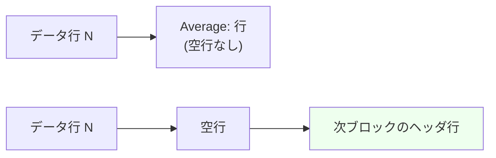

#### 9.2 行末空白

sar テキスト出力に行末空白が出るのは **A_PWR_USB で `manufacturer` と `product` が
両方空文字列の場合のみ**(`" %-23s"` のパディング + `" "` = 25 個の空白が残る)。
それ以外のすべての行は最後の文字が値の最終桁で終わる。

#### 9.3 `dish` — ヘッダ再表示の判定

`int dish = TRUE;`(`sar.c` のファイルスコープ変数、初期値 TRUE)。

`get_win_height()` (`common.c`):
```
rows = DEFAULT_ROWS                       // = SEC_PER_DAY = 3600*24 = 86400
if ioctl(STDOUT_FILENO, TIOCGWINSZ, &win) != -1 {
    if win.ws_row > 2 { rows = win.ws_row - 2 }
} else if let Some(e) = getenv("S_REPEAT_HEADER") {
    if e.chars().all(|c| c.is_ascii_digit()) {
        if let Ok(v) = e.parse::<i64>() { if v > 0 { rows = v as i32 } }
    }
}
return max(rows, MIN_ROWS /* = 1 */)
```

> **注意**: `S_REPEAT_HEADER` は **ioctl が失敗したとき (= stdout が端末でない) しか
> 参照されない**(`else if`)。端末上では常に `ws_row - 2` が使われる。
> また `ws_row <= 2` の端末では `S_REPEAT_HEADER` も見ずに 86400 になる。

##### ファイル読み込みモード (`sar -f`)

```
rows = get_win_height()                  // read_stats_from_file() 冒頭で 1 回
// handle_curr_act_stats() は「アクティビティ × 出力」ごとに呼ばれ、lines = 0 から開始
loop {
    read record header
    if lines >= rows || lines == 0 { lines = 0; dish = TRUE } else { dish = FALSE }
    ... 表示 ...
    if displayed { lines += if inc != 0 { inc } else { act[p].nr[curr] } }
    // COMMENT 行は lines != 0 のときだけ lines += 1
}
if davg > 0 { write_stats_avg(...) }     // dish は最後のループ反復で設定された値のまま
```
`inc` = ビットマップを持つアクティビティでは `count_bits(bitmap)`、それ以外は 0
(= アイテム数 `nr[curr]` を使う)。

→ **stdout がパイプ/ファイルで `S_REPEAT_HEADER` 未設定の場合 `rows = 86400`**。
実用的には「各ブロックの先頭で 1 回だけヘッダが出て、`Average:` の前には出ない」
という挙動になる(これが `tests/expected.*` の状態)。

##### リアルタイムモード (`sar [interval] [count]`)

```
dis_hdr = check_line_hdr()
lines = rows = get_win_height()
loop {
    read sadc bunch
    if !dis_hdr { dish = lines / rows; if dish != 0 { lines %= rows } lines += 1 }
    write_stats(...)
}
dish = dis_hdr
if avg_count > 0 { write_stats_avg(...) }
```

`check_line_hdr()` (`sar.c`) の戻り値:
```
if get_activity_nr(act, AO_SELECTED, COUNT_OUTPUTS) > 1 { return TRUE }
// 選択が 1 つだけのとき:
最初に見つかった選択済みアクティビティについて
    bitmap があれば count_bits(bitmap) > 1 なら TRUE
    そうでなければ nr_ini > 1 なら TRUE
break（1 つ調べたら終了）
return rc
```

→ **`dis_hdr == TRUE`(複数出力、または複数アイテム)のとき `dish` は TRUE のまま
固定され、毎サンプルごとに全アクティビティのヘッダ行が再表示される**
(`sar -A 1 3` / `sar -u -r 1 3` の挙動)。`Average:` ブロックにもヘッダが付く。

→ `dis_hdr == FALSE`(単一出力・単一アイテム、例 `sar -w 1 5`)のときは
`rows` 行ごとにヘッダが出て、`Average:` の前にはヘッダが出ない。

##### ヘッダ条件がアクティビティごとに異なる点

`dispavg` は「平均出力かどうか」、`prev == 2` も同義(平均出力では `prev = 2` で呼ばれる)。

| # | 条件式 | 該当アクティビティ |
|---|---|---|
| A | `dish \|\| ((prev == 2) && DISPLAY_MINMAX(flags))` | A_PCSW, A_SWAP, A_PAGE, A_IO, A_NET_NFS, A_NET_NFSD, A_NET_IP, A_NET_EIP, A_NET_ICMP, A_NET_EICMP, A_NET_TCP, A_NET_ETCP, A_NET_UDP, A_NET_IP6, A_NET_EIP6, A_NET_ICMP6, A_NET_EICMP6, A_NET_UDP6, A_PSI_CPU, A_PSI_IO, A_PSI_MEM (21 件) |
| B | `dish \|\| (dispavg && DISPLAY_MINMAX(flags))` | A_MEMORY(RAM / swap の両ブロック), A_KTABLES, A_QUEUE, A_NET_SOCK, A_NET_SOCK6, A_HUGE (6 件) |
| C | `dish && !((prev == 2) && DISPLAY_MINMAX(flags))` | A_CPU, A_PWR_FREQ, A_NET_FC, A_PWR_BAT (4 件) |
| D | `dish && !(dispavg && DISPLAY_MINMAX(flags))` | A_PWR_CPU, A_PWR_FAN, A_PWR_TEMP, A_PWR_IN (4 件) |
| E | `(dish \|\| DISPLAY_ZERO_OMIT(flags)) && !((prev == 2) && DISPLAY_MINMAX(flags))` | A_SERIAL, A_DISK, A_NET_DEV, A_NET_EDEV, A_NET_SOFT (5 件) |
| F | `(dish \|\| DISPLAY_ZERO_OMIT(flags)) && !(dispavg && DISPLAY_MINMAX(flags))` | A_FS (1 件) |
| G | `!((prev == 2) && DISPLAY_MINMAX(flags))` — **`dish` を見ない = 常に表示** | **A_IRQ** (1 件) |
| H | `dish`(`print_hdr_line()` を使わず手書き) | A_PWR_USB (1 件) |

合計 21+6+4+4+5+1+1+1 = **43**。

A 群 / B 群 は `dish` が偽でも `-x` の平均出力ではヘッダ (`Summary:`) を出す。
C〜F 群は逆に `-x` の平均出力ではヘッダを出さない(`print_*_xstats()` 側が
アイテムごとに `Summary:` ヘッダを出し直すため)。

要点 2 つ:
1. **A_IRQ は `dish` を無視して毎回ヘッダを出す**(CPU の online/offline で列構成が変わるため)。
   → `Average:` ブロックも空行 + `Average:` ヘッダ行から始まる。
2. **`-z`(`DISPLAY_ZERO_OMIT`)を付けると A_SERIAL / A_DISK / A_NET_DEV / A_NET_EDEV /
   A_NET_SOFT / A_FS はサンプルごとに必ずヘッダを出す**(行がスキップされて
   対応が取れなくなるのを防ぐため)。

---

### 10. 期待値ファイル (`tests/expected.*`) との照合

#### 10.1 期待値の生成条件

`do_test` は `-DTEST -DPRE_TESTDIR=...` でシミュレーションビルドし、
`tests/` 配下の数字名スクリプトを順に `/bin/sh` で実行して `diff -u` する。
**全テストが `LC_ALL=C TZ=GMT` で走る**ため、`%X` == `%H:%M:%S`(8 文字)、
日付は `MM/DD/YY`。stdout はリダイレクトされるので **色なし・`rows = 86400`**。

| 期待値ファイル | 生成コマンド |
|---|---|
| `expected.data-11.6.5` | `sadf -c tests/data-11.6.5 > …tmp` → `sar -C -A -f …tmp` |
| `expected.data-10.3.1` | `sadf -c tests/data-10.3.1 > …tmp` → `sar -C -A -f …tmp` |
| `expected.data-12.0.0` | `sar -AC -f tests/data-12.0.0`(変換不要) |
| `expected.data-9.1.6` | `sadf -c tests/data-9.1.6 > …tmp` → `sar -C -A -f …tmp` |
| `expected.data-extra-12.1.7` | `sar -A -f tests/data-extra-12.1.7` |
| `expected.sar-human` | `sar --human -A -f tests/data.tmp` |
| `expected.sar-dec` | `sar --dec=0 -A -f tests/data.tmp` |
| `expected.sar-pretty` | `sar --pretty -d -f tests/data.tmp` |
| `expected.sar-z` | `sar -f tests/data.tmp -e 13:30 -z -n DEV -dp` |
| `expected2.sar-x2` | `sar -xzh -n DEV -d -u -P ALL -q ALL -f tests/data.tmp` |
| `expected.sar-ix` | `sar -i 60 -x -uw -P ALL -f tests/data.tmp` |
| `expected.sar-m-freq` | `sar -f tests/data-wghfreq.tmp -m FREQ -P ALL` |
| `expected.sar-I` | `sar -I --int=0,3,30-50,4000-,LOC,PWD,MCE-XXX,TLB,sum -P all,3 --pretty -f tests/data.tmp` |
| `expected.sar-A` | `sar -BbdFHSvWwy -I ALL -m CPU,FREQ,USB -n ALL -q ALL -r ALL -u ALL 1 2`(リアルタイム) |
| `expected2.sar-all` | `sar -A -f tests/data.tmp` |

**`-t` を使うプレーンテキスト sar の期待値ファイルは存在しない**
(`-t` は sadf のフィクスチャのみ)。`-t` は時刻の値を変えるだけで幅/書式は変えない。

#### 10.2 バナー・特殊行(抜粋、`tests/expected.data-11.6.5`)

```
Linux 4.17.18-200.fc28.x86_64 (linux.home) 	08/29/18 	_x86_64_	(8 CPU)

09:33:38     LINUX RESTART	(8 CPU)
09:34:30     COM Hello, world!
```

`(linux.home)` の直後に**空白 1 個 + タブ**、`08/29/18` の直後にも**空白 1 個 + タブ**、
`_x86_64_` の直後は**タブのみ**。`LINUX RESTART` / `COM` は 14 桁目開始。
`LINUX RESTART` と `(8 CPU)` の間はタブ。

#### 10.3 列幅の実測照合

`tests/expected.data-11.6.5` の A_CPU ブロック(行 6〜8、行末に空白なし):

```
09:33:48        CPU      %usr     %nice      %sys   %iowait    %steal      %irq     %soft    %guest    %gnice     %idle
09:34:34        all      0.47      0.00      0.55      0.08      0.00      0.13      0.03      0.00      0.00     98.75
09:34:34          0      0.55      0.00      0.24      0.13      0.00      0.04      0.02      0.00      0.00     99.02
Average:        all      0.47      0.00      0.55      0.08      0.00      0.13      0.03      0.00      0.00     98.75
```

| フィールド | 終端桁 | 幅 | 導出 |
|---|---|---|---|
| timestamp / `Average:` | 11 | 11 | `%-11s` |
| `CPU` | 19 | 8 | `" %7s"` / `" %s"`+`"    all"` / `" %7d"` |
| `%usr` … `%idle` (各列) | 29, 39, …, 119 | 各 10 | `" %9.2f"` |

行長 = 11 + 8 + 10×10 = **119** ✔(§3 の擬似コードによる算出と一致)。

A_DISK(行長 101)、A_NET_DEV(行長 101)、A_MEMORY `-r ALL`(行長 181)、
A_PAGE(行長 111)も `11 + 10×列数` で一致。
A_MEMORY 短縮形 `-r` は `kbshmem` で終わり行長 **131**。

**§3 の擬似コードで生成したヘッダ行は、全 43 アクティビティについて
`tests/expected.*` の対応行とバイト単位で一致した。**

#### 10.4 `Average:` / `Summary:` / `Last:` の実測

ファイルモードでは `dish` が偽なので、ほとんどのブロックで `Average:` 行の前に
**ヘッダも空行も入らない**:

```
09:34:34      4066192   5791704   2354884     28.91    183296   1486360   7907476     31.73 …
Average:      4066192   5791704   2354884     28.91    183296   1486360   7907476     31.73 …
```

A_IRQ だけは例外で、`Average:` が独立ブロック(空行 + `Average:` ヘッダ行)になる:

```
09:34:34           19     42.29

Average:         INTR       all
Average:          sum   7877.17
Average:            0      0.00
```

A_PWR_USB と A_FS は `Summary:`:

```
09:33:48        BUS  idvendor    idprod  maxpower manufact                product
09:34:34          2       58f      6362       500 Generic                 Mass Storage Device
Summary:          2       58f      6362       500 Generic                 Mass Storage Device
09:33:48     MBfsfree  MBfsused   %fsused  %ufsused     Ifree     Iused    %Iused FILESYSTEM
09:34:34        19832      9569     32.55     37.70   1666005    255355     13.29 /dev/sda9
Summary:        19832      9569     32.55     37.70   1666005    255355     13.29 /dev/sda9
```

`-x` 併用時は `Summary:` ヘッダ + `Minimum:` + `Maximum:` + `Average:` の 4 行組
(`tests/expected.sar-ix`):

```
Summary:        CPU     %user     %nice   %system   %iowait    %steal     %idle
Minimum:          7      1.86      0.00      0.93      0.02      0.00     86.63
Maximum:          7      7.81      0.00      5.24      0.36      0.00     97.19
Average:          7      3.36      0.00      1.92      0.18      0.00     94.54
```

#### 10.5 `--human` の実測 (`tests/expected.sar-human`)

```
13:20:19        all      2.1%     12.5%      1.8%      0.1%      0.0%      0.3%      0.2%      0.0%      0.0%     82.9%
13:20:19         1.4G      4.2G      3.6G     46.1%    254.1M      2.7G     11.5G     48.5%      3.9G      1.7G    396.0k     85.9M …
13:20:19          sda      0.00      0.0k      0.0k      0.0k      0.0k      0.00      0.00      0.0%
13:20:19           lo      0.00      0.00      0.0B      0.0B      0.00      0.00      0.00      0.0%
13:20:19       705.2M    144.8M     17.0%     18.9%   6008414    102818      1.7% /dev/sda9
```

確認できる点:
- **列幅はすべて 10 桁で不変**(`%` も単位文字も `wi` の内側に入る)。
- `cprintf_unit` の小数桁は `dplaces_nr` 未指定 (-1) で **1 桁**(`1.4G`, `396.0k`)。
- `NO_UNIT` の列(`tps`, `rxpck/s`, `aqu-sz`, `await`, `Ifree`, `Iused`)は
  `--human` でも**単位なし・2 桁小数のまま**。
- A_NET_DEV の `rxkB/s` は `unit = UNIT_BYTE` なので `0.0B`(バイト起点)。
  A_DISK の `rkB/s` は `unit = UNIT_KILOBYTE` なので `0.0k`。
- A_FS の `MBfsfree` は `unit = UNIT_BYTE` + `wd = 0` → `705.2M`。
- `%cap` は `100%`(`wd=0` → human で `" %8.0f%%"`)。

#### 10.6 `--dec=0` の実測 (`tests/expected.sar-dec`)

```
13:20:19        all         2        12         2         0         0         0         0         0         0        83
13:20:19      1437740   4389516   3755444        46    260172   2821596  12097852        49   4042384   1772396 …
13:20:19          sda         0         0         0         0         0         0         0         0
13:20:19          sum     31915      5760     11829      2991      1027      2953      5881      4899       587
13:20:19            0       100        +0         ↑
```

`--dec=0` でも**幅は 10 桁で不変**。`cap/min` は `sign = TRUE` なので `+0`。
整数列(`kbmemfree` 等の `cprintf_u64`)は元々整数なので変化なし。

#### 10.7 `--pretty` / `-z` の実測

```
13:20:09          tps     rkB/s     wkB/s     dkB/s   areq-sz    aqu-sz     await     %util DEV
13:20:19         0.00      0.00      0.00      0.00      0.00      0.00      0.00      0.00 sda
```

アイテム列が行末へ移り、`" %s"` なので**パディングなし**。
`-z` では加えて全ゼロ行がスキップされ、**インターバルごとにヘッダが再表示**される。

#### 10.8 行末空白の実測

`tests/expected.data-11.6.5` で行末に空白があるのは A_PWR_USB の
`manufacturer` / `product` が両方空の行だけ(4 行)。`cat -et` で確認すると
**25 個の空白 + 行末**、行長 74 バイト:

```
09:34:34          2      8087        24         0                         $
Summary:          2      8087        24         0                         $
```

#### 10.9 ソースと期待値の食い違い / 未検証事項

| 項目 | 状況 |
|---|---|
| ロケール依存タイムスタンプ (`%X` が 11 文字になるケース) | `tests/` に AM/PM 表記のフィクスチャが**存在しない**ため実測未確認。`%-11s` なのでパディング 0 になり、次列との空白が 1 個だけになると推定。**要検証** |
| `S_TIME_FORMAT=ISO` の効果 | `tests/expected.sar-ISO` で確認できるのは**バナーの日付が `2019-04-18` になること**のみ。時刻列は `LC_ALL=C` では ISO でも非 ISO でも `HH:MM:SS` で同一。**要検証**(非 C ロケール時の差分) |
| `A_PWR_BAT` の `bat_id` / `capacity` が `char` であること | x86_64 Linux では符号付き。`char` が符号なしの ABI(ARM 既定など)では sysstat 自身の `cap/min` が巨大な正値になるはず。`tests/` は x86_64 前提。**要検証** |
| `A_IRQ` の `Average:` ブロックが常にヘッダを持つ | `tests/expected.data-11.6.5` で確認済み ✔ |
| `A_PWR_BAT` の `%cap` が瞬時値 0 桁 / 平均 2 桁 | `tests/expected2.sar-all` の `100` と `80.50` で確認済み ✔ |
| `%memused` / `%commit` の平均が整数除算 | ソース上は確定。`tests/` の値は `tlmkb` が一定かつ 1 サンプルのため差が出ず**実測では区別できない**。**要検証** |
| `A_NET_FC` に `-z` 処理が無い | ソース上確定。`tests/` に FC + `-z` の組合せが無い。**要検証** |
| `S_REPEAT_HEADER` の効果 | `tests/` に該当テストが無い(`sar -V` の env ダンプにのみ登場)。**要検証** |

---

### 11. Rust 実装チェックリスト(頻出の落とし穴)

1. **1 列 = 「空白 1 個 + 右詰め 9 桁」= 10 桁**。区切り文字は無い。
   `cprintf_*` は値の前に必ず空白を 1 個出す。列幅を「9」と誤解すると全列が 1 桁ずれる。

2. **タイムスタンプ列は `%-11s`(左詰め 11 桁、切り詰めなし)**。
   `Average:` / `Summary:` / `Minimum:` / `Maximum:` はどれも 8 文字なので
   `HH:MM:SS` と同じ幅になる。`Last:` は 5 文字で空白 6 個が続く。

3. **ヘッダ行のタイムスタンプは「1 つ前のサンプル」の時刻**(`timestamp[!curr]`)。
   データ行は現サンプル(`timestamp[curr]`)。

4. **すべてのヘッダ行と `LINUX RESTART` 行は先頭に `\n` を出す**(= 直前に空行)。
   `COM` 行とデータ行と `Minimum:`/`Maximum:` 行は出さない。
   → ヘッダが省略されるとブロック境界の空行も消える。

5. **`--dec=` は `wd > 0` の列にしか効かない**。`wd == 0`(平均の整数系ゲージ)には無効。
   また `--dec=` は幅を変えない(`wi` は据え置き)。

6. **`--human`(`DISPLAY_UNIT`)も幅を変えない**。`cprintf_xpc` は `wi -= 1` して
   `%` を 1 桁ぶん確保し、`cprintf_unit` は `wi - 1` 桁 + 単位 1 文字で合計 `wi + 1`。

7. **`cprintf_unit` の小数桁は `dplaces_nr ? 1 : 0`**。`dplaces_nr` の既定値は
   **`-1`**(未指定)であり C では真なので **既定は 1 桁**。`--dec=0` のときだけ 0 桁。

8. **`unit == UNIT_SECTOR`(0) のときは `cprintf_unit` 内で値を 2 で割って kB にする**。
   ただし sar のテキスト出力で `UNIT_SECTOR` を渡す箇所は無い(A_DISK は呼び出し側で
   既に `/2` 済み、`unit = UNIT_KILOBYTE`)。

9. **A_NET_DEV の `rxkB/s` / `txkB/s` は `--human` 無しのときだけ `/1024`**。
   `--human` 時はバイト毎秒を渡すため列名(`kB/s`)と実際の単位が食い違う。

10. **`itv` が 0 なら 1 に補正**(`get_interval()`)。CPU 系は `deltot_jiffies` が 0 の場合、
    CPU "all" は 1 に補正し、個別 CPU は「tickless」として `0.00`+`%idle=100.00` を出す。

11. **CPU 系で負値になり得る差分は `ll_sp_value()` で 0.0 にクランプ**。
    A_IO は 7 列すべてに明示クランプ、A_IRQ は「全 CPU 合計」列のみクランプ、
    A_PAGE / SNMP 系にはクランプが**無い**(負値が出る)。

12. **`%memused` / `%commit` の `Average:` は整数除算 `(avg / count)` を経由する**が、
    同じ行の `kbavail` / `kbcommit` は浮動小数除算。`%swpused` / `%swpcad` / `%hugused` は
    浮動小数除算。この非対称性を再現しないと 1/100 の桁で差が出る。

13. **`A_PWR_BAT` の `%cap` は瞬時値 `wd=0` / 平均 `wd=2`**。
    `status` 列は平均行では出力されない。

14. **`printf` の幅指定はバイト単位**。A_PWR_BAT の `status`(UTF-8 3 バイトの矢印)を
    `" %11s"` で出すため、Rust の `{:>11}`(文字数基準)では 2 バイト分ずれる。
    **バイト長でパディングする独自実装が必要**。

15. **アイテム名列の書式はアクティビティごとに固定**:
    - 8 桁: A_CPU (`" %s"`+`"    all"` / `" %7d"`), A_NET_SOFT(同), A_PWR_CPU (`"%s"`+`"     all"` / `"%s"`+`"     %3d"`), A_PWR_FREQ (`"%s"`+`"     all"` / `"     %3d"`)
    - 10 桁: A_IRQ (`" %9s"`), A_DISK / A_NET_DEV / A_NET_EDEV (`" %9s"`), A_SERIAL (`"       %3d"`), A_PWR_FAN / A_PWR_TEMP / A_PWR_IN / A_PWR_BAT (`"     %5d"`)
    - 8 桁: A_PWR_USB (`"  %6d"`)
    - 行末(幅なし): `--pretty` 時の A_IRQ / A_DISK / A_NET_DEV / A_NET_EDEV、常に A_FS / A_NET_FC / A_PWR_FAN / A_PWR_TEMP / A_PWR_IN の `DEVICE`

16. **番号の起点が揃っていない**: A_PWR_FAN / A_PWR_TEMP は `i + 1`、**A_PWR_IN は `i`**。
    A_CPU / A_NET_SOFT / A_PWR_CPU / A_PWR_FREQ は `i - 1`(`i == 0` は `all`)。
    A_SERIAL は構造体の `line` 値、A_PWR_BAT は `bat_id` 値。

17. **`-P ALL` は CPU ビットマップを全ビット 1 にするので bit 0 (= `all`) も含む**。
    `-P all`(小文字)は `all` 行だけ。ビット `N+1` が CPU `N`。
    このビットマップは A_CPU / A_IRQ / A_PWR_CPU / A_PWR_FREQ / A_NET_SOFT の 5 つで共有。

18. **`-A` は `-u ALL` + `-r ALL -S` + `-F` + (`-P` 未指定なら) `-P ALL` を強制**する。
    A_CPU と A_FS は `|=` ではなく `=`(代入)なので既存の `opt_flags` が消える。

19. **出力順はモードで異なる**: リアルタイムは `act[]` 配列順、
    ファイル読み込みは**データファイルのアクティビティリスト順**(`id_seq[]`)。
    `tests/expected.data-9.1.6` では A_HUGE が末尾に来る(ファイル側の順序)。

20. **ファイルモードではアクティビティごとにファイルを読み直す**ので、
    `COM` 行と `LINUX RESTART` 行はブロック数だけ繰り返し出力される。

21. **`A_PWR_USB` は `print_hdr_line()` を使わない**(手書きヘッダ)。
    `activity.c` の `hdr_line` は sadf 専用。

22. **`A_FS` / `A_PWR_USB` は平均を取らない**。`Summary:` は「最後に観測した値」の再掲。
    `A_FS` は `-x` 併用時のみラベルが `Last:` になる。

23. **色 (SGR) は stdout が tty でなければ一切出ない**。`S_COLORS=always` で強制可。
    値のゼロ判定(色分けの閾値)は数値には影響しないが、`lim` の値
    (`wd == 1` なら 0.05、それ以外 0.005)は把握しておくとテストが書きやすい。

24. **`%9.2f` の丸めは C の `printf` と同じ最近接偶数丸め (round-half-to-even)**。
    Rust の `format!("{:.2}")` も同じ丸めだが、`f64` の中間表現が一致していることが前提。
    計算順序(`(n - m) as f64 / itv * 100.0`)をソースどおりに保つこと。
    特に `S_VALUE` は「差を先に整数で取り、その後 f64 化」する。

25. **`A_IRQ` / `A_PWR_FREQ` は `AO_MATRIX`**。バッファのレイアウトは
    A_IRQ が `buf[c * msize * nr2 + i * msize]`(CPU 主、割込副)、
    A_PWR_FREQ が `buf[i * msize * nr2 + k * msize]`(CPU 主、周波数副)。
    A_IRQ は「行 = 割込、列 = CPU」に転置して表示する。

26. **`A_PWR_FREQ` の `freq / 1000` は整数除算**(kHz → MHz の切り捨て)。

---

## 第 IV 部 — タイムスタンプ / 単位 / グローバルヘッダ / --pretty


対象: sysstat v12.8.0 (+7 commits, `v12.8.0-7-g5443f771`) の `sar` / `sadf` テキスト系出力。
以下はすべてソース (`common.c` / `common.h` / `sa_common.c` / `sa.h` / `sar.c` / `sadf.c` /
`sadf_misc.c` / `pr_stats.c` / `pr_xstats.c` / `format.c` / `sadc.c`) と `tests/` の期待値ファイルから
確認した挙動である。Rust 実装でバイト一致を狙う場合、**書式文字列とフィールド幅をそのまま移植する**のが
唯一確実な方法になる。

---

## 1. タイムスタンプ

### 1.1 書式マクロと環境変数の一覧

| 名前 | 定義値 | 定義場所 | 用途 |
|---|---|---|---|
| `DATE_FORMAT_ISO` | `"%Y-%m-%d"` | `common.h` | グローバルヘッダの日付 (ISO 時) |
| `DATE_FORMAT_LOCAL` | `"%x"` | `common.h` | グローバルヘッダの日付 (既定) |
| `DEFAULT_ERROR_DATE` | `"?/?/?"` | `common.h` | `strftime()` が 0 を返したときの日付 |
| `DATE_TIME_FORMAT_ISO` | `"%FT%T%z"` | `common.h` | **iostat 系のみ** (`write_sample_timestamp()`) |
| `DATE_TIME_FORMAT_LOCAL` | `"%x %X"` | `common.h` | **iostat 系のみ** (`write_sample_timestamp()`) |
| `TIMESTAMP_LEN` | `64` | `common.h` | タイムスタンプ文字列バッファ長 |
| `ENV_TIME_FMT` | `"S_TIME_FORMAT"` | `common.h` | 値が `"ISO"` のとき ISO 表記 |
| `ENV_TIME_DEFTM` | `"S_TIME_DEF_TIME"` | `common.h` | 値が `"UTC"` のとき「現在時刻」を UTC で取る |
| `K_ISO` / `K_UTC` | `"ISO"` / `"UTC"` | `common.h` | 上記の比較値 (完全一致・大文字小文字は区別する) |
| `DEF_TMSTART` | `"08:00:00"` | `sa.h` | `-s` に引数が無いときの既定 |
| `DEF_TMEND` | `"18:00:00"` | `sa.h` | `-e` に引数が無いときの既定 |

### 1.2 3 つの独立したレンダリング経路 (最初に把握すべき点)

sysstat には時刻文字列を作る関数が **3 系統** あり、担当コマンドが分かれている。
混同すると `"%x %X"` を `sar` に持ち込むという誤りを犯す。

| 関数 | 定義 | 使うコマンド | 備考 |
|---|---|---|---|
| `set_record_timestamp_string()` | `sa_common.c` | **`sar` / `sadf`** | 本ドキュメントの主対象 |
| `set_report_date()` → `print_gal_header()` | `common.c` | `sar` / `sadf` / iostat 系 | **日付のみ** (グローバルヘッダ用) |
| `write_sample_timestamp()` | `common.c` | `iostat` / `cifsiostat` / `tapestat` のみ | `"%x %X"` / `"%FT%T%z"` / epoch 秒 |

`astro-sight refs --name write_sample_timestamp` の結果は `cifsiostat.c` / `iostat.c` /
`tapestat.c` のみ。**`sar` と `sadf` は `write_sample_timestamp()` を一切呼ばない。**

### 1.3 既定のタイムスタンプ表記 — `%X` か `"%H:%M:%S"` か

`set_record_timestamp_string(l_flags, cur_date, cur_time, len, rectime)` の擬似コード:

```
if PRINT_SEC_EPOCH(l_flags) and cur_date != NULL:
    cur_time = decimal(rectime.epoch_time)      # "%llu"
    cur_date = ""                               # 空文字列
else:
    if cur_date != NULL:
        cur_date = strftime("%Y-%m-%d", rectime.tm_time)   # ← ISO 固定。S_TIME_FORMAT の影響を受けない
    if USE_PREFD_TIME_OUTPUT(l_flags):
        cur_time = strftime("%X", rectime.tm_time)         # ロケール依存 (AM/PM になり得る)
    else:
        cur_time = strftime("%H:%M:%S", rectime.tm_time)   # 固定 24 時間表記
```

`S_F_PREFD_TIME_OUTPUT` (`0x00008000`) を立てるのは **`sar.c` の 1 箇所だけ**:

```
# sar.c, オプション解析完了後
if not is_iso_time_fmt():
    flags |= S_F_PREFD_TIME_OUTPUT
```

したがって:

| コマンド | `S_TIME_FORMAT` | タイムスタンプ書式 |
|---|---|---|
| `sar` | 未設定 / `ISO` 以外 | **`"%X"`** (ロケールの推奨時刻表記。`en_US` 等では `01:20:19 PM`) |
| `sar` | `ISO` | `"%H:%M:%S"` |
| `sadf` (全フォーマット) | 何であっても | **常に `"%H:%M:%S"`** (`sadf` はこのフラグを立てない) |

テストは `LC_ALL=C` で走るため `%X` == `"%H:%M:%S"` に退化しており、期待値ファイルだけを見ると
差が見えない (`tests/00180` が `S_TIME_FORMAT=ISO` を使うが `LC_ALL=C` なので時刻部分は同一)。
**Rust 実装で `%X` を無条件に `"%H:%M:%S"` へ畳み込むと、非 C ロケールで `sar` の出力が
本家と食い違う**ので注意。

#### `is_iso_time_fmt()` のキャッシュ挙動

```
static is_iso = -1
if is_iso < 0:
    e = getenv("S_TIME_FORMAT")
    is_iso = (e != NULL and e == "ISO")   # strcmp による完全一致
return is_iso
```

プロセス内で 1 回だけ評価してキャッシュする。`"iso"` / `"ISO8601"` は不一致 = FALSE。

#### `S_TIME_DEF_TIME=UTC` の役割 (誤解しやすい)

`S_TIME_DEF_TIME` は **出力の表示タイムゾーンを変えない**。効果は `get_time()` 経由の
「現在時刻の取得」だけである。

```
get_time(rectime, d_off):
    static utc = 0
    if utc == 0:                        # 初回のみ環境変数を読む
        e = getenv("S_TIME_DEF_TIME")
        if e != NULL: utc = (e == "UTC") ? 1 : 0
        utc += 1                        # 以降 1 (=local) または 2 (=UTC)
    return get_xtime(rectime, d_off, utc == 2)

get_xtime(rectime, d_off, utc):
    timer = time(NULL) - 86400 * d_off          # SEC_PER_DAY = 3600*24
    rectime = utc ? gmtime_r(timer) : localtime_r(timer)
    return timer                                 # 戻り値は常に UTC epoch 秒
```

具体的な影響:

* `sadc` が sa ファイルに書く `record_header.hour/minute/second` と
  `file_header.sa_day/sa_month/sa_year` が UTC 基準になる (`sadc.c`)。
  → 結果として `sar -t` / `sadf -t` の表示が UTC になる。
  一方 `file_header.sa_tzname` は `tzset()` 後の `tzname[0]`、すなわち**ローカル TZ 名**が
  入るので、`S_TIME_DEF_TIME=UTC` 環境では「時刻は UTC なのにラベルはローカル TZ 名」という
  不整合が生じる (要検証: 意図的か不具合かは不明)。
* 既定のデイリーデータファイル (`saDD`) の日付決定が UTC 基準になる。
* **表示側 (`sar`/`sadf` の各レコードのタイムスタンプ) には一切影響しない。**
  表示は `record_header.ust_time` に `gmtime_r()` / `localtime_r()` を適用して決まる。

### 1.4 時刻の基準系 — `sar` と `sadf` で既定が逆

`sa_get_record_timestamp_struct()` の擬似コード:

```
sa_get_record_timestamp_struct(l_flags, record_hdr, rectime):
    t = record_hdr.ust_time            # UTC epoch 秒
    rectime.epoch_time = t

    if not PRINT_LOCAL_TIME(l_flags) and not PRINT_TRUE_TIME(l_flags):
        rectime.tm_time = gmtime_r(t)              # UTC
    else:
        rectime.tm_time = localtime_r(t)           # 読み手のローカル時刻
        rectime.tm_time.tm_gmtoff = TRUE           # = 1 (秒)。%z 用途のみで sar/sadf では未使用

    if PRINT_TRUE_TIME(l_flags):
        # 日付は localtime_r 由来のまま、時分秒だけを記録値で上書きする
        rectime.tm_time.tm_hour = record_hdr.hour
        rectime.tm_time.tm_min  = record_hdr.minute
        rectime.tm_time.tm_sec  = record_hdr.second
```

既定フラグ:

| コマンド | 初期 `flags` | 既定の基準系 |
|---|---|---|
| `sar` | `sar.c`: `uint64_t flags = S_F_LOCAL_TIME;` | **読み手のローカル時刻** |
| `sadf` | `S_F_LOCAL_TIME` なし | **UTC** |

`tests/expected.sadf-d-tz` (作成 TZ=`Europe/Paris`、読み出し TZ=`America/New_York`):

```
SYSSTAT.TEST;31;2019-04-18 13:20:19 UTC;-1;2.15;12.50;2.36;0.12;0.00;82.88
```

### 1.5 `sar -t` / `sadf -t` (記録時のタイムゾーンを使う)

`-t` = `S_F_TRUE_TIME` (`0x00000020`)。`sar` では `parse_sar_opt()` の `case 't'` で
(`caller == C_SAR` のときのみ) 立つため `-rtu` のように他オプションと連結できる。
`sadf` では `--` より前の単独オプションとして解析される。

**実際に起きること (重要):**

1. **`TZ` 環境変数の再設定は一切行われない。** ソース全体で `setenv` / `putenv` の使用は無く、
   `tzset()` の呼び出しは `sadf.c`(`-T` 用) と `sadc.c`(ヘッダ書き込み用) の 2 箇所だけ。
2. 時分秒は `record_header` に**記録時点で焼き込まれた** `hour`/`minute`/`second`
   (`unsigned char`) をそのまま使う。これは `sadc` が `get_time()` で得た broken-down time の
   `tm_hour`/`tm_min`/`tm_sec`、すなわち **記録側ホストのローカル時刻**。
3. 日付部分は `localtime_r(ust_time)` (=読み手 TZ) の結果を使い続ける。
   → 記録側と読み手の TZ がずれていて日付境界を跨ぐ場合、**「読み手 TZ の日付 + 記録側 TZ の時刻」という
   混成の値**になる。これは既知のワートで、修正されていない。
4. `file_header.sa_tzname` は**ラベル文字列としてのみ**使われる。時刻の再解釈には使わない。

出力の見え方:

| 出力形態 | `-t` のときのタイムゾーンラベル |
|---|---|
| `sar` テキスト | ラベルなし (時刻のみ)。`sar` は `sa_tzname` を一切表示しない |
| `sadf` 既定 (ppc, `-p`) / `-d` / `-r` | `file_hdr.sa_tzname` (空文字列ならラベル省略) |
| `sadf -x` | `<timestamp ... tz="<sa_tzname>" ...>` |
| `sadf -j` | `"timestamp": {..., "tz": "<sa_tzname>", ...}` |
| `sadf -l` (PCP) | `-t` は `FO_NO_TRUE_TIME` により**無効化される** |

`tests/expected.sadf-d-t-tz` (記録 TZ=`Europe/Paris` → `tzname[0]`=`"CET"`):

```
SYSSTAT.TEST;31;2019-04-18 15:20:19 CET;-1;2.15;12.50;2.36;0.12;0.00;82.88
```

`sa_tzname` (`sa.h`: `char sa_tzname[TZNAME_LEN]`、`TZNAME_LEN` = 8) が空のとき
(このフィールドは sysstat 12.2.0 で追加されたため、それより古いデータファイルや
`sadf -c` 変換ファイルでは空になる) は、`print_dbppc_timestamp()` /
`print_raw_timestamp()` の条件式によりラベルが付かない:

```
if len(cur_date) > 0 and (not TRUE_TIME or (TRUE_TIME and len(sa_tzname) > 0)):
    pre = "<host><sep><itv><sep><date> <time> <tzlabel>"
else:
    pre = "<host><sep><itv><sep><date> <time>"          # ラベル省略
```

`tzlabel` の選択順は全フォーマット共通で:

```
PRINT_LOCAL_TIME ? my_tzname : (PRINT_TRUE_TIME ? file_hdr.sa_tzname : "UTC")
```

#### `-t` はグローバルヘッダの日付も変える

`get_file_timestamp_struct()`:

```
if PRINT_TRUE_TIME(flags):
    tm_time = get_time(now, 0)            # 既定値を埋めるためだけに現在時刻を使う
    tm_time.tm_mday = file_hdr.sa_day     # unsigned char
    tm_time.tm_mon  = file_hdr.sa_month   # unsigned char (tm_mon と同じ 0..11)
    tm_time.tm_year = file_hdr.sa_year    # int (tm_year と同じ 西暦-1900)
    tm_time.tm_hour = tm_time.tm_min = tm_time.tm_sec = 0
    mktime(tm_time)                       # DST フラグ/tm_wday/tm_yday を正規化するため
else:
    tm_time = localtime_r(file_hdr.sa_ust_time)
```

### 1.6 `sadf` の `-T` / `-t` / `-U` (`--utc` は存在しない)

**`--utc` という長オプションは v12.8.0 のソースにも man ページにも存在しない** (grep で 0 件)。
また `-T` は「epoch 秒」ではなく「ローカル時刻」である。正しい対応は以下。

| オプション | フラグ | 意味 | 表示 |
|---|---|---|---|
| (なし) | — | **UTC** (`sadf` の既定) | `2019-04-18 13:20:19 UTC` |
| `-T` | `S_F_LOCAL_TIME` | **読み手のローカル時刻** | `2019-04-18 15:54:09 CET` (ラベル = `tzname[0]`) |
| `-t` | `S_F_TRUE_TIME` | 記録側のローカル時刻 (1.5 参照) | `2019-04-18 15:20:19 CET` (ラベル = `sa_tzname`) |
| `-U` | `S_F_SEC_EPOCH` | **epoch 秒 (UTC)** | `1555593639` (日付欄は空、TZ ラベルも無し) |

`-T` / `-t` / `-U` は相互排他で、2 つ以上指定すると `usage()` で終了する。

`-T` のラベル生成 (`sadf.c`, オプション解析後):

```
if PRINT_LOCAL_TIME(flags):
    tzset()
    my_tzname = tzname[0]
```

**`tzname[0]` は「標準時側」の略称**である。夏時間中でも `tzname[1]` (`CEST`/`EDT`) は使われない。
`tests/expected.sadf-T-s-epoch` (`TZ="Europe/Paris"`, epoch 1555595349 = 2019-04-18 13:49:09 UTC):

```
SYSSTAT.TEST;-1;2019-04-18 15:54:09 CET;LINUX-RESTART	(10 CPU)
```

時刻は CEST(UTC+2) で計算されているが、ラベルは `CET` になっている。これは仕様どおり。

> 要検証: `tests/expected.sadf-d-T-tz` / `expected.sadf-r-T-tz` / `expected.sadf-T-tz` は
> それぞれ対応する `-t` 版の期待値と同一内容であり、テストスクリプト
> (`tests/01905` は `| grep ":20:"` を通す) とも整合しない。この作業ツリーでは
> **`-T` 系の期待値ファイルが陳腐化している**とみられるため、`-T` の仕様判断は
> `expected.sadf-T-s-epoch` (整合している) とソースを根拠にしている。

`-U` を使ったときの `set_record_timestamp_string()` は `cur_date` を空文字列にするため、
db/ppc/raw の組み立てが「日付欄なし・TZ ラベルなし」の分岐に落ちる。
`tests/expected.sadf-U-se-epoch`:

```
SYSSTAT.TEST;39;1555593639;-1;2.66;23.20;2.27;0.17;0.00;71.70
```

注意: `-U` の分岐は `cur_date != NULL` のときにしか発動しない。`sar` は `cur_date` に `NULL` を
渡すため、この経路は `sadf` 専用である (`sar` に `-U` は無い)。

#### 出力フォーマットごとの受理表 (`format.c` + `check_format_options()`)

`check_format_options()` は、選択フォーマットが受理しないフラグを**黙って落とす**
(エラーにしない)。

| `sadf` フォーマット | `-H` | `-h` | `-T` | `-U` | `-t` |
|---|---|---|---|---|---|
| 既定 = ppc (`-p`) | ✗ | ✗ | ✓ | ✓ | ✓ |
| `-d` (db) | ✗ | **✓** | ✓ | ✓ | ✓ |
| `-x` (XML) | ✓ | ✗ | ✓ | ✗ | ✓ |
| `-j` (JSON) | ✓ | ✗ | ✓ | ✗ | ✓ |
| `-g` (SVG) | ✓ | ✗ | ✓ | ✗ | ✓ |
| `-r` (raw) | ✗ | ✗ | ✓ | ✓ | ✓ |
| `-l` (PCP) | ✓ | ✗ | ✓ | ✗ | **✗ (拒否)** |
| `-H` 単独 (header) | ✓ | ✗ | ✗ | ✗ | ✓(未使用) |
| `-c` (変換) | ✗ | ✗ | ✗ | ✗ | ✓(未使用) |

区切り文字は `rndr_stats.c` の `seps[] = {"\t", ";"}`。ppc は TAB、db は `;`。

### 1.7 `sar` テキスト出力のタイムスタンプ欄の幅

すべて **`printf("%-11s", ...)`** (左寄せ・最小幅 11)。以下の 6 箇所で同一。

| 呼び出し元 | 内容 |
|---|---|
| `print_hdr_line()` (`pr_stats.c`) | `printf("\n%-11s", p_timestamp)` — 先頭に改行 1 個 |
| 各 `print_*_stats()` (`pr_stats.c`) | `printf("%-11s", timestamp[curr])` |
| `print_minmax()` (`sa_common.c`) | `printf("%-11s", ismax ? "Maximum:" : "Minimum:")` |
| `print_sar_restart()` (`sar.c`) | `printf("\n%-11s", cur_time)` — 先頭に改行 1 個 |
| `print_sar_comment()` (`sar.c`) | `printf("%-11s", cur_time)` — 先頭改行なし |
| A_FS の平均行 (`pr_stats.c`) | `printf("%-11s", "Last:" or "Summary:" or timestamp[curr])` |

左端に来る文字列とその長さ:

| 文字列 | 長さ | 出現条件 |
|---|---|---|
| `HH:MM:SS` | 8 (→ 空白 3 でパディング) | 通常 |
| `%X` のロケール表記 | 可変 (`en_US` の `01:20:19 PM` はちょうど 11) | `sar` 既定 + 非 C ロケール |
| `Average:` | 8 | 平均行 |
| `Summary:` | 8 | `-x` 使用時のヘッダ行 / A_FS の集計行 |
| `Minimum:` / `Maximum:` | 8 | `-x` 使用時 |
| `Last:` | 5 (→ 空白 6) | `-F` + `-x` の最終値行 |

`Average:` が時刻と揃うのは「どちらも 11 桁に左寄せパディングされる」ため。
**`%X` が 11 文字を超えるロケールでは桁がずれる**(パディングが発生せず、後続フィールドの
先頭スペース 1 個しか区切りが無くなる)。

続くフィールドは `pr_stats.c` 内で例外なく

* 統計値: `" %9.2f"` / `" %9.0f"` / `" %9"PRIu64` (1 列 = 先頭スペース + 幅 9 = **10 桁**)
* 項目名 (DEV / IFACE / INTR): `" %9s"` (非 pretty) または `" %s"` (pretty、行末)
* 数値項目名 (CPU 番号など): `" %7d"` / `"  %6d"` / `"     %5d"` / `"     %3d"` / `"       %3d"`

`print_hdr_line()` のヘッダフィールドは `" %*s"` で `vwidth`(= 常に 9) または `iwidth`。
`tests/expected.data-11.6.5`:

```
09:33:48        CPU      %usr     %nice      %sys ...
09:34:34        all      0.47      0.00      0.55 ...
Average:        all      0.47      0.00      0.55 ...
```

`"09:33:48"`(8) + パディング 3 + `" "` + `"%7s"`→`"    CPU"` = 19 桁目に `CPU` が終わる。

#### 空行の出方

`print_gal_header()` が末尾に `\n` 1 個を出したあと、最初のアクティビティヘッダ
(`print_hdr_line()`) または RESTART 行が先頭に `\n` を出すことで**空行 1 行**が生じる。
COMMENT 行 (`print_sar_comment()`) は先頭改行を出さない。レポート末尾に追加の空行は出ない。

```
Linux 4.17.18-200.fc28.x86_64 (linux.home) 	08/29/18 	_x86_64_	(8 CPU)
                                                    ← print_sar_restart() の先頭 "\n"
09:33:38     LINUX RESTART	(8 CPU)
09:34:30     COM Hello, world!                      ← COMMENT は先頭改行なし
                                                    ← print_hdr_line() の先頭 "\n"
09:33:48        CPU      %usr ...
```

`LINUX RESTART` 行は `"\n%-11s"` + `"  LINUX RESTART\t(%u CPU)"` + `"\n"`。
空白が 5 個 (パディング 3 + リテラル 2) 入る点に注意。
COMMENT 行は `"%-11s"` + `"  COM %s"` + `"\n"`。

### 1.8 `-s` / `-e` の解析規則

`parse_timestamp(argv, opt, tse, def_timestamp, flags)` の擬似コード:

```
ok = FALSE
opt += 1                                        # ← 常に 1 進む
if argv[opt] != NULL and argv[opt] does not start with "-":
    switch len(argv[opt]):
        case 5:                                 # "hh:mm"
            if argv[opt][2] != ':': break       # 不正 → ok は FALSE のまま
            timestamp = argv[opt][0..5] + ":00"
            opt += 1; ok = TRUE
        case 8:                                 # "hh:mm:ss"
            if argv[opt][2] != ':' or argv[opt][5] != ':': break
            timestamp = argv[opt][0..8]
            opt += 1; ok = TRUE
        case 10:                                # epoch 秒 (10 桁固定)
            if strspn(argv[opt], "0123456789") == 10:
                timestamp = argv[opt][0..10]
                opt += 1
                return decode_epoch(timestamp, tse)
            break
if not ok:
    timestamp = def_timestamp[0..8]             # "08:00:00" / "18:00:00"
timestamp[8] = '\0'
return decode_timestamp(timestamp, tse)
```

`decode_timestamp()`:

```
timestamp[2] = timestamp[5] = '\0'              # 引数バッファを破壊的に書き換える
if strspn(timestamp,      DIGITS) != 2: return 1
if strspn(&timestamp[3],  DIGITS) != 2: return 1
if strspn(&timestamp[6],  DIGITS) != 2: return 1
tse.tm_hour = atoi(timestamp); tse.tm_min = atoi(&timestamp[3]); tse.tm_sec = atoi(&timestamp[6])
if not (0 <= hour <= 23 and 0 <= min <= 59 and 0 <= sec <= 59):
    tse.use = NO_TIME; return 1
tse.use = USE_HHMMSS_T; return 0
```

`decode_epoch()`:

```
tse.epoch_time = atol(timestamp)
if tse.epoch_time == 0:                          # "0000000000" もエラー扱い
    tse.use = NO_TIME; return 1
tse.use = USE_EPOCH_T; return 0
```

#### 受理される形と落とし穴

| 入力 | 結果 |
|---|---|
| `-s 13:20:20` | `13:20:20` (`USE_HHMMSS_T`) |
| `-s 13:20` | **`13:20:00`** に補完 |
| `-s 1555593629` | epoch 秒 (`USE_EPOCH_T`)。**桁数がちょうど 10 でなければ epoch と見なさない** |
| `-s` (引数なし) / `-s -u ...` | 既定 `08:00:00`。`opt` は 1 しか進まないので次のトークンは通常のオプションとして再解析される |
| `-e` (引数なし) | 既定 `18:00:00` |
| `-s 1:2:3` | 長さ 5 だが `[2] != ':'` → **既定 `08:00:00` になり、`1:2:3` は別トークンとして再解析され最終的に `usage()`** |
| `-s fo:ob:ar` | 長さ 8・区切り位置 OK → `decode_timestamp()` が桁チェックで失敗 → `usage()` |
| `-s fo:ob` | 長さ 5 → `"fo:ob:00"` → `decode_timestamp()` 失敗 → `usage()` |
| `-e foXobXar` | 長さ 8 だが区切り不正 → 既定 `18:00:00`。`foXobXar` はデータファイル名として扱われ `No such file` |
| `-s 13:20:60` | 秒 60 は範囲外 → `usage()` |
| `-s 24:00:00` | 時 24 は範囲外 → `usage()` |

`-s` は `sar` ではファイル読み出し時 (`-f`) のみ有効。指定して `-f` が無いと
`Not reading from a system activity file (use -f option)` で `exit(1)`。

#### `check_time_limits()` — 日付跨ぎのラップ処理

```
check_time_limits(tm_start, tm_end):
    if tm_start.use == USE_HHMMSS_T and tm_end.use == USE_HHMMSS_T
       and tm_end.tm_hour < tm_start.tm_hour:
        tm_end.tm_hour += 24            # ラップを許可 (エラーにしない)
    if tm_start.use == USE_EPOCH_T and tm_end.use == USE_EPOCH_T
       and tm_end.epoch_time < tm_start.epoch_time:
        return 1                        # → usage() で終了
    return 0
```

* **`hh:mm:ss` 形式で `-e` < `-s` は「翌日まで」を意味する**(`tm_end.tm_hour += 24`)。
* **epoch 形式で `-e` < `-s` は即エラー** (`tests/01952` / `tests/01953` が `Usage:` を期待)。
* 比較しているのは **時 (hour) のみ**。`-s 13:30:00 -e 13:10:00` は同じ hour なのでラップ判定されず、
  条件を満たすレコードが存在しないため**無出力で正常終了**する (エラーにならない)。
* `-s` が `hh:mm:ss`、`-e` が epoch のような混在はチェック対象外でそのまま通る
  (`tests/01977`: `-s 13:20:19 -e 1555595649`)。

### 1.9 `datecmp()` と day-rollover

```
datecmp(rectime, tse, cross_day):
    switch tse.use:
        case USE_HHMMSS_T:
            tm_hour = rectime.tm_time.tm_hour + (cross_day != 0 ? 24 : 0)
            if tm_hour == tse.tm_time.tm_hour:
                if rectime.tm_min == tse.tm_min:
                    return rectime.tm_sec - tse.tm_sec
                else:
                    return rectime.tm_min - tse.tm_min
            else:
                return tm_hour - tse.tm_time.tm_hour
        case USE_EPOCH_T:
            return (int)(rectime.epoch_time - tse.epoch_time)   # unsigned long long の差を int に切り詰め
        default:  # NO_TIME
            return 0            # ← 未指定なら常に「一致」= フィルタ無効
```

要点:

* `USE_HHMMSS_T` の比較は **hour → min → sec の階層比較**であり、
  `(h,m,s)` を秒に直した単一スカラ比較ではない。
  `hour` が一致した場合は `min` の差、`min` も一致した場合に `sec` の差を返す。
  符号の向きだけが使われるので実用上は等価だが、「`hour` が違えば `min`/`sec` は一切見ない」点は
  そのまま移植すべき。
* **日付フィールド (`tm_mday`/`tm_mon`/`tm_year`) は一切参照しない。** 比較は常に「時刻のみ」。
  日付跨ぎは `cross_day` による `+24` と `check_time_limits()` の `tm_end.tm_hour += 24` だけで表現される。
* `USE_EPOCH_T` は `unsigned long long` の差を `int` に代入する。実装依存だが 2 の補数環境では
  差の絶対値が 2^31 秒 (約 68 年) 未満なら正しい符号になる。
* `tse.use == NO_TIME` (オプション未指定) なら常に 0 = 「範囲内」。

#### `cross_day` が立つ条件 (`sar` と `sadf` で微妙に違う)

`sar` (`write_stats()`, `static int cross_day`):

```
prev_hour = sa_get_record_timestamp_struct(flags, record_hdr[!curr]).tm_hour
rectime   = sa_get_record_timestamp_struct(flags, record_hdr[curr])
if use_tm_start == USE_HHMMSS_T                    # -s が hh:mm:ss 形式のときのみ
   and record_hdr[!curr].ust_time != 0
   and record_hdr[curr].ust_time > record_hdr[!curr].ust_time
   and rectime.tm_hour < prev_hour:                # 表示 TZ 換算後の hour を比較
    cross_day = TRUE                               # 以降このアクティビティの間は立ち続ける
```

`sadf` (`generic_write_stats()`):

```
if use_tm_start != NO_TIME                         # epoch 形式でも立つ
   and record_hdr[!curr].ust_time != 0
   and record_hdr[curr].ust_time > record_hdr[!curr].ust_time
   and record_hdr[curr].hour < record_hdr[!curr].hour:   # 記録側 TZ の生 hour を比較
    cross_day = TRUE
```

`cross_day` は **`tm_end` との比較 1 箇所にしか渡されない**。他の `datecmp()` 呼び出しは
すべて `FALSE` 固定。また、アクティビティごとにファイルを巻き戻して読み直すため、
巻き戻し時に `reset_cd` で `cross_day` を `FALSE` に戻す。
ライブ収集 (`sadc` からの読み出し) では `use_tm_start` が `NO_TIME` 固定なので
`cross_day` は決して立たない。

### 1.10 フィルタリングアルゴリズム (`sar -f`)

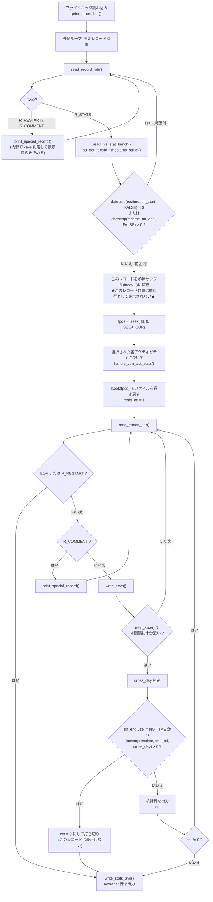

擬似コードにすると:

```
# ---- 外側ループ: -s/-e の範囲内にある最初の R_STATS を探す ----
repeat:
    rec = read_record_hdr()
    if EOF: return
    if rec.type in (R_RESTART, R_COMMENT):
        print_special_record(rec)          # -s/-e 範囲外なら表示しない (読み飛ばしはする)
        continue
    read_file_stat_bunch(rec, into=slot0)
    rectime = sa_get_record_timestamp_struct(flags, rec)
until rec.type == R_STATS
      and datecmp(rectime, tm_start, FALSE) >= 0
      and datecmp(rectime, tm_end,   FALSE) <= 0

copy(slot0 -> slot2)         # 平均計算の基準 (= 最初の 1 レコードは差分の「前」側として消費される)
fpos = tell()

# ---- 内側ループ: アクティビティごとに fpos から読み直す ----
for act in selected_activities:
    seek(fpos)
    copy(slot2 -> slot[!curr])
    cnt = count
    cross_day = FALSE
    loop:
        rec = read_record_hdr()
        if EOF or rec.type == R_RESTART: break
        if rec.type == R_COMMENT:
            print_special_record(rec); continue
        read_file_stat_bunch(rec, into=slot[curr])

        # write_stats() 内の判定
        if not next_slice(slot2.uptime_cs, rec.uptime_cs, reset, interval): continue   # -i
        prev_hour = hour_of(slot[!curr]); rectime = timestamp_of(slot[curr])
        if tm_start.use == USE_HHMMSS_T and slot[!curr].ust_time != 0
           and rec.ust_time > slot[!curr].ust_time and rectime.tm_hour < prev_hour:
            cross_day = TRUE
        if tm_end.use != NO_TIME and datecmp(rectime, tm_end, cross_day) > 0:
            cnt = 0; break                 # -e 超過。このレコードは出力しない
        emit_stats_line(act, prev=slot[!curr], curr=slot[curr])
        if cnt > 0: cnt -= 1
        swap(curr)
        if cnt == 0: break
    emit_average_line(act)                 # "Average:" (-x 時はヘッダが "Summary:")
```

**最重要の副作用**: `-s` の境界に最初に合致したレコードは「前サンプル」として消費されるだけで
**統計行として表示されない**。`tests/expected.sar-se` (`sar -s 13:20:20 -e 13:20:40`、
データは `13:20:09/19/29/39/49`) が以下のようになるのはこのため。

```
13:20:29        CPU     %user     %nice   %system   %iowait    %steal     %idle
13:20:39        all      2.66     23.20      2.27      0.17      0.00     71.70
Average:        all      2.66     23.20      2.27      0.17      0.00     71.70
```

* ヘッダ行の左端は `timestamp[!curr]` = `13:20:29` (= `-s` 境界で最初に合致したレコード)。
* 統計行は 1 本だけ (`13:20:29`→`13:20:39` の差分)。
* `13:20:49` は `-e 13:20:40` を超えるので表示されず、そこで打ち切られる。

また `-s` のチェックは**外側ループの 1 回だけ**で、内側ループでは `-e` しか見ない。
つまり「開始点が決まったら、終了条件か EOF か `R_RESTART` まで連続して出す」動作になる。

`sadf` 側 (`logic1_display_loop` / `logic2_display_loop` / `svg_display_loop`) も同じ構造だが、
`-s` の判定が `datecmp(rectime, &tm_start, FALSE) < 0` / `datecmp(rectime, &tm_end, FALSE) > 0`
の `do{}while()` で書かれている点、`cross_day` の判定条件が 1.9 のとおり異なる点だけが違う。

### 1.11 `-s` / `-e` はローカル時刻か記録時刻か

**`-s`/`-e` の比較対象は「表示に使うのと同じ `rectime`」である。**
`datecmp()` に渡す `rectime` は `sa_get_record_timestamp_struct(flags, ...)` の出力そのものなので、
基準系はフラグに完全に追随する。

| コマンド | オプション | `-s`/`-e` (`hh:mm:ss`) が比較する時刻 |
|---|---|---|
| `sar` | 既定 | **読み手のローカル時刻** (`S_F_LOCAL_TIME` が既定で立つ) |
| `sar` | `-t` | **記録側のローカル時刻** (record header の `hour/min/sec`) |
| `sadf` | 既定 | **UTC** |
| `sadf` | `-T` | 読み手のローカル時刻 |
| `sadf` | `-t` | 記録側のローカル時刻 |
| `sadf` | `-U` | 表示は epoch だが、`hh:mm:ss` 形式の `-s`/`-e` は `rectime.tm_time`(=UTC) と比較される |

`-s`/`-e` を **epoch 秒** (10 桁) で与えた場合は `rectime.epoch_time` (= `record_header.ust_time`、
常に UTC) と直接比較されるため、TZ やオプションの影響を受けない。

`tests/01950` (`TZ="America/New_York" sar -f ... -e 1555595349`) の期待値
`tests/expected.sar-e-epoch` が `09:20:09` 始まりになっているのは、`sar` の既定が
ローカル時刻 (= NY, EDT = UTC-4) だから。データの UTC は `13:20:09`。

---

## 2. 単位と `--human`

### 2.1 `units[]` と `cprintf_unit()` のスケーリングアルゴリズム

```
# common.c
char units[] = {'s', 'B', 'k', 'M', 'G', 'T', 'P', '?'};    /* NR_UNITS = 8 */

# common.h
#define NO_UNIT   -1
enum { UNIT_SECTOR = 0, UNIT_BYTE = 1, UNIT_KILOBYTE = 2 };
```

```
cprintf_unit(unit, wi, dval):
    if wi < 4: wi = 4                       # 例: "1.3M" を出すための最小幅
    if unit == 0:                           # UNIT_SECTOR
        dval = dval / 2                     # 512B セクタ → kB
        unit = 2                            # UNIT_KILOBYTE
    while dval >= 1024:                     # ★ 除数は 1024 (1000 ではない)
        dval = dval / 1024
        unit += 1
    printf(" %*.*f", wi - 1, (dplaces_nr ? 1 : 0), dval)
    printf("%s", sc_normal)                 # ★ 色リセットが単位文字の前に出る
    if unit >= NR_UNITS: unit = NR_UNITS - 1    # 8 以上は '?' にクランプ
    printf("%c", units[unit])
```

| 論点 | 事実 |
|---|---|
| 除数 | **1024**。1000 ではない (`while (dval >= 1024) dval /= 1024;`) |
| 昇格しきい値 | `dval >= 1024`。ちょうど `1024.0` で昇格する |
| 接尾辞 | `'B'` → `'k'` → `'M'` → `'G'` → `'T'` → `'P'`、インデックス 7 以上は `'?'` |
| `'s'` (index 0) | **実際には決して出力されない**。`unit == 0` は必ず kB へ変換され `unit = 2` になる |
| 小数桁 | `dplaces_nr ? 1 : 0` → 既定 (`-1`) と `--dec=1` / `--dec=2` は **1 桁**、`--dec=0` のみ **0 桁** |
| フィールド幅 | 数値部が `%*.*f` で幅 `wi-1`、その後に単位文字 1 個。先頭スペース 1 個を含めて **合計 `wi+1` 桁** |
| `sar` での `wi` | 例外なく **9** → `" %8.1f" + 1 char` = **10 桁** (非 human の `" %9.2f"` と同じ 10 桁) |
| 接尾辞の出し方 | **値に続けて同一フィールド内に付く** (別カラムではない)。数値と単位の間に空白は無い |
| 負値 | 昇格ループが回らないのでベース単位のまま。`cprintf_f()` の `sign` (`%+`) は単位付きでは**無視される** (実際に `sign=TRUE` と単位を併用する箇所は無い) |
| 色 | `sc_normal` が単位文字の **前** に出るため、単位文字自体は色付けされない。色を無効化 (非 tty / `S_COLORS=never`) すると全 `sc_*` は空文字列になる |

`tests/expected.sar-human` の実例:

```
13:20:09    kbmemfree   kbavail kbmemused  %memused kbbuffers  kbcached ...   kbdirty ...  kbvmused
13:20:19         1.4G      4.2G      3.6G     46.1%    254.1M      2.7G ...    396.0k ...      0.0k
```

* `kbdirty` = 396 (kB) は `1024` 未満なので昇格せず `396.0k`。
* `kbvmused` = 0 は `0.0k` (単位は消えない)。
* 各フィールドはちょうど 10 桁で、非 human 時と桁が揃う。

### 2.2 単位を持つアクティビティとその単位インデックス

`pr_stats.c` 内で `int unit` を持つのは 5 箇所だけ。いずれも
`if (DISPLAY_UNIT(flags)) unit = UNIT_xxx;` で、未指定時は `NO_UNIT` (`-1`)。

| アクティビティ | `sar` オプション | 単位インデックス | 非 human 時に渡す値 | human 時に渡す値 |
|---|---|---|---|---|
| `A_MEMORY` (RAM + SWAP) | `-r [ALL]` / `-S` | `UNIT_KILOBYTE` (2) | kB (そのまま) | kB (そのまま) |
| `A_DISK` | `-d` | `UNIT_KILOBYTE` (2) | `rd_sect/2` 等 = kB | 同じ kB 値 |
| `A_NET_DEV` | `-n DEV` | `UNIT_BYTE` (1) | `rxkb / 1024` = kB/s | **B/s (1024 で割らない)** |
| `A_HUGE` | `-H` | `UNIT_KILOBYTE` (2) | kB | kB |
| `A_FS` | `-F [MOUNT]` | `UNIT_BYTE` (1) | `f_bfree/1024/1024` = MB | **B (バイトそのまま)** |

`A_NET_DEV` と `A_FS` は **`--human` の有無で渡す値そのものが変わる**。実装パターン:

```
cprintf_f(unit, FALSE, 2, 9, 2,
          unit < 0 ? rxkb / 1024 : rxkb,      # 非 human は kB/s、human は B/s
          unit < 0 ? txkb / 1024 : txkb);
```

```
mbfsfree = (unit < 0) ? f_bfree / 1024 / 1024 : f_bfree;   # 非 human は MB、human は B
```

そのため列名 (`rxkB/s`, `MBfsfree`) と実際に出る単位が `--human` 時に食い違う:

```
13:20:09        IFACE   rxpck/s   txpck/s    rxkB/s    txkB/s ...
13:20:19       virbr0      3.21      0.00     25.7B      3.2B ...     ← ヘッダは "rxkB/s" だが値は B/s

13:20:09     MBfsfree  MBfsused   %fsused  %ufsused     Ifree     Iused    %Iused FILESYSTEM
13:20:19       705.2M    144.8M     17.0%     18.9%   6008414    102818      1.7% /dev/sda9
```

**単位を持たないもの (`--human` でも変化しない)**:
`-b` (A_IO: `tps`/`bread/s` = セクタ/秒)、`-B` (A_PAGE: `pgpgin/s` = kB/秒)、
`-W` (A_SWAP)、`-v` (A_KTABLES)、`-q`、`-n` の DEV 以外、`-I`、`-u`、`-w`、`-y` など。
`tests/expected.sar-human` で `bread/s 57.43` や `pgpgin/s 0.00` がそのままなのが根拠。

`UNIT_SECTOR` (0) は `pr_stats.c` では**使われない**。`iostat.c` (`sec/s` 系) と
`pidstat.c` / `cifsiostat.c` / `tapestat.c` 側だけで使われる。

### 2.3 `--human` はパーセント値にも効く (見落としやすい)

`cprintf_xpc()` の第 1 引数 `human` は `pr_stats.c` / `pr_xstats.c` の全呼び出しで
`DISPLAY_UNIT(flags)` である。すなわち `--human` を付けると**すべてのパーセント列に
リテラル `%` が付き、幅と小数桁が調整される**。

```
cprintf_xpc(human, xtrem, num, wi, wd, ...):
    if wd > 0 and dplaces_nr >= 0:
        wd = dplaces_nr                 # ← --dec の適用が先
    if human > 0:
        if wi < 4: wi = 4               # 例: "100%"
        wi -= 1                         # パーセント記号のために 1 桁譲る
        if wd > 1: wd -= 1              # 小数を 1 桁削る
    if wd == 1: lim = 0.05 else lim = 0.005      # ゼロ色判定のしきい値
    for each value:
        (色選択: xtrem == XHIGH/XLOW/XLOW0 と PERCENT_LIMIT_* の比較)
        printf(" %*.*f", wi, wd, val)
        printf("%s", sc_normal)
        if human > 0: printf("%%")
```

`sar` では `wi = 9`, `wd = 2` が常なので:

| モード | 出力書式 | 1 列の桁数 |
|---|---|---|
| 既定 | `" %9.2f"` | 10 |
| `--human` | `" %8.1f" + "%"` | 10 |
| `--dec=0` | `" %9.0f"` | 10 |
| `--dec=0 --human` | `" %8.0f" + "%"` | 10 |
| `--dec=1` | `" %9.1f"` | 10 |
| `--dec=1 --human` | `" %8.1f" + "%"` | 10 |
| `--dec=2 --human` | `" %8.1f" + "%"` (既定と同一) | 10 |

`tests/expected.sar-human`:

```
13:20:09        CPU      %usr     %nice      %sys ...     %idle
13:20:19        all      2.1%     12.5%      1.8% ...     82.9%
```

**どのモードでも 1 列 10 桁に収まるので列は揃う** (これは偶然ではなく、`wi -= 1` が
パーセント記号 1 文字と釣り合うように設計されている)。

### 2.4 `sar -h` / `sar -H` / `--human` の区別 (最大の混同ポイント)

`sa_common.c` の `parse_sar_opt()`:

| 指定 | 実装 | 意味 |
|---|---|---|
| `sar -h` | `*flags \|= S_F_PRETTY + S_F_UNIT;` | **`--pretty --human` と等価**。整形 + 人間可読サイズ |
| `sar -H` | `SELECT_ACTIVITY(A_HUGE);` | **hugepages 利用統計のレポート選択** (`kbhugfree` 等)。整形とは無関係 |
| `sar --human` | `sar.c`: `flags \|= S_F_UNIT;` | 人間可読サイズのみ (整形はしない) |
| `sar --pretty` / `sar -p` | `flags \|= S_F_PRETTY;` | 整形のみ |

man `sar.1` (`man/sar.in`) の記述も一致している:

```
.B \-H
Report hugepages utilization statistics.
...
.B \-h
This option is equivalent to specifying
.BR "\-\-pretty \-\-human" "."
```

```
\t-H\tHugepages utilization statistics [A_HUGE]      ← sar --help の出力
```

**`sadf` では意味が完全に逆転する**ので特に注意:

| 指定 | `sadf` での意味 |
|---|---|
| `sadf -h` (`--` より前) | `S_F_HORIZONTALLY`。`-d` (db 形式) と併用したとき、1 サンプルの全アクティビティを 1 行に横並びで出す |
| `sadf -H` (`--` より前) | `S_F_HDR_ONLY`。データファイルのヘッダ (メタデータ) だけを表示して `exit(0)` |
| `sadf ... -- -h` (`--` より後) | sar オプションとして解釈 → `S_F_PRETTY + S_F_UNIT` |
| `sadf ... -- -H` (`--` より後) | sar オプションとして解釈 → `A_HUGE` を選択 |
| `sadf ... -- --human` | **`usage()` でエラー**。`parse_sar_opt()` は単文字オプションしか処理せず、2 文字目の `-` が `default:` に落ちて 1 を返す |

さらに: **`S_F_UNIT` (`DISPLAY_UNIT`) を参照するのは `pr_stats.c` / `pr_xstats.c` だけ**
(`grep -rln DISPLAY_UNIT *.c` → `cifsiostat.c iostat.c pidstat.c pr_stats.c pr_xstats.c tapestat.c`)。
`sadf` のレンダラ (`rndr_stats.c` / `json_stats.c` / `xml_stats.c` / `raw_stats.c` /
`svg_stats.c` / `pcp_stats.c`) は一切参照しない。つまり **`sadf -- -h` の `--human` 成分は
出力に何の影響も与えない** (`--pretty` 成分だけが効く)。

`-h` / `-j` のフラグ副作用まとめ:

| 指定 | 立つフラグ |
|---|---|
| `-h` | `S_F_PRETTY` + `S_F_UNIT` |
| `-p` / `--pretty` | `S_F_PRETTY` |
| `--human` | `S_F_UNIT` |
| `-j SID` | `S_F_DEV_SID` + `S_F_PRETTY` (= `-p` を含意) |
| `-j <type>` | `S_F_PERSIST_NAME` + `S_F_PRETTY` (= `-p` を含意) |

### 2.5 `--dec={0|1|2}` の効果と 幅 vs 精度 の相互作用

解析 (`sar.c` / `sadf.c` 共通の形):

```
if argv[opt] starts with "--dec=" and len(argv[opt]) == 7:
    if not isdigit(argv[opt][6]): usage()
    dplaces_nr = atoi(argv[opt] + 6)
    if dplaces_nr < 0 or dplaces_nr > 2: usage()
```

`dplaces_nr` の初期値は **`-1`** (`sadf.c` / `iostat.c` / `mpstat.c` / `pidstat.c` /
`cifsiostat.c` / `tapestat.c` すべて `int dplaces_nr = -1;`)。
長さチェックが `== 7` なので `--dec=10` のような指定は `--dec=` オプションとして
認識されず、他の分岐に落ちて最終的に `usage()` になる。

適用条件 (`cprintf_f()` と `cprintf_xpc()` に同一のコードが入っている):

```
if wd > 0 and dplaces_nr >= 0:
    wd = dplaces_nr
```

#### 影響を受けるフィールド / 受けないフィールド

| 出力関数 | `--dec` の影響 | 理由 |
|---|---|---|
| `cprintf_f(unit, sign, num, wi, wd, ...)` で **`wd > 0`** | **受ける** | `wd = dplaces_nr` |
| `cprintf_f(...)` で **`wd == 0`** | **受けない** | 条件 `wd > 0` が偽。`pr_stats.c` では平均行の kB 系 (`cprintf_f(unit, FALSE, N, 9, 0, ...)`) や A_FS の `MBfsfree`/`MBfsused` がこれ |
| `cprintf_xpc(human, xtrem, num, wi, wd, ...)` で **`wd > 0`** | **受ける** (パーセントも影響下) | 同上 |
| `cprintf_u64(unit, num, wi, ...)` | **受けない** | `%*"PRIu64` で整数出力。小数概念が無い (`kbmemfree` など) |
| `cprintf_x(num, wi, ...)` | **受けない** | 16 進整数 |
| `cprintf_in(type, format, ...)` | **受けない** | 項目名・CPU 番号などのリテラル書式 |
| `cprintf_unit()` (= `--human` 経路) | **間接的に受ける** | 小数桁が `dplaces_nr ? 1 : 0`。`--dec=0` だけ 0 桁、それ以外 (`-1`/`1`/`2`) は 1 桁 |

`pr_stats.c` の全 `cprintf_f` / `cprintf_xpc` 呼び出しを集計すると **`wi` は例外なく 9、
`wd` は 0 か 2 のいずれか**。したがって `sar` テキスト出力における `--dec` の実効は
「`wd == 2` の列が 0/1/2 桁になる」だけで、`wd == 0` の列は不変。

#### 幅と精度の相互作用 (核心)

**精度が縮んでもフィールド幅は縮まない。パディングが差分を吸収する。**

`" %*.*f"` の幅指定 `wi` は `--dec` では変更されないため、
`--dec=0` なら `" %9.0f"` → 小数点と小数部が消えた分だけ**左側の空白が増える**。

```
# 既定 (--dec 未指定 = 2 桁)
13:20:19        all      2.15     12.50      2.36      0.12      0.00     82.88
# --dec=0
13:20:19        all         2        12         2         0         0        83
```

どちらも 1 列 10 桁。`tests/expected.sar-dec` (`sar --dec=0 -A`) がこれを示している。

唯一の例外は `--human` (`cprintf_xpc`) の `wi -= 1` と `cprintf_unit()` の `wi - 1` で、
これは `%` 記号 / 単位文字 1 文字分を確保するための**幅の付け替え**であり、
`--dec` による精度変更とは独立している (両方を適用した場合は
「まず `wd = dplaces_nr`、次に `wi -= 1` と `wd -= 1 (wd > 1 のとき)`」の順)。

`--dec` が影響しない実例 (`tests/expected.sar-dec`):

```
13:20:09    kbmemfree   kbavail kbmemused  %memused ...   kbdirty ...
13:20:19      1437740   4389516   3755444        46 ...       396 ...      ← kB 系は cprintf_u64 なので整数のまま
Average:      1437740   4389516   3755444        46 ...       396 ...      ← 平均も wd=0 なので不変
```

```
13:20:09     MBfsfree  MBfsused   %fsused  %ufsused     Ifree     Iused    %Iused FILESYSTEM
13:20:19          705       145        17        19   6008414    102818         2 /dev/sda9
                  ^^^ wd=0 なので --dec に関係なく常に整数   ^^ wd=2 なので --dec=0 で 0 桁に
```

#### ゼロ色判定のしきい値が精度で変わる

副作用として、色付け (`sc_zero_int_stat`) の判定しきい値が `wd` に連動する。
バイト一致を狙う場合は色が無効 (非 tty) なら無関係だが、`S_COLORS=always` では差が出る。

```
lim = 0.005
if wd == 1: lim = 0.05

# cprintf_f
if (wd > 0 and -lim < val < lim) or (wd == 0 and -0.5 <= val <= 0.5):
    色 = sc_zero_int_stat
# cprintf_xpc
if (wd > 0 and val < lim) or (wd == 0 and val <= 0.5):
    色 = sc_zero_int_stat
```

`wd == 2` のときの `lim` は `0.005` のまま (`0.0005` にはならない)。

---

## 3. グローバルヘッダ行

### 3.1 `print_gal_header()` のバイトレイアウト

```
print_gal_header(tm_time, sysname, release, nodename, machine, cpu_nr, format):
    rc = set_report_date(tm_time, cur_date, TIMESTAMP_LEN)
    if format == PLAIN_OUTPUT:      # PLAIN_OUTPUT = 0
        printf("%s %s (%s) \t%s \t_%s_\t(%d CPU)\n",
               sysname, release, nodename, cur_date, machine, cpu_nr)
    else:
        ... JSON 出力 (sadf -j 用ではなく iostat -o JSON 用) ...
    return rc
```

書式文字列は **`"%s %s (%s) \t%s \t_%s_\t(%d CPU)\n"`**。トークン単位で分解すると:

| # | 内容 | 区切り |
|---|---|---|
| 1 | `sysname` (`utsname.sysname`, 例 `Linux`) | 半角空白 1 |
| 2 | `release` (`utsname.release`) | 半角空白 1 |
| 3 | `(` + `nodename` + `)` | **半角空白 1 + TAB** |
| 4 | `cur_date` | **半角空白 1 + TAB** |
| 5 | `_` + `machine` + `_` | **TAB** |
| 6 | `(` + `cpu_nr` + ` CPU)` | — |
| 7 | `\n` (1 個のみ。ヘッダ自身は空行を出さない) | — |

つまり `") "` のあとに TAB、日付のあとに `" "` + TAB、`_machine_` のあとに TAB。
**「空白+TAB」の 2 文字ペアが 2 箇所ある**のが移植時に落としやすい点。

| 論点 | 事実 |
|---|---|
| `CPU` の複数形 | **常に `"CPU"`**。`(1 CPU)` も `(8 CPU)` も同じで、`CPUs` にはならない |
| `cpu_nr` の値 | `file_hdr.sa_cpu_nr > 1 ? file_hdr.sa_cpu_nr - 1 : 1` (`sa_cpu_nr` は「CPU 数 + 1」で保存されている) |
| 日付書式 | `set_report_date()` が `is_iso_time_fmt() ? "%Y-%m-%d" : "%x"` を選ぶ。**既定はロケールの `%x`** |
| `strftime()` 失敗時 | `cur_date` = `"?/?/?"`、戻り値 `-1` |
| 戻り値 | 成功時は `is_iso_time_fmt()` の値 (0 or 1)、失敗時 `-1` |
| 末尾 | `\n` 1 個。後続の空行は `print_hdr_line()` / `print_sar_restart()` の先頭 `\n` に由来する |
| `_x86_64_` のアンダースコア | 書式中のリテラル `_%s_` |

`sar` は `print_report_hdr()` 経由で必ずこのヘッダを 1 回出す
(ライブ収集でもファイル読み出しでも同じ)。日付は 1.5 のとおり `-t` の有無で変わる。

`sadf` がこの平文ヘッダを出すのは **`-H` (`print_hdr_header()`)** と
**`-g` (SVG の `<text>` 内, `print_svg_header()`)** の 2 経路のみ。
`-p` / `-d` / `-x` / `-j` / `-r` / `-l` は平文ヘッダを出さない (`-x`/`-j` は構造化ヘッダ)。

### 3.2 `sadf -H` が出すもの

`print_hdr_header()` の出力順 (`F_BEGIN` のみ):

```
"System activity data file: %s (%#x)\n"           ← dfile, file_magic.format_magic
display_sa_file_version(stdout, file_magic)       ← "File created by sar/sadc from sysstat version X.Y.Z"
  (format_magic != FORMAT_MAGIC ならここで return)
"Genuine sa datafile: %s (%x)\n"                  ← "yes"/"no", file_magic.upgraded
"Host: "                                          ← 改行なし。直後に print_gal_header() が続く
  print_gal_header(localtime_r(sa_ust_time), sa_sysname, sa_release,
                   sa_nodename, sa_machine, cpu_nr, PLAIN_OUTPUT)
"File date: %s\n"                                 ← get_file_timestamp_struct() + strftime("%Y-%m-%d")
"File time: " + strftime("%T", gmtime_r(sa_ust_time)) + " UTC (%llu)\n"
"Timezone: %s\n"                                  ← file_hdr.sa_tzname
"File composition: (%u,%u,%u),(%u,%u,%u),(%u,%u,%u)\n"
     ← file_magic.hdr_types_nr[0..2], file_hdr.act_types_nr[0..2], file_hdr.rec_types_nr[0..2]
"Size of a long int: %d\n"                        ← sa_sizeof_long
"HZ = %lu\n"                                      ← sa_hz (翻訳対象外の literal)
"Number of activities in file: %u\n"              ← sa_act_nr
"Extra structures available: %c\n"                ← 'Y' / 'N'
"List of activities:\n"
  各アクティビティ 1 行:
    "%02u: [%02x] "        ← fal->id, fal->magic
    "%-20s"                ← act[p]->name または "Unknown activity"
    " %c:%4d"              ← fal->has_nr ? 'Y':'N', fal->nr
    "x%d"                  ← fal->nr2 > 1 のときだけ
    "\t(%u,%u,%u)"         ← fal->types_nr[0..2]
    " \t[Unknown format]"  ← act[p]->magic != fal->magic のときだけ
    "\n"
```

`tests/expected.data-12.0.0-H` の短い抜粋 (`^I` は TAB。テストは
`sadf -H ... | grep -v 0x2175` で 1 行目を除いている):

```
File created by sar/sadc from sysstat version 12.0.0
Genuine sa datafile: yes (0)
Host: Linux 5.0.16-100.fc28.x86_64 (linux.home) ^I06/30/19 ^I_x86_64_^I(8 CPU)
File date: 2019-06-30
File time: 05:39:21 UTC (1561873161)
Timezone: 
File composition: (1,1,11),(0,0,9),(2,0,0)
Size of a long int: 8
HZ = 100
Number of activities in file: 36
Extra structures available: N
List of activities:
01: [8b] A_CPU                Y:   9^I(10,0,0)
03: [8b] A_IRQ                Y: 489^I(1,0,0) ^I[Unknown format]
```

* `Host: ` に続く部分が **そのまま `print_gal_header()` の出力**なので、3.1 のバイトレイアウトが
  ここでも確認できる: `") "` + TAB + `06/30/19` + `" "` + TAB + `_x86_64_` + TAB + `(8 CPU)`。
* `Timezone: ` の後が空。`file_header.sa_tzname` (`TZNAME_LEN` = 8) は **sysstat 12.2.0 で
  追加されたフィールド**なので、それより古いデータファイル (このテストの `data-12.0.0`) では
  ヘッダ読み込み時にゼロ埋めされ空文字列になる。`sadf -c` で変換したファイルも
  `sa_conv.c` が `sa_tzname[]` をゼロで初期化するため同様。
* `A_IRQ` の行末に `" \t[Unknown format]"` (空白 + TAB + 角括弧) が付いている。

`sadf -x` / `-j` のヘッダ相当は別関数で、`print_gal_header()` を通さない。
フィールドと順序:

| `-x` (XML) | `-j` (JSON) |
|---|---|
| `<sysdata-version>` | (なし) |
| `<host nodename="...">` | `"nodename"` |
| `<sysname>` | `"sysname"` |
| `<release>` | `"release"` |
| `<machine>` | `"machine"` |
| `<number-of-cpus>` | `"number-of-cpus"` |
| `<file-date>` (`"%Y-%m-%d"`) | `"file-date"` |
| `<file-utc-time>` (`"%T"` of `gmtime_r`) | `"file-utc-time"` |
| `<timezone>` (`sa_tzname`) | `"timezone"` |

### 3.3 テスト期待値との照合

`tests/00625` (`LC_ALL=C TZ=GMT ./sar -C -A -f tests/data-11.6.5.tmp`) →
`tests/expected.data-11.6.5` の先頭 3 行:

```
Linux 4.17.18-200.fc28.x86_64 (linux.home) ^I08/29/18 ^I_x86_64_^I(8 CPU)

09:33:38     LINUX RESTART^I(8 CPU)
```

`tests/00615` (`LC_ALL=C TZ=GMT ./sar -C -A -f tests/data-10.3.1.tmp`) →
`tests/expected.data-10.3.1` の先頭 3 行:

```
Linux 4.4.14-200.fc22.x86_64 (kluane.home) ^I01/21/17 ^I_x86_64_^I(8 CPU)

08:14:56     LINUX RESTART^I(8 CPU)
```

いずれも:

* 日付が `mm/dd/yy` (= `LC_ALL=C` における `%x`)。ISO ではない。
* `(nodename) ` の後ろに TAB、日付の後ろに `" "` + TAB、`_x86_64_` の後ろに TAB。
* `(8 CPU)` — 単数化・複数化なし。
* ヘッダ行の直後に空行 1 行 (次に来る `LINUX RESTART` 行の先頭 `\n` 由来)。
* `LINUX RESTART` は `timestamp`(11 桁左寄せ) + `"  LINUX RESTART"` + TAB + `"(8 CPU)"`。

---

## 4. `--pretty` / `-p` がテキスト出力に与える変化

`DISPLAY_PRETTY(flags)` = `S_F_PRETTY` (`0x00000004`)。立てるのは
`-p` / `--pretty` / `-h` / `-j <type>` / `-j SID`。

### 4.1 効果 1: 項目名カラムを行頭から行末へ移す

`pr_stats.c` で `DISPLAY_PRETTY` を見るのは **4 アクティビティのみ**。

| アクティビティ | 関数 | `sar` オプション | 移動する列 |
|---|---|---|---|
| `A_IRQ` | `print_irq_stats()` | `-I` | `INTR` (割り込み名) |
| `A_DISK` | `print_disk_stats()` | `-d` | `DEV` (デバイス名) |
| `A_NET_DEV` | `print_net_dev_stats()` | `-n DEV` | `IFACE` |
| `A_NET_EDEV` | `print_net_edev_stats()` | `-n EDEV` | `IFACE` |

`-x` (min/max) 側も `pr_xstats.c` の 4 関数 (`print_irq_xstats()` /
`print_disk_xstats()` / `print_net_dev_xstats()` / `print_net_edev_xstats()`) で同じ処理を行う。

データ行のパターン:

```
printf("%-11s", timestamp[curr])
if not DISPLAY_PRETTY(flags):
    cprintf_in(IS_STR, " %9s", name, 0)        # 行頭・右寄せ幅 9
... 統計値 ...
if DISPLAY_PRETTY(flags):
    cprintf_in(IS_STR, " %s", name, 0)         # 行末・幅指定なし
printf("\n")
```

ヘッダ行側は `print_hdr_line()` の `iwidth` 引数で表現する:

```
print_hdr_line(timestamp[!curr], a, FIRST, DISPLAY_PRETTY(flags) ? -1 : 0, 9, bitmap)
```

`print_hdr_line()` の擬似コード (該当部分):

```
printf("\n%-11s", p_timestamp)
i = -1
for tk in split(header_line, ";"):
    if '*' in tk: ... (CPU 展開: " %*s" で vwidth) ; continue
    if iwidth > 0:
        printf(" %*s", iwidth, tk); iwidth = 0; continue     # 第 1 列を専用幅で出す
    if iwidth < 0 and iwidth == i:                            # iwidth == -1 かつ最初のトークン
        it = tk; iwidth = 0                                   # 後回しにする
    else:
        printf(" %*s", vwidth, tk)
    i -= 1
if it != NULL:
    printf(" %s", it)                                         # 行末に幅指定なしで出す
printf("\n")
```

`iwidth` の意味:

| `iwidth` | 挙動 |
|---|---|
| `> 0` | 第 1 フィールドを `" %*s"` (その幅) で行頭に出す (例: A_CPU の `7`) |
| `0` | 第 1 フィールドも通常の `vwidth` (= 9) で出す |
| `< 0` (実際は `-1`) | 第 1 フィールドを保留し、**行末に `" %s"` で出す** |

#### before / after (実測値)

非 pretty (`tests/expected.sar-A`、`-d` 部分):

```
12:53:20          DEV       tps     rkB/s     wkB/s     dkB/s   areq-sz    aqu-sz     await     %util
12:53:21          sda      0.00      0.00      0.00      0.00      0.00      0.00      0.00      0.00
12:53:21          sdb      0.00      0.00      0.00      0.00      0.00      0.00      0.00      0.00
12:53:21          sdq      9.62      7.86      0.00     16.04      2.48      0.01     13.00      0.96
```

pretty (`tests/00170` = `sar --pretty -d -f ...` → `tests/expected.sar-pretty`):

```
13:20:09          tps     rkB/s     wkB/s     dkB/s   areq-sz    aqu-sz     await     %util DEV
13:20:19         0.00      0.00      0.00      0.00      0.00      0.00      0.00      0.00 sda
13:20:19         0.00      0.00      0.00      0.00      0.00      0.00      0.00      0.00 sda1
13:20:19         0.00      0.00      0.00      0.00      0.00      0.00      0.00      0.00 sda2
```

* `DEV` / デバイス名が行頭 (`" %9s"`) から行末 (`" %s"`) へ移動。
* 行末は**右寄せされない**ため、名前の長さがまちまちでも切り詰められず、
  `virbr0-nic` のような 10 文字超の名前が欠けない (これが `--pretty` の主目的)。
* 統計値カラムの位置はそのまま (左端 11 桁 + 各 10 桁)。1 列分だけ左にシフトする。

### 4.2 効果 2: device-mapper 名の解決

`A_DISK` のデバイス名取得は
`get_device_name(major, minor, wwn, part_nr, DISPLAY_PRETTY(flags), DISPLAY_PERSIST_NAME_S(flags), USE_STABLE_ID(flags), NULL)`。
第 5 引数 `disp_devmap_name` が `DISPLAY_PRETTY(flags)` である。

```
get_device_name(...):
    if disp_persist_name:                                   # -j <type>
        name = get_persistent_name_from_pretty(get_devname(major, minor))
    if name == NULL:
        if use_stable_id and wwn[0] != 0:                   # -j SID
            name = sprintf("%#016llx%s%s", wwn[0], wwn[1] ? hex(wwn[1]) : "",
                                            part_nr ? "-" + part_nr : "")
        else if disp_devmap_name:                           # ★ --pretty
            if dm_major == 0: dm_major = get_devmap_major()  # /proc/devices から "device-mapper"
            if major == dm_major:
                name = transform_devmapname(major, minor)   # dm-0 → centos-root のような論理名
        if name == NULL:
            name = dflt_name or get_devname(major, minor)
    name = replace all '!' with '/'      # cciss!c0d0 → cciss/c0d0 を元に戻す
    return name
```

つまり `--pretty` を付けると **device-mapper 配下のデバイスが `dm-0` ではなく
LVM/`/dev/mapper` の名前で出る**。`sadf.c` にも同じ前準備がある:

```
if DISPLAY_PRETTY(flags):
    dm_major = get_devmap_major()
```

この device-mapper 名解決は `sadf` のレンダラ (`rndr_stats.c` / `json_stats.c` /
`xml_stats.c` / `raw_stats.c` / `svg_stats.c` / `pcp_stats.c`) でも
`get_device_name(..., DISPLAY_PRETTY(flags), ...)` として共有されている。
一方で 4.1 の「列の移動」は `sar` テキスト出力 (`pr_stats.c` / `pr_xstats.c`) 専用である。

### 4.3 `--pretty` に影響されないもの

* `A_FS` (`-F`) の `FILESYSTEM` 列は **`--pretty` と無関係に常に行末**
  (`print_hdr_line(..., -1, 9, NULL)` が固定、データ行も `cprintf_in(IS_STR, " %s", ...)` 固定)。

  ```
  13:20:09     MBfsfree  MBfsused   %fsused  %ufsused     Ifree     Iused    %Iused FILESYSTEM
  13:20:19          705       145        17        19   6008414    102818         2 /dev/sda9
  ```
* タイムスタンプ欄の幅 (`%-11s`)、統計値の幅 (9)、区切りスペース (1) は不変。
* 列の順序 (統計値どうしの並び) は不変。移動するのは項目名 1 列だけ。
* `sadf` の ppc/db/xml/json/raw/PCP 出力のレイアウトは変わらない (名前解決のみ影響)。

---

## 付録: Rust 実装時のチェックリスト

1. `sar` のタイムスタンプは既定で **`strftime("%X")`**、`S_TIME_FORMAT=ISO` のときだけ
   `"%H:%M:%S"`。`sadf` は常に `"%H:%M:%S"`。`"%x %X"` / `"%FT%T%z"` は iostat 系専用。
2. 左端カラムは常に `"%-11s"`。`Average:` / `Summary:` / `Minimum:` / `Maximum:` はいずれも 8 文字、
   `Last:` は 5 文字。
3. グローバルヘッダは `"%s %s (%s) \t%s \t_%s_\t(%d CPU)\n"`。空白 + TAB のペアが 2 箇所。
   `CPU` は不変化。
4. `--human` の除数は **1024**、しきい値は `>= 1024`、接尾辞は `B k M G T P ?`、
   小数桁は `dplaces_nr ? 1 : 0`、数値部の幅は `wi - 1`。単位文字は値に密着。
5. `--human` はパーセント列にも作用し (`wi -= 1`, `wd -= 1 if wd > 1`, 末尾に `%`)、
   結果としてどのモードでも 1 列 10 桁に揃う。
6. `--dec` は `wd > 0` の呼び出しにだけ効く。**幅 (`wi = 9`) は変わらない**。
7. `-s`/`-e` の比較は「時刻のみ・hour→min→sec の階層比較」。日付フィールドは使わない。
   `hh:mm:ss` 形式で `-e < -s` なら `tm_end.tm_hour += 24` でラップ、epoch 形式なら `usage()`。
8. `-s` 境界に最初に合致したレコードは差分の「前」側として消費され、統計行にはならない。
9. 色文字列 (`sc_*`) は非 tty / `S_COLORS=never` で空文字列になる。バイト一致検証は
   非 tty 前提で行う。
10. `sar -H` は hugepages レポート、`sar -h` は `--pretty --human`。
    `sadf -H` はヘッダのみ表示、`sadf -h` は db 形式の横並び。

---

## 第 V 部 — sadf の各出力形式


本章は `sadf` が出力する全フォーマット (`-d` / `-p` / `-j` / `-x` / `-r` / `-c` / `-H` / `-g` / `-l`) を
Rust 実装がバイト単位で再現できるレベルまで記述する。出典は sysstat 12.8.0 master の
`sadf.c` / `sadf.h` / `sadf_misc.c` / `format.c` / `rndr_stats.c` / `json_stats.c` /
`xml_stats.c` / `raw_stats.c` / `activity.c` / `common.c` / `sa_common.c`、および
`tests/expected.*` 群。

---

### 0. フォーマット選択とグローバル構造

#### 0.1 オプションとフォーマット ID の対応

`sadf` のフォーマット選択は排他 (2 つ以上指定すると usage エラーで exit 1)。

| オプション | フォーマット ID | 出力 | 表示ループ |
|---|---|---|---|
| `-H` (単独) | `F_HEADER_OUTPUT` | データファイルヘッダのみ (テキスト) | なし (`f_display = NULL`) |
| `-d` | `F_DB_OUTPUT` | DB/CSV (`;` 区切り) | `logic2_display_loop` |
| `-p` | `F_PPC_OUTPUT` | awk 向け (`\t` 区切り) **既定** | `logic2_display_loop` |
| `-x` | `F_XML_OUTPUT` | XML | `logic1_display_loop` |
| `-j` | `F_JSON_OUTPUT` | JSON | `logic1_display_loop` |
| `-c` | `F_CONV_OUTPUT` | 旧 sa ファイル → 最新バイナリ形式 | なし (`convert_file()`) |
| `-g` | `F_SVG_OUTPUT` | SVG | `svg_display_loop` |
| `-r` | `F_RAW_OUTPUT` | raw (生カウンタ) | `logic2_display_loop` |
| `-l` | `F_PCP_OUTPUT` | PCP アーカイブ (要 libpcp) | `logic1_display_loop` |

フォーマット未指定時は `check_format_options()` が決定する:
`-H` があれば `F_HEADER_OUTPUT`、なければ **`F_PPC_OUTPUT`**。

#### 0.2 `struct report_format` のオプションビット (`sadf.h` / `format.c`)

| ビット | 値 | 意味 |
|---|---|---|
| `FO_LC_NUMERIC_C` | 0x01 | 小数点を `.` に固定 (`LC_NUMERIC=C` 相当) |
| `FO_HEADER_ONLY` | 0x02 | `-H` を併用可 |
| `FO_LOCAL_TIME` | 0x08 | `-T` / `-t` を受け付ける |
| `FO_HORIZONTALLY` | 0x10 | `-h` を受け付ける |
| `FO_SEC_EPOCH` | 0x20 | `-U` を受け付ける |
| `FO_FIELD_LIST` | 0x40 | 統計の前にフィールド名一覧行を出す |
| `FO_TEST_MARKUP` | 0x80 | `AO_CLOSE_MARKUP` を考慮 (閉じタグ生成) |
| `FO_NO_TRUE_TIME` | 0x100 | `-t` を拒否 |
| `FO_ITEM_LIST` | 0x200 | アイテム数を事前カウントしリスト化 |
| `FO_FULL_ORDER` | 0x400 | RESTART/COMMENT も時刻順に混ぜて出す |

各フォーマットの options 実値 (`format.c`):

| フォーマット | options |
|---|---|
| `hdr` | `FO_HEADER_ONLY` |
| `db` (-d) | `FO_LOCAL_TIME + FO_HORIZONTALLY + FO_SEC_EPOCH + FO_FIELD_LIST` |
| `ppc` (-p) | `FO_LOCAL_TIME + FO_SEC_EPOCH` |
| `xml` (-x) | `FO_HEADER_ONLY + FO_LOCAL_TIME + FO_TEST_MARKUP` |
| `json` (-j) | `FO_HEADER_ONLY + FO_LOCAL_TIME + FO_TEST_MARKUP + FO_LC_NUMERIC_C` |
| `conv` (-c) | 0 |
| `svg` (-g) | `FO_HEADER_ONLY + FO_LOCAL_TIME + FO_LC_NUMERIC_C` |
| `raw` (-r) | `FO_LOCAL_TIME + FO_SEC_EPOCH` |
| `pcp` (-l) | `FO_HEADER_ONLY + FO_LOCAL_TIME + FO_NO_TRUE_TIME + FO_ITEM_LIST + FO_FULL_ORDER` |

**重要な帰結**:
- `-h` (横並び) は **`-d` のみ**有効。他フォーマットでは `check_format_options()` が
  `S_F_HORIZONTALLY` を落とす。
- `-U` (epoch 秒) は **`-d` / `-p` / `-r` のみ**有効。`-x` / `-j` / `-g` では落とされる。
- `-T` / `-t` は `-c` 以外の全フォーマットで有効 (`-l` は `-t` のみ拒否)。
- `-H` は `-x` / `-j` / `-g` / `-l` と併用可 (この場合ヘッダのみ出力して終了)。
  `-d` / `-p` / `-r` と `-H` を併用すると `-H` が落とされて通常出力になる。

#### 0.3 2 系統の表示ループ

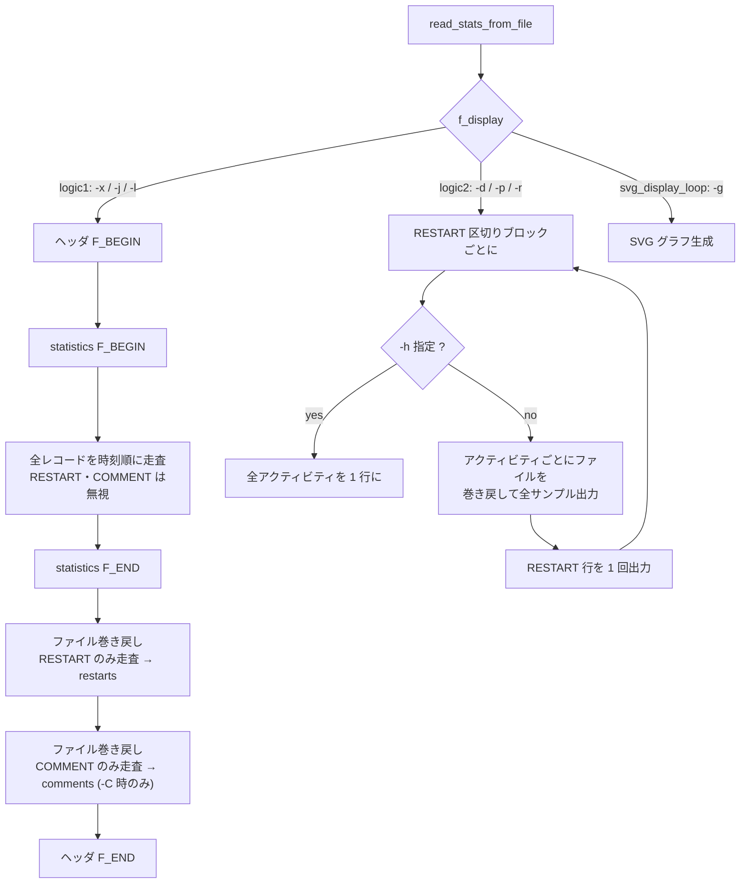

- **logic1** (`-x` / `-j` / `-l`): *時刻順*。1 タイムスタンプ内に全アクティビティを並べる。
  ファイルを 3 回走査する (統計 → RESTART → COMMENT)。したがって
  `restarts` / `comments` は `statistics` を**全部出し終わった後**にまとめて出る。
- **logic2** (`-d` / `-p` / `-r`): *アクティビティ順*。アクティビティ A の全サンプル →
  アクティビティ B の全サンプル … となり、`sar` のレポート順序と同じ。
  RESTART に到達するとブロックが切れ、RESTART 行を 1 回出して次ブロックへ。
  COMMENT はアクティビティごとに (= ブロック内で何度も) 出る可能性がある。

`AO_MULTIPLE_OUTPUTS` を持つアクティビティ (A_CPU / A_MEMORY / A_FS) は logic2 で
`opt_flags & 0xff` のビットごとに**別ブロックとして繰り返し**出力される
(例: A_MEMORY は「メモリ部」と「スワップ部」で 2 ブロック)。

#### 0.4 `xprintf` / `xprintf0` (インデント規約)

`common.c` 内の 2 関数。どちらも `prtab(nr_tab)` で **タブ文字 `\t` を nr_tab 個**出力してから
フォーマット済み文字列を出す。差は末尾の改行のみ:

| 関数 | 出力 |
|---|---|
| `xprintf(n, fmt, ...)` | `"\t" * n` + 本文 + `"\n"` |
| `xprintf0(n, fmt, ...)` | `"\t" * n` + 本文 (**改行なし**) |

JSON 出力では「行末にカンマが付くかどうかが後続要素の有無で決まる」ため、
最後の要素だけ `xprintf0` で改行を保留し、呼び出し側が `printf(",\n")` または
`printf("\n")` で確定させる、というイディオムが全面的に使われている。
**インデントは空白ではなく必ずタブ**。

#### 0.5 マークアップグループ (XML/JSON の入れ子の閉じ方)

`activity.c` の `act[]` 配列の並び順がそのまま XML/JSON 内の出力順になる。
配列内には 3 つのグループ境界がコメントで示されている:

```
… disk_act,
/* <network> */      net_dev_act … fchost_act, softnet_act   /* AO_CLOSE_MARKUP */
/* <power-management> */ pwr_cpufreq_act … pwr_usb_act        /* AO_CLOSE_MARKUP */
filesystem_act,
/* <psi> */          psi_cpu_act, psi_io_act, psi_mem_act     /* AO_CLOSE_MARKUP */
```

`AO_CLOSE_MARKUP` を持つ 3 アクティビティ (A_NET_SOFT / A_PWR_USB / A_PSI_MEM) は
**選択されていなくても** `generic_write_stats()` から print 関数が呼ばれる
(`TEST_MARKUP(fmt->options) && CLOSE_MARKUP(act->options)` の条件)。
これがグループの閉じタグ (`</network>` など) を必ず出すための仕組み。
`-x` / `-j` を実装する際は「グループを開いた最初のアクティビティ」と
「閉じ担当アクティビティ」を状態として持つ必要がある。

#### 0.6 アクティビティ一覧 (`.name` / `.desc` / `hdr_line`)

`hdr_line` は `-d` のフィールド名一覧行と `-r` のフィールド名の**両方**の出典。
`|` で複数出力の変種を区切り、`&` で「`-r ALL` 指定時のみ現れる追加フィールド」の境界を示し、
`*` で「アイテム番号を付けた総称名」を示す。

| ID | `.name` | `.desc` | `hdr_line` |
|---|---|---|---|
| A_CPU | `A_CPU` | CPU utilization | `CPU;%user;%nice;%system;%iowait;%steal;%idle` \| `CPU;%usr;%nice;%sys;%iowait;%steal;%irq;%soft;%guest;%gnice;%idle` |
| A_PCSW | `A_PCSW` | Task creation and switching activity | `proc/s;cswch/s` |
| A_IRQ | `A_IRQ` | Interrupts statistics | `INTR;CPU*` |
| A_SWAP | `A_SWAP` | Swap activity | `pswpin/s;pswpout/s` |
| A_PAGE | `A_PAGE` | Paging activity | `pgpgin/s;pgpgout/s;fault/s;majflt/s;pgfree/s;pgscank/s;pgscand/s;pgsteal/s;pgprom/s;pgdem/s` |
| A_IO | `A_IO` | I/O and transfer rate statistics | `tps;rtps;wtps;dtps;bread/s;bwrtn/s;bdscd/s` |
| A_MEMORY | `A_MEMORY` | Memory and/or swap utilization | `kbmemfree;kbavail;kbmemused;%memused;kbbuffers;kbcached;kbcommit;%commit;kbactive;kbinact;kbdirty;kbshmem&kbanonpg;kbslab;kbkstack;kbpgtbl;kbvmused` \| `kbswpfree;kbswpused;%swpused;kbswpcad;%swpcad` |
| A_KTABLES | `A_KTABLES` | Kernel tables statistics | `dentunusd;file-nr;inode-nr;pty-nr` |
| A_QUEUE | `A_QUEUE` | Queue length and load average statistics | `runq-sz;plist-sz;ldavg-1;ldavg-5;ldavg-15;blocked` |
| A_SERIAL | `A_SERIAL` | TTY devices statistics | `TTY;rcvin/s;xmtin/s;framerr/s;prtyerr/s;brk/s;ovrun/s` |
| A_DISK | `A_DISK` | Block devices statistics | `DEV;tps;rkB/s;wkB/s;dkB/s;areq-sz;aqu-sz;await;%util` |
| A_NET_DEV | `A_NET_DEV` | Network interfaces statistics | `IFACE;rxpck/s;txpck/s;rxkB/s;txkB/s;rxcmp/s;txcmp/s;rxmcst/s;%ifutil` |
| A_NET_EDEV | `A_NET_EDEV` | Network interfaces errors statistics | `IFACE;rxerr/s;txerr/s;coll/s;rxdrop/s;txdrop/s;txcarr/s;rxfram/s;rxfifo/s;txfifo/s` |
| A_NET_NFS | `A_NET_NFS` | NFS client statistics | `call/s;retrans/s;read/s;write/s;access/s;getatt/s` |
| A_NET_NFSD | `A_NET_NFSD` | NFS server statistics | `scall/s;badcall/s;packet/s;udp/s;tcp/s;hit/s;miss/s;sread/s;swrite/s;saccess/s;sgetatt/s` |
| A_NET_SOCK | `A_NET_SOCK` | IPv4 sockets statistics | `totsck;tcpsck;udpsck;rawsck;ip-frag;tcp-tw` |
| A_NET_IP | `A_NET_IP` | IPv4 traffic statistics | `irec/s;fwddgm/s;idel/s;orq/s;asmrq/s;asmok/s;fragok/s;fragcrt/s` |
| A_NET_EIP | `A_NET_EIP` | IPv4 traffic errors statistics | `ihdrerr/s;iadrerr/s;iukwnpr/s;idisc/s;odisc/s;onort/s;asmf/s;fragf/s` |
| A_NET_ICMP | `A_NET_ICMP` | ICMPv4 traffic statistics | `imsg/s;omsg/s;iech/s;iechr/s;oech/s;oechr/s;itm/s;itmr/s;otm/s;otmr/s;iadrmk/s;iadrmkr/s;oadrmk/s;oadrmkr/s` |
| A_NET_EICMP | `A_NET_EICMP` | ICMPv4 traffic errors statistics | `ierr/s;oerr/s;idstunr/s;odstunr/s;itmex/s;otmex/s;iparmpb/s;oparmpb/s;isrcq/s;osrcq/s;iredir/s;oredir/s` |
| A_NET_TCP | `A_NET_TCP` | TCPv4 traffic statistics | `active/s;passive/s;iseg/s;oseg/s` |
| A_NET_ETCP | `A_NET_ETCP` | TCPv4 traffic errors statistics | `atmptf/s;estres/s;retrseg/s;isegerr/s;orsts/s` |
| A_NET_UDP | `A_NET_UDP` | UDPv4 traffic statistics | `idgm/s;odgm/s;noport/s;idgmerr/s` |
| A_NET_SOCK6 | `A_NET_SOCK6` | IPv6 sockets statistics | `tcp6sck;udp6sck;raw6sck;ip6-frag` |
| A_NET_IP6 | `A_NET_IP6` | IPv6 traffic statistics | `irec6/s;fwddgm6/s;idel6/s;orq6/s;asmrq6/s;asmok6/s;imcpck6/s;omcpck6/s;fragok6/s;fragcr6/s` |
| A_NET_EIP6 | `A_NET_EIP6` | IPv6 traffic errors statistics | `ihdrer6/s;iadrer6/s;iukwnp6/s;i2big6/s;idisc6/s;odisc6/s;inort6/s;onort6/s;asmf6/s;fragf6/s;itrpck6/s` |
| A_NET_ICMP6 | `A_NET_ICMP6` | ICMPv6 traffic statistics | `imsg6/s;omsg6/s;iech6/s;iechr6/s;oechr6/s;igmbq6/s;igmbr6/s;ogmbr6/s;igmbrd6/s;ogmbrd6/s;irtsol6/s;ortsol6/s;irtad6/s;inbsol6/s;onbsol6/s;inbad6/s;onbad6/s` |
| A_NET_EICMP6 | `A_NET_EICMP6` | ICMPv6 traffic errors statistics | `ierr6/s;idtunr6/s;odtunr6/s;itmex6/s;otmex6/s;iprmpb6/s;oprmpb6/s;iredir6/s;oredir6/s;ipck2b6/s;opck2b6/s` |
| A_NET_UDP6 | `A_NET_UDP6` | UDPv6 traffic statistics | `idgm6/s;odgm6/s;noport6/s;idgmer6/s` |
| A_PWR_CPU | `A_PWR_CPU` | CPU clock frequency | `CPU;MHz` |
| A_PWR_FAN | `A_PWR_FAN` | Fans speed | `FAN;DEVICE;rpm;drpm` |
| A_PWR_TEMP | `A_PWR_TEMP` | Devices temperature | `TEMP;DEVICE;degC;%temp` |
| A_PWR_IN | `A_PWR_IN` | Voltage inputs statistics | `IN;DEVICE;inV;%in` |
| A_HUGE | `A_HUGE` | Huge pages utilization | `kbhugfree;kbhugused;%hugused;kbhugrsvd;kbhugsurp` |
| A_PWR_FREQ | `A_PWR_FREQ` | CPU weighted frequency | `CPU;wghMHz` |
| A_PWR_USB | `A_PWR_USB` | USB devices | `manufact;product;BUS;idvendor;idprod;maxpower` |
| A_FS | `A_FS` | Filesystems statistics | `FILESYSTEM;MBfsfree;MBfsused;%fsused;%ufsused;Ifree;Iused;%Iused` \| `MOUNTPOINT;MBfsfree;MBfsused;%fsused;%ufsused;Ifree;Iused;%Iused` |
| A_NET_FC | `A_NET_FC` | Fibre Channel HBA statistics | `FCHOST;fch_rxf/s;fch_txf/s;fch_rxw/s;fch_txw/s` |
| A_NET_SOFT | `A_NET_SOFT` | Software-based network processing statistics | `CPU;total/s;dropd/s;squeezd/s;rx_rps/s;flw_lim/s;blg_len` |
| A_PSI_CPU | `A_PSI_CPU` | Pressure-stall CPU statistics | `%scpu-10;%scpu-60;%scpu-300;%scpu` |
| A_PSI_IO | `A_PSI_IO` | Pressure-stall I/O statistics | `%sio-10;%sio-60;%sio-300;%sio;%fio-10;%fio-60;%fio-300;%fio` |
| A_PSI_MEM | `A_PSI_MEM` | Pressure-stall memory statistics | `%smem-10;%smem-60;%smem-300;%smem;%fmem-10;%fmem-60;%fmem-300;%fmem` |
| A_PWR_BAT | `A_PWR_BAT` | Batteries capacity | `BAT;%cap;cap/min;status` |

---

### 1. タイムスタンプの描画 (全フォーマット共通の前段)

#### 1.1 `cur_date` / `cur_time` の生成 (`sa_common.c: set_record_timestamp_string()`)

擬似コード:

```text
if (-U 指定 && cur_date バッファが渡されている):
    cur_time = 十進の epoch 秒 (%llu)
    cur_date = ""                      # 空文字列 = 日付なし
else:
    cur_date = strftime("%Y-%m-%d", rectime)
    if (ロケール優先の時刻出力):        # S_TIME_DEF_TIME 環境変数 由来
        cur_time = strftime("%X", rectime)
    else:
        cur_time = strftime("%H:%M:%S", rectime)
```

`rectime` に入る時刻の基準は:

| オプション | `rectime` の基準 | タイムゾーン表示文字列 |
|---|---|---|
| (なし) | UTC | リテラル `"UTC"` |
| `-t` (true time) | データ収集時のローカル時刻 | `file_hdr.sa_tzname` (収集時の `tzname[0]`) |
| `-T` (local time) | sadf 実行環境のローカル時刻 | `my_tzname` = 実行時の `tzname[0]` |
| `-U` | epoch 秒 (日付・TZ なし) | — |

`-T` / `-t` / `-U` は**相互排他**で、2 つ以上指定すると usage エラー。

`my_tzname` は `-T` 指定時のみ `tzset()` → `tzname[0]` で設定される (`sadf.c`)。

TZ 表示の条件式は全フォーマット共通で次の形:

```text
tz_string = if (-T)        then my_tzname
            else if (-t)   then file_hdr.sa_tzname
            else                "UTC"
```

なお `-t` 指定かつ `file_hdr.sa_tzname` が空文字列の場合 (古い sa ファイルは TZ 名を
持たない) は、`-d`/`-p`/`-r` では **TZ 部分そのものを出さない**
(`print_dbppc_timestamp` / `print_raw_timestamp` の `strlen(sa_tzname)` チェック)。
`-x`/`-j` にはこのチェックがないので `tz=""` になる。

#### 1.2 フォーマットごとのタイムスタンプ行

| フォーマット | 関数 | 形 |
|---|---|---|
| `-d` | `print_db_timestamp` → `print_dbppc_timestamp(sep=';')` | `<nodename>;<interval>;<date> <time> <tz>` |
| `-p` | `print_ppc_timestamp` → `print_dbppc_timestamp(sep='\t')` | `<nodename>\t<interval>\t<date> <time> <tz>` |
| `-x` | `print_xml_timestamp` | `<timestamp date="…" time="…" tz="…" interval="…">` … `</timestamp>` |
| `-j` | `print_json_timestamp` | `"timestamp": {"date": "…", "time": "…", "tz": "…", "interval": N}` |
| `-r` | `print_raw_timestamp` | `<time> <tz>` (nodename も interval も出ない) |
| `-g` | (なし) | グラフ軸ラベルに `HH:MM:SS` |

`interval` は「直前レコードとの経過秒」。`generic_write_stats()` で
`itv`(1/100 秒) から `dt = itv/100`、`itv % 100 >= 50` なら `dt++` (四捨五入) で求める。
RESTART / COMMENT 行では `interval` が **`-1`** 固定。

`-d` / `-p` の prefix 生成は擬似コード:

```text
temp1 = nodename + sep + itoa(itv_sec) + sep
temp2 = if (cur_date 非空) then temp1 + cur_date + " " else temp1
if (cur_date 非空 && (!-t || (-t && sa_tzname 非空))):
    pre = temp2 + cur_time + " " + tz_string
else:
    pre = temp2 + cur_time
if (-h):  # 横並び時はここで即座に出力
    print(pre)
return pre
```

`-U` 指定時は `cur_date` が空になるので `pre = nodename + sep + itv + sep + epoch秒`
となり、**TZ 文字列も出ない**。

##### 検証 (`tests/expected.sadf-d-tz` ほか、`sadf -d tests/data-tz.tmp -- -uw`)

データは `TZ="Europe/Paris"` で収集、sadf は `TZ="America/New_York"` で実行:

```
# 既定 (UTC)
SYSSTAT.TEST;31;2019-04-18 13:20:19 UTC;-1;2.15;12.50;2.36;0.12;0.00;82.88
# -t (true time = 収集時ローカル)
SYSSTAT.TEST;31;2019-04-18 15:20:19 CET;-1;2.15;12.50;2.36;0.12;0.00;82.88
# -T (local time = 実行環境ローカル)
SYSSTAT.TEST;31;2019-04-18 09:20:19 EST;-1;2.15;12.50;2.36;0.12;0.00;82.88
```

`-U` (`tests/expected.sadf-U-se-epoch`, `sadf -d tests/data.tmp -U -s 1555593629 -e 1555594649`):

```
# hostname;interval;timestamp;CPU;%user;%nice;%system;%iowait;%steal;%idle
SYSSTAT.TEST;39;1555593639;-1;2.66;23.20;2.27;0.17;0.00;71.70
SYSSTAT.TEST;22;1555593649;-1;8.32;13.77;9.85;0.41;0.62;66.92
SYSSTAT.TEST;-1;1555594649;LINUX-RESTART	(9 CPU)
```

> ⚠️ **実装上の落とし穴 (macOS)**: `tests/` には `expected.sadf-r-t-tz` と
> `expected.sadf-r-T-tz`、`expected.sadf-d-t-tz` と `expected.sadf-d-T-tz`、
> `expected.sadf-t-tz` と `expected.sadf-T-tz` という**大文字小文字だけが違う**
> ペアが存在する。case-insensitive FS (macOS の既定 APFS) にチェックアウトすると
> 片方しか展開されず、`-T` の期待値が `-t` の内容にすり替わって見える。
> `git show HEAD:tests/expected.sadf-d-T-tz` のように git 側から取り出して比較すること。

#### 1.3 RESTART / COMMENT 行

| フォーマット | RESTART | COMMENT |
|---|---|---|
| `-d` | `<node>;-1;<date> <time> <tz>;LINUX-RESTART\t(<N> CPU)` | `<node>;-1;<date> <time> <tz>;COM <comment>` |
| `-p` | `<node>\t-1\t<date> <time> <tz>\tLINUX-RESTART\t(<N> CPU)` | `<node>\t-1\t<date> <time> <tz>\tCOM <comment>` |
| `-r` | `<time> <tz>; LINUX-RESTART (<N> CPU)` | `<time> <tz>; COM <comment>` |
| `-x` | `<boot date="…" time="…" tz="…" cpu_count="N"/>` (`<restarts>` 内) | `<comment date="…" time="…" tz="…" com="…"/>` (`<comments>` 内) |
| `-j` | `{"boot": {"date": …, "time": …, "tz": …, "cpu_count": N}}` (`"restarts"` 配列内) | `{"comment": {"date": …, "time": …, "tz": …, "com": …}}` (`"comments"` 配列内) |

- `-d` / `-p` の `LINUX-RESTART` の直後は**リテラルのタブ 1 個**。区切りが `;` の `-d` でも
  ここだけタブであることに注意 (`printf("%cLINUX-RESTART\t(%u CPU)\n", sep, …)`)。
- CPU 数は `sa_cpu_nr > 1 ? sa_cpu_nr - 1 : 1`。`sa_cpu_nr` は「CPU "all" を含む個数」なので
  1 引く。全フォーマットで同じ式。
- COMMENT は `-C` (`S_F_COMMENT`) 指定時のみ出力される。
- `-r` の RESTART/COMMENT 行は nodename も interval も出さず、`;` の後に**空白 1 個**が入る。

---

### 2. `-p` (ppc, awk 向け)

#### 2.1 行の形

```
<nodename>\t<interval>\t<timestamp>\t[<item>\t]<fieldname>\t<value>\n
```

- 区切りは**すべてタブ 1 個**。
- `<timestamp>` は 1.2 節の形 (`2019-04-18 13:20:19 UTC` のように**内部に空白を含む 1 フィールド**)。
- アイテムを持たないアクティビティ (A_PCSW, A_SWAP, …) では `<item>` の位置に
  **リテラル `-`** が入る。つまりフィールド数は常に 6。
- 1 メトリック = 1 行。したがって 1 サンプル × 1 アイテムで複数行になる。

##### 検証 (`tests/expected.sadf-p`, `sadf -p tests/data.tmp -C -- -A`)

```
SYSSTAT.TEST<TAB>31<TAB>2019-04-18 13:20:19 UTC<TAB>all<TAB>%usr<TAB>2.15
SYSSTAT.TEST<TAB>31<TAB>2019-04-18 13:20:19 UTC<TAB>all<TAB>%nice<TAB>12.50
SYSSTAT.TEST<TAB>31<TAB>2019-04-18 13:20:19 UTC<TAB>-<TAB>proc/s<TAB>3.56
```

(`<TAB>` は実際のタブ文字。3 行目のアイテム無しケースで `-` が入っている)

##### 検証 (`tests/expected.data-11.6.5-sadf-p`, `sadf -p tests/data-11.6.5.tmp -- -m FAN,IN,TEMP`)

```
linux.home<TAB>-1<TAB>2018-08-29 09:33:38 UTC<TAB>LINUX-RESTART<TAB>(8 CPU)
linux.home<TAB>46<TAB>2018-08-29 09:34:34 UTC<TAB>fan1<TAB>DEVICE<TAB>f71858fg-isa-0200
linux.home<TAB>46<TAB>2018-08-29 09:34:34 UTC<TAB>fan1<TAB>rpm<TAB>1283.00
linux.home<TAB>46<TAB>2018-08-29 09:34:34 UTC<TAB>fan1<TAB>drpm<TAB>1283.00
```

アイテム名が `fan1` / `fan2`… のように**アクティビティ固有の接頭辞 + 1 始まりの番号**に
なることに注意 (`-d` では `1` / `2` と番号のみ)。

##### 検証 (`tests/expected.data-wghfreq-sadf-p`, `sadf -p … -- -m FREQ -P ALL`)

```
SYSSTAT.TEST<TAB>31<TAB>2019-04-18 13:20:10 UTC<TAB>all<TAB>wghMHz<TAB>1123.35
SYSSTAT.TEST<TAB>31<TAB>2019-04-18 13:20:10 UTC<TAB>cpu0<TAB>wghMHz<TAB>1200.33
SYSSTAT.TEST<TAB>31<TAB>2019-04-18 13:20:10 UTC<TAB>cpu1<TAB>wghMHz<TAB>872.73
```

CPU 集約行のアイテム名は `all`、個別 CPU は `cpu<N>` (0 始まり)。

#### 2.2 `-p` にフィールド名一覧行はない

`ppc_fmt.options` に `FO_FIELD_LIST` が無いので、`# hostname;…` のヘッダ行は出ない。
フィールド名は毎行に含まれる。

---

### 3. `-d` (DB / CSV)

#### 3.1 フィールド名一覧行 (`sadf.c: list_fields()`)

`FO_FIELD_LIST` を持つ `-d` だけが出す。**アクティビティブロックの先頭で毎回**出力される
(`rw_curr_act_stats()` の冒頭)。したがって `-A` のように多数のアクティビティを選ぶと
ブロックの数だけこの行が現れる。RESTART でブロックが切り替わった後も再度出る。

擬似コード:

```text
emit("# hostname;interval;timestamp")
for each activity a in act[] 順:
    if (対象アクティビティでない) continue
    if (!選択済み || a.nr_ini == 0) continue
    if (単一出力):
        emit(";" + a.hdr_line)
        if (a.nr_ini > 1 && -h) emit("[...]")
    else:                           # AO_MULTIPLE_OUTPUTS
        msk = 1
        for hl in a.hdr_line.split('|'):
            if (a.opt_flags & 0xff) & msk:
                if hl に '&' が含まれる:
                    if (a.opt_flags & 0xff00) & (msk << 8):
                        '&' を ';' に置換して全体を出す     # -r ALL 相当
                    else:
                        '&' より前だけを出す
                else:
                    emit(";" + hl)
                if (a.nr_ini > 1 && -h) emit("[...]")
            msk <<= 1
emit("\n")
```

`&` の分岐は A_MEMORY の `kbshmem&kbanonpg` 用。`-r ALL` (AO_F_MEM_ALL) のとき
`kbshmem;kbanonpg` 以降のフィールドも出る。

##### 検証 (`tests/expected.sadf-d`, `sadf -d tests/data.tmp -C -- -A`)

```
# hostname;interval;timestamp;CPU;%usr;%nice;%sys;%iowait;%steal;%irq;%soft;%guest;%gnice;%idle
SYSSTAT.TEST;31;2019-04-18 13:20:19 UTC;-1;2.15;12.50;1.84;0.12;0.00;0.34;0.19;0.00;0.00;82.88
…
# hostname;interval;timestamp;proc/s;cswch/s
SYSSTAT.TEST;31;2019-04-18 13:20:19 UTC;3.56;68409.30
```

CPU 集約行のアイテム値は **`-1`** (文字列 `all` ではない!)。個別 CPU は 0 始まりの番号。

##### 検証 (`tests/expected.data-11.6.5-sadf-d`, `sadf -d … -- -m FAN,IN,TEMP`)

```
linux.home;-1;2018-08-29 09:33:38 UTC;LINUX-RESTART	(8 CPU)
# hostname;interval;timestamp;FAN;DEVICE;rpm;drpm
linux.home;46;2018-08-29 09:34:34 UTC;1;f71858fg-isa-0200;1283.00;1283.00
# hostname;interval;timestamp;TEMP;DEVICE;degC;%temp
linux.home;46;2018-08-29 09:34:34 UTC;1;f71858fg-isa-0200;34.00;48.57
```

`hdr_line` の列順は `FAN;DEVICE;rpm;drpm` だが、**値の並びも同じ** (番号→デバイス→rpm→drpm)。
`-r` (raw) とは並びが違う (raw は番号→DEVICE→rpm→rpm_min) ので注意。

##### 検証 (`tests/expected.sadf-se`, `sadf -d -s 13:20:20 -e 13:20:40 --iface=enp6s1 --dev=sda --fs=/dev/sda6 … -- -n DEV -Fdp`)

```
# hostname;interval;timestamp;DEV;tps;rkB/s;wkB/s;dkB/s;areq-sz;aqu-sz;await;%util
SYSSTAT.TEST;39;2019-04-18 13:20:39 UTC;sda;1604.70;41499.97;10663.48;0.00;32.51;18.56;12.00;85.36
# hostname;interval;timestamp;FILESYSTEM;MBfsfree;MBfsused;%fsused;%ufsused;Ifree;Iused;%Iused
SYSSTAT.TEST;39;2019-04-18 13:20:39 UTC;/dev/sda6;273;206;42.93;51.97;19201593;455;0.00
```

> 🔴 **落とし穴**: `MBfsfree` / `MBfsused` / `Ifree` / `Iused` は**小数点なしの整数**
> (`273`, `206`, `19201593`, `455`)、一方 `%fsused` / `%ufsused` / `%Iused` は 2 桁小数。
> CSV の列ごとに整数/小数が混在する。

#### 3.2 `-dh` (横並び)

`-h` (= `S_F_HORIZONTALLY`) は `-d` のみ有効。全アクティビティを 1 行に連結する。

- フィールド名一覧行では、`nr_ini > 1` のアクティビティの後に**リテラル `[...]`** が挿入される。
- 各行はタイムスタンプ prefix を 1 回だけ出し (`print_dbppc_timestamp` 内で即出力)、
  その後に全アクティビティ・全アイテムの値が `;` 区切りで連なる。
- 行末の改行は `print_db_timestamp(F_END)` が出す。

##### 検証 (`tests/expected.sadf-dh`, `sadf -dh tests/data.tmp -- -Iu ALL -P all,3`)

```
# hostname;interval;timestamp;CPU;%usr;%nice;%sys;%iowait;%steal;%irq;%soft;%guest;%gnice;%idle[...];INTR;CPU*[...]
SYSSTAT.TEST;31;2019-04-18 13:20:19 UTC;-1;2.15;12.50;1.84;…;82.88;3;0.00;99.55;…;0.00;sum;31915.30;1027.05;0;0.00;0.00;8;…
```

CPU が 2 つ (all と 3) 選択されているため、INTR 部は「割込名 → all の値 → CPU 3 の値」
の 3 つ組が割込ごとに繰り返される。

---

### 4. `-r` (raw)

生のオンディスクカウンタをそのまま出す。レート変換 (`/ itv`) を**行わない**のが基本。

#### 4.1 行の形

```
<timestr>; <アクティビティ先頭フィールド名>; <アイテム識別子>; <名前1>; <値…>; <名前2>; <値…>;\n
```

- `<timestr>` は `print_raw_timestamp()` が返す `"<time> <tz>"` または `"<time>"`。
- 区切りは **`"; "` (セミコロン + 空白)**。ただしフィールド名の直前が `"; "`、
  値の直前は `"; "`、行末は `";"` + `"\n"`。厳密には下記 2 つのヘルパで決まる。

#### 4.2 ヘルパ `pfield()` / `pval()`

**`pfield(hdr_line, pos)`** — フィールド名を 1 つずつ切り出して返すステートフルな関数。

```text
static field[]   # 現在の hdr_line セグメント
static idx       # field 内の現在位置

if (hdr_line != NULL):                     # 初回呼び出し
    hline = hdr_line のコピー
    idx = 0
    hl = hline を '|' で分割した pos 番目のセグメント   # pos は「変種」の選択
    if (hl に '&' が含まれる): '&' を ';' に置換       # -r ALL 相当を有効化
    field = hl
# ここから毎回
if (field[idx…] に ';' がある):
    その ';' を '\0' に置換して 1 フィールドを終端
elif (field[idx…] に '*' がある、または (hdr_line==NULL && pos != 0)):
    '*' を '\0' に置換
    if (pos == 0): return "all"                       # K_LOWERALL
    else:          return <接頭辞> + itoa(pos - 1)    # 例 "CPU0"
i = idx; idx += (切り出し長 + 1)
return field + i
```

- **第 1 引数に `hdr_line` を渡す呼び出しが「リセット」**、`NULL` を渡す呼び出しが
  「次のフィールド名」。
- 第 2 引数 `pos` は `hdr_line` を `|` 分割した何番目の変種を使うかの指定。
  マクロ `FIRST` = 0、`SECOND` = 1。A_CPU では `DISPLAY_CPU_ALL(opt_flags)` の真偽
  (0/1) をそのまま渡している = `-u ALL` のとき第 2 変種。
  A_FS では `FIRST + DISPLAY_MOUNT(opt_flags)`。
- `*` を含むフィールド名 (`INTR;CPU*`) では `pos` が CPU 番号 + 1 として使われ、
  `pos == 0` なら `all`、それ以外は `CPU<pos-1>`。
- 「このフィールドは raw では出さない」ときは `pfield(NULL, 0)` を**戻り値を捨てて**
  呼び、インデックスだけ進める (A_MEMORY の `kbmemused` / `%memused` など)。

**`pval(valp, valc)`** — 前サンプル値と現サンプル値の 2 つ組を出す。

```text
if (-O debug && valc < valp):
    emit(" [DEC]")            # カウンタが減少 (ラップ or リセット) の印
emit("; " + valp + "; " + valc + ";")
```

つまり `pval` を使うフィールドは **`名前; 前値; 現値;`** の 3 トークンになる。
レート計算に必要な 2 点をそのまま出すのが raw フォーマットの本質。

#### 4.3 値のスタイル 3 種

| スタイル | 出力 | 用途 |
|---|---|---|
| `pval()` 経由 | `名前; 前値; 現値;` | 単調増加カウンタ (CPU tick, パケット数, セクタ数 …) |
| `printf(" %s; %llu;")` 等 | `名前; 値;` | 瞬時値 (kbmemfree, totsck, runq-sz …) |
| `printf(" %s; %f;")` | `名前; 値;` (6 桁小数) | センサ値 (rpm, degC, inV) — `%f` なので **常に小数 6 桁** |
| `printf(" %s; \"%s\";")` | `名前; "文字列";` | 文字列 (USB manufacturer/product, ファイルシステム名) — **ダブルクォート付き** |
| `printf(" %s; %x;")` | `名前; 16進;` | USB の idvendor / idprod |

#### 4.4 `-O debug` の追加出力

`-O debug` (= `S_F_DEBUG_MODE`) で以下が加わる。

1. **レコードヘッダ行** (`sa_common.c: read_record_hdr()` 内):
   ```
   # uptime_cs; <uptime_cs>; ust_time; <ust_time>; extra_next; <n>; record_type; <t>; HH:MM:SS; <hh>:<mm>:<ss>
   ```
2. **アクティビティヘッダ行** (`sadf.c: generic_write_stats()` 内、アクティビティごと):
   ```
   # name; <A_XXX>; nr_curr; <n>; nr_alloc; <n>; nr_ini; <n>
   ```
3. **`[DEC]`** — `pval()` でカウンタが減少したフィールド名の直後。
4. **`[OFF]` / `[TLS]`** — A_CPU で当該 CPU の全 tick が 0 なら `[OFF]` (オフライン)、
   区間が取れないなら `[TLS]` (tickless)。フィールド名 `CPU` の直後に付く。
5. **`[<status名>]`** — A_PWR_BAT の `status` 値の直後。`bat_status[]` =
   `Unknown` / `Charging` / `Discharging` / `NotCharging` / `Full`、範囲外は `UNDEFINED`。

##### 検証 (`tests/expected.sadf-r`, `sadf -r -O debug tests/data.tmp -C -- -A`)

```
# uptime_cs; 719255; ust_time; 1555593609; extra_next; 0; record_type; 1; HH:MM:SS; 13:20:09
# uptime_cs; 722372; ust_time; 1555593619; extra_next; 0; record_type; 1; HH:MM:SS; 13:20:19
# name; A_CPU; nr_curr; 9; nr_alloc; 10; nr_ini; 10
13:20:19 UTC; CPU; -1; %usr; 96005; 96538; %nice; 2578701; 2581805; %sys; 53845; 54302; …
13:20:19 UTC; CPU; 0; %usr; 10600; 10684; %nice; 331675; 331676; …
13:20:19 UTC; CPU [OFF]; 8; %usr [DEC]; 1414; 0; %nice [DEC]; 28; 0; …
```

CPU 集約行のアイテム識別子は **`-1`** (`i - 1` の値、`i=0` が "all")。
`-A` 指定 = `-u ALL` なので `hdr_line` の第 2 変種 (`%usr;%sys;%irq;%soft;%guest;%gnice`) が使われる。

##### 検証 (`tests/expected.sadf-r-tz`, `sadf -r tests/data-tz.tmp -- -uw` = `-u` のみ)

```
13:20:19 UTC; CPU; -1; %user; 96005; 96538; %nice; 2578701; 2581805; %system; 107589; 108174; %iowait; 60648; 60677; %steal; 0; 0; %idle; 3617879; 3638469;
13:20:19 UTC; proc/s; 46972; 47083; cswch/s; 130465866; 132598184;
```

`-u` のみ = `hdr_line` の第 1 変種 (`%user;%nice;%system;%iowait;%steal;%idle`)。
`%system` に渡す値は `cpu_sys + cpu_hardirq + cpu_softirq` の合算 (sar の `%system` 定義と同じ)。
A_PCSW のようにアイテムを持たないアクティビティは**アイテム識別子フィールドが無い**
(`timestr; フィールド名; 前値; 現値; …`)。

##### 検証 (`tests/expected.data-11.6.5-sadf-r`, `sadf -r … -- -m FAN,IN,TEMP`)

```
09:33:38 UTC; LINUX-RESTART (8 CPU)
09:34:34 UTC; FAN; 1; DEVICE; f71858fg-isa-0200; rpm; 1283.000000; rpm_min; 0.000000;
09:34:34 UTC; TEMP; 1; DEVICE; f71858fg-isa-0200; degC; 34.000000; temp_min; 0.000000; temp_max; 70.000000;
09:34:34 UTC; IN; 0; DEVICE; f71858fg-isa-0200; inV; 3.328000; in_min; 0.000000; in_max; 0.000000;
```

> 🔴 **落とし穴**: raw のセンサ系フィールド名は `hdr_line` と一致しない。
> `hdr_line` は `FAN;DEVICE;rpm;drpm` だが raw が出すのは `DEVICE` / `rpm` / **`rpm_min`**。
> `drpm` (= rpm - rpm_min の派生値) の代わりに生の `rpm_min` を出す。
> 同様に TEMP は `%temp` の代わりに `temp_min` と `temp_max`、
> IN は `%in` の代わりに `in_min` と `in_max` を出す (これらの名前は C 側に直書き)。
> FAN のアイテム番号は `i + 1` (1 始まり)、IN は `i` (0 始まり)。

##### 検証 (`tests/expected.data-wghfreq-sadf-r`, `sadf -r … -- -m FREQ -P ALL`)

```
13:20:10 UTC; CPU; -1; freq; 2001000; tminst; 60804; 60811; freq; 2000000; tminst; 5734; 5725; …
13:20:10 UTC; CPU; 0; freq; 2001000; tminst; 60803; 60813; freq; 2000000; tminst; 5734; 5724; …
```

A_PWR_FREQ は `hdr_line` (`CPU;wghMHz`) を使わず **`freq` / `tminst`** の直書き名を使い、
周波数ステップ数ぶん (`nr2` 個、`freq == 0` で打ち切り) 繰り返す。
`freq` は瞬時値 1 個、`tminst` (time_in_state) は `pval()` の 2 値。

#### 4.5 アクティビティ別 raw フィールド一覧

`pfield` 列は `hdr_line` から取られる名前、`直書き` は C ソースに埋め込まれた名前。
`pval` 列が ✓ のフィールドは `名前; 前値; 現値;` の 3 トークン。

##### A_CPU (`raw_print_cpu_stats`)
アイテム: `; <i-1>;` (i=0 が all → `-1`)。`pfield(hdr_line, DISPLAY_CPU_ALL ? 1 : 0)`。

| `-u` (第1変種) | 値 | `pval` |
|---|---|---|
| `CPU` | アイテム識別子 (`i-1`) | — |
| `%user` | `cpu_user` | ✓ |
| `%nice` | `cpu_nice` | ✓ |
| `%system` | `cpu_sys + cpu_hardirq + cpu_softirq` | ✓ |
| `%iowait` | `cpu_iowait` | ✓ |
| `%steal` | `cpu_steal` | ✓ |
| `%idle` | `cpu_idle` | ✓ |

| `-u ALL` (第2変種) | 値 | `pval` |
|---|---|---|
| `%usr` | `cpu_user - cpu_guest` | ✓ |
| `%nice` | `cpu_nice - cpu_guest_nice` | ✓ |
| `%sys` | `cpu_sys` | ✓ |
| `%iowait` | `cpu_iowait` | ✓ |
| `%steal` | `cpu_steal` | ✓ |
| `%irq` | `cpu_hardirq` | ✓ |
| `%soft` | `cpu_softirq` | ✓ |
| `%guest` | `cpu_guest` | ✓ |
| `%gnice` | `cpu_guest_nice` | ✓ |
| `%idle` | `cpu_idle` | ✓ |

CPU 選択は `IS_CPU_SELECTED(bitmap)`。raw モードでは**オフライン CPU も必ず出す**
(コメントに明記)。

##### A_PCSW / A_SWAP / A_PAGE / A_IO / A_NET_* (カウンタ系)
アイテムなし。全フィールド `pval()`。フィールド名は `hdr_line` 順どおり。

| アクティビティ | フィールド (順) |
|---|---|
| A_PCSW | `proc/s`(processes), `cswch/s`(context_switch) |
| A_SWAP | `pswpin/s`, `pswpout/s` |
| A_PAGE | `pgpgin/s`, `pgpgout/s`, `fault/s`, `majflt/s`, `pgfree/s`, `pgscank/s`, `pgscand/s`, `pgsteal/s`, `pgprom/s`, `pgdem/s` |
| A_IO | `tps`(dk_drive), `rtps`, `wtps`, `dtps`, `bread/s`, `bwrtn/s`, `bdscd/s` |
| A_NET_NFS | `call/s`, `retrans/s`, `read/s`, `write/s`, `access/s`, `getatt/s` |
| A_NET_NFSD | `scall/s`, `badcall/s`, `packet/s`, `udp/s`, `tcp/s`, `hit/s`, `miss/s`, `sread/s`, `swrite/s`, `saccess/s`, `sgetatt/s` |
| A_NET_IP | `irec/s`, `fwddgm/s`, `idel/s`, `orq/s`, `asmrq/s`, `asmok/s`, `fragok/s`, `fragcrt/s` |
| A_NET_EIP | `ihdrerr/s`, `iadrerr/s`, `iukwnpr/s`, `idisc/s`, `odisc/s`, `onort/s`, `asmf/s`, `fragf/s` |
| A_NET_ICMP | `imsg/s` … `oadrmkr/s` (14 個、`hdr_line` 順) |
| A_NET_EICMP | `ierr/s` … `oredir/s` (12 個) |
| A_NET_TCP | `active/s`, `passive/s`, `iseg/s`, `oseg/s` |
| A_NET_ETCP | `atmptf/s`, `estres/s`, `retrseg/s`, `isegerr/s`, `orsts/s` |
| A_NET_UDP | `idgm/s`, `odgm/s`, `noport/s`, `idgmerr/s` |
| A_NET_IP6 | `irec6/s` … `fragcr6/s` (10 個) |
| A_NET_EIP6 | `ihdrer6/s` … `itrpck6/s` (11 個) |
| A_NET_ICMP6 | `imsg6/s` … `onbad6/s` (17 個) |
| A_NET_EICMP6 | `ierr6/s` … `opck2b6/s` (11 個) |
| A_NET_UDP6 | `idgm6/s`, `odgm6/s`, `noport6/s`, `idgmer6/s` |

##### A_IRQ (`raw_print_irq_stats`)
アイテム: `; <irq_name>;` (文字列、クォートなし)。
`pfield(hdr_line, FIRST)` = `INTR`。その後 CPU ごとに `pfield(NULL, c)` を呼ぶので
フィールド名は `all` (c=0) / `CPU0` / `CPU1` … となり、値は `pval()` の 2 値。
`--int=` によるフィルタは `search_list_item(item_list, irq_name)`。
raw では**オフライン CPU も出す**。

##### A_MEMORY (`raw_print_memory_stats`) — 2 行に分かれる
`AO_MULTIPLE_OUTPUTS` なのでメモリ部 (`FIRST`) とスワップ部 (`SECOND`) が別行。

メモリ行 (瞬時値、全て `%llu` 1 値):
`kbmemfree`(frmkb) → `kbavail`(availablekb) → **`kbttlmem`**(tlmkb, 直書き) →
(`kbmemused` / `%memused` はスキップ) → `kbbuffers`(bufkb) → `kbcached`(camkb) →
`kbcommit`(comkb) → (`%commit` スキップ) → `kbactive` → `kbinact` → `kbdirty` →
`kbshmem` → `kbanonpg` → `kbslab` → `kbkstack` → `kbpgtbl` → `kbvmused`

スワップ行: `kbswpfree`(frskb) → **`kbttlswp`**(tlskb, 直書き) →
(`kbswpused` / `%swpused` スキップ) → `kbswpcad`(caskb)

> 🔴 `kbttlmem` / `kbttlswp` は `hdr_line` に存在しない直書き名。
> 派生値 (`kbmemused`, `%memused`, `%commit`, `kbswpused`, `%swpused`, `%swpcad`) は出ない。

##### A_HUGE (`raw_print_huge_stats`)
`kbhugfree`(frhkb) → **`hugtotal`**(tlhkb, 直書き) → (`kbhugused` / `%hugused` スキップ) →
`kbhugrsvd` → `kbhugsurp`。全て `%llu` 1 値。

##### A_KTABLES
`dentunusd`, `file-nr`, `inode-nr`, `pty-nr` — 全て `%llu` 1 値。

##### A_QUEUE
`runq-sz`(%llu), `plist-sz`(%llu), `ldavg-1`(%u), `ldavg-5`(%u), `ldavg-15`(%u), `blocked`(%llu)。
**`ldavg-*` は 100 倍された整数の生値**で、小数に変換されない。

##### A_SERIAL
アイテム: `; <line>;` (`%u`)。`TTY` の後に行番号。
`rcvin/s`, `xmtin/s`, `framerr/s`, `prtyerr/s`, `brk/s`, `ovrun/s` — 全て `pval()`。

##### A_DISK (`raw_print_disk_stats`)
行頭が特殊: `<timestr>; major; <major>; minor; <minor>; DEV; <dev_name>;`
(`major` / `minor` は直書き名で `hdr_line` より**前**に出る)。
`dev_name` は `get_device_name(major, minor, wwn, part_nr, DISPLAY_PRETTY, DISPLAY_PERSIST_NAME_S, …)`。

| 名前 | 出典 | 値 | `pval` |
|---|---|---|---|
| `major` | 直書き | `sdc->major` | — |
| `minor` | 直書き | `sdc->minor` | — |
| `DEV` | hdr_line | デバイス名 | — |
| `tps` | hdr_line | `nr_ios` | ✓ |
| `rkB/s` | hdr_line | `rd_sect` | ✓ |
| `wkB/s` | hdr_line | `wr_sect` | ✓ |
| `dkB/s` | hdr_line | `dc_sect` | ✓ |
| `rd_ticks` | 直書き | `rd_ticks` | ✓ |
| `wr_ticks` | 直書き | `wr_ticks` | ✓ |
| `dc_ticks` | 直書き | `dc_ticks` | ✓ |
| `tot_ticks` | 直書き | `tot_ticks` | ✓ |
| (`areq-sz` はスキップ) | | | |
| `aqu-sz` | hdr_line | `rq_ticks` | ✓ |

`hdr_line` の `await` / `%util` は消費されない (`aqu-sz` の次で行が終わる)。

##### A_NET_DEV
アイテム: `; <interface>;` (`IFACE` の後)。
`rxpck/s`(rx_packets), `txpck/s`, `rxkB/s`(rx_bytes), `txkB/s`, `rxcmp/s`, `txcmp/s`,
`rxmcst/s`(multicast) — 全て `pval()`。
その後に**直書きで** `speed; <%u>; duplex; <%u>;` が付く (`hdr_line` の `%ifutil` の代わり)。

##### A_NET_EDEV
アイテム: `; <interface>;`。`rxerr/s` … `txfifo/s` (9 個) 全て `pval()`。

##### A_NET_SOCK / A_NET_SOCK6
アイテムなし。全フィールド `%u` 1 値 (瞬時値)。
SOCK: `totsck`, `tcpsck`, `udpsck`, `rawsck`, `ip-frag`, `tcp-tw`
SOCK6: `tcp6sck`, `udp6sck`, `raw6sck`, `ip6-frag`

##### A_PWR_CPU
アイテム: `; <i-1>;` (`CPU` の後)。`MHz` フィールドは `%lu` 1 値 (`cpufreq`、100 倍値)。

##### A_PWR_FAN / A_PWR_TEMP / A_PWR_IN
4.4 節の検証例を参照。`%f` = 小数 6 桁固定。

| アクティビティ | アイテム番号 | フィールド順 |
|---|---|---|
| A_PWR_FAN | `i + 1` | `FAN`, `DEVICE`(%s), `rpm`(%f), `rpm_min`(%f, 直書き) |
| A_PWR_TEMP | `i + 1` | `TEMP`, `DEVICE`(%s), `degC`(%f), `temp_min`(%f, 直書き), `temp_max`(%f, 直書き) |
| A_PWR_IN | `i` | `IN`, `DEVICE`(%s), `inV`(%f), `in_min`(%f, 直書き), `in_max`(%f, 直書き) |

##### A_PWR_FREQ
アイテム: `; <i-1>;`。以降 `freq`(%lu) / `tminst`(pval) を `nr2` 回、`freq == 0` で break。

##### A_PWR_USB
アイテムなし。`manufact; "<%s>";` `product; "<%s>";` `BUS; <%u>;` `idvendor; <%x>;`
`idprod; <%x>;` `maxpower; <%u>;`。
**文字列 2 つはダブルクォートで囲まれる**、ID 2 つは 16 進。

##### A_FS
アイテム: `; "<dev_name>";` (**ダブルクォート付き**)。
`pfield(hdr_line, FIRST + DISPLAY_MOUNT)` なので `-F MOUNT` 時は `MOUNTPOINT`。
続いて直書き `f_bfree`, `f_blocks`, `f_bavail` (全て `%llu`)、
`MBfsfree`/`MBfsused`/`%fsused`/`%ufsused` をスキップ、
`Ifree`(f_ffree, hdr_line 名), 直書き `f_files`。
`--fs=` フィルタは `match_sa_filesystem_item()` (デバイス名とマウントポイントの両方に照合)。

##### A_NET_FC
アイテム: `; <fchost_name>;` (`FCHOST` の後)。
`fch_rxf/s`, `fch_txf/s`, `fch_rxw/s`, `fch_txw/s` — 全て `pval()`。

##### A_NET_SOFT
アイテム: `; <i-1>;` (`CPU` の後)。
`total/s`(processed), `dropd/s`, `squeezd/s`(time_squeeze), `rx_rps/s`(received_rps),
`flw_lim/s`(flow_limit) は `pval()`、`blg_len`(backlog_len) は `%u` 1 値。

##### A_PSI_CPU / A_PSI_IO / A_PSI_MEM
アイテムなし。`-10` / `-60` / `-300` は `%lu` 1 値 (100 倍値)、末尾の累積
(`%scpu` / `%sio` / `%fio` / `%smem` / `%fmem`) は `pval()`。

| アクティビティ | フィールド順 |
|---|---|
| A_PSI_CPU | `%scpu-10`, `%scpu-60`, `%scpu-300`, `%scpu`(pval) |
| A_PSI_IO | `%sio-10`, `%sio-60`, `%sio-300`, `%sio`(pval), `%fio-10`, `%fio-60`, `%fio-300`, `%fio`(pval) |
| A_PSI_MEM | `%smem-10`, `%smem-60`, `%smem-300`, `%smem`(pval), `%fmem-10`, `%fmem-60`, `%fmem-300`, `%fmem`(pval) |

##### A_PWR_BAT
アイテム: `; <bat_id>;` (`BAT` の後、`%d`)。
`%cap` フィールドは `pval` ではなく `" %s; %u; %u;"` で**前値と現値を並べる** (名前は 1 回)。
続いて直書き `status; <%d>` (`;` は最後にまとめて出る)。
`-O debug` では status 値の後に `[<bat_status 文字列>]` が付く。

---

### 5. `-H` (ヘッダのみ)

`sadf_misc.c: print_hdr_header()` が `F_BEGIN` で全て出す。`-H` 単独 (または `-x`/`-j`/`-g`/`-l`
との併用) で使える。出力はロケール翻訳対象 (`_()`) なので `LC_ALL=C` 前提。

出力項目 (順序どおり):

| 行 | 書式 | 備考 |
|---|---|---|
| 1 | `System activity data file: %s (%#x)\n` | ファイル名 + magic (`0x2175`) |
| 2 | `File created by sar/sadc from sysstat version %d.%d.%d` (+ `.%d` if extraversion) | `display_sa_file_version()` |
| 3 | `Genuine sa datafile: %s (%x)\n` | `yes`/`no` + `upgraded` 値 |
| 4 | `Host: ` + `print_gal_header()` | 下記参照 |
| 5 | `File date: %s\n` | `strftime("%Y-%m-%d")` |
| 6 | `File time: %s UTC (%llu)\n` | `strftime("%T")` (UTC) + epoch 秒 |
| 7 | `Timezone: %s\n` | `file_hdr.sa_tzname` (古いファイルは空) |
| 8 | `File composition: (%u,%u,%u),(%u,%u,%u),(%u,%u,%u)\n` | magic の `hdr_types_nr`, `act_types_nr`, `rec_types_nr` |
| 9 | `Size of a long int: %d\n` | `sa_sizeof_long` |
| 10 | `HZ = %lu\n` | **翻訳対象外** |
| 11 | `Number of activities in file: %u\n` | `sa_act_nr` |
| 12 | `Extra structures available: %c\n` | `Y` / `N` |
| 13 | `List of activities:\n` | |
| 14… | 各アクティビティ 1 行 | 下記参照 |

**2 行目以降は magic が `FORMAT_MAGIC` (0x2175) でない場合そこで打ち切り**
(`if (file_magic->format_magic != FORMAT_MAGIC) return;`)。

`Host:` 行 (`common.c: print_gal_header()`, `PLAIN_OUTPUT`):

```
%s %s (%s) \t%s \t_%s_\t(%d CPU)\n
 ↑sysname ↑release ↑nodename  ↑日付(%x 相当)  ↑machine  ↑CPU数
```

日付は `set_report_date()` 経由 (`MM/DD/YY`)、`localtime_r(sa_ust_time)` 基準。
`(`release`) の後と `_machine_` の前にそれぞれ**空白 + タブ**が入る点に注意。

アクティビティ行:

```
%02u: [%02x] %-20s %c:%4d[x%d]\t(%u,%u,%u)[ \t[Unknown format]]\n
  ↑id  ↑magic  ↑name(20桁左詰) ↑has_nr(Y/N):nr  ↑nr2(>1のとき)  ↑types_nr
```

- 未知の ID は name の位置に `Unknown activity` (翻訳対象)。
- `nr2 > 1` のときのみ `x<nr2>` が付く。
- 既知 ID だが magic が現行と違う場合、末尾に ` \t[Unknown format]` (空白 + タブ + 文字列)。

##### 検証 (`tests/expected.data-12.0.0-H`, `sadf -H tests/data-12.0.0 | grep -v 0x2175`)

```
File created by sar/sadc from sysstat version 12.0.0
Genuine sa datafile: yes (0)
Host: Linux 5.0.16-100.fc28.x86_64 (linux.home) 	06/30/19 	_x86_64_	(8 CPU)
File date: 2019-06-30
File time: 05:39:21 UTC (1561873161)
Timezone: 
File composition: (1,1,11),(0,0,9),(2,0,0)
```

```
01: [8b] A_CPU                Y:   9	(10,0,0)
03: [8b] A_IRQ                Y: 489	(1,0,0) 	[Unknown format]
```

##### 検証 (`tests/expected.sadf-H`, `sadf -H tests/data.tmp`) — 1 行目と `nr2` の例

```
System activity data file: tests/data.tmp (0x2175)
File created by sar/sadc from sysstat version 99.9.9
Timezone: GMT
03: [8c] A_IRQ                Y:  10x44	(0,0,1)
```

##### 検証 (`tests/expected.sadf-data-ukwn`, `sadf -H tests/data-ukwn | grep -v 0x2175`)

```
02: [ff] A_PCSW               N:   1	(0,1,0) 	[Unknown format]
```

##### 検証 (`tests/expected.sadf-H-hz`, `sadf -H tests/data-9.1.6-hz.tmp`)

```
File created by sar/sadc from sysstat version 9.1.6
Genuine sa datafile: no (90a)
HZ = 250
```

---

### 6. `-c` (convert)

**テキストを出さない。標準出力にバイナリの sa ファイルを書く。**
`sadf.c` の main は `format == F_CONV_OUTPUT` のとき `read_stats_from_file()` を呼ばずに
`convert_file(dfile, act)` (`sa_conv.c`) を呼ぶ。

処理の流れ (擬似コード):

```text
stdfd = dup(STDOUT_FILENO)
previous_format = upgrade_magic_section(...)    # magic を読んで現行 magic を stdout に書く
if previous_format == FORMAT_MAGIC:
    stderr << "\nFile format already up-to-date\n"
    exit(0)                                     # 何も変換しない
HZ を取得 (または -O hz=<N> の値を使う)
stderr << "HZ: Using current value: <HZ>\n"
upgrade_header_section(...)     # file_header を現行レイアウトへ
upgrade_activity_section(...)   # file_activity 配列を現行へ
allocate_structures(...)
upgrade_stat_records(...)       # 全レコードを現行構造体へ変換して書き出す
stderr << "File successfully converted to sysstat format version <VERSION>\n"
```

#### 6.1 読める入力形式

`upgrade_magic_section()` が受理する magic (`sa.h`):

| magic 定数 | 値 | 対応 sysstat |
|---|---|---|
| `FORMAT_MAGIC` | `0x2175` | 現行 (= 変換不要) |
| `FORMAT_MAGIC_2171` | `0x2171` | 旧形式 (エンディアン反転版 `FORMAT_MAGIC_2171_SWAPPED` も可) |
| `FORMAT_MAGIC_2173` | `0x2173` | 旧形式 (同 `_SWAPPED` も可) |

`_SWAPPED` は `((m << 8) | (m >> 8)) & 0xffff`。異なるエンディアンのファイルも
`endian_mismatch` を立てて読める。上記以外の magic は変換不可。

#### 6.2 書き出すもの

現行バージョン (`VERSION` = 12.8.0) の sa バイナリ形式。標準出力へ書くので
**必ずリダイレクトが必要**。進捗・結果メッセージは全て **stderr** に出る。

##### 検証 (`tests/00620`)

```sh
./sadf -c ${T_SRCDIR}/tests/data-11.6.5 > tests/data-11.6.5.tmp
```

その後 `tests/00625` が変換結果を `sar -C -A -f` で読んで検証している。
つまり `-c` の期待値ファイルは「テキスト比較」ではなく「変換後のファイルを
sar/sadf で読んだ出力の比較」で担保されている。

#### 6.3 `-c` に効かないオプション

`conv_fmt.options == 0` なので `-H` / `-h` / `-T` / `-U` は全て
`check_format_options()` で落とされる。`-t` は `FO_NO_TRUE_TIME` が無いので
フラグ自体は残るが `convert_file()` が参照しない。
`-O hz=<N>` のみ意味があり、変換時に使う HZ を上書きする。

---

### 7. `-g` (SVG) — 概要のみ

`svg_display_loop()` + `svg_stats.c` の `svg_print_*()` 群。
**単一の `<svg>` ドキュメント**を出し、アクティビティごとに `<g>` でグラフ (view) を並べる。

#### 7.1 ドキュメント骨格 (`sadf_misc.c: print_svg_header()`)

```text
F_BEGIN:
  "<?xml version=\"1.0\" encoding=\"UTF-8\"?>\n"
  "<!DOCTYPE svg PUBLIC \"-//W3C//DTD SVG 1.1//EN\" \"http://www.w3.org/Graphics/SVG/1.1/DTD/svg11.dtd\">\n"
  "<svg xmlns=\"http://www.w3.org/2000/svg\""
  if (-O showtoc):  " xmlns:xlink=\"http://www.w3.org/1999/xlink\""
  (F_BEGIN|F_END が同時なら ここで ">\n")

F_MAIN:
  " width=\"<W>\" height=\"<H>\" fill=\"black\" stroke=\"#<色>\" stroke-width=\"1\">\n"
  "<text x=\"0\" y=\"30\" text-anchor=\"start\" stroke=\"#<色>\">"
  <print_gal_header() と同じ 1 行>
  "</text>\n"
  if (-O showtoc): アクティビティごとに <a xlink:href="#g<id>-0" …><text …>desc</text></a>

F_END:
  if (view 0 個): "<text x= \"0\" y=\"<Y>\" …>No data!</text>\n"
  "<!-- Actual canvas height: <H> -->\n"
  "</svg>\n"
```

キャンバスサイズの定数 (`sa.h`):

| 定数 | 値 | 意味 |
|---|---|---|
| `SVG_T_XSIZE` | 1060 | 1 列の幅 |
| `SVG_H_YSIZE` | 60 | ヘッダ高 |
| `SVG_T_YSIZE` | 310 | 1 行 (view 1 段) の高さ |
| `SVG_C_YSIZE` | 20 | TOC 1 項目の高さ |
| `MIN_CANVAS_HEIGHT` | 100 | 最小高 |

`width = SVG_T_XSIZE * views_per_row`、
`height = SVG_H_YSIZE + SVG_C_YSIZE * (TOC時のみ nr_act_dispd) + SVG_T_YSIZE * graph_nr`
(`-O height=<N>` でキャンバス高を直接指定可)。

#### 7.2 各グラフの構造

```
<g id="g<activity_id>-<n>" transform="translate(X,Y)">
  <rect …/>                                  背景
  <text …>タイトル [アイテム名]<tspan>(Min, Max values)</tspan></text>
  <polyline points="…"/>                     軸
  <text …>凡例 (min, max)</text>
  <g transform="translate(70,250)">
     グリッド線 (<polyline> + scale 変換) と目盛ラベル
     X 軸の時刻ラベル (<text transform="rotate(45,…)">HH:MM:SS</text>)
     データ系列 (<path>/<polyline>)
  </g>
</g>
```

##### 検証 (`tests/expected.data-11.6.5-sadf-g`, `sadf -g … -- -m FAN,IN,TEMP`)

```
<?xml version="1.0" encoding="UTF-8"?>
<!DOCTYPE svg PUBLIC "-//W3C//DTD SVG 1.1//EN" "http://www.w3.org/Graphics/SVG/1.1/DTD/svg11.dtd">
<svg xmlns="http://www.w3.org/2000/svg" width="1060" height="9360" fill="black" stroke="#808080" stroke-width="1">
<text x="0" y="30" text-anchor="start" stroke="#a52a2a">Linux 4.17.18-200.fc28.x86_64 (linux.home) 	08/29/18 	_x86_64_	(8 CPU)
</text>
<g id="g31-0" transform="translate(0,60)">
<rect x="0" y="0" height="300" width="1050" fill="#000000"/>
<text x="0" y="20" style="fill: #ffff00; stroke: none">Fans speed [1: f71858fg-isa-0200]
```

末尾:

```
</g>
</g>
</g>
<!-- Actual canvas height: 9360 -->
</svg>
```

`id="g31-0"` の `31` は `A_PWR_FAN` の ID、`-0` は同アクティビティ内の view 番号。
グラフタイトルは `act[].desc` (`Fans speed`)。

#### 7.3 `-g` 固有の `-O` オプション

| `-O` トークン | フラグ | 効果 |
|---|---|---|
| `skipempty` | `S_F_SVG_SKIP` | 全値 0 のグラフを省く |
| `autoscale` | `S_F_SVG_AUTOSCALE` | 同種グラフの Y 軸を揃える |
| `oneday` | `S_F_SVG_ONE_DAY` | X 軸原点を当日 00:00:00 に |
| `showidle` | `S_F_SVG_SHOW_IDLE` | `%idle` も描く |
| `showinfo` | `S_F_SVG_SHOW_INFO` | 各グラフに情報を添える |
| `showtoc` | `S_F_SVG_SHOW_TOC` | 目次 (xlink) を付ける |
| `packed` | `S_F_SVG_PACKED` | 縦方向に詰める |
| `height=<N>` | `S_F_SVG_HEIGHT` | キャンバス高を直接指定 |
| `customcol` | `palette = SVG_CUSTOM_COL_PALETTE` | `S_COLORS_PALETTE` 環境変数の色を使う |
| `bwcol` | `palette = SVG_BW_COL_PALETTE` | 白黒パレット |
| `debug` | `S_F_DEBUG_MODE` | (raw 以外では効果薄) |
| `pcparchive=<f>` | — | `-l` 用 |
| `hz=<N>` | `user_hz` | `-c` 用 |

`-O` の解析は `-O <comma,separated,list>` で、**未知のトークンは usage エラー**。
`sar_options` (= `--` 以降) の解析中には `-O` を使えない。

---

### 8. `-d` / `-p` 共通の値描画エンジン `render()` (`rndr_stats.c`)

`-d` と `-p` は同じ `render_*_stats()` 関数群を使い、`isdb` 引数
(`format == F_DB_OUTPUT` の真偽) だけで挙動を切り替える。

#### 8.1 区切り文字テーブル

```c
const char *seps[] = {"\t", ";"};   /* seps[isdb] : 0=ppc(TAB), 1=db(;) */
```

#### 8.2 `PT_*` フラグ (`rndr_stats.h`)

| フラグ | 値 | 意味 |
|---|---|---|
| `PT_USEINT` | 0x0001 | 整数引数 `lluval` を `%llu` で出す |
| `PT_NEWLIN` | 0x0002 | この呼び出しで行を終端する |
| `PT_USESTR` | 0x0004 | 文字列引数 `sval` を `%s` で出す |
| `PT_USERND` | 0x0008 | 実数引数 `dval` を `%.0f` で出す (四捨五入・整数表示) |
| `PT_NOFLAG` | 0x0010 | 実数引数 `dval` を `%.2f` で出す (実質「既定」) |
| `NOVAL` | 0 | 使わない引数のプレースホルダ |

> ⚠️ 本タスクの指示にあった `PT_USERAW` は 12.8.0 には**存在しない**。
> 該当するのは `PT_USERND` (`%.0f`)。**要検証**が必要なら
> `rndr_stats.h` の 17〜23 行を参照。

#### 8.3 `render()` の擬似コード

```text
static newline = 1          # 関数をまたいで保持される状態

render(isdb, pre, rflags, pptxt, dbtxt, mid, lluval, dval, sval):
    txt = [pptxt, dbtxt]

    # 1. 行頭の prefix
    if (newline && !-h):
        emit(pre)                       # pre = "<node><sep><itv><sep><timestamp>"

    # 2. この呼び出しで行を終えるか決める
    #    → ppc (isdb==0) は「常に」行を終える。db は PT_NEWLIN のときだけ。
    newline = (rflags & PT_NEWLIN) || !isdb

    # 3. フィールド名 / キー列
    if (txt[isdb] != NULL):
        emit(seps[isdb])
        if (mid != NULL):
            emit(sprintf(txt[isdb], mid.a, mid.b))   # mid は (int,int) か (char*,char*) の 2 つ組
        else:
            emit(txt[isdb])

    # 4. 値 (排他・優先順)
    if   rflags & PT_USEINT: emit(seps[isdb] + "%llu" % lluval)
    elif rflags & PT_USESTR: emit(seps[isdb] + "%s"   % sval)
    elif rflags & PT_USERND: emit(seps[isdb] + "%.0f" % dval)
    elif rflags & PT_NOFLAG: emit(seps[isdb] + "%.2f" % dval)
    # ↑ 4 つとも無い場合は値を出さない (キー列だけ出す用途)

    # 5. 改行
    if newline: emit("\n")
```

`mid` は `cons(iv, a, b)` (整数 2 つ) または `cons(sv, a, b)` (文字列 2 つ) で作る
静的な 2 つ組。第 2 要素は多くの場合 `NOVAL` (未使用)。
`txt[isdb]` は printf 書式文字列なので、`%d` / `%s` を含み `mid` の値で埋められる。

#### 8.4 `-p` と `-d` の具体的な差

同じ `render_cpu_stats()` の 1 回の呼び出し
(`pptxt = "cpu%d\t%%user"`, `dbtxt = "%d"`, `mid = cons(iv, i-1, NOVAL)`) から:

| モード | 出力 |
|---|---|
| `-p` | `<pre>` + `\t` + `cpu0\t%user` + `\t` + `2.71` + `\n` |
| `-d` | (行頭なら `<pre>`) + `;` + `0` + `;` + `2.71` (改行は `PT_NEWLIN` の呼び出しまで保留) |

つまり:
- **`-p` の `pptxt` は「アイテム名 + TAB + フィールド名」を 1 つの書式文字列に埋め込んでいる**。
  これが `hostname\ttimestamp\titem\tfieldname\tvalue` の 5 フィールド形の出所。
  アイテムを持たないアクティビティは `pptxt = "-\tproc/s"` のように**リテラル `-`** を使う。
- **`-d` の `dbtxt` はアイテムのキー列 (CPU 番号 / デバイス名) を表し、
  そのアイテムの最初の `render()` 呼び出しだけ非 NULL、
  2 つ目以降は NULL** (だから `;値;値;値…` と続く)。
- `-d` で 1 アイテム分の最後のフィールドだけ `PT_NEWLIN` が立つ。
  各 `render_*_stats()` の冒頭で
  `pt_newlin = PT_NOFLAG + (DISPLAY_HORIZONTALLY(flags) ? 0 : PT_NEWLIN)`
  のように計算し、最後のフィールドに渡す。`-h` 時は `PT_NEWLIN` が落ちるため
  全アクティビティが 1 行に連なる (改行は `print_db_timestamp(F_END)` が出す)。

#### 8.5 小数桁数と `--dec=`

- 既定の実数フィールドは **`%.2f` 固定** (2 桁)。
- `PT_USERND` のフィールドは **`%.0f`** (小数点なし)。
  例: A_FS の `MBfsfree` / `MBfsused`、A_MEMORY の `kb*` 系のうち
  double 経由で計算されるもの。
- `PT_USEINT` のフィールドは `%llu` (整数)。
- **`sadf` は `--dec=` を受け付けない**。`--dec=` を解析するのは `sar.c` の
  独自オプションループのみで、`sadf.c` にも `parse_sar_opt()` にも該当分岐が無い
  (`parse_sar_opt()` は 1 文字オプションを 1 文字ずつ走査する実装なので
  `--dec=2` は無効なオプション列として扱われる)。
  `sadf` の `dplaces_nr` は `-1` のまま使われないため、**小数桁数は変えられない**。
  `man/sadf.in` の SYNOPSIS にも `--dec=` は載っていない。
- 同様に **`--human` も `sadf` には無い**。`DISPLAY_UNIT()` は
  `rndr_stats.c` / `json_stats.c` / `xml_stats.c` / `raw_stats.c` / `svg_stats.c`
  のどこからも参照されていない (grep で 0 件)。
  `-- -h` として sar オプション経由で渡すと `S_F_PRETTY + S_F_UNIT` が立つが、
  効くのは `S_F_PRETTY` (ブロックデバイス名の整形) だけ。

#### 8.6 デバイス名・ファイルシステム名の決定

`-d` / `-p` / `-x` / `-j` / `-r` の全フォーマットで同じ関数を使う:

| 対象 | 関数 | 影響するフラグ |
|---|---|---|
| ブロックデバイス (A_DISK) | `get_device_name(major, minor, wwn, part_nr, DISPLAY_PRETTY(flags), DISPLAY_PERSIST_NAME_S(flags), …)` | `-- -h` / `-- -p` (pretty), `-- -j` 相当の persistent name 指定 |
| ファイルシステム (A_FS) | `get_fs_name_to_display(a, flags, sfc)` | `-F MOUNT` でマウントポイント、`--fs=` でフィルタ |

`--dev=` / `--iface=` / `--fs=` / `--int=` / `-P` のフィルタは
**全フォーマットで共通に効く** (各 print/render 関数の先頭で
`search_list_item()` / `match_sa_filesystem_item()` / `IS_CPU_SELECTED()` により
非該当アイテムを `continue` でスキップする)。

- `-P <cpu_list>|ALL` → `A_CPU` のビットマップ。`A_IRQ` / `A_PWR_CPU` / `A_PWR_FREQ` /
  `A_NET_SOFT` も同じビットマップを共有する。`all` は index 0 (`-1` 表示)。
- `--dev=<list>` → `A_DISK` のみ。
- `--iface=<list>` → **`A_NET_DEV` と `A_NET_EDEV` の両方** (`item_list` を共有し
  `A_NET_EDEV` に `AO_LIST_ON_CMDLINE` を立てる)。
- `--fs=<list>` → `A_FS` のみ。デバイス名とマウントポイントの**どちらにも**照合。
- `--int=<list>` → `A_IRQ` のみ。範囲指定 (`NR_IRQS`) が使える。

#### 8.7 `-s` / `-e` の受理形式 (`sa_common.c: parse_timestamp()`)

| 引数長 | 形式 | 解釈 |
|---|---|---|
| 5 | `HH:MM` | `HH:MM:00` に補完 |
| 8 | `HH:MM:SS` | そのまま |
| 10 | 10 桁すべて数字 | epoch 秒として `decode_epoch()` |
| その他・省略 | — | 既定値 (`DEF_TMSTART` / `DEF_TMEND`) |

`-s`/`-e` は `-U` と独立に使える (`tests/expected.sadf-T-s-epoch` は
`-T -s 1555595349` の組み合わせ)。


### 9. `-j` (JSON)

#### 9.1 ドキュメント骨格とインデント

インデントは**タブ**。`tab` は各 `json_print_*()` に**値渡し**されるため、
関数内の `tab++` / `--tab` は兄弟アクティビティに影響しない。

```
tab=0  {"sysstat": {
tab=1  →	"hosts": [
tab=2  →		{
tab=3  →			"nodename": "…",
tab=3  →			"sysname": "…",
tab=3  →			"release": "…",
tab=3  →			"machine": "…",
tab=3  →			"number-of-cpus": N,
tab=3  →			"file-date": "YYYY-MM-DD",
tab=3  →			"file-utc-time": "HH:MM:SS",
tab=3  →			"timezone": "…"          ← xprintf0 (改行保留)
tab=3  →			"statistics": [          ← 直前に ",\n" が出て timezone 行が閉じる
tab=4  →				{
tab=5  →					"timestamp": {…},
tab=5  →					<アクティビティキー>,
tab=5  →					…
tab=4  →				},             ← 次サンプルがあれば "}," 、最後は "}"
tab=4  →				{ … }
tab=3  →			]                        ← xprintf0 (改行保留)
tab=3  →			"restarts": [            ← 直前に ",\n"
tab=4  →				{
tab=5  →					"boot": {…}
tab=4  →				}
tab=3  →			]                        ← xprintf0
tab=3  →			"comments": [ … ]        ← -C 指定時のみ、同様に ",\n" 前置
tab=2  →		}
tab=1  →	]
tab=0  }}
```

#### 9.2 カンマ規則 (最重要)

sysstat の JSON は**「カンマを次要素の先頭に出す」**イディオムで統一されている:

```text
xprintf(tab++, "\"key\": [");
sep = FALSE
for each item:
    if (sep): printf(",\n")        # 2 個目以降の要素の直前にカンマ + 改行
    sep = TRUE
    xprintf0(tab, "{…}")           # 改行しない
printf("\n")
xprintf0(--tab, "]")               # 閉じ括弧も改行しない
```

- **最後の要素に末尾カンマは付かない** (先読み不要)。
- 配列/オブジェクトの**開き行だけ** `xprintf` (改行あり)、
  要素と閉じ括弧は `xprintf0` (改行なし)。
- タイムスタンプ内のアクティビティキー同士のカンマは
  `print_json_timestamp(F_MAIN)` が出す (`printf(",\n")`)。
  これは「データのあるアクティビティの print 呼び出しの直前」に呼ばれる。
- サンプル間の `},` は `print_json_statistics(F_MAIN)` が出す
  (`if (sep) xprintf(--tab, "},")`)。

#### 9.3 小数桁数 — 全フィールド `%.2f` 固定

`json_stats.c` には `%.*f` も `dplaces_nr` も**一切現れない** (grep 0 件)。
`%.2f` が 263 箇所、`%.0f` が 2 箇所 (A_FS の `MBfsfree` / `MBfsused`)、
残りは `%llu` (33) / `%u` (14) / `%d` (13) / `%f` (1)。

→ **`-j` の小数桁は変更不可**。`--dec=` は sadf では解析されない (8.5 節)。
→ **`--human` も無効** (kB 系は常に生の整数)。

#### 9.4 トップレベルキー一覧 (`act[]` の順、= 実際の出力順)

ラッパ `network` / `power-management` / `psi` は `json_markup_*()` が
`static int markup_state` を持つ遅延オープン方式で、
グループ内で最初に呼ばれたアクティビティが開き、
`AO_CLOSE_MARKUP` を持つ担当が閉じる (0.5 節)。

| # | アクティビティ | JSON キー | 形 | ラッパ |
|---|---|---|---|---|
| 1 | A_CPU | `cpu-load` | 配列 | — |
| 2 | A_PCSW | `process-and-context-switch` | オブジェクト | — |
| 3 | A_IRQ | `interrupts` | 配列 (**動的キー**) | — |
| 4 | A_SWAP | `swap-pages` | オブジェクト | — |
| 5 | A_PAGE | `paging` | オブジェクト | — |
| 6 | A_IO | `io` | オブジェクト (入れ子 3 つ) | — |
| 7 | A_MEMORY | `memory` | **フラットなオブジェクト 1 個** | — |
| 8 | A_HUGE | `hugepages` | オブジェクト | — (power-management ではない) |
| 9 | A_KTABLES | `kernel` | オブジェクト | — |
| 10 | A_QUEUE | `queue` | オブジェクト | — |
| 11 | A_SERIAL | `serial` | 配列 | — |
| 12 | A_DISK | `disk` | 配列 | — |
| 13 | A_NET_DEV | `net-dev` | 配列 | `network` |
| 14 | A_NET_EDEV | `net-edev` | 配列 | `network` |
| 15 | A_NET_NFS | `net-nfs` | オブジェクト | `network` |
| 16 | A_NET_NFSD | `net-nfsd` | オブジェクト | `network` |
| 17 | A_NET_SOCK | `net-sock` | オブジェクト | `network` |
| 18 | A_NET_IP | `net-ip` | オブジェクト | `network` |
| 19 | A_NET_EIP | `net-eip` | オブジェクト | `network` |
| 20 | A_NET_ICMP | `net-icmp` | オブジェクト | `network` |
| 21 | A_NET_EICMP | `net-eicmp` | オブジェクト | `network` |
| 22 | A_NET_TCP | `net-tcp` | オブジェクト | `network` |
| 23 | A_NET_ETCP | `net-etcp` | オブジェクト | `network` |
| 24 | A_NET_UDP | `net-udp` | オブジェクト | `network` |
| 25 | A_NET_SOCK6 | `net-sock6` | オブジェクト | `network` |
| 26 | A_NET_IP6 | `net-ip6` | オブジェクト | `network` |
| 27 | A_NET_EIP6 | `net-eip6` | オブジェクト | `network` |
| 28 | A_NET_ICMP6 | `net-icmp6` | オブジェクト | `network` |
| 29 | A_NET_EICMP6 | `net-eicmp6` | オブジェクト | `network` |
| 30 | A_NET_UDP6 | `net-udp6` | オブジェクト | `network` |
| 31 | A_NET_FC | `fchosts` | 配列 | `network` |
| 32 | A_NET_SOFT | `softnet` | 配列 | `network` (**閉じ担当**) |
| 33 | A_PWR_CPU | `cpu-frequency` | 配列 | `power-management` |
| 34 | A_PWR_FAN | `fan-speed` | 配列 | `power-management` |
| 35 | A_PWR_TEMP | `temperature` | 配列 | `power-management` |
| 36 | A_PWR_IN | `voltage-input` | 配列 | `power-management` |
| 37 | A_PWR_FREQ | `cpu-weighted-frequency` | 配列 | `power-management` |
| 38 | A_PWR_BAT | `battery` | 配列 | `power-management` |
| 39 | A_PWR_USB | `usb-devices` | 配列 | `power-management` (**閉じ担当**) |
| 40 | A_FS | `filesystems` | 配列 | — |
| 41 | A_PSI_CPU | `psi-cpu` | オブジェクト | `psi` |
| 42 | A_PSI_IO | `psi-io` | オブジェクト | `psi` |
| 43 | A_PSI_MEM | `psi-mem` | オブジェクト | `psi` (**閉じ担当**) |

インデント深さ (`sadf -j … -C -- -A` の実測):
ラッパを持たないアクティビティキー = **tab 5**、
`network` / `power-management` / `psi` 自身 = tab 5、その中のキー = **tab 6**、
配列要素 = 親キー + 1。

#### 9.5 キー別フィールド一覧

**凡例**: `num` = 素の JSON 数値、`str` = クォート付き文字列、
`(2)` = 小数 2 桁、`(0)` = 小数 0 桁、`int` = 整数。

##### cpu-load (配列)
`cpu` (str: `"all"` または `"0"`,`"1"`…) + 以下のいずれか。
オフライン CPU は配列から除外される。

| モード | キー順 |
|---|---|
| `DISPLAY_CPU_DEF` (既定 / `-u`) | `user`, `nice`, `system`, `iowait`, `steal`, `idle` (全 2 桁) |
| `DISPLAY_CPU_ALL` (`-u ALL` / `-A`) | `usr`, `nice`, `sys`, `iowait`, `steal`, `irq`, `soft`, `guest`, `gnice`, `idle` (全 2 桁) |

##### そのほか (キー順どおり、明記なきものは 2 桁小数 num)

| キー | フィールド |
|---|---|
| `process-and-context-switch` | `proc`, `cswch` |
| `interrupts` (配列) | `intr` (str: `"0"`, `"sum"`, `"NMI"`…), `all`, `CPU0`, `CPU1`, … (**CPU キー集合はサンプルごとに変わる**) |
| `swap-pages` | `pswpin`, `pswpout` |
| `paging` | `pgpgin`, `pgpgout`, `fault`, `majflt`, `pgfree`, `pgscank`, `pgscand`, `pgsteal`, `pgprom`, `pgdem` |
| `io` | `tps`, `io-reads`:{`rtps`,`bread`}, `io-writes`:{`wtps`,`bwrtn`}, `io-discard`:{`dtps`,`bdscd`} |
| `memory` | `memfree`,`avail`,`memused`(int), `memused-percent`(2), `buffers`,`cached`,`commit`(int), `commit-percent`(2), `active`,`inactive`,`dirty`,`shared`(int) 〔`DISPLAY_MEMORY`〕; + `anonpg`,`slab`,`kstack`,`pgtbl`,`vmused`(int) 〔`DISPLAY_MEM_ALL` = `-r ALL`〕; + `swpfree`,`swpused`(int), `swpused-percent`(2), `swpcad`(int), `swpcad-percent`(2) 〔`DISPLAY_SWAP`〕 — **すべて同じ 1 つの `"memory"` オブジェクトにフラットに並ぶ** |
| `hugepages` | `hugfree`,`hugused`(int), `hugused-percent`(2), `hugrsvd`,`hugsurp`(int) |
| `kernel` | `dentunusd`,`file-nr`,`inode-nr`,`pty-nr` (全 int `%llu`) |
| `queue` | `runq-sz`,`plist-sz`(int), `ldavg-1`,`ldavg-5`,`ldavg-15`(2, 生値/100), `blocked`(int) |
| `serial` (配列) | `line`(**int**), `rcvin`,`xmtin`,`framerr`,`prtyerr`,`brk`,`ovrun` |
| `disk` (配列) | `disk-device`(str), `tps`,`rd_sec`,`wr_sec`,`dc_sec`,`rkB`,`wkB`,`dkB`,`avgrq-sz`,`areq-sz`,`avgqu-sz`,`aqu-sz`,`await`,`util-percent` |
| `net-dev` (配列) | `iface`(str), `rxpck`,`txpck`,`rxkB`,`txkB`,`rxcmp`,`txcmp`,`rxmcst`,`ifutil-percent` |
| `net-edev` (配列) | `iface`(str), `rxerr`,`txerr`,`coll`,`rxdrop`,`txdrop`,`txcarr`,`rxfram`,`rxfifo`,`txfifo` |
| `net-nfs` | `call`,`retrans`,`read`,`write`,`access`,`getatt` |
| `net-nfsd` | `scall`,`badcall`,`packet`,`udp`,`tcp`,`hit`,`miss`,`sread`,`swrite`,`saccess`,`sgetatt` |
| `net-sock` | `totsck`,`tcpsck`,`udpsck`,`rawsck`,`ip-frag`,`tcp-tw` — **全て `%u` int (瞬時値)** |
| `net-ip` | `irec`,`fwddgm`,`idel`,`orq`,`asmrq`,`asmok`,`fragok`,`fragcrt` |
| `net-eip` | `ihdrerr`,`iadrerr`,`iukwnpr`,`idisc`,`odisc`,`onort`,`asmf`,`fragf` |
| `net-icmp` | `imsg`,`omsg`,`iech`,`iechr`,`oech`,`oechr`,`itm`,`itmr`,`otm`,`otmr`,`iadrmk`,`iadrmkr`,`oadrmk`,`oadrmkr` |
| `net-eicmp` | `ierr`,`oerr`,`idstunr`,`odstunr`,`itmex`,`otmex`,`iparmpb`,`oparmpb`,`isrcq`,`osrcq`,`iredir`,`oredir` |
| `net-tcp` | `active`,`passive`,`iseg`,`oseg` |
| `net-etcp` | `atmptf`,`estres`,`retrseg`,`isegerr`,`orsts` |
| `net-udp` | `idgm`,`odgm`,`noport`,`idgmerr` |
| `net-sock6` | `tcp6sck`,`udp6sck`,`raw6sck`,`ip6-frag` — **全て `%u` int** |
| `net-ip6` | `irec6`,`fwddgm6`,`idel6`,`orq6`,`asmrq6`,`asmok6`,`imcpck6`,`omcpck6`,`fragok6`,`fragcr6` |
| `net-eip6` | `ihdrer6`,`iadrer6`,`iukwnp6`,`i2big6`,`idisc6`,`odisc6`,`inort6`,`onort6`,`asmf6`,`fragf6`,`itrpck6` |
| `net-icmp6` | `imsg6`,`omsg6`,`iech6`,`iechr6`,`oechr6`,`igmbq6`,`igmbr6`,`ogmbr6`,`igmbrd6`,`ogmbrd6`,`irtsol6`,`ortsol6`,`irtad6`,`inbsol6`,`onbsol6`,`inbad6`,`onbad6` |
| `net-eicmp6` | `ierr6`,`idtunr6`,`odtunr6`,`itmex6`,`otmex6`,`iprmpb6`,`oprmpb6`,`iredir6`,`oredir6`,`ipck2b6`,`opck2b6` |
| `net-udp6` | `idgm6`,`odgm6`,`noport6`,`idgmer6` |
| `fchosts` (配列) | `fchost`(str), `fch_rxf`,`fch_txf`,`fch_rxw`,`fch_txw` |
| `softnet` (配列) | `cpu`(**str**: `"all"`/`"N"`), `total`,`dropd`,`squeezd`,`rx_rps`,`flw_lim`, `blg_len`(**`%u` int**) |
| `cpu-frequency` (配列) | `number`(**str**: `"all"`/`"N"`), `frequency`(2, 生値/100) |
| `fan-speed` (配列) | `number`(**int, 1 始まり**), `rpm`(**int `%llu`**), `drpm`(**int `%llu`**), `device`(str) |
| `temperature` (配列) | `number`(**int, 1 始まり**), `degC`(2), `percent-temp`(2), `device`(str) |
| `voltage-input` (配列) | `number`(**int, 0 始まり**), `inV`(2), `percent-in`(2), `device`(str) |
| `cpu-weighted-frequency` (配列) | `number`(**str**: `"all"`/`"N"`), `weighted-frequency`(2) |
| `battery` (配列) | `number`(**int**, `bat_id`), `percent-capacity`(**`%u` int**), `variation`(2, 負値あり), `status`(str: `Unknown`/`Charging`/`Discharging`/`NotCharging`/`Full`) |
| `usb-devices` (配列) | `bus_number`(int), `idvendor`(**16 進 str**), `idprod`(**16 進 str**), `maxpower`(int, `bmaxpower<<1`), `manufact`(str), `product`(str) |
| `filesystems` (配列) | **`filesystem` または `mountpoint`**(str, `-F MOUNT` で切替), `MBfsfree`(**0 桁**), `MBfsused`(**0 桁**), `%fsused`(2), `%ufsused`(2), `Ifree`(int `%llu`), `Iused`(int `%llu`), `%Iused`(2) |
| `psi-cpu` | `some_avg10`,`some_avg60`,`some_avg300`,`some_avg` (全 2) |
| `psi-io` / `psi-mem` | 上記 4 つ + `full_avg10`,`full_avg60`,`full_avg300`,`full_avg` (全 2) |

#### 9.6 🔴 JSON の整数/小数の罠 (実装時に必ず確認すべき箇所)

1. **`fan-speed` の `rpm` / `drpm`** — 構造体は `double` だが JSON は
   `(unsigned long long)` にキャストして `%llu` で出す。
   **切り捨て整数、小数点は絶対に付かない**。同じ power-management 内の
   `temperature` の `degC` / `voltage-input` の `inV` は 2 桁小数なので混在する。
2. **`filesystems` の `MBfsfree` / `MBfsused`** — `(double) kB / 1024 / 1024` を
   `%.0f` で出す (**四捨五入**、整数除算ではない)。見た目は整数。
3. **`usb-devices` の `idvendor` / `idprod`** — `%x` を**クォートで囲む**ので
   JSON 文字列 (`"3f0"`, `"174c"`)。`0x` 接頭辞もゼロ埋めもない。
4. **CPU 識別子は文字列、それ以外のハードウェア番号は数値** —
   `cpu-load.cpu` / `cpu-frequency.number` / `cpu-weighted-frequency.number` /
   `softnet.cpu` は `"all"` / `"0"` のクォート付き文字列。
   一方 `serial.line` / `usb-devices.bus_number` / `fan-speed.number` /
   `temperature.number` / `voltage-input.number` / `battery.number` は素の数値。
5. **`voltage-input.number` は 0 始まり、`fan-speed` / `temperature` は 1 始まり**。
6. **`battery.status` は常に文字列**。数値コードは出ない。
7. **`net-sock` / `net-sock6` だけ `%u` 整数** (瞬時カウント)。
   他の `net-*` は全て 2 桁小数のレート。
8. **`softnet.blg_len` だけが `%u` 整数**、同オブジェクトの他は 2 桁小数。
9. **`ldavg-1/5/15`** は構造体が 100 倍整数、JSON では `/100.0` した 2 桁小数。
   `cpu-frequency.frequency` も 100 倍整数 → `/100.0`。
   `cpu-weighted-frequency` は kHz → MHz の `/1000`。
10. **`avgqu-sz` と `aqu-sz` は常に同値** (同じ式
    `S_VALUE(rq_ticks) / 1000.0` を 2 回評価している)。
    同様に `rd_sec`/`rkB`、`avgrq-sz`/`areq-sz` は「セクタ値」と「その /2」の関係。
11. **`filesystems` はキー名自体が条件分岐** (`filesystem` ↔ `mountpoint`)。
    他にキー名が動的に変わる箇所はない。
12. **`%` を含むキーがそのまま出る** — `"%fsused"`, `"%ufsused"`, `"%Iused"`。
    これは JSON として妥当だが転記ミスしやすい。
13. **`interrupts` の `CPU<N>` キー集合はサンプルごとに変わり得る**。
    実測 (`tests/expected.sadf-j`): `13:20:19` では `CPU0`〜`CPU7`、
    次の `13:20:29` では `CPU6` が欠落 (同時刻の `cpu-load` でも CPU 6 が消えている)。
    固定スキーマを前提にしてはいけない。
14. **`hugepages` は `power-management` の中ではない**。`memory` / `kernel` と
    同じトップレベル兄弟。
15. **`memory` はメモリ部とスワップ部が 1 つのフラットなオブジェクトに連結される**。
    2 つのキーには分かれない。

#### 9.7 検証 (`tests/expected.sadf-j`, `sadf -j tests/data.tmp -C -- -A`)

```
					"queue": {"runq-sz": 3, "plist-sz": 956, "ldavg-1": 3.16, "ldavg-5": 3.24, "ldavg-15": 3.43, "blocked": 0},
						"net-sock": {"totsck": 1316, "tcpsck": 10, "udpsck": 6, "rawsck": 0, "ip-frag": 0, "tcp-tw": 1},
						"battery": [
							{"number": 0, "percent-capacity": 100, "variation": 0.00, "status": "Full"},
							{"number": 1, "percent-capacity": 83, "variation": -3.85, "status": "Unknown"}
					"filesystems": [
						{"filesystem": "/dev/sda9", "MBfsfree": 705, "MBfsused": 145, "%fsused": 17.04, "%ufsused": 18.92, "Ifree": 6008414, "Iused": 102818, "%Iused": 1.68},
					"psi": {
```

`"battery"` は tab 6 (= `power-management` の中)、`"filesystems"` / `"psi"` は tab 5。

#### 9.8 検証 (`tests/expected.data-11.6.5-sadf-j`)

```
						"fan-speed": [
							{"number": 1, "rpm": 1283, "drpm": 1283, "device": "f71858fg-isa-0200"},
						"temperature": [
							{"number": 1, "degC": 34.00, "percent-temp": 48.57, "device": "f71858fg-isa-0200"},
						"voltage-input": [
							{"number": 0, "inV": 3.33, "percent-in": 0.00, "device": "f71858fg-isa-0200"},
```

`rpm` = 整数、`degC` / `inV` = 2 桁小数、番号の起点が fan/temp は 1、in は 0。

#### 9.9 検証 (`tests/expected.data-wghfreq-sadf-j`)

```
						"cpu-weighted-frequency": [
							{"number": "all", "weighted-frequency": 1123.35},
							{"number": "0", "weighted-frequency": 1200.33},
```

CPU 識別子がクォート付き文字列である証拠。

---

### 10. `-x` (XML)

#### 10.1 ドキュメント骨格

`<!DOCTYPE>` は**出力されない**。`xsi:schemaLocation` が XSD を指す。

```xml
<?xml version="1.0" encoding="UTF-8"?>
<sysstat
xmlns="https://sysstat.github.io"
xmlns:xsi="http://www.w3.org/2001/XMLSchema-instance"
xsi:schemaLocation="https://sysstat.github.io https://sysstat.github.io/sysstat.xsd">
	<sysdata-version>3.18</sysdata-version>
	<host nodename="…">
		<sysname>…</sysname>
		<release>…</release>
		<machine>…</machine>
		<number-of-cpus>N</number-of-cpus>
		<file-date>YYYY-MM-DD</file-date>
		<file-utc-time>HH:MM:SS</file-utc-time>
		<timezone>…</timezone>
		<statistics>
			<timestamp date="…" time="…" tz="…" interval="N">
				… アクティビティ …
			</timestamp>
		</statistics>
		<restarts>
			<boot date="…" time="…" tz="…" cpu_count="N"/>
		</restarts>
		<comments>
			<comment date="…" time="…" tz="…" com="…"/>
		</comments>
	</host>
</sysstat>
```

- `<sysstat` の開始タグは**属性ごとに改行**され、インデントなし (`xprintf(0, …)` に
  `\n` 入りの 1 文字列を渡しているため)。
- `<sysdata-version>` の値は `sadf.h` の `XML_DTD_VERSION` = **`"3.18"`** 固定。
  読み込んだ sa ファイルのバージョンには依存しない。
- `<timezone>` は `file_hdr.sa_tzname` が空なら `<timezone></timezone>` になる
  (自己終了タグにはならない)。
- サンプルが 0 件なら `<statistics>` と `</statistics>` が連続行になる
  (`tests/expected0.sadf-x` で確認)。
- `<restarts>` / `<comments>` は `<statistics>` を**全部出し終えた後**に来る
  (logic1 が 2 回・3 回目の走査で出す)。`<comments>` は `-C` のみ。

#### 10.2 インデント深さ (実測)

| 深さ (タブ数) | 要素 |
|---|---|
| 0 | `<?xml …?>`, `<sysstat …>`, `</sysstat>` |
| 1 | `<sysdata-version>`, `<host>`, `</host>` |
| 2 | `<sysname>`…`<timezone>`, `<statistics>`, `<restarts>`, `<comments>` |
| 3 | `<timestamp>`, `<boot/>`, `<comment/>` |
| 4 | 各アクティビティのトップ要素 (`<cpu-load>`, `<memory>`, `<network>`, `<psi>` … 全て同深さ) |
| 5 | その子 (`<cpu/>`, `<memfree>`, `<net-dev/>`, `<cpu-frequency>` …) |
| 6 | 孫 (`<cpufreq/>`, `<fan/>`, `<irq/>` …) |

開きタグは `xprintf(tab++, …)`、子は `xprintf(tab, …)`、閉じタグは `xprintf(--tab, …)`。
`tab` は**値渡し**なので兄弟に影響しない。

#### 10.3 要素一覧 (`act[]` 順)

| アクティビティ | 要素 (親 → 子) | 値の置き方 | 閉じ方 |
|---|---|---|---|
| A_CPU | `<cpu-load per="second">` → `<cpu/>` × N | 属性 | 明示 / 子は自己終了 |
| A_PCSW | `<process-and-context-switch/>` | 属性 | 自己終了 |
| A_IRQ | `<interrupts>` → `<int-global per="second">` → `<irq/>` × N | 属性 | 明示 / 明示 / 自己終了 |
| A_SWAP | `<swap-pages/>` | 属性 | 自己終了 |
| A_PAGE | `<paging/>` | 属性 | 自己終了 |
| A_IO | `<io per="second">` → `<tps>`(**テキスト**), `<io-reads/>`, `<io-writes/>`, `<io-discard/>` | 混在 | 明示 |
| A_MEMORY | `<memory unit="kB">` → 各値 (**全てテキスト内容**) | テキスト | 明示 |
| A_HUGE | `<hugepages unit="kB">` → 各値 (**テキスト内容**) | テキスト | 明示 |
| A_KTABLES | `<kernel/>` | 属性 | 自己終了 |
| A_QUEUE | `<queue/>` | 属性 | 自己終了 |
| A_SERIAL | `<serial per="second">` → `<tty/>` × N | 属性 | 明示 / 自己終了 |
| A_DISK | `<disk per="second">` → `<disk-device/>` × N | 属性 | 明示 / 自己終了 |
| A_NET_* | `<network per="second">` → `<net-*/>` など | 属性 | 共有ラッパ (A_NET_SOFT が閉じる) |
| A_NET_FC | (network 内) `<fchost/>` × N | 属性 | 自己終了 |
| A_NET_SOFT | (network 内) `<softnet/>` × N | 属性 | **`</network>` を閉じる担当** |
| A_PWR_CPU | `<power-management>` → `<cpu-frequency unit="MHz">` → `<cpufreq/>` × N | 属性 | 明示 |
| A_PWR_FAN | (pm 内) `<fan-speed unit="rpm">` → `<fan/>` × N | 属性 | 明示 |
| A_PWR_TEMP | (pm 内) `<temperature unit="degree Celsius">` → `<temp/>` × N | 属性 | 明示 |
| A_PWR_IN | (pm 内) `<voltage-input unit="V">` → `<in/>` × N | 属性 | 明示 |
| A_PWR_FREQ | (pm 内) `<cpu-weighted-frequency unit="MHz">` → `<cpuwfreq/>` × N | 属性 | 明示 |
| A_PWR_BAT | (pm 内) `<battery unit="minute">` → `<bat/>` × N | 属性 | 明示 |
| A_PWR_USB | (pm 内) `<usb-devices>` → `<usb/>` × N | 属性 | **`</power-management>` を閉じる担当** |
| A_FS | `<filesystems>` → `<filesystem/>` × N | 属性 | 明示 / 自己終了 |
| A_PSI_CPU | `<psi per="second">` → `<psi-cpu/>` | 属性 | 共有ラッパ |
| A_PSI_IO | (psi 内) `<psi-io/>` | 属性 | 自己終了 |
| A_PSI_MEM | (psi 内) `<psi-mem/>` | 属性 | **`</psi>` を閉じる担当** |

> ⚠️ `<tps>` (A_IO) は **属性ではなくテキスト内容**。A_IO の他 3 要素は属性。
> A_MEMORY / A_HUGE は**全部テキスト内容**。それ以外は全部属性。

#### 10.4 閉じマークアップ機構 (`AO_CLOSE_MARKUP`)

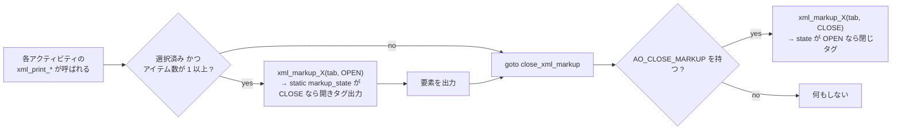

- `enum xml_action { CLOSE_XML_MARKUP = 0, OPEN_XML_MARKUP = 1 }` (`sa.h`)。
- 3 つのヘルパ (`xml_markup_network` / `_power_management` / `_psi`) が
  それぞれ `static int markup_state` を持ち、同じ action での再呼び出しは無視する
  (冪等)。
- `generic_write_stats()` は `TEST_MARKUP(fmt->options) && CLOSE_MARKUP(act->options)`
  なら**選択されていなくても print 関数を呼ぶ** → 閉じタグが必ず 1 回出る。
- 閉じ担当は `act[]` 内のグループ末尾 1 個ずつ:
  `softnet_act` / `pwr_usb_act` / `psi_mem_act`。
- JSON (`json_fmt`) も `FO_TEST_MARKUP` を持つので**全く同じ機構**が働く。

#### 10.5 属性一覧 (順序どおり)

明記なきものは `%.2f` (2 桁小数)。

##### cpu-load → cpu

| モード | 属性順 |
|---|---|
| `DISPLAY_CPU_DEF` | `number`(`%s`), `user`, `nice`, `system`, `iowait`, `steal`, `idle` |
| `DISPLAY_CPU_ALL` | `number`(`%s`), `usr`, `nice`, `sys`, `iowait`, `steal`, `irq`, `soft`, `guest`, `gnice`, `idle` |

`number` は集約行 (`i == 0`) が `"all"`、それ以外は `sprintf("%d", i-1)`。
tickless CPU のフォールバック経路では同じ属性集合で全 0 + `idle="100.00"` を出す。

##### そのほか

| 要素 | 属性順 |
|---|---|
| `process-and-context-switch` | `per`(="second"), `proc`, `cswch` |
| `int-global` | `per` |
| `irq` | `intr`(`%s`, `"sum"` は総和擬似行), `cpu`(`%s`, `"all"`/番号), `value` |
| `swap-pages` | `per`, `pswpin`, `pswpout` |
| `paging` | `per`, `pgpgin`, `pgpgout`, `fault`, `majflt`, `pgfree`, `pgscank`, `pgscand`, `pgsteal`, `pgprom`, `pgdem` |
| `io` (ラッパ) | `per` |
| `io-reads` / `io-writes` / `io-discard` | `rtps`,`bread` / `wtps`,`bwrtn` / `dtps`,`bdscd` |
| `memory` (ラッパ) | `unit`(="kB") |
| `hugepages` (ラッパ) | `unit`(="kB") |
| `kernel` | `dentunusd`, `file-nr`, `inode-nr`, `pty-nr` (**全 `%llu`**) |
| `queue` | `runq-sz`(`%llu`), `plist-sz`(`%llu`), `ldavg-1`,`ldavg-5`,`ldavg-15`(2), `blocked`(`%llu`) |
| `serial` (ラッパ) | `per` |
| `tty` | `line`(**`%d`**), `rcvin`,`xmtin`,`framerr`,`prtyerr`,`brk`,`ovrun` |
| `disk` (ラッパ) | `per` |
| `disk-device` | `dev`(`%s`), `tps`,`rd_sec`,`wr_sec`,`dc_sec`,`rkB`,`wkB`,`dkB`,`avgrq-sz`,`areq-sz`,`avgqu-sz`,`aqu-sz`,`await`,`util-percent` |
| `network` (ラッパ) | `per` |
| `net-dev` | `iface`(`%s`), `rxpck`,`txpck`,`rxkB`,`txkB`,`rxcmp`,`txcmp`,`rxmcst`,`ifutil-percent` |
| `net-edev` | `iface`(`%s`), `rxerr`,`txerr`,`coll`,`rxdrop`,`txdrop`,`txcarr`,`rxfram`,`rxfifo`,`txfifo` |
| `net-nfs` | `call`,`retrans`,`read`,`write`,`access`,`getatt` |
| `net-nfsd` | `scall`,`badcall`,`packet`,`udp`,`tcp`,`hit`,`miss`,`sread`,`swrite`,`saccess`,`sgetatt` |
| `net-sock` | `totsck`,`tcpsck`,`udpsck`,`rawsck`,`ip-frag`,`tcp-tw` (**全 `%u`**) |
| `net-ip` | `irec`,`fwddgm`,`idel`,`orq`,`asmrq`,`asmok`,`fragok`,`fragcrt` |
| `net-eip` | `ihdrerr`,`iadrerr`,`iukwnpr`,`idisc`,`odisc`,`onort`,`asmf`,`fragf` |
| `net-icmp` | `imsg`,`omsg`,`iech`,`iechr`,`oech`,`oechr`,`itm`,`itmr`,`otm`,`otmr`,`iadrmk`,`iadrmkr`,`oadrmk`,`oadrmkr` |
| `net-eicmp` | `ierr`,`oerr`,`idstunr`,`odstunr`,`itmex`,`otmex`,`iparmpb`,`oparmpb`,`isrcq`,`osrcq`,`iredir`,`oredir` |
| `net-tcp` | `active`,`passive`,`iseg`,`oseg` |
| `net-etcp` | `atmptf`,`estres`,`retrseg`,`isegerr`,`orsts` |
| `net-udp` | `idgm`,`odgm`,`noport`,`idgmerr` |
| `net-sock6` | `tcp6sck`,`udp6sck`,`raw6sck`,`ip6-frag` (**全 `%u`**) |
| `net-ip6` | `irec6`,`fwddgm6`,`idel6`,`orq6`,`asmrq6`,`asmok6`,`imcpck6`,`omcpck6`,`fragok6`,`fragcr6` |
| `net-eip6` | `ihdrer6`,`iadrer6`,`iukwnp6`,`i2big6`,`idisc6`,`odisc6`,`inort6`,`onort6`,`asmf6`,`fragf6`,`itrpck6` |
| `net-icmp6` | `imsg6`,`omsg6`,`iech6`,`iechr6`,`oechr6`,`igmbq6`,`igmbr6`,`ogmbr6`,`igmbrd6`,`ogmbrd6`,`irtsol6`,`ortsol6`,`irtad6`,`inbsol6`,`onbsol6`,`inbad6`,`onbad6` |
| `net-eicmp6` | `ierr6`,`idtunr6`,`odtunr6`,`itmex6`,`otmex6`,`iprmpb6`,`oprmpb6`,`iredir6`,`oredir6`,`ipck2b6`,`opck2b6` |
| `net-udp6` | `idgm6`,`odgm6`,`noport6`,`idgmer6` |
| `fchost` | `name`(`%s`), `fch_rxf`,`fch_txf`,`fch_rxw`,`fch_txw` |
| `softnet` | `cpu`(`%s`), `total`,`dropd`,`squeezd`,`rx_rps`,`flw_lim`, `blg_len`(**`%u`**) |
| `cpu-frequency` (ラッパ) | `unit`(="MHz") |
| `cpufreq` | `number`(`%s`), `frequency`(2) |
| `fan-speed` (ラッパ) | `unit`(="rpm") |
| `fan` | `number`(**`%d`, 1 始まり**), `rpm`(**`%llu`**), `drpm`(**`%llu`**), `device`(`%s`) |
| `temperature` (ラッパ) | `unit`(="degree Celsius") |
| `temp` | `number`(**`%d`, 1 始まり**), `degC`(2), `percent-temp`(2), `device`(`%s`) |
| `voltage-input` (ラッパ) | `unit`(="V") |
| `in` | `number`(**`%d`, 0 始まり**), `inV`(2), `percent-in`(2), `device`(`%s`) |
| `cpu-weighted-frequency` (ラッパ) | `unit`(="MHz") |
| `cpuwfreq` | `number`(`%s`), `weighted-frequency`(2) |
| `battery` (ラッパ) | `unit`(="minute") |
| `bat` | `number`(**`%d`**, `bat_id`), `percent-capacity`(**`%u`**), `variation`(2, 符号付き), `status`(`%s`) |
| `usb-devices` (ラッパ) | (属性なし) |
| `usb` | `bus_number`(`%d`), `idvendor`(**`%x`**), `idprod`(**`%x`**), `maxpower`(`%u`, `bmaxpower<<1`), `manufact`(`%s`), `product`(`%s`) |
| `filesystems` (ラッパ) | (属性なし) |
| `filesystem` | **第 1 属性の名前が動的** (`fsname` または `mountp`), `MBfsfree`(**`%.0f`**), `MBfsused`(**`%.0f`**), `fsused-percent`(2), `ufsused-percent`(2), `Ifree`(**`%llu`**), `Iused`(**`%llu`**), `Iused-percent`(2) |
| `psi` (ラッパ) | `per` |
| `psi-cpu` | `some_avg10`,`some_avg60`,`some_avg300`,`some_avg` |
| `psi-io` / `psi-mem` | 上記 4 つ + `full_avg10`,`full_avg60`,`full_avg300`,`full_avg` |

##### `<memory>` / `<hugepages>` のテキスト内容子要素 (順序どおり)

`memory` (`unit="kB"`):
`memfree`, `avail`, `memused`, `memused-percent`(2), `buffers`, `cached`, `commit`,
`commit-percent`(2), `active`, `inactive`, `dirty`, `shared` 〔`DISPLAY_MEMORY`〕
→ + `anonpg`, `slab`, `kstack`, `pgtbl`, `vmused` 〔`DISPLAY_MEM_ALL`〕
→ + `swpfree`, `swpused`, `swpused-percent`(2), `swpcad`, `swpcad-percent`(2) 〔`DISPLAY_SWAP`〕
(整数系は `%llu`)

`hugepages` (`unit="kB"`):
`hugfree`, `hugused`, `hugused-percent`(2), `hugrsvd`, `hugsurp`

#### 10.6 🔴 XML の属性名の罠 — JSON との差分

XML と JSON は「ほぼ同じだが微妙に名前が違う」ため、
片方から機械的に変換すると壊れる。差分一覧:

| 意味 | XML 属性/要素名 | JSON キー名 |
|---|---|---|
| ファイルシステム名 | `fsname` | `filesystem` |
| マウントポイント | `mountp` | `mountpoint` |
| `%fsused` | `fsused-percent` | `%fsused` |
| `%ufsused` | `ufsused-percent` | `%ufsused` |
| `%Iused` | `Iused-percent` | `%Iused` |
| FC ホスト名 | `name` | `fchost` |
| ディスク名 | `dev` | `disk-device` |
| CPU 番号 (cpu-load) | `number` | `cpu` |
| tps (A_IO) | `<tps>` テキスト | `"tps"` キー |
| メモリ各値 | 子要素のテキスト | フラットなキー |
| 単位 | `unit="…"` / `per="second"` 属性がある | **単位属性は存在しない** |

XML にしかないもの: `per="second"` (ラッパの単位表明)、`unit="…"`、
`<int-global>` という中間ラッパ (JSON の `interrupts` にはない)。

JSON では `interrupts` の 1 要素が 1 割込 × 全 CPU (`{"intr": "sum", "all": …, "CPU0": …}`)
だが、**XML では 1 要素が 1 割込 × 1 CPU** (`<irq intr="sum" cpu="all" value="…"/>`)。
構造が本質的に違う。

#### 10.7 同梱スキーマ (`xml/`)

| ファイル | 行数 | 宣言バージョン | ルート |
|---|---|---|---|
| `sysstat-3.18.dtd` | 668 | コメント `DTD v3.18 for sysstat. See sadf.h` | `sysstat` |
| `sysstat.xsd` | 852 | `xs:appinfo` に `XML Schema v3.18 for sysstat. See sadf.h` | `sysstat` (型 `sysstat-type`) |

`sadf.h` の `#define XML_DTD_VERSION "3.18"` とファイル名・埋め込みバージョンが一致。

共通のトップレベル構造:
`sysstat(sysdata-version, host)` →
`host(sysname, release, machine, number-of-cpus, file-date, file-utc-time, timezone?, statistics?, restarts?, comments?)` →
`statistics(timestamp*)` → `timestamp(16 アクティビティ、全て省略可・最大 1)` →
`restarts(boot*)` / `comments(comment*)`。

**DTD と XSD の実質的な差**:
DTD は `<!ELEMENT host (%HOST_ELEMENTS;)+>` /
`<!ELEMENT timestamp (%TIMESTAMP_ELEMENTS;)+>` と**順不同・繰り返し可**の
選択リストで書かれているのに対し、XSD は `xs:sequence` +
`minOccurs="0" maxOccurs="1"` で**順序と個数を固定**している。
つまり DTD の方が緩い。

XSD の代表的な型:

| 要素/属性 | 型 |
|---|---|
| `cpu/@number` | `xs:string` |
| `cpu/@user` 他レート系 | `hundredth-type` (`xs:float` + パターン `\d*\.\d\d`、**負値不可**) |
| `memory/memfree` 他 | `xs:nonNegativeInteger` |
| `memory/*-percent` | `hundredth-type` |
| `memory/frmpg`,`bufpg`,`campg` (レガシー) | `negative-hundredth-type` (負値可) — **現行コードは出力しない** |
| `filesystem/@fsname`, `@mountp` | `xs:string` (どちらも任意、「排他」制約は無い) |
| `bat/@number`, `@percent-capacity` | `xs:nonNegativeInteger` |
| `bat/@variation` | `negative-hundredth-type` (負値可 — 実測 `variation="-3.85"`) |
| `fan/@rpm` | `xs:nonNegativeInteger` |
| `fan/@drpm` | `xs:integer` (符号付き。ただし C 側は `%llu`) |
| `net-sock/*`, `net-sock6/*` | `xs:nonNegativeInteger` |
| `unit` 属性 | 要素ごとに 1 値のみの `xs:enumeration` (`unit-type`="kB", `frequnit-type`="MHz", `fanunit-type`="rpm", `tempunit-type`="degree Celsius", `inunit-type`="V", `batunit-type`="minute") |

スキーマの穴: `disk-device+` / `filesystem+` は「1 個以上」と宣言されているが、
`--dev=` / `--fs=` のフィルタで 0 件になると空の
`<disk per="second"></disk>` / `<filesystems></filesystems>` が出て制約違反になり得る
(`net-dev*` / `cpu*` などは `*` なので問題ない)。**要検証** (実際に 0 件になるデータで
`xmllint --dtdvalid` が通るか)。

テスト側の検証コマンド:
```sh
# tests/01557 : XSD 検証
cat tests/out.data-11.6.5-sadf-x.tmp | $VER_XML --schema ${T_SRCDIR}/xml/sysstat.xsd -
# tests/01559 : DTD 検証
cat tests/out.data-11.6.5-sadf-x.tmp | $VER_XML --dtdvalid ${T_SRCDIR}/xml/sysstat-*.dtd -
# tests/01547 / 01657 : JSON 検証 ($VER_JSON = json_verify 等)
cat tests/out.data-11.6.5-sadf-j.tmp | $VER_JSON
```

#### 10.8 検証 (`tests/expected.sadf-x`, `sadf -x tests/data.tmp -C -- -A`)

```
				<io per="second">
					<tps>20.85</tps>
					<io-reads rtps="12.83" bread="57.43"/>
				<memory unit="kB">
					<memfree>1437740</memfree>
				<queue runq-sz="3" plist-sz="956" ldavg-1="3.16" ldavg-5="3.24" ldavg-15="3.43" blocked="0"/>
					<irq intr="sum" cpu="all" value="31915.30"/>
					<irq intr="sum" cpu="0" value="5759.67"/>
```

#### 10.9 検証 (`tests/expected.data-11.6.5-sadf-x`)

```
				<power-management>
					<fan-speed unit="rpm">
						<fan number="1" rpm="1283" drpm="1283" device="f71858fg-isa-0200"/>
					<temperature unit="degree Celsius">
						<temp number="1" degC="34.00" percent-temp="48.57" device="f71858fg-isa-0200"/>
					<voltage-input unit="V">
						<in number="0" inV="3.33" percent-in="0.00" device="f71858fg-isa-0200"/>
```

#### 10.10 検証 (`tests/expected1.sadf-x`, `sadf -x tests/datax.tmp -C 1 2 -- -uw -P 0-2`)

```
					<cpu number="0" user="2.71" nice="0.03" system="3.12" iowait="0.00" steal="0.00" idle="94.14"/>
					<cpu number="1" user="2.85" nice="0.00" system="5.16" iowait="0.00" steal="0.00" idle="91.99"/>
					<cpu number="2" user="2.25" nice="0.03" system="1.86" iowait="0.68" steal="0.00" idle="95.18"/>
```

`-P 0-2` は `all` を含まないので `number="all"` の行が**出ない**。
`-P ALL` / `-A` なら bit 0 が立って `all` 行が先頭に来る。

#### 10.11 検証 (`tests/expected2.sadf-fs`, `sadf -x --fs=/dev/sda6,/home tests/data.tmp -- -F MOUNT`)

```
					<filesystem mountp="/home" MBfsfree="705" MBfsused="145" fsused-percent="17.04" ufsused-percent="18.92" Ifree="6008414" Iused="102818" Iused-percent="1.68"/>
					<filesystem mountp="/data" MBfsfree="273" MBfsused="206" fsused-percent="42.93" ufsused-percent="51.97" Ifree="19201593" Iused="455" Iused-percent="0.00"/>
```

`-F MOUNT` で属性名が `mountp` になり、`--fs=/dev/sda6` は
**デバイス名で照合されるのに表示はマウントポイント** (`/data`) になる。
`match_sa_filesystem_item()` が「表示名 / デバイス名 / マウントポイント」の
いずれにもマッチさせるため。

#### 10.12 検証 (`tests/expected.data-wghfreq-sadf-x`, `sadf -x … -- -m FREQ -P ALL`)

```
				<power-management>
					<cpu-weighted-frequency unit="MHz">
						<cpuwfreq number="all" weighted-frequency="1123.35"/>
						<cpuwfreq number="0" weighted-frequency="1200.33"/>
```

このファイルには `fan-speed` は含まれない (`grep -c fan-speed` = 0)。


### 11. `-d` / `-p` アクティビティ別フィールド一覧

**凡例 (値フォーマット)**

| 記号 | フラグ | printf | 意味 |
|---|---|---|---|
| **R2** | `PT_NOFLAG` | `%.2f` | 実数 2 桁 (既定。レート・パーセントはほぼすべてこれ) |
| **I** | `PT_USEINT` | `%llu` | 整数 |
| **R0** | `PT_USERND` | `%.0f` | 実数を四捨五入して小数なし |
| **S** | `PT_USESTR` | `%s` | 文字列 |

「アイテム」列は `-p` の第 4 フィールド / `-d` のキー列に入る値。
各アクティビティの**最後**のフィールドが `PT_NEWLIN` を追加で持つ
(`-h` 時は落ちる)。

| アクティビティ | アイテム (`-p` / `-d`) | フィールド順 (名前: 形式) |
|---|---|---|
| A_CPU (`-u`) | `all`/`cpu<N>` / `-1`/`<N>` | `%user`:R2, `%nice`:R2, `%system`:R2, `%iowait`:R2, `%steal`:R2, `%idle`:R2 |
| A_CPU (`-u ALL`) | 同上 | `%usr`:R2, `%nice`:R2, `%sys`:R2, `%iowait`:R2, `%steal`:R2, `%irq`:R2, `%soft`:R2, `%guest`:R2, `%gnice`:R2, `%idle`:R2 |
| A_PCSW | `-` / (なし) | `proc/s`:R2, `cswch/s`:R2 |
| A_IRQ | 割込名 (`sum`/番号/名前) | **特殊** (下記 11.1) |
| A_SWAP | `-` | `pswpin/s`:R2, `pswpout/s`:R2 |
| A_PAGE | `-` | `pgpgin/s`, `pgpgout/s`, `fault/s`, `majflt/s`, `pgfree/s`, `pgscank/s`, `pgscand/s`, `pgsteal/s`, `pgprom/s`, `pgdem/s` (全 R2) |
| A_IO | `-` | `tps`, `rtps`, `wtps`, `dtps`, `bread/s`, `bwrtn/s`, `bdscd/s` (全 R2) |
| A_MEMORY (メモリ部) | `-` | `kbmemfree`:I, `kbavail`:I, `kbmemused`:I, `%memused`:R2, `kbbuffers`:I, `kbcached`:I, `kbcommit`:I, `%commit`:R2, `kbactive`:I, `kbinact`:I, `kbdirty`:I, **`kbshared`**:I 〔+ `-r ALL` で `kbanonpg`:I, `kbslab`:I, `kbkstack`:I, `kbpgtbl`:I, `kbvmused`:I〕 |
| A_MEMORY (スワップ部) | `-` | `kbswpfree`:I, `kbswpused`:I, `%swpused`:R2, `kbswpcad`:I, `%swpcad`:R2 |
| A_KTABLES | `-` | `dentunusd`:I, `file-nr`:I, `inode-nr`:I, `pty-nr`:I |
| A_QUEUE | `-` | `runq-sz`:I, `plist-sz`:I, `ldavg-1`:R2, `ldavg-5`:R2, `ldavg-15`:R2, `blocked`:I |
| A_SERIAL | `ttyS<N>` / `<N>` | `rcvin/s`, `xmtin/s`, `framerr/s`, `prtyerr/s`, `brk/s`, `ovrun/s` (全 R2) |
| A_DISK | デバイス名 | `tps`, `rkB/s`, `wkB/s`, `dkB/s`, `areq-sz`, `aqu-sz`, `await`, `%util` (全 R2) |
| A_NET_DEV | インタフェース名 | `rxpck/s`, `txpck/s`, `rxkB/s`, `txkB/s`, `rxcmp/s`, `txcmp/s`, `rxmcst/s`, `%ifutil` (全 R2) |
| A_NET_EDEV | インタフェース名 | `rxerr/s`, `txerr/s`, `coll/s`, `rxdrop/s`, `txdrop/s`, `txcarr/s`, `rxfram/s`, `rxfifo/s`, `txfifo/s` (全 R2) |
| A_NET_NFS | `-` | `call/s`, `retrans/s`, `read/s`, `write/s`, `access/s`, `getatt/s` (全 R2) |
| A_NET_NFSD | `-` | `scall/s`, `badcall/s`, `packet/s`, `udp/s`, `tcp/s`, `hit/s`, `miss/s`, `sread/s`, `swrite/s`, `saccess/s`, `sgetatt/s` (全 R2) |
| A_NET_SOCK | `-` | `totsck`:I, `tcpsck`:I, `udpsck`:I, `rawsck`:I, `ip-frag`:I, `tcp-tw`:I |
| A_NET_IP | `-` | `irec/s`, `fwddgm/s`, `idel/s`, `orq/s`, `asmrq/s`, `asmok/s`, `fragok/s`, `fragcrt/s` (全 R2) |
| A_NET_EIP | `-` | `ihdrerr/s`, `iadrerr/s`, `iukwnpr/s`, `idisc/s`, `odisc/s`, `onort/s`, `asmf/s`, `fragf/s` (全 R2) |
| A_NET_ICMP | `-` | `imsg/s`, `omsg/s`, `iech/s`, `iechr/s`, `oech/s`, `oechr/s`, `itm/s`, `itmr/s`, `otm/s`, `otmr/s`, `iadrmk/s`, `iadrmkr/s`, `oadrmk/s`, `oadrmkr/s` (全 R2) |
| A_NET_EICMP | `-` | `ierr/s`, `oerr/s`, `idstunr/s`, `odstunr/s`, `itmex/s`, `otmex/s`, `iparmpb/s`, `oparmpb/s`, `isrcq/s`, `osrcq/s`, `iredir/s`, `oredir/s` (全 R2) |
| A_NET_TCP | `-` | `active/s`, `passive/s`, `iseg/s`, `oseg/s` (全 R2) |
| A_NET_ETCP | `-` | `atmptf/s`, `estres/s`, `retrseg/s`, `isegerr/s`, `orsts/s` (全 R2) |
| A_NET_UDP | `-` | `idgm/s`, `odgm/s`, `noport/s`, `idgmerr/s` (全 R2) |
| A_NET_SOCK6 | `-` | `tcp6sck`:I, `udp6sck`:I, `raw6sck`:I, `ip6-frag`:I |
| A_NET_IP6 | `-` | `irec6/s`, `fwddgm6/s`, `idel6/s`, `orq6/s`, `asmrq6/s`, `asmok6/s`, `imcpck6/s`, `omcpck6/s`, `fragok6/s`, `fragcr6/s` (全 R2) |
| A_NET_EIP6 | `-` | `ihdrer6/s`, `iadrer6/s`, `iukwnp6/s`, `i2big6/s`, `idisc6/s`, `odisc6/s`, `inort6/s`, `onort6/s`, `asmf6/s`, `fragf6/s`, `itrpck6/s` (全 R2) |
| A_NET_ICMP6 | `-` | `imsg6/s`, `omsg6/s`, `iech6/s`, `iechr6/s`, `oechr6/s`, `igmbq6/s`, `igmbr6/s`, `ogmbr6/s`, `igmbrd6/s`, `ogmbrd6/s`, `irtsol6/s`, `ortsol6/s`, `irtad6/s`, `inbsol6/s`, `onbsol6/s`, `inbad6/s`, `onbad6/s` (全 R2) — **`oech6/s` は存在しない** |
| A_NET_EICMP6 | `-` | `ierr6/s`, `idtunr6/s`, `odtunr6/s`, `itmex6/s`, `otmex6/s`, `iprmpb6/s`, `oprmpb6/s`, `iredir6/s`, `oredir6/s`, `ipck2b6/s`, `opck2b6/s` (全 R2) |
| A_NET_UDP6 | `-` | `idgm6/s`, `odgm6/s`, `noport6/s`, `idgmer6/s` (全 R2) |
| A_PWR_CPU | `all`/`cpu<N>` / `-1`/`<N>` | `MHz`:R2 (生値/100)。`cpufreq == 0` の CPU は**スキップ** |
| A_PWR_FAN | `fan<N>`/`<N>` (**1 始まり**) | `DEVICE`:S, `rpm`:**R2**, `drpm`:**R2** |
| A_PWR_TEMP | `temp<N>`/`<N>` (**1 始まり**) | `DEVICE`:S, `degC`:R2, `%temp`:R2 |
| A_PWR_IN | `in<N>`/`<N>` (**0 始まり**) | `DEVICE`:S, `inV`:R2, `%in`:R2 |
| A_HUGE | `-` | `kbhugfree`:I, `kbhugused`:I, `%hugused`:R2, `kbhugrsvd`:I, `kbhugsurp`:I |
| A_PWR_FREQ | `all`/`cpu<N>` / `-1`/`<N>` | `wghMHz`:R2 |
| A_PWR_USB | `bus<N>`/`<N>` | `idvendor`:S(16進), `idprod`:S(16進), `maxpower`:I(`bmaxpower<<1`), `manufact`:S, `product`:S 🔴 (下記 11.2) |
| A_FS | FS 名 / マウントポイント | `MBfsfree`:**R0**, `MBfsused`:**R0**, `%fsused`:R2, `%ufsused`:R2, `Ifree`:I, `Iused`:I, `%Iused`:R2 |
| A_NET_FC | FC ホスト名 | `fch_rxf/s`, `fch_txf/s`, `fch_rxw/s`, `fch_txw/s` (全 R2) |
| A_NET_SOFT | `all`/`cpu<N>` / `-1`/`<N>` | `total/s`, `dropd/s`, `squeezd/s`, `rx_rps/s`, `flw_lim/s` (R2), `blg_len`:I |
| A_PSI_CPU | `-` | `%scpu-10`, `%scpu-60`, `%scpu-300`, `%scpu` (全 R2) |
| A_PSI_IO | `-` | `%sio-10`, `%sio-60`, `%sio-300`, `%sio`, `%fio-10`, `%fio-60`, `%fio-300`, `%fio` (全 R2) |
| A_PSI_MEM | `-` | `%smem-10`, `%smem-60`, `%smem-300`, `%smem`, `%fmem-10`, `%fmem-60`, `%fmem-300`, `%fmem` (全 R2) |
| A_PWR_BAT | `BAT<N>`/`<N>` (`bat_id`) | `%cap`:**I**, `cap/min`:R2, `status`:**S** (`bat_status[]` の文字列) |

> `-d` / `-p` では `MBfsfree` / `MBfsused` が `%.0f` (R0) の 2 箇所だけが
> `PT_USERND` の全用途。それ以外の実数は全て `%.2f`。

#### 11.1 A_IRQ の特殊な形

A_IRQ だけは「フィールド名の位置に CPU ラベルを入れる」逆転構造。
(irq, cpu) の組ごとに 1 回 `render()` を呼ぶ。

- `-p`: `pptxt = "%s"` に `cons(sv, "<irq名>\t<cpuラベル>", NOVAL)` を渡す
  → 1 行 = `host \t itv \t ts \t <irq名> \t <cpuラベル> \t <値>`。
  cpu ラベルは `all` / `cpu0` / `cpu1` …。
- `-d`: その irq の**最初の CPU 列だけ** `dbtxt = "%s"` + `mid = irq名`
  (= キー列を出す)。2 つ目以降の CPU 列は `;値` だけを追加する。
  行の最後は `render(isdb, pre, PT_NEWLIN, NULL, NULL, NULL, NOVAL, NOVAL, NULL)`
  という**値を 1 つも出さず改行だけする呼び出し**で閉じる
  (`PT_USEINT`/`USESTR`/`USERND`/`NOFLAG` のどれも立っていないため)。
  この「値なし改行専用呼び出し」は全ファイル中ここだけ。
- `-d` のヘッダは `INTR;CPU*` (`*` = 「選択 CPU 数ぶん列が可変」の印)。

##### 検証 (`tests/expected.sadf-d` / `expected.sadf-p`)

```
# hostname;interval;timestamp;INTR;CPU*
SYSSTAT.TEST;31;2019-04-18 13:20:19 UTC;sum;31915.30;5759.67;11829.29;2990.76;1027.05;2952.81;5880.88;4898.65;587.30
SYSSTAT.TEST;31;2019-04-18 13:20:19 UTC;0;0.00;0.00;0.00;0.00;0.00;0.00;0.00;0.00;0.00
```
```
SYSSTAT.TEST<TAB>31<TAB>2019-04-18 13:20:19 UTC<TAB>sum<TAB>all<TAB>31915.30
```

#### 11.2 🔴 `-d` のヘッダ行と実データ列がずれる既知バグ 2 件

ヘッダ行 (`activity.c` の `hdr_line`) と実際の値の並び (`rndr_stats.c` の
`render()` 呼び出し順) は**別々に手で保守されており、整合性は保証されていない**。
43 アクティビティを突き合わせて見つかった食い違いは以下の 2 件。

##### (a) A_MEMORY: ラベル名の不一致 (列位置は正しい)

| | 名前 |
|---|---|
| `-p` のフィールド名 (`rndr_stats.c`) | **`kbshared`** |
| `-d` のヘッダ (`activity.c` の `hdr_line`) | **`kbshmem`** |
| `-j` / `-x` | `shared` / `<shared>` |

列位置 (`kbdirty` の次) は一致しているので値は正しい。ラベルだけが違う。

```
tests/expected.sadf-p:2040  SYSSTAT.TEST<TAB>31<TAB>2019-04-18 13:20:19 UTC<TAB>-<TAB>kbshared<TAB>87980
tests/expected.sadf-d:235   # hostname;interval;timestamp;…;kbdirty;kbshmem;kbanonpg;…
```

##### (b) A_PWR_USB: `-d` のヘッダ列順が実データと**一致しない** (真のバグ)

`hdr_line` は `manufact;product;BUS;idvendor;idprod;maxpower` だが、
実際の `render()` 呼び出し順は `BUS` → `idvendor` → `idprod` → `maxpower` →
`manufact` → `product`。

```
tests/expected.sadf-d:561  # hostname;interval;timestamp;manufact;product;BUS;idvendor;idprod;maxpower
tests/expected.sadf-d:562  SYSSTAT.TEST;31;2019-04-18 13:20:29 UTC;1;3f0;862;196;HP;HP Wireless Keyboard Mouse Kit
tests/expected.sadf-d:563  SYSSTAT.TEST;31;2019-04-18 13:20:29 UTC;3;174c;55aa;0;ASMT;ASM1153
tests/expected.sadf-d:565  SYSSTAT.TEST;22;2019-04-18 13:20:49 UTC;3;5e3;608;200;;USB2.0 Hub
```

第 4 列はヘッダでは `manufact` だが実データは `1` (= BUS)。
`-p` は毎行に名前が付くので影響なし:

```
tests/expected.sadf-p:4053  SYSSTAT.TEST<TAB>31<TAB>2019-04-18 13:20:29 UTC<TAB>bus1<TAB>idvendor<TAB>3f0
tests/expected.sadf-p:4054  SYSSTAT.TEST<TAB>31<TAB>2019-04-18 13:20:29 UTC<TAB>bus1<TAB>idprod<TAB>862
tests/expected.sadf-p:4055  SYSSTAT.TEST<TAB>31<TAB>2019-04-18 13:20:29 UTC<TAB>bus1<TAB>maxpower<TAB>196
tests/expected.sadf-p:4056  SYSSTAT.TEST<TAB>31<TAB>2019-04-18 13:20:29 UTC<TAB>bus1<TAB>manufact<TAB>HP
```

**Rust 実装では本家のこの挙動 (ヘッダは間違ったまま、データは実際の順)
をそのまま再現しないとテスト期待値と一致しない。**
また空文字列の `manufact` はそのまま空フィールド (`;;`) になる (565 行目)。

#### 11.3 `-d` / `-p` と他フォーマットでの CPU オフライン扱いの差

| フォーマット | オフライン CPU |
|---|---|
| `-d` / `-p` | `get_global_cpu_statistics()` が作る `offline_cpu_bitmap` により**除外** |
| `-x` / `-j` | 同様に除外 (配列/要素に現れない) |
| `-r` | **必ず出す** (`raw_stats.c` に明記のコメントあり)。`-O debug` で `[OFF]` が付く |


### 12. オプション × フォーマット 影響マトリクス

`✓` = 有効、`✗` = `check_format_options()` で落とされる / 解析されない、
`—` = 無関係。

| オプション | `-H` | `-d` | `-p` | `-j` | `-x` | `-r` | `-c` | `-g` | `-l` |
|---|---|---|---|---|---|---|---|---|---|
| `-H` (併用) | — | ✗ | ✗ | ✓ | ✓ | ✗ | ✗ | ✓ | ✓ |
| `-h` (横並び) | ✗ | **✓** | ✗ | ✗ | ✗ | ✗ | ✗ | ✗ | ✗ |
| `-T` (local time) | — | ✓ | ✓ | ✓ | ✓ | ✓ | ✗ | ✓ | ✓ |
| `-t` (true time) | — | ✓ | ✓ | ✓ | ✓ | ✓ | ✗ | ✓ | **✗** (`FO_NO_TRUE_TIME`) |
| `-U` (epoch 秒) | — | **✓** | **✓** | ✗ | ✗ | **✓** | ✗ | ✗ | ✗ |
| `-C` (コメント表示) | — | ✓ | ✓ | ✓ | ✓ | ✓ | — | — | ✓ |
| `-s` / `-e` | — | ✓ | ✓ | ✓ | ✓ | ✓ | — | ✓ | ✓ |
| `-P <list>|ALL` | — | ✓ | ✓ | ✓ | ✓ | ✓ | — | ✓ | ✓ |
| `--dev=` | — | ✓ | ✓ | ✓ | ✓ | ✓ | — | ✓ | ✓ |
| `--iface=` | — | ✓ | ✓ | ✓ | ✓ | ✓ | — | ✓ | ✓ |
| `--fs=` | — | ✓ | ✓ | ✓ | ✓ | ✓ | — | ✓ | ✓ |
| `--int=` | — | ✓ | ✓ | ✓ | ✓ | ✓ | — | ✓ | ✓ |
| `-O debug` | — | — | — | — | — | **✓** | — | 一部 | — |
| `-O <SVG opts>` | — | — | — | — | — | — | — | ✓ | — |
| `-O hz=<N>` | — | — | — | — | — | — | **✓** | — | — |
| `-O pcparchive=<f>` | — | — | — | — | — | — | — | — | ✓ |
| `--dec=` | ✗ | ✗ | ✗ | ✗ | ✗ | ✗ | ✗ | ✗ | ✗ |
| `--human` | ✗ | ✗ | ✗ | ✗ | ✗ | ✗ | ✗ | ✗ | ✗ |
| `-V` | 即座に版を表示して終了 (全フォーマット共通) |
| `-<N>` (N 日前) | — | ✓ | ✓ | ✓ | ✓ | ✓ | ✓ | ✓ | ✓ |
| `<interval> <count>` | — | ✓ | ✓ | ✓ | ✓ | ✓ | — | ✓ | ✓ |
| `-- <sar_options>` | — | ✓ | ✓ | ✓ | ✓ | ✓ | ✗ | ✓ | ✓ |

**`--dec=` / `--human` について**:
どちらも `sadf` のオプションパーサに分岐が存在しない。
`--` の後に置いても `parse_sar_opt()` は 1 文字ずつ走査する実装なので
`-`,`-`,`d`,`e`,`c`… と解釈され、実質エラーになる。
`man/sadf.in` の SYNOPSIS にも載っていない。
値の小数桁は**フォーマット別に固定** (8.5 / 9.3 節)。

`-- -h` (sar オプションとしての `-h`) は `S_F_PRETTY + S_F_UNIT` を立てる。
`S_F_UNIT` (human) はどの sadf 出力経路からも参照されないが、
`S_F_PRETTY` は `get_device_name()` 経由でブロックデバイス名の表示に効く
(全フォーマット共通)。

`-T` / `-t` / `-U` は相互排他 (2 つ以上で usage エラー)。

環境変数:

| 変数 | 影響 |
|---|---|
| `S_TIME_DEF_TIME` | `USE_PREFD_TIME_OUTPUT` を立てると時刻が `%X` (ロケール書式) になる |
| `S_COLORS` / `S_COLORS_PALETTE` | `-O customcol` 時の SVG 配色、および `cprintf_*` の色付け |
| `TZ` | `-T` の `my_tzname` と時刻変換 |
| `LC_ALL` / `LC_NUMERIC` | `-H` の翻訳メッセージ。`-j` / `-g` は `FO_LC_NUMERIC_C` で小数点を `.` に固定 |

`sadf -V` (`tests/expected.sadf-V-env`, `sadf --getenv -V`):

```
S_COLORS_PALETTE=0=000000:1=1a1aff
S_TIME_DEF_TIME=UTC
sysstat version 99.9.9
(C) Sebastien Godard (sysstat <at> orange.fr)
```

(`--getenv` は TEST ビルド専用。通常は環境変数行は出ない)

---

### 13. テスト期待値ファイルと生成コマンドの対応表

`tests/<番号>` がテストスクリプト本体。全て `${T_SRCDIR}` = ソースツリーの
`tests/` を指し、`diff -u <期待値> <実出力>` で検証する。
`LC_ALL=C` / `TZ=GMT` は明記されたものだけ。

#### 13.1 主要フォーマット (`tests/data.tmp`、`-A` で全アクティビティ)

| テスト | 期待値 | コマンド |
|---|---|---|
| 00500 | `expected.sadf-p` | `LC_ALL=C ./sadf -p tests/data.tmp -C -- -A` |
| 00510 | `expected.sadf-d` | `LC_ALL=C ./sadf -d tests/data.tmp -C -- -A` |
| 00512 | `expected.sadf-dh` | `LC_ALL=C ./sadf -dh tests/data.tmp -- -Iu ALL -P all,3` |
| 00515 | `expected.sadf-d-qu` | `LC_ALL=C ./sadf -d tests/data.tmp -- -qu` |
| 00520 | `expected.sadf-x` | `LC_ALL=C ./sadf -x tests/data.tmp -C -- -A` |
| 00525 | `expected1.sadf-x` | `LC_ALL=C ./sadf -x tests/datax.tmp -C 1 2 -- -uw -P 0-2` |
| 00530 | `expected.sadf-j` | `./sadf -j tests/data.tmp -C -- -A` |
| 00540 | `expected.sadf-g` | `LC_ALL=C ./sadf -g tests/data.tmp -C -- -A` |
| 00545 | `expected1.sadf-g` | `LC_ALL=C ./sadf -g tests/data.tmp -- -F MOUNT` |
| 00550 | `expected2.sadf-g` | `LC_ALL=C TZ=GMT ./sadf -g -O autoscale,packed,oneday,showidle,showtoc,skipempty,showinfo,bwcol tests/data.tmp -T -C -- -A` |
| 00542 | `expected3.sadf-g` | `LC_ALL=C ./sadf -O height=370 -g tests/data.tmp` |
| 00555 | `expected.sadf-g-cc` | `LC_ALL=C TZ=GMT S_COLORS_PALETTE="…" ./sadf -g --getenv -O customcol tests/data.tmp -C` |
| 00560 | `expected.sadf-H` | `LC_ALL=C ./sadf -H tests/data.tmp` |
| 00570 | `expected.sadf-r` | `./sadf -r -O debug tests/data.tmp -C -- -A` |

#### 13.2 アイテムフィルタ / 時刻範囲

| テスト | 期待値 | コマンド |
|---|---|---|
| 00580 | `expected.sadf-se` | `LC_ALL=C ./sadf -d -s 13:20:20 -e 13:20:40 --iface=enp6s1 --dev=sda --fs=/dev/sda6 tests/data.tmp -- -n DEV -Fdp` |
| 00581 | `expected.sadf-fs` | `LC_ALL=C ./sadf -j --fs=/dev/sda6,/home tests/data.tmp -- -F` |
| 00582 | `expected2.sadf-fs` | `LC_ALL=C ./sadf -x --fs=/dev/sda6,/home tests/data.tmp -- -F MOUNT` |
| 00585 | `expected.sadf-i` | `LC_ALL=C ./sadf -d --iface=enp6s0 tests/data-long.tmp -- -n DEV 65` |
| 01955 | `expected.sadf-s-epoch` | `LC_ALL=C ./sadf -d tests/data.tmp -s 1590939000` (**期待値は 0 バイト**) |
| 01957 | `expected.sadf-T-s-epoch` | `LC_ALL=C TZ="Europe/Paris" ./sadf -d tests/data.tmp -T -s 1555595349` |
| 01960 | `expected.sadf-U-se-epoch` | `LC_ALL=C ./sadf -d tests/data.tmp -U -s 1555593629 -e 1555594649` |
| 01977 | `expected2.sadf-se` | `LC_ALL=C TZ=GMT ./sadf -d tests/data.tmp -s 13:20:19 -e 1555595649` |

#### 13.3 タイムゾーン変種 (`tests/data-tz.tmp` = `TZ="Europe/Paris"` で収集)

すべて `TZ="America/New_York"` で sadf を実行する。

| テスト | 期待値 | コマンド |
|---|---|---|
| 01900 | `expected.sadf-tz` | `… ./sadf -g tests/data-tz.tmp -- -uw \| grep ":20:"` |
| 01905 | `expected.sadf-T-tz` | `… ./sadf -g tests/data-tz.tmp -T -- -uw \| grep ":20:"` |
| 01908 | `expected.sadf-t-tz` | `… ./sadf -g tests/data-tz.tmp -t -- -uw` |
| 01910 | `expected.sadf-d-tz` | `… ./sadf -d tests/data-tz.tmp -- -uw` |
| 01915 | `expected.sadf-d-T-tz` | `… ./sadf -d tests/data-tz.tmp -T -- -uw` |
| 01918 | `expected.sadf-d-t-tz` | `… ./sadf -d tests/data-tz.tmp -t -- -uw` |
| 01920 | `expected.sadf-r-tz` | `… ./sadf -r tests/data-tz.tmp -- -uw` |
| 01925 | `expected.sadf-r-T-tz` | `… ./sadf -r tests/data-tz.tmp -T -- -uw` |
| 01928 | `expected.sadf-r-t-tz` | `… ./sadf -r tests/data-tz.tmp -t -- -uw` |

> ⚠️ `-T` / `-t` 版はファイル名が大文字小文字だけ違うため、
> case-insensitive FS では衝突する (1.2 節の注記)。

#### 13.4 旧バージョンファイル (`-c` 変換の検証も含む)

| テスト | 期待値 | コマンド |
|---|---|---|
| 00620 | (なし) | `./sadf -c ${T_SRCDIR}/tests/data-11.6.5 > tests/data-11.6.5.tmp` ← **`-c` の実行** |
| 00625 | `expected.data-11.6.5` | `LC_ALL=C TZ=GMT ./sar -C -A -f tests/data-11.6.5.tmp` ← 変換結果を sar で検証 |
| 01500 | `expected.data-11.6.5-sadf-d` | `LC_ALL=C TZ=GMT ./sadf -d tests/data-11.6.5.tmp -- -m FAN,IN,TEMP` |
| 01510 | `expected.data-11.6.5-sadf-p` | `LC_ALL=C TZ=GMT ./sadf -p tests/data-11.6.5.tmp -- -m FAN,IN,TEMP` |
| 01520 | `expected.data-11.6.5-sadf-r` | `LC_ALL=C TZ=GMT ./sadf -r tests/data-11.6.5.tmp -- -m FAN,IN,TEMP` |
| 01530 | `expected.data-11.6.5-sadf-g` | `LC_ALL=C TZ=GMT ./sadf -g tests/data-11.6.5.tmp -- -m FAN,IN,TEMP` |
| 01540 | `expected.data-11.6.5-sadf-j` | `LC_ALL=C TZ=GMT ./sadf -j tests/data-11.6.5.tmp -- -m FAN,IN,TEMP` |
| 01550 | `expected.data-11.6.5-sadf-x` | `LC_ALL=C TZ=GMT ./sadf -x tests/data-11.6.5.tmp -- -m FAN,IN,TEMP` |
| 01547 | (検証のみ) | `cat tests/out.data-11.6.5-sadf-j.tmp \| $VER_JSON` |
| 01557 | (検証のみ) | `cat tests/out.data-11.6.5-sadf-x.tmp \| $VER_XML --schema ${T_SRCDIR}/xml/sysstat.xsd -` |
| 01559 | (検証のみ) | `cat tests/out.data-11.6.5-sadf-x.tmp \| $VER_XML --dtdvalid ${T_SRCDIR}/xml/sysstat-*.dtd -` |
| 00655 | `expected.data-12.0.0-H` | `LC_ALL=C TZ=GMT ./sadf -H ${T_SRCDIR}/tests/data-12.0.0 \| grep -v 0x2175` (+ `grep 0x2175` で 1 行目の存在確認) |
| 00660 | `expected.sadf-H-hz` | `LC_ALL=C TZ=GMT ./sadf -H tests/data-9.1.6-hz.tmp` |
| 00664 | `expected.sadf-r-hz` | `LC_ALL=C TZ=GMT ./sadf -r -O debug tests/data-9.1.6-hz.tmp` |

#### 13.5 重み付き CPU 周波数 (`tests/data-wghfreq.tmp`)

生成 (01600): `TZ=GMT ./sadc --unix_time=1555593609 -S A_NULL,A_PWR_FREQ tests/data-wghfreq.tmp 1 3`

| テスト | 期待値 | コマンド |
|---|---|---|
| 01620 | `expected.data-wghfreq-sadf-d` | `LC_ALL=C TZ=GMT ./sadf -d tests/data-wghfreq.tmp -- -m FREQ -P ALL` |
| 01630 | `expected.data-wghfreq-sadf-p` | `LC_ALL=C TZ=GMT ./sadf -p tests/data-wghfreq.tmp -- -m FREQ -P ALL` |
| 01640 | `expected.data-wghfreq-sadf-r` | `LC_ALL=C TZ=GMT ./sadf -r tests/data-wghfreq.tmp -- -m FREQ -P ALL` |
| 01650 | `expected.data-wghfreq-sadf-j` | `LC_ALL=C TZ=GMT ./sadf -j tests/data-wghfreq.tmp -- -m FREQ -P ALL` |
| 01660 | `expected.data-wghfreq-sadf-x` | `LC_ALL=C TZ=GMT ./sadf -x tests/data-wghfreq.tmp -- -m FREQ -P ALL` |
| 01657 / 01667 / 01669 | (検証のみ) | JSON / XSD / DTD バリデータ |

#### 13.6 境界ケース

| テスト | 期待値 | コマンド | 見どころ |
|---|---|---|---|
| 01110 | `expected0.sadf` | `./sadf tests/data0.tmp -- -A` | フォーマット無指定 = `-p`。RESTART だけのファイル |
| 01120 | `expected0.sadf-x` | `./sadf -x tests/data0.tmp -- -A` | **空の `<statistics></statistics>`** |
| 01150 | `expected0.sadf-g` | `LC_ALL=C ./sadf -g tests/data0.tmp -- -A` | `No data!` テキスト |
| 01220 | `expected01.sadf-d` | `./sadf -d tests/data0-1.tmp -- -A` | データ行 0 でもヘッダ行だけ出る |
| 01240 | `expected01.sadf-g` | `LC_ALL=C ./sadf -g tests/data0-1.tmp -- -A` | |
| 01250 | `expected01.sadf-H` | `LC_ALL=C ./sadf -H tests/data0-1.tmp` | アクティビティ 1 個 |
| 01340 | `expected3.sadf` | `./sadf` (**引数なし**) | 既定のデイリーファイル、既定フォーマット `-p` |
| 01405 | `expected.sadf-g-trunc` | `LC_ALL=C TZ=GMT ./sadf -g ${T_SRCDIR}/tests/data-trunc -- -A 2>/dev/null` | 途中で切れたファイル |
| 00787 | `expected.sadf-data-ukwn` | `LC_ALL=C ./sadf -H ${T_SRCDIR}/tests/data-ukwn \| grep -v 0x2175` | 未知 magic → `[Unknown format]` |
| 00791 | `expected.sadf-data-ukwn0` | 同様 (`data-ukwn0`) | |
| 00794 | `expected.sadf-data-ukwn1` | 同様 (`data-ukwn1`) | |
| 01820 | `expected.sadf-disc` | `LC_ALL=C TZ=GMT ./sadf -g tests/data-long.tmp -- -d --dev=sds -n DEV,EDEV --iface=wlp5s0` | 存在しないデバイス指定 |
| 01825 | `expected2.sadf-disc` | `LC_ALL=C TZ=GMT ./sadf -g tests/data-long.tmp -O debug -- -d --dev=sdq,sdr -n DEV,EDEV --iface=virbr0,virbr0-1` | |
| 01830 | `expected.sadf-g-CPUoff` | `LC_ALL=C TZ=GMT ./sadf -g tests/data-CPUoffon.tmp -- -n SOFT -P all,8 -s 13:20:19 -e 13:20:29` | CPU のオフライン/オンライン |
| 01835 | `expected0.sadf-g-CPUoff` | 同上 (`-P 8`) | |
| 00024 | `expected.sadf-V-env` | `S_COLORS_PALETTE="…" S_TIME_DEF_TIME=UTC ./sadf --getenv -V` | `-V` 出力 |

---

### 14. Rust 実装者向け・落とし穴の総まとめ

#### 14.1 JSON の整数 vs 小数

| キー | 出力形 | 間違えやすい理由 |
|---|---|---|
| `fan-speed.rpm` / `.drpm` | **整数** (`%llu`、切り捨て) | 構造体は `double`。同じ `power-management` 内の `degC` / `inV` は 2 桁小数 |
| `filesystems.MBfsfree` / `.MBfsused` | **整数見え** (`%.0f`、四捨五入) | 整数除算ではない |
| `net-sock.*` / `net-sock6.*` | **整数** (`%u`) | 他の全 `net-*` は 2 桁小数 |
| `softnet.blg_len` | **整数** (`%u`) | 同オブジェクト内の他 5 個は 2 桁小数 |
| `battery.percent-capacity` | **整数** (`%u`) | 隣の `variation` は 2 桁小数 |
| `queue.runq-sz` / `.plist-sz` / `.blocked` | **整数** (`%llu`) | 隣の `ldavg-*` は 2 桁小数 |
| `memory.*`(kb 系) / `hugepages.*`(kb 系) / `kernel.*` | **整数** (`%llu`) | `*-percent` だけ 2 桁小数 |
| `serial.line` / `usb-devices.bus_number` / `*.number` (fan/temp/in/bat) | **整数** | 一方 CPU 識別子は文字列 |
| `usb-devices.idvendor` / `.idprod` | **16 進文字列** | 数値ではない。`"3f0"` |
| `cpu-load.cpu` / `cpu-frequency.number` / `cpu-weighted-frequency.number` / `softnet.cpu` | **文字列** (`"all"` / `"0"`) | 数値ではない |
| `battery.status` | **文字列** | 数値コードは出ない |

**小数桁は常に 2 桁固定** (`MBfs*` だけ 0 桁)。`--dec=` は効かない。

#### 14.2 末尾カンマ / 改行の規則

- **JSON**: カンマは「次要素の直前」に `printf(",\n")` で出す。
  最後の要素には付かない。配列/オブジェクトの**開き行だけ** `xprintf` (改行付き)、
  要素と閉じ括弧は `xprintf0` (改行なし)。
  `"timezone"` 行は `xprintf0` で改行を保留し、`"statistics"` の開始が
  `",\n"` を出して閉じる。同様に `"statistics"` の `]` も改行保留 → `"restarts"` が `",\n"`。
  **最後の閉じ括弧の前だけ `printf("\n")` が入る** (`print_json_header(F_END)`)。
- **XML**: カンマ不要。開きタグ `xprintf(tab++)`、閉じタグ `xprintf(--tab)` で
  同じ深さに揃う。属性は 1 行にまとめられ自己終了 `/>` が基本。
- **`-d`**: `render()` の `static newline` が行の継続を管理する。
  `PT_NEWLIN` を持つ呼び出しだけが `\n` を出す。`-h` では `PT_NEWLIN` が落ち、
  行末改行は `print_db_timestamp(F_END)` が 1 回だけ出す。
- **`-p`**: 全 `render()` 呼び出しが必ず `\n` で終わる (`newline = … || !isdb`)。
- **`-r`**: 各行の最後は `";"` + `"\n"`。値の区切りは `"; "` (セミコロン + 空白)。

#### 14.3 XML の属性名 — JSON との命名差 (機械変換は不可)

| 意味 | XML | JSON |
|---|---|---|
| FS 名 / マウントポイント | `fsname` / `mountp` | `filesystem` / `mountpoint` |
| `%fsused` | `fsused-percent` | `%fsused` |
| `%ufsused` | `ufsused-percent` | `%ufsused` |
| `%Iused` | `Iused-percent` | `%Iused` |
| ディスク名 | `dev` | `disk-device` |
| FC ホスト名 | `name` | `fchost` |
| CPU 番号 (cpu-load) | `number` | `cpu` |
| A_IO の tps | `<tps>` テキスト内容 | `"tps"` キー |
| A_MEMORY / A_HUGE の各値 | 子要素のテキスト内容 | フラットなキー |
| 単位 | `unit="kB"` / `per="second"` 属性あり | **なし** |
| 割込の粒度 | `<irq intr cpu value/>` = **1 割込 × 1 CPU** | `{"intr", "all", "CPU0", …}` = **1 割込 × 全 CPU** |
| `interrupts` の中間ラッパ | `<int-global per="second">` がある | **ない** |

#### 14.4 CSV (`-d`) の列順の罠

1. **A_PWR_USB のヘッダ列順が実データと一致しない** (11.2 (b))。
   本家バグだがテスト期待値はこの挙動を固定しているので、そのまま再現する必要がある。
2. **A_MEMORY のラベルが `-p` は `kbshared`、`-d` は `kbshmem`** (11.2 (a))。
3. **ヘッダ行はアクティビティブロックごとに繰り返される**。1 ファイル 1 回ではない。
   RESTART の後も再度出る。
4. **CPU 集約行のキーは `-1`** (`-p` は `all`、`-j`/`-x` は `"all"`)。
   フォーマットごとに違う。
5. **A_FS の `MBfsfree`/`MBfsused`/`Ifree`/`Iused` は小数なし、
   `%fsused`/`%ufsused`/`%Iused` は 2 桁**。同じ行に整数と小数が混在する。
6. **RESTART 行の `LINUX-RESTART` の直後はリテラルのタブ**。区切りが `;` の `-d` でも。
7. **`-U` 時は日付も TZ も出ない**。`timestamp` 列は epoch 秒 1 個だけ。
8. `AO_MULTIPLE_OUTPUTS` のアクティビティ (A_CPU / A_MEMORY / A_FS) は
   `opt_flags` のビットごとに**別ブロック**になる → ヘッダ行も別々に出る。
9. **`-p` にはヘッダ行が一切ない** (`ppc_fmt` に `FO_FIELD_LIST` がない)。
10. `-p` の第 4 フィールドはアイテムなしでも**リテラル `-`** が入り、常に 6 フィールド。
11. A_IRQ は `-p` で第 4 = 割込名、第 5 = **CPU ラベル** (メトリック名ではない)。

#### 14.5 raw (`-r`) 固有

1. `pfield()` は**ステートフル**。`hdr_line` を渡す呼び出しがリセット、
   `NULL` が「次のフィールド名」。「出さないフィールド」も
   `pfield(NULL, 0)` を呼んでインデックスを進める必要がある。
2. `pval()` のフィールドは `名前; 前値; 現値;` の**3 トークン**。
   瞬時値フィールドは `名前; 値;` の 2 トークン。同じ行に混在する。
3. `hdr_line` に無い**直書きフィールド名**が多数ある
   (`kbttlmem`, `kbttlswp`, `hugtotal`, `rpm_min`, `temp_min`, `temp_max`,
   `in_min`, `in_max`, `freq`, `tminst`, `major`, `minor`, `rd_ticks`,
   `wr_ticks`, `dc_ticks`, `tot_ticks`, `speed`, `duplex`, `f_bfree`,
   `f_blocks`, `f_bavail`, `f_files`, `status`)。
4. センサ値は `%f` = **小数 6 桁固定**。`-d`/`-j`/`-x` の 2 桁とは違う。
5. 文字列フィールドの一部が**ダブルクォート付き** (A_PWR_USB の manufact/product、
   A_FS のデバイス名)。A_PWR_FAN/TEMP/IN の `DEVICE` と
   A_DISK/A_NET_DEV のデバイス名はクォートなし。
6. **オフライン CPU も必ず出す**。他フォーマットは除外する。
7. RESTART/COMMENT 行に nodename も interval も出ない。
8. `-O debug` で 4 種の追加出力 (レコードヘッダ行、アクティビティヘッダ行、
   `[DEC]` / `[OFF]` / `[TLS]` / `[<bat status>]`) が入る。

#### 14.6 構造的な落とし穴

1. **`logic1` (`-x`/`-j`) と `logic2` (`-d`/`-p`/`-r`) は出力順が根本的に違う**。
   前者は時刻順、後者はアクティビティ順。
2. **`logic1` はファイルを 3 回走査する** (統計 → RESTART → COMMENT)。
   したがって `restarts` / `comments` は必ず `statistics` の後にまとめて出る。
3. **`AO_CLOSE_MARKUP` を持つ 3 アクティビティ
   (A_NET_SOFT / A_PWR_USB / A_PSI_MEM) は選択されていなくても呼ばれる**
   (`-x` / `-j` のみ)。これがないと `</network>` 等が出ない。
4. **`xprintf` のインデントはタブ**。空白ではない。
5. **`tab` は値渡し**。兄弟アクティビティには影響しない。
6. **`interrupts` の CPU キー集合はサンプルごとに変わる** (JSON)。
7. **macOS の case-insensitive FS で `-T` / `-t` の期待値ファイルが衝突する**。
   `git show HEAD:tests/expected.sadf-d-T-tz` で取り出すこと。
8. **`PT_USERAW` は存在しない**。正しくは `PT_USERND` (`%.0f`)。
9. **`-c` はテキストを出さない**。標準出力にバイナリ、メッセージは stderr。
   変換元 magic は `0x2171` / `0x2173` (と各 swapped) のみ。
   `0x2175` (現行) は「already up-to-date」で何もせず exit 0。


---

## 第 VI 部 — CLI オプション体系


本節は Rust 実装がバイト互換の CLI を構築するための引数解析仕様である。典拠は sysstat
12.8.0 (master, `CHANGES` 先頭 = `2026/08/28: Version 12.8.0`) のソース
`sar.c` / `sadf.c` / `sa_common.c` / `common.c` / `sadc.c` / `activity.c` / `format.c`
および man page テンプレート `man/sar.in` / `man/sadf.in` / `man/sadc.in`。

### 0. 前提と読み方

| 記号 | 意味 |
|---|---|
| `S_F_*` | `sa.h` 定義のグローバルフラグビット (`uint64_t flags`) |
| `A_*` | `sa.h` の activity ID (enum, 1〜43)。`NR_ACT = 43` |
| `AO_*` | activity ごとの `options` ビット (`AO_SELECTED` = 選択済み等) |
| `AO_F_*` | activity ごとの `opt_flags` ビット (サブレポート選択) |
| `K_*` | `sa.h` / `common.h` のキーワード文字列定数 |

重要な前提:

- **すべてのキーワード比較は `strcmp()` による完全一致 = 大文字小文字を区別する。**
  唯一の例外は `-j <type>` (後述: `strtolower()` される) と `parse_values()` 内の
  「第 0 ビット用キーワード」(`-P` では小文字 `all`)。
- `sar` の初期フラグは `flags = S_F_LOCAL_TIME`(0x4000)。`sadf` の初期フラグは `0`。
  つまり **sar は常にローカル時刻表示、sadf は既定で UTC 表示**。
- `sar` には `--` (オプション終端) が**存在しない**。`sadf` のみが持つ。
- `DIGITS = "0123456789"`、`XDIGITS = "0123456789-"`。数値判定は常に
  `strspn(s, DIGITS) == strlen(s)` 方式なので、**空文字列は「全部数字」と判定される**
  (`strspn("")==0 == strlen("")`)。

---

### 1. `sar` オプション一覧

`sar` の解析は 2 段構造である。

1. `main()` の `while (opt < argc)` ループ — **完全一致 (`strcmp`) または前置一致
   (`strncmp`) で判定される単独オプション**。ここに該当するものは他の 1 文字オプションと
   束ねられない (`-Dd` は不正)。
2. 上記に該当しない `-` 始まりの引数は `parse_sar_opt()` (`sa_common.c`) に渡され、
   **1 文字ずつループ処理される** = 束ねられる (`-bBruW` 等)。

#### 1.1 `main()` で完全一致処理されるオプション (束ね不可)

| 短縮形 | 長形式 | 引数 | 意味 | 既定値 | 関連フラグ | 選択 activity |
|---|---|---|---|---|---|---|
| — | `--sadc` | なし | データコレクタ (`sadc`) の所在を表示して即終了。`SADC_PATH` に `stat()` が通れば `Data collector found: <path>`、通らなければ `Data collector will be sought in PATH` | — | — | — (exit 0) |
| — | `--dev=<dev_list>` | `=` 直後に必須 | 表示対象ブロックデバイスを絞る。カンマ区切り名リスト。範囲指定は**不可** (`NO_RANGE`) | 全デバイス | `AO_LIST_ON_CMDLINE` を `A_DISK` に | `A_DISK` の item_list |
| — | `--fs=<fs_list>` | 同上 | 表示対象ファイルシステムを絞る。**デバイス名でもマウントポイントでもマッチする** (12.8.0 の新仕様) | 全 FS | 同上 | `A_FS` の item_list |
| — | `--iface=<iface_list>` | 同上 | 表示対象 NIC を絞る。`A_NET_DEV` に登録した後、**同じリストを `A_NET_EDEV` にも共有コピー**する (ポインタ共有) | 全 IF | 同上 (両方に) | `A_NET_DEV` + `A_NET_EDEV` |
| — | `--int=<int_list>` | 同上 | 表示対象割り込みを絞る。**範囲指定可** (`max_val = NR_IRQS = 4096`) | 全割り込み | 同上 | `A_IRQ` の item_list |
| — | `--help` | なし | `display_help()` を表示して exit 0 | — | — | — |
| — | `--human` | なし | サイズを人間可読 (1.0k / 1.2M) 表示 | オフ | `S_F_UNIT` | — |
| — | `--pretty` | なし | 人間向け整形出力。`-p` と等価 | オフ | `S_F_PRETTY` | — |
| — | `--dec={0\|1\|2}` | `=` 直後 1 文字 | 小数桁数。**文字列長がちょうど 7 でなければこの分岐に入らない** | 2 (`dplaces_nr = -1` が既定 = 2 桁相当) | `dplaces_nr` 変数 | — |
| `-D` | — | なし | `-o` でファイル書き出しする際に `saYYYYMMDD` 形式名を使う。`sadc` に `-D` を渡す。**読み出し (`-f`) には一切影響しない** | `saDD` | `S_F_SA_YYYYMMDD` | — |
| `-P` | — | `{cpulist\|ALL}` 必須 | CPU 別統計。`parse_values()` で `cpu_bitmap` を設定 | 未指定なら bit0 のみ (= `all` 集約行) | `S_F_OPTION_P` | `cpu_bitmap` を共有する `A_CPU` / `A_IRQ` / `A_PWR_CPU` / `A_PWR_FREQ` / `A_NET_SOFT` |
| `-V` | — | なし | 環境変数値 + バージョンを表示して exit 0 | — | — | — |
| `-o` | — | `[filename]` 省略可 | 統計をバイナリ形式でファイルに保存 (画面表示も継続)。引数を取るのは「次引数が存在し、`-` で始まらず、全部数字でない」場合のみ。省略時は `to_file = "-"` (= `sadc` が標準日次ファイルを使う) | 標準日次データファイル | — | `sadc` には `-S XALL` が渡る |
| `-f` | — | `[filename]` 省略可 | ファイルから読み出し。引数判定は `-o` と同じ。引数がディレクトリなら `check_alt_sa_dir()` で日次ファイル名を付加。省略時は `set_default_file()` | 標準日次データファイル | — | — |
| `-s` | — | `[hh:mm[:ss]]` または `[epoch]` 省略可 | レポート開始時刻 | `08:00:00` (`DEF_TMSTART`) | `tm_start` | — |
| `-e` | — | `[hh:mm[:ss]]` または `[epoch]` 省略可 | レポート終了時刻 | `18:00:00` (`DEF_TMEND`) | `tm_end` | — |
| `-i` | — | `<interval>` 必須 (数値) | ファイル読み出し時にこの秒数に最も近いレコードを選ぶ。`1` 未満は usage | — | `S_F_INTERVAL_SET` | — |
| `-m` | — | `{keyword[,...]\|ALL}` 必須 | 電源管理統計 | — | — | `A_PWR_*` (§1.3) |
| `-n` | — | `{keyword[,...]\|ALL}` 必須 | ネットワーク統計 | — | — | `A_NET_*` (§1.3) |
| `-q` | — | `[keyword[,...]\|ALL]` **省略可** | 負荷/PSI 統計 | 引数なし = `LOAD` 相当 | — | `A_QUEUE` / `A_PSI_*` (§1.3) |
| `-[0-9]+` | — | なし | 日オフセット (何日前の日次ファイルか)。`strlen > 1 && strlen < 7` かつ 2 文字目以降が全部数字。つまり `-1`〜`-99999` | 0 (当日) | `day_offset` 変数 | — |

TEST ビルド限定 (`#ifdef TEST`、通常配布バイナリには存在しない):
`--getenv`、`--unix_time=<epoch>`。Rust 実装では**実装不要**。

#### 1.2 `parse_sar_opt()` で 1 文字ずつ処理されるオプション (束ね可能)

`sar -bBdF` のように連結できる。`caller = C_SAR`。

| 短縮形 | 引数 | 意味 | 既定 | 関連フラグ | 選択 activity / opt_flags |
|---|---|---|---|---|---|
| `-A` | なし | 全 activity 選択。man page 表記では `-bBdFHISvwWy -m ALL -n ALL -q ALL -r ALL -u ALL` と等価、加えて **`-P` が明示されていなければ `-P ALL` を後付け** | — | `S_F_OPTION_A` | 全 43 activity に `AO_SELECTED`。加えて `A_MEMORY.opt_flags \|= AO_F_MEMORY+AO_F_SWAP+AO_F_MEM_ALL`、`A_CPU.opt_flags = AO_F_CPU_ALL` (**代入**)、`A_FS.opt_flags = AO_F_FILESYSTEM` (**代入**) |
| `-B` | なし | ページング統計 | — | — | `A_PAGE` |
| `-b` | なし | I/O と転送レート統計 | — | — | `A_IO` |
| `-C` | なし | ファイル読み出し時に `sadc` が挿入したコメントを表示 | オフ | `S_F_COMMENT` | — |
| `-d` | なし | ブロックデバイス統計 | — | — | `A_DISK` |
| `-F` | `[MOUNT]` | ファイルシステム統計。`F` がトークン末尾文字で、かつ次の argv が **厳密に `"MOUNT"`** なら消費して `AO_F_MOUNT` を立てて即 return。そうでなければ `AO_F_FILESYSTEM` | `AO_F_FILESYSTEM` | — | `A_FS` (+`AO_F_MOUNT` / `AO_F_FILESYSTEM`) |
| `-H` | なし | hugepages 統計 | — | — | `A_HUGE` |
| `-h` | なし | **`--pretty --human` と等価**。「ヘルプ」ではない | オフ | `S_F_PRETTY + S_F_UNIT` | — |
| `-I` | `[SUM\|ALL]` | 割り込み統計。`I` がトークン末尾で次 argv が `"ALL"` または `"SUM"` なら消費。`SUM` なら item_list に `"sum"` (`K_LOWERSUM`、小文字) を追加し `AO_LIST_ON_CMDLINE`。**`ALL` はコード上明示的に無視される** (何もしない = 全割り込み表示という既定と同じ) | `ALL` (全割り込み) | — | `A_IRQ` |
| `-j` | `{SID\|ID\|LABEL\|PATH\|UUID\|...}` 必須 | 永続デバイス名表示。`-d` と併用する | — | `S_F_PERSIST_NAME + S_F_PRETTY`、`SID` の場合は `S_F_DEV_SID + S_F_PRETTY` | — (`-j` は暗黙に `-p` を含む) |
| `-p` | なし | 整形出力 | オフ | `S_F_PRETTY` | — |
| `-q` | なし | **束ねられた形の `-q`** (キーワード解析なし) | — | — | `A_QUEUE` |
| `-r` | `[ALL]` | メモリ利用統計。`r` がトークン末尾で次 argv が `"ALL"` なら消費して `AO_F_MEM_ALL` を追加 | `AO_F_MEMORY` のみ | — | `A_MEMORY` (`AO_F_MEMORY` / `+AO_F_MEM_ALL`) |
| `-S` | なし | スワップ領域利用統計 | — | — | `A_MEMORY` (`AO_F_SWAP`) |
| `-t` | なし | ファイル作成者のローカル時刻でタイムスタンプ表示。**`caller != C_SAR` の場合は `return 1` = エラー** (= `sadf -- -t` は usage) | オフ | `S_F_TRUE_TIME` | — |
| `-u` | `[ALL]` | CPU 利用統計。`u` がトークン末尾で次 argv が `"ALL"` なら消費して `opt_flags = AO_F_CPU_ALL` (**代入**)、そうでなければ `opt_flags = AO_F_CPU_DEF` (**代入**) | `AO_F_CPU_DEF` | — | `A_CPU` |
| `-v` | なし | カーネルテーブル統計 | — | — | `A_KTABLES` |
| `-w` | なし | タスク生成/コンテキストスイッチ統計 | — | — | `A_PCSW` |
| `-W` | なし | スワッピング統計 | — | — | `A_SWAP` |
| `-x` | なし | 拡張レポート: レポート末尾に平均に加え最小/最大値を表示。**`caller == C_SAR` のときだけフラグを立てる。`C_SADF` では無言で無視 (エラーにならない)** | オフ | `S_F_MINMAX` (+ `xinit` 変数) | — |
| `-y` | なし | TTY デバイス統計 | — | — | `A_SERIAL` |
| `-z` | なし | サンプル期間中に活動が無かったデバイスの行を省略 | オフ | `S_F_ZERO_OMIT` | — |
| 上記以外 | — | `default: return 1` → 呼び出し側で `usage()` → exit 1 | — | — | — |

**`S_F_OPTION_I` (0x40000000) は `sa.h` に定義だけ残っており、12.8.0 のどこからも参照
されていない (デッドフラグ)。実装不要。**

**`opt_flags` の初期値** — `activity.c` の静的初期化で非ゼロの `opt_flags` を持つのは
**`A_CPU` (= `AO_F_CPU_DEF`) だけ**。他の `AO_MULTIPLE_OUTPUTS` 持ち (`A_MEMORY` /
`A_FS`) は 0 初期化なので、`-r` / `-S` / `-F` を明示しないとレポートが出力されない。
この差が「オプション無指定の `sar` が `sar -u` と同一出力になる」理由 (§5.1)。

#### 1.3 キーワード値の完全列挙

##### `-m` (電源管理) — `parse_sar_m_opt()`

| キーワード | `K_*` | 選択 activity | `ALL` に含まれる |
|---|---|---|---|
| `CPU` | `K_CPU` | `A_PWR_CPU` | ○ |
| `FAN` | `K_FAN` | `A_PWR_FAN` | ○ |
| `IN` | `K_IN` | `A_PWR_IN` | ○ |
| `TEMP` | `K_TEMP` | `A_PWR_TEMP` | ○ |
| `FREQ` | `K_FREQ` | `A_PWR_FREQ` | ○ |
| `USB` | `K_USB` | `A_PWR_USB` | ○ |
| `BAT` | `K_BAT` | `A_PWR_BAT` | ○ |
| `ALL` | `K_ALL` | 上記 7 つすべて | — |

`ALL` からの除外は**存在しない** (`parse_sar_m_opt()` の `K_ALL` 分岐が 7 個すべてを選択)。
上記以外のキーワードは `return 1` → `sar.c` 側で `usage()` → exit 1。

##### `-n` (ネットワーク) — `parse_sar_n_opt()`

キーワードは 20 種 + `ALL`。**`ALL` は 20 種すべてを選択し、除外キーワードは存在しない**
(12.8.0 のコード・man page の双方で確認済み。旧バージョンにあった「FC は ALL に含まれない」
系の注記は本バージョンには無い)。

| キーワード | `K_*` | 選択 activity | activity group | `ALL` |
|---|---|---|---|---|
| `DEV` | `K_DEV` | `A_NET_DEV` | `G_DEFAULT` | ○ |
| `EDEV` | `K_EDEV` | `A_NET_EDEV` | `G_DEFAULT` | ○ |
| `SOCK` | `K_SOCK` | `A_NET_SOCK` | `G_DEFAULT` | ○ |
| `NFS` | `K_NFS` | `A_NET_NFS` | `G_DEFAULT` | ○ |
| `NFSD` | `K_NFSD` | `A_NET_NFSD` | `G_DEFAULT` | ○ |
| `IP` | `K_IP` | `A_NET_IP` | `G_SNMP` | ○ |
| `EIP` | `K_EIP` | `A_NET_EIP` | `G_SNMP` | ○ |
| `ICMP` | `K_ICMP` | `A_NET_ICMP` | `G_SNMP` | ○ |
| `EICMP` | `K_EICMP` | `A_NET_EICMP` | `G_SNMP` | ○ |
| `TCP` | `K_TCP` | `A_NET_TCP` | `G_SNMP` | ○ |
| `ETCP` | `K_ETCP` | `A_NET_ETCP` | `G_SNMP` | ○ |
| `UDP` | `K_UDP` | `A_NET_UDP` | `G_SNMP` | ○ |
| `SOCK6` | `K_SOCK6` | `A_NET_SOCK6` | `G_IPV6` | ○ |
| `IP6` | `K_IP6` | `A_NET_IP6` | `G_IPV6` | ○ |
| `EIP6` | `K_EIP6` | `A_NET_EIP6` | `G_IPV6` | ○ |
| `ICMP6` | `K_ICMP6` | `A_NET_ICMP6` | `G_IPV6` | ○ |
| `EICMP6` | `K_EICMP6` | `A_NET_EICMP6` | `G_IPV6` | ○ |
| `UDP6` | `K_UDP6` | `A_NET_UDP6` | `G_IPV6` | ○ |
| `FC` | `K_FC` | `A_NET_FC` | `G_DISK` | ○ |
| `SOFT` | `K_SOFT` | `A_NET_SOFT` | `G_DEFAULT` | ○ |
| `ALL` | `K_ALL` | 上記 20 種すべて | — | — |

`ALL` に含まれる = 選択される、という意味であり、**実際にデータが存在するかは別問題**。
`G_SNMP` / `G_IPV6` / `G_DISK` / `G_INT` / `G_POWER` / `G_XDISK` グループの activity は
`activity.c` で `AO_COLLECTED` が立っていないため、`sadc -S {SNMP|IPV6|DISK|INT|POWER|XDISK}`
が指定されていないと収集されない (ファイル読み出し時は「ファイルに無いので選択解除」される)。

`parse_sar_n_opt()` の並び順 (ALL 分岐内の `SELECT_ACTIVITY` 順) は
DEV → EDEV → SOCK → NFS → NFSD → IP → EIP → ICMP → EICMP → TCP → ETCP → UDP →
SOCK6 → IP6 → EIP6 → ICMP6 → EICMP6 → UDP6 → FC → SOFT。
ただし**出力順は activity 配列 (`act[]`) の順** = `A_*` の ID 昇順に近い並びで決まるので
選択順は出力順に影響しない。

##### `-q` (負荷 / pressure-stall) — `parse_sar_q_opt()`

| キーワード | `K_*` | 選択 activity | `PSI` | `ALL` |
|---|---|---|---|---|
| `LOAD` | `K_LOAD` | `A_QUEUE` | × | ○ |
| `CPU` | `K_PSI_CPU` (= 文字列 `"CPU"`) | `A_PSI_CPU` | ○ | ○ |
| `IO` | `K_PSI_IO` (= `"IO"`) | `A_PSI_IO` | ○ | ○ |
| `MEM` | `K_PSI_MEM` (= `"MEM"`) | `A_PSI_MEM` | ○ | ○ |
| `PSI` | `K_PSI` | `A_PSI_CPU` + `A_PSI_IO` + `A_PSI_MEM` (**`LOAD` は含まない**) | — | ○ |
| `ALL` | `K_ALL` | `A_QUEUE` + `A_PSI_CPU` + `A_PSI_IO` + `A_PSI_MEM` | — | — |

**`-q` だけはエラー時の挙動が特殊** (§1.6 の落とし穴 (4) 参照)。

##### `-I` — `parse_sar_opt()` case `'I'`

| 値 | 意味 |
|---|---|
| `SUM` | item_list に小文字 `"sum"` を追加。総割り込み数/秒のみ表示 |
| `ALL` | **消費されるが何もしない** (コード上のコメント: `Keyword ALL is ignored`)。既定と同じ = 全割り込み |
| (引数なし) | 全割り込み表示 (既定) |
| 数値 / 数値範囲 | **12.8.0 では `-I` は数値を受け付けない。`--int=` を使う。** `sar -I 3` は「`-I`(全割り込み) + positional interval=3」と解釈される |

> 12.5.6 で割り込み統計が `/proc/interrupts` ベースに書き換えられ、数値リストは
> `--int=` に移動した。旧 sysstat (≦12.1.x) の `sar -I 0-7,12` 構文は本バージョンでは
> 動作が変わる (数値が interval として吸われる) ので互換実装で最も注意が要る点。

##### `-P` — `parse_sa_P_opt()` → `parse_values(argv, cpu_bitmap, NR_CPUS, K_LOWERALL)`

| 値 | 意味 |
|---|---|
| `ALL` (大文字、完全一致) | `memset(bitmap, ~0, BITMAP_SIZE(NR_CPUS))` = 全ビット立てる。集約行 + 全 CPU 個別行 |
| `all` (**小文字**) | bit 0 のみ = 集約行 (`K_LOWERALL`)。リスト要素として使える (`-P all,0,3`) |
| 数値 / 範囲のカンマ区切り | `0,2,4-7,12-` 形式。CPU n は bitmap bit `n+1` |
| (引数なし) | `parse_sa_P_opt()` が `return 1` → `usage()` → exit 1 |

`NR_CPUS` は `__CPU_SETSIZE` (glibc なら 1024) が定義されていればそれ、無ければ 8192。
`b_size = NR_CPUS`、bitmap は `b_size + 1` ビット分確保 (`BITMAP_SIZE(m) = (((m)+1)>>3)+1`)。

##### `-r` / `-u` / `-F`

| オプション | 受け付ける値 | 効果 |
|---|---|---|
| `-r` | (なし) | `A_MEMORY.opt_flags \|= AO_F_MEMORY`。ヘッダ行の `&` 手前まで表示 = `kbmemfree` … `kbshmem` の 12 列 |
| `-r ALL` | `ALL` のみ | 加えて `AO_F_MEM_ALL` (=`AO_F_MEMORY << 8` = 0x100)。`&` が `;` に置換され `kbanonpg;kbslab;kbkstack;kbpgtbl;kbvmused` の 5 列が追加される |
| `-u` | (なし) | `A_CPU.opt_flags = AO_F_CPU_DEF`。`CPU;%user;%nice;%system;%iowait;%steal;%idle` |
| `-u ALL` | `ALL` のみ | `A_CPU.opt_flags = AO_F_CPU_ALL`。`CPU;%usr;%nice;%sys;%iowait;%steal;%irq;%soft;%guest;%gnice;%idle` |
| `-F` | (なし) | `A_FS.opt_flags \|= AO_F_FILESYSTEM`。先頭列は `FILESYSTEM` |
| `-F MOUNT` | `MOUNT` のみ (大文字完全一致) | `A_FS.opt_flags \|= AO_F_MOUNT`。先頭列は `MOUNTPOINT` |

`-F` / `-r` / `-S` は `|=` なので加算的 (`sar -F -F MOUNT` で 2 レポート、`sar -rS` で
メモリ + スワップの 2 レポート)。一方 **`-u` / `-u ALL` は `=` 代入なので後勝ち**
(`sar -u ALL -u` → 最終的に `AO_F_CPU_DEF`)。`-A` も `A_CPU` / `A_FS` には代入するため
`sar -A -u` は `-u` が勝ち、`sar -u -A` は `-A` が勝つ。

##### `-j <type>` — 永続デバイス名の型

処理順 (`parse_sar_opt()` case `'j'`):

1. 次 argv が無ければ `return 1` → usage。
2. `strcmp(argv, "SID") == 0` (**大文字完全一致**) → `S_F_DEV_SID + S_F_PRETTY` を立てて return 0。
   `SID` は WWN ベースの「再起動を跨いで変わらない安定 ID」。
3. 長さチェック: `strnlen(argv, 512) >= 511` なら `return 1` → usage
   (`persistent_name_type` は `char[MAX_FILE_LEN=512]`)。
4. `persistent_name_type` にコピーし **`strtolower()` で小文字化**。
5. `get_persistent_type_dir(type)` = `/dev/disk/by-<type>` に `access(R_OK)` が通るか確認。
   通らなければ `Invalid type of persistent device name` を stderr に出し `return 2`
   → 呼び出し側で **exit 1** (usage は出ない)。
6. 通れば `S_F_PERSIST_NAME + S_F_PRETTY`。

| 値 | 判定 | 備考 |
|---|---|---|
| `SID` | 大文字完全一致・ディレクトリ確認なし | 安定 ID (WWN)。`/dev/disk/by-id` から取得 |
| `ID` / `id` | `/dev/disk/by-id` | 小文字化されるので大小どちらでも可 |
| `LABEL` / `label` | `/dev/disk/by-label` | |
| `PATH` / `path` | `/dev/disk/by-path` | |
| `UUID` / `uuid` | `/dev/disk/by-uuid` | |
| 任意 (`PARTUUID`, `PARTLABEL`, `DISKSEQ` …) | `/dev/disk/by-<小文字>` が読めれば何でも可 | man page: 「これらのキーワードは限定されず、必要な永続名のディレクトリが `/dev/disk` に存在することのみが前提」 |

#### 1.4 値リスト構文の厳密仕様

##### (A) `parse_values()` — `-P` 用 (bitmap 方式)

```
parse_values(strargv, bitmap, max_val, __K_VALUE0)
```

1. `strcmp(strargv, "ALL") == 0` なら全ビットを `~0` で埋めて成功 return。
   **この判定は文字列全体に対して行われるので、`-P ALL,3` は `ALL` にマッチせず
   トークン `ALL` が数値でも `all` でもないため失敗 → usage。**
2. `strtok(strargv, ",")` でカンマ分割。各トークン `t` について:
   - `strcmp(t, __K_VALUE0) == 0` (`-P` では `"all"` 小文字) → `bitmap[0] |= 1`
   - それ以外 → `parse_range_values(t, max_val, &low, &high)`。失敗なら `return 1`
   - 成功なら `for (i = low; i <= high; i++) SET_CPU_BITMAP(bitmap, i + 1)`

##### (B) `parse_range_values()` / `parse_valstr()` — 範囲構文の中核

`parse_valstr(s, max_val, *val)`:

| 入力 | 結果 |
|---|---|
| `NULL` または `""` | `*val = -1`、`return 0` (成功扱い、「空」を表す) |
| 数字以外を含む | `return 1` |
| 数値が `< 0` または `>= max_val` | `return 1` |
| それ以外 | `*val = atoi(s)`、`return 0` |

`parse_range_values(t, max_val, *val_low, *val)`:

| 入力パターン | 挙動 |
|---|---|
| `NULL` / `""` | `return 1` |
| `"N"` (単一値) | `val_low = val = N`。`N >= max_val` なら失敗 |
| `"N-M"` | `val_low = N`, `val = M`。`M < N` なら `return 1` |
| `"N-"` (上限省略) | `val_low = N`, `val = max_val - 1` |
| `"-M"` (下限省略) | `parse_valstr("")` が `val_low = -1` を返し `*val_low < 0` チェックで `return 1` |
| `"-"` | 同上で失敗 |
| 16 バイトを超える文字列 | `snprintf(range, sizeof(range)=16, ...)` で切り詰められる → 誤解析の可能性。呼び出し側 `parse_sa_devices()` は `strlen(t) <= 16` を事前チェックする |

重要: **`"N-"` は `max_val - 1` まで全展開される。** `--int=3-` は 4093 個の item を
リストに追加する (`NR_IRQS = 4096`)。Rust 実装では同じ展開をしないと
`AO_LIST_ON_CMDLINE` 下の item 一致判定が変わる。

##### (C) `parse_sa_devices()` — `--dev=` / `--fs=` / `--iface=` / `--int=` 用 (名前リスト方式)

```
parse_sa_devices(argv, a, max_len, &opt, pos, max_val)
```

| 引数 | `--dev=` | `--fs=` | `--iface=` | `--int=` |
|---|---|---|---|---|
| `pos` (先頭スキップ数) | 6 | 5 | 8 | 6 |
| `max_len` (1 項目の最大長) | `MAX_DEV_LEN` = 128 | `MAX_FS_LEN` = 128 | `MAX_IFACE_LEN` = 16 | `MAX_SA_IRQ_LEN` = 8 |
| `max_val` | `NO_RANGE` (0) | `NO_RANGE` | `NO_RANGE` | `NR_IRQS` = 4096 |

処理:

1. `strtok(argv + pos, ",")` でカンマ分割。
2. `max_val > 0` かつ `strlen(t) <= 16` かつ `strspn(t, XDIGITS) == strlen(t)`
   (= 数字と `-` のみ) の場合、`parse_range_values()` を試す。成功したら
   `val_low`〜`val` を 10 進文字列化して 1 個ずつ item に追加。
3. 範囲として解析できなければ、トークンをそのまま item 名として追加
   (`add_list_item()` は `max_len` で切り詰め、重複は追加しない)。
4. `item_list_sz != 0` なら `a->options |= AO_LIST_ON_CMDLINE`。
5. `(*opt)++`。

**エラーにならない点が重要**: 不正な値でも「名前」として登録されるだけで、
**`--dev=` 系はどんな値でも usage を出さない**。`--fs=` が空 (`--fs=`) の場合は
トークンが 0 個なので `AO_LIST_ON_CMDLINE` が立たず、**フィルタ無し = 全 FS 表示**
(12.8.0 の変更: 「空の `--fs=` リストをテストしない」)。

##### (D) キーワードの大文字小文字ルールまとめ

| 対象 | 大小区別 | 例 |
|---|---|---|
| `-m` / `-n` / `-q` のキーワード | **区別する** (大文字のみ有効) | `-n dev` は usage |
| `-I SUM` / `-I ALL` | **区別する** | `-I sum` は消費されず `sum` が別引数扱い |
| `-F MOUNT` | **区別する** | `-F mount` は `mount` が別引数扱い |
| `-r ALL` / `-u ALL` | **区別する** | `-u all` は `all` が別引数扱い |
| `-P ALL` | **区別する** | `-P all` は「集約行のみ」になる (別の意味!) |
| `-j <type>` | `SID` は大文字のみ、それ以外は小文字化されるので区別しない | `-j UUID` == `-j uuid` |
| `S_COLORS` の値 | 区別する (`never` / `always` / `auto` 小文字) | |
| `S_TIME_FORMAT=ISO` / `S_TIME_DEF_TIME=UTC` | 区別する (大文字) | |

##### (E) 不正値のエラーメッセージ・終了コード

| 状況 | 出力 | 終了コード |
|---|---|---|
| `-m` / `-n` の不正キーワード | `usage()` = `Usage: …` + `Options are:` を **stderr** に全文表示 | 1 |
| `-q` の不正キーワード | **何も出さない**。`A_QUEUE` を選択し、そのトークンを次の引数として再解析 | (継続) |
| `-P` の不正値 / 引数なし | `usage()` | 1 |
| `-i` の非数値 / `< 1` | `usage()` | 1 |
| `--dec=` の非数字 / `> 2` | `usage()` | 1 |
| `-j` の未知の型 | `Invalid type of persistent device name` | 1 |
| `parse_sar_opt()` の未知の 1 文字 | `usage()` | 1 |
| `--dev=` 等の不正値 | **エラーにならない** (名前として登録) | — |

#### 1.5 `sar` の引数解析フロー

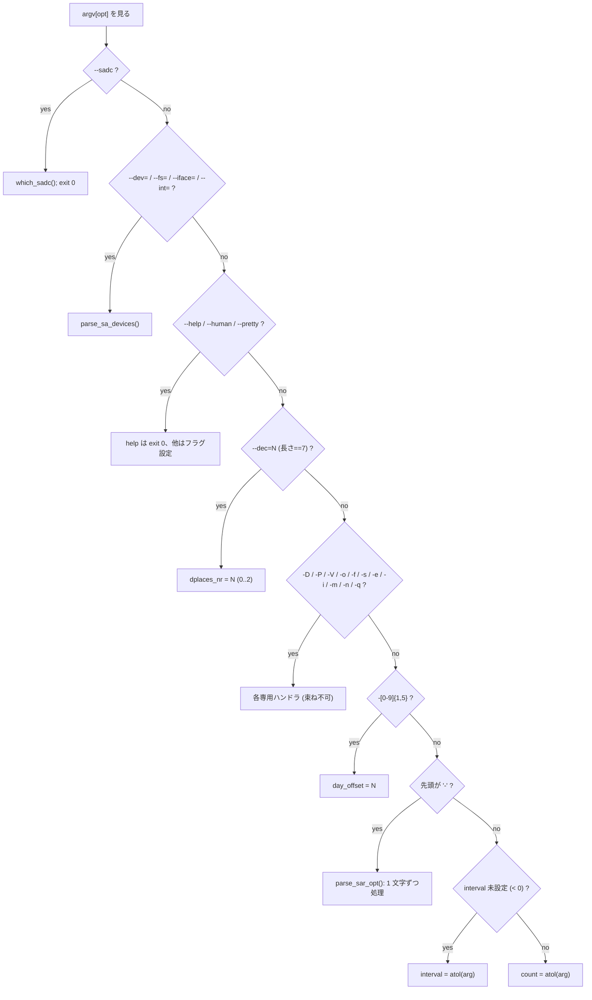

解析ループ終了後の後処理 (順序が重要):

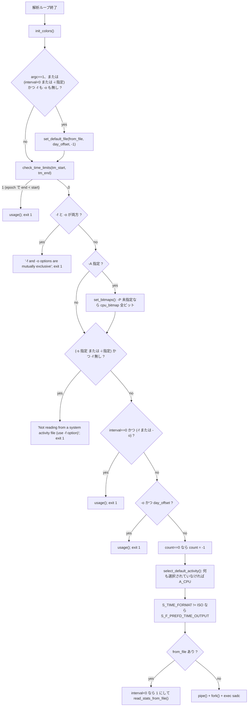

#### 1.6 `sar` 引数解析の落とし穴 (実装必須)

1. **`-o` / `-f` のファイル名判定** — 次引数が「存在し、`-` で始まらず、全部数字でない」
   場合のみファイル名として消費する。よって `sar -f 20240101` はファイル名にならず、
   既定ファイルが使われ、`20240101` が positional interval として解析される。

2. **`-s` / `-e` の引数形状判定** (`parse_timestamp()`) — 次引数を無条件に `opt++` してから
   形状を見る。受け付ける形は 3 種のみ:

   | 長さ | 条件 | 解釈 |
   |---|---|---|
   | 5 | `[2] == ':'` | `HH:MM` → `HH:MM:00` を補完 |
   | 8 | `[2] == ':' && [5] == ':'` | `HH:MM:SS` |
   | 10 | 全部数字 | epoch 秒 (`decode_epoch()`)。値が 0 なら `return 1` → usage |

   条件に合わない場合は**引数を消費せず**、既定値 (`-s`→`08:00:00`, `-e`→`18:00:00`) を
   使う。消費されなかった引数は次ループで再解析される。`sar -f f -s 5` は
   `tm_start=08:00:00` + `interval=5` になる。
   `decode_timestamp()` は各フィールドがちょうど 2 桁の数字で `HH<=23, MM<=59, SS<=59`
   を要求する (違反なら `return 1` → usage)。

3. **`check_time_limits()`** — `-s`/`-e` が両方 `HH:MM:SS` 形式で `end.hour < start.hour`
   なら `end.hour += 24` (日跨ぎ扱い)。両方 epoch で `end < start` なら `return 1` → usage。
   片方 epoch / 片方 `HH:MM:SS` の混在はチェックされない。

4. **`-q` のエラー時フォールバック** — `parse_sar_q_opt()` が失敗しても usage にならず
   `SELECT_ACTIVITY(A_QUEUE)` して**そのトークンを次の引数として再解析する**
   (`opt` は進めない)。さらに `strtok()` はその場でカンマを NUL に置換するので、
   `sar -q 2,5` は `A_QUEUE` 選択 + `interval=2` になり **`5` は失われる**
   (argv[opt] が `"2"` に破壊されている)。Rust 実装でこの破壊的挙動を再現するかは
   設計判断だが、少なくとも「`-q <非キーワード>` は usage を出さない」点は必須。

5. **`-A` の代入セマンティクス** — `A_CPU.opt_flags` と `A_FS.opt_flags` は `=` (代入)、
   `A_MEMORY.opt_flags` は `|=`。位置依存の副作用が出る。

6. **束ねられるか否か** — `-D` `-P` `-V` `-o` `-f` `-s` `-e` `-i` `-m` `-n`
   および全長形式は `main()` 側で完全一致判定なので**束ねられない**。
   `-uP 0` は `parse_sar_opt` に落ちて `'P'` が未知文字 → usage。
   逆に `-q` は両方 (`main()` の完全一致 = キーワード付き、`parse_sar_opt` = 束ね形) に存在する。

7. **`--dec=` の長さ判定** — `strlen(argv) == 7` でなければこの分岐に入らない。
   `--dec=12` は `parse_sar_opt` に落ちて `'d'` (=`-d`) + `'e'` (未知) → usage。

8. **`-[0-9]+` の桁数制限** — `strlen > 1 && strlen < 7`。`-123456` (7 文字) は
   `parse_sar_opt` に落ちて `'1'` が未知文字 → usage。

9. **`-f` と `-[0-9]+` は相互排他** — どちらのハンドラも
   `if (from_file[0] || day_offset) usage()` を持つ。`-o` + `-[0-9]+` も解析後に usage。

---

### 2. `sadf` オプション一覧

`sadf` の解析も 2 段構造だが、`sar` とは異なり **`--` を境に「sadf 自身のオプション」と
「sar レポート層に渡すオプション」を切り替える** (`sar_options` 変数)。

#### 2.1 `main()` で完全一致 / 前置一致処理されるオプション (束ね不可)

判定順に列挙する。`--` の**前でも後でも**有効なものと、片側限定のものがある。

| 短縮形 | 長形式 | 引数 | 意味 | 既定値 | 関連フラグ | `--` 前 | `--` 後 |
|---|---|---|---|---|---|---|---|
| `-P` | — | `{cpulist\|ALL}` | CPU 別統計。`sar` の `-P` と同一実装 (`parse_sa_P_opt`) | bit0 のみ | `S_F_OPTION_P` | ○ | ○ |
| — | `--dev=<list>` | 必須 | ブロックデバイス絞り込み。`sar -d` 相当の出力に効く | 全部 | `AO_LIST_ON_CMDLINE` | ○ | ○ |
| — | `--fs=<list>` | 必須 | FS 絞り込み (デバイス名 / マウントポイント両対応) | 全部 | 同上 | ○ | ○ |
| — | `--iface=<list>` | 必須 | NIC 絞り込み。`A_NET_DEV` → `A_NET_EDEV` にリスト共有 | 全部 | 同上 | ○ | ○ |
| — | `--int=<list>` | 必須 | 割り込み絞り込み。範囲可 (`max_val = 4096`) | 全部 | 同上 | ○ | ○ |
| `-s` | — | `[hh:mm[:ss]]` / `[epoch]` | 開始時刻。`sar` と同一実装 | `08:00:00` | `tm_start` | ○ | ○ |
| `-e` | — | 同上 | 終了時刻 | `18:00:00` | `tm_end` | ○ | ○ |
| `-O` | — | `<opts>[,...]` 必須 | 出力制御サブオプション (§2.2)。**`sar_options` が立っていると usage** | — | 複数 | ○ | **×** |
| `-[0-9]+` | — | なし | 日オフセット。`strlen>1 && strlen<7` | 0 | `day_offset` | ○ | ○ |
| — | `--` | なし | 以降を sar レポート層オプションとして扱う | — | `sar_options = 1` | — | — |
| `-m` | — | `{keyword[,...]\|ALL}` | `sar -m` 相当。**`sar_options` が立っていないと usage** | — | — | **×** | ○ |
| `-n` | — | 同上 | `sar -n` 相当。同条件 | — | — | **×** | ○ |
| `-q` | — | `[keyword[,...]]` | `sar -q` 相当。同条件。引数なしなら `A_QUEUE` | — | — | **×** | ○ |

TEST ビルド限定: `--getenv`。

#### 2.2 `--` より前の 1 文字オプション (`sadf` 固有、束ね可能)

`-CHhT` のように連結できる。

| 短縮形 | 引数 | 意味 | 既定 | 関連フラグ | 排他 |
|---|---|---|---|---|---|
| `-C` | なし | ファイル中のコメントを表示 | オフ | `S_F_COMMENT` | — |
| `-c` | なし | 旧形式データファイル (9.1.6 以降) を現行形式に変換 | — | `format = F_CONV_OUTPUT` (6) | 出力形式で排他 |
| `-d` | なし | RDBMS 取り込み向け `;` 区切り出力 | — | `format = F_DB_OUTPUT` (1) | 同 |
| `-g` | なし | SVG グラフ出力。**同時に `S_F_MINMAX` も立てる** | — | `format = F_SVG_OUTPUT` (7) + `S_F_MINMAX` | 同 |
| `-H` | なし | レポートヘッダのみ表示。形式未指定なら**データファイルのメタデータ表示**になる | オフ | `S_F_HDR_ONLY` | — |
| `-h` | なし | **`-d` と併用時に全 activity を 1 行に横並び表示**。「ヘルプ」ではない | オフ | `S_F_HORIZONTALLY` | — |
| `-j` | なし | JSON 出力。**`sar -j` (永続名) とは全く別の意味** | — | `format = F_JSON_OUTPUT` (5) | 出力形式で排他 |
| `-l` | なし | PCP (Performance Co-Pilot) アーカイブへエクスポート | — | `format = F_PCP_OUTPUT` (9) | 同 |
| `-p` | なし | awk 等で扱いやすいタブ区切り出力 (**既定形式**) | 既定 | `format = F_PPC_OUTPUT` (3) | 同 |
| `-r` | なし | 生カウンタ値をそのまま出力 (レート計算なし) | — | `format = F_RAW_OUTPUT` (8) | 同 |
| `-T` | なし | タイムスタンプを**ローカル時刻**で表示 | UTC | `S_F_LOCAL_TIME` | `-T`/`-t`/`-U` で排他 |
| `-t` | なし | タイムスタンプを**ファイル作成者のローカル時刻**で表示 | UTC | `S_F_TRUE_TIME` | 同 |
| `-U` | なし | タイムスタンプを **epoch 秒 (UTC)** で表示 | UTC 文字列 | `S_F_SEC_EPOCH` | 同 |
| `-V` | なし | 環境変数 + バージョンを表示して exit 0。**束ねられる** (`sadf -CV` 可) | — | — | — |
| `-x` | なし | XML 出力 | — | `format = F_XML_OUTPUT` (4) | 出力形式で排他 |
| 上記以外 | — | `usage()` → exit 1 | — | — | — |

**`sadf` に存在しないもの (12.8.0 で確認)**: `--help` / `--human` / `--pretty` /
`--dec=` / `--utc` / `--sadc` / `-A` / `-D` / `-i` / `-f` / `-o` / `-z` (単独)。
`sadf --help` は `-` が未知の 1 文字として扱われ **usage → exit 1** になる。
`dplaces_nr` は `sadf.c` に変数として存在するが CLI から設定できない (常に -1 = 2 桁)。

#### 2.3 `-O <opts>` サブキーワード完全列挙

`strtok(argv[opt], ",")` でカンマ分割し、以下と `strcmp` / `strncmp` で照合。
**未知のキーワードは `usage()` → exit 1**。

| キーワード | `K_*` | 引数 | 効果 | 関連フラグ / 変数 | 対象形式 |
|---|---|---|---|---|---|
| `skipempty` | `K_SKIP_EMPTY` | なし | 全グラフがゼロのビューを描かない | `S_F_SVG_SKIP` → `SKIP_EMPTY_VIEWS()` | `-g` (SVG) |
| `autoscale` | `K_AUTOSCALE` | なし | ビューのスケールに合わせて各グラフを最大化 (10/100/1000 倍率) | `S_F_SVG_AUTOSCALE` → `AUTOSCALE_ON()` | `-g` |
| `oneday` | `K_ONEDAY` | なし | 24 時間分の時間軸で描画 (時刻は既定で UTC なので `-T` 併用推奨) | `S_F_SVG_ONE_DAY` → `DISPLAY_ONE_DAY()` | `-g` |
| `showidle` | `K_SHOWIDLE` | なし | CPU グラフに `%idle` も描画 | `S_F_SVG_SHOW_IDLE` → `DISPLAY_IDLE()` | `-g` |
| `showinfo` | `K_SHOWINFO` | なし | 各ビューに日付・ホスト名等の付加情報を描画 | `S_F_SVG_SHOW_INFO` → `DISPLAY_INFO()` | `-g` |
| `showtoc` | `K_SHOWTOC` | なし | SVG 先頭に目次 (各 activity 先頭グラフへのリンク) を追加 | `S_F_SVG_SHOW_TOC` → `DISPLAY_TOC()` | `-g` |
| `packed` | `K_PACKED` | なし | 同一 activity (同一デバイス) の全ビューを 1 行にまとめる | `S_F_SVG_PACKED` → `PACK_VIEWS()` | `-g` |
| `height=<value>` | `K_HEIGHT` (`"height="`) | 必須・**数字のみ** | SVG キャンバス高さ。空文字や非数字は `usage()` | `canvas_height` + `S_F_SVG_HEIGHT` → `SET_CANVAS_HEIGHT()` | `-g` |
| `customcol` | `K_CUSTOMCOL` | なし | `S_COLORS_PALETTE` で指定したカスタムパレットを使う | `palette = SVG_CUSTOM_COL_PALETTE` | `-g` |
| `bwcol` | `K_BWCOL` | なし | 白黒パレットを使う | `palette = SVG_BW_COL_PALETTE` | `-g` |
| `debug` | `K_DEBUG` | なし | SVG にコメントを追加 / raw 出力に追加情報 | `S_F_DEBUG_MODE` → `DISPLAY_DEBUG_MODE()` | `-g` と `-r` |
| `hz=<value>` | `K_HZ` (`"hz="`) | 必須・**数字のみ** | 旧データファイル作成マシンの 1 秒あたり tick 数 | `user_hz` | `-c` (変換時) |
| `pcparchive=<name>` | `K_PCPARCHIVE` (`"pcparchive="`) | 必須 (空でも可) | 生成する PCP アーカイブ名。**数字チェックなし** | `pcparchive` | `-l` |

`showhints` というキーワードは 12.8.0 には**存在しない**。
既定パレットは `SVG_DEFAULT_COL_PALETTE`。

#### 2.4 出力形式の排他規則と既定

出力形式指定 (`-c` / `-d` / `-g` / `-j` / `-l` / `-p` / `-r` / `-x`) は
**`if (format) usage();` = 2 つ以上指定すると exit 1** (同じものを 2 回でも不可)。

`check_format_options()` の処理:

1. `format` が未設定なら:
   - `-H` が指定されていれば `format = F_HEADER_OUTPUT` (2)
   - そうでなければ **`format = F_PPC_OUTPUT` (3) = `-p` 相当が既定**
2. 形式ごとの `options` (`format.c`) に基づき、**受け付けないフラグを黙って落とす**:

| 形式 | `id` | `FO_*` オプション | `-H` | `-h` | `-T` | `-U` | `-t` |
|---|---|---|---|---|---|---|---|
| header (`-H` のみ) | 2 | `FO_HEADER_ONLY` | ○ | 落とす | 落とす | 落とす | 保持 |
| db (`-d`) | 1 | `FO_LOCAL_TIME + FO_HORIZONTALLY + FO_SEC_EPOCH + FO_FIELD_LIST` | 落とす | ○ | ○ | ○ | 保持 |
| ppc (`-p`, 既定) | 3 | `FO_LOCAL_TIME + FO_SEC_EPOCH` | 落とす | 落とす | ○ | ○ | 保持 |
| xml (`-x`) | 4 | `FO_HEADER_ONLY + FO_LOCAL_TIME + FO_TEST_MARKUP` | ○ | 落とす | ○ | 落とす | 保持 |
| json (`-j`) | 5 | `FO_HEADER_ONLY + FO_LOCAL_TIME + FO_TEST_MARKUP + FO_LC_NUMERIC_C` | ○ | 落とす | ○ | 落とす | 保持 |
| conv (`-c`) | 6 | `0` | 落とす | 落とす | 落とす | 落とす | 保持 |
| svg (`-g`) | 7 | `FO_HEADER_ONLY + FO_LOCAL_TIME + FO_LC_NUMERIC_C` | ○ | 落とす | ○ | 落とす | 保持 |
| raw (`-r`) | 8 | `FO_LOCAL_TIME + FO_SEC_EPOCH` | 落とす | 落とす | ○ | ○ | 保持 |
| pcp (`-l`) | 9 | `FO_HEADER_ONLY + FO_LOCAL_TIME + FO_NO_TRUE_TIME + FO_ITEM_LIST + FO_FULL_ORDER` | ○ | 落とす | ○ | 落とす | **落とす** |

`-T` / `-t` / `-U` の相互排他チェックは
`if ((PRINT_LOCAL_TIME(flags) + PRINT_TRUE_TIME(flags) + PRINT_SEC_EPOCH(flags)) > 1) usage();`
であり、**`check_format_options()` の「落とす」処理より前に実行される**。
解析ループ後の処理順は以下の通り (`sadf.c` の `main()`):

```
init_colors()
  -> USE_OPTION_A なら set_bitmaps()
  -> dfile 未設定なら set_default_file(dfile, day_offset, -1)
  -> format == F_PCP_OUTPUT かつ pcparchive 未設定なら pcparchive = dfile
  -> (!HAVE_PCP && format == F_PCP_OUTPUT) なら "PCP support not compiled in"; exit 1
  -> check_time_limits() が 1 を返したら usage; exit 1
  -> DISPLAY_PRETTY なら get_devmap_major()
  -> ★ -T/-t/-U 排他チェック (2 個以上なら usage; exit 1)
  -> PRINT_LOCAL_TIME なら tzset() + my_tzname 取得
  -> count == 0 なら count = -1
  -> select_default_activity()
  -> check_format_options()      <- 形式に合わないフラグをここで落とす
  -> interval < 0 なら interval = 1
  -> format == F_CONV_OUTPUT なら convert_file()、それ以外は read_stats_from_file()
```

したがって **出力形式が何であれ `-T`/`-t`/`-U` を 2 つ以上書けば必ず exit 1**
(`sadf -x -T -U` も usage)。上表の「落とす」は 1 個だけ指定された場合に
その 1 個を無効化する処理である。

#### 2.5 `--` 以降のオプションの扱い

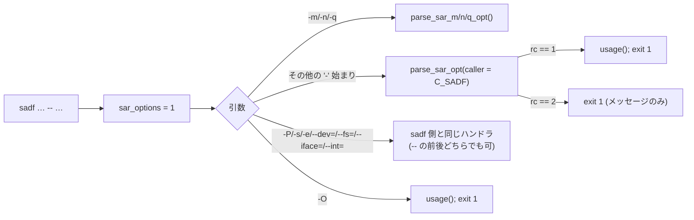

`parse_sar_opt(caller = C_SADF)` での `sar` オプションの扱い:

| `sar` オプション | `sadf -- ` での扱い |
|---|---|
| `-A` `-B` `-b` `-C` `-d` `-F [MOUNT]` `-H` `-h` `-I [SUM\|ALL]` `-j <type>` `-p` `-q` `-r [ALL]` `-S` `-u [ALL]` `-v` `-w` `-W` `-y` `-z` | `sar` と同じに動作する |
| `-t` | **`return 1` → usage → exit 1** (sadf の `-t` は `--` の前で指定する) |
| `-x` | **受け付けるが無言で無視** (`caller == C_SAR` のときだけフラグを立てる) |
| 上記以外 (`-D` `-f` `-o` `-i` `-V` `-P` 等の 1 文字) | `default: return 1` → usage → exit 1 |

**注意: `-C` と `-H` と `-h` は `sadf` 自身にも `parse_sar_opt` にも存在する。**
`--` の前では `sadf` の意味 (`-C`=コメント表示 / `-H`=ヘッダのみ / `-h`=横並び)、
`--` の後では `sar` の意味 (`-C`=コメント表示 / `-H`=hugepages / `-h`=pretty+human)
になる。`-H` と `-h` は意味が完全に変わるので実装上の要注意点。

#### 2.6 positional 引数

判定順 (`-` 始まりでない引数):

1. `strspn(argv, DIGITS) != strlen(argv)` (= 数字以外を含む) → **データファイル名**。
   すでに `dfile` か `day_offset` が設定されていれば usage。
   `check_alt_sa_dir(dfile, 0, -1)` でディレクトリなら日次ファイル名を付加
   (**`day_offset` ではなく 0 が渡される** = ディレクトリ指定時に `-N` は効かない)。
2. `interval < 0` → `interval = atol(argv)`。**`interval < 1` なら usage**
   (`sar` と違い 0 を許さない)。
3. それ以外 → `count = atol(argv)`。すでに `count` が設定済みなら usage。
   `count == 0` は許され `count = -1` (= 全レコード / 連続) に変換される
   (`sar` は `count < 1` で usage)。

**データファイル名が全部数字だと positional interval/count として吸われる**
(例: `sadf 20240101` は interval=20240101 扱い)。

---

### 3. `sadc -S` 収集キーワード (参考: ファイルに何が入るかを決める)

`sar -o` は内部で `sadc -Z -S XALL <outfile>` を起動し、`sar` (画面表示のみ) は
`sadc -Z -S A_NULL,<選択された activity 名…>` を起動する。

`parse_sadc_S_option()` の受け付ける値:

| 値 | 効果 |
|---|---|
| `INT` | `G_INT` グループを収集 (= `A_IRQ`) |
| `DISK` | `G_DISK` グループ (= `A_DISK`, `A_NET_FC`) |
| `XDISK` | `G_DISK + G_XDISK` グループ + 各 activity に `AO_F_DISK_PART` (= `A_DISK`, `A_NET_FC`, `A_FS` + パーティション/FS 統計) |
| `SNMP` | `G_SNMP` グループ (= `A_NET_IP`, `EIP`, `ICMP`, `EICMP`, `TCP`, `ETCP`, `UDP`) |
| `IPV6` | `G_IPV6` グループ (= `A_NET_SOCK6`, `IP6`, `EIP6`, `ICMP6`, `EICMP6`, `UDP6`) |
| `POWER` | `G_POWER` グループ (= `A_PWR_CPU`, `FAN`, `TEMP`, `IN`, `FREQ`, `USB`, `BAT`) |
| `ALL` | 全 activity を収集。ただし **`G_XDISK` を持つものは除外** (= `A_FS` は入らない)。`AO_F_DISK_PART` も立たない |
| `XALL` | 全 activity を収集 + `G_DISK + G_XDISK` に `AO_F_DISK_PART`。**すべて収集** |
| `A_NULL` | 全 activity の `AO_COLLECTED` をクリア (`sar` が使う) |
| `A_<name>` | 名前で activity を個別選択 (例 `A_CPU`)。未知なら usage |
| `-A_<name>` | 名前で activity を個別解除 |
| 上記以外 | `usage()` → exit 1 |

**man page は `-o` が `sadc -S ALL` を呼ぶと書いているが、`sar.c` の実装は `K_XALL`
(= `-S XALL`) を渡す。コードが正。** (man page の記述が古い)

`activity.c` で `AO_COLLECTED` が既定で立っている = 何も指定しなくても収集される
activity は `G_DEFAULT` グループのもの (`A_CPU`, `A_PCSW`, `A_SWAP`, `A_PAGE`, `A_IO`,
`A_MEMORY`, `A_KTABLES`, `A_QUEUE`, `A_SERIAL`, `A_NET_DEV`, `A_NET_EDEV`, `A_NET_NFS`,
`A_NET_NFSD`, `A_NET_SOCK`, `A_HUGE`, `A_NET_SOFT`, `A_PSI_CPU`, `A_PSI_IO`, `A_PSI_MEM`)。
`A_PSI_*` は `AO_DETECTED` も持ち、`/proc/pressure` の有無で自動検出される。

`sadc` の他オプション (1 行ずつ):

| オプション | 意味 |
|---|---|
| `-C <comment>` | `interval`/`count` 両方省略時、コメント付きダミーレコードを書く (`sar -C` で表示) |
| `-D` | `saDD` の代わりに `saYYYYMMDD` を使う |
| `-F` | outfile の作成を強制。形式不明の既存ファイルは truncate |
| `-f` | `fdatasync()` でディスクへの書き出しを保証 (`S_F_FDATASYNC`) |
| `-L` | outfile に排他ロックを取る (`S_F_LOCK_FILE`) |
| `-V` | バージョン表示して exit 0 |
| `-Z` | (非公開) `sar` が内部で渡すフラグ |
| `outfile` | `-` なら標準日次データファイル、ディレクトリならその下の日次ファイル、省略時は標準出力 |

`sadc` の usage 文:
`Usage: %s [ options ] [ <interval> [ <count> ] ] [ <outfile> ]` /
`Options are:` / `[ -C <comment> ] [ -D ] [ -F ] [ -f ] [ -L ] [ -V ]` /
`[ -S { INT | DISK | IPV6 | POWER | SNMP | XDISK | ALL | XALL } ]`

---

### 4. 終了コードとエラーメッセージ

#### 4.1 終了コード一覧

| コード | 意味 | 発生元 (代表) |
|---|---|---|
| 0 | 正常終了 / `--help` / `-V` / `--sadc` / `sadf -H` の表示完了 | `display_help()`, `print_version()`, `which_sadc()`, `sadf.c` `-H` 分岐 |
| 1 | **CLI 使用法エラーおよび論理エラー** | `usage()` 全般、後述のメッセージ群 |
| 2 | **ファイル入出力 / システムコールエラー** | `read()` / `lseek()` / `open()` / `sysconf()` 失敗、ファイル終端異常 |
| 3 | **データファイル形式エラー / sadc からの入力破損** | `handle_invalid_sa_file()`, `print_read_error()` |
| 4 | **メモリ確保 / プロセス生成エラー (致命的)** | `strdup()` / `malloc()` 失敗、`pipe()` / `fork()` / `dup2()` / `exec` 失敗、乗算オーバーフロー検出 |

`usage()` は **stderr** に `Usage: …` 行と `Options are:` 以下を出して `exit(1)`。
`display_help()` は **stdout** に出して `exit(0)`。

#### 4.2 ユーザに見えるエラーメッセージ (exit code 付き)

| メッセージ (書式文字列) | 出力先 | exit | 条件 |
|---|---|---|---|
| `Usage: %s [ options ] [ <interval> [ <count> ] ]\n` + `Options are:\n…` | stderr | 1 | `sar` の使用法エラー |
| `Usage: %s [ options ] [ <interval> [ <count> ] ] [ <datafile> \| -[0-9]+ ]\n` + `Options are:\n…` | stderr | 1 | `sadf` の使用法エラー |
| `-f and -o options are mutually exclusive\n` | stderr | 1 | `sar` で `-f` と `-o` を同時指定 |
| `Not reading from a system activity file (use -f option)\n` | stderr | 1 | `sar` で `-s` または `-i` を指定したがファイル読み出しでない |
| `Requested activities not available\n` | stderr | 1 | `sar` ライブ実行時、`sadc` が選択された activity を 1 つも送ってこない (`print_collect_error()`) |
| `Requested activities not available in file %s\n` | stderr | 1 | 選択 activity がデータファイルに 1 つも存在しない (`sadf -H` 時はこのチェックを免除) |
| `Invalid type of persistent device name\n` | stderr | 1 | `-j <type>` の `/dev/disk/by-<type>` が読めない |
| `PCP support not compiled in\n` | stderr | 1 | `sadf -l` だが `HAVE_PCP` 未定義 |
| `sysstat: %s[%d]: Internal error...\n` | stderr | 1 | `sysstat_panic()` (`get_activity_position(..., EXIT_IF_NOT_FOUND)` の失敗など。通常発生しない) |
| `Cannot open %s: %s\n` (+ ENOENT かつ既定ファイル使用時は `Please check if data collecting is enabled\n`) | stderr | 2 | データファイルを開けない |
| `Error while reading system activity file: %s\n` | stderr | 2 | `read()` 失敗 (`sa_fread()`) |
| `End of system activity file unexpected\n` | stderr | 2 | 想定より早くファイル終端 (`oneof == UEOF_CONT` なら 2 を返して継続) |
| `Invalid data read\n` | stderr | 2 | レコードヘッダ解析で矛盾 (`read_record_hdr()`) |
| (`perror` 経由) `read` / `lseek` / `sysconf` | stderr | 2 | 各システムコール失敗 |
| `Invalid system activity file: %s\n` | stderr | 3 | magic 不一致等 (`handle_invalid_sa_file()`) |
| ↑ に続けて `File created by sar/sadc from sysstat version %d.%d.%d` / `Current sysstat version cannot read the format of this file (%#x)\n` / `Try to convert it to current format. Enter:\n\n` / `sadf -c %s > %s.new\n\n` / `You should then be able to read the new file created (%s.new)\n` | stderr | 3 | 旧形式 sysstat ファイル (`format_magic >= FORMAT_MAGIC_2171` のとき変換案内を出す) |
| `End of data collecting unexpected\n` | stderr | 3 | `sadc` からのデータが足りない (`print_read_error(END_OF_DATA_UNEXPECTED)`) |
| `Inconsistent input data\n` | stderr | 3 | `sadc` からの入力が矛盾 (`print_read_error()` の default) |
| `Using a wrong data collector from a different sysstat version\n` | stderr | 3 | `sar` と `sadc` のバージョン不一致 |
| `Cannot find the data collector (%s)\n` + `perror("exec")` | stderr | 4 | `SADC_PATH` も PATH 上の `sadc` も実行できない |
| (`perror` 経由) `strdup` / `malloc` / `pipe` / `fork` / `dup2` | stderr | 4 | メモリ / プロセス生成失敗 |
| `%s: %s\n` (`set_default_file` の関数名 + ファイル名) | stderr | 1 | 既定ファイルパスが `MAX_FILE_LEN`=512 を超えた |

`--sadc` の出力 (**stdout**, exit 0):
`Data collector found: %s\n` または `Data collector will be sought in PATH\n`

`-V` の出力 (**stdout**, exit 0):
設定されている環境変数を `NAME=value\n` の形で順に出した後、
`sysstat version %s\n` と `(C) Sebastien Godard (sysstat <at> orange.fr)\n`。

- `sar -V` の環境変数出力順: `S_COLORS` → `S_COLORS_SGR` → `S_REPEAT_HEADER` →
  `S_TIME_DEF_TIME` → `S_TIME_FORMAT` (5 個)
- `sadf -V` の環境変数出力順: `S_COLORS_PALETTE` → `S_TIME_DEF_TIME` (2 個)

man page に EXIT STATUS / RETURN VALUE セクションは**存在しない** (上記はすべてソース由来)。

---

### 5. 既定動作

#### 5.1 activity オプションを何も指定しなかった場合

`select_default_activity()` (`sa_common.c`):

1. `get_activity_nr(act, AO_SELECTED, COUNT_ACTIVITIES) == 0` なら
   **`A_CPU` に `AO_SELECTED` を立てる**。
2. `count_bits(cpu_bitmap) == 0` なら `cpu_bitmap.b_array[0] |= 0x01`
   (= CPU `all` = 全 CPU 集約行のみ)。

このとき `A_CPU.opt_flags` は **`activity.c` の初期値 `AO_F_CPU_DEF` のまま** である
(`activity.c` 内で非ゼロの `opt_flags` 初期値を持つのは `A_CPU` だけ。`A_MEMORY` /
`A_FS` などは 0 初期化なので `-r` / `-S` / `-F` を明示しないとレポートが出ない)。
したがってヘッダ (`print_hdr_line(…, FIRST + DISPLAY_CPU_ALL(opt_flags), …)` →
`FIRST + 0`) も値出力 (`DISPLAY_CPU_DEF` が真 → `if` 側) も **`-u` と完全に同じ**
6 列 `CPU;%user;%nice;%system;%iowait;%steal;%idle` になる。

`-u` / `-u ALL` / `-A` はいずれも `opt_flags` を**代入**するため
`AO_F_CPU_DEF` と `AO_F_CPU_ALL` が同時に立つことはなく、CPU レポートは常に 1 個。

まとめ: **`sar` にオプションを付けなければ「`sar -u` と同一 = CPU 全体 (`all` 行) の
既定 6 列」**。

#### 5.2 既定データファイルのパス規則

| 要素 | 値 |
|---|---|
| 既定ディレクトリ | `SA_DIR` (ビルド時 `configure --with-sa-dir=`、既定は `/var/log/sa`) |
| ファイル名 (既定) | `saDD` (`DD` = 2 桁の日) |
| ファイル名 (`-D` 時、書き込みのみ) | `saYYYYMMDD` |
| 読み出し時の選択 | `guess_sa_name()` が `saYYYYMMDD` と `saDD` の **mtime (秒 + nsec)** を比較し新しい方を使う。`saYYYYMMDD` が `stat()` できなければ `saDD`、`saDD` が `stat()` できなければ `saYYYYMMDD`、どちらも無ければ `saDD` |
| `-f <dir>` / `-o <dir>` / `sadf <dir>` | `check_dir()` が真なら「日次ファイルの置き場ディレクトリ」と解釈し、その下に上記規則で名前を付加 |
| 日オフセット `-N` | `get_time(&rectime, N)` で N 日前の日付を使う。`S_TIME_DEF_TIME=UTC` なら UTC 基準 |
| `set_default_file()` 使用時 | グローバル `default_file_used = TRUE` になり、後の `open()` が ENOENT のとき `Please check if data collecting is enabled` の追加ヒントが出る |

`sar` が既定ファイルを読むのは次の条件のとき:

```
(argc == 1) || (((interval < 0) || INTERVAL_SET(flags)) && !from_file[0] && !to_file[0])
```

つまり「引数が一切ない」か、「positional interval が指定されておらず (または `-i` が
使われており) かつ `-f` も `-o` も無い」場合。
`sadf` は `if (!dfile[0]) set_default_file(dfile, day_offset, -1);` で**常に**既定ファイルへ
フォールバックする。

`-f`/`-o` に引数を付けない場合 (`sar -f` 単独) も同じく `set_default_file()`。
`-o` 単独の場合は `to_file = "-"` になり、`sadc` 側が `-` を「標準日次データファイル」と
解釈する。

`sadf -l` (PCP) で `-O pcparchive=` が無い場合、アーカイブ名はデータファイル名と同じになる
(`strcpy(pcparchive, dfile)`)。

#### 5.3 `interval` / `count` の意味

| コマンド | `interval` | `count` |
|---|---|---|
| `sar` (ライブ収集) | 秒。`0` = **システム起動以降の平均を 1 行表示して終了** (内部で `sadc 1 1` を起動し `S_F_SINCE_BOOT` を立てる)。`< 0` (未指定) は既定ファイル読み出しへ分岐。`-o` 併用時に `< 0` なら usage | 行数。未指定 (`0`) → `-1` = 連続生成。`< 1` を明示すると usage。**`interval == 0` のとき count を指定すると usage** (`!interval` チェック) |
| `sar -f` (ファイル読み出し) | レコード選択間隔。`< 0` なら 1 に補正。`next_slice()` が「`p * interval` が `[En - In/2, En + In/2)` に入る」レコードを選ぶ (`interval == 1` は常に真 = 全レコード) | 表示レコード数。未指定なら `-1` = ファイル全部 |
| `sadf` | `< 1` は **usage** (0 を許さない)。未指定なら解析後に 1 に補正 | `0` を明示すると `-1` (= 全レコード) に変換。未指定 (`0`) も `-1` |

`sar` がライブ収集で `sadc` に渡す引数の組み立て (`sar.c` の child 側):

| `sar` 側の値 | `sadc` への引数 |
|---|---|
| `interval < 0` | `usage()` → exit 1 |
| `interval == 0` | `"1"` を 2 回 push (= interval 1, count 1)。`count` は `-1` なので追加 push されない |
| `interval > 0` | `"<interval>"` を 1 回 push |
| `count >= 0` | 続けて `"<count + 1>"` を push (`count == -1` のときは push しない = 無限) |

その後 `"-Z"` を必ず push し、`-o` 指定時は (`-D` があれば `"-D"`)、`"-S"`, `"XALL"`,
`"<to_file>"`。`-o` なしなら `"-S"`, `"A_NULL,<選択 activity 名のカンマ列>"`。
最後に `args[n] = NULL`。`MAX_ARGV_NR = 32`、activity 名リストは `char ltemp[1024]`。

起動は `execv(SADC_PATH, args)` → 失敗したら `execvp("sadc", args)`。

#### 5.4 `-A` で何が有効になるか

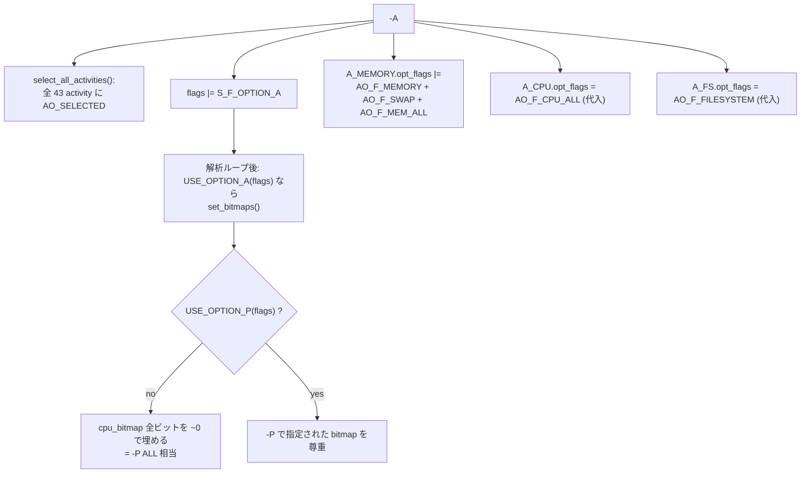

man page の言い換え: `-A` は `-bBdFHISvwWy -m ALL -n ALL -q ALL -r ALL -u ALL` と等価で、
かつ **`-I ALL -P ALL` を (明示指定がなければ) 含意する**。
実装上は `select_all_activities()` が 43 個すべてに `AO_SELECTED` を立てるので
man page の列挙より広い (例えば `A_NET_FC` / `A_PWR_BAT` / `A_PSI_*` も入る) が、
ファイル読み出し時は `check_file_actlst()` / `reverse_check_act()` が
ファイルに存在しない activity の選択を外すため、実効的な差は出にくい。

ライブ実行で `-A` かつ `-o` なしの場合、`sadc` に渡る `-S` 引数は
`A_NULL,A_CPU,A_PCSW,A_IRQ,…` (選択済み 43 個すべて) となる。

#### 5.5 ヘッダ行の再表示規則 (`S_REPEAT_HEADER` の効き方)

`check_line_hdr()` (`sar.c`) が `dis_hdr` を決める:

1. `get_activity_nr(act, AO_SELECTED, COUNT_OUTPUTS) > 1` → `TRUE`
   (`AO_MULTIPLE_OUTPUTS` を持つ activity は `opt_flags & 0xff` の立ちビット数だけ数える)
2. そうでなければ、選択された最初の activity について
   - bitmap を持つなら立ちビット数 > 1 で `TRUE`
   - それ以外は `nr_ini > 1` で `TRUE`

`dis_hdr == TRUE` → 各統計ブロックの前に必ずヘッダを出す。
`dis_hdr == FALSE` (単一 activity・単一項目) → `rows` 行ごとにヘッダを繰り返す。

`rows = get_win_height()`:

| 状況 | `rows` |
|---|---|
| stdout が端末で `ioctl(TIOCGWINSZ)` 成功かつ `ws_row > 2` | `ws_row - 2` |
| stdout が端末でない かつ `S_REPEAT_HEADER` が全部数字で `> 0` | その値 |
| 上記いずれでもない | `DEFAULT_ROWS = SEC_PER_DAY = 86400` (実質ヘッダを繰り返さない) |
| 最終的に `< MIN_ROWS (1)` なら | `1` に丸める |

---

### 6. 環境変数

#### 6.1 `sar` が参照する環境変数

| 変数 | 受け付ける値 | 意味 | 参照箇所 |
|---|---|---|---|
| `S_COLORS` | `never` / `always` / `auto` (小文字、完全一致) | 出力の色付け。未設定なら「stdout が端末のときだけ色付け」= `auto` と同じ。`never`、または `auto` かつ端末でない場合は全 SGR 文字列を空にする | `init_colors()` |
| `S_COLORS_SGR` | `:` 区切りの `<cap>=<SGR>` リスト | 各カテゴリの SGR シーケンス。既定は `C=33;22:I=32;22:N=34;1:R=31;22:W=35;1:X=31;1:Z=34;22:+=32;1:-=31;1` (man page では `Z=34;22` と `+=32;1` の間のコロンが抜けている誤植) | `init_colors()` |
| `S_REPEAT_HEADER` | 10 進数 (全桁が数字、`> 0`) | stdout が端末でないときのヘッダ再表示行数 | `get_win_height()` |
| `S_TIME_DEF_TIME` | `UTC` (大文字、完全一致) | データを UTC で保存し、日次データファイルの日付判定も UTC 基準にする (**表示はローカル時刻のまま**) | `get_time()` |
| `S_TIME_FORMAT` | `ISO` (大文字、完全一致) | ヘッダの日付を ISO 8601 (`%Y-%m-%d`) にし、タイムスタンプを `%H:%M:%S` 固定にする。未設定時はロケール依存 (`%x` と `%X`) | `is_iso_time_fmt()` → `S_F_PREFD_TIME_OUTPUT` |

`S_COLORS_SGR` の capability 一覧 (`init_colors()` の `switch`):

| capability | 別名 | 対象 |
|---|---|---|
| `C=` | — | データファイルに挿入されたコメント |
| `I=` | — | 項目名 / 項目値 (NIC 名、CPU 番号等) |
| `N=` | — | 非ゼロの整数統計値 |
| `R=` | — | RESTART メッセージ |
| `W=` | `M=` | 75〜90% (または指標によって 10〜25%)、および -10〜-5 の負値 |
| `X=` | `H=` | 90% 以上 (または 10% 以下)、および -10 以下の負値 |
| `Z=` | — | ゼロ値 |
| `+=` | — | バッテリ状態 (full / charging) |
| `-=` | — | バッテリ状態 (not charging / discharging) |

不正な項目は無言でスキップされる。条件は
`len <= MAX_SGR_SEQ_LEN(18) && len >= MIN_SGR_SEQ_LEN(3) && p[1] == '=' &&
strspn(p+2, ";0123456789") == len - 2`。SGR 展開は `"\e[%sm"`。

`S_TIME_FORMAT` の効果 (組み合わせ表):

| `S_TIME_FORMAT` | ヘッダ日付 (`set_report_date`) | 各行タイムスタンプ |
|---|---|---|
| 未設定 / `ISO` 以外 | `%x` (ロケール依存) | `%X` (ロケール依存)。`sar` が `S_F_PREFD_TIME_OUTPUT` を立てるため |
| `ISO` | `%Y-%m-%d` | `%H:%M:%S` |

`sadf` は `S_F_PREFD_TIME_OUTPUT` を**立てない**ので、常に `%H:%M:%S`。
(`set_record_timestamp_string()`: `PRINT_SEC_EPOCH` 時は epoch 秒の 10 進、
それ以外は日付 `%Y-%m-%d` + 時刻。)
日付取得に失敗したときの文字列は `DEFAULT_ERROR_DATE = "?/?/?"`。

#### 6.2 `sadf` が参照する環境変数

| 変数 | 受け付ける値 | 意味 |
|---|---|---|
| `S_COLORS_PALETTE` | `:` 区切りの `<cap>=<hex triplet>` リスト | `-g -O customcol` 時の SVG 配色 |
| `S_TIME_DEF_TIME` | `UTC` | 日次データファイルの日付判定を UTC 基準にする |

`sadf -V` が表示するのはこの 2 つのみ。`S_COLORS` / `S_COLORS_SGR` は
`init_colors()` 経由で `sadf` でも読まれるが `-V` には出ない。

`S_COLORS_PALETTE` の既定値 (man page より):

```
0=000000:1=1a1aff:2=1affb2:3=b21aff:4=1ab2ff:5=ff1a1a:6=ffb31a:7=b2ff1a:
8=efefef:9=000000:A=1a1aff:B=1affb2:C=b21aff:D=1ab2ff:E=ff1a1a:F=ffb31a:
G=bebebe:H=000000:I=000000:K=ffffff:L=000000:T=000000:W=000000:X=000000
```

| capability | 対象 |
|---|---|
| `0`〜`F` (16 進 1 桁) | グラフ描画用の 16 色 |
| `G=` | グリッド線 |
| `H=` | レポートヘッダ |
| `I=` | 付加情報 (日付・ホスト名等) |
| `K=` | グラフ背景 |
| `L=` | 既定色 (目次等) |
| `T=` | グラフタイトル |
| `W=` | 警告 / エラーメッセージ |
| `X=` | 軸と目盛 |

---

### 7. `usage()` / `display_help()` の出力テキスト

バイト互換にするなら以下をそのまま出す必要がある (NLS 未使用時)。

#### 7.1 `sar` の `usage()` (stderr, exit 1)

```
Usage: %s [ options ] [ <interval> [ <count> ] ]
Options are:
[ -A ] [ -B ] [ -b ] [ -C ] [ -D ] [ -d ] [ -F [ MOUNT ] ] [ -H ] [ -h ]
[ -p ] [ -r [ ALL ] ] [ -S ] [ -t ] [ -u [ ALL ] ] [ -V ]
[ -v ] [ -W ] [ -w ] [ -x ] [ -y ] [ -z ]
[ -I [ SUM | ALL ] ] [ -P { <cpu_list> | ALL } ]
[ -m { <keyword> [,...] | ALL } ] [ -n { <keyword> [,...] | ALL } ]
[ -q [ <keyword> [,...] | ALL ] ]
[ --dev=<dev_list> ] [ --fs=<fs_list> ] [ --iface=<iface_list> ] [ --int=<int_list> ]
[ --dec={ 0 | 1 | 2 } ] [ --help ] [ --human ] [ --pretty ] [ --sadc ]
[ -j { SID | ID | LABEL | PATH | UUID | ... } ]
[ -f [ <filename> ] | -o [ <filename> ] | -[0-9]+ ]
[ -i <interval> ] [ -s [ <start_time> ] ] [ -e [ <end_time> ] ]
```

(`%s` は `argv[0]`。`--iface` 行と `--int` 行は C ソース上は 2 つの文字列リテラルの
連結なので出力は 1 行。)

#### 7.2 `sar` の `display_help()` (stdout, exit 0)

```
Usage: %s [ options ] [ <interval> [ <count> ] ]
Main options and reports (report name between square brackets):
	-B	Paging statistics [A_PAGE]
	-b	I/O and transfer rate statistics [A_IO]
	-d	Block devices statistics [A_DISK]
	-F [ MOUNT ]
		Filesystems statistics [A_FS]
	-H	Hugepages utilization statistics [A_HUGE]
	-I [ SUM | ALL ]
		Interrupts statistics [A_IRQ]
	-m { <keyword> [,...] | ALL }
		Power management statistics [A_PWR_...]
		Keywords are:
		BAT	Batteries capacity
		CPU	CPU instantaneous clock frequency
		FAN	Fans speed
		FREQ	CPU average clock frequency
		IN	Voltage inputs
		TEMP	Devices temperature
		USB	USB devices plugged into the system
	-n { <keyword> [,...] | ALL }
		Network statistics [A_NET_...]
		Keywords are:
		DEV	Network interfaces
		EDEV	Network interfaces (errors)
		NFS	NFS client
		NFSD	NFS server
		SOCK	Sockets	(v4)
		IP	IP traffic	(v4)
		EIP	IP traffic	(v4) (errors)
		ICMP	ICMP traffic	(v4)
		EICMP	ICMP traffic	(v4) (errors)
		TCP	TCP traffic	(v4)
		ETCP	TCP traffic	(v4) (errors)
		UDP	UDP traffic	(v4)
		SOCK6	Sockets	(v6)
		IP6	IP traffic	(v6)
		EIP6	IP traffic	(v6) (errors)
		ICMP6	ICMP traffic	(v6)
		EICMP6	ICMP traffic	(v6) (errors)
		UDP6	UDP traffic	(v6)
		FC	Fibre channel HBAs
		SOFT	Software-based network processing
	-q [ <keyword> [,...] | PSI | ALL ]
		System load and pressure-stall statistics
		Keywords are:
		LOAD	Queue length and load average statistics [A_QUEUE]
		CPU	Pressure-stall CPU statistics [A_PSI_CPU]
		IO	Pressure-stall I/O statistics [A_PSI_IO]
		MEM	Pressure-stall memory statistics [A_PSI_MEM]
	-r [ ALL ]
		Memory utilization statistics [A_MEMORY]
	-S	Swap space utilization statistics [A_MEMORY]
	-u [ ALL ]
		CPU utilization statistics [A_CPU]
	-v	Kernel tables statistics [A_KTABLES]
	-W	Swapping statistics [A_SWAP]
	-w	Task creation and system switching statistics [A_PCSW]
	-y	TTY devices statistics [A_SERIAL]
```

インデントは**タブ文字**。`-A` / `-C` / `-D` / `-e` / `-f` / `-h` / `-i` / `-j` / `-o` /
`-p` / `-P` / `-s` / `-t` / `-V` / `-x` / `-z` および全長形式は
`display_help()` には**載らない** (「主要オプションとレポート」だけ)。

#### 7.3 `sadf` の `usage()` (stderr, exit 1)

```
Usage: %s [ options ] [ <interval> [ <count> ] ] [ <datafile> | -[0-9]+ ]
Options are:
[ -C ] [ -c | -d | -g | -j | -l | -p | -r | -x ] [ -H ] [ -h ] [ -T | -t | -U ] [ -V ]
[ -O <opts> [,...] ] [ -P { <cpu> [,...] | ALL } ]
[ --dev=<dev_list> ] [ --fs=<fs_list> ] [ --iface=<iface_list> ] [ --int=<int_list> ]
[ -s [ <start_time> ] ] [ -e [ <end_time> ] ]
[ -- <sar_options> ]
```

`sadf` に `display_help()` は存在しない。

---

### 8. Rust 実装チェックリスト (バイト互換の要点)

1. **`getopt` を使わない。** 両コマンドは手書きの while ループで、
   (a) 完全一致の単独オプション群、(b) 1 文字束ねオプション群、
   (c) positional の 3 層を「その場の状態」で切り替える。`clap` の既定挙動とは
   互換にならない (特に「オプション引数が条件を満たさなければ消費しない」挙動)。
2. **オプション引数の条件付き消費** — `-f` `-o` `-s` `-e` `-F` `-I` `-r` `-u` `-j` は
   「次引数が特定条件を満たすときだけ消費する」。満たさないときは**その引数が
   positional として再解析される**。
3. **`-q` だけはパース失敗で usage を出さない。** `A_QUEUE` を選択して継続する。
4. **`strtok` の破壊的性質** — `-m` / `-n` / `-q` / `-O` / `--dev=` 等は `argv` を
   その場で書き換える。`-q 2,5` のように失敗すると argv が `"2"` に切られる。
5. **`-P ALL` (全 CPU) と `-P all` (集約行のみ) は別物。**
6. **`-I` は数値を取らない。** 数値リストは `--int=` のみ。
7. **`N-` 形式の範囲は `max_val - 1` まで全展開される** (`--int=3-` → 4093 item)。
8. **`-D` は `-o` 専用**。読み出しには効かない (常に mtime 比較で `saDD`/`saYYYYMMDD` を推測)。
9. **`sadf` の `-H` / `-h` は `--` の前後で意味が変わる** (ヘッダのみ/横並び ↔ hugepages/pretty+human)。
10. **`sadf` の出力形式は 1 個だけ。2 個目 (同じものの重複も) で exit 1。**
11. **`sadf -T`/`-t`/`-U` の排他チェックは `check_format_options()` より前**に置かれている
    ので、形式が受け付けないフラグであっても 2 個以上書けば exit 1。
12. **`sadf` の interval は 1 以上必須、count は 0 可 (= 全件)。
    `sar` の interval は 0 可 (= 起動以降の平均)、count は 1 以上必須。**
13. **終了コードは 0/1/2/3/4 の 5 種**。用法エラーは 1、I/O は 2、ファイル形式は 3、
    メモリ/プロセスは 4。
14. `-V` で表示する環境変数の**種類と順序**がコマンドごとに違う。
15. `S_TIME_FORMAT=ISO` は「ISO にする」だけでなく **`sar` のタイムスタンプを
    ロケール依存 (`%X`) からロケール非依存 (`%H:%M:%S`) に切り替える**副作用がある。
16. `S_REPEAT_HEADER` は「stdout が端末でないとき」のみ効く。端末では `ws_row - 2`。
    どちらでもなければ 86400 = 実質再表示しない。
17. `AO_MULTIPLE_OUTPUTS` を持つ activity (`A_CPU` / `A_MEMORY` / `A_FS`) の
    `opt_flags` は `|=` と `=` が混在する。`-u`/`-u ALL`/`-A` は**代入**、
    `-r`/`-S`/`-F` は**論理和**。
18. `--fs=` が空文字列の場合はフィルタ無し (エラーではない)。
19. **`sadf` に `--help` は無い** → `sadf --help` は exit 1 (usage)。

### 9. 要検証項目

| # | 項目 | 状況 |
|---|---|---|
| 1 | `-P` の `NR_CPUS` 実効値。`common.h` は `__CPU_SETSIZE` が定義されていればそれ (glibc では 1024)、無ければ 8192 を使う。ビルド環境依存 | **要検証** — ターゲット環境の `__CPU_SETSIZE` を確認。範囲上限 (`N-` 展開幅) に直結する |
| 2 | `-j <type>` で有効な型の集合は実行環境の `/dev/disk/by-*` に依存する。Rust 実装でも `access(R_OK)` 相当の実ディレクトリ確認を行うか、固定リストにするか | 設計判断 |
| 3 | `-q <非キーワード>` 時の argv 破壊挙動 (`strtok` によるカンマ→NUL 置換で `-q 2,5` の `5` が失われる) を再現するか | 設計判断。少なくとも「usage を出さない」「そのトークンを positional として再解析する」は必須 |
| 4 | `sar -o` が `sadc` に渡すのは `-S XALL` (`sar.c` のコード) / `-S ALL` (man page の記述)。コードが正のはず | **要検証** — `strace -f -e execve` 等で実機確認が望ましい |
| 5 | NLS (`USE_NLS`) 有効ビルドでは usage / help / エラーメッセージが `nls/` の翻訳に差し替わる。§7 のテキストは非 NLS (C ロケール) 前提 | 実装方針として非 NLS 固定でよいか要確認 |
| 6 | `-x` (min/max) 有効時のヘッダ挙動 (`Minimum:` / `Maximum:` 行、`xinit` による初期化タイミング) は本節の対象外。出力フォーマット側の fragment で扱う | スコープ外 |

#### 解決済み (当初の疑問点)

| 項目 | 結論 |
|---|---|
| activity 無指定時の `A_CPU.opt_flags` | `activity.c` の初期値が `AO_F_CPU_DEF` なので 0 ではない。ヘッダも値も `-u` と完全一致 (§5.1) |
| `sadf -T -t -U` の排他チェックとフラグ除去の前後 | 排他チェックが `check_format_options()` **より前**。形式に関係なく 2 個以上で exit 1 (§2.4) |
| `-n ALL` から除外されるキーワード | 12.8.0 には**存在しない**。コード (`parse_sar_n_opt()` の `K_ALL` 分岐) も man page も 20 種すべてを含む (§1.3) |
| `-I` の数値リスト | 12.8.0 では受け付けない。12.5.6 で `--int=` に移行済み (§1.3) |
| `sadf` の `--help` / `--human` / `--utc` / `--dec=` | 12.8.0 には**存在しない**。`sadf --help` は usage → exit 1 (§2.2) |

---

## 第 VII 部 — 検証方法と誤解の訂正

### 1. 検証方法 (本家テストとの突き合わせ)

本家リポジトリの `tests/` 以下に、実 sa ファイルと期待出力のペアが同梱されている。
Rust 実装の互換性検証はこれを流用するのが最短である。

#### 1.1 テストドライバの構造

- `tests/NNNNN` (5 桁の番号ファイル) が 1 テスト = 1 行のシェルコマンド
- `tests/TLIST` が実行順のリスト
- `${T_SRCDIR}` はソースツリーのルート
- **すべてのテストが `LC_ALL=C TZ=GMT` を前提にしている**
  (ロケール依存の `%X` / `%x` を固定するため)

#### 1.2 テキスト出力の主要テスト

| 期待ファイル | コマンド (`LC_ALL=C TZ=GMT` 前提) |
|---|---|
| `tests/expected.data-11.6.5` | `sar -C -A -f tests/data-11.6.5.tmp` |
| `tests/expected.data-10.3.1` | `sar -C -A -f tests/data-10.3.1.tmp` |
| `tests/expected.data-9.1.6` | `sar -C -A -f tests/data-9.1.6.tmp` |
| `tests/expected.data-9.1.6-hz` | `sar -f tests/data-9.1.6-hz.tmp` |
| `tests/expected.data-12.0.0` | `sar -AC -f tests/data-12.0.0` |
| `tests/expected.data-ppc-11.7.2` | `sar -C -A -f tests/data-ppc-11.7.2` (ビッグエンディアン検証) |
| `tests/expected.data-12.5.6-A_QUEUE_modified` | `sar -A -f ...` (未知フォーマット activity の耐性) |
| `tests/expected.data-extra-12.1.7` | `sar -A -f tests/data-extra-12.1.7` (extra 構造体) |

`.tmp` が付くものは事前に **`sadf -c` で現行形式へ変換**してから読む:

| 変換元 | コマンド |
|---|---|
| `tests/data-9.1.6` | `sadf -c tests/data-9.1.6 > tests/data-9.1.6.tmp` |
| `tests/data-10.3.1` | `sadf -c tests/data-10.3.1 > tests/data-10.3.1.tmp` |
| `tests/data-11.6.5` | `sadf -c tests/data-11.6.5 > tests/data-11.6.5.tmp` |
| `tests/data-9.1.6` (HZ 上書き) | `sadf -c tests/data-9.1.6 -O hz=250 > tests/data-9.1.6-hz.tmp` |

旧形式ファイルを直接 `sar -f` に渡すと変換を促すエラーになる
(`tests/01450` がその検証: 出力に `Try to convert` が含まれることを確認している)。

#### 1.3 sadf 各形式の主要テスト

| 期待ファイル | コマンド |
|---|---|
| `tests/expected.data-11.6.5-sadf-d` | `sadf -d tests/data-11.6.5.tmp -- -m FAN,IN,TEMP` |
| `tests/expected.data-11.6.5-sadf-p` | `sadf -p tests/data-11.6.5.tmp -- -m FAN,IN,TEMP` |
| `tests/expected.data-11.6.5-sadf-j` | `sadf -j tests/data-11.6.5.tmp -- -m FAN,IN,TEMP` |
| `tests/expected.data-11.6.5-sadf-x` | `sadf -x tests/data-11.6.5.tmp -- -m FAN,IN,TEMP` |
| `tests/expected.data-11.6.5-sadf-r` | `sadf -r tests/data-11.6.5.tmp -- -m FAN,IN,TEMP` |
| `tests/expected.data-11.6.5-sadf-g` | `sadf -g tests/data-11.6.5.tmp -- -m FAN,IN,TEMP` |
| `tests/expected.data-wghfreq-sadf-{d,p,j,x,r}` | `sadf -{d,p,j,x,r} tests/data-wghfreq.tmp -- -m FREQ -P ALL` |
| `tests/expected.data-12.0.0-H` | `sadf -H tests/data-12.0.0` (差分前に `grep -v 0x2175` でフォーマットマジック行を除去) |
| `tests/expected.sadf-H-hz` | `sadf -H tests/data-9.1.6-hz.tmp` |
| `tests/expected.sadf-r-hz` | `sadf -r -O debug tests/data-9.1.6-hz.tmp` |

`--` の後ろは **sar 側のオプション** (どの activity を表示するか) として渡される。

#### 1.4 `-x` (min/max)・`--human` 等のテスト

| 期待ファイル | 概要 |
|---|---|
| `tests/expected.sar-Ax` | `sar -A -x` 相当 (`Minimum:` / `Maximum:` / `Summary:` の全 activity 検証) |
| `tests/expected2.sar-x2`, `tests/expected2.sar-xall` | `-x` + `--human` の組み合わせ (パーセントに `%` が付く) |
| `tests/expected.sar-ix` | `-i` + `-x` |
| `tests/expected1.sar-CPUoffon` | CPU のオフライン → オンライン復帰時の挙動 |
| `tests/expected.sar-human` | `--human` |

`tests/expected2.sar-x2` の抜粋 (`--human` でパーセント表記になる例):

```
13:20:09        CPU     %user     %nice   %system   %iowait    %steal     %idle
13:20:19        all      2.1%     12.5%      2.4%      0.1%      0.0%     82.9%
```

幅の検算: 値列は `cprintf_xpc(human=1, ..., wi=9, wd=2)` → `wi` が 8 に、`wd` が 1 に減り、
`" "` + `%8.1f` + `"%"` = 10 バイト。総幅は非 human 時 (`" "` + `%9.2f` = 10 バイト) と同じ。

#### 1.5 Rust 実装での検証手順 (推奨)

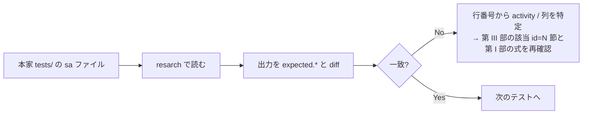

1. まず `tests/data-12.0.0` (現行形式、変換不要) の `sar -AC` 相当で全 activity を通す
2. 次に `tests/data-ppc-11.7.2` でエンディアン変換を通す
3. `sadf -j` / `-x` / `-d` / `-p` / `-r` の 5 形式を `data-11.6.5.tmp` で通す
4. `-x` / `--human` / `--dec` / `-z` / `-i` / `-s`/`-e` の各修飾を個別に通す

---

### 2. 一般に流布している誤解の訂正 (v12.8.0 時点)

Rust 実装時に「古い情報を参照して間違えやすい点」を列挙する。

| # | よくある想定 | v12.8.0 の実際 |
|---:|---|---|
| 1 | `record_header` に `uptime` と `uptime0` がある | **`uptime_cs` のみ**。単位は 1/100 秒。`uptime0` は 11.x 以前の構造体 (`sa_conv.h` の `old_record_header`) にしか存在しない |
| 2 | itv は jiffies なので HZ が必要 | itv は cs。**HZ は現行形式の読み出しには不要**。`sa_hz` は `sadf -H` の表示と旧形式変換時のみ使われる |
| 3 | `ll_s_value()` がある | **存在しない** (11.x で削除)。`ll_sp_value()` のみ |
| 4 | `SP_VALUE_100()` で 100% にクランプされる | **存在しない**。`sar`/`sadf` の出力に 100% クランプはない |
| 5 | `S_VALUE` と `SP_VALUE` は式が違う | v12.8.0 では**同一定義**。意味づけだけが違う |
| 6 | `--utc` オプションがある | **存在しない**。`sadf` は既定で UTC 表示、`-T` で localtime、`-t` でファイル作成時の TZ、`-U` で epoch 秒 |
| 7 | `sar -H` は human readable | **`-H` は hugepages 統計 (`A_HUGE`) の選択**。human readable は `--human`、`-h` は `--pretty --human` の別名 |
| 8 | `sadf -T` は epoch 秒 | `-T` は **localtime**。epoch 秒は `-U` |
| 9 | `Average:` は全サンプルの算術平均 | カウンタ型は「最初と最後の差分 / 全期間」。`A_FS`/`A_PWR_USB` は平均ではなく**最後の値の再掲** (`Summary:` / `Last:`) |
| 10 | activity ごとの出力は時刻順に混在する | ファイル読み出し時は**activity ごとにブロック化**され、COMMENT 行が activity ごとに繰り返される |
| 11 | `sar` の時刻は常に `HH:MM:SS` | **既定は `%X`** (ロケール依存、AM/PM になり得る)。`S_TIME_FORMAT=ISO` のときだけ固定の `"%H:%M:%S"`。`sadf` は常に `"%H:%M:%S"` |
| 12 | オフライン CPU は 0.00 で表示される | **行が出力されない** (`sar` / `-d` / `-p` / `-j` / `-x`)。`0.00`/`100.00` が出るのは tickless CPU。例外は `sadf -r` で、オフライン CPU も必ず出す |
| 13 | `-I` に割り込み番号リストを渡せる | **渡せない** (12.5.6 以降)。`-I` は `ALL` / `SUM` のみ。数値・名前リストは `--int=` |
| 14 | `sadf` に `--help` / `--human` / `--dec=` がある | **いずれも無い**。`--human` は `pr_stats.c` / `pr_xstats.c` からしか参照されず、`sadf` の全レンダラは無視する |
| 15 | `-P ALL` と `-P all` は同じ | **違う**。`ALL` = 集約 + 全 CPU 個別、`all` = 集約行のみ |
| 16 | `-s`/`-e` は日付も比較する | `datecmp()` は **時:分:秒だけ**を比較する。日跨ぎは `check_time_limits()` の `+24 時間` と `cross_day` フラグで表現する |
| 17 | `-s` に一致したレコードが最初に表示される | **表示されない**。`-s` に一致した最初のレコードは「前サンプル」として消費される |
| 18 | `Average:` 行のラベルは常に `Average:` | `-x` 併用時の**ヘッダ行**は `Summary:`。`A_PWR_USB` は常に `Summary:`、`A_FS` は `Summary:` / `-x` 時 `Last:` |
| 19 | 列幅 9 は固定幅 | 9 は**最小幅**。長いデバイス名 (`virbr0-nic` 等) が来ると行全体が右にずれる |
| 20 | `PT_USERAW` というレンダリングフラグがある | 正しくは **`PT_USERND`** (`%.0f` で出力)。`rndr_stats.h` を参照 |

---

### 3. 本家テスト資産に関する注意 (macOS / 大文字小文字を区別しないファイルシステム)

`tests/` には **大文字小文字だけが違うファイル名**のペアが存在する。

| 衝突するペア |
|---|
| `tests/expected.sadf-d-T-tz` ↔ `tests/expected.sadf-d-t-tz` |
| `tests/expected.sadf-r-T-tz` ↔ `tests/expected.sadf-r-t-tz` |
| `tests/expected.sadf-T-tz` ↔ `tests/expected.sadf-t-tz` |

macOS の既定ファイルシステム (APFS, case-insensitive) に clone すると
**片方しかワークツリーに展開されない**。内容を確認したい場合は
`git show HEAD:tests/expected.sadf-d-T-tz` のように Git オブジェクトから直接読む。

加えて、このツリーの `tests/expected.sadf-{d-,r-,}T-tz` は
対応する `-t-tz` 版とバイト同一で、`tests/01905` 側の `| grep` による絞り込みと
整合していない (= 期待値が古い可能性がある)。
**`-T` の仕様の根拠としては使わないこと。要検証。**
