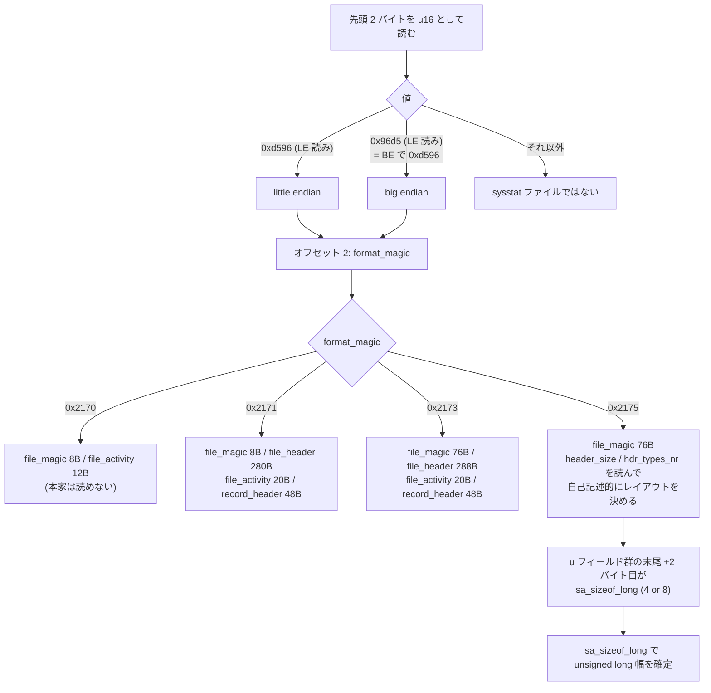
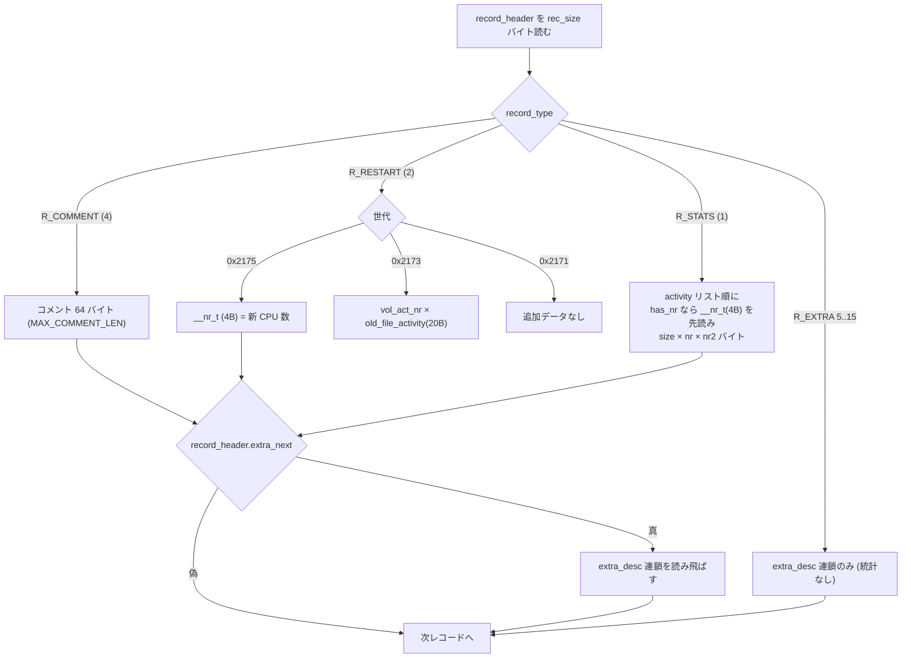
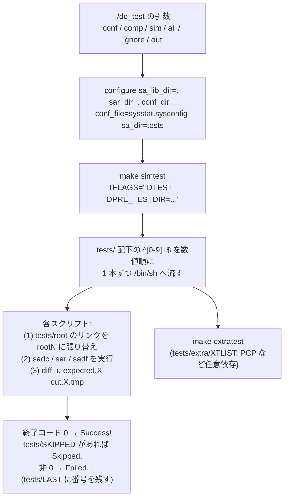
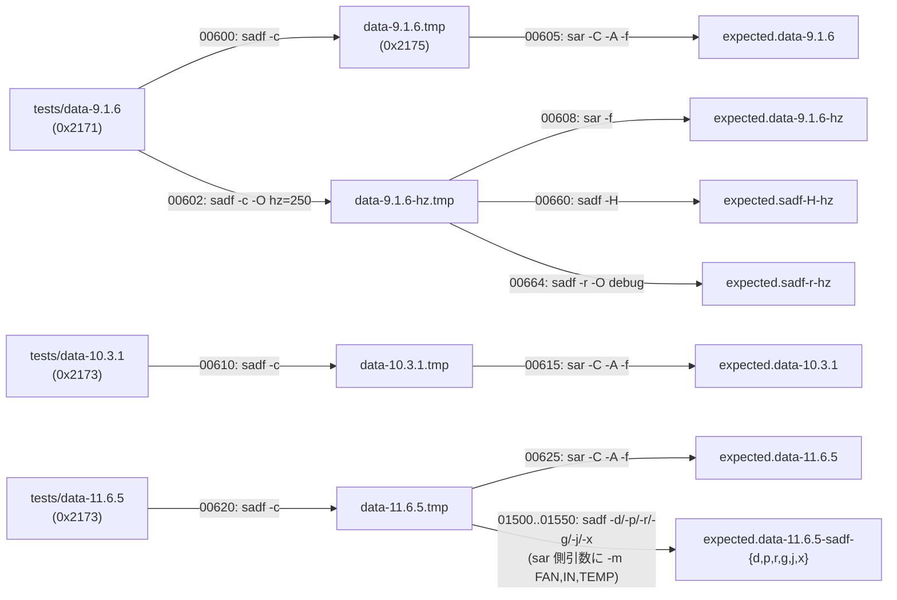
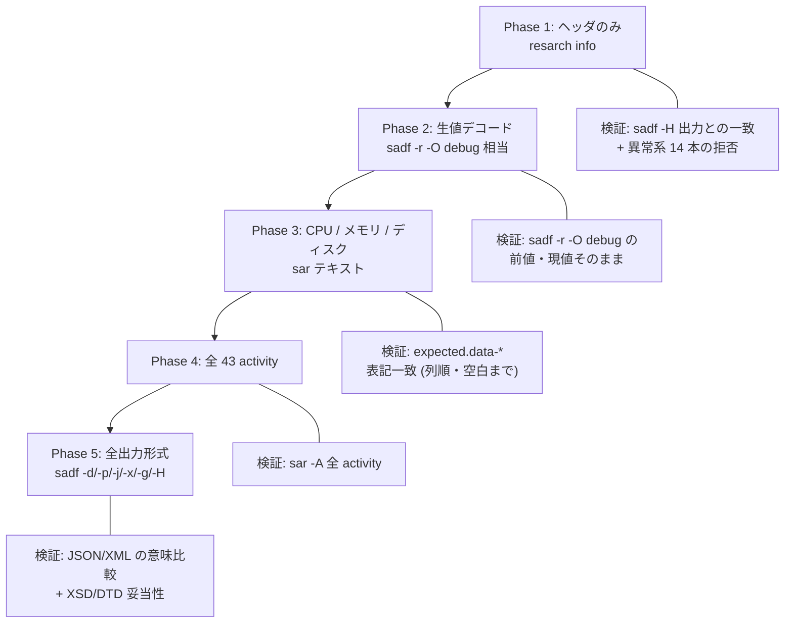
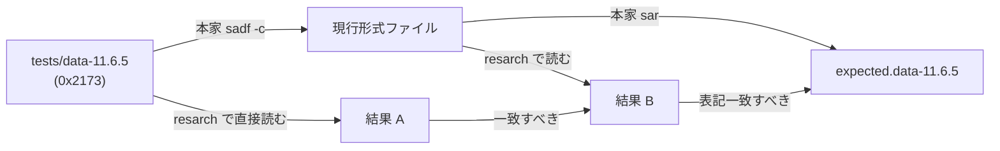
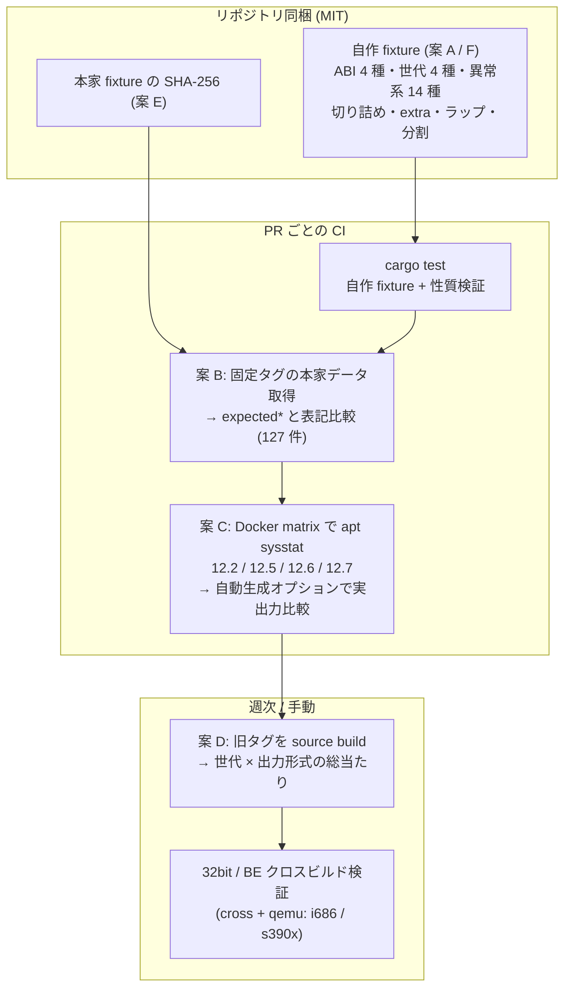
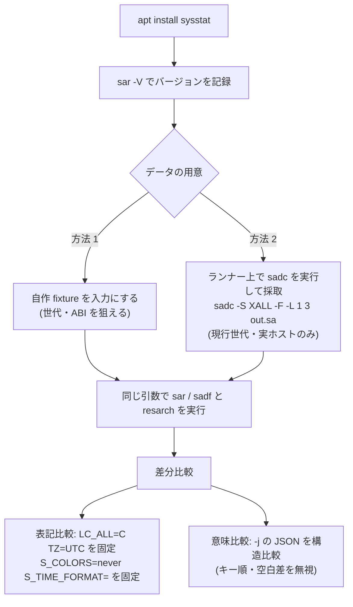

# 検証データとゴールデンテスト計画

reSARch の正当性を「本家 sysstat と同じ入力に対して同じ出力を返すか」で検証するための
基礎資料である。本家 sysstat リポジトリ (master, `AC_INIT([sysstat],[12.8.1])`) の
`tests/` ディレクトリを実測調査し、次の 3 点をまとめた。

1. 同梱バイナリ `sa` ファイル 28 本の素性 (世代・ABI・activity 構成・レコード構成)
2. 期待出力 313 本が「どのデータに、どのコマンドラインを適用した結果か」の対応
3. それを踏まえた reSARch 側のフェーズ別ゴールデンテスト計画と、GPL 回避を含む運用方式

設計全体は [`../design.md`](../design.md)、フォーマット仕様は
[`01-file-format.md`](01-file-format.md) / [`02-activities.md`](02-activities.md) /
[`03-output-format.md`](03-output-format.md) を参照。

> **実測と推測の区別** — 本文中、バイト列を引用している箇所および
> 「実測」と明記した数値は、`xxd` / `od` でヘッダ先頭を直接読み、
> 構造体レイアウトからオフセットを計算して求めた値である。
> 根拠が本家のソースコードやテストスクリプトの読解だけのものは「(推定)」と記す。

---

## 1. 調査の方法と再現手順

### 1.1 調査対象

| 項目 | 値 |
|---|---|
| 本家リポジトリ | `https://github.com/sysstat/sysstat` (master) |
| バージョン | `configure.ac` の `AC_INIT([sysstat],[12.8.1])` |
| `tests/` の総エントリ数 | 853 |
| 内訳 | 番号付きテストスクリプト 484、期待出力 `expected*` 313、バイナリ `sa` データ 28、XML 参照データ 1、`.out` シンボリックリンク 8、ディレクトリ 11 (`root1`〜`root7`, `root6b`, `32bits`, `12.0.1`, `extra`)、その他 (`TLIST`, `variables.in`, `STOP`, `root.README`, `create_data-*.c`, `ini` シンボリックリンク) |
| ライセンス | **GPL-2.0-or-later**。`COPYING` は GPL v2 本文だが、各ソースヘッダは "either version 2 of the License, or (at your option) any later version" と記す。Debian の `debian/copyright` は `Files: *` を `GPL-2+` と判定。**`tests/` 配下に別建ての許諾表示は無い**ので `Files: *` が及ぶ |

### 1.2 ヘッダ判定の手順 (実測)

`sa` ファイルは C 構造体をそのまま書き出した形式なので、次の順で読めば世代と ABI が確定する。



`0x2175` 世代の `file_header` のバイトオフセットは、`file_magic.hdr_types_nr` = `[ull, ul, u]` から導出する。

| フィールド | オフセット (構造体先頭から) | 根拠 |
|---|---|---|
| `sa_ust_time` (u64) | 0 | `hdr_types_nr[0] = 1` |
| `sa_hz` (unsigned long) | 8 | `__attribute__((aligned(8)))` |
| u フィールド群の先頭 | **16** | `sa_cpu_nr` も `aligned(8)`。32bit 機では `sa_hz` の後に 4 バイトのパディングが入る |
| `sa_day` | `16 + 4 × hdr_types_nr[2]` | |
| `sa_month` | 同 +1 | |
| `sa_sizeof_long` | 同 +2 | |
| `sa_sysname[65]` | 同 +3 | 以降 `sa_nodename` / `sa_release` / `sa_machine` が 65 バイト刻み |
| `sa_tzname[8]` | `sa_machine` の直後 | `hdr_types_nr[2] = 12` かつ `header_size = 336` の世代のみ |

u フィールド群の並びは
`sa_cpu_nr, sa_act_nr, sa_year, act_types_nr[3], rec_types_nr[3], act_size, rec_size, extra_next`
の 12 個。`hdr_types_nr[2]` がこれより小さい世代では **末尾から欠ける**
(`remap_struct()` が型グループの末尾に新フィールドを追記する規約であることを
`sa_common.c: remap_struct()` で確認)。実測で `hdr_types_nr[2] = 11` の世代は
`extra_next` を持たず `header_size = 328` になる。

### 1.3 レコード走査の検証

上記のレイアウトで全レコードを走査し、**ファイル末尾にぴったり到達するか**を検証した。
`data-9.1.6` / `data-10.3.1` / `data-11.6.5` / `data-12.0.0` / `data-ppc-11.7.2` /
`data-ukwn*` / `data-12.5.6-A_QUEUE_modified` / `data-extra-12.1.7` / `data-non-printable`
の 11 本すべてで、走査終端 == ファイルサイズ (余りバイト 0) を確認した。
レイアウト理解が正しいことの実証である。

レコードのペイロード長は次で決まる。



`extra_desc` は 24 バイト固定 (`extra_nr, extra_size, extra_next, extra_types_nr[3]` の
u32 × 6) で、`extra_nr × extra_size` バイトの本体が続き、`extra_next` が真なら連鎖する。
**`file_header.extra_next` が真のとき、その extra 連鎖は activity リストの直後に置かれる**
(`sa_common.c: check_file_actlst()` の末尾で読まれる)。これは `data-extra-12.1.7` で実測確認した。

---

## 2. 同梱バイナリ `sa` データの素性表

### 2.1 正常系・互換検証用 (バイナリ 6 本 + XML 参照 1 本)

| ファイル | バイト数 | 作成 sysstat 版 (magic 記載) | `format_magic` | エンディアン | `sizeof(long)` | act 数 | レコード数 (内訳) | ヘッダ日付 / `sa_ust_time` | 何を検証するか |
|---|---|---|---|---|---|---|---|---|---|
| `tests/data-9.1.5` | 6028 | 9.1.5 | **0x2170** | little | 8 | 13 | 2 (STATS 2、reSARch の直読) | 2021-06-10 / 1623329128 | **本家が変換不能な旧世代**の直読。`0x2170` は本家の対応下限より古いため、走査境界と自作 fixture で検証する |
| `tests/data-9.1.6` | 20784 | 9.1.6 | 0x2171 | little | 8 | 32 | 4 (RESTART 1 / COMMENT 1 / STATS 2) | 2017-01-21 / 1484986571 | `0x2171` 世代の読み替え (`sadf -c` 経由) |
| `tests/data-10.3.1` | 35108 | 10.3.1 | 0x2173 | little | 8 | 34 | 4 (RESTART 1 / COMMENT 1 / STATS 2) | 2017-01-21 / 1484986496 | `0x2173` 世代 + RESTART 後の volatile activity リスト |
| `tests/data-11.6.5` | 38884 | 11.6.5 | 0x2173 | little | 8 | 36 | 4 (RESTART 1 / STATS 1 / COMMENT 1 / STATS 1) | 2018-08-29 / 1535535218 | `0x2173` 世代の最終形 + センサ系 activity (`A_PWR_FAN/IN/TEMP`) |
| `tests/data-ppc-11.7.2` | 8888 | **11.5.5** | 0x2175 | **big** | **4** | 15 | 3 (STATS 3) | 2017-04-27 / 1493324675 | **big endian + 32bit** 経路。`upgraded = 0x703` = `(7<<8)+2+1` → **11.7.2 の `sadf -c` で変換済み** |
| `tests/data-12.0.0` | 22376 | 12.0.0 | 0x2175 | little | 8 | 36 | 4 (RESTART 1 / STATS 2 / COMMENT 1) | 2019-06-30 / 1561873161 | `0x2175` 世代の初期形 (`hdr_types_nr = [1,1,11]`, `header_size = 328`, `extra_next` なし) |
| `tests/data-12.7.6.xml` | 74948 | (XML 出力) | — | — | — | — | — | 2024-01-20 | `sadf -x` 出力の XSD / DTD 妥当性検証用の参照 XML。バイナリではない |

**`sa_month` は 0 起点 (`tm_mon`)、`sa_year` は 1900 起点 (`tm_year`)** である (実測)。
`data-12.0.0` の `sa_day = 30, sa_month = 5, sa_year = 119` に対し
期待出力のヘッダ行が `06/30/19` であることで確認した。ただし手書き生成の
`data-ukwn` / `data-ukwn0` / `data-extra-12.1.7` は `sa_year = 2019` (絶対年) が入っており、
`sadf -H` の `File date:` 行は `sa_ust_time` 由来なので表示は破綻しない。
**`sa_year` を信用した年の復元は避け、`sa_ust_time` を一次情報にすべき**という教訓になる。

#### 実測バイト列 (先頭 16〜28 バイト)

```text
data-9.1.5       96 d5 70 21 09 01 05 00 | 68 09 c2 60 00 00 00 00
                 ^^^^^ ^^^^^ ^^^^^^^^^^^   ^^^^^^^^^^^^^^^^^^^^^^^ sa_ust_time (u64)
                 magic fmt   9.1.5          = 0x60c20968 = 1623329128
                 → file_magic は 8 バイトのみ。以降が file_header

data-9.1.6       96 d5 71 21 09 01 06 00 | cb 18 83 58 00 00 00 00
                 20 00 00 00 15 00 75 08 | 4c 69 6e 75 78 ...
                 ^^^^^^^^^^^ ^^ ^^ ^^ ^^   "Linux"
                 sa_act_nr=32 d  m  y  szl=8   (d=21, m=0→1月, y=117→2017)

data-10.3.1      96 d5 73 21 0a 03 01 00 | 20 01 00 00 ...
                                            ^^^^^^^^^^^ header_size = 0x120 = 288

data-11.6.5      96 d5 73 21 0b 06 05 00 | 20 01 00 00 ...

data-ppc-11.7.2  d5 96 21 75 0b 05 05 00 | 00 00 01 48 | 00 00 07 03 |
                 ^^^^^ ^^^^^             ^^^^^^^^^^^^   ^^^^^^^^^^^^
                 BE!   0x2175            header_size=328  upgraded=0x703 → 11.7.2 で変換
                 00 00 00 01 00 00 00 01 00 00 00 0b   hdr_types_nr = [1,1,11]
                 (+136) 1b 03 04 4c 69 6e 75 78        d=27 m=3→4月 szl=4 "Linux"

data-12.0.0      96 d5 75 21 0c 00 00 00 | 48 01 00 00 | 00 00 00 00 |
                                            header_size=328  upgraded=0
                 01 00 00 00 01 00 00 00 0b 00 00 00   hdr_types_nr = [1,1,11]
                 (+136) 1e 05 08 4c 69 6e 75 78        d=30 m=5→6月 szl=8 "Linux"
```

#### 世代ごとの構造体サイズ (実測)

| `format_magic` | 対応 sysstat 版 | `file_magic` | `file_header` | `file_activity` | `record_header` |
|---|---|---|---|---|---|
| 0x2170 | 〜9.1.5 | 8 | 280 | **12** (`id, nr, size`) | (未調査) |
| 0x2171 | 9.1.6〜10.2.1 | 8 | 280 | 20 (`id, magic, nr, nr2, size`) | 48 |
| 0x2173 | 10.3.1〜11.6.x | 76 | 288 (`header_size` 記載) | 20 | 48 |
| 0x2175 | 11.7.1〜 | 76 | `header_size` 記載 (328 / 336) | `act_size` 記載 (36) | `rec_size` 記載 (24) |

`0x2170` の `file_activity` が 12 バイトであることは、`data-9.1.5` のオフセット 288 以降を
`01 00 00 00 | 09 00 00 00 | 90 00 00 00 | 02 00 00 00 | 01 00 00 00 | 20 00 00 00 | ...`
と読み、`(id=1 A_CPU, nr=9, size=144)`, `(id=2 A_PCSW, nr=1, size=32)`, ... という
3 フィールド × 13 件の並びとして解釈が通ることで確認した (`magic` フィールドが存在しない世代)。

`0x2170` は本家が `sadf -c` でも変換しないが、reSARch は**直読する**。
本家との変換後比較はできないため、独立 fixture と末尾までの走査 (`exact=true`) で検証する。
magic / has_nr / nr2 が無く、既知 ID の形式互換判定は Current となる制約がある。
`file_activity` の詳細レイアウトは参考情報である。

### 2.2 異常系・特殊系 (22 本)

| ファイル | バイト数 | 版 | magic | 構成 (実測) | 何を検証するか |
|---|---|---|---|---|---|
| `tests/data-trunc` | 1000 | 12.1.5 | 0x2175 | `hdr_types_nr=[1,1,11]`, 16 activity。オフセット 980 でレコードヘッダが途切れる | **途中切断**。`sar` は `End of system activity file unexpected` を出す。`sadf -g` は完全なレコードまで出す |
| `tests/data-non-printable` | 536 | 12.2.0 | 0x2175 | 1 activity (`A_CPU`)、R_COMMENT 1 件。コメント本体は `Hello\x05\x07o\x0dld!` | **非印字文字のサニタイズ**。期待出力は `COM Hello..o.ld!` |
| `tests/data-ukwn` | 1136 | 12.1.7 | 0x2175 | `A_CPU[8b]`, `A_PCSW[**0xff**]`, **`id=255`**`[8a]`。STATS 2 件 | **未知 activity ID** と**既知 ID / 未知 magic** の同時存在。両方を読み飛ばして他を表示できるか |
| `tests/data-ukwn0` | 612 | 12.1.7 | 0x2175 | `A_PCSW[0xff]`, `id=255[8a]` のみ (既知形式の activity ゼロ) | **表示可能な activity が 1 つも無い**ケース |
| `tests/data-ukwn1` | 2872 | 12.5.6 | 0x2175 | `A_CPU[8b]`, `A_QUEUE[**0x8d**]` (未知 magic)。STATS 3 件 | 未知 magic の activity を挟んだときの後続 activity のオフセット維持 |
| `tests/data-12.5.6-A_QUEUE_modified` | 1472 | 12.5.6 | 0x2175 | `A_PCSW`, `A_QUEUE[**0x9e**] types_nr=[2,0,4] size=32`, `A_NET_DEV` | **ull 個数が減り u 個数が増えた**構造体。`remap_struct` で救えないので UNKNOWN 扱いにし、他の activity は読めること |
| `tests/data-12.7.1-A_IRQ_overflow` | 448 | 12.7.1 | 0x2175 | activity 1 件のみ、**レコードは 0 件**。`A_IRQ: nr=8193, nr2=4096, size=1024` | **`nr × nr2 × size` の乗算オーバーフロー**。8193×4096×1024 = 34,363,932,672 バイト (= 0x8_0020_0000、`UINT_MAX` の約 8 倍)。`sadf -H` は成功し、`sar -A` は `Aborting` で落ちる |
| `tests/data-extra-12.1.7` | 1448 | 12.1.7 | 0x2175 | `file_header.extra_next = 1`。activity 2 件 (`A_CPU`, `A_PCSW`)。レコード 4 件: RESTART(extra あり) / **R_EXTRA (type=8)** / STATS(extra あり) / STATS | **extra 構造体**の全パターン。生成元は `tests/create_data-extra.c` |
| `tests/data-12.6.0-file_hdr-sa_act_nr-err` | 448 | 12.6.0 | 0x2175 | `sa_act_nr = 257` | `sa_act_nr > MAX_NR_ACT (256)` |
| `…-file_hdr-MAP_SIZE_act_types_nr-err` | 448 | 12.6.0 | 0x2175 | `act_types_nr = [1,1,10]` | `MAP_SIZE(act_types_nr) = 56 > act_size = 36` |
| `…-file_hdr-MAP_SIZE_rec_types_nr-err` | 448 | 12.6.0 | 0x2175 | `rec_types_nr = [3,1,2]` | `MAP_SIZE(rec_types_nr) = 40 > rec_size = 24` |
| `…-file_hdr-act_size-err` | 448 | 12.6.0 | 0x2175 | `act_size = 1025` | `> MAX_FILE_ACTIVITY_SIZE (1024)` |
| `…-file_hdr-rec_size-err` | 448 | 12.6.0 | 0x2175 | `rec_size = 513` | `> MAX_RECORD_HEADER_SIZE (512)` |
| `…-file_act-nr-0-err` | 448 | 12.6.0 | 0x2175 | `fal.nr = 0` | `nr < 1` |
| `…-file_act-nr-err` | 448 | 12.6.0 | 0x2175 | `fal.nr = 268435457` | `nr > NR_MAX` |
| `…-file_act-nr-nr_max-err` | 448 | 12.6.0 | 0x2175 | `A_PCSW` の `nr = 2` | activity 個別の上限 `nr > act->nr_max` (A_PCSW は 1) |
| `…-file_act-nr2-0-err` | 448 | 12.6.0 | 0x2175 | `fal.nr2 = 0` | `nr2 < 1` |
| `…-file_act-nr2-err` | 448 | 12.6.0 | 0x2175 | `fal.nr2 = 4097` | `nr2 > NR2_MAX` |
| `…-file_act-size-0-err` | 448 | 12.6.0 | 0x2175 | `fal.size = 0` | `size <= 0` |
| `…-file_act-size-err` | 448 | 12.6.0 | 0x2175 | `fal.size = 1025` | `> MAX_ITEM_STRUCT_SIZE (1024)` |
| `…-file_act-types_nr-SARerr` | 448 | 12.6.0 | 0x2175 | `types_nr = [0,2,0]` (`MAP_SIZE = 16 == size`) | **ヘッダ検査は通るが `sar` の段階で落ちる**境界値。`sadf -H` は成功すべき |
| `…-file_act-MAP_SIZE_types_nr-err` | 448 | 12.6.0 | 0x2175 | `types_nr = [2,2,0]` (`MAP_SIZE = 32 > size = 16`) | `MAP_SIZE(types_nr) > size` |

#### `data-12.6.0-*` 14 本の作り方 (実測)

14 本は同一の 448 バイトの正常ファイルから**1 フィールドだけ**を書き換えて作られている。
14 本を多数決でバイト合成して基準ファイルを復元し、各ファイルとの差分を取った結果:

| 基準ファイルの内容 (多数決で復元) | 値 |
|---|---|
| `header_size` / `hdr_types_nr` | 336 / `[1,1,12]` |
| `sa_cpu_nr`, `sa_act_nr`, `sa_year` | 9, 1, 122 (= 2022) |
| `act_types_nr`, `rec_types_nr` | `[0,0,9]`, `[2,0,1]` |
| `act_size`, `rec_size`, `extra_next` | 36, 24, 0 |
| `sa_day`, `sa_month`, `sa_sizeof_long` | 3, 3 (= 4 月), 8 |
| activity 1 件 | `id=2 (A_PCSW), magic=0x8b, nr=1, nr2=1, has_nr=0, size=16, types_nr=[1,1,0]` |

差分は **各ファイルにつき 1 フィールド + `sa_ust_time` の下位 1〜2 バイト**だけだった
(タイムスタンプを 1 本ずつずらして別ファイルにしている)。ファイル内のバイト位置は次の通り。

| バイト位置 | フィールド |
|---|---|
| 8 | `file_magic.header_size` |
| 92 / 96 / 100 | `sa_cpu_nr` / `sa_act_nr` / `sa_year` |
| 104,108,112 | `act_types_nr[0..2]` |
| 116,120,124 | `rec_types_nr[0..2]` |
| 128 / 132 / 136 | `act_size` / `rec_size` / `extra_next` |
| 412..447 | `file_activity[0]`: `id(412) magic(416) nr(420) nr2(424) has_nr(428) size(432) types_nr(436,440,444)` |

**reSARch 側でも同じ手口で異常系 fixture を自作できる**。基準ファイルは自作 fixture
生成器で作り、バイト位置を書き換えるだけなので GPL データを持ち込む必要がない (→ §6.2 案 A)。

### 2.3 `data-ppc-11.7.2` の重要な特異点 — 壊れた `ust_time` が正解

このファイルの `record_header.ust_time` を big endian u64 として素直に読むと、
1 件目が `2203255385` (= 2039-10-26 15:23:05 UTC) という非現実的な値になる。
これは 32bit big endian の `unsigned long ust_time` を 64bit の
`unsigned long long ust_time` へ移す際の `sadf -c` 変換の副作用である
(バイト列は `00 00 00 00 83 53 02 59` で、下位ワードだけバイト逆順になっている)。

**しかし本家の期待出力 `tests/expected.data-ppc-11.7.2` の時刻は
`15:23:05` / `19:43:21` / `00:03:37` であり、まさにこの「壊れた値」から算出された時刻である。**
`sar` は日付を `file_header` から、時刻を `record_header.ust_time` から作るため、
年月日は `04/27/17` と正しく、時刻だけが破綻した状態で golden 化されている。

| レコード | `ust_time` (BE u64) | それを epoch と見た UTC | `hour/minute/second` バイト | 期待出力の時刻 |
|---|---|---|---|---|
| 1 | 2203255385 | 2039-10-26 **15:23:05** | `14 18 23` = **20:24:35** | `15:23:05` |
| 2 | 2220032601 | 2040-05-07 **19:43:21** | 20:24:36 | `19:43:21` |
| 3 | 2236809817 | 2040-11-18 **00:03:37** | 20:24:37 | `00:03:37` |

`record_header` の `hour/minute/second` バイト**だけは正しい値** (20:24:35〜37) が入っている。
つまり `sar -t` (true time) を付ければ正しい時刻が出て、既定 (`ust_time` 由来) では壊れる。
**同じファイルに正しい時刻と壊れた時刻が同居している**ので、
「どちらの経路で時刻を作ったか」を切り分ける素材にもなる。

> reSARch は**「値を賢く補正してはいけない」**。バイト列に忠実に読むことが正解である。
> このファイルは「独自に正しさを判断するコードを入れると落ちる」回帰テストとして極めて有用。

### 2.4 テスト時に生成されるデータファイル (非同梱)

本家テストの大半は、同梱バイナリではなく**テスト実行時に `sadc` が生成するファイル**を使う。
`do_test comp` でビルドされる `sadc` は `-DTEST` 付きなので、

- `/proc` の代わりに `tests/root` (シンボリックリンク先を `root1`〜`root7`, `root6b` に切り替え) を読む
- `--unix_time=<epoch>` でタイムスタンプを固定できる (`#ifdef TEST` 限定オプション)
- `uname()` が固定値になる → **`Linux 1.2.3-TEST (SYSSTAT.TEST) _x86_64_ (9 CPU)`**
- `VERSION` が **`99.9.9`** になる (`version.in` の `#ifdef TEST`)

つまり生成された `.tmp` ファイルは「決定論的で、実ホスト名を含まない」。
`expected.sadf-H` の 2 行目が `File created by sar/sadc from sysstat version 99.9.9` である
ことで実証される。

| 生成ファイル | 生成テスト | 生成レシピ (root 切替と `--unix_time`) | 用途 |
|---|---|---|---|
| `data-new.tmp` | 00050/00052/00054 | root1(`-S XALL,-A_PWR_*`)→root2→root3→root4→root5 の 5 サンプル + RESTART + COMMENT `Testing sysstat!` | 基本の全 activity |
| `data.tmp` | 00055/00057 | `data-new.tmp` をコピーし root6 で RESTART、さらに 2 サンプル追記 | **最大の検証母体 (54 件の golden)** |
| `data0.tmp` | 00060 | `-S A_NULL,A_PCSW` で RESTART のみ (統計レコード 0) | データが 1 件も無いファイル |
| `data0-1.tmp` | 00062 | `data0.tmp` に RESTART + 1 サンプル追記 | RESTART 連続 |
| `data1.tmp` | 00065 | root6→root7→root1(RESTART)→root1→root2 | `-q ALL` (load average) |
| `data2.tmp` | 00068 | root1→root2→root2(RESTART)→root6→root7 | `-q ALL` |
| `data-CPUoff.tmp` / `data-CPUoffon.tmp` | 00069 / 00067 | root1×2 / root2→root3→root4→root5 | **CPU のオフライン・オンライン遷移** |
| `data-ssr.tmp` | 00070 | root1→root2 (`-S XALL`、センサ込み) | センサ系 activity |
| `data-cd.tmp` | 00072 | 5 サンプル、**日付をまたぐ** | 日境界 |
| `datax.tmp` | 00074 | 19 回の `sadc` 呼び出し。RESTART・COMMENT 4 件・**時刻が逆行する記録**を含む | 拡張ヘッダ・複数コメント |
| `data-long.tmp` | 00076 | 6 サンプル、`A_DISK`/`A_NET_DEV`/`A_NET_FC` の item 増減 | **item の出現・消滅** |
| `data-tz.tmp` | 00100 | `TZ="Europe/Paris"` で 3 サンプル | タイムゾーン (`-T` / `-t` / `-U`) |
| `data-small_ust.tmp` | 00105 | `--unix_time=555593609` (1987 年) | 小さい epoch |
| `data-wghfreq.tmp` | 01600 | `-S A_NULL,A_PWR_FREQ` で 3 サンプル | 加重平均周波数 |
| `data-9.1.6.tmp` / `data-9.1.6-hz.tmp` | 00600 / 00602 | `sadf -c tests/data-9.1.6` / 同 `-O hz=250` | **旧世代の変換出力** |
| `data-10.3.1.tmp` / `data-11.6.5.tmp` | 00610 / 00620 | `sadf -c` | 同上 |
| `data-11.6.5-ow.tmp` | 00670/00675 | `data-11.6.5` をコピーし `sadc -F` で上書き | 非互換ファイルへの追記拒否と `-F` 強制上書き |
| `data32.tmp` / `data32-ssr.tmp` | 00080 / 00090 | `tests/32bits/sadc32` で生成 (32bit ビルドが必要) | **32bit 生成ファイル** |

---

## 3. テスト実行機構



| 構成要素 | 役割 |
|---|---|
| `do_test` | ドライバ。`configure` → `make simtest` → 番号付きスクリプトを数値順に実行 |
| `tests/TLIST` | 652 行の**人間向け索引**。「どの番号が何をするか」「データファイルの構成 (`.....RCR..` / `1234511667`)」のメモ。**機械可読ではない** |
| `tests/<5 桁数字>` | 実際のテスト本体。484 本。1 行 1 検証が基本で、`cmd > out.X.tmp && diff -u expected.X out.X.tmp` の形 |
| `tests/root` → `rootN` | 疑似 `/proc` `/sys` `/etc/mtab` `/dev`。`root.README` に各 root の意味 (uptime、CPU オン/オフ、USB/tape/CIFS の有無、mtab の重複エントリ等) が書かれている |
| `tests/variables.in` | `configure` が `VER_JSON` / `VER_XML` / `HAVE_PCP` / `TGLIB32` を埋める。依存が無ければテストは `Skipped` |
| `tests/ini` → `tests/12.0.1/` | **sysstat 12.0.1 のソース一式**。`inisar` をビルドし、「古い `sar` が新しいファイルを読めるか」(前方互換) を検証する (テスト 00750) |
| `tests/32bits/` | 32bit `sar32` / `sadc32` のビルド先。git 上は `README` のみ |
| `tests/STOP` | 中身は `false`。実行を止めたいときに番号付きスクリプトから参照する仕掛け (推定) |
| `tests/*.out` シンボリックリンク | `data.out -> expected2.sar-all` 等。期待出力を再生成するときの手作業用エイリアス。番号付きテストからは参照されない |

---

## 4. data ↔ expected 対応表

### 4.1 集計

| 入力 | golden 比較 (`diff -u`) の件数 |
|---|---|
| 疑似 `/proc` を直接読む (`iostat` / `mpstat` / `pidstat` / `tapestat` / `cifsiostat` / `sar` 実時間) | 196 |
| `sa` ファイル経由 (`sar -f` / `sadf`) | **127** |
| 入力なし (`-V`, `sa2`, 引数なし `sadf`) | 5 |
| 合計 | 328 |

reSARch は**ファイル解析専用**なので、対象は `sa` ファイル経由の **127 件**である。
うち同梱バイナリ由来が 15 件、テスト生成 `.tmp` 由来が 112 件。

### 4.2 同梱バイナリ由来 (全件・機械的に復元 = 確実)

`${T_SRCDIR}` は本家リポジトリのルート。`LC_ALL=C` / `TZ` は再現性のため必須。

| テスト | 入力 | コマンドライン | 期待出力 |
|---|---|---|---|
| 00650 | `data-12.0.0` | `LC_ALL=C TZ=GMT ./sar -AC -f tests/data-12.0.0` | `expected.data-12.0.0` |
| 00655 | `data-12.0.0` | `LC_ALL=C TZ=GMT ./sadf -H tests/data-12.0.0 \| grep -v 0x2175` | `expected.data-12.0.0-H` |
| 00700 | `data-ppc-11.7.2` | `LC_ALL=C TZ=GMT ./sar -C -A -f tests/data-ppc-11.7.2` | `expected.data-ppc-11.7.2` |
| 00740 | `data-non-printable` | `LC_ALL=C TZ=GMT ./sar -C -f tests/data-non-printable` | `expected.sar-non-printable` |
| 00760 | `data-12.5.6-A_QUEUE_modified` | `LC_ALL=C TZ=GMT ./sar -A -f …` | `expected.data-12.5.6-A_QUEUE_modified` |
| 00770 | `data-extra-12.1.7` | `LC_ALL=C TZ=GMT ./sar -A -f …` | `expected.data-extra-12.1.7` |
| 00780 | `data-ukwn` | `LC_ALL=C TZ=GMT ./sar -P ALL -f …` | `expected.sar-data-ukwn` |
| 00784 | `data-ukwn` | `LC_ALL=C TZ=GMT ./sar -w -f …` | `expected2.sar-data-ukwn` |
| 00787 | `data-ukwn` | `LC_ALL=C ./sadf -H … \| grep -v 0x2175` | `expected.sadf-data-ukwn` |
| 00790 | `data-ukwn0` | `LC_ALL=C TZ=GMT ./sar -A -f …` | `expected2.sar-data-ukwn` (00784 と同一) |
| 00791 | `data-ukwn0` | `LC_ALL=C ./sadf -H … \| grep -v 0x2175` | `expected.sadf-data-ukwn0` |
| 00793 | `data-ukwn1` | `LC_ALL=C TZ=GMT ./sar -uq -f …` | `expected3.sar-data-ukwn` |
| 00794 | `data-ukwn1` | `LC_ALL=C ./sadf -H … \| grep -v 0x2175` | `expected.sadf-data-ukwn1` |
| 01405 | `data-trunc` | `LC_ALL=C TZ=GMT ./sadf -g … -- -A 2>/dev/null` | `expected.sadf-g-trunc` |
| 00420 / 00430 | `data-12.7.6.xml` | `xmllint --schema xml/sysstat.xsd -` / `--dtdvalid xml/sysstat-*.dtd -` | (妥当性のみ、diff なし) |

#### 期待出力を持たない「エラーメッセージ検証」テスト (全件)

| テスト | 入力 | コマンド | 合格条件 |
|---|---|---|---|
| 00730 | `data-*-err` 13 本 (glob ループ) | `./sadf -H $file` | stderr に `Invalid system` を含む |
| 00732 | `data-12.6.0-file_act-types_nr-SARerr` | `./sadf -H` → **成功** / `./sar -f` | `sar` 側で `Invalid system` |
| 00734 | `data-12.7.1-A_IRQ_overflow` | `./sadf -H` → **成功** / `./sar -f … -A` | `sar` 側で `Aborting` |
| 01400 | `data-trunc` | `./sar -f` | `End of system activity file unexpected` |
| 01450 | `data-9.1.6` | `./sar -f` | `Try to convert` (= `sadf -c` を促す) |
| 01452 | `data-9.1.5` | `./sar -f` | `cannot read the format of this file` を含み、かつ `Try to convert` を**含まない** |
| 00670 | `data-11.6.5-ow.tmp` | `./sadc 1 1 <file>` | `Invalid system activity` (非互換ファイルへの追記拒否) |
| 01020 | `data1.tmp` | `./sadc -S A_NULL,A_PSI_CPU … 1 1` | `Requested activities not available` |

### 4.3 変換経路 (旧世代 → 現行) の golden



**重要** — 旧世代ファイル (`0x2171` / `0x2173`) に対する `sar` の golden は
「`sadf -c` で現行形式へ変換したファイル」に対するものである。
本家の `sar` は旧世代を直接読まず `Try to convert` で拒否する (テスト 01450)。

一方 reSARch は設計上**旧世代を直接読む**方針なので、
`expected.data-9.1.6` / `expected.data-10.3.1` / `expected.data-11.6.5` は
`tests/data-9.1.6` などを**変換なしで直接読んだ結果**と比較できる。
`sadf -c` の変換は値を変えない (構造体のフィールド移動と型拡張のみ) ため、これは妥当である。
ただし `-O hz=250` のように変換時にパラメータを与えたケース
(`expected.data-9.1.6-hz`) は、reSARch 側でも同等のオプションが無いと再現できない。

### 4.4 テスト生成 `.tmp` 由来 — 主要な option 網羅 (抜粋、いずれも機械的復元 = 確実)

`data.tmp` (54 件) がオプション網羅の中心である。全件は本家 `tests/00xxx` を参照。

| 観点 | テスト | コマンド (抜粋) | 期待出力 |
|---|---|---|---|
| 全 activity テキスト | 00161 | `sar -A -f data.tmp` | `expected2.sar-all` |
| 拡張統計 | 00162 / 00163 | `sar -A -x` / `sar -xzh -n DEV -d -u -P ALL -q ALL` | `expected2.sar-xall` / `expected2.sar-x2` |
| 割り込みフィルタ | 00134 | `sar -I --int=0,3,30-50,4000-,LOC,PWD,MCE-XXX,TLB,sum -P all,3 --pretty` | `expected.sar-I` |
| 時刻書式 / 色 | 00180 / 00184 / 00190 / 00194 | `S_TIME_FORMAT=ISO`, `S_COLORS=never/auto/always`, `S_COLORS_SGR=…` | `expected.sar-ISO`, `expected.sar-autonever`, `expected.sar-always`, `expected3.sar-always` |
| 列見出し繰り返し | 00192 | `S_REPEAT_HEADER=2 sar --getenv -f` | `expected.sar-rep_hdr` |
| 小数桁 / 人間可読 | 00830 / 00840 | `sar --dec=0 -A` / `sar --human -A` | `expected.sar-dec` / `expected.sar-human` |
| item フィルタ | 00800/00810/00820/00825/00826 | `--iface=` / `--dev=` / `--fs=` / `-F MOUNT` | `expected.sar-iface` 他 |
| 永続デバイス名 | 00900〜00908 | `sar -dh -j UUID/ID/SID`, `sar -F -j UUID` | `expected.sar-jUUID` 他 |
| 時刻範囲 | 00850 / 01950 / 01975 / 01976 | `-s/-e HH:MM:SS`, `-e <epoch>` | `expected.sar-se` 他 |
| 間引き / 回数 | 00860 / 00870 / 00880 | `sar -i 60 -uw -P ALL`, `sar 60 -uw`, `sar 60 2` | `expected.sar-i`, `expected3.sar-i` |
| ゼロ省略 | 00920 | `sar -e 13:30 -z -n DEV -dp` | `expected.sar-z` |
| `sadf` 全形式 | 00500/00510/00520/00530/00540/00560/00570 | `-p` / `-d` / `-x` / `-j` / `-g` / `-H` / `-r -O debug` | `expected.sadf-{p,d,x,j,g,H,r}` |
| `sadf -g` オプション | 00542/00550/00555 | `-O height=370`, `-O autoscale,packed,oneday,showidle,showtoc,skipempty,showinfo,bwcol`, `-O customcol` + `S_COLORS_PALETTE` | `expected3.sadf-g` 他 |
| タイムゾーン | 01900〜01928 (9 件) | `TZ="America/New_York" sadf -{g,d,r} [-T / -t なし] -- -uw` | `expected.sadf-{,d-,r-}{,T-,t-}tz` |
| 旧 `sar` で新ファイル | 00750 | `./tests/ini/inisar -C -A -f data.tmp` (sysstat 12.0.1 ビルド) | `expected.data-ini` |
| CPU オフライン遷移 | 00150/00155/01830/01835 | `sar -u ALL -I -n SOFT -P all,8`, `sadf -g -- -P 8` | `expected.sar-CPUoffon` 他 |
| item 増減 | 00585/01820/01825 | `sadf -d --iface=enp6s0 -- -n DEV 65`, `sadf -g -- -d --dev=sds …` | `expected.sadf-i`, `expected.sadf-disc` |
| 日境界 | 01755 | `sar -uw -f data-cd.tmp -s 23:59:58 -e 00:00:00` | `expected.sar-cd` |
| 統計ゼロ件 | 01100/01110/01120/01150 | `sar -A -f data0.tmp`, `sadf -x / -g data0.tmp -- -A` | `expected0.*` |
| RESTART 連続 | 01210/01220/01240/01250 | `sar -A -f data0-1.tmp`, `sadf -{d,g,H}` | `expected01.*` |
| センサ | 01575/01580 | `sar -w -f data-ssr.tmp` (64bit / 32bit 両方) | `expected.sar-ssr` |
| 加重平均周波数 | 01610〜01660 | `sar -m FREQ -P ALL`, `sadf -{d,p,r,j,x} -- -m FREQ -P ALL` | `expected.sar-m-freq`, `expected.data-wghfreq-sadf-*` |
| 32bit ファイル | 00710/00720 | `sar -C -A -f data32.tmp`, `sar -w -f data32-ssr.tmp` | `expected.sar32-A`, `expected.sar32-ssr` |
| 32bit `sar` × 64bit ファイル | 00715 | `tests/32bits/sar32 -C -A -f data.tmp 1 2` | `expected2.sar32-A` |

---

## 5. reSARch のゴールデンテスト計画

### 5.1 全体像

`design.md` §12 の実装フェーズに対応させ、検証を 5 段に分ける。
**各段で「同梱 fixture による検証」と「本家データによる検証」を必ず対にする。**



### 5.2 Phase 1 — ヘッダ解析のみ

**目標**: 全世代の `file_magic` / `file_header` / `file_activity` を読み、
世代・ABI・activity 一覧を出力できる。

`sadf -H` の出力は**ヘッダ情報だけで構成される**ので、Phase 1 の golden として最適である。
先頭行 `System activity data file: <path> (0x2175)` はパスを含むので、
本家テストと同じく `grep -v 0x2175` で落とす (あるいはパスを正規化する)。

| データ | 検証内容 | golden |
|---|---|---|
| `tests/data-12.0.0` | `hdr_types_nr = [1,1,11]` の旧 `0x2175`。`extra_next` 無し | `expected.data-12.0.0-H` |
| `tests/data-ukwn` | 未知 ID / 未知 magic の `[Unknown format]` 表示 | `expected.sadf-data-ukwn` |
| `tests/data-ukwn0` | 既知 activity ゼロ | `expected.sadf-data-ukwn0` |
| `tests/data-ukwn1` | 未知 magic 混在 | `expected.sadf-data-ukwn1` |
| `tests/data-ppc-11.7.2` | **big endian + 32bit**。`_ppc_` 表示、`Size of a long int: 4` | (`sadf -H` の golden は本家に無い → CI で生成、または自作 fixture) |
| `tests/data-9.1.6` / `data-10.3.1` / `data-11.6.5` | 旧世代を**直接**読む (本家は `-c` 変換が必要) | 本家 golden なし → §5.7 の「自己整合性検証」で担保 |
| `tests/data-9.1.5` | `0x2170` を直読する (本家では比較不可) | 全レコード走査で `exact=true` |
| `tests/data-12.6.0-*` 14 本 | すべて `Invalid system activity file` 相当で拒否。ただし `types_nr-SARerr` と `A_IRQ_overflow` は**ヘッダ表示は成功**すること | 終了コードと stderr |

`sadf -H` の出力書式は次の 13 項目 (実測)。

```text
System activity data file: <path> (0x2175)
File created by sar/sadc from sysstat version <v.p.s>
Genuine sa datafile: yes (0)                 ← upgraded == 0 なら yes、非 0 なら no (16 進)
Host: <sysname> <release> (<nodename>) \t<MM/DD/YY> \t_<machine>_\t(<N> CPU)
File date: YYYY-MM-DD                        ← sa_ust_time 由来
File time: HH:MM:SS <TZ> (<epoch>)
Timezone: <sa_tzname>                        ← 無い世代では空
File composition: (h0,h1,h2),(a0,a1,a2),(r0,r1,r2)   ← hdr/act/rec types_nr
Size of a long int: <4|8>
HZ = <sa_hz>
Number of activities in file: <sa_act_nr>
Extra structures available: <Y|N>
List of activities:
<ID>: [<magic>] <A_NAME>  <Y|N>: <nr>[x<nr2>]\t(<t0>,<t1>,<t2>) [\t[Unknown format]]
```

`Genuine sa datafile:` 行は `file_magic.upgraded` の値で決まる。
`0` なら `yes (0)`、非 0 なら `no (<16 進>)` になる。

`upgraded` は `sadf -c` で変換したときに**変換を行ったバイナリ自身のバージョン**から
`(patchlevel << 8) + sublevel + 1` として書き込まれる (`sa_conv.c: upgrade_magic_section()`)。
`expected.sadf-H-hz` の `no (90a)` は、テストビルドの `VERSION` が `99.9.9` なので
`(9 << 8) + 9 + 1 = 0x90a` となった結果である (実測)。
同様に `data-ppc-11.7.2` の `upgraded = 0x703` は `(7 << 8) + 2 + 1` で
**11.7.2 の `sadf -c` で変換された**ことを示す。
`format_magic` が X 系列を示すので、X.patchlevel.sublevel が復元できる仕組みである。

### 5.3 Phase 2 — 生値デコード (差分計算なし)

`sadf -r -O debug` は**累積カウンタの前サンプル値と現サンプル値をそのまま並べる**
ので、レート計算を挟まずにデコードの正しさだけを検証できる。Phase 2 の唯一の golden にすべき。

```text
# uptime_cs; 719255; ust_time; 1555593609; extra_next; 0; record_type; 1; HH:MM:SS; 13:20:09
# name; A_CPU; nr_curr; 9; nr_alloc; 10; nr_ini; 10
13:20:19 UTC; CPU; -1; %usr; 96005; 96538; %nice; 2578701; 2581805; ...
```

| データ | golden | 狙い |
|---|---|---|
| `data-11.6.5.tmp` (`sadf -c tests/data-11.6.5`) | `expected.data-11.6.5-sadf-r` | `0x2173` 世代のセンサ系構造体 |
| `data-9.1.6-hz.tmp` | `expected.sadf-r-hz` | `0x2171` 世代 + `HZ` 上書き |
| `data.tmp` | `expected.sadf-r` | 現行世代の全 activity |
| `data-wghfreq.tmp` | `expected.data-wghfreq-sadf-r` | `A_PWR_FREQ` の加重平均 |

### 5.4 Phase 3 — CPU / メモリ / ディスク の `sar` テキスト

`design.md` §12 の「縦断的な検証を先に通す」に対応。
big endian・32bit・旧固定形式・自己記述形式をこの段で全部通す。

| データ | コマンド | golden | 通る経路 |
|---|---|---|---|
| `tests/data-ppc-11.7.2` | `sar -C -A -f` | `expected.data-ppc-11.7.2` | **BE + 32bit + 変換済みファイル** |
| `tests/data-12.0.0` | `sar -AC -f` | `expected.data-12.0.0` | 自己記述形式の初期形 |
| `data-11.6.5.tmp` | `sar -C -A -f` | `expected.data-11.6.5` | `0x2173` |
| `data-10.3.1.tmp` | `sar -C -A -f` | `expected.data-10.3.1` | `0x2173` (初期形) |
| `data-9.1.6.tmp` | `sar -C -A -f` | `expected.data-9.1.6` | `0x2171` |
| `tests/data-non-printable` | `sar -C -f` | `expected.sar-non-printable` | COMMENT のサニタイズ |
| `tests/data-extra-12.1.7` | `sar -A -f` | `expected.data-extra-12.1.7` | extra 構造体・R_EXTRA レコード |
| `tests/data-ukwn`/`ukwn0`/`ukwn1` | `sar -P ALL` / `-w` / `-A` / `-uq` | `expected*.sar-data-ukwn` | 未知 activity のスキップ |
| `tests/data-12.5.6-A_QUEUE_modified` | `sar -A -f` | `expected.data-12.5.6-A_QUEUE_modified` | `remap` 不能構造体 |
| `tests/data-trunc` | `sar -f` / `sadf -g -- -A` | エラーメッセージ / `expected.sadf-g-trunc` | strict / lenient の切り分け |

### 5.5 Phase 4 / Phase 5

- Phase 4: `data.tmp` / `data-new.tmp` / `data-ssr.tmp` に対する `sar -A` 系。
  センサ (`A_PWR_*`) は「システム依存なので出力を検証しない」と本家自身が
  テスト 00725 のコメントで断っている。**テスト生成ファイルに対しては決定論的**なので
  golden 比較できる。
- Phase 5: `sadf -d` / `-p` / `-j` / `-x` / `-g` / `-H` / `-r`。
  `-j` は JSON パーサで、`-x` は `xml/sysstat.xsd` + `xml/sysstat-*.dtd` で
  **妥当性検証も併せて行う** (本家テスト 01547 / 01557 / 01559 / 00420 / 00430 と同じ)。
  `-g` (SVG) は数値と座標が混ざるので、**表記比較ではなく意味比較**にとどめるか、
  対応を後回しにする判断もあり得る。

#### 5.5.1 実際に取り込んだ golden (到達点)

本家テストが**リポジトリに静的に持っている**期待出力はすべて取り込んだ (21 件)。
`sadc` が生成する `data.tmp` に依存するケースは入力を再現できないので対象外である。

| 本家テスト | 期待出力 | 何を固定するか |
|---|---|---|
| 00650 / 00700 / 00740 / 00760 / 00770 / 00780 / 00784 / 00793 | `expected.data-12.0.0` 他 | `sar` テキスト。4 世代 × BE/32bit × 未知 id/magic |
| 00605 / 00615 / 00625 | `expected.data-{9.1.6,10.3.1,11.6.5}` | 旧世代の**直読**が「変換して `sar` で読んだ結果」と一致すること |
| 00655 / 00787 / 00791 / 00794 | `expected.*-H` / `expected.sadf-data-ukwn*` | ヘッダ解析と activity 一覧 (`[Unknown format]` の付け方) |
| **01500 / 01510 / 01520 / 01540 / 01550** | `expected.data-11.6.5-sadf-{d,p,r,j,x}` | 同じ入力・同じ activity 選択 (`-m FAN,IN,TEMP`) で**形式だけ**が違う 5 本 |
| 01405 | `expected.sadf-g-trunc` | 比較不能 (SVG の出力形式が無い) として毎回集計に出す |

`sadf` の 5 形式を横に並べたのが効く理由は、**値は同じで書式だけ違う**ため
単位換算やゼロ補完の不統一がその並びで初めて見えることにある
(`sar` 側だけを見ていると、両方が同じように間違っていても気付けない)。
電源センサ (`A_PWR_FAN` / `A_PWR_TEMP` / `A_PWR_IN`) を選ぶ理由は、
値が IEEE-754 double で保存されており `%temp` / `%in` が min/max を使う比率なので、
計算層の特殊経路がまとめて通ることである。

### 5.6 自作 fixture で担保する範囲 (同梱、MIT)

`design.md` §8 の「独自最小 fixture」に相当。本家データが無い / 持ち込めない穴を埋める。

| fixture | 内容 | 狙い |
|---|---|---|
| `abi_le64` / `abi_be64` / `abi_le32` / `abi_be32` | 同じ論理値を 4 通りの ABI で表現した最小ファイル (`A_CPU` 1 件 + STATS 1 件) | `Abi` によるオフセット導出。**LE/BE で正規化結果が一致**する性質検証 |
| `gen_2171` / `gen_2173` / `gen_2175_11` / `gen_2175_12` | 世代ごとの最小ファイル | 世代別レイアウトの往復 |
| `err_<field>` 14 種 | §2.2 の本家異常系と**同じ壊し方**を自作基準ファイルに適用 | 上限・整合性チェックの網羅。GPL データ不要 |
| `trunc_<n>` | 正常ファイルを 1 バイト刻みで切り詰めた列 | 「切り詰めから正常に見える値を作らない」性質検証 |
| `extra_chain` | `file_header` / RESTART / STATS の各位置に extra 連鎖 | extra 読み飛ばし |
| `wrap32` / `wrap64` | カウンタがラップする系列 | `Delta::Wrapped` / `AmbiguousDecrease` |
| `split_a` / `split_b` | 連続系列を 2 ファイルに分割 | 「連結後の結果が一致」性質検証 |

**`design.md` §8 の警告に従い、生成器と本体が同じレイアウト記述を共有しないこと。**
少数でも「本家のバイト列を根拠に手でオフセットを確定した」fixture を併置する。
本調査の §2 の実測バイト列がその根拠として使える (バイト列の短い引用は事実の記述であり、
プログラムの複製ではない)。

### 5.7 本家 golden が無い経路の担保 — 自己整合性検証

reSARch は旧世代を直接読むので、「旧世代を直接読んだ出力」の golden が本家に存在しない。
これは**メタモルフィック検証**で埋める。



- **A == B** が成立すれば、reSARch の旧世代デコードは `sadf -c` の変換と等価である。
- **B == expected** が成立すれば、現行形式の読みと表示が本家と一致している。
- 両方が成立して初めて A (旧世代の直読) が正しいと言える。

同じ関係を `0x2171` (`data-9.1.6`) と `0x2173` (`data-10.3.1`) にも適用する。

---

## 6. ライセンス — GPL データを MIT リポジトリに入れない

### 6.1 何が問題か

reSARch は **MIT** (`LICENSE`) である。一方 sysstat は **GPL-2.0-or-later** で、
`tests/` 配下に個別の許諾表示は無い。Debian の `debian/copyright` も
`Files: *` → `GPL-2+` (Sebastien Godard) と判定しており、`tests/` はこれに含まれる。

| 対象 | ライセンス | 同梱の可否 |
|---|---|---|
| sysstat のソース全体 | GPL-2.0-or-later | 不可 |
| `tests/data-*` (バイナリ `sa` ファイル) | 個別表示なし → `Files: *` の `GPL-2+` が及ぶ | **不可** |
| `tests/expected*` (期待出力) | 同上 | **不可** |
| `tests/root*` (疑似 `/proc`) | 同上 | 不可 (reSARch は `/proc` を読まないので不要) |
| `tests/create_data-*.c` (fixture 生成器) | 冒頭に GPL v2 ヘッダ明記 | **不可** (読解して仕様を学ぶのは可) |
| 構造体レイアウトの事実 (オフセット・サイズ・フィールド名・定数値) | 事実・インタフェース情報 | 記述可 |
| 短いバイト列の引用 (本文書 §2 のような) | 事実の提示 | 記述可 |

**MIT を掲げるプロジェクトが「たぶん大丈夫」で GPL 由来物を同梱するのは避ける。**
バイナリデータに著作物性があるかは論点になり得るが、リスクを取る理由がない。
「本家データはリポジトリに置かずテスト時に取得する」「別建ての GPL-2+ テストクレートに隔離する」
「自前生成する」のいずれかを選ぶ。

> **なぜここが製品価値に直結するか** — crates.io に `sa` バイナリを
> *ネイティブに解析する* クレートは存在しない (調査時点)。
> `sarv` (MIT) と `sysplot` (MIT OR Apache-2.0) はいずれも `sadf -j` を外部実行して
> その出力を整形するだけで、実行時に `sysstat` パッケージのインストールを要求する。
> reSARch は「sysstat 非依存の純 Rust パーサ」という空きニッチを埋める位置にあり、
> **GPL 非汚染であることがその価値の前提**になる。

### 6.2 回避案の比較

#### 案 A — 自作 fixture のみ同梱、本家データは使わない

| | |
|---|---|
| 利点 | ライセンス上完全に安全。CI がネットワークに依存しない。オフライン開発可 |
| 欠点 | 「本家と同じ表示になるか」を一切検証できない。自作 fixture は**自分の理解が間違っていると一緒に間違う** |
| 評価 | 単独では不十分。**必ず他案と併用**する |

#### 案 B — CI 実行時に本家リポジトリを取得する (推奨の中核)

```yaml
- name: Fetch upstream test fixtures
  run: cargo run --quiet --bin xtask -- fetch-fixtures
```

`xtask fetch-fixtures` が固定タグ (例 `v12.7.6`) の tarball を取得し、
SHA-256 を照合して `target/fixtures/` (gitignore 配下) に展開する。

| | |
|---|---|
| 利点 | GPL データがリポジトリに一切入らない。本家 golden をそのまま使える。**最も費用対効果が高い** |
| 欠点 | CI がネットワークに依存。ローカルでは `make fixtures` を明示実行する必要がある。取得先が消えると回帰検証が止まる |
| 対策 | タグとチェックサムを固定 (`design.md` §8 の方針と一致)。取得失敗時はテストを `ignored` 扱いにして CI 全体は落とさない (ただし別ジョブとして可視化する) |
| 評価 | **採用**。既に `.github/workflows/ci.yml` の `conformance` ジョブと `Makefile` の `fixtures` ターゲットに枠が用意されている |

#### 案 C — CI で `apt` の sysstat を入れ、`sar` / `sadf` の実出力と比較する

| | |
|---|---|
| 利点 | データも期待出力も同梱不要。**任意のオプション組み合わせを自動生成して比較できる** (本家 golden の 127 件に縛られない)。Docker matrix にすると `apt` だけで **12.2 / 12.5 / 12.6 / 12.7** の 4 世代に届く (→ §7.4) |
| 欠点 | 1 イメージあたり sysstat は 1 版のみ → **世代跨ぎ (旧ファイル × 新表示) は検証できない**。ディストリ独自パッチで出力が変わる可能性。`ubuntu-latest` のイメージ更新で基準が無言で動く。sysstat はランナーにプリインストールされていない |
| 対策 | `runs-on` はラベル固定 (`ubuntu-24.04` 等)。`sar -V` をテストレポートへ記録。世代の幅は Docker matrix で稼ぐ |
| 評価 | **採用**。案 B と併用。案 C は「オプション網羅 + 現行世代の複数版」、案 B は「旧世代の実ファイル」を担う |

#### 案 D — CI で sysstat を**ソースからビルド**し、複数バージョンを同時に用意する

```text
v9.1.6 / v10.3.1 / v11.6.5 / v12.0.0 / v12.7.6 の各タグを ./configure && make
→ それぞれの sadc で -DTEST ビルドしてデータ生成 + sar で期待出力生成
```

| | |
|---|---|
| 利点 | **全世代のデータと期待出力を CI 内で生成できる**。`--unix_time` が使えるので完全に決定論的。32bit も `-m32` で作れる |
| 欠点 | CI 時間が伸びる (1 版あたり数十秒〜1 分)。`-DTEST` ビルドには `tests/root*` (GPL) が必要。古いタグが新しい gcc/glibc でビルドできない場合がある |
| 対策 | matrix 並列 + キャッシュ。`tests/root*` は案 B の取得物を流用する (CI 内での一時利用であり同梱ではない) |
| 評価 | **週次 / 手動の拡張ジョブとして採用**。PR ごとには回さない |

#### 案 E — 期待出力をハッシュだけ同梱する

`expected.data-12.0.0` の SHA-256 だけをリポジトリに置き、出力が一致するか検証する。

| | |
|---|---|
| 利点 | GPL テキストを同梱しない。差分が小さい |
| 欠点 | **不一致時に何が違うのか分からない**。デバッグ不能に近い。データ本体は別途必要 |
| 評価 | 不採用。ただし「案 B で取得した fixture が改竄されていないか」の検証には使う |

#### 案 F — 本家のテストデータを「事実」から再構成して自作する

§2 の実測情報 (世代・ABI・activity 構成・`nr`/`nr2`/`size`/`types_nr`・レコード種別) は
すべて本文書に記録済みなので、**同等の構造を持つファイルを自作できる**。
統計値そのものは自分で決める。

| | |
|---|---|
| 利点 | ライセンス上安全。狙った条件を自在に作れる (§5.6 の fixture がこれ) |
| 欠点 | 期待出力は自分で計算するので、**計算式の誤りは検出できない** |
| 評価 | **採用**。構造の網羅には最適。表示の正しさは案 B / C に委ねる |

### 6.3 推奨構成



- **PR ごと**: 案 A/F (同梱 fixture) + 案 B (本家 golden 127 件) + 案 C (apt との差分)
- **週次**: 案 D (旧タグのソースビルド) + 32bit / BE
- `README` には「本家データは同梱していない。`make fixtures` で取得する」と明記する
- **ライセンス面で安全かつ実効性がある組み合わせは 案 A/F + 案 B + 案 C** である。
  GPL 由来物は 1 バイトもリポジトリに入らず、本家 golden 127 件と
  4 世代の実 `sar`/`sadf` 出力の両方に照合できる。

---

## 7. CI の具体的な実現方法

### 7.1 ジョブ構成

```yaml
jobs:
  test:                # 同梱 fixture のみ。ネットワーク不要。runs-on: ubuntu-24.04 固定
  conformance-golden:  # 案 B: 本家 tests/ を固定タグで取得し expected* と比較
  conformance-live:    # 案 C: Docker matrix (12.2/12.5/12.6/12.7) の sar/sadf と実出力比較
  conformance-multi:   # 案 D: 週次 (schedule) / 手動。旧タグをソースビルド
  conformance-abi:     # 週次。cross + qemu で i686 / s390x の resarch を検証
```

**`runs-on: ubuntu-latest` は使わない。** 現在は Ubuntu 24.04 (sysstat 12.6.1) を指すが、
切り替え時期が告知されないまま 26.04 (sysstat 12.7.7) に移ると golden が無言で壊れる。
既存の `.github/workflows/ci.yml` は `ubuntu-latest` を使っているので、
**conformance 系ジョブはラベル固定へ変更する**。

`test` 以外は `continue-on-error: false` だが、fixture 取得失敗時のみ
`Skipped` を許すようにする (本家テストの `tests/SKIPPED` と同じ思想)。

### 7.2 案 B の実装 (`xtask fetch-fixtures`)

```text
1. SYSSTAT_TAG (例 v12.7.6) と SYSSTAT_SHA256 を xtask 内に定数で持つ
2. https://github.com/sysstat/sysstat/archive/refs/tags/<TAG>.tar.gz を取得
3. SHA-256 を照合 (不一致なら失敗)
4. tests/ 配下の data-* と expected* のみを target/fixtures/ へ展開
   (root1..root7 は reSARch には不要)
5. target/ は .gitignore 済みなので commit されない
```

`tests/conformance.rs` は `target/fixtures/` が無ければ全ケースを
`eprintln!("skipped: run `make fixtures`")` で skip する。

### 7.3 案 C の実装 — `apt` の sysstat と実出力比較



環境固定は必須である (実測: 本家テストはすべて `LC_ALL=C` と `TZ` を明示している)。

| 環境変数 | 固定値 | 理由 |
|---|---|---|
| `LC_ALL` | `C` | 小数点・曜日・メッセージ |
| `TZ` | `UTC` (または各ケース指定) | 時刻表示 |
| `S_COLORS` | `never` | ANSI エスケープの混入防止 |
| `S_TIME_FORMAT` | 空 | `ISO` だと書式が変わる |
| `S_REPEAT_HEADER` | 未設定 | 見出し繰り返し |
| `S_COLORS_SGR` / `S_COLORS_PALETTE` | 未設定 | |

オプション網羅は「本家 golden の 127 件」をそのまま移植するのではなく、
**オプションの組み合わせを列挙して両者に同じ引数を渡す**方式にすると、
本家 golden に無い組み合わせまで検証できる。

```text
activity 選択:  -u ALL / -r ALL / -b / -d / -q ALL / -n DEV,EDEV / -I ALL / -F / -v / -w / -y / -B / -S / -H / -m CPU / -A
表示修飾:      (なし) / --pretty / --human / --dec=0 / --dec=2 / -h / -z / -x / -C
CPU 選択:      (なし) / -P ALL / -P 0,1
時刻:          (なし) / -s HH:MM:SS / -e HH:MM:SS / 両方
sadf 形式:     -d / -p / -j / -x / -r / -H / -g
```

### 7.4 `apt` で入る sysstat の版と、旧世代データの用意

#### GitHub Actions ランナーの現況 (2026-09 時点の実地調査)

| 項目 | 事実 |
|---|---|
| `ubuntu-latest` | **Ubuntu 24.04** を指す (runner-images README) |
| 利用可能なラベル | `ubuntu-26.04`, `ubuntu-26.04-arm`, `ubuntu-24.04`, `ubuntu-24.04-arm`, `ubuntu-22.04`, `ubuntu-22.04-arm`, `ubuntu-slim` |
| `ubuntu-22.04` | **2026-09-17 から非推奨開始、2027-04-17 に完全サポート終了** (runner-images #14254)。旧版検証の足場にしてはいけない |
| `ubuntu-26.04` | 2026-06-11 に全ユーザへ提供開始 (ドキュメント上は Public preview) |
| `ubuntu-latest` → 26.04 の移行 | **2026-10-19 から移行を始めると告知された** (runner-images #14748。CI の実行にも注記が出る)。README は「`-latest` の切り替えは 1〜2 か月かけて段階的に進む」と記す |
| sysstat のプリインストール | **無い**。`Ubuntu2404-Readme.md` / `Ubuntu2204-Readme.md` / `Ubuntu2604-Readme.md` の「Installed apt packages」表に `sysstat` / `sar` / `iostat` / `mpstat` / `pidstat` は 1 件も無く、`actions/runner-images` 全体のコード検索でも 0 件。`toolset-2404.json` / `toolset-2604.json` にも無く `install-sysstat.sh` も存在しない |

→ **`sudo apt-get install -y sysstat` を必ず書く**。
→ **`runs-on: ubuntu-latest` は使わずラベルを固定する** (`ubuntu-24.04` 等)。
`ubuntu-latest` が 26.04 に切り替わった瞬間に sysstat が 12.6.1 → 12.7.7 に飛び、
`sar` の出力書式が変わって golden が無言で壊れる。
併せて `sar -V` の出力をテストレポートへ必ず残し、
「どの版と比較したのか」を後から追えるようにする。

#### `apt` / ディストリごとの sysstat 版 (実地調査)

| ディストリ / スイート | sysstat 版 | 世代 |
|---|---|---|
| Ubuntu 20.04 focal (ESM) | `12.2.0-2` / updates `12.2.0-2ubuntu0.3` | 12.2 |
| Ubuntu 22.04 jammy | `12.5.2-2build2` / updates `12.5.2-2ubuntu0.2` | 12.5 |
| **Ubuntu 24.04 noble (= `ubuntu-latest`)** | **`12.6.1-2`** | **12.6** |
| Ubuntu 25.10 questing | `12.7.7-0ubuntu1` | 12.7 |
| **Ubuntu 26.04 LTS resolute** | **`12.7.7-0ubuntu2`** | **12.7** |
| Ubuntu 26.10 stonking (開発中) | `12.7.7-0ubuntu2` | 12.7 |
| Debian 11 bullseye | `12.5.2-2+deb11u1` | 12.5 |
| Debian 12 bookworm (oldstable) | `12.6.1-1` | 12.6 |
| Debian 13 trixie (stable) | `12.7.5-2` | 12.7 |
| Debian forky (testing) / sid | `12.7.5-2` | 12.7 |

**`apt` だけで 12.2 / 12.5 / 12.6 / 12.7 の 4 世代に触れる。**
Docker を使えば `ubuntu:20.04` / `ubuntu:22.04` / `ubuntu:24.04` / `debian:bookworm` /
`debian:trixie` を並べるだけで、CI ランナーのラベルに依存せず 4 世代を検証できる。
これは案 C を Docker matrix に拡張する強い動機になる。

```yaml
conformance-live:
  runs-on: ubuntu-24.04
  strategy:
    fail-fast: false
    matrix:
      image:
        - ubuntu:20.04     # sysstat 12.2.0
        - ubuntu:22.04     # sysstat 12.5.2
        - ubuntu:24.04     # sysstat 12.6.1
        - debian:bookworm  # sysstat 12.6.1
        - debian:trixie    # sysstat 12.7.5
  steps:
    - uses: actions/checkout@v5
    - name: Compare against distro sysstat
      run: |
        docker run --rm --hostname test-host \
          -v "$PWD:/src" -w /src ${{ matrix.image }} \
          sh -c 'apt-get update -qq &&
                 DEBIAN_FRONTEND=noninteractive apt-get install -y -qq sysstat &&
                 sar -V | head -2 &&
                 sh ci/compare-with-upstream.sh'
```

`compare-with-upstream.sh` は `sadc` でデータを採り、
`sar` / `sadf` と `resarch` に同じ引数を渡して差分を取る (→ §7.3)。
ただし**この方式では「その版が生成したファイルを、その版の `sar` で読む」しか検証できない**。
世代跨ぎ (古いファイル × 新しい表示) は案 B / D が必要である。

`ubuntu-26.04` を matrix に加えると 12.7.7 も見られるが、
そのイメージはまだ `apt` の Docker タグとして安定していない可能性があるため、
`runs-on: ubuntu-26.04` のランナーで直接 `apt install` する方が確実である (推定)。

`apt` の sysstat は 1 世代しか提供しないので、旧世代 (`0x2171` / `0x2173`) の
データは次のどれかで用意する。

| 方法 | 手順 | 評価 |
|---|---|---|
| 本家 `tests/` を取得 (案 B) | `tests/data-9.1.6` / `data-10.3.1` / `data-11.6.5` をそのまま使う | **最も確実**。旧世代の実ファイルが手に入る |
| 旧タグをソースビルド (案 D) | `git checkout v10.3.1 && ./configure && make` → `-DTEST` ビルドの `sadc --unix_time=…` で採取 | 決定論的だが、古いタグが現行 gcc でビルドできるかは要確認 |
| 自作 fixture (案 F) | §2 の実測レイアウトから生成 | 構造は再現できるが「本物」ではない |
| Docker で旧ディストリを使う | `debian:jessie` (sysstat 11.0.x) / `centos:7` (10.1.5) 等のイメージで `sadc` を実行 | 旧版のバイナリがそのまま入手できる。イメージの EOL に注意 |

**big endian のデータは `apt` では絶対に手に入らない** (→ §8)。

### 7.5 32bit / クロス検証ジョブ

```text
- 32bit ファイルの生成: sysstat を -m32 でビルド (gcc-multilib + libc6-dev-i386)
  → sadc32 でデータ生成 → 64bit の resarch で読む
- 32bit の resarch: cargo build --target i686-unknown-linux-gnu
  → 64bit データを読む (本家テスト 00715 相当)
- big endian の resarch: cargo build --target s390x-unknown-linux-gnu +
  qemu-user で実行 → LE データを読む
```

`s390x` / `powerpc64` ターゲットは `cross` (docker + qemu) で実行できる。
**これにより「BE ホストで LE ファイルを読む」経路も検証できる**。本家テストには無い経路である。

---

## 8. 32bit / big endian データの入手性

### 8.1 現状 (実測)

| データ | エンディアン | `sizeof(long)` | 入手性 |
|---|---|---|---|
| `tests/data-ppc-11.7.2` | **big** | **4** | 本家リポジトリに同梱。**唯一の BE データ** |
| `tests/32bits/` | — | — | **git 上は `README` 1 ファイルのみ**。「32-bit 版の sar / sadc を置くディレクトリ」と書かれているだけで、バイナリもデータも入っていない |
| `tests/data32.tmp` / `data32-ssr.tmp` | little | 4 | テスト実行時に `tests/32bits/sadc32` が生成。32bit ビルドが必要 |
| その他すべて | little | 8 | |

`tests/32bits/README` の全文:

```text
This is the directory where 32-bit versions of sar and sadc will be located.
```

32bit テスト (00080 / 00090 / 00710 / 00715 / 00720 / 00725 / 01580 / 01585) は
`tests/variables` の `TGLIB32` が `yes` でないと全部 `Skipped` になる。
`TGLIB32` は `configure` が 32bit glibc の有無から決める。

### 8.2 検証に使える価値

`tests/data-ppc-11.7.2` は reSARch にとって**最重要の 1 本**である。

1. **big endian** の `file_magic` / `file_header` / `file_activity` / `record_header` / 統計構造体
2. **`sizeof(long) = 4`** による `unsigned long` フィールドの 4 バイト化と、
   `aligned(8)` による 4 バイトパディングの挿入 (実測: `sa_hz` の後に 4 バイト)
3. `hdr_types_nr = [1,1,11]` の `0x2175` 初期形
4. `upgraded != 0` (変換済みファイル) の経路
5. **§2.3 の「壊れた `ust_time`」** — 値を補正しない実装であることの検証
6. `A_NET_SOFT` の `nr = 17` (= CPU 17 個) など、BE で読んだ `__nr_t` の正しさ

つまり **BE × 32bit × 変換済み × 初期 `0x2175`** の 4 条件が同時に乗った、
極めて濃度の高いテストケースである。これを通せば ABI 吸収層はほぼ検証できたと言える。

### 8.3 BE データを増やす手段

| 手段 | 実現性 |
|---|---|
| `cross` + qemu で `s390x` / `powerpc64` 上で sysstat をビルドして `sadc` を実行 | **可能**。`cross` は docker + qemu-user で s390x を動かせる。sysstat は C なので普通にビルドできる (推定: 依存は gettext のみ) |
| 自作 fixture 生成器で BE ファイルを書き出す | **可能かつ簡単**。§5.6 の `abi_be64` / `abi_be32` |
| 実機 (POWER / SPARC / s390) を用意 | 現実的でない |
| 既存の LE ファイルをバイト入れ替えして BE 化 | **推奨しない**。`aligned` パディングの位置が変わるので単純な byte swap では正しいファイルにならない。世代別レイアウトを理解した生成器が必要 (= 自作 fixture と同じ) |

**結論**: BE の「本物」は `data-ppc-11.7.2` の 1 本だけで、増やすには自作か qemu になる。
`design.md` §8 の「同じ誤りが往復して通る」危険が最も現れやすい箇所なので、
`data-ppc-11.7.2` を golden の中心に据えたうえで、
自作 BE fixture は「LE 版と正規化結果が一致する」性質検証に用いるのがよい。

---

## 9. 自前でテストデータを作る手順

### 9.1 前提 — macOS では作れない

| 制約 | 内容 |
|---|---|
| `sadc` は Linux 専用 | `/proc` `/sys` を読む。macOS にはない |
| `sa` ファイルは C の ABI そのまま | macOS でビルドしても構造体レイアウトが Linux と一致するとは限らない |
| `--unix_time` は `-DTEST` 限定 | 通常ビルドでは使えない |
| 結論 | **データ生成は Linux (Docker / VM / CI) で行い、macOS では生成済みファイルを読むだけ** |

reSARch 本体の開発と単体テストは macOS で問題ない (`sa` ファイルを読むだけなので)。
生成物を macOS へ持ち込んで読む運用にする。

### 9.2 通常ビルドで採取する (最も簡単)

```bash
# Docker 上の Ubuntu で
apt-get update && apt-get install -y sysstat
# sadc を直接叩く。1 秒間隔 × 3 サンプル
/usr/lib/sysstat/sadc -F -L 1 3 /tmp/out.sa
# 全 activity を含める
/usr/lib/sysstat/sadc -S XALL -F -L 1 3 /tmp/out.sa
# RESTART レコードだけ書く (count を省く)
/usr/lib/sysstat/sadc -F /tmp/out.sa
# COMMENT レコードを足す
/usr/lib/sysstat/sadc -C "marker" /tmp/out.sa
# outfile を省くと STDOUT へ書く (パイプで直接 resarch に流せる)
/usr/lib/sysstat/sadc -S XALL 1 3 > /tmp/out.sa
```

`sadc` の呼び出し形は
`sadc [ options ] [ <interval> [ <count> ] ] [ <outfile> ]` (実測: `sadc.c: usage()`)。

| `sadc` オプション | 意味 |
|---|---|
| `<interval> <count> <outfile>` | 採取間隔 (秒) と回数、出力先。**`<outfile>` を省くと STDOUT** (このとき `-L` は無視される) |
| `-F` | 既存ファイルが非互換でも強制上書き |
| `-f` | 既存ファイルへ追記 (既定動作の明示) |
| `-L` | ファイルロックを試みる (引数は取らない) |
| `-S <list>` | 採取する activity。`INT` / `DISK` / `IPV6` / `POWER` / `SNMP` / `XDISK` / `ALL` / `XALL`。`A_NULL` を起点に `A_CPU,A_PCSW` のような個別指定、`-A_PWR_FAN` のような個別除外も可 |
| `-C <comment>` | COMMENT レコードを書く |
| `-D` | ファイル名に `YYYYMMDD` を使う |
| `-V` | バージョン |
| `-Z` | ファイル名を指定しても STDOUT にも書く |

**`--unix_time=<epoch>` と `--getenv` は `-DTEST` ビルド限定**であり、
`apt` で入る `sadc` では使えない (実測: `sadc.c` の `#ifdef TEST` ブロック内)。
決定論的なタイムスタンプが必要なら §9.3 の方式を使う。

**注意**: `sadc` の出力には実ホストの `nodename` / `release` / デバイス名が入る。
`design.md` §8.1 の方針どおり、**採取した実データをリポジトリやドキュメントへ持ち込まない**。
Docker のコンテナ名はホスト名になるので `--hostname test-host` で固定しておくとよい。

### 9.3 任意バージョンをビルドして決定論的に採取する

本家のテストと同じ「疑似 `/proc`」方式を使えば、**時刻も CPU 数もデバイス構成も固定**できる。

```bash
git clone https://github.com/sysstat/sysstat && cd sysstat
git checkout v11.6.5          # 任意のタグ
./do_test conf                # テストモードで configure
./do_test comp                # -DTEST 付きでビルド

# tests/root を任意の rootN に向けて sadc を叩く
ln -sfn "$PWD/tests/root1" tests/root
TZ=GMT ./sadc --unix_time=1555593609 -S XALL tests/out.sa 1 1
ln -sfn "$PWD/tests/root2" tests/root
TZ=GMT ./sadc --unix_time=1555593619 -S XALL tests/out.sa 1 1
# 期待出力も同時に作れる
LC_ALL=C TZ=GMT ./sar -A -f tests/out.sa > tests/out.expected
```

得られるファイルは

- `sysstat_version = 99.9.9` (テストビルドの `VERSION`)
- `nodename = SYSSTAT.TEST`, `release = 1.2.3-TEST`, `machine = x86_64`, `9 CPU`
- タイムスタンプは `--unix_time` で完全固定

なので**実ホスト情報を一切含まず、バイト単位で再現可能**である。
ただし `tests/root*` は GPL なので、この手順は **CI 内 / ローカル検証のみ**で使い、
生成物をリポジトリに置かない (置くなら「自作 root ツリー」を用意して GPL 依存を切る)。

### 9.4 32bit / big endian を作る

```bash
# 32bit (LE)
apt-get install -y gcc-multilib libc6-dev-i386
./configure CFLAGS="-m32" LDFLAGS="-m32" ...
make && ./sadc -S XALL -F 1 3 /tmp/out32.sa

# big endian: qemu + cross build
docker run --rm --platform linux/s390x -v "$PWD:/src" -w /src debian:bookworm \
  sh -c 'apt-get update && apt-get install -y build-essential gettext &&
         ./configure && make && ./sadc -S XALL -F 1 3 /tmp/out-be.sa'
```

`--platform linux/s390x` は Docker Desktop の QEMU エミュレーションで動く。
`powerpc64` でも同様。生成されたファイルは `sa_sizeof_long = 8` かつ big endian になる
(`data-ppc-11.7.2` は `sizeof(long) = 4` の BE なので、32bit BE が欲しければ
`ppc` (32bit) イメージが必要。推定: `--platform linux/ppc64le` は LE なので不可)。

### 9.5 異常系ファイルの作り方

§2.2 で判明したとおり、本家は「正常ファイルの 1 フィールドを書き換える」方式を採っている。
同じ手口を自作基準ファイルに適用すれば、GPL データ不要で網羅できる。

```rust
// tests/fixtures/gen.rs (概念)
let mut base = build_minimal_2175(Abi::LE64);   // 自作の正常ファイル
for case in [
    Case { name: "hdr-sa_act_nr",  off: 96,  patch: 257u32 },      // > MAX_NR_ACT
    Case { name: "hdr-act_size",   off: 128, patch: 1025u32 },     // > MAX_FILE_ACTIVITY_SIZE
    Case { name: "hdr-rec_size",   off: 132, patch: 513u32 },      // > MAX_RECORD_HEADER_SIZE
    Case { name: "act-nr-0",       off: 420, patch: 0u32 },
    Case { name: "act-nr-huge",    off: 420, patch: 268_435_457u32 },
    Case { name: "act-nr2-0",      off: 424, patch: 0u32 },
    Case { name: "act-nr2-huge",   off: 424, patch: 4097u32 },
    Case { name: "act-size-0",     off: 432, patch: 0u32 },
    Case { name: "act-size-huge",  off: 432, patch: 1025u32 },
    // MAP_SIZE(types_nr) > size / act_size / rec_size の 3 パターン
] { /* base をコピーして off に patch を書き、ファイルへ */ }
```

オフセットは §2.2 の表 (`header_size` = 336, `hdr_types_nr` = `[1,1,12]` の場合) を流用できる。
**ただしこのオフセット表を本体のレイアウト記述から再計算してはいけない** —
`design.md` §8 の「往復して通る」を避けるため、fixture 側は定数で持つ。

---

## 10. まとめ — reSARch 側の実装チェックリスト

| # | 検証項目 | 使うデータ | golden / 判定 |
|---|---|---|---|
| 1 | `0x2170` を直読する (本家では比較不可) | `tests/data-9.1.5` | `exact=true` と独立 fixture |
| 2 | `0x2171` 直読 (`file_magic` 8B / `file_header` 280B / `file_activity` 20B / `record_header` 48B) | `tests/data-9.1.6` | `expected.data-9.1.6` (要 §5.7 の自己整合性) |
| 3 | `0x2173` 直読 (`file_header` 288B、RESTART 後の volatile activity リスト) | `tests/data-10.3.1`, `data-11.6.5` | `expected.data-10.3.1`, `expected.data-11.6.5` |
| 4 | `0x2175` 自己記述 (`hdr_types_nr` による欠落フィールドの末尾補完) | `tests/data-12.0.0` (`[1,1,11]`), `data-ukwn` (`[1,1,12]`) | `expected.data-12.0.0`, `expected.data-12.0.0-H` |
| 5 | **big endian + 32bit** | `tests/data-ppc-11.7.2` | `expected.data-ppc-11.7.2` |
| 6 | 壊れた `ust_time` を補正しない | 同上 | 時刻が `15:23:05` / `19:43:21` / `00:03:37` |
| 7 | 未知 activity ID / 未知 magic のスキップ | `data-ukwn`, `ukwn0`, `ukwn1` | `expected*.sar-data-ukwn`, `expected.sadf-data-ukwn*` |
| 8 | `remap` 不能構造体を UNKNOWN 扱い、他 activity は継続 | `data-12.5.6-A_QUEUE_modified` | `expected.data-12.5.6-A_QUEUE_modified` |
| 9 | `extra_desc` 連鎖 (`file_header` / RESTART / STATS) と R_EXTRA レコード | `data-extra-12.1.7` | `expected.data-extra-12.1.7` |
| 10 | `nr × nr2 × size` の checked 演算 | `data-12.7.1-A_IRQ_overflow` | `info` は成功、全読みは拒否 |
| 11 | ヘッダ整合性 14 条件 | `data-12.6.0-*` 14 本 + 自作 fixture | 全件拒否。`types_nr-SARerr` はヘッダのみ成功 |
| 12 | 切り詰め (strict / lenient) | `data-trunc` + 自作 `trunc_<n>` | strict はエラー、lenient は完全レコードまで |
| 13 | COMMENT の非印字文字サニタイズ | `data-non-printable` | `expected.sar-non-printable` |
| 14 | RESTART / COMMENT / 統計ゼロ件 / RESTART 連続 | `data0.tmp`, `data0-1.tmp` | `expected0.*`, `expected01.*` |
| 15 | CPU オフライン・オンライン遷移 | `data-CPUoffon.tmp`, `data-CPUoff.tmp` | `expected.sar-CPUoffon` 他 |
| 16 | item の出現・消滅 | `data-long.tmp` | `expected.sadf-disc` 他 |
| 17 | 日境界 | `data-cd.tmp` | `expected.sar-cd` |
| 18 | タイムゾーン (`-T` / `-t`) と epoch 表示 (`-U`) | `data-tz.tmp` (9 件) / `data.tmp` (01960) | `expected.sadf-*-tz`, `expected.sadf-U-se-epoch` |
| 19 | 生値の一致 (差分計算前) | `data.tmp`, `data-11.6.5.tmp`, `data-9.1.6-hz.tmp` | `expected.sadf-r*` |
| 20 | 全出力形式 + XSD/DTD 妥当性 | `data.tmp`, `data-12.7.6.xml` | `expected.sadf-{d,p,j,x,g,H}` + `xmllint` |

---

## 付録: 本家テストの環境変数一覧 (実測)

`sar` / `sadf` / `iostat` などが読む環境変数。golden 比較ではすべて明示固定が必要。

| 変数 | テストでの値の例 | 影響 |
|---|---|---|
| `LC_ALL` | `C` | 小数点・メッセージ |
| `TZ` | `GMT`, `Europe/Paris`, `America/New_York` | 時刻表示 |
| `S_COLORS` | `auto`, `never`, `always` | ANSI エスケープ |
| `S_COLORS_SGR` | `C=33;22:I=32;22` 等 | 色の SGR 指定 |
| `S_COLORS_PALETTE` | `0=000000:1=1a1aff:…` | `sadf -g` の SVG 配色 |
| `S_TIME_FORMAT` | `ISO`, 空 | 時刻書式 |
| `S_TIME_DEF_TIME` | `UTC` | 既定タイムゾーン |
| `S_REPEAT_HEADER` | `2`, `15` | 列見出しの繰り返し間隔 |
| `POSIXLY_CORRECT` | 設定のみ | `iostat` の挙動 |

`--getenv` オプションを付けると、認識した環境変数の一覧を出力する
(テスト 00020〜00027 と 00180 等で使われている)。reSARch でも同等の
自己診断出口を持たせると、環境差による golden 不一致の切り分けが速くなる。
