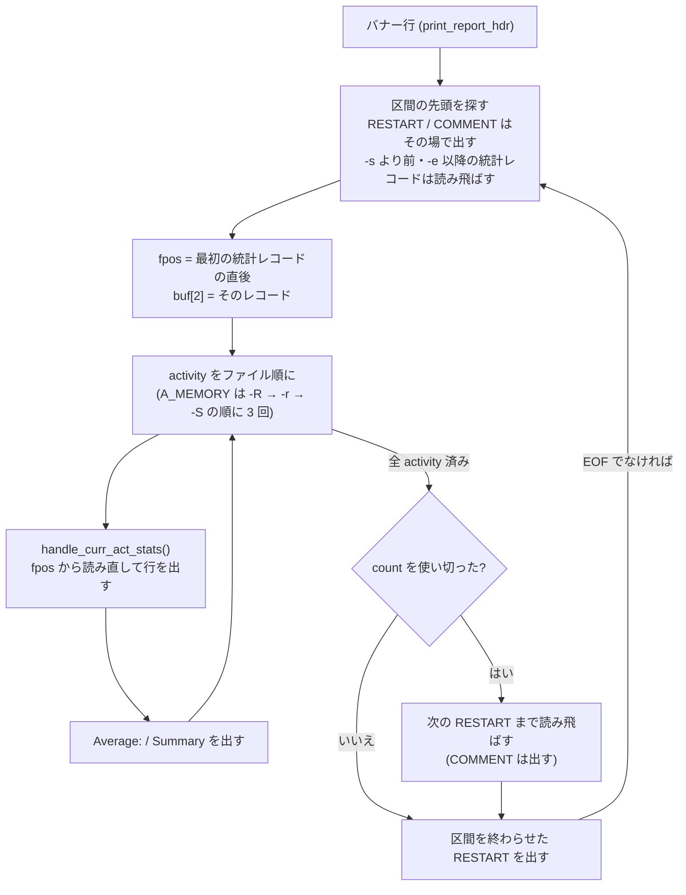

# RHEL / CentOS 7 の sysstat 10.1.5 (el7) の `sar` 出力

`--sar-profile sysstat-10.1.5-el7` を指定したときに reSARch が再現する出力の仕様である。
現行版 (v12.8.0) の出力仕様は [`03-output-format.md`](03-output-format.md) にあり、
この文書はそこからの**違い**を中心に書く。

実装は `src/series/el7.rs` (計算)、`src/output/sar_el7.rs` (描画)、
`src/cli/sar_el7_args.rs` (引数) にあり、現行版の経路とは共有しない
([`../design.md`](../design.md) §9.1)。

---

## 1. 位置づけ

### 1.1 何を再現するか

RHEL / CentOS 7 のホストで `sa2` が毎晩書く `sarDD` (= `sar -A` のテキスト) と、
同じホストで `sar` を打ったときの画面出力。reSARch の既定 (現行版の書式) で
同じ sa ファイルを出すと、列の構成も値の求め方も違うため、全文は一致しない。

| 項目 | 内容 |
|---|---|
| 対象パッケージ | `sysstat-10.1.5-17.el7` 〜 `sysstat-10.1.5-20.el7_9` (CentOS 7.6 〜 7.9) |
| 読めるファイル | `format_magic` 0x2171 だけ (本家 10.1.5 も他の世代は読めない) |
| 対象の出力 | `sar` のテキストだけ。`sadf` 互換出力は対象外 |
| 選び方 | `sar` / `sa2sar` の `--sar-profile sysstat-10.1.5-el7`。自動では切り替えない |

### 1.2 版番号だけで名乗らない理由

el7 のパッケージは upstream の 10.1.5 に 40 本以上のパッチを当てており、そのうち次が
`sar` の出力に効く。**配布物の単位で検証した**ので、名前も配布物の単位にしてある。

| パッチ | 出力への効き方 |
|---|---|
| `sysstat-10.1.5-max-cpus.patch` | `NR_CPUS` を 2048 → 8192。`-A` / `-P ALL` の 1 サンプルが 8200 行と数えられ、列見出しの再表示間隔が変わる (upstream の 10.1.5 は 2056 行) |
| `sysstat-10.1.5-dyn-tick.patch` | `ll_s_value()` / `ll_sp_value()` が、後の値が小さいとき 32bit の巻き戻りとして補正せず 0 を返す |
| ファイルシステム統計のバックポート (0001〜0021) | `-F [MOUNT]` と `A_FILESYSTEM` (id 37、magic 0x8a、336 バイト) を足し、`-A` にも含める |
| `0001-sar-make-buffers-that-hold-timestamps-bigger.patch` | タイムスタンプのバッファを広げるだけ (C ロケールでは出力は変わらない) |

`-17.el7` と `-20.el7_9` の差は `sadc` / `pidstat` / man の修正だけで、`sar` の出力は同じ。

### 1.3 自動で切り替えない理由

ファイルヘッダの版は「sa ファイルを書いた `sadc` の版」であり、`sa2` が使った `sar` の版とも、
配布元のパッチとも一致する保証がない。`-R` の換算に使うページサイズ (§4.4) も
ファイルからは分からない。推定で書式と計算を切り替えると、同じファイルの出力が
利用者の知らないうちに変わるので、常に明示指定にしている。

---

## 2. 描画の流れ

骨格は現行版と同じ「区間 × activity ごとにファイルを読み直す」形だが、細部が違う。

描画の前に、本家の `check_file_actlst()` と同じ判定でファイルの activity を選ぶ。

| 場合 | 扱い |
|---|---|
| el7 が知らない id、または magic の違う activity | 宣言された `size × nr × nr2` だけ読み飛ばし、表示しない |
| el7 と同じ magic の `A_CPU` が無い | `Invalid system activity file` で止める |
| 選んだ activity の id がファイルに 1 つも無い | `Requested activities not available` で止める |
| 選んだ activity の id はあるが magic が違う | 止めない。**この判定は magic を見ない**ので、バナーと、最初の統計レコードより前の COMMENT / RESTART だけを出して正常に終わる |



`handle_curr_act_stats()` の中の 1 反復:

1. レコードを読む (EOF・RESTART を読んだ反復でも、次の 2. は行う)
2. `lines >= rows || lines == 0` なら `lines = 0` にして見出しを出す印を立てる
3. COMMENT なら (`-C` と時刻範囲を満たせば) `COM` 行を出し、**`lines` を 1 増やす**
4. 統計レコードなら `write_stats()`。表示したら `lines` に `inc` を足す
5. `count` を使い切るか、EOF か RESTART なら抜ける

`inc` はビットマップを使う activity (`A_CPU` / `A_IRQ` / `A_PWR_CPUFREQ` /
`A_PWR_WGHFREQ`) ならビットマップの立ちビット数、それ以外は **`file_activity.nr`**
(ファイル単位の固定値) である。

`write_stats()` は、表示するかどうかを次の順に決める。

1. `next_slice(buf[2] の uptime0, 現レコードの uptime0, …)` が偽なら出さない。
   **`-i` を指定しなくても毎回呼ばれる**ので、記録間隔が 0.5 秒未満のレコードは出ない
2. `-s` 指定時に日付の変わり目を検出したら `cross_day` を立てる (**プロセス全体で 1 回立ったら戻らない**)
3. `-s` より前なら出さない
4. `-e` より後なら `count = 0` にして出さない
5. `avg_count` を増やして `f_print` を呼ぶ

---

## 3. 行の書式

### 3.1 特殊レコード

| 行 | 書式 | 現行版との違い |
|---|---|---|
| RESTART | `"\n%-11s       LINUX RESTART\n"` | `(N CPU)` を付けない |
| COMMENT | `"%-11s  COM %s\n"` | 本文 (NUL の手前、最大 63 バイト) をそのまま出す。非印字文字を置き換えない |

どちらも `-s` / `-e` の範囲外なら出さない (日付の変わり目の補正はしない)。

### 3.2 列見出しの再表示

`rows` は `get_win_height()`。標準出力が端末で `ws_row > 2` なら `ws_row - 2`、
それ以外は 86400。**`S_REPEAT_HEADER` は読まない** (後の版で入った変数)。
`S_TIME_FORMAT=ISO` はバナー行の日付にだけ効く (現行版と同じ)。

`-A` / `-P ALL` は CPU ビットマップ全体 (`BITMAP_SIZE(8192)` = 1025 バイト) を立てるので、
1 サンプル = 8200 行と数えられ、パイプ出力でも **11 サンプルごと**に CPU の見出しが出る。
平均行の見出しは、最後の反復で決まった印をそのまま使う。

### 3.3 平均行のラベル

| activity | 見出しの時刻欄 | 行の時刻欄 |
|---|---|---|
| USB (`-m USB`) | `Summary` | `Summary` |
| FS (`-F`) | `Summary:` | `Summary` (コロン無し) |
| それ以外 | `Average:` | `Average:` |

---

## 4. activity ごとの列と式

`S_VALUE(m, n, p)` は `((double)(n - m)) / p * HZ`、`SP_VALUE(m, n, p)` は
`((double)(n - m)) / p * 100`。**`n - m` は C の型の幅で巻き戻る**
(`unsigned int` は 32bit、`unsigned long` は採取元の `sizeof(long)`)。
`HZ` は 100。`itv` は `record_header.uptime0` の差、`g_itv` は `uptime` (全 CPU の和) の差
(CPU 数 `nr <= 2` では `itv = g_itv`)。平均行の区間は `buf[2]` (区間の最初のレコード) から
最後に表示したレコードまで。

### 4.1 CPU (`-u` / `-u ALL`)

| 行 | 値 |
|---|---|
| `all` | **ファイルの集約スロット (item 0) を `g_itv` で割る** (現行版は個別 CPU の合計から作り直す) |
| 個別 CPU | その CPU の tick 合計の差 (`get_per_cpu_interval()`) で割る |
| オフライン CPU (8 フィールドの和が 0) | **0.00 を並べる** (`%idle` も 0.00)。現サンプルを前サンプルで**上書き**するので、復帰後の差分は上書き後の値から取られる |
| tickless (tick の差が 0) | `-u` は `0.00 × 5` と `100.00`、**`-u ALL` は 9 列しか出ない** (`%gnice` の位置に 100.00、`%idle` 列が無い。本家の不具合) |

- `%idle` は後の値が小さければ 0.00
- `-u ALL` の `%usr` / `%nice` は `user - guest` / `nice - guest_nice` が減っていれば 0.00
- 列は `"    %6.2f"` (空白 4 個 + 6 桁)

### 4.2 列が現行版と違う activity

| オプション | el7 の列 | 主な式 |
|---|---|---|
| `-B` | `pgpgin/s … pgsteal/s %vmeff` | `%vmeff = Δpgsteal / Δ(pgscan_kswapd + pgscan_direct) × 100` (分母 0 なら 0.00) |
| `-b` | `tps rtps wtps bread/s bwrtn/s` | すべて `S_VALUE` |
| `-R` | `frmpg/s bufpg/s campg/s` | kB をページへ直してから差を取る (§4.4) |
| `-r` | `kbmemfree kbmemused %memused kbbuffers kbcached kbcommit %commit kbactive kbinact kbdirty` | `kbmemused = tlmkb - frmkb`、`%commit = comkb / (tlmkb + tlskb)` |
| `-H` | `kbhugfree kbhugused %hugused` | |
| `-d` | `DEV tps rd_sec/s wr_sec/s avgrq-sz avgqu-sz await svctm %util` | `rd_sec/s` / `wr_sec/s` は `ll_s_value`、`avgrq-sz` はセクタ単位、`svctm = util / tput` |
| `-n DEV` | `%ifutil` が無い | |
| `-y` | 見出しは `xmtin/s` (`activity.c` の `txmtin/s` ではない) | 回線番号が前サンプルと違えば `N/A` |
| `-n ETCP` | 再送列は `retrans/s` | |
| `-I` | 行 = 割り込み、`INTR intr/s` の 2 列 | 合計行は `sum` |

### 4.3 平均の整数除算

平均は「表示した値の累積 ÷ `avg_count`」だが、一部の列は**整数で割ってから** `double` にする。

| 列 | 式 |
|---|---|
| `%memused` | `(tlmkb - (Σfrmkb / n)) / tlmkb` (`tlmkb` は最後のサンプル) |
| `%commit` | `(Σcomkb / n) / (tlmkb + tlskb)` |
| `kbmemused` | `tlmkb - Σfrmkb / n` (こちらは浮動小数) |
| `%swpused` | `((Σtlskb / n) - (Σfrskb / n)) / (Σtlskb / n)` (すべて整数除算) |
| `kbswpcad` | `Σcaskb / n` (整数除算) |
| `%swpcad` | `(Σcaskb / n) / (Σtlskb / n - Σfrskb / n)` (分子だけ整数除算) |
| `%hugused` | `%swpused` と同じ形 |
| `ldavg-*` | `Σload_avg / (n × 100)` |

例: 2 サンプルの `kbswpcad` が 15 と 16 なら、平均は 15.5 だが el7 は整数で割って `15` と出す
(現行版は `(double)` で割って 15.5 を偶数丸めし `16`)。

### 4.4 `-R` のページサイズ

```text
frmpg/s = ((double)(frmkb_curr >> kb_shift) - (double)(frmkb_prev >> kb_shift)) / itv * HZ
```

`kb_shift` は**`sar` を実行したホストの**ページサイズから決まり
(`sysconf(_SC_PAGESIZE)`)、ファイルには記録されない。
`--sar-page-size` (既定 4096) で指定する。RHEL 7 の x86_64 / s390x は 4096、
ppc64 / ppc64le / aarch64 は 65536 が標準である。

### 4.5 NIC とディスクの再登録

前サンプル (平均行では `buf[2]`) の枠を**書き換える**判定がある。

- `-n DEV`: 同じ名前の枠でカウンタが 1 つでも減っていれば、桁あふれ (バイト数だけが減り、
  パケット数が増え、前の値が `ULONG_MAX / 2` を超える) でない限り枠を 0 に戻す
- `-n EDEV`: 同じ名前の枠で `rx_errors` 以外のカウンタが減っていれば 0 に戻す
- `-d`: 同じ major/minor の枠で `nr_ios` / `rd_sect` / `wr_sect` が揃って減っていれば 0 に戻す
- 見つからなければ空き枠 (NIC は名前が `?`、ディスクは major + minor が 0) か、
  同じ位置の枠を 0 に戻して使う

### 4.6 デバイス名

`-p` は本家では**実行ホスト**の `/sys/dev/block` と `sysstat.ioconf` から名前を引く。
他ホストのファイルでは誤名になるので reSARch は引かず、`dev<major>-<minor>` のまま出す
(本家も Linux 以外のホストで読めば同じになる)。
`-j` (永続デバイス名) は実行ホストの `/dev/disk/by-*` を引くので、理由を添えて拒否する。

---

## 5. 引数

el7 の `sar.c: main()` と `sa_common.c` の解析関数に従う。現行版との主な違い:

| オプション | el7 | 現行版 |
|---|---|---|
| `-h` | ヘルプ | `--pretty --human` |
| `-I` | `SUM` / `ALL` (先頭 16 本) / `XALL` / 番号のカンマ区切り | `SUM` / `ALL` と `--int=` |
| `-R` | あり | なし |
| `-A` | 全 activity + `-P ALL` + `-I` 全ビット + `-u ALL` + `-R -r -S` | `-r ALL` など |
| `-f` の省略 | `SA_DIR/saDD` | `saDD` と `saYYYYMMDD` の新しい方 |
| `-r ALL` / `-q ALL` / `-x` / `-z` / `--dec=` / `--human` / `--dev=` など | usage | あり |
| `-o` | reSARch は採取しないので拒否 | 同左 |

数値と日付の読み方も本家の C の関数のとおりにする。

- `-f` のファイル名を省いたときの日付は、**`-f` を読んだ時点の `-N`** で決まる。
  `sar -f -1` は当日、`sar -1 -f` は前日のファイルになる。`-f` 自体を省いたときだけ
  最後の `-N` を使う
- `-P` / `-I` の番号は `atoi()` (glibc では `(int) strtol()`) で読む。`long` に収まって
  `int` にあふれる値は下位 32 ビットの符号付きになる (`-P 4294967296` は CPU 0)
- `-s` / `-e` の時刻は 3・6 バイト目 (0 始まりで 2・5) を NUL にしてから各欄を `atoi()` する。
  区切り文字は問わず、多バイト文字の途中で切れても手前の数字を読む

---

## 6. 検証

### 6.1 実データ

CentOS 7 の実運用ホスト 1 台の sa ファイル 29 本と、同じホストの `sa2` が書いた
`sar` テキスト 29 本が、`S_TIME_FORMAT=ISO` でバイト単位に一致する
(実データはリポジトリに入れない)。

### 6.2 本家 el7 の `sar` との突き合わせ (ローカル)

本家 el7 の `sar` はソースからビルドできる。GPL のソースと出力はリポジトリに入れず、
リポジトリの外で次の手順を取る。

1. CentOS の vault から `sysstat-10.1.5-20.el7_9.src.rpm` を取得して展開する
2. spec の `%patch` 順に全パッチを当てる
3. `./configure --disable-nls --disable-sensors && make sar`。
   Linux 以外で動かす場合は `common.c` の `get_kb_shift()` を再現したいページサイズに固定する
4. 同じ sa ファイルと引数で本家と `resarch --sar-profile sysstat-10.1.5-el7` を実行し、
   `LC_ALL=C` と `TZ` を揃えて stdout と終了コードを比べる

この手順で作ったオラクルは、§6.1 の実データ 29 本を再現した。reSARch は
実データ 30 本 × 38 通りのオプションに加え、全 37 activity とオフライン CPU・tickless・
カウンタの逆行・NIC の再登録・ディスクの着脱・32bit の巻き戻り・COMMENT・RESTART・
夏時間・年跨ぎ・`-s` / `-e` / `-i` / count を含む合成データ 279 件で、
このオラクルと stdout・終了コードまで一致する。

### 6.3 リポジトリ内の回帰テスト

`tests/sar_el7.rs` が、el7 の構造体定義から独立に書き起こした 0x2171 のライタで
fixture を作り、式から手計算した値で el7 の癖 (CPU の集約スロット・オフライン・tickless、
平均の整数除算、ページサイズ、RESTART / COM 行、見出しの再表示、引数の誤り) を固定する。

---

## 7. 既知の限界

- `sadf` 互換出力は再現しない (`--sar-profile` を渡すとエラー)
- 32bit・ビッグエンディアンで採取されたファイルは、採取元と同じ ABI のホストで el7 の `sar` を
  動かしたときの値を出す (x86_64 の el7 で読んだときに化ける値は再現しない)
- `-p` / `-j` のデバイス名 (§4.6)
- ライブ採取 (`-o` や interval だけの指定) は行わない
